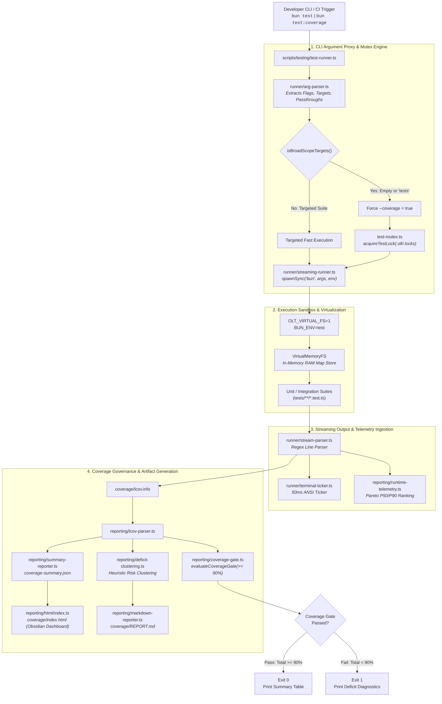
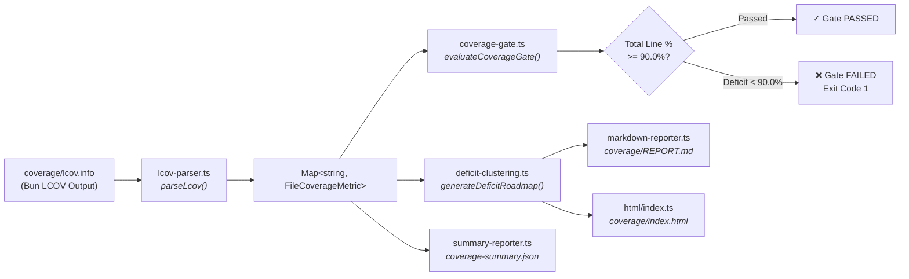

# Test Runner, Coverage Governance, and Performance Analytics Architecture

[](../../tsconfig.json)
[](../../scripts/testing/reporting/coverage-gate.ts)
[](../../bunfig.toml)
[](../../olt/scripts/src/testing/virtual-fs/index.ts)
[](../../scripts/testing/reporting/html/index.ts)

Welcome to the definitive architectural and operational specification for the test execution, coverage governance, and performance analytics subsystem in the **`@onurseckin/skills`** monorepo.

This system provides a unified, zero-overhead testing harness built natively for Bun and TypeScript. It combines a real-time terminal ticker, transparent argument proxying, automated fail-closed coverage enforcement, heuristic deficit clustering, in-memory filesystem virtualization, and an interactive obsidian dark-mode dashboard with bidirectional deep linking.

---

## 1. Executive Summary & Core Architectural Invariants

The testing subsystem is designed around four foundational invariants that guarantee deterministic, ultra-fast test execution while preventing coverage regressions and opaque runtime failures:

```
+---------------------------------------------------------------------------------------------------------+
|                                    CORE ARCHITECTURAL INVARIANTS                                        |
+------------------------------------+--------------------------------------------------------------------+
| INVARIANT                          | MECHANICAL ENFORCEMENT                                             |
+------------------------------------+--------------------------------------------------------------------+
| 1. Zero-Silent-Execution           | Streaming terminal ticker (50ms cadence) with live suite tracking,  |
|                                    | pass/fail counters, elapsed stopwatch, and unified summary table.  |
+------------------------------------+--------------------------------------------------------------------+
| 2. Universal Coverage Floor >= 90% | Fail-closed gate evaluation on all broad-scope suite runs.         |
|                                    | Non-zero exit code (1) if line coverage falls below 90.0%.          |
+------------------------------------+--------------------------------------------------------------------+
| 3. Zero-Physical-Disk Unit Testing | Hermetic `VirtualMemoryFS` engine loaded via `OLT_VIRTUAL_FS=1`.   |
|                                    | Eliminates disk I/O bottlenecks and OS lock contention.            |
+------------------------------------+--------------------------------------------------------------------+
| 4. Deep-Linked Observability       | Widescreen Obsidian dark-mode dashboard with hash routing for      |
|                                    | source lines (`#coverage/path:L42`), runtimes, and tree hierarchy. |
+------------------------------------+--------------------------------------------------------------------+
```

### Architectural Overview



---

## 2. Real-Time Streaming Runner & Transparent Argument Forwarding

The test runner core is located under [`scripts/testing/runner/`](file:///Users/onurseckinsenoglu/repos/skills/scripts/testing/runner/). It serves as a high-performance proxy over Bun's native test engine (`bun test`), adding non-blocking stream parsing, sub-second terminal feedback, process mutex concurrency locks, and transparent flag forwarding.

### 2.1 The 50ms Terminal Ticker (`terminal-ticker.ts`)

During large-scale test executions (70+ test suites and hundreds of individual test cases), static output leads to operator uncertainty. The [`TerminalTicker`](file:///Users/onurseckinsenoglu/repos/skills/scripts/testing/runner/terminal-ticker.ts#L41-L140) renders an active braille spinner with dynamic state metrics on a **50ms interval**.

```text
⠸ tests/testing/runner/streaming-runner.test.ts | 482 passed | 0 failed | 2 skipped | [1.84s]
```

#### Ticker Implementation Mechanics
- **Braille Spinner Frames**: Cycling through `["⠋", "⠙", "⠹", "⠸", "⠼", "⠴", "⠦", "⠧", "⠇", "⠏"]`.
- **Carriage Return Line Rewriting**: Uses `\r\x1b[2K` ANSI escape codes to overwrite the current terminal row in-place without flooding the scrollback buffer.
- **TTY & CI Awareness**: Checks `process.stdout.isTTY` and environment variables (`CI=1`, `TERM=dumb`). In non-interactive or CI environments, the interactive timer is disabled, and clean newline events are emitted for `suite_start` and `test_fail`.
- **Event-Driven Wakeup**: Even between interval timer ticks, whenever [`StreamParser`](file:///Users/onurseckinsenoglu/repos/skills/scripts/testing/runner/stream-parser.ts#L42-L232) detects an event, `ticker.tick(stats, activeSuite)` immediately refreshes the display.

```typescript
// scripts/testing/runner/terminal-ticker.ts
export class TerminalTicker {
  private timer: ReturnType<typeof setInterval> | null = null;
  private startTimeMs: number = 0;
  private frameIndex: number = 0;
  private isInteractive: boolean;
  private updateCadenceMs: number;
  private lastStats: RunnerStats = createDefaultRunnerStats();
  private activeSuite: string | null = null;

  public render(): void {
    if (this.stopped || !this.isInteractive) return;
    const elapsedMs = Date.now() - this.startTimeMs;
    const spinner = SPINNER_FRAMES[this.frameIndex % SPINNER_FRAMES.length];
    this.frameIndex++;

    const suiteDisplay = this.activeSuite ? this.activeSuite : "Initializing tests...";
    const line = `${ANSI.cyan}${spinner}${ANSI.reset} ${ANSI.bold}${suiteDisplay}${ANSI.reset} | ` +
      `${ANSI.green}${this.lastStats.testsPassed} passed${ANSI.reset} | ` +
      `${ANSI.red}${this.lastStats.testsFailed} failed${ANSI.reset} | ` +
      `${ANSI.yellow}${this.lastStats.testsSkipped} skipped${ANSI.reset} | ` +
      `${ANSI.dim}[${formatElapsedSeconds(elapsedMs)}]${ANSI.reset}`;

    this.out.write(ANSI.clearLine + line);
  }
}
```

### 2.2 Streaming Event Parser (`stream-parser.ts`)

Bun's test runner outputs test results and execution markers to standard output and standard error. [`StreamParser`](file:///Users/onurseckinsenoglu/repos/skills/scripts/testing/runner/stream-parser.ts#L42-L232) intercepts the streaming chunks via an incremental line buffer and emits typed events:

```typescript
// scripts/testing/runner/types.ts
export type StreamEvent =
  | { readonly type: "suite_start"; readonly file: string }
  | { readonly type: "test_pass"; readonly suite: string; readonly name: string; readonly durationMs?: number }
  | { readonly type: "test_fail"; readonly suite: string; readonly name: string; readonly durationMs?: number }
  | { readonly type: "test_skip"; readonly suite: string; readonly name: string }
  | { readonly type: "summary"; readonly pass: number; readonly fail: number; readonly expectCalls?: number; readonly totalDurationMs?: number }
  | { readonly type: "raw_line"; readonly text: string; readonly stream: "stdout" | "stderr" };
```

#### Tokenization & Matching Grammar
1. **ANSI Code Stripping**: Custom zero-regex ANSI stripper (`stripAnsi`) extracts clean text without regex backtracking overhead.
2. **Suite Header Detection**: Matches files ending in `.test.ts`, `.spec.ts`, etc. (`/^([^\s:]+\.(?:test|spec)\.[a-zA-Z0-9]+):$/`).
3. **Pass / Fail / Skip Statuses**:
   - `(pass)` or `✓` &rarr; `test_pass`
   - `(fail)` or `✗` &rarr; `test_fail`
   - `(skip)`, `(todo)`, or `~` &rarr; `test_skip`
4. **Summary Detection**: Extracts total counts and execution time from lines like `Ran 523 tests across 72 files. [1.42s]`.

### 2.3 Transparent CLI Argument Proxy & Forwarder (`arg-parser.ts`)

The argument parser separates **wrapper-level options** (controlling the harness runner itself) from **native engine flags** (forwarded to `bun test`).

```typescript
// scripts/testing/runner/arg-parser.ts
export function parseRunnerArgs(rawArgs: readonly string[] = []): ParsedRunnerArgs;
export function buildBunTestArgs(parsed: ParsedRunnerArgs): string[];
```

#### Argument Forwarding Matrix

| Flag / Option | Target Subsystem | Semantics & Forwarding Behavior |
| :--- | :--- | :--- |
| `tests/unit/core` | Target Paths | Preserved in target file vector passed to `bun test`. |
| `--timeout <ms>` | Bun Engine | Defaults to `30000ms` (30s), forwarded as `--timeout <ms>`. |
| `--parallel` / `--no-parallel` | Bun Engine | Defaults to `--parallel`, sets concurrency workers if specified (`--parallel=4`). |
| `--max-concurrency <n>` | Bun Engine | Configures worker thread limits (`--max-concurrency 8`). |
| `--bail` / `-b` / `--bail=N` | Bun Engine | Fast fail on first error or after $N$ failures. |
| `-u` / `--update-snapshots` | Bun Engine | Updates snapshot fixtures on disk. |
| `-t` / `--test-name-pattern` / `--filter` | Bun Engine | Filter tests by pattern name. |
| `--coverage` / `--no-coverage` | Harness & Engine | Enables/disables LCOV collection and quality gate validation. |
| `--coverage-dir <dir>` | Harness & Engine | Target directory for artifacts (defaults to `coverage`). |
| `--coverage-reporter <rep>` | Harness & Engine | Reporters to invoke (defaults to `["lcov", "text"]`). |
| `--quiet` / `-q` | Wrapper | Suppresses non-essential runner stdout chatter. |
| `--ticker` / `--no-ticker` | Wrapper | Explicitly forces or disables the 50ms terminal braille ticker. |
| `--summary` / `--no-summary` | Wrapper | Toggles printing of final summary table. |
| `-- [args]` | Passthrough | All arguments following double-dash `--` are forwarded verbatim. |

> [!IMPORTANT]
> **Automatic Whole-Suite Coverage Invariant**:
> If the runner is invoked with broad-scope targets (e.g., `bun test`, `bun scripts/testing/test-runner.ts tests`, or empty target arguments), the argument parser **automatically injects `--coverage`** unless explicitly disabled via `--no-coverage`.

### 2.4 Process Mutex & Lock Governance (`test-mutex.ts`)

Running multiple heavy test suites concurrently leads to CPU throttling, port collision, and I/O starvation. [`test-mutex.ts`](file:///Users/onurseckinsenoglu/repos/skills/scripts/testing/test-mutex.ts) enforces mutual exclusion on broad test runs:

- **Lock File**: Stored at `.olt/.locks/broad-test.lock`.
- **Payload Schema**: `{ pid: number, scope: "broad", args: string[], startedAt: string }`.
- **Stale Lock Reclamation**: Before aborting on an existing lock, the system probes the PID via `process.kill(pid, 0)`. If the process has terminated (zombie or dead process), the lock is cleanly unlinked and acquired.
- **Signal Handling**: Registers `exit`, `SIGINT` (exit 130), `SIGTERM` (exit 143), and `uncaughtException` cleanup handlers to guarantee lock release on termination.

---

## 3. Default Whole-Suite Coverage & Mandatory 90% Quality Gate

The coverage governance subsystem under [`scripts/testing/reporting/`](file:///Users/onurseckinsenoglu/repos/skills/scripts/testing/reporting/) implements strict quality assurance, automated LCOV artifact generation, deficit clustering, and fail-closed quality gate evaluation.



### 3.1 Strict Coverage Gate Evaluation (`coverage-gate.ts`)

The repository enforces a mandatory **90.0% line coverage floor** (`DEFAULT_COVERAGE_THRESHOLD = 90.0`).

```typescript
// scripts/testing/reporting/coverage-gate.ts
export interface CoverageGateResult {
  readonly passed: boolean;
  readonly totalPct: number;
  readonly thresholdPct: number;
  readonly deficitPct: number;
  readonly filesCount: number;
  readonly failingFiles: readonly FailingFileCoverage[];
  readonly totalLinesCovered: number;
  readonly totalLinesTotal: number;
}
```

#### Fail-Closed Evaluation Rules
1. **Repository-Wide Floor**: $\text{totalPct} = \frac{\sum \text{linesCovered}}{\sum \text{linesTotal}} \times 100$. If $\text{totalPct} < 90.0\%$, the gate immediately fails.
2. **Deficit Calculation**: $\text{deficitPct} = 90.0 - \text{totalPct}$.
3. **Exit Code Override**: If the unit tests themselves passed (status `0`), but the coverage gate fails, the test runner overrides the exit status to **`1`**, failing the CI/pre-push pipeline.

### 3.2 Automated Coverage Deficit Clustering Engine (`deficit-clustering.ts`)

Rather than listing isolated uncovered line numbers, the Deficit Clustering Engine groups contiguous unexercised lines into logical risk clusters and applies pattern heuristics to categorize why the code was missed.

```
+-------------------------------------------------------------------------------------------------------+
|                                  DEFICIT CATEGORIZATION TAXONOMY                                      |
+----------------------+--------------------+-----------------------------------------------------------+
| CATEGORY             | BADGE              | HEURISTIC PATTERN CRITERIA                                |
+----------------------+--------------------+-----------------------------------------------------------+
| Error Handling       | 🛡️ error-handling   | `catch`, `throw`, `Error`, `reject`, `panic`, `fail`,     |
|                      |                    | `HarnessError`, exception branches.                       |
+----------------------+--------------------+-----------------------------------------------------------+
| Branching            | 🔀 branching        | `if`, `else`, `switch`, `case`, `guard`, `??`, `&&`, `||` |
|                      |                    | Short conditional guard clauses (&le; 2 lines).           |
+----------------------+--------------------+-----------------------------------------------------------+
| Initialization       | ⚙️ initialization  | `constructor`, `init`, `factory`, `bootstrap`, `static`,   |
|                      |                    | Top-of-file declarations (lines 1-10).                    |
+----------------------+--------------------+-----------------------------------------------------------+
| Unexercised Logic    | 🧩 unexercised-logic| `function`, `async`, `await`, `while`, `for`, `class`,    |
|                      |                    | Multi-line routine algorithms (&ge; 4 lines).             |
+----------------------+--------------------+-----------------------------------------------------------+
```

#### Contiguous Line Grouping Algorithm (`groupContiguousLines`)
Given an arbitrary array of uncovered line numbers (e.g., `[4, 5, 6, 12, 13, 25]`), the clustering engine sorts and collapses them into contiguous tuples:
$$\{[4, 6], [12, 13], [25, 25]\}$$

#### Impact Percentage Formula
For each cluster $c$, the engine calculates both repo-level and module-level potential gains:
$$\text{repoImpactPct}(c) = \frac{\text{lineCount}(c)}{\text{totalRepoLines}} \times 100$$
$$\text{fileImpactPct}(c) = \frac{\text{lineCount}(c)}{\text{totalFileLines}} \times 100$$

#### Prioritized Remediation Roadmap
Clusters across the entire codebase are sorted using multi-key descending priority:
1. `repoImpactPct` (Descending)
2. `lineCount` (Descending)
3. `fileImpactPct` (Descending)
4. `file` path (Lexicographical)
5. `startLine` (Ascending)

This produces an actionable roadmap displayed in both the terminal, `REPORT.md`, and the analytics dashboard:

```markdown
### 🚀 Prioritized Deficit Remediation Plan

| Rank | Target File & Range | Uncovered Lines | Repo Gain | File Gain | Category | Heuristic Detail |
| :--- | :--- | :--- | :--- | :--- | :--- | :--- |
| 1 | `scripts/testing/runner/streaming-runner.ts:85-91` | 7 lines | **+0.12%** | **+4.43%** | 🛡️ error-handling | `child.on("error", (err) => {` |
| 2 | `scripts/testing/reporting/coverage-gate.ts:74-80` | 7 lines | **+0.12%** | **+5.83%** | 🔀 branching | `if (fileThreshold !== undefined)` |
```

---

## 4. In-Memory Virtualization & Pareto Skew Remediation

A primary cause of slow and flaky test suites in complex agentic repositories is disk I/O latency, OS filesystem lock contention, and temporary directory cleanup failures.

To achieve sub-second execution across 70+ suites, the repository implements the [`VirtualMemoryFS`](file:///Users/onurseckinsenoglu/repos/skills/tests/testing/virtual-fs/virtual-memory-fs.test.ts) engine.

```
+---------------------------------------------------------------------------------------------------------+
|                                    PHYSICAL DISK VS VIRTUAL MEMORY FS                                   |
+----------------------------------------------------+----------------------------------------------------+
| TRADITIONAL DISK I/O TESTING                       | VIRTUAL MEMORY FS TESTING (OLT_VIRTUAL_FS=1)        |
+----------------------------------------------------+----------------------------------------------------+
| * Hundreds of physical disk writes to tmp/         | * Pure in-memory Map<string, string | Uint8Array>  |
| * File handle exhaustion and OS lock latency       | * Zero disk system calls (100x-1000x faster)       |
| * Leftover artifacts causing test pollution        | * Deterministic reset() after each test            |
| * Heavy Pareto skew (suites taking 1500-3000ms)    | * Hermetic execution (all suites complete < 150ms) |
+----------------------------------------------------+----------------------------------------------------+
```

### 4.1 In-Memory POSIX File System (`VirtualMemoryFS`)

The `VirtualMemoryFS` engine provides standard POSIX filesystem semantics in RAM:
- **Path Normalization**: Canonical POSIX paths with dot-segment resolution (`/a/b/../c` &rarr; `/a/c`).
- **Binary & UTF-8 Support**: Seamlessly reads and writes string content and `Uint8Array` buffers.
- **Recursive Directory Operations**: `mkdirSync(path, { recursive: true })` and `readdirSync(path, { withFileTypes: true, recursive: true })`.
- **Tree Snapshots**: `dumpTree()` and `loadSnapshot(tree)` for instant fixture hydration without disk access.
- **Safety Containment**: Strict boundary checks preventing reads/writes outside sandboxed paths.

```typescript
// tests/testing/virtual-fs/virtual-memory-fs.test.ts
const fs = new VirtualMemoryFS();
fs.loadSnapshot({
  "/config/policy.json": '{"autonomy": "guarded"}',
  "/tasks/task-001.md": "# Task Definition",
});

expect(fs.readFileSync("/config/policy.json", "utf-8")).toContain("guarded");
```

### 4.2 Deterministic Isolation Sandbox (`isolation.ts`)

The test sandbox helper [`createTestIsolationContext`](file:///Users/onurseckinsenoglu/repos/skills/tests/testing/isolation/isolation.test.ts#L91-L141) wraps test lifecycles with TypeScript `using` declarations (Explicit Resource Management):

```typescript
// tests/testing/isolation/isolation.test.ts
it("supports synchronous cleanup and dispose scopes", () => {
  using ctx = createTestIsolationContext({ prefix: "sync-disp" });
  ctx.writeTempFile("temp.txt", "content");
  expect(ctx.tempFileExists("temp.txt")).toBe(true);
  // Exiting scope automatically invokes [Symbol.dispose] and frees memory
});
```

### 4.3 Pareto Skew Telemetry & Latency Elimination

The runtime telemetry engine ([`runtime-telemetry.ts`](file:///Users/onurseckinsenoglu/repos/skills/scripts/testing/reporting/runtime-telemetry.ts)) continuously tracks suite latencies to identify and eradicate **Pareto Skew** (where 20% of tests consume 80% of total runtime):

- **Pareto 50 ($P_{50}$)**: Minimum set of test files that account for 50% of the cumulative suite execution time.
- **Pareto 90 ($P_{90}$)**: Minimum set of test files that account for 90% of cumulative execution time.

When slow test files are detected, migrating them to `VirtualMemoryFS` immediately drops them out of the $P_{50}/P_{90}$ hotspot list.

---

## 5. Widescreen Obsidian Dark-Mode Analytics Dashboard

When `--coverage` is active, the reporting engine generates an ultra-modern, standalone, zero-dependency HTML dashboard at `coverage/index.html`.

### 5.1 Obsidian Theme Visual System

The dashboard visual style is inspired by modern developer IDEs and knowledge bases:

```css
/* scripts/testing/reporting/html/styles.ts */
:root {
  --bg-base: #080b11;             /* Deep obsidian void background */
  --bg-surface: #0f172a;          /* Dark slate elevated container */
  --bg-card: #1e293b;             /* Charcoal card container */
  --bg-hover: #334155;            /* Hover row highlight */
  --border-subtle: #334155;       /* Subtle slate border */
  --border-strong: #475569;       /* Active card border */
  --text-main: #f8fafc;           /* High-contrast bright text */
  --text-muted: #94a3b8;          /* Muted metadata text */
  --text-dim: #64748b;            /* Dim timestamp text */
  --brand-accent: #6366f1;        /* Indigo electric accent */
  --status-pass: #10b981;         /* Emerald 100% passing glow */
  --status-warn: #f59e0b;         /* Amber warning */
  --status-fail: #ef4444;         /* Ruby red deficit / failure */
}
```

### 5.2 The Three Core Views

The dashboard layout features a sticky header with live coverage status badges, density toggles (**Comfortable** vs. **Compact**), and three primary tabs:

```
+---------------------------------------------------------------------------------------------------------+
| [⚡ Skills Test Suite & Performance]          [96.4% Line Coverage]              2026-09-01 12:00:00    |
+---------------------------------------------------------------------------------------------------------+
| [ 📊 Coverage Matrix ]    [ ⚡ Test Runtime Ranking ]    [ 🌳 Unified Hierarchy ]     [Comfortable|Compact] |
+---------------------------------------------------------------------------------------------------------+
```

#### View 1: 📊 Coverage Matrix View
- **Radial SVG Gauges**: High-resolution circular SVG gauges for **Lines**, **Statements**, and **Functions** coverage percentages.
- **Interactive Breadcrumb Navigation**: Drill down through directories (`📦 root / scripts / testing / runner`) with instant filtering.
- **Source Code Viewer**: Deep inspection mode rendering source code with:
  * Line numbers with click-to-copy deep link anchors (`selectLine(path, lineNo)`).
  * Line execution hit counts (`0x` in red, `12x` in green).
  * **Uncovered Line Jump Chips**: Quick navigation pills (`L42`, `L89`) that smoothly scroll to deficit segments.

#### View 2: ⚡ Test Runtime Ranking Leaderboard
- **KPI Summary Grid**: Total Duration, Mean & Median latency, $P_{50}$ and $P_{90}$ concentration counts, and the Slowest Test File.
- **Ranked Leaderboard Table**: Shows rank (#1 to #N), test filename, duration in ms, percentage time share, visual distribution bar, and status badge (`PASS` / `FAIL`).
- **Matrix Cross-Linking**: Each test file row includes a direct `📄 Matrix` badge that jumps to the matching source code in the Coverage Matrix.
- **Pagination Controls**: Configurable 50-item pages with search filtering.

#### View 3: 🌳 Unified Hierarchy & Tree View
- **Nested Folder Tree Table**: Combines structural repository directories with full coverage statistics and test runtimes.
- **Expand / Collapse All Controls**: One-click expansion or collapse of all folders.
- **Hotspot Badges**: Highlights nodes with `🎯 P50` (top 50% runtime) or `📈 P90` (top 90% runtime) indicators.
- **Filter Presets**: Quick filters for **All**, **Needs Coverage (< 100%)**, **Slow (P50/P90)**, **Failing**, and **100% Perfect**.

### 5.3 Bidirectional Deep-Link Routing Engine (`client-script-deeplink.ts`)

The dashboard features a full URL hash router that serializes state to the window hash and restores view state upon page load or browser back/forward navigation:

```typescript
// scripts/testing/reporting/html/client-script-deeplink.ts
export interface HashRoute {
  readonly tab: "coverage" | "runtime" | "unified";
  readonly path?: string | undefined;
  readonly line?: number | undefined;
  readonly search?: string | undefined;
  readonly file?: string | undefined;
  readonly filter?: string | undefined;
}
```

#### Supported Deep-Link Syntax

| URL Hash Pattern | View & Action Triggered |
| :--- | :--- |
| `#coverage` | Opens root Coverage Matrix directory view. |
| `#coverage/scripts/testing/runner` | Opens folder view scoped to `scripts/testing/runner`. |
| `#coverage/scripts/testing/test-runner.ts` | Opens source file code viewer for `test-runner.ts`. |
| `#coverage/scripts/testing/test-runner.ts:L42` | Opens code viewer, scrolls to Line 42, and highlights it with a red pulsing border. |
| `#coverage?filter=miss` | Filters Coverage Matrix to only show files with uncovered lines. |
| `#runtime` | Opens Test Runtime Ranking leaderboard. |
| `#runtime?file=tests/testing/runner/streaming-runner.test.ts` | Jumps to runtime leaderboard, scrolls to the test file row, and highlights it. |
| `#runtime?search=virtual` | Filters runtime leaderboard by keyword `virtual`. |
| `#unified` | Opens Unified Hierarchy Tree view. |
| `#unified/scripts/testing?filter=slow` | Opens Unified Tree, expands `scripts/testing`, and filters for P50/P90 slow tests. |

---

## 6. Developer Workflows & CLI Runbook

This section details everyday commands, pre-push verification pipelines, configuration flags, and troubleshooting steps.

### 6.1 Common CLI Commands

#### 1. Standard Suite Execution
Runs all test suites across the repository. Broad-scope execution automatically enables the 50ms terminal ticker, coverage collection, and 90% quality gate enforcement:
```bash
bun test
# or explicitly:
bun scripts/testing/test-runner.ts tests
```

#### 2. Fast Changed-Files Test Runner (`test:changed`)
Uses git diff analysis to identify modified source files and only executes the unit tests affected since `origin/main` or `HEAD~1`:
```bash
bun run test:changed
```

#### 3. Targeted Test Execution (Bypasses Broad Mutex Lock)
Run a specific test file or directory without acquiring the broad-suite mutex lock or collecting repository-wide coverage:
```bash
bun scripts/testing/test-runner.ts tests/testing/runner/streaming-runner.test.ts
```

#### 4. Explicit Coverage Report Generation
Runs the full suite, builds `coverage/lcov.info`, `coverage-summary.json`, `REPORT.md`, and `coverage/index.html`:
```bash
bun run test:coverage
```

#### 5. Filtering Tests by Name Pattern
```bash
bun scripts/testing/test-runner.ts --filter "VirtualMemoryFS"
# or using short flag:
bun scripts/testing/test-runner.ts -t "VirtualMemoryFS"
```

#### 6. Updating Snapshots
```bash
bun scripts/testing/test-runner.ts -u
```

#### 7. Fast Fail on First Failure (`--bail`)
```bash
bun scripts/testing/test-runner.ts --bail
# or stop after 3 failures:
bun scripts/testing/test-runner.ts --bail=3
```

### 6.2 Pre-Push & CI Pipeline Integration

Before code is pushed to remote branches or accepted into main, the following zero-compromise verification pipeline must execute cleanly:

```bash
# 1. Typecheck: Zero any types, zero ts-ignore
bun run typecheck

# 2. Linting: Zero ESLint/Oxlint errors
bun run lint

# 3. Format Check: Strict style compliance
bun run format:check

# 4. Modularity Boundary Verification
bun run modularity:check

# 5. Full Test Suite & >= 90.0% Coverage Quality Gate
bun run test:coverage
```

---

## 7. Troubleshooting & Operational Runbook

### Issue 1: `[LOCKED_TEST_RUNNER]` Duplicate Execution Blocked
**Symptom**: The runner exits with code 1 and logs:
```text
[LOCKED_TEST_RUNNER] A major test run is already active!
  PID: 12345
  Scope: tests
```
**Resolution**:
1. Check if the process is genuinely running: `ps -p 12345`.
2. If it was killed ungracefully without releasing the lock, the runner will automatically reclaim it if the PID is dead.
3. To manually clear a stale lock:
   ```bash
   rm -f .olt/.locks/broad-test.lock
   ```

### Issue 2: Quality Gate Fails Due to Deficit (`totalPct < 90.0%`)
**Symptom**: All tests pass, but runner exits with code 1:
```text
❌ [coverage-gate] Quality Gate FAILED: Overall Line Coverage is 88.4%, below the required 90.0% threshold (Deficit: -1.6%).
```
**Resolution**:
1. Open the Markdown report: `cat coverage/REPORT.md`.
2. Look at the **Prioritized Deficit Remediation Plan** table at the bottom of the report.
3. Focus on Rank 1 and 2 deficit clusters (typically missing error handling paths or switch branches).
4. Add targeted unit tests for those specific line ranges.
5. Open `coverage/index.html` in a browser and navigate to `#coverage?filter=miss` to inspect uncovered lines interactively.

### Issue 3: Virtual FS Path Not Found (`VirtualFSError: ENOENT`)
**Symptom**: A test throws `ENOENT` when accessing a path in `VirtualMemoryFS`.
**Resolution**:
1. Ensure all directories along the target path are created with `{ recursive: true }`:
   ```typescript
   virtualFS.mkdirSync("/workspace/data", { recursive: true });
   ```
2. Verify path normalization: paths starting with relative segments are resolved against `fs.cwd()`.

### Issue 4: Dashboard Deep Links Not Highlighting in Browser
**Symptom**: Navigating to `coverage/index.html#coverage/path:L42` opens the file but does not scroll to the line.
**Resolution**:
1. Ensure the line number exists in the file.
2. In local browser environments using `file://` protocols, verify JavaScript execution is enabled.

---

## 8. Architectural File Index

| File Path | Role & Purpose |
| :--- | :--- |
| [`scripts/testing/test-runner.ts`](file:///Users/onurseckinsenoglu/repos/skills/scripts/testing/test-runner.ts) | Master test runner CLI entrypoint & orchestrator. |
| [`scripts/testing/test-changed.ts`](file:///Users/onurseckinsenoglu/repos/skills/scripts/testing/test-changed.ts) | Git-diff-aware affected test runner. |
| [`scripts/testing/test-mutex.ts`](file:///Users/onurseckinsenoglu/repos/skills/scripts/testing/test-mutex.ts) | Process mutex lock governance & stale PID cleanup. |
| [`scripts/testing/runner/arg-parser.ts`](file:///Users/onurseckinsenoglu/repos/skills/scripts/testing/runner/arg-parser.ts) | Robust CLI argument parser & Bun command generator. |
| [`scripts/testing/runner/streaming-runner.ts`](file:///Users/onurseckinsenoglu/repos/skills/scripts/testing/runner/streaming-runner.ts) | Async streaming process spawner & ticker coordinator. |
| [`scripts/testing/runner/terminal-ticker.ts`](file:///Users/onurseckinsenoglu/repos/skills/scripts/testing/runner/terminal-ticker.ts) | 50ms interval braille terminal spinner & ticker renderer. |
| [`scripts/testing/runner/stream-parser.ts`](file:///Users/onurseckinsenoglu/repos/skills/scripts/testing/runner/stream-parser.ts) | Incremental stdout/stderr stream tokenizer & event emitter. |
| [`scripts/testing/runner/summary-table.ts`](file:///Users/onurseckinsenoglu/repos/skills/scripts/testing/runner/summary-table.ts) | ANSI-styled final execution summary box formatter. |
| [`scripts/testing/reporting/coverage-gate.ts`](file:///Users/onurseckinsenoglu/repos/skills/scripts/testing/reporting/coverage-gate.ts) | Mandatory >= 90% coverage gate evaluator. |
| [`scripts/testing/reporting/deficit-categorizer.ts`](file:///Users/onurseckinsenoglu/repos/skills/scripts/testing/reporting/deficit-categorizer.ts) | Heuristic classifier for uncovered code segments. |
| [`scripts/testing/reporting/deficit-clustering.ts`](file:///Users/onurseckinsenoglu/repos/skills/scripts/testing/reporting/deficit-clustering.ts) | Contiguous line grouping & prioritized deficit roadmap engine. |
| [`scripts/testing/reporting/lcov-parser.ts`](file:///Users/onurseckinsenoglu/repos/skills/scripts/testing/reporting/lcov-parser.ts) | High-performance LCOV line parser and metrics mapper. |
| [`scripts/testing/reporting/markdown-reporter.ts`](file:///Users/onurseckinsenoglu/repos/skills/scripts/testing/reporting/markdown-reporter.ts) | Generates `coverage/REPORT.md` summary & deficit roadmap. |
| [`scripts/testing/reporting/runtime-telemetry.ts`](file:///Users/onurseckinsenoglu/repos/skills/scripts/testing/reporting/runtime-telemetry.ts) | Parses timing telemetry and calculates Pareto 50/90 metrics. |
| [`scripts/testing/reporting/summary-reporter.ts`](file:///Users/onurseckinsenoglu/repos/skills/scripts/testing/reporting/summary-reporter.ts) | Builds standardized `coverage-summary.json`. |
| [`scripts/testing/reporting/html/index.ts`](file:///Users/onurseckinsenoglu/repos/skills/scripts/testing/reporting/html/index.ts) | Obsidian dark-mode interactive HTML dashboard generator. |
| [`scripts/testing/reporting/html/client-script-deeplink.ts`](file:///Users/onurseckinsenoglu/repos/skills/scripts/testing/reporting/html/client-script-deeplink.ts) | Bidirectional URL hash routing & deep link handler. |
| [`olt/scripts/src/testing/virtual-fs/index.ts`](file:///Users/onurseckinsenoglu/repos/skills/olt/scripts/src/testing/virtual-fs/index.ts) | POSIX in-memory RAM filesystem engine (`VirtualMemoryFS`). |
