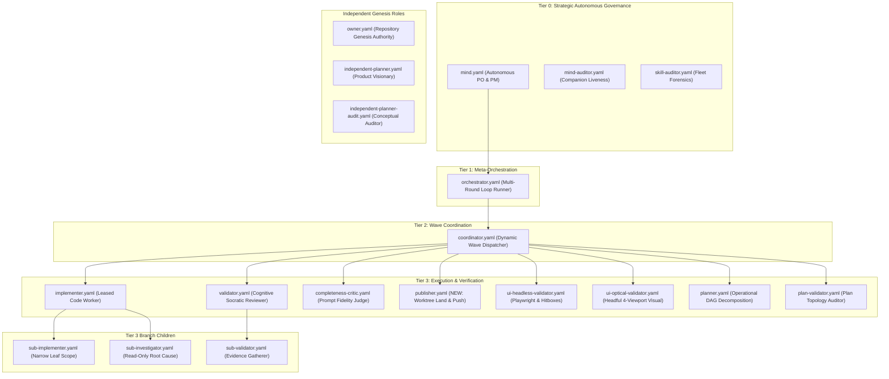

# Agent Taxonomy & Role Boundary Architecture Plan

> **Path-Integrity Audit Note (2026-09-07):** Verified against the current tree — this plan's
> Phases 1, 2, 4, and 5 (see `migration.md`) are **already executed**: `olt/agents/` now holds
> exactly the target roster (the 8 Phase-1 deletions and 2 Phase-2 host-wrapper deletions are gone;
> `publisher.yaml` from Phase 4 exists with `enable_write_tools: true`; `policy-discovery.yaml` from
> Phase 5 is gone). Phase 3's write-tool revocation is also confirmed (`enable_write_tools: false`
> in `mind.yaml`, `orchestrator.yaml`, `coordinator.yaml`; no `git commit`/`git push` in the
> coordinator's `olt/policy.json` `allowed_commands`). Phase 6 (ecosystem test/SSoT alignment) is
> **not** fully clean: `docs/planning/post-stabilization-roadmap/PLAN.md` records an open
> string-reference sweep for the retired role names across ~79 test files. Where this document
> below says a manifest "does not exist" or should be "deleted", that is the confirmed, intended
> post-condition, not staleness — do not recreate it. `fleet/archetypes.ts` and
> `fleet/contracts-tier3-exec.ts` mentioned in shorthand throughout this plan set live at
> `olt/scripts/src/agents/fleet/`.

## Executive Summary

The `@onurseckinsenoglu/skills` repository has evolved a sophisticated 4-tier autonomous agent ecosystem governed by [AGENTS.md](file:///Users/onurseckinsenoglu/repos/skills/AGENTS.md) and backed by [olt/policy.json](file:///Users/onurseckinsenoglu/repos/skills/olt/policy.json). However, an exhaustive forensic audit reveals critical architectural drift, role overlapping, and supervisory overloading across the 33 YAML definitions residing in [olt/agents/](file:///Users/onurseckinsenoglu/repos/skills/olt/agents):

1. **Manifest Proliferation & Duplication**: 33 YAML files exist, but 8 are dead or duplicate definitions (`worker.yaml`, `critic.yaml`, `repairer.yaml`, `mechanic-validator.yaml`, etc.) violating [§36 Zero-Backwards-Compatibility](file:///Users/onurseckinsenoglu/repos/skills/AGENTS.md#L136-L139).
2. **Host Wrapper Violations**: 2 host configurations (`generic.yaml` and `openai.yaml`) violate [§31 Canonical Host Directives](file:///Users/onurseckinsenoglu/repos/skills/AGENTS.md#L116-L123) which mandate strictly 4 canonical hosts (`antigravity`, `claude_code`, `codex`, `cursor`).
3. **Supervisory Role Overloading**: Tier 0 `mind`, Tier 1 `orchestrator`, and Tier 2 `coordinator` are burdened with operational plumbing (git commits, pushes, worktree landings, skill syncing) and erroneously hold `enable_write_tools: true` despite strict zero-code-edit prohibitions ([§12](file:///Users/onurseckinsenoglu/repos/skills/AGENTS.md#L49-L52), [§34](file:///Users/onurseckinsenoglu/repos/skills/AGENTS.md#L130-L132)).
4. **Missing Dedicated Tier 3 Publisher**: There is no dedicated release subagent. Coordinators and orchestrators perform low-level git plumbing directly, leaking execution noise into reasoning context.
5. **Deterministic Task Confusion**: Several deterministic tasks (typechecks, AST linting, policy calibration, worktree isolation) have lingering LLM agent manifests instead of being exclusively anchored in deterministic CLI tools.

This architectural plan specifies the complete rationalization of the agent taxonomy, strict role boundary remediation, the introduction of a dedicated Tier 3 `publisher`, and the elimination of all obsolete manifests.

---

## Modular Plan Structure

To preserve strict readability and maintain physical line length budgets ($\le 300$ physical lines per file), this specification is partitioned into modular architectural documents:

| Document                                                                                                                                          | Focus & Scope                                                                                                   |
| :------------------------------------------------------------------------------------------------------------------------------------------------ | :-------------------------------------------------------------------------------------------------------------- |
| [PLAN.md](file:///Users/onurseckinsenoglu/repos/skills/docs/planning/agent-taxonomy-and-role-boundary-plan/PLAN.md)                               | **Master Plan**: Executive summary, core axioms, target architecture, and phased roadmap.                       |
| [taxonomy.md](file:///Users/onurseckinsenoglu/repos/skills/docs/planning/agent-taxonomy-and-role-boundary-plan/taxonomy.md)                       | **Exhaustive Forensic Audit**: Granular breakdown of all 33 YAML definitions across 4 categories.               |
| [role-boundaries.md](file:///Users/onurseckinsenoglu/repos/skills/docs/planning/agent-taxonomy-and-role-boundary-plan/role-boundaries.md)         | **Role Division & Overloading**: Supervisory boundaries, permission fixes, and the Tier 3 `publisher`.          |
| [deterministic-gates.md](file:///Users/onurseckinsenoglu/repos/skills/docs/planning/agent-taxonomy-and-role-boundary-plan/deterministic-gates.md) | **Deterministic CLI vs LLM Agents**: Anchoring typechecks, policy calibration, forensics, and worktrees.        |
| [migration.md](file:///Users/onurseckinsenoglu/repos/skills/docs/planning/agent-taxonomy-and-role-boundary-plan/migration.md)                     | **Zero-Backwards-Compatibility Migration**: 6-phase execution schedule, file deletions, and verification gates. |

---

## Core Architectural Axioms

This plan strictly enforces the foundation principles of the repository:

1. **Streamlined Golden Roles Ecosystem ([§26](file:///Users/onurseckinsenoglu/repos/skills/AGENTS.md#L98-L101))**:
   - The active fleet converges on the **5 Golden Roles**: `mind` (Tier 0), `orchestrator` (Tier 1), `coordinator` (Tier 2), `implementer` (Tier 3), `validator` (Tier 3), augmented by `completeness-critic` (Tier 3), companion `mind-auditor` (Tier 0), fleet `skill-auditor` (Tier 0), and the new dedicated `publisher` (Tier 3).
2. **Supervisor Zero Direct Code Edits ([§12](file:///Users/onurseckinsenoglu/repos/skills/AGENTS.md#L49-L52), [§34](file:///Users/onurseckinsenoglu/repos/skills/AGENTS.md#L130-L132))**:
   - Tier 0, Tier 1, and Tier 2 supervisors must hold `enable_write_tools: false` and `can_edit_code: false`. All source file modifications must be strictly delegated to leased Tier 3 Implementers.
3. **Supervisor Operational Detachment**:
   - Supervisors must never execute low-level git mutation commands (`git commit`, `git push`, `worktree:land`). Git landing, pre-push gate verification, and remote synchronization are owned by the dedicated Tier 3 `publisher` subagent.
4. **Deterministic Tasks Belong in Deterministic Tools ([§26](file:///Users/onurseckinsenoglu/repos/skills/AGENTS.md#L98-L101))**:
   - Never burn LLM tokens or prompt cycles on mechanical operations that can be computed deterministically in milliseconds. Typechecks, AST invariant linting, policy discovery, and worktree tracking belong exclusively to deterministic CLI tools (`task:check`, `policy:init`, `worktree:*`).
5. **Zero Backwards Compatibility & Dead Code Elimination ([§36](file:///Users/onurseckinsenoglu/repos/skills/AGENTS.md#L136-L139))**:
   - Obsolete, duplicate, and superseded YAML manifests must be permanently deleted immediately. No shims, forwarding stubs, or legacy aliases are retained.
6. **Hierarchical Escalation Dispatch & Routing Journey Audit Trail**:
   - When an auditor (`skill-auditor`, `meta-auditor`) discovers an invariant violation or defect, it targets the responsible worker (`implementer`) directly.
   - If target is unavailable or inactive, dispatch systematically ascends the parent tree: `implementer` -> `coordinator` -> `orchestrator` -> `mind`.
   - Every escalation message embeds an explicit `[ROUTING_JOURNEY]` audit trail detailing every attempted hop, status, and final recipient.

---

## Target Clean Agent Taxonomy (20 Manifests)

The target ecosystem reduces the 33 YAML definitions down to **20 canonical, non-overlapping manifests**:



### Manifest Count Reconciliation:

- **Canonical Host Adapters (4)**: `antigravity.yaml`, `claude.yaml`, `codex.yaml`, `cursor.yaml` (moved to dedicated config directory or retained as pure host schemas).
- **Core Personas (8)**: `mind`, `mind-auditor`, `skill-auditor`, `orchestrator`, `coordinator`, `implementer`, `validator`, `completeness-critic`.
- **Domain UI Validators (2)**: `ui-headless-validator`, `ui-optical-validator`.
- **Planning & Genesis (5)**: `owner`, `independent-planner`, `independent-planner-audit`, `planner`, `plan-validator`.
- **Branch Children (3)**: `sub-implementer`, `sub-validator`, `sub-investigator`.
- **New Release Subagent (1)**: `publisher` (Tier 3).
- **Permanently Retired / Purged (13)**: `worker.yaml`, `critic.yaml`, `repairer.yaml`, `mechanic-validator.yaml`, `ui-validator.yaml`, `ui-visual-reviewer.yaml`, `ui-mechanic-validator.yaml`, `ui-debugger.yaml`, `generic.yaml`, `openai.yaml`, `policy-discovery.yaml` (converted to pure CLI).

---

## Phased Implementation Roadmap

```text
Phase 1: Obsolete Manifest Removal (Zero Backwards Compatibility)
  ├── Delete worker.yaml, critic.yaml, repairer.yaml, mechanic-validator.yaml
  └── Delete legacy UI duplicates (ui-validator.yaml, ui-visual-reviewer.yaml, ui-mechanic-validator.yaml, ui-debugger.yaml)

Phase 2: Host Platform Cleanup & Alignment
  ├── Delete generic.yaml and openai.yaml per AGENTS.md §31
  └── Verify 1:1 parity across antigravity.yaml, claude.yaml, codex.yaml, cursor.yaml

Phase 3: Supervisory Role Hardening & Permission Revocation
  ├── Revoke enable_write_tools from mind.yaml, orchestrator.yaml, coordinator.yaml
  ├── Remove git commit, git push, and worktree:land from coordinator.yaml commands
  ├── Synchronize olt/policy.json RBAC blocks with YAML manifests
  └── Wire Hierarchical Escalation Dispatch Protocol (Parent-Tree Fallback) & [ROUTING_JOURNEY] into skill-auditor

Phase 4: Dedicated Tier 3 Publisher Subagent Implementation
  ├── Author canonical olt/agents/publisher.yaml
  ├── Register publisher in olt/policy.json (Tier 3, allowed_commands: worktree:land, git, sync)
  ├── Add publisher contract to fleet archetypes and matrix
  └── Update Coordinator wave lifecycle to dispatch publisher on wave completion

Phase 5: Policy Discovery & Mechanic CLI Clarification
  ├── Retire policy-discovery.yaml into deterministic CLI tool `policy:init`
  └── Ensure AGENTS.md, docs, and test fixtures reference only canonical roles

Phase 6: Comprehensive Verification & Regression Immunity
  ├── Run fleet contract validation tests (bun test tests/roles/ecosystem/)
  ├── Run RBAC verification tests (bun test tests/policy/)
  └── Verify full monorepo cleanliness and documentation links
```

---

## Quality Invariants & Verification Checklist

- [x] Every document in this planning module is strictly $\le 300$ physical lines.
- [x] Zero hallucinations: every agent, command, path, and test exists in the codebase.
- [x] 0 edits made to `olt/scripts/` during planning (only documentation under `docs/planning/`).
- [x] Clickable markdown links formatted with `file:///` scheme across all references.
- [x] Strict adherence to Conventional Commits and monorepo quality standards.
