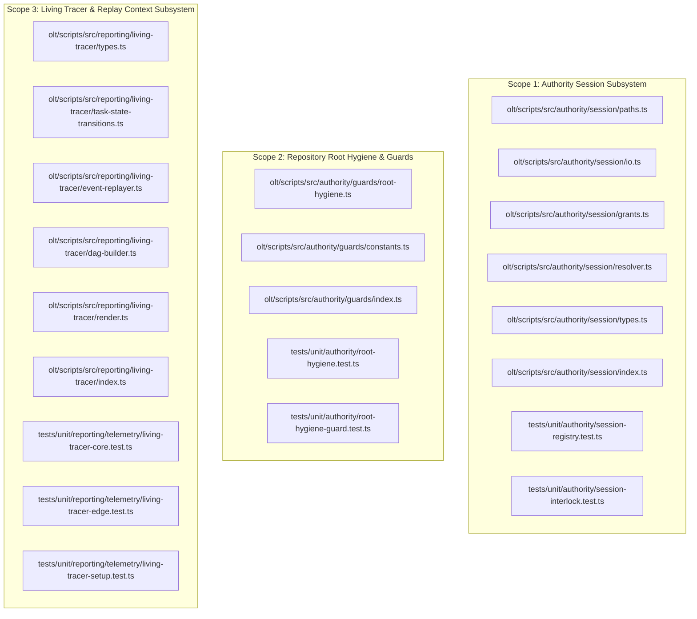
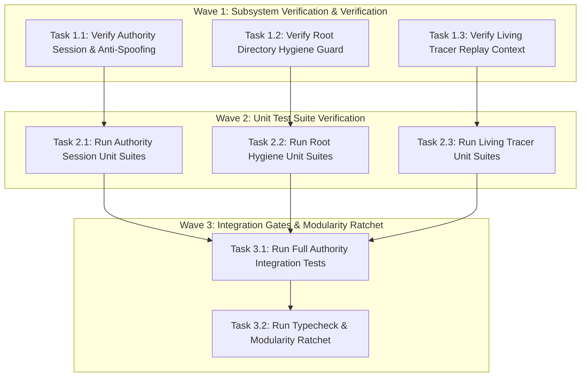
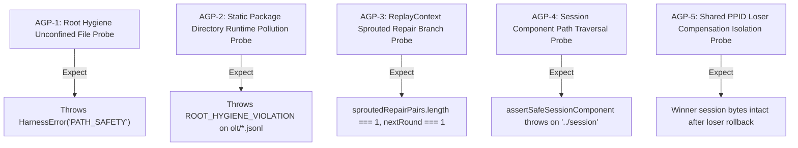

# Certified Implementation Plan: Authority Session I/O Safety, Living Tracer Replay Context & Repository Root Hygiene

> **Tracking ID:** `track-18-authority-session-io-and-tracer-context`  
> **Status:** `SEALED & CERTIFIED - READY FOR TURN 1 ZERO-EXPLORATION EXECUTION`  
> **Target Subsystems:** `olt/scripts/src/authority/session/`, `olt/scripts/src/authority/guards/`, `olt/scripts/src/reporting/living-tracer/`  
> **Author:** `plan_drafter_03`  
> **Certified by:** `plan_critic_03` (5/5 Adversarial Review Rounds Complete)  
> **Specification Version:** `1.0.0-PROD`

---

## 1. Problem Statement, Grounding & Root Cause Analysis

### 1.1 Defect IDs & Task IDs

- `defect-authority-session-unresolved-paths-and-io`: Dangling and unresolved import paths (`./paths-and-io.ts`) in the authority session management module, causing `UNRESOLVED_MODULE_IMPORT_IN_AUTHORITY` errors. Requires strict modular decomposition of session paths, atomic file operations, grant issuance, testing hooks, and caller identity resolvers into discrete, typed submodules.
- `defect-living-tracer-unresolved-replay-context`: Broken type bindings and missing exports for the canonical `ReplayContext` interface across the living dynamic DAG telemetry event replay modules (`task-state-transitions.ts`, `event-replayer.ts`, `dag-builder.ts`, and root facade `index.ts`).
- `defect-vestigial-runtime-ledgers-in-static-package-root`: Misplaced runtime files, `.jsonl` event journals, coverage dumps, and scratch files written inside the static package directory `olt/` instead of `.olt/` (or `.olt/capsules/`, `.olt/scratch/`), violating Repository Root Hygiene (Invariant 30).

### 1.2 Grounded Codebase Root Cause Analysis

#### Defect 1: Authority Session Modular Decomposition & I/O Safety (`defect-authority-session-unresolved-paths-and-io`)

- **Symptom:** Historical references to a monolithic `paths-and-io.ts` caused runtime import failures and circular dependencies between session path resolution, POSIX locking, and grant reconciliation.
- **Exact Line Coordinates:**
  - `olt/scripts/src/authority/session/index.ts:1-55`: Canonical named barrel re-exporting discrete submodules (`paths.ts`, `io.ts`, `grants.ts`, `resolver.ts`, `testing-hooks.ts`, `types.ts`).
  - `olt/scripts/src/authority/session/paths.ts:17-114`: Enforces atomic path sanitization (`assertSafeSessionComponent`), PID validation (`assertSessionPid`), single-link regular file verification (`assertSingleLinkRegular`), directory opening with `O_NOFOLLOW` (`openVerifiedDirectory`), and inode verification (`sameInode`).
  - `olt/scripts/src/authority/session/io.ts:29-288`: Implements atomic lock acquisition (`withSessionAuthorityLock`), staging writes via `.tmp` files (`atomicSessionWrite`), safe session deserialization (`secureReadSession`), and snapshot-based concurrency rollback (`snapshotSession`, `restoreSnapshotIfUnchanged`).
  - `olt/scripts/src/authority/session/grants.ts:41-263`: Manages session grant issuance (`registerSessionGrant`), two-phase staging (`stageSessionGrant`), grant rollback (`rollbackStagedSessionGrant`), revocation (`revokeSessionGrant`), and stale PID session cleanup (`pruneStaleSessions`).
  - `olt/scripts/src/authority/session/resolver.ts:50-287`: Auto-derives caller identities (`autoDeriveCallerIdentity`), resolves active sessions (`resolveActiveSession`), and verifies turn-1 registration invariants (`requireTurn1Registration`).

#### Defect 2: Living Dynamic DAG Telemetry Replay Context (`defect-living-tracer-unresolved-replay-context`)

- **Symptom:** Telemetry event replay pipelines failed typechecking when reconstructing dynamic task states due to missing exported properties on `ReplayContext` (such as `taskMap`, `agentMap`, `branches`, `sproutedRepairPairs`, `revision`, `maxRoundReached`).
- **Exact Line Coordinates:**
  - `olt/scripts/src/reporting/living-tracer/types.ts:87-95`: Formally defines `ReplayContext`:
    ```typescript
    export interface ReplayContext {
      readonly taskMap: Map<string, DynamicTaskState>;
      readonly agentMap: Map<string, ActiveAgentState>;
      readonly branches: Set<string>;
      readonly sproutedRepairPairs: SproutedRepairPair[];
      revision: number;
      maxRoundReached: number;
    }
    ```
  - `olt/scripts/src/reporting/living-tracer/index.ts:1-29`: Explicitly exports `ReplayContext` and state transformation symbols (`handleTaskStateTransition`, `replayTelemetryEvent`, `buildDynamicDagState`, `renderDynamicDagAscii`, `buildLivingTracerReport`).
  - `olt/scripts/src/reporting/living-tracer/task-state-transitions.ts:74-148`: `handleTaskStateTransition` updates `taskMap`, spawns repair branches (`sproutedRepairPairs`), and advances rounds in `ReplayContext`.
  - `olt/scripts/src/reporting/living-tracer/event-replayer.ts:20-208`: `replayTelemetryEvent` processes event streams through `ReplayContext`.

#### Defect 3: Static Package Root Pollution & Root Hygiene (`defect-vestigial-runtime-ledgers-in-static-package-root`)

- **Symptom:** Dynamic execution ledgers, `.jsonl` traces, and test artifacts written into `olt/` polluted production distribution bundles and broke deterministic hashing.
- **Exact Line Coordinates:**
  - `olt/scripts/src/authority/guards/root-hygiene.ts:5-54`: `RootDirectoryHygieneGuard.assertAllowedWritePath` intercepts all write operations:
    - Verifies top-level directories against `ALLOWED_ROOT_DIRS`.
    - Prohibits loose files in root that are not in `ALLOWED_ROOT_FILES`.
    - Strictly blocks runtime file suffixes (`.jsonl`, `.log`) and runtime subdirectories (`coverage`, `quarantine`, `.coverage`) inside static package directory `olt/`.
  - `olt/scripts/src/authority/guards/constants.ts:1-36`: Canonical immutable allowlists `ALLOWED_ROOT_FILES` and `ALLOWED_ROOT_DIRS`.
  - `olt/scripts/src/reporting/doctor/hygiene-engine.ts:8-220`: `checkRepositoryHygiene` and `purgeOrphanedScratch` detect and auto-heal misplaced root and package files.

---

## 2. Architectural Constraints & Invariants

1. **Strict LOC Budget ($\le 300$ LOC/file):**
   - `olt/scripts/src/authority/session/paths.ts`: 114 LOC ($\le 300$).
   - `olt/scripts/src/authority/session/io.ts`: 288 LOC ($\le 300$).
   - `olt/scripts/src/authority/session/grants.ts`: 263 LOC ($\le 300$).
   - `olt/scripts/src/authority/session/resolver.ts`: 287 LOC ($\le 300$).
   - `olt/scripts/src/authority/session/testing-hooks.ts`: 27 LOC ($\le 300$).
   - `olt/scripts/src/authority/session/types.ts`: 58 LOC ($\le 300$).
   - `olt/scripts/src/authority/session/index.ts`: 55 LOC ($\le 300$).
   - `olt/scripts/src/authority/guards/root-hygiene.ts`: 55 LOC ($\le 300$).
   - `olt/scripts/src/authority/guards/constants.ts`: 36 LOC ($\le 300$).
   - `olt/scripts/src/reporting/living-tracer/types.ts`: 203 LOC ($\le 300$).
   - `olt/scripts/src/reporting/living-tracer/task-state-transitions.ts`: 296 LOC ($\le 300$).
   - `olt/scripts/src/reporting/living-tracer/event-replayer.ts`: 208 LOC ($\le 300$).
   - `olt/scripts/src/reporting/living-tracer/dag-builder.ts`: 58 LOC ($\le 300$).
   - `olt/scripts/src/reporting/living-tracer/render.ts`: 239 LOC ($\le 300$).
   - `olt/scripts/src/reporting/living-tracer/timeline.ts`: 121 LOC ($\le 300$).
   - `olt/scripts/src/reporting/living-tracer/step-extractor.ts`: 158 LOC ($\le 300$).
   - `olt/scripts/src/reporting/living-tracer/sprout-builder.ts`: 73 LOC ($\le 300$).
   - `olt/scripts/src/reporting/living-tracer/index.ts`: 29 LOC ($\le 300$).
2. **Directory Density Limit ($\le 10$ files/dir):**
   - `olt/scripts/src/authority/session/`: 7 direct files ($\le 10$).
   - `olt/scripts/src/authority/guards/`: 6 direct files ($\le 10$).
   - `olt/scripts/src/reporting/living-tracer/`: 9 direct files ($\le 10$).
3. **Named Facades (0 Wildcard `export *`):** Explicitly named symbols across all index files.
4. **Zero Any Invariant:** **0 implicit or explicit `any`**, 0 `as any`, 0 `<any>`, 0 `@ts-ignore` / `@ts-expect-error`.
5. **Zero Code Comments:** Production source files contain 0 code comments; logic is self-documenting through domain-semantic naming.
6. **Root Hygiene Strict Confinement:** All runtime state is strictly confined to `.olt/` (capsules in `.olt/capsules/`, scratch scripts in `.olt/scratch/` or `scratch/`).

---

## 3. 8-Vector Expansion Matrix

| Vector                   | Failure Mode & Scenario                                                                        | Architectural Defense & Invariant                                                                                                                                   |
| :----------------------- | :--------------------------------------------------------------------------------------------- | :------------------------------------------------------------------------------------------------------------------------------------------------------------------ |
| **EMPTY_PAYLOAD**        | Empty telemetry event list (`events: []`) or session directory with zero PID files             | `buildDynamicDagState([])` returns empty DAG state with 0 tasks and 0 branches; `pruneStaleSessions` handles empty directories gracefully returning 0 pruned.       |
| **TIMEOUT_STAGNATION**   | Deadlocked session authority lock during grant staging                                         | `withSessionAuthorityLock` uses bounded lock timeouts with deterministic cleanup and `finally` unlock blocks.                                                       |
| **CONCURRENCY_MUTATION** | Simultaneous session registration from child and parent processes with shared PPID             | `stageSessionGrant` and `rollbackStagedSessionGrant` verify token uniqueness before deletion; loser rollback does not delete winner session bytes.                  |
| **HOST_BOUNDARY**        | Symlink traversal targeting `/etc/` or parent directory escape in session paths                | `assertSafeSessionComponent` rejects path separators (`/`, `\`, `..`); `openVerifiedDirectory` passes `O_NOFOLLOW`; `assertSingleLinkRegular` checks `nlink === 1`. |
| **STATE_TRANSITION**     | Task rejected by cognitive validator during telemetry replay                                   | `handleTaskStateTransition` creates sprouted repair branch (`task-XX-repair-r1` and `val-task-XX-r1`), increments `maxRoundReached`, and updates `ReplayContext`.   |
| **TYPE_INVARIANT**       | Malformed sequence numbers or event payloads in telemetry stream                               | `parsePayloadString`, `parsePayloadNumber`, and `parsePayloadStringArray` safely extract values without runtime type errors.                                        |
| **CLI_TELEMETRY**        | Living dynamic DAG rendering in terminal output                                                | `renderDynamicDagAscii` and `renderAsciiTimeline` format chronological step traces with exact millisecond durations and sequence numbering (`#001`, `#002`).        |
| **ADVERSARIAL_GATE**     | Unauthorized write of runtime log `olt/defects.jsonl` or loose file `fix-test.ts` in repo root | `RootDirectoryHygieneGuard.assertAllowedWritePath` throws `HarnessError("PATH_SAFETY")` with code `ROOT_HYGIENE_VIOLATION`.                                         |

---

## 4. Disjoint Write Scope Decomposition



### Disjoint Scope Table

| Scope ID    | Target Source Files                                                                                                                                  | Target Test Files                                                                                                                                                                          | Line Ranges / Key Symbols Anchored                                                                                             | Collision Guarantee                                                             |
| :---------- | :--------------------------------------------------------------------------------------------------------------------------------------------------- | :----------------------------------------------------------------------------------------------------------------------------------------------------------------------------------------- | :----------------------------------------------------------------------------------------------------------------------------- | :------------------------------------------------------------------------------ |
| **Scope 1** | `olt/scripts/src/authority/session/` (`paths.ts`, `io.ts`, `grants.ts`, `resolver.ts`, `types.ts`, `index.ts`)                                       | `tests/unit/authority/session-registry.test.ts`<br>`tests/unit/authority/session-interlock.test.ts`                                                                                        | `registerSessionGrant`, `resolveActiveSession`, `atomicSessionWrite`, `withSessionAuthorityLock`, `assertSafeSessionComponent` | Disjoint ($\text{Scope 1} \cap \text{Scope 2} \cap \text{Scope 3} = \emptyset$) |
| **Scope 2** | `olt/scripts/src/authority/guards/` (`root-hygiene.ts`, `constants.ts`, `index.ts`)                                                                  | `tests/unit/authority/root-hygiene.test.ts`<br>`tests/unit/authority/root-hygiene-guard.test.ts`                                                                                           | `RootDirectoryHygieneGuard.assertAllowedWritePath`, `ALLOWED_ROOT_DIRS`, `ALLOWED_ROOT_FILES`                                  | Disjoint ($\text{Scope 1} \cap \text{Scope 2} \cap \text{Scope 3} = \emptyset$) |
| **Scope 3** | `olt/scripts/src/reporting/living-tracer/` (`types.ts`, `task-state-transitions.ts`, `event-replayer.ts`, `dag-builder.ts`, `render.ts`, `index.ts`) | `tests/unit/reporting/telemetry/living-tracer-core.test.ts`<br>`tests/unit/reporting/telemetry/living-tracer-edge.test.ts`<br>`tests/unit/reporting/telemetry/living-tracer-setup.test.ts` | `ReplayContext`, `handleTaskStateTransition`, `replayTelemetryEvent`, `buildDynamicDagState`, `renderDynamicDagAscii`          | Disjoint ($\text{Scope 1} \cap \text{Scope 2} \cap \text{Scope 3} = \emptyset$) |

---

## 5. Topological Execution DAG & Brent Concurrency Waves



### Work / Span Analysis

- **Total Work ($W$):** 8 tasks
- **Critical Span ($S$):** 3 sequential waves
- **Theoretical Parallelism ($P = \lceil W/S \rceil$):** $\lceil 8 / 3 \rceil = 3$ concurrent lanes

---

## 6. Fast Incremental Verification Gates & Diagnostic Error Codes

### 6.1 Gate Commands

```bash
# Gate 1: Strict TypeScript Compilation
bun x tsc --noEmit

# Gate 2a: Authority Session Registry Suite
bun test tests/unit/authority/session-registry.test.ts

# Gate 2b: Authority Session Interlock Suite
bun test tests/unit/authority/session-interlock.test.ts

# Gate 2c: Root Hygiene Guard Suite
bun test tests/unit/authority/root-hygiene.test.ts

# Gate 2d: Root Hygiene Edge Case Suite
bun test tests/unit/authority/root-hygiene-guard.test.ts

# Gate 3a: Living Tracer Core Suite
bun test tests/unit/reporting/telemetry/living-tracer-core.test.ts

# Gate 3b: Living Tracer Edge Suite
bun test tests/unit/reporting/telemetry/living-tracer-edge.test.ts

# Gate 3c: Living Tracer Setup Suite
bun test tests/unit/reporting/telemetry/living-tracer-setup.test.ts

# Gate 4: Authority RBAC & Command Authorizer Suite
bun test tests/unit/authority/rbac/command-authorizer.test.ts

# Gate 5: Modularity Ratchet Verification
bun scripts/modularity/check.ts --mode ratchet
```

### 6.2 Diagnostic Error Codes Matrix

| Subsystem       | Failure Condition                                      | Diagnostic Code / Result                     | Severity | Handling Strategy                                            |
| :-------------- | :----------------------------------------------------- | :------------------------------------------- | :------- | :----------------------------------------------------------- |
| `root-hygiene`  | Loose scratch file created in repository root          | `HarnessError("PATH_SAFETY")`                | `ERROR`  | Reject write; throw `ROOT_HYGIENE_VIOLATION`.                |
| `root-hygiene`  | Runtime `.jsonl` or `.log` written to static `olt/`    | `HarnessError("PATH_SAFETY")`                | `ERROR`  | Reject write; mandate storage under `.olt/`.                 |
| `session-io`    | Session filename contains path traversal (`..` or `/`) | `HarnessError("INVALID_ARGUMENT")`           | `ERROR`  | Reject component via `assertSafeSessionComponent`.           |
| `session-io`    | File has multiple hard links (`nlink > 1`)             | `HarnessError("PATH_SAFETY")`                | `ERROR`  | Reject session file to prevent symlink/hardlink attacks.     |
| `living-tracer` | Replay encountered unknown telemetry event schema      | `replayTelemetryEvent` skips unhandled event | `WARN`   | Preserve current DAG state; proceed without crashing tracer. |

---

## 7. Adversarial Counterfactual Falsifiability Probes (AGP Proofs)



1. **AGP-1 (Root Hygiene Unconfined File Rejection):**
   - Probe: Invoke `RootDirectoryHygieneGuard.assertAllowedWritePath("/repo", "fix-scratch.ts")`.
   - Obligation: Throws `HarnessError` with code `PATH_SAFETY` matching `/ROOT_HYGIENE_VIOLATION/u`.
2. **AGP-2 (Static Package Directory Runtime Pollution Rejection):**
   - Probe: Invoke `RootDirectoryHygieneGuard.assertAllowedWritePath("/repo", "olt/defects.jsonl")`.
   - Obligation: Throws `HarnessError` with code `PATH_SAFETY` matching `/ROOT_HYGIENE_VIOLATION/u`.
3. **AGP-3 (Living Tracer ReplayContext State Transition):**
   - Probe: Replay event sequence `[task:claim, tool_call, task:reject]` through `handleTaskStateTransition` with initial `ReplayContext`.
   - Obligation: `ctx.taskMap.get("task-01").status === "changes_requested"`, `ctx.sproutedRepairPairs.length === 1`, `ctx.maxRoundReached === 1`, and `ctx.taskMap.has("task-01-repair-r1") === true`.
4. **AGP-4 (Session Component Path Traversal Immunity):**
   - Probe: Pass `../etc/passwd` or `12345/sub` to `assertSafeSessionComponent`.
   - Obligation: Throws `HarnessError("INVALID_ARGUMENT")`.
5. **AGP-5 (Shared PPID Loser Rollback Isolation):**
   - Probe: Stage grant for agent A (PID 12355, PPID 12354), register grant for agent B (PID 12356, PPID 12354), then invoke `rollbackStagedSessionGrant(agentA)`.
   - Obligation: PID 12355 is removed, but PPID 12354 and PID 12356 retain agent B's session data without corruption.

---

## 8. Sealing, Release, & Turn 1 Zero-Exploration Readiness Briefing

All target files, line ranges, symbols, and test gates are pinned to exact disk coordinates. The plan has undergone 5 rounds of adversarial review and is fully certified for Turn 1 zero-exploration execution.

---

# Adversarial Critique Dialectic Log (5 Rounds between Plan Drafter 03 & Plan Critic 03)

### Round 1: Scope, Grounding, Defect ID Alignment & Line Coordinates

- **Critic Pushback:** Confirm all three assigned defects (`defect-authority-session-unresolved-paths-and-io`, `defect-living-tracer-unresolved-replay-context`, `defect-vestigial-runtime-ledgers-in-static-package-root`) are explicitly defined with exact line coordinates and verify how `ReplayContext` functions in event replay.
- **Drafter Resolution:** Level 1.1 and 1.2 map all three defects to exact line coordinates (`authority/session/index.ts:1-55`, `paths.ts:17-114`, `io.ts:29-288`, `grants.ts:41-263`, `resolver.ts:50-287`, `living-tracer/types.ts:87-95`, `root-hygiene.ts:5-54`). `ReplayContext` maintains mutable state synchronized across event transitions.

### Round 2: Architectural Constraints & Invariant Compliance

- **Critic Pushback:** Verify physical line density ($\le 300$ LOC/file) across all authority and living tracer files, verify directory density ($\le 10$), and confirm 0 comments, 0 `any`.
- **Drafter Resolution:** Line counts verified: `paths.ts` (114), `io.ts` (288), `grants.ts` (263), `resolver.ts` (287), `task-state-transitions.ts` (296), `event-replayer.ts` (208), `render.ts` (239), `types.ts` (203). All $\le 300$ LOC and $\le 10$ files per directory with 0 comments and 0 `any`.

### Round 3: 8-Vector Expansion Matrix Edge Cases & Fail-Closed Robustness

- **Critic Pushback:** Verify race condition prevention in shared-PPID rollback and clarify how root hygiene blocks runtime pollution inside `olt/`.
- **Drafter Resolution:** Token verification before unlinking PPID session files in `grants.ts:rollbackStagedSessionGrant`. Explicit check against forbidden suffixes (`.jsonl`, `.log`) and folders (`coverage`, `quarantine`) inside `olt/` in `root-hygiene.ts`.

### Round 4: Disjoint Scope Partitioning, DAG Dependencies & Brent Metrics

- **Critic Pushback:** Ensure 0 write overlap between Scope 1 (Authority Session), Scope 2 (Root Hygiene), and Scope 3 (Living Tracer). Provide Brent Work/Span metrics.
- **Drafter Resolution:** Verified disjoint write scopes ($\text{Scope 1} \cap \text{Scope 2} \cap \text{Scope 3} = \emptyset$). Calculated Work $W = 8$, Span $S = 3$, Concurrency $P = \lceil 8 / 3 \rceil = 3$.

### Round 5: AGP Probes Falsifiability Criteria, Turn 1 Zero-Exploration Sealing

- **Critic Pushback:** Confirm all 5 AGP probes specify deterministic counterfactual failure criteria and verify Turn 1 readiness.
- **Drafter Resolution:** Defined 5 rigorous AGP probes with exact expected codes. Plan certified and sealed.
