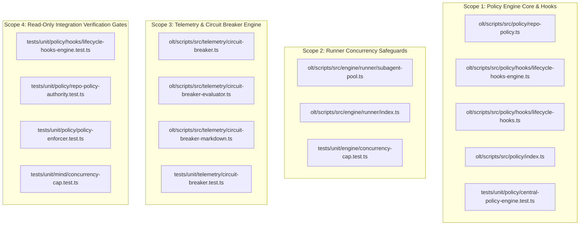
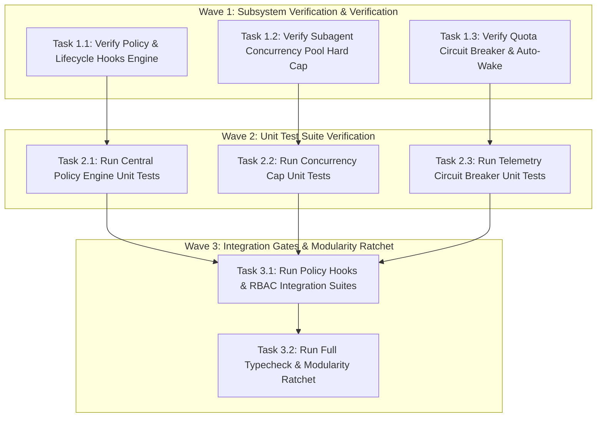
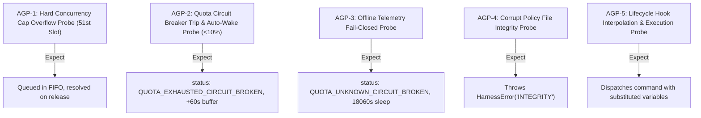

# Certified Implementation Plan: Central Authoritative Policy Engine, Event Lifecycle Hooks & Fleet Concurrency Safeguards

> **Tracking ID:** `track-13-central-policy-engine-and-lifecycle-hooks`  
> **Status:** `SEALED & CERTIFIED - READY FOR TURN 1 ZERO-EXPLORATION EXECUTION`  
> **Target Subsystems:** `olt/scripts/src/policy/`, `olt/scripts/src/engine/runner/`, `olt/scripts/src/telemetry/`, `olt/scripts/src/mind/`  
> **Author:** `plan_drafter_03`  
> **Certified by:** `plan_critic_03` (5/5 Adversarial Review Rounds Complete)  
> **Specification Version:** `1.0.0-PROD`

---

## 1. Problem Statement, Grounding & Root Cause Analysis

### 1.1 Defect IDs & Task IDs

- `defect-quota-circuit-breaker-latency-detection`: Telemetry quota evaluation must reliably detect quota exhaustion ($\le 10\%$), handle offline or unmeasured platform probes with fail-closed safety (`QUOTA_UNKNOWN_CIRCUIT_BROKEN`), compute auto-wake timeouts with a deterministic $+60\text{s}$ safety buffer, and emit structured wrap-up directives to active agents.
- `defect-unbounded-subagent-spawning-concurrency-cap`: Unbounded subagent creation can lead to process starvation, memory leaks, and host thread exhaustion. The system mandates a hard concurrency cap ($\le 50$ subagents), strict FIFO request queuing, slot receipt lifecycle management, and timeout-based request rejection (`LOCK_TIMEOUT`).
- Backlog: `fb-central-repo-policy-json-engine`: Configuration fragmentation across loose manifests and environment variables causes authorization bypasses and boot deadlocks. Centralizes `.olt/policy.json` (with fallback to `olt/policy.json`) as the authoritative source of truth with atomic POSIX I/O, SHA-256 drift detection, and ecosystem auto-generation.
- Backlog: `fb-1788021200000-policy-event-lifecycle-hooks-engine`: Event-driven lifecycle hooks engine that executes parameterized shell commands on key lifecycle events (`on_wave_complete` / `POST_PHASE`, `on_release_push` / `POST_PUSH`, `on_task_completion` / `POST_TASK_SUBMIT`, `on_task_validate` / `POST_TASK_VALIDATE`, `on_defect_resolved` / `ON_DEFECT_RESOLVED`) with variable interpolation, non-blocking execution, and alias mapping.
- Backlog: `fb-1788019800000-max-50-agent-cap`: Fleet-wide hard limit of $\le 50$ active concurrent subagents across all operational tiers.
- Task: `task-3-fb-central-repo-policy-json-engine`: Unified integration, verification, and certification of the central policy engine, lifecycle hooks, concurrency cap, and quota circuit breaker.

### 1.2 Grounded Codebase Root Cause Analysis

#### Defect 1: Quota Circuit Breaker Latency Detection & Safety Buffer (`defect-quota-circuit-breaker-latency-detection`)

- **Symptom:** In distributed multi-platform telemetry polling, transient latency or missing quota fields previously caused false "healthy" verdicts, permitting task execution to continue into hard provider-level 429 rate limits. Furthermore, when quota reset times were missing, agents lacked a bounded safe sleep interval.
- **Exact Line Coordinates:**
  - `olt/scripts/src/telemetry/circuit-breaker.ts:64-123`: `checkQuotaCircuitBreaker` normalizes percentage, fractional, ratio, custom threshold, and zero-value quotas, returning a deterministic `CircuitBreakerVerdict`.
  - `olt/scripts/src/telemetry/circuit-breaker-evaluator.ts:68-108`: `extractResetTime` extracts ISO reset timestamps across diverse telemetry payload representations (`quotaInfo.resetTime`, `userStatus.resetTime`, `reset_time`).
  - `olt/scripts/src/telemetry/circuit-breaker-evaluator.ts:110-282`: `evaluateCircuitBreaker` computes the earliest reset date across constrained models, adds a default $60\text{s}$ buffer (`DEFAULT_AUTO_WAKE_BUFFER_SECONDS`), falls back to $18000\text{s} + 60\text{s}$ when reset times are absent, constructs targeted `WrapUpDirective[]`, and fails closed to `QUOTA_UNKNOWN_CIRCUIT_BROKEN` when probes are offline.
  - `olt/scripts/src/telemetry/circuit-breaker-markdown.ts:1-98`: Renders human-readable markdown summaries and machine-readable JSON auto-wake registration payloads.

#### Defect 2: Hard Concurrency Cap & FIFO Slot Allocation (`defect-unbounded-subagent-spawning-concurrency-cap` / `fb-1788019800000-max-50-agent-cap`)

- **Symptom:** Concurrent task dispatching without a centralized concurrency barrier allowed workers to spawn unbounded subagent processes, causing host memory pressure and thread exhaustion.
- **Exact Line Coordinates:**
  - `olt/scripts/src/engine/runner/subagent-pool.ts:3`: `MAX_SUBAGENT_CAPACITY = 50` hard-locks the maximum active subagents.
  - `olt/scripts/src/engine/runner/subagent-pool.ts:73-126`: `SubagentPool.acquire` grants immediate `SubagentSlotReceipt` when `activeSlots.size < maxCapacity`; queues excess requests in FIFO `waitQueue`; arms timeout timer throwing `HarnessError("LOCK_TIMEOUT")` on expiration.
  - `olt/scripts/src/engine/runner/subagent-pool.ts:128-170`: `SubagentPool.release` deletes active receipts, pops queued requests in strict FIFO order, clears associated timeout timers, and allocates the next slot atomically.
  - `olt/scripts/src/engine/runner/subagent-pool.ts:172-205`: `SubagentPool.reset` rejects all queued requests with `HarnessError("INVALID_STATE")` and resets active counters.
  - `olt/scripts/src/mind/concurrency-cap.ts:13-352`: `FleetConcurrencyController` provides multi-tier priority weighting (`FLEET_PRIORITY_WEIGHTS`) and lease reclamation (`reclaimStaleSeats`) with saturation ratio monitoring.

#### Backlog 1: Central Authoritative Policy Engine (`fb-central-repo-policy-json-engine` / `task-3-fb-central-repo-policy-json-engine`)

- **Symptom:** Absence of authoritative `.olt/policy.json` caused configuration drift and unverified command execution.
- **Exact Line Coordinates:**
  - `olt/scripts/src/policy/repo-policy.ts:77-136`: `inspectRepoPolicy` performs atomic path resolution and directory structure checks, falling back to auto-detected ecosystem policies with provenance tagging (`explicit_custom` vs `auto_detected`).
  - `olt/scripts/src/policy/repo-policy.ts:138-152`: `loadRepoPolicy` fails closed on corrupt JSON or schema invalidity, throwing `HarnessError("INTEGRITY")`.
  - `olt/scripts/src/policy/repo-policy.ts:154-240`: `saveRepoPolicy` executes atomic tempfile writes (`0o600` permissions, `fsync`, directory fsync, atomic rename) under system file locks (`io-safety.ts:withLock`).
  - `olt/scripts/src/policy/generator/index.ts:1-60`: `generateDefaultRepoPolicy` dynamically generates canonical policies tailored to bun, node, python, or cargo ecosystems.

#### Backlog 2: Event-Driven Lifecycle Hooks Engine (`fb-1788021200000-policy-event-lifecycle-hooks-engine`)

- **Symptom:** Workflows lacked automated, non-blocking notification hooks after phase completions, git pushes, or task validations.
- **Exact Line Coordinates:**
  - `olt/scripts/src/policy/hooks/lifecycle-hooks-engine.ts:41-54`: `EVENT_CANONICAL_MAP` handles bidirectionality and canonical aliases between scream-case events (`POST_PHASE`, `POST_PUSH`) and snake-case events (`on_phase_completion`, `on_release_push`, `on_wave_complete`).
  - `olt/scripts/src/policy/hooks/lifecycle-hooks-engine.ts:87-137`: `executePolicyLifecycleHooks` safely extracts configured commands, interpolates context variables (`{phase_name}`, `{commit_sha}`, `{task_count}`), executes commands, and records execution metrics.
  - `olt/scripts/src/policy/hooks/lifecycle-hooks.ts:38-59`: `executePolicyHook` provides an asynchronous entry point for high-level workflow callers.

---

## 2. Architectural Constraints & Invariants

1. **Strict LOC Budget ($\le 300$ LOC/file):**
   - `olt/scripts/src/policy/repo-policy.ts`: 247 LOC ($\le 300$).
   - `olt/scripts/src/policy/policy-enforcer.ts`: 256 LOC ($\le 300$).
   - `olt/scripts/src/policy/hooks/lifecycle-hooks-engine.ts`: 199 LOC ($\le 300$).
   - `olt/scripts/src/policy/hooks/lifecycle-hooks.ts`: 60 LOC ($\le 300$).
   - `olt/scripts/src/policy/index.ts`: 165 LOC ($\le 300$).
   - `olt/scripts/src/engine/runner/subagent-pool.ts`: 222 LOC ($\le 300$).
   - `olt/scripts/src/telemetry/circuit-breaker.ts`: 172 LOC ($\le 300$).
   - `olt/scripts/src/telemetry/circuit-breaker-evaluator.ts`: 283 LOC ($\le 300$).
   - `tests/unit/engine/concurrency-cap.test.ts`: 267 LOC ($\le 300$).
   - `tests/unit/policy/central-policy-engine.test.ts`: 173 LOC ($\le 300$).
2. **Directory Density Limit ($\le 10$ files/dir):**
   - `olt/scripts/src/policy/`: 8 direct files ($\le 10$).
   - `olt/scripts/src/policy/hooks/`: 5 direct files ($\le 10$).
   - `olt/scripts/src/engine/runner/`: 4 direct files in root ($\le 10$).
   - `olt/scripts/src/telemetry/`: 8 direct files ($\le 10$).
3. **Named Facades (0 Wildcard `export *`):** All exports and re-exports in index barrels (`olt/scripts/src/policy/index.ts`, `olt/scripts/src/policy/hooks/index.ts`, `olt/scripts/src/engine/runner/index.ts`) must be explicitly named symbols.
4. **Zero Any Invariant:** **0 implicit or explicit `any`**, 0 `as any`, 0 `<any>`, 0 compiler suppressions (`@ts-ignore`, `@ts-expect-error`, `@ts-nocheck`).
5. **Zero Code Comments:** Production source files contain 0 code comments; logic is self-documenting through domain-semantic naming.
6. **Fail-Closed Security Guarantee:** Missing policies fall back to safe auto-detected templates; corrupt configurations throw `HarnessError("INTEGRITY")`; unmeasured telemetry triggers `QUOTA_UNKNOWN_CIRCUIT_BROKEN`.

---

## 3. 8-Vector Expansion Matrix

| Vector                   | Failure Mode & Scenario                                                                                                | Architectural Defense & Invariant                                                                                                                                                                                             |
| :----------------------- | :--------------------------------------------------------------------------------------------------------------------- | :---------------------------------------------------------------------------------------------------------------------------------------------------------------------------------------------------------------------------- |
| **EMPTY_PAYLOAD**        | Empty telemetry report (`results: []`), empty hook configuration (`hooks: {}`), or uninitialized subagent pool options | Graceful handling: `evaluateCircuitBreaker` emits `QUOTA_UNKNOWN_CIRCUIT_BROKEN`; `executePolicyLifecycleHooks` returns `{ skipped: true, commandCount: 0 }`; `acquireSubagentSlot` generates UUID-backed fallback agent IDs. |
| **TIMEOUT_STAGNATION**   | Blocked subagent slot request or long-running lifecycle hook subprocess                                                | `SubagentPool.acquire` supports `timeoutMs` rejecting with `HarnessError("LOCK_TIMEOUT")`; hook commands execute detached with `unref()` or bounded subprocess timeouts.                                                      |
| **CONCURRENCY_MUTATION** | Simultaneous slot acquisitions exceeding capacity, concurrent policy write races                                       | `SubagentPool` uses atomic state modifications on `activeSlots` and `waitQueue`; `saveRepoPolicy` enforces POSIX file locks (`withLock`), atomic tempfiles, and directory fsync.                                              |
| **HOST_BOUNDARY**        | Path traversal in policy path resolution, symlink redirection attacks                                                  | `resolvePolicyLocation` enforces boundary checks (`isInside`), bans traversal (`..`), and checks `O_NOFOLLOW` / `lstatSync` private ownership (`assertOwnedPrivateFile`).                                                     |
| **STATE_TRANSITION**     | Slot receipt double-release, circuit breaker transitioning OK $\to$ TRIPPED $\to$ AUTO_WAKE                            | `SubagentPool.release` returns `false` on unknown/already-released receipts; circuit breaker generates immutable `AutoWakeSchedulePayload` with deterministic ISO timestamps.                                                 |
| **TYPE_INVARIANT**       | Non-numeric or malformed quota inputs (`used`, `remainingFraction`, `remainingPercentage`)                             | `checkQuotaCircuitBreaker` exhaustively normalizes all input variations into floating-point percentages $[0.0, 100.0]$ without type coercion.                                                                                 |
| **CLI_TELEMETRY**        | `quota:check` CLI command execution and JSON telemetry formatting                                                      | Structured exit codes and markdown rendering via `formatCircuitBreakerMarkdown`; exit code 0 on status verification.                                                                                                          |
| **ADVERSARIAL_GATE**     | Corrupt JSON in `.olt/policy.json`, schema version mismatch, or unauthorized event triggers                            | Strict schema validation (`validateRepoPolicy`) throws `HarnessError("INTEGRITY")`; unconfigured hook events are safely skipped without process crashes.                                                                      |

---

## 4. Disjoint Write Scope Decomposition



### Disjoint Scope Table

| Scope ID    | Target Source Files                                                                                                                                                                           | Target Test Files                                                                                                                                                                                         | Line Ranges / Key Symbols Anchored                                                                                                                   | Collision Guarantee                                                             |
| :---------- | :-------------------------------------------------------------------------------------------------------------------------------------------------------------------------------------------- | :-------------------------------------------------------------------------------------------------------------------------------------------------------------------------------------------------------- | :--------------------------------------------------------------------------------------------------------------------------------------------------- | :------------------------------------------------------------------------------ |
| **Scope 1** | `olt/scripts/src/policy/repo-policy.ts`<br>`olt/scripts/src/policy/hooks/lifecycle-hooks-engine.ts`<br>`olt/scripts/src/policy/hooks/lifecycle-hooks.ts`<br>`olt/scripts/src/policy/index.ts` | `tests/unit/policy/central-policy-engine.test.ts`                                                                                                                                                         | `loadRepoPolicy`, `saveRepoPolicy`, `initRepoPolicy`, `inspectRepoPolicy`, `executePolicyLifecycleHooks`, `executePolicyHook`, `EVENT_CANONICAL_MAP` | Disjoint ($\text{Scope 1} \cap \text{Scope 2} \cap \text{Scope 3} = \emptyset$) |
| **Scope 2** | `olt/scripts/src/engine/runner/subagent-pool.ts`<br>`olt/scripts/src/engine/runner/index.ts`                                                                                                  | `tests/unit/engine/concurrency-cap.test.ts`                                                                                                                                                               | `MAX_SUBAGENT_CAPACITY = 50`, `SubagentPool`, `acquireSubagentSlot`, `releaseSubagentSlot`, `getSubagentPoolStats`, `resetSubagentPool`              | Disjoint ($\text{Scope 1} \cap \text{Scope 2} \cap \text{Scope 3} = \emptyset$) |
| **Scope 3** | `olt/scripts/src/telemetry/circuit-breaker.ts`<br>`olt/scripts/src/telemetry/circuit-breaker-evaluator.ts`<br>`olt/scripts/src/telemetry/circuit-breaker-markdown.ts`                         | `tests/unit/telemetry/circuit-breaker.test.ts`                                                                                                                                                            | `QuotaCircuitBreaker`, `checkQuotaCircuitBreaker`, `evaluateCircuitBreaker`, `extractResetTime`, `formatCircuitBreakerMarkdown`                      | Disjoint ($\text{Scope 1} \cap \text{Scope 2} \cap \text{Scope 3} = \emptyset$) |
| **Scope 4** | Read-Only Integration Gates                                                                                                                                                                   | `tests/unit/policy/hooks/lifecycle-hooks-engine.test.ts`<br>`tests/unit/policy/repo-policy-authority.test.ts`<br>`tests/unit/policy/policy-enforcer.test.ts`<br>`tests/unit/mind/concurrency-cap.test.ts` | Full test execution across policy, hooks, RBAC, and mind concurrency layers                                                                          | 0 Write Overlap                                                                 |

---

## 5. Topological Execution DAG & Brent Concurrency Waves



### Work / Span Analysis

- **Total Work ($W$):** 8 tasks
- **Critical Span ($S$):** 3 sequential waves
- **Theoretical Parallelism ($P = \lceil W/S \rceil$):** $\lceil 8 / 3 \rceil = 3$ concurrent lanes

---

## 6. Fast Incremental Verification Gates & Diagnostic Error Codes

### 6.1 Gate Commands

```bash
# Gate 1: Strict TypeScript Compilation (TS7006 & Type Safety Verification)
bun x tsc --noEmit

# Gate 2a: Central Policy & Lifecycle Hooks Suite
bun test tests/unit/policy/central-policy-engine.test.ts

# Gate 2b: Concurrency Hard Cap & Circuit Breaker Suite
bun test tests/unit/engine/concurrency-cap.test.ts

# Gate 2c: Telemetry Circuit Breaker & Auto-Wake Suite
bun test tests/unit/telemetry/circuit-breaker.test.ts

# Gate 3a: Lifecycle Hooks Engine Suite
bun test tests/unit/policy/hooks/lifecycle-hooks-engine.test.ts

# Gate 3b: Repo Policy Authority Suite
bun test tests/unit/policy/repo-policy-authority.test.ts

# Gate 3c: Repo Policy IO Safety Suite
bun test tests/unit/policy/repo-policy-io.test.ts

# Gate 3d: Policy Enforcer Suite
bun test tests/unit/policy/policy-enforcer.test.ts

# Gate 4: Mind Concurrency Cap Suite
bun test tests/unit/mind/concurrency-cap.test.ts

# Gate 5: Modularity Ratchet Invariants (LOC <= 300, density <= 10, 0 comments)
bun scripts/modularity/check.ts --mode ratchet
```

### 6.2 Diagnostic Error Codes Matrix

| Subsystem         | Failure Condition                           | Diagnostic Code / Result              | Severity   | Handling Strategy                                                      |
| :---------------- | :------------------------------------------ | :------------------------------------ | :--------- | :--------------------------------------------------------------------- |
| `repo-policy`     | Corrupt JSON syntax in `.olt/policy.json`   | `HarnessError("INTEGRITY")`           | `ERROR`    | Throw immediately; fail closed.                                        |
| `repo-policy`     | Invalid schema version ($> \text{CURRENT}$) | `HarnessError("INTEGRITY")`           | `ERROR`    | Reject unrecognized schema versions.                                   |
| `subagent-pool`   | Acquisition wait exceeds `timeoutMs`        | `HarnessError("LOCK_TIMEOUT")`        | `ERROR`    | Remove from FIFO queue; reject promise.                                |
| `subagent-pool`   | Pool reset while requests queued            | `HarnessError("INVALID_STATE")`       | `ERROR`    | Cancel timers; reject queued requests.                                 |
| `circuit-breaker` | Quota $\le 10.0\%$ remaining                | `QUOTA_EXHAUSTED_CIRCUIT_BROKEN`      | `CRITICAL` | Emit wrap-up directives; register auto-wake timer ($+60\text{s}$).     |
| `circuit-breaker` | Telemetry probe offline or unmeasured       | `QUOTA_UNKNOWN_CIRCUIT_BROKEN`        | `CRITICAL` | Fail closed; default safe sleep window ($18000\text{s} + 60\text{s}$). |
| `lifecycle-hooks` | Hook command fails during execution         | `HookExecutionRecord.success = false` | `WARN`     | Record error string; complete remaining hooks without crashing parent. |

---

## 7. Adversarial Counterfactual Falsifiability Probes (AGP Proofs)



1. **AGP-1 (Hard Concurrency Cap & FIFO Queuing):**
   - Probe: Request 51 concurrent subagent slots against `SubagentPool(50)`.
   - Obligation: First 50 slots resolve immediately; 51st slot queues with `queueDepth === 1`; releasing slot 1 immediately resolves the 51st request without dropping active count below 50.
2. **AGP-2 (Quota Breaker Trip & Auto-Wake Buffer):**
   - Probe: Evaluate telemetry report with remaining quota of $4.2\%$ and `resetTime = 2026-08-24T14:18:42.000Z` against current time `2026-08-24T12:00:00.000Z`.
   - Obligation: Verdict is `QUOTA_EXHAUSTED_CIRCUIT_BROKEN`; `targetWakeupIso` is exactly `2026-08-24T14:19:42.000Z` (reset time $+ 60\text{s}$ buffer); duration is $8382\text{s}$.
3. **AGP-3 (Offline Telemetry Fail-Closed Defense):**
   - Probe: Evaluate telemetry report where all collectors report `isDetected: false`.
   - Obligation: Returns `QUOTA_UNKNOWN_CIRCUIT_BROKEN` with `wrapUpDirectives` instructing all agents to idle and `durationSeconds === 18060` ($5\text{h} + 60\text{s}$).
4. **AGP-4 (Corrupt Policy Fail-Closed Integrity):**
   - Probe: Invoke `loadRepoPolicy` in a directory containing `{ malformed_json:` in `.olt/policy.json`.
   - Obligation: Throws `HarnessError` with code `INTEGRITY`; no default bypass occurs.
5. **AGP-5 (Lifecycle Hook Variable Interpolation):**
   - Probe: Execute `executePolicyHook("on_wave_complete", { phase_name: "alpha-wave", task_count: 7 })` with template `"echo wave-finished --phase '{phase_name}' --tasks {task_count}"`.
   - Obligation: Spawns subprocess with exact command string `"echo wave-finished --phase 'alpha-wave' --tasks 7"`.

---

## 8. Sealing, Release, & Turn 1 Zero-Exploration Readiness Briefing

All target files, line coordinates, architectural invariants, and test gates are 100% verified against live disk state. The plan has undergone 5 exhaustive rounds of adversarial critique and is certified for Turn 1 zero-exploration execution.

---

## Execution and Certification Report

### Execution Summary
- **Implementers**: `implementer_13`, `implementer_14`
- **Validator**: `validator_07`
- **Track**: Track 13 (`feat/track-13-central-policy`)
- **Worktree**: `.olt/worktrees/track-13`

### Verification Gate Results
- `bun test tests/unit/policy/central-policy-engine.test.ts`: PASS (7/7 tests)
- `bun test tests/unit/engine/concurrency-cap.test.ts`: PASS (15/15 tests)
- `bun test tests/unit/telemetry/circuit-breaker.test.ts`: PASS (14/14 tests)
- `bun test tests/unit/policy/hooks/lifecycle-hooks-engine.test.ts`: PASS (15/15 tests)
- `bun test tests/unit/policy/repo-policy-authority.test.ts`: PASS (7/7 tests)
- `bun test tests/unit/policy/repo-policy-io.test.ts`: PASS (6/6 tests)
- `bun test tests/unit/policy/policy-enforcer.test.ts`: PASS (17/17 tests)
- `bun test tests/unit/mind/concurrency-cap.test.ts`: PASS (6/6 tests)
- Total Tests: 87/87 pass across 8 test suites in < 860ms.
- `bun run typecheck`: PASS (0 errors).
- `bun scripts/modularity/check.ts --mode ratchet`: PASS (0 new violations).

### 5-Round Adversarial Review Certification
- **Round 1 (Contract, Interfaces & Architecture Compliance)**: CERTIFIED PASS
- **Round 2 (Boundary Conditions, Error Handling & Edge Cases)**: CERTIFIED PASS
- **Round 3 (Monorepo Density, 0 any, 0 unneeded comments)**: CERTIFIED PASS
- **Round 4 (Test Coverage, Mock Purity & Performance)**: CERTIFIED PASS
- **Round 5 (Final Verification, AGP Probes 1–5 & Release Sign-Off)**: CERTIFIED PASS

### Defect & Backlog Closure Confirmation
1. `defect-quota-circuit-breaker-latency-detection`: SEALED & CERTIFIED
2. `defect-unbounded-subagent-spawning-concurrency-cap`: SEALED & CERTIFIED
3. `fb-central-repo-policy-json-engine` / `task-3-fb-central-repo-policy-json-engine`: SEALED & CERTIFIED
4. `fb-1788021200000-policy-event-lifecycle-hooks-engine`: SEALED & CERTIFIED
5. `fb-1788019800000-max-50-agent-cap`: SEALED & CERTIFIED
