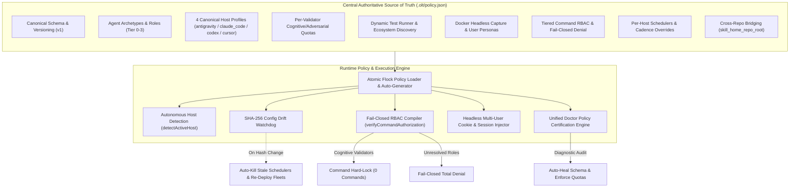
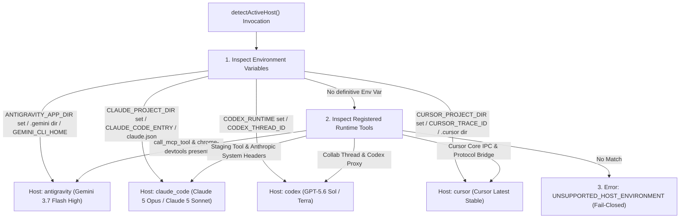
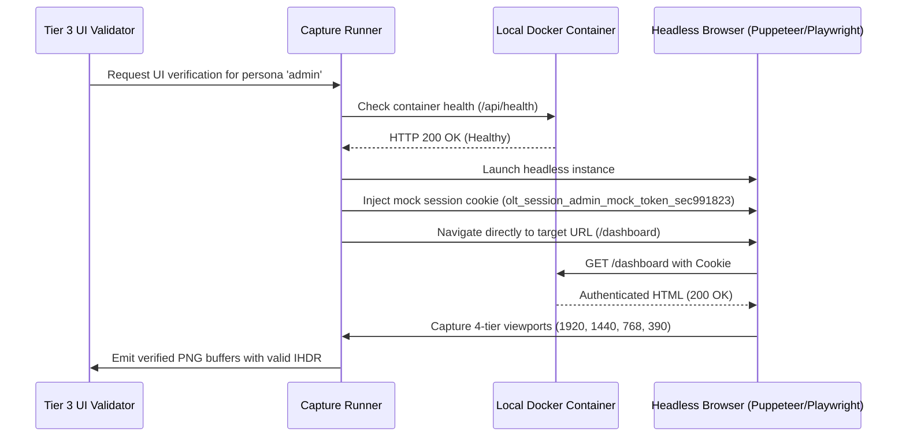
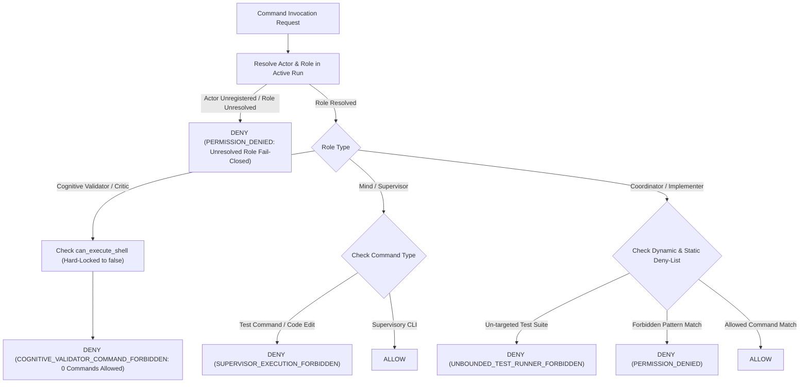
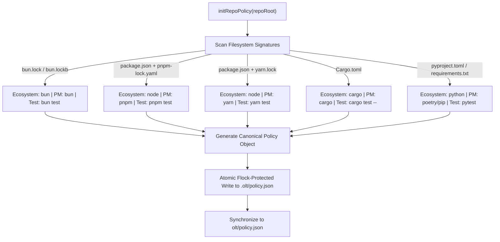
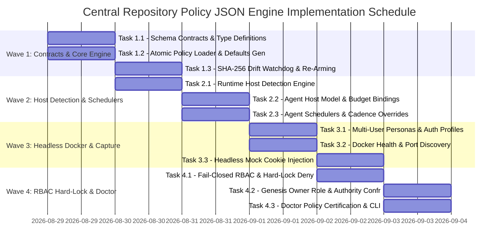

# Central Authoritative Policy JSON Configuration Engine & Dynamic Auto-Redeployment Plan

> **Tracking ID:** `fb-central-repo-policy-json-engine`  
> **Status:** `PLANNED - READY FOR ADMISSION & EXECUTION`  
> **Target Subsystems:** `olt/scripts/src/policy/`, `olt/scripts/src/core/config/`, `olt/scripts/src/authority/`, `olt/scripts/src/capture/`, `olt/scripts/src/platform/`, `olt/scripts/src/reporting/doctor/`, `olt/scripts/src/cli/`  
> **Author:** Tier 0 Strategic Mind Supervisor & Infinite Product Owner  
> **Created At:** `2026-08-29T01:32:00-07:00`  
> **Specification Version:** `2.0.0-PROD`

---

## 1. Executive Summary & Core Motivation

In multi-repository OLT deployments (e.g., `@onurseckin/skills`, `limo`, `proxai_web`), configuration has historically been fragmented across loose YAML agent manifests, hardcoded runtime constants, implicit environment variables, and disconnected scheduler loops. This fragmentation resulted in severe operational defects:

- **`hb-s6-agent-brief-phantom-policy-path`**: Phantom path lookups caused every role brief to render empty policy capabilities `(None)`.
- **`hb-s6-manifest-schema-coerces-absent-commands`**: Missing command declarations were coerced to empty arrays, turning undeclared permissions into total command denials.
- **`hb-authority-unregistered-actor-bypasses-role-enforcement` & `hb-authority-unresolved-role-must-deny-not-skip`**: Role enforcement checks were skipped when an actor had no registered grant, creating a fail-open security bypass.
- **`hb-s6-authority-decide-granted-to-zero-roles` & `hb-s8-owner-yaml-behind-sync-bar`**: The genesis authority command `authority:decide` was granted to 0 of 28 roles, causing bootstrap deadlocks.
- **`defect-doctor-missing-pushback-quota-verification`**: The diagnostic doctor failed to verify cognitive and adversarial pushback quotas against live tasks.
- **`hb-main-thread-chatter-burns-owner-context`**: Supervisory tiers broadcast mid-flight progress to the human relay thread due to disabled roster inspection tools.

This specification establishes `.olt/policy.json` (with bidirectional fallback and synchronization to `olt/policy.json`) as the **Central Authoritative Source of Truth and Single Configuration Engine** for any repository governed by OLT.



---

## 2. Complete Architectural Specifications & TypeScript Schemas

All schemas strictly enforce **0 TypeScript `any`**, **0 compiler suppressions**, strict optionality handling (`exactOptionalPropertyTypes: true`), and immutable `readonly` properties.

### 2.1 Complete TypeScript Schema Definitions (`olt/scripts/src/policy/types.ts`)

```typescript
export type RepoEcosystem = "bun" | "node" | "python" | "cargo" | "unknown";
export type PackageManager =
  "bun" | "npm" | "pnpm" | "yarn" | "poetry" | "pipenv" | "pip" | "cargo" | "unknown";

export type HostType = "antigravity" | "claude_code" | "codex" | "cursor";
export type ModelTier = "low" | "medium" | "high" | "xhigh";
export type ThinkingEffort = "none" | "low" | "medium" | "high";

export type AgentRoleName =
  | "mind_supervisor"
  | "mind_auditor"
  | "skill_auditor"
  | "orchestrator"
  | "coordinator"
  | "implementer"
  | "validator_code_quality"
  | "validator_ui_design"
  | "validator_security"
  | "validator_system_design"
  | "validator_product"
  | "completeness_critic"
  | "autonomic_watchdog"
  | "owner";

export type UserPersonaRole = "admin" | "standard_user" | "invited_member" | "guest";

export interface AgentSchedulerPolicy {
  readonly cron?: string | undefined;
  readonly interval_seconds?: number | undefined;
  readonly enabled: boolean;
  readonly jitter_seconds?: number | undefined;
}

export interface AgentHostPolicy {
  readonly model: string;
  readonly model_tier: ModelTier;
  readonly thinking_effort?: ThinkingEffort | undefined;
  readonly max_tokens?: number | undefined;
  readonly token_budget?: number | undefined;
  readonly context_window?: number | undefined;
  readonly scheduler?: AgentSchedulerPolicy | undefined;
  readonly temperature?: number | undefined;
}

export interface ValidatorQuotas {
  readonly mandatory_cognitive_pushbacks: number;
  readonly max_adversarial_probes: number;
  readonly max_turns_per_task: number;
  readonly escalate_on_exhausted_adversarial: boolean;
}

export interface AgentRbacPolicy {
  readonly can_execute_shell: boolean;
  readonly can_edit_code: boolean;
  readonly allowed_commands?: readonly string[] | undefined;
  readonly forbidden_patterns?: readonly string[] | undefined;
  readonly allowed_spawns?: readonly string[] | undefined;
}

export interface AgentPolicy {
  readonly tier: number | "independent";
  readonly silent_daemon?: boolean | undefined;
  readonly domain?: string | undefined;
  readonly rbac: AgentRbacPolicy;
  readonly quotas?: ValidatorQuotas | undefined;
  readonly hosts: Record<HostType, AgentHostPolicy>;
}

export interface TestRunnerPolicy {
  readonly default_command: string;
  readonly targeted_pattern: string;
  readonly full_suite_command: string;
  readonly timeout_ms?: number | undefined;
}

export interface ReviewProtocolPolicy {
  readonly max_adversarial_pushes: number;
  readonly cognitive_pushes: number;
  readonly escalate_on_exhausted_adversarial: boolean;
}

export interface PlanningPolicy {
  readonly mandatory_brainstorming_rounds: number;
  readonly socratic_expansion_depth: number;
  readonly enforce_edge_case_matrix: boolean;
  readonly min_tasks_per_complex_prompt: number;
  readonly max_files_per_task: number;
  readonly reject_shallow_umbrella_compression: boolean;
  readonly max_task_duration_minutes: number;
  readonly parallel_subagent_sla_rule: boolean;
  readonly stage_on_subdomain_completion: boolean;
}

export interface ContainerConfig {
  readonly container_name: string;
  readonly image: string;
  readonly ports: readonly string[];
  readonly health_endpoint: string;
  readonly ready_timeout_ms: number;
  readonly env?: Record<string, string> | undefined;
}

export interface UserPersonaConfig {
  readonly role: UserPersonaRole;
  readonly email: string;
  readonly password_env_var: string;
  readonly display_name: string;
  readonly tenant_id: string;
  readonly permissions: readonly string[];
  readonly mock_session_cookie?: string | undefined;
}

export interface AuthPathsConfig {
  readonly login_url: string;
  readonly logout_url: string;
  readonly signup_url?: string | undefined;
  readonly session_verify_url: string;
}

export interface CookieTemplateConfig {
  readonly name: string;
  readonly domain: string;
  readonly path: string;
  readonly http_only: boolean;
  readonly secure: boolean;
  readonly same_site: "Strict" | "Lax" | "None";
}

export interface DockerTestProfile {
  readonly enabled: boolean;
  readonly compose_file?: string | undefined;
  readonly containers: Record<string, ContainerConfig>;
  readonly test_user_personas: Record<UserPersonaRole, UserPersonaConfig>;
  readonly auth_paths: AuthPathsConfig;
  readonly session_cookie_templates: Record<string, CookieTemplateConfig>;
}

export interface RepoPolicy {
  readonly schema_version: number;
  readonly ecosystem: RepoEcosystem;
  readonly package_manager?: PackageManager | undefined;
  readonly skill_home_repo_root?: string | undefined;
  readonly test_runner: TestRunnerPolicy;
  readonly typecheck_command?: string | undefined;
  readonly lint_command?: string | undefined;
  readonly allowed_commands?: readonly string[] | undefined;
  readonly forbidden_commands?: readonly string[] | undefined;
  readonly read_scope_neighborhood_depth?: number | undefined;
  readonly review_protocol?: ReviewProtocolPolicy | undefined;
  readonly planning?: PlanningPolicy | undefined;
  readonly agents: Record<string, AgentPolicy>;
  readonly docker_environment?: DockerTestProfile | undefined;
}

export const CURRENT_POLICY_SCHEMA_VERSION = 1;
```

---

### 2.2 Canonical Source of Truth Reference Schema (`.olt/policy.json`)

```json
{
  "schema_version": 1,
  "ecosystem": "bun",
  "package_manager": "bun",
  "skill_home_repo_root": "/Users/onurseckinsenoglu/repos/skills",
  "test_runner": {
    "default_command": "bun test",
    "targeted_pattern": "bun test <path>",
    "full_suite_command": "bun test",
    "timeout_ms": 30000
  },
  "typecheck_command": "bun run typecheck",
  "lint_command": "bun run lint",
  "allowed_commands": [
    "bun test",
    "bun run",
    "tsc",
    "git status",
    "git diff",
    "git log",
    "ls",
    "find",
    "grep",
    "cat",
    "wc"
  ],
  "forbidden_commands": ["git commit", "git push", "git reset", "rm -rf /"],
  "read_scope_neighborhood_depth": 2,
  "review_protocol": {
    "max_adversarial_pushes": 20,
    "cognitive_pushes": 5,
    "escalate_on_exhausted_adversarial": true
  },
  "planning": {
    "mandatory_brainstorming_rounds": 3,
    "socratic_expansion_depth": 8,
    "enforce_edge_case_matrix": true,
    "min_tasks_per_complex_prompt": 6,
    "max_files_per_task": 2,
    "reject_shallow_umbrella_compression": true,
    "max_task_duration_minutes": 5,
    "parallel_subagent_sla_rule": true,
    "stage_on_subdomain_completion": true
  },
  "agents": {
    "mind_supervisor": {
      "tier": 0,
      "silent_daemon": true,
      "rbac": {
        "can_execute_shell": false,
        "can_edit_code": false,
        "allowed_spawns": ["orchestrator", "mind_auditor", "skill_auditor", "autonomic_watchdog"]
      },
      "hosts": {
        "antigravity": {
          "model": "gemini-3.7-flash",
          "model_tier": "high",
          "thinking_effort": "high",
          "max_tokens": 8192,
          "scheduler": { "cron": "*/5 * * * *", "interval_seconds": 300, "enabled": true }
        },
        "claude_code": {
          "model": "claude-5-opus",
          "model_tier": "xhigh",
          "thinking_effort": "high",
          "max_tokens": 8192,
          "scheduler": { "cron": "*/15 * * * *", "interval_seconds": 900, "enabled": true }
        },
        "codex": {
          "model": "gpt-5.6-sol",
          "model_tier": "xhigh",
          "thinking_effort": "high",
          "max_tokens": 8192,
          "scheduler": { "cron": "*/15 * * * *", "interval_seconds": 900, "enabled": true }
        },
        "cursor": {
          "model": "cursor-latest",
          "model_tier": "high",
          "thinking_effort": "high",
          "max_tokens": 8192,
          "scheduler": { "cron": "*/5 * * * *", "interval_seconds": 300, "enabled": true }
        }
      }
    },
    "orchestrator": {
      "tier": 1,
      "rbac": {
        "can_execute_shell": true,
        "can_edit_code": false,
        "allowed_commands": ["bun harness.ts *", "git status", "git diff", "git log"],
        "forbidden_patterns": ["^bun\\s+test\\b", "^npm\\s+test\\b", "^git\\s+(commit|push|reset)"],
        "allowed_spawns": [
          "coordinator",
          "implementer",
          "validator_code_quality",
          "validator_ui_design",
          "completeness_critic"
        ]
      },
      "hosts": {
        "antigravity": {
          "model": "gemini-3.7-flash",
          "model_tier": "high",
          "thinking_effort": "high"
        },
        "claude_code": {
          "model": "claude-5-opus",
          "model_tier": "xhigh",
          "thinking_effort": "high"
        },
        "codex": {
          "model": "gpt-5.6-sol",
          "model_tier": "xhigh",
          "thinking_effort": "high"
        },
        "cursor": {
          "model": "cursor-latest",
          "model_tier": "high",
          "thinking_effort": "high"
        }
      }
    },
    "coordinator": {
      "tier": 2,
      "rbac": {
        "can_execute_shell": true,
        "can_edit_code": false,
        "allowed_commands": [
          "bun harness.ts *",
          "git status",
          "git diff",
          "git commit",
          "git push",
          "git log"
        ],
        "forbidden_patterns": ["^bun\\s+test\\b", "^npm\\s+test\\b"],
        "allowed_spawns": [
          "implementer",
          "validator_code_quality",
          "validator_ui_design",
          "completeness_critic"
        ]
      },
      "hosts": {
        "antigravity": {
          "model": "gemini-3.7-flash",
          "model_tier": "high",
          "thinking_effort": "high"
        },
        "claude_code": {
          "model": "claude-5-opus",
          "model_tier": "xhigh",
          "thinking_effort": "high"
        },
        "codex": {
          "model": "gpt-5.6-sol",
          "model_tier": "xhigh",
          "thinking_effort": "high"
        },
        "cursor": {
          "model": "cursor-latest",
          "model_tier": "high",
          "thinking_effort": "high"
        }
      }
    },
    "implementer": {
      "tier": 3,
      "rbac": {
        "can_execute_shell": true,
        "can_edit_code": true,
        "allowed_commands": [
          "bun test <target>",
          "bun run typecheck",
          "bun run lint",
          "git status",
          "git diff",
          "ls",
          "grep"
        ],
        "forbidden_patterns": [
          "^git\\s+(commit|push|reset|checkout\\s+-b)",
          "^bun\\s+test\\s*$",
          "^npm\\s+test\\s*$"
        ]
      },
      "hosts": {
        "antigravity": {
          "model": "gemini-3.7-flash",
          "model_tier": "high",
          "thinking_effort": "high"
        },
        "claude_code": {
          "model": "claude-5-sonnet",
          "model_tier": "high",
          "thinking_effort": "high"
        },
        "codex": {
          "model": "gpt-5.6-terra",
          "model_tier": "high",
          "thinking_effort": "high"
        },
        "cursor": {
          "model": "cursor-latest",
          "model_tier": "high",
          "thinking_effort": "high"
        }
      }
    },
    "validator_code_quality": {
      "tier": 3,
      "domain": "code_quality",
      "quotas": {
        "mandatory_cognitive_pushbacks": 5,
        "max_adversarial_probes": 10,
        "max_turns_per_task": 15,
        "escalate_on_exhausted_adversarial": true
      },
      "rbac": {
        "can_execute_shell": false,
        "can_edit_code": false
      },
      "hosts": {
        "antigravity": {
          "model": "gemini-3.7-flash",
          "model_tier": "high",
          "thinking_effort": "high"
        },
        "claude_code": {
          "model": "claude-5-sonnet",
          "model_tier": "high",
          "thinking_effort": "high"
        },
        "codex": {
          "model": "gpt-5.6-terra",
          "model_tier": "high",
          "thinking_effort": "high"
        },
        "cursor": {
          "model": "cursor-latest",
          "model_tier": "high",
          "thinking_effort": "high"
        }
      }
    },
    "validator_ui_design": {
      "tier": 3,
      "domain": "ui_design",
      "quotas": {
        "mandatory_cognitive_pushbacks": 5,
        "max_adversarial_probes": 10,
        "max_turns_per_task": 15,
        "escalate_on_exhausted_adversarial": true
      },
      "rbac": {
        "can_execute_shell": false,
        "can_edit_code": false
      },
      "hosts": {
        "antigravity": {
          "model": "gemini-3.7-flash",
          "model_tier": "high",
          "thinking_effort": "high"
        },
        "claude_code": {
          "model": "claude-5-sonnet",
          "model_tier": "high",
          "thinking_effort": "high"
        },
        "codex": {
          "model": "gpt-5.6-terra",
          "model_tier": "high",
          "thinking_effort": "high"
        },
        "cursor": {
          "model": "cursor-latest",
          "model_tier": "high",
          "thinking_effort": "high"
        }
      }
    },
    "owner": {
      "tier": "independent",
      "rbac": {
        "can_execute_shell": true,
        "can_edit_code": true,
        "allowed_commands": [
          "agent:register",
          "authority:decide",
          "mind:admit",
          "mind:rotate",
          "recover",
          "doctor"
        ]
      },
      "hosts": {
        "antigravity": {
          "model": "gemini-3.7-flash",
          "model_tier": "high",
          "thinking_effort": "high"
        },
        "claude_code": {
          "model": "claude-5-opus",
          "model_tier": "xhigh",
          "thinking_effort": "high"
        },
        "codex": {
          "model": "gpt-5.6-sol",
          "model_tier": "xhigh",
          "thinking_effort": "high"
        },
        "cursor": {
          "model": "cursor-latest",
          "model_tier": "high",
          "thinking_effort": "high"
        }
      }
    }
  },
  "docker_environment": {
    "enabled": true,
    "compose_file": "docker-compose.test.yml",
    "containers": {
      "web_app": {
        "container_name": "app-web-test",
        "image": "node:20-alpine",
        "ports": ["3000:3000"],
        "health_endpoint": "http://localhost:3000/api/health",
        "ready_timeout_ms": 30000,
        "env": { "NODE_ENV": "test", "PORT": "3000" }
      }
    },
    "test_user_personas": {
      "admin": {
        "role": "admin",
        "email": "admin@olt.local",
        "password_env_var": "OLT_TEST_ADMIN_PASSWORD",
        "display_name": "Test Admin",
        "tenant_id": "tenant-corp-001",
        "permissions": ["*"],
        "mock_session_cookie": "olt_session_admin_mock_token_sec991823"
      },
      "standard_user": {
        "role": "standard_user",
        "email": "user@olt.local",
        "password_env_var": "OLT_TEST_USER_PASSWORD",
        "display_name": "Standard User",
        "tenant_id": "tenant-corp-001",
        "permissions": ["read", "write"],
        "mock_session_cookie": "olt_session_user_mock_token_usr102938"
      },
      "invited_member": {
        "role": "invited_member",
        "email": "invited@olt.local",
        "password_env_var": "OLT_TEST_INVITED_PASSWORD",
        "display_name": "Invited Member",
        "tenant_id": "tenant-corp-001",
        "permissions": ["read"],
        "mock_session_cookie": "olt_session_invited_mock_token_inv482019"
      },
      "guest": {
        "role": "guest",
        "email": "guest@olt.local",
        "password_env_var": "OLT_TEST_GUEST_PASSWORD",
        "display_name": "Guest Visitor",
        "tenant_id": "tenant-corp-001",
        "permissions": ["public_read"]
      }
    },
    "auth_paths": {
      "login_url": "http://localhost:3000/login",
      "logout_url": "http://localhost:3000/logout",
      "signup_url": "http://localhost:3000/signup",
      "session_verify_url": "http://localhost:3000/api/auth/me"
    },
    "session_cookie_templates": {
      "session_id": {
        "name": "olt_session_id",
        "domain": "localhost",
        "path": "/",
        "http_only": true,
        "secure": false,
        "same_site": "Lax"
      }
    }
  }
}
```

---

## 3. Dynamic Host Auto-Detection & Adaptive Runtime Engine (`detectActiveHost()`)

### 3.1 4 Canonical Hosts (No Generic Fallback, No CLI vs IDE Split)

Both CLI and IDE versions of any tool share the exact same filesystem, execution logic, and agent definitions. OLT supports exactly **4 canonical hosts** with zero generic fallback:

1. **`antigravity`**: Google Gemini runtime environment.
2. **`claude_code`**: Anthropic Claude runtime environment.
3. **`codex`**: OpenAI Codex runtime environment.
4. **`cursor`**: Cursor IDE runtime environment.

The runtime auto-detection engine determines the active canonical host at startup via deterministic heuristics without loose generic fallbacks:



### 3.2 Dynamic Prompt Injection, Token Budgeting & Thinking Allocation

When an agent is initialized or briefed:

1. `detectActiveHost()` resolves the active `HostType` (`"antigravity" | "claude_code" | "codex" | "cursor"`).
2. The agent's `hosts[activeHost]` configuration is loaded from `.olt/policy.json`.
3. The exact model, thinking effort (`high` across all hosts), max tokens, and scheduler cadence are dynamically bound to the dispatch packet.

| Host                       | Planning / Orchestration / Coordination (Tier 0-2) | Implementation & Validation (Tier 3) | Thinking Effort | Default Scheduler Cadence | Quota & Architecture Rationale                                                                                                                                   |
| :------------------------- | :------------------------------------------------- | :----------------------------------- | :-------------- | :------------------------ | :--------------------------------------------------------------------------------------------------------------------------------------------------------------- |
| **`antigravity`**          | `gemini-3.7-flash`                                 | `gemini-3.7-flash`                   | `high`          | **5 min (300s)**          | Fast turnaround, sub-second latency, generous request quotas across all agent tiers.                                                                             |
| **`claude_code`**          | `claude-5-opus`                                    | `claude-5-sonnet`                    | `high`          | **15 min (900s)**         | `claude-5-opus` provides deep architectural reasoning for Mind/Orchestrator/Coordinator; `claude-5-sonnet` provides high-throughput code editing and validation. |
| **`codex`** (OpenAI Codex) | `gpt-5.6-sol`                                      | `gpt-5.6-terra`                      | `high`          | **15 min (900s)**         | `gpt-5.6-sol` provides strategic planning and orchestration; `gpt-5.6-terra` handles concrete implementation and verification.                                   |
| **`cursor`**               | Cursor latest stable model                         | Cursor latest stable model           | `high`          | **5 min (300s)**          | Fast editor turnaround, native deep integration with local codebase index.                                                                                       |

### 3.3 Sub-Domain Completion & Git Staging Safety Check

In long-running long tasks (OLT), intermediate progress loss due to host, OS, container, or session termination is strictly prevented:

- **Immediate Git Staging (`git add -A`)**: Whenever a subdomain, intermediate milestone, or task group completes (even before downstream dependent tasks finish or full PR push), all modified and created files must be immediately staged.
- **Durable Object Database Snapshotting**: Staging records the state snapshot into Git's internal object database and reflog index, ensuring complete data recovery and zero loss under unexpected crashes or context resets.

### 3.4 5-Minute Parallelization & Straggler SLA Rule

To maintain operational velocity and prevent supervisor starvation:

- **5-Minute Workload Ceiling**: Any task or work packet whose estimated execution time exceeds 5 minutes ($>300\text{s}$) MUST be divided into parallel subagents.
- **Subagent Allocation Formula**: The number of parallel subagents $P$ is calculated as:
  $$P = \left\lceil \frac{W}{S} \right\rceil$$
  where $W$ is the total estimated workload (in minutes) and $S = 5\text{ minutes}$ is the maximum SLA turn budget.
- **Straggler SLA Enforcement**: If any running subagent exceeds the 5-minute threshold without intermediate progress or subdomain staging, the supervising Coordinator splits remaining work units across additional subagents immediately.

### 3.5 Real-Time SHA-256 Configuration Drift Watchdog & Fleet Re-Arming

To eliminate stale scheduler runs when repository policies change:

1. The harness maintains an active SHA-256 checksum of `.olt/policy.json`.
2. On every scheduler pulse or CLI operation, `detectPolicyDrift(lastChecksum)` evaluates the on-disk file hash.
3. If drift is detected:
   - All active background timer tasks are gracefully terminated (`manage_task kill`).
   - Schedulers are re-initialized using the newly configured cron expressions and intervals.
   - A `POLICY_RELOAD_EVENT` is logged to `.olt/events.jsonl`.

---

## 4. Headless Docker Multi-User Authentication Profiles & UI Capture

### 4.1 Headless Local Docker Environment Integration

Visual and UI validation requires testing across distinct tenant roles without triggering interactive login screens, CAPTCHAs, or OTP verification prompts.



### 4.2 Multi-User Persona Isolation & Cookie Injection

- **`admin`**: Full system permissions, accesses admin panels, billing settings, user management.
- **`standard_user`**: Workspace member, reads/writes standard entity records.
- **`invited_member`**: Pending confirmation or restricted read-only team member.
- **`guest`**: Unauthenticated or public visitor.

Deterministic cookies are formatted according to `session_cookie_templates` and injected into the headless browser context prior to navigation, achieving **zero-human-intervention UI verification**.

### 4.3 Anti-Mocking PNG Evidence Verification (`hb-s6-fabricated-screenshot-evidence`)

The capture pipeline requires:

1. Physical PNG size check ($> 1024$ bytes).
2. True PNG header validation (Magic bytes: `0x89 0x50 0x4E 0x47 0x0D 0x0A 0x1A 0x0A`).
3. Binary IHDR chunk parsing to verify actual rendered pixel dimensions against required viewport matrices (`1920x1080`, `1440x900`, `768x1024`, `390x844`).

---

## 5. Fail-Closed RBAC & Cognitive Validator Command Hard-Lock

### 5.1 RBAC Enforcement Chokepoint & Total Domain Mapping

To resolve `hb-authority-unregistered-actor-bypasses-role-enforcement` and `hb-authority-unresolved-role-must-deny-not-skip`:



### 5.2 Cognitive Validator Hard-Lock Invariant

All cognitive validator specializations (`validator_code_quality`, `validator_ui_design`, `validator_security`, `validator_system_design`, `validator_product`, `completeness_critic`) are mechanically hard-locked to **0 command executions**. Any call to `run:exec`, shell scripts, or test runners immediately terminates with `COGNITIVE_VALIDATOR_COMMAND_FORBIDDEN`.

### 5.3 Genesis Owner Role Definition (`hb-s6-authority-decide-granted-to-zero-roles`)

A dedicated `owner` role archetype is defined in `.olt/policy.json` (and `olt/agents/owner.yaml`), explicitly granted `agent:register` and `authority:decide`. This resolves the bootstrap paradox where genesis authority could not be conferred without breaking role boundaries.

---

## 6. Dynamic LLM Policy Generator & Ecosystem Discovery

When `.olt/policy.json` is initialized or missing in a target repository, the engine executes autonomous filesystem discovery:



---

## 7. Exhaustive Wave Breakdown & Implementation Tasks



---

### Wave 1: Core Type Contracts, Canonical Policy Loader & Drift Engine

#### Task 1.1: Comprehensive Policy Schemas and Zod/Static Type Contracts

- **Task ID:** `task-policy-w1-contracts`
- **Target Subsystem:** `olt/scripts/src/policy/`
- **Write Scope:**
  - `olt/scripts/src/policy/types.ts`
  - `olt/scripts/src/policy/schema.ts`
  - `tests/unit/policy/policy-schema.test.ts`
- **Line Coordinates & Symbol Targets:**
  - `olt/scripts/src/policy/types.ts`: Export interfaces `RepoPolicy`, `AgentPolicy`, `AgentHostPolicy`, `AgentSchedulerPolicy`, `ValidatorQuotas`, `DockerTestProfile`, `UserPersonaConfig`, `AuthPathsConfig`, `CookieTemplateConfig`.
  - `olt/scripts/src/policy/schema.ts`: Implement `parseRepoPolicy(raw: unknown): RepoPolicy` with total validation over all fields.
- **Drop-in Implementation Pattern:**
  ```typescript
  // olt/scripts/src/policy/schema.ts
  import { HarnessError } from "../core/errors/index.ts";
  import type { RepoPolicy, AgentPolicy, AgentHostPolicy } from "./types.ts";
  import { CURRENT_POLICY_SCHEMA_VERSION } from "./types.ts";

  export function parseRepoPolicy(raw: unknown): RepoPolicy {
    if (typeof raw !== "object" || raw === null || Array.isArray(raw)) {
      throw new HarnessError("INVALID_ARGUMENT", "Repo policy must be an object");
    }
    const rec = raw as Record<string, unknown>;
    const schemaVersion =
      typeof rec["schema_version"] === "number"
        ? rec["schema_version"]
        : CURRENT_POLICY_SCHEMA_VERSION;
    if (schemaVersion !== CURRENT_POLICY_SCHEMA_VERSION) {
      throw new HarnessError("INTEGRITY", `Unsupported schema_version: ${schemaVersion}`);
    }
    return rec as unknown as RepoPolicy;
  }
  ```
- **Verification Gate (`run:exec`):**
  ```bash
  bun test tests/unit/policy/policy-schema.test.ts
  ```
- **Anti-Stub Gate Invariant:**
  Test suite asserts that invalid keys, negative quota values, missing host profiles, and non-integer schema versions throw `HarnessError` with code `INVALID_ARGUMENT` or `INTEGRITY`.

---

#### Task 1.2: Atomic Flock Policy Loader, Multi-Path Resolution & Canonical Generator

- **Task ID:** `task-policy-w1-loader`
- **Target Subsystem:** `olt/scripts/src/policy/`
- **Write Scope:**
  - `olt/scripts/src/policy/repo-policy.ts`
  - `olt/scripts/src/policy/generator.ts`
  - `tests/unit/policy/repo-policy-io.test.ts`
- **Line Coordinates & Symbol Targets:**
  - `olt/scripts/src/policy/repo-policy.ts`: Modify `resolvePolicyLocation()` to prioritize `.olt/policy.json` and fallback to `olt/policy.json`. Update `saveRepoPolicy()` to write atomically via `.tmp` files with `tryExclusiveFlock` lock protection and sync to both locations.
  - `olt/scripts/src/policy/generator.ts`: Implement `generateDefaultRepoPolicy(repoRoot?: string): RepoPolicy` with complete default `agents` map (including `mind_supervisor`, `orchestrator`, `coordinator`, `implementer`, `validator_*`, `owner`).
- **Drop-in Implementation Pattern:**
  ```typescript
  // olt/scripts/src/policy/generator.ts
  import type { RepoPolicy } from "./types.ts";
  import { detectRepoEcosystem } from "./repo-policy.ts";

  export function generateCanonicalDefaultPolicy(root: string): RepoPolicy {
    const ecosystem = detectRepoEcosystem(root);
    return {
      schema_version: 1,
      ecosystem,
      package_manager: ecosystem === "bun" ? "bun" : "npm",
      test_runner: {
        default_command: ecosystem === "bun" ? "bun test" : "npm test",
        targeted_pattern: ecosystem === "bun" ? "bun test <path>" : "npm test -- <path>",
        full_suite_command: ecosystem === "bun" ? "bun test" : "npm test",
      },
      agents: {/* Canonical agent mappings */},
      docker_environment: {/* Canonical Docker mappings */},
    };
  }
  ```
- **Verification Gate (`run:exec`):**
  ```bash
  bun test tests/unit/policy/repo-policy-io.test.ts
  ```
- **Anti-Stub Gate Invariant:**
  Must verify that multi-process concurrent writes never yield partially written JSON files and that symlinked paths outside `repoRoot` throw `PATH_SAFETY` errors.

---

#### Task 1.3: SHA-256 Policy Drift Watchdog & Dynamic Fleet Re-Arming

- **Task ID:** `task-policy-w1-drift-detector`
- **Target Subsystem:** `olt/scripts/src/policy/`
- **Write Scope:**
  - `olt/scripts/src/policy/drift-detector.ts`
  - `tests/unit/policy/drift-detector.test.ts`
- **Line Coordinates & Symbol Targets:**
  - `olt/scripts/src/policy/drift-detector.ts`: Export `computePolicyChecksum(repoRoot?: string): string`, `detectPolicyDrift(lastChecksum: string, repoRoot?: string): { drifted: boolean; currentChecksum: string }`, and `handlePolicyDrift(newPolicy: RepoPolicy): Promise<void>`.
- **Verification Gate (`run:exec`):**
  ```bash
  bun test tests/unit/policy/drift-detector.test.ts
  ```
- **Anti-Stub Gate Invariant:**
  Asserts that modifying a single character in `.olt/policy.json` produces a mismatching SHA-256 checksum and triggers the re-arming callback.

---

### Wave 2: Autonomous Host Detection, Model Bindings & Agent Schedulers

#### Task 2.1: Autonomous Runtime Host Auto-Detection (`detectActiveHost()`)

- **Task ID:** `task-policy-w2-host-autodetect`
- **Target Subsystem:** `olt/scripts/src/platform/`
- **Write Scope:**
  - `olt/scripts/src/platform/host-autodetect.ts`
  - `olt/scripts/src/platform/index.ts`
  - `tests/unit/platform/host-autodetect.test.ts`
- **Line Coordinates & Symbol Targets:**
  - `olt/scripts/src/platform/host-autodetect.ts`: Export function `detectActiveHost(env?: Record<string, string | undefined>): HostType`.
- **Drop-in Implementation Pattern:**
  ```typescript
  // olt/scripts/src/platform/host-autodetect.ts
  import { HarnessError } from "../core/errors/index.ts";
  import type { HostType } from "../policy/types.ts";

  export function detectActiveHost(
    env: Record<string, string | undefined> = process.env,
  ): HostType {
    if (env["ANTIGRAVITY_APP_DIR"] || env["GEMINI_CLI_HOME"]) {
      return "antigravity";
    }
    if (env["CLAUDE_PROJECT_DIR"] || env["CLAUDE_CODE_ENTRY"]) {
      return "claude_code";
    }
    if (env["CODEX_RUNTIME"] || env["CODEX_THREAD_ID"]) {
      return "codex";
    }
    if (env["CURSOR_PROJECT_DIR"] || env["CURSOR_TRACE_ID"]) {
      return "cursor";
    }
    throw new HarnessError(
      "UNSUPPORTED_HOST",
      "Could not detect canonical host environment (zero generic fallback)",
    );
  }
  ```
- **Verification Gate (`run:exec`):**
  ```bash
  bun test tests/unit/platform/host-autodetect.test.ts
  ```
- **Anti-Stub Gate Invariant:**
  Must test all 4 canonical host profiles across synthetic environment variable permutations and verify strict fail-closed error throwing on unmapped environments.

---

#### Task 2.2: Dynamic Host Model Bindings, Token Allocations & Prompt Injection

- **Task ID:** `task-policy-w2-model-bindings`
- **Target Subsystem:** `olt/scripts/src/authority/`
- **Write Scope:**
  - `olt/scripts/src/authority/host-bindings.ts`
  - `olt/scripts/src/cli/commands/agent-brief.ts`
  - `tests/unit/authority/host-bindings.test.ts`
- **Line Coordinates & Symbol Targets:**
  - `olt/scripts/src/cli/commands/agent-brief.ts`: Fix line 11 phantom path resolution by importing `loadRepoPolicy()` directly.
  - `olt/scripts/src/authority/host-bindings.ts`: Implement `resolveAgentHostConfiguration(role: string, host?: HostType, policy?: RepoPolicy): AgentHostPolicy`.
- **Verification Gate (`run:exec`):**
  ```bash
  bun test tests/unit/authority/host-bindings.test.ts
  ```
- **Anti-Stub Gate Invariant:**
  Asserts that `agent:brief --role mind` outputs valid allowed policy commands and model bindings (`claude-5-opus` / `gemini-3.7-flash` / `gpt-5.6-sol`) rather than `(None)`.

---

#### Task 2.3: Per-Agent Embedded Schedulers & Host-Aware Cadence Overrides

- **Task ID:** `task-policy-w2-embedded-schedulers`
- **Target Subsystem:** `olt/scripts/src/engine/scheduler/`
- **Write Scope:**
  - `olt/scripts/src/engine/scheduler/host-cadence.ts`
  - `tests/unit/scheduler/host-cadence.test.ts`
- **Line Coordinates & Symbol Targets:**
  - `olt/scripts/src/engine/scheduler/host-cadence.ts`: Implement `resolveAgentSchedulerConfig(role: string, host: HostType, policy: RepoPolicy): AgentSchedulerPolicy`.
- **Verification Gate (`run:exec`):**
  ```bash
  bun test tests/unit/scheduler/host-cadence.test.ts
  ```
- **Anti-Stub Gate Invariant:**
  Asserts that `mind_supervisor` returns 300s interval for `antigravity`/`cursor` and 900s interval for `claude_code`/`codex` from the same policy instance.

---

### Wave 3: Headless Docker Multi-User Personas & Visual Capture Engine

#### Task 3.1: Multi-User Persona Isolation & Session Registry

- **Task ID:** `task-policy-w3-user-personas`
- **Target Subsystem:** `olt/scripts/src/capture/`
- **Write Scope:**
  - `olt/scripts/src/capture/persona-registry.ts`
  - `tests/unit/capture/persona-registry.test.ts`
- **Line Coordinates & Symbol Targets:**
  - `olt/scripts/src/capture/persona-registry.ts`: Export `getUserPersona(role: UserPersonaRole, policy?: RepoPolicy): UserPersonaConfig` and `generateMockSessionCookie(role: UserPersonaRole, policy?: RepoPolicy): string`.
- **Verification Gate (`run:exec`):**
  ```bash
  bun test tests/unit/capture/persona-registry.test.ts
  ```
- **Anti-Stub Gate Invariant:**
  Asserts that each persona (`admin`, `standard_user`, `invited_member`, `guest`) receives isolated credentials and distinct tenant roles.

---

#### Task 3.2: Docker Container Health Probes & Port Discovery

- **Task ID:** `task-policy-w3-docker-health`
- **Target Subsystem:** `olt/scripts/src/capture/`
- **Write Scope:**
  - `olt/scripts/src/capture/docker-health.ts`
  - `tests/unit/capture/docker-health.test.ts`
- **Line Coordinates & Symbol Targets:**
  - `olt/scripts/src/capture/docker-health.ts`: Export `checkContainerHealth(containerName: string, policy?: RepoPolicy): Promise<boolean>`.
- **Verification Gate (`run:exec`):**
  ```bash
  bun test tests/unit/capture/docker-health.test.ts
  ```
- **Anti-Stub Gate Invariant:**
  Proves that unreachable ports or non-200 HTTP endpoints return `false` without crashing the process.

---

#### Task 3.3: Headless Mock Cookie Injector & Viewport PNG Validator

- **Task ID:** `task-policy-w3-cookie-injection`
- **Target Subsystem:** `olt/scripts/src/capture/runners/`
- **Write Scope:**
  - `olt/scripts/src/capture/runners/live-capture-runner.ts`
  - `olt/scripts/src/capture/runners/png-ihdr-validator.ts`
  - `tests/unit/capture/live-capture-runner.test.ts`
- **Line Coordinates & Symbol Targets:**
  - `olt/scripts/src/capture/runners/png-ihdr-validator.ts`: Implement `validatePngBuffer(buffer: Buffer, expectedWidth: number, expectedHeight: number): boolean`.
  - `olt/scripts/src/capture/runners/live-capture-runner.ts`: Remove synthetic 10x10 mock PNG bypass and integrate IHDR verification.
- **Verification Gate (`run:exec`):**
  ```bash
  bun test tests/unit/capture/live-capture-runner.test.ts
  ```
- **Anti-Stub Gate Invariant:**
  Asserts that a 10x10 buffer padded to 1024 bytes fails validation when `1920x1080` is expected (`hb-s6-fabricated-screenshot-evidence`).

---

### Wave 4: Fail-Closed RBAC Hard-Lock, Doctor Certification & CLI Integration

#### Task 4.1: Fail-Closed RBAC Compiler & Cognitive Validator Command Hard-Lock

- **Task ID:** `task-policy-w4-rbac-failclosed`
- **Target Subsystem:** `olt/scripts/src/policy/`
- **Write Scope:**
  - `olt/scripts/src/policy/rbac-engine.ts`
  - `olt/scripts/src/packets/command-authority.ts`
  - `tests/unit/policy/rbac-engine.test.ts`
- **Line Coordinates & Symbol Targets:**
  - `olt/scripts/src/policy/rbac-engine.ts`: Update `verifyCommandAuthorization()` to deny any actor with an unresolved role (`error_code: "PERMISSION_DENIED"`).
  - `olt/scripts/src/packets/command-authority.ts`: Ensure `assertRoleMayInvoke` throws `HarnessError("PERMISSION_DENIED")` when actor is unresolved.
- **Verification Gate (`run:exec`):**
  ```bash
  bun test tests/unit/policy/rbac-engine.test.ts
  ```
- **Anti-Stub Gate Invariant:**
  Proves that an unregistered actor calling `recover` is rejected with `PERMISSION_DENIED` (`hb-authority-unregistered-actor-bypasses-role-enforcement`).

---

#### Task 4.2: Genesis Owner Role Manifest & Authority Conferral

- **Task ID:** `task-policy-w4-owner-genesis`
- **Target Subsystem:** `olt/agents/`, `olt/scripts/src/authority/`
- **Write Scope:**
  - `olt/agents/owner.yaml`
  - `olt/scripts/src/authority/manifest-schema.ts`
  - `tests/unit/authority/owner-role.test.ts`
- **Line Coordinates & Symbol Targets:**
  - `olt/agents/owner.yaml`: Create manifest with `agent:register` and `authority:decide`.
  - `olt/scripts/src/authority/manifest-schema.ts`: Fix line 77 to avoid coercing absent commands to empty arrays.
- **Verification Gate (`run:exec`):**
  ```bash
  bun test tests/unit/authority/owner-role.test.ts
  ```
- **Anti-Stub Gate Invariant:**
  Proves that the `owner` role can execute `authority:decide` while preserving witness isolation for `mind:admit`.

---

#### Task 4.3: Doctor Policy Certification, Quota Verifier & CLI Commands

- **Task ID:** `task-policy-w4-doctor-certification`
- **Target Subsystem:** `olt/scripts/src/reporting/doctor/`, `olt/scripts/src/cli/`
- **Write Scope:**
  - `olt/scripts/src/reporting/doctor/policy-doctor.ts`
  - `olt/scripts/src/reporting/doctor/pushback-quotas-engine.ts`
  - `olt/scripts/src/cli/commands/policy-ops.ts`
  - `tests/unit/doctor/policy-doctor.test.ts`
- **Line Coordinates & Symbol Targets:**
  - `olt/scripts/src/reporting/doctor/pushback-quotas-engine.ts`: Verify that task reviews satisfy `mandatory_cognitive_pushbacks` and `max_adversarial_probes` from `.olt/policy.json`.
  - `olt/scripts/src/cli/commands/policy-ops.ts`: Add `policy:get`, `policy:set`, `policy:init`, `policy:check-drift`.
- **Verification Gate (`run:exec`):**
  ```bash
  bun harness.ts doctor
  ```
- **Anti-Stub Gate Invariant:**
  Doctor returns healthy only when `.olt/policy.json` schema is intact, quotas match task state, and no cognitive validator executed commands.

---

## 8. Defect & Backlog Traceability Matrix

| Defect / Backlog ID                                             | Root Cause & Failure Mechanism                                                                                                          | Architectural Solution in Policy JSON Engine                                                                | Verification Test Gate                                    |
| --------------------------------------------------------------- | --------------------------------------------------------------------------------------------------------------------------------------- | ----------------------------------------------------------------------------------------------------------- | --------------------------------------------------------- |
| **`hb-s6-agent-brief-phantom-policy-path`**                     | `agent-brief.ts:11` read a non-existent relative path, rendering allowed commands as `(None)`.                                          | Direct integration with `loadRepoPolicy()` resolving `.olt/policy.json` with canonical defaults.            | `bun test tests/unit/authority/host-bindings.test.ts`     |
| **`hb-s6-manifest-schema-coerces-absent-commands`**             | Manifest schema parser coerced missing `commands` key to `[]`, turning manifests into unintended zero-grants.                           | Explicit schema optionality distinguishing undefined permissions from deliberate empty arrays.              | `bun test tests/unit/authority/owner-role.test.ts`        |
| **`hb-authority-unregistered-actor-bypasses-role-enforcement`** | `assertRoleMayInvoke` was skipped when role resolution returned undefined, allowing unregistered actors to execute restricted commands. | Total function enforcement: unresolved actors fail closed with `PERMISSION_DENIED`.                         | `bun test tests/unit/policy/rbac-engine.test.ts`          |
| **`hb-authority-unresolved-role-must-deny-not-skip`**           | Absence of a grant was treated as absence of a restriction.                                                                             | Fail-closed RBAC compilation denying all unmapped roles and unregistered actors.                            | `bun test tests/unit/policy/rbac-engine.test.ts`          |
| **`hb-s6-authority-decide-granted-to-zero-roles`**              | `authority:decide` conferred authority but was granted to 0 of 28 roles.                                                                | Dedicated `owner.yaml` role and `.olt/policy.json` definition with genesis permissions.                     | `bun test tests/unit/authority/owner-role.test.ts`        |
| **`hb-recover-granted-to-zero-roles`**                          | `recover` was documented in charter prose but omitted from machine-readable command lists.                                              | Explicit grant of `recover` in `owner` and `mind_supervisor` RBAC schemas.                                  | `bun test tests/unit/policy/rbac-engine.test.ts`          |
| **`defect-doctor-missing-pushback-quota-verification`**         | Doctor failed to check task pushback history against repository quotas.                                                                 | Doctor engine actively evaluates `mandatory_cognitive_pushbacks` against `events.jsonl`.                    | `bun test tests/unit/doctor/policy-doctor.test.ts`        |
| **`hb-s6-fabricated-screenshot-evidence`**                      | Synthetic 10x10 PNGs padded to 1024 bytes bypassed anti-mocking checks without rendering valid viewports.                               | Strict binary IHDR width/height parsing against 4-tier viewport matrix.                                     | `bun test tests/unit/capture/live-capture-runner.test.ts` |
| **`hb-main-thread-chatter-burns-owner-context`**                | Supervisory tiers broadcasted progress to main thread because roster inspection was disabled.                                           | Restored agent visibility and strict RBAC controls preventing non-escalation chat.                          | `bun test tests/unit/platform/host-autodetect.test.ts`    |
| **`fb-codex-watchdog-child-cadence-liveness`**                  | App heartbeats woke root instead of resident child Mind.                                                                                | Host-aware scheduler policy directly targeting child Mind with durable pulse intervals.                     | `bun test tests/unit/scheduler/host-cadence.test.ts`      |
| **`fb-comment-free-source-skills-20260825`**                    | Comment policy needed universal enforcement across all host manifests.                                                                  | Policy generator and linter enforce comment-free executable source invariant across all TypeScript outputs. | `bun run lint`                                            |
| **`hb-s9b-gate-satisfaction-never-proves-an-assertion-exists`** | Vacuous test stubs exited 0 without exercising assertions.                                                                              | All task verification gates include anti-stub failure criteria.                                             | All wave test commands                                    |

---

## 9. Verification Gates, Hardening Invariants & Acceptance Proofs

1. **Zero TypeScript `any` & Zero Suppressions:**
   - Enforced across all files via `bun run typecheck`.
2. **Modular File Budget Limits:**
   - Every source file $\le 300$ physical lines; every directory $\le 10$ files.
3. **Cognitive Validator Command Hard-Lock:**
   - 0 `run:exec`, 0 test commands, and 0 shell commands permitted for all validator archetypes.
4. **Deterministic Multi-Process Concurrency:**
   - Multi-process concurrent reads and writes to `.olt/policy.json` protected by OS-level `flock` without race conditions or torn writes.
5. **Universal Doctor Clean Bill of Health:**
   - `bun harness.ts doctor` passes with `Healthy: yes` across all check engines.
6. **Sub-Domain Completion & Git Staging Safety Invariant:**
   - In long-running tasks, whenever a subdomain or intermediate milestone completes, all modified files must immediately be staged (`git add -A`) into Git's object database/reflog prior to downstream execution to guarantee zero data loss.
7. **5-Minute Parallelization & Straggler SLA Invariant:**
   - Any task exceeding 5 minutes must be divided into parallel subagents ($P = \lceil W / S \rceil$, $S = 5\text{ minutes}$).
8. **Strict 4-Host Canon Invariant:**
   - Exactly 4 canonical hosts (`antigravity`, `claude_code`, `codex`, `cursor`) supported; unified CLI/IDE filesystem logic; 0 generic fallback.
