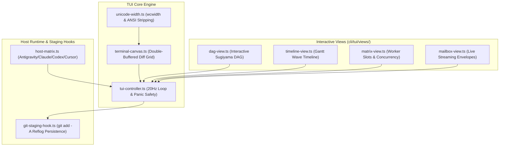

# Interactive Terminal UI (TUI) Dashboard & Host Adapters Plan

> **Tracking ID:** `fb-cli-interactive-tui`  
> **Status:** `PLANNED - READY FOR EXECUTION`  
> **Parent Blueprint:** `docs/planning/unified-storage-communication-tui-revamp/PLAN.md`  
> **Target Subsystems:** `olt/scripts/src/cli/tui/`, `olt/scripts/src/authority/hosts/`, `olt/scripts/src/engine/runner/lifecycle/`  
> **Author:** Tier 0 Strategic Mind Supervisor & Master CLI/TUI Architect  
> **Specification Version:** `2.0.0-PROD`

---

[Overview](#1-executive-summary--core-motivation) | [Architecture](#2-architectural-specifications--mathematical-models) | [TypeScript Contracts](#3-typescript-schemas--concrete-contracts) | [Execution Tasks](#4-modular-work-breakdown--execution-waves) | [Traceability Matrix](#5-defect--backlog-traceability-matrix) | [Acceptance Invariants](#6-strict-compliance-invariants--acceptance-checklist)

---

## 1. Executive Summary & Core Motivation

Real-time monitoring of autonomous multi-agent systems has traditionally been limited to static logs or disjoint terminal output. This created critical operational challenges:

1. **Terminal Flicker & High CPU Draw:** Standard in-terminal refreshers clear the full screen on every tick, causing heavy visual flickering and consuming excess CPU.
2. **Unicode Alignment Jitter:** Emojis and fullwidth CJK characters take 2 visual columns but 1 code point, causing right-hand borders in ASCII/Unicode boxes to misalign.
3. **Broken Terminal State on Abrupt Exit:** When an agent crashes or the user hits `Ctrl+C`, terminals often remain trapped in raw mode with hidden cursors.
4. **Host Runtime Divergence (`fb-host-matrix-unified-model-hierarchy-20260829`):** Inconsistent model and scheduler definitions between CLI and IDE host runners.
5. **Crash Safety Between Milestones (`inv-subdomain-git-staging-reflog-safety`):** Abrupt container termination before formal git commits risked unpersisted workspace modifications.

This plan delivers:

- A high-performance, double-buffered ANSI diff canvas (`terminal-canvas.ts`) with a 20Hz debounced render loop emitting updates only for modified cells.
- A robust Unicode `wcwidth` engine (`unicode-width.ts`) guaranteeing 100% stable border alignment across all glyphs.
- An interactive view switcher: Sugiyama DAG View, Wave/Lane Timeline, Concurrency Matrix, Mailbox Inspector, and Task Detail Inspector.
- Panic-safe signal hooks (`SIGINT`, `SIGTERM`, `uncaughtException`) and headless CI/CD fallback.
- Unified host matrix adapter (`host-matrix.ts`) standardizing Antigravity, Claude Code, Codex, and Cursor model tiers and cadences.
- Sub-domain completion git auto-staging hook (`git-staging-hook.ts`, `git add -A`) ensuring immediate disk blob persistence in `.git/objects/`.

---

## 2. Architectural Specifications & Mathematical Models



### 2.1 Double-Buffered ANSI Diff Mathematics

1. **Character Cell Representation:**
   $$\text{Cell} = \langle \text{char}, \text{width}, \text{fg\_rgb}, \text{bg\_rgb}, \text{bold}, \text{dim}, \text{underline} \rangle$$
2. **Cell Diff Minimization Algorithm:**
   Let $F_{\text{curr}}$ and $F_{\text{prev}}$ be grids of dimension $R \times C$.
   $$\text{DiffCells} = \{ (r, c) \mid F_{\text{curr}}[r, c] \ne F_{\text{prev}}[r, c] \}$$
   - Group contiguous modified cells in each row into single ANSI escape runs.
   - For an idle dashboard, $|\text{DiffCells}| = 0 \implies 0$ emitted terminal bytes.
3. **Unicode Visual Width Engine (`unicode-width.ts`):**
   - Strips ANSI color escapes: `s.replace(/\x1b\[[0-9;]*m/g, '')`.
   - Computes visual cell width: Single-width ($1$), Fullwidth/CJK ($2$), Emojis ($2$), Zero-width joiners ($0$).
   - Pads or clips strings to target visual column width exactly: $W_{\text{target}} \pm 0$ cells.

### 2.2 Unified Host Execution Matrix

| Host Identifier | Tier 0-2 (Supervisor/Orchestrator/Coordinator) | Tier 3 (Implementer/Validator) | Thinking Effort | Scheduler Cadence             |
| :-------------- | :--------------------------------------------- | :----------------------------- | :-------------- | :---------------------------- |
| `antigravity`   | `gemini-3.7-flash`                             | `gemini-3.7-flash`             | High Thinking   | 5-min (`*/5 * * * *`, 300s)   |
| `claude_code`   | `claude-opus-5`                                | `claude-sonnet-5`              | High Thinking   | 15-min (`*/15 * * * *`, 900s) |
| `codex`         | `gpt-5.6-sol`                                  | `gpt-5.6-terra`                | High Thinking   | 15-min (`*/15 * * * *`, 900s) |
| `cursor`        | Cursor Latest Model                            | Cursor Latest Model            | High Thinking   | 5-min (`*/5 * * * *`, 300s)   |

---

## 3. TypeScript Schemas & Concrete Contracts

All interfaces enforce **0 `any`** and **0 compiler suppressions**.

```typescript
export interface AnsiCell {
  readonly char: string;
  readonly width: number;
  readonly foregroundRgb?: readonly [number, number, number] | undefined;
  readonly backgroundRgb?: readonly [number, number, number] | undefined;
  readonly bold?: boolean | undefined;
  readonly dim?: boolean | undefined;
  readonly underline?: boolean | undefined;
}

export type TuiViewId = "dag" | "timeline" | "matrix" | "mailboxes" | "inspector";

export interface TuiDashboardState {
  readonly activeView: TuiViewId;
  readonly runId: string;
  readonly waveIndex: number;
  readonly selectedTaskId: string | null;
  readonly selectedMailboxId: string | null;
  readonly isPaused: boolean;
  readonly fps: number;
  readonly lastRefreshTimestamp: string;
}

export type HostType = "antigravity" | "claude_code" | "codex" | "cursor";

export interface HostModelTierConfig {
  readonly model: string;
  readonly thinking_effort: "high" | "medium" | "low" | "none";
  readonly scheduler?:
    | {
        readonly cron: string;
        readonly interval_seconds: number;
        readonly enabled: boolean;
      }
    | undefined;
}

export interface HostExecutionPolicy {
  readonly host: HostType;
  readonly tierModels: Readonly<Record<number, HostModelTierConfig>>;
  readonly isUnifiedHost: boolean;
}

export interface GitStagingAuditResult {
  readonly subDomainId: string;
  readonly stagedFiles: readonly string[];
  readonly gitObjectsPersisted: boolean;
  readonly timestamp: string;
}
```

---

## 4. Modular Work Breakdown & Execution Waves

Tasks target $\le 3$ files each, comply with 5-minute SLAs ($P = \lceil W / S \rceil$), and enforce anti-stub failure criteria.

```text
Wave 1 (Canvas & Unicode Width Engine) ──► [Task 1.1: Unicode Width]        + [Task 1.2: Terminal Canvas Diff Grid]
                                                 │
                                                 ▼
Wave 2 (Interactive View Modules)      ──► [Task 2.1: DAG & Timeline Views] + [Task 2.2: Matrix & Mailbox Views]
                                                 │
                                                 ▼
Wave 3 (Controller & Panic Lifecycle)  ──► [Task 3.1: TUI Master Controller] + [Task 3.2: CLI Command Registration]
                                                 │
                                                 ▼
Wave 4 (Host Matrix & Staging Invariant)──► [Task 4.1: Unified Host Matrix]   + [Task 4.2: Git Staging Safety Hook]
```

### Wave 1: Unicode Width & ANSI Diff Canvas

#### Task 1.1: Unicode Visual Width & ANSI Parser

- **Target Files (Max 1):**
  - `olt/scripts/src/cli/tui/unicode-width.ts`
- **Write Scope:** `olt/scripts/src/cli/tui/`
- **Read-Only Scope:** `olt/scripts/src/reporting/`
- **SLA:** 4 minutes ($W=1, S=1, P=1$)
- **Symbols Exported:** `getCharacterWidth()`, `getStringCellWidth()`, `padToVisualWidth()`, `stripAnsiEscapes()`
- **Anti-Stub Failure Criteria:**
  - Wide emojis (⚡, 🔍, 🚀) and fullwidth characters must return visual width 2.
  - Stripping ANSI escapes must return pure clean text length with 0 escape sequences remaining.
- **Verification Gate:** `bun test tests/unit/cli/tui/unicode-width.test.ts`

#### Task 1.2: Double-Buffered ANSI Diff Canvas

- **Target Files (Max 1):**
  - `olt/scripts/src/cli/tui/terminal-canvas.ts`
- **Write Scope:** `olt/scripts/src/cli/tui/`
- **Read-Only Scope:** `olt/scripts/src/cli/tui/unicode-width.ts`
- **SLA:** 4 minutes ($W=1, S=1, P=1$)
- **Symbols Exported:** `createTerminalCanvas()`, `renderCellDiff()`, `flushCanvasBuffer()`
- **Anti-Stub Failure Criteria:**
  - Rendering an unchanged frame must emit strictly 0 bytes to output stream.
  - Modifying 1 character cell must emit only ANSI repositioning escapes for that specific cell.
- **Verification Gate:** `bun test tests/unit/cli/tui/terminal-canvas.test.ts`

---

### Wave 2: Interactive View Modules

#### Task 2.1: Sugiyama DAG & Timeline Views

- **Target Files (Max 2):**
  - `olt/scripts/src/cli/tui/views/dag-view.ts`
  - `olt/scripts/src/cli/tui/views/timeline-view.ts`
- **Write Scope:** `olt/scripts/src/cli/tui/views/`
- **Read-Only Scope:** `olt/scripts/src/reporting/sugiyama-dag/`
- **SLA:** 5 minutes ($W=2, S=1, P=2$)
- **Symbols Exported:** `renderDagView()`, `handleDagViewInput()`, `renderTimelineView()`
- **Anti-Stub Failure Criteria:**
  - Interactive zoom and pan keys (`h/j/k/l`, arrow keys) must scroll viewport accurately.
  - Timeline view must render active execution waves as proportional ASCII bar graphs.
- **Verification Gate:** `bun test tests/unit/cli/tui/views-dag-timeline.test.ts`

#### Task 2.2: Concurrency Matrix & Mailbox Stream Views

- **Target Files (Max 2):**
  - `olt/scripts/src/cli/tui/views/matrix-view.ts`
  - `olt/scripts/src/cli/tui/views/mailbox-view.ts`
- **Write Scope:** `olt/scripts/src/cli/tui/views/`
- **Read-Only Scope:** `olt/scripts/src/communication/mailbox/`
- **SLA:** 5 minutes ($W=2, S=1, P=2$)
- **Symbols Exported:** `renderMatrixView()`, `renderMailboxView()`, `filterMailboxEvents()`
- **Anti-Stub Failure Criteria:**
  - Matrix view renders active worker allocations, memory usage, and lease countdown timers.
  - Mailbox view streams live inbound/outbound envelopes with formatted timestamps and payload snippets.
- **Verification Gate:** `bun test tests/unit/cli/tui/views-matrix-mailbox.test.ts`

---

### Wave 3: Master Controller & CLI Command Registration

#### Task 3.1: TUI Master Controller & Panic Safety Engine

- **Target Files (Max 1):**
  - `olt/scripts/src/cli/tui/tui-controller.ts`
- **Write Scope:** `olt/scripts/src/cli/tui/tui-controller.ts`
- **Read-Only Scope:** `olt/scripts/src/cli/tui/`
- **SLA:** 5 minutes ($W=1, S=1, P=1$)
- **Symbols Exported:** `startTuiDashboard()`, `stopTuiDashboard()`, `setupSignalHandlers()`
- **Anti-Stub Failure Criteria:**
  - Emitting SIGINT must restore terminal cursor (`\x1b[?25h`), leave alternate screen buffer (`\x1b[?1049l`), and exit cleanly with code 0.
  - In non-TTY / CI environments, automatically drops down to plain-text snapshot streaming without crashing.
- **Verification Gate:** `bun test tests/unit/cli/tui/tui-controller.test.ts`

#### Task 3.2: CLI Command Registration (`bun harness.ts tui`)

- **Target Files (Max 1):**
  - `olt/scripts/src/cli/commands/tui-cmd.ts`
- **Write Scope:** `olt/scripts/src/cli/commands/tui-cmd.ts`
- **Read-Only Scope:** `olt/scripts/src/cli/tui/tui-controller.ts`
- **SLA:** 3 minutes ($W=1, S=1, P=1$)
- **Symbols Exported:** `executeTuiCommand()`, `registerTuiCommands()`
- **Anti-Stub Failure Criteria:**
  - Executing `bun harness.ts tui --help` displays full flag documentation (`--watch`, `--run`, `--view`, `--fps`).
- **Verification Gate:** `bun test tests/unit/cli/commands/tui-cmd.test.ts`

---

### Wave 4: Unified Host Matrix & Sub-Domain Git Staging Hook

#### Task 4.1: Unified Host Matrix & Model Resolver

- **Target Files (Max 1):**
  - `olt/scripts/src/authority/hosts/host-matrix.ts`
- **Write Scope:** `olt/scripts/src/authority/hosts/host-matrix.ts`
- **Read-Only Scope:** `olt/scripts/src/policy/`
- **SLA:** 4 minutes ($W=1, S=1, P=1$)
- **Symbols Exported:** `resolveHostConfig()`, `getTierModelConfig()`, `assertUnifiedHostParity()`
- **Anti-Stub Failure Criteria:**
  - Querying `antigravity` returns `gemini-3.7-flash` (300s), `claude_code` returns `claude-opus-5` (Tiers 0-2) / `claude-sonnet-5` (Tier 3) (900s), `codex` returns `gpt-5.6-sol` / `gpt-5.6-terra` (900s), and `cursor` returns Cursor Latest Model (300s).
- **Verification Gate:** `bun test tests/unit/authority/host-matrix.test.ts`

#### Task 4.2: Sub-Domain Completion Git Auto-Staging Hook

- **Target Files (Max 1):**
  - `olt/scripts/src/engine/runner/lifecycle/git-staging-hook.ts`
- **Write Scope:** `olt/scripts/src/engine/runner/lifecycle/git-staging-hook.ts`
- **Read-Only Scope:** `olt/scripts/src/workflow/`
- **SLA:** 4 minutes ($W=1, S=1, P=1$)
- **Symbols Exported:** `stageCompletedSubDomainArtifacts()`, `assertGitObjectPersistence()`
- **Anti-Stub Failure Criteria:**
  - Sub-task completion immediately executes `git add -A`.
  - Verifies loose Git objects are written to `.git/objects/` prior to emitting task completion receipt.
- **Verification Gate:** `bun test tests/unit/engine/git-staging-hook.test.ts`

---

## 5. Defect & Backlog Traceability Matrix

| Defect / Backlog ID                               | Description                                         | Component Resolution                                         | Concrete Symbols                          | Discriminating Verification Gate                      |
| :------------------------------------------------ | :-------------------------------------------------- | :----------------------------------------------------------- | :---------------------------------------- | :---------------------------------------------------- |
| `fb-host-matrix-unified-model-hierarchy-20260829` | Divergent host configurations between CLI and IDE.  | Unified host execution matrix resolving models and cadences. | `resolveHostConfig`, `getTierModelConfig` | `bun test tests/unit/authority/host-matrix.test.ts`   |
| `inv-subdomain-git-staging-reflog-safety`         | Risk of file loss during container terminations.    | Immediate `git add -A` hook persisting objects to disk.      | `stageCompletedSubDomainArtifacts`        | `bun test tests/unit/engine/git-staging-hook.test.ts` |
| `fb-tui-ansi-diff-canvas`                         | Fullscreen terminal flicker on 20Hz refresh loops.  | Double-buffered character cell diff grid.                    | `createTerminalCanvas`, `renderCellDiff`  | `bun test tests/unit/cli/tui/terminal-canvas.test.ts` |
| `fb-tui-unicode-width-stability`                  | Wide emojis and Asian characters break box borders. | `wcwidth` visual width padding and ANSI stripper.            | `padToVisualWidth`, `getCharacterWidth`   | `bun test tests/unit/cli/tui/unicode-width.test.ts`   |

---

## 6. Strict Compliance Invariants & Acceptance Checklist

1. **0 TypeScript `any` & 0 Compiler Suppressions:** Purity scanner verifies zero `@ts-ignore`, `@ts-expect-error`, or `any` types.
2. **Strict File & Directory Limits:** Every source file $\le 300$ physical lines; every directory $\le 10$ files.
3. **Panic Safety Guarantee:** Terminal state is 100% restored on any termination signal or unhandled error.
4. **Zero ANSI Flicker:** Diff engine emits 0 bytes on idle frames and updates only mutated cells.
5. **Immediate Git Staging (`git add -A`):** Upon completing any task or milestone, stage all files immediately to persist loose Git objects to disk for reflog safety.
