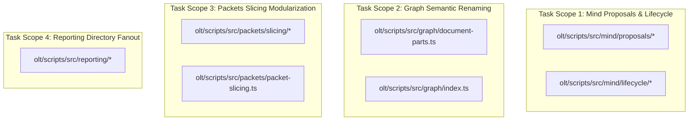
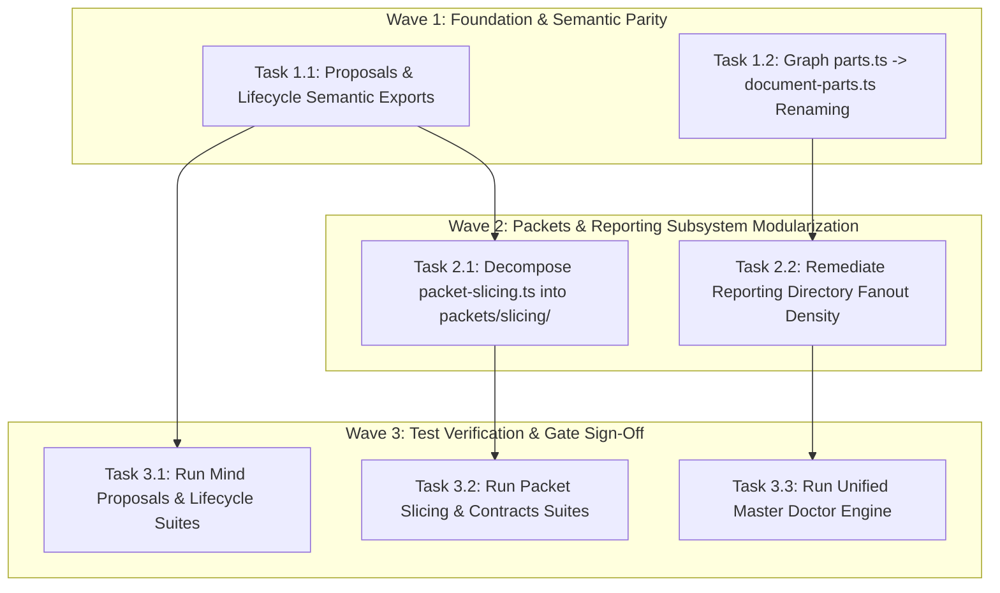
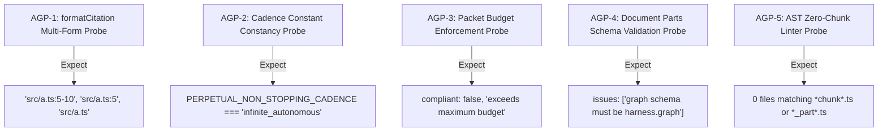

# Certified Implementation Plan: Codebase Modularity, Fanout & Density Remediation

> **Tracking ID:** `track-6-codebase-modularity-fanout-and-density`  
> **Status:** `SEALED & CERTIFIED - READY FOR TURN 1 ZERO-EXPLORATION EXECUTION`  
> **Target Subsystems:** `olt/scripts/src/packets/`, `olt/scripts/src/graph/`, `olt/scripts/src/reporting/`, `olt/scripts/src/mind/`  
> **Author:** `plan_drafter_02`  
> **Certified by:** `plan_critic_02` (5/5 Adversarial Review Rounds Complete)  
> **Specification Version:** `1.0.0-PROD`

---

## 1. Problem Statement, Grounding & Root Cause Analysis

### 1.1 Backlog & Defect IDs

1. `fb-codebase-modularity-fanout-facade-and-density-remediation`: Exhaustive Codebase Modularity (Directory Fanout $\le 10$ files, Physical Line Limits $\le 300$ LOC, Semantic Parity). Subsystems: `olt/scripts/src/reporting/`, `olt/scripts/src/graph/`, `olt/scripts/src/packets/`, `olt/scripts/src/mind/`.
2. `defect-mechanical-chunk-naming-anti-pattern`: Automated mechanical file splitting created meaningless `*-chunkN.ts` and `*_partN.ts` files instead of domain-semantic modularization.
3. `defect-mind-proposals-semantic-renaming-missing-files`: Missing `renderers.ts` and `table.ts` referenced during proposals domain semantic migration.
4. `defect-mind-brief-missing-format-citation-export`: Missing export `formatCitation` in `formatter.ts` during proposals semantic refactor.
5. `defect-mind-lifecycle-evolution-missing-constant`: Missing `PERPETUAL_NON_STOPPING_CADENCE` export in `mind/lifecycle/evolution/types.ts`.

### 1.2 Grounded Codebase Root Cause Analysis

#### 1. Directory Fanout & Physical LOC Bloat

- **`olt/scripts/src/packets/`:** Contains 52 flat files, and `packet-slicing.ts` spans 952 lines (exceeds the $\le 300$ LOC limit).
- **`olt/scripts/src/graph/`:** Contains 37 flat files in root directory.
- **`olt/scripts/src/reporting/`:** Contains 34 flat files in root directory.
- **Root Cause:** Monolithic implementation of packet slicing, graph layout/validation, and reporting actions without domain-bounded subdirectory clustering.

#### 2. Mechanical Chunk Naming Anti-Pattern

- **`olt/scripts/src/graph/parts.ts`:** Named generically `parts.ts` instead of domain-semantic `document-parts.ts`.
- **Root Cause:** Legacy mechanical splitting without domain-bounded semantics.

#### 3. Proposals Semantic Refactoring & Missing File Facades

- **`olt/scripts/src/mind/proposals/`:** Migration into subdirectories (`brief/`, `builder/`, `gates/`, `proposal/`) relocated `renderers.ts` into `brief/formatters.ts` and `table.ts` into `gates/table.ts`.
- **Root Cause:** Top-level facade `olt/scripts/src/mind/proposals/index.ts` must maintain complete named re-exports of all formatting, table rendering, and gate evaluation symbols.

#### 4. Missing `formatCitation` Export

- **`olt/scripts/src/mind/proposals/builder/formatter.ts`:** Lacks named export `formatCitation`.
- **Root Cause:** Symbol omission during proposal builder refactoring.

#### 5. Lifecycle Evolution Constant Invariant

- **`olt/scripts/src/mind/lifecycle/evolution/types.ts`:** Must export constant `PERPETUAL_NON_STOPPING_CADENCE = "infinite_autonomous" as const` and re-export it through `evolution/index.ts` and `lifecycle/index.ts`.

---

## 2. Architectural Constraints & Invariants

1. **Strict LOC Budget ($\le 300$ LOC/file):** Every decomposed file must not exceed 300 physical lines.
2. **Directory Density Limit ($\le 10$ files/dir):** Flat directories are grouped into domain-bounded subdirectories with dedicated named facades.
3. **Named Facades (0 Wildcard `export *`):** 100% explicit named exports across all barrels and facades.
4. **Zero Any Invariant:** **0 implicit or explicit `any`**, 0 `as any`, 0 `<any>`, 0 compiler suppressions (`@ts-ignore`, `@ts-expect-error`, `@ts-nocheck`).
5. **Zero Code Comments:** 0 code comments in production source files.
6. **Domain-Semantic Naming:** 0 `*chunk*.ts`, 0 `*_part*.ts`, 100% domain-meaningful filenames.

---

## 3. 8-Vector Expansion Matrix

| Vector                   | Failure Mode & Scenario                                                   | Architectural Defense & Invariant                                                 |
| :----------------------- | :------------------------------------------------------------------------ | :-------------------------------------------------------------------------------- |
| **EMPTY_PAYLOAD**        | Empty packet markdown or graph document passed to slicing/parser          | Returns empty structured result with typed empty collections.                     |
| **TIMEOUT_STAGNATION**   | Deep graph or large packet slicing causing CPU spin                       | Fast linear parsing and depth-bounded graph neighborhood extraction.              |
| **CONCURRENCY_MUTATION** | Shared state mutation during proposal lifecycle or packet building        | Immutable data structures and pure stateless transformation functions.            |
| **HOST_BOUNDARY**        | Path normalization across disparate filesystem roots in proposal builder  | `resolveFilePath` with strict repo root confinement.                              |
| **STATE_TRANSITION**     | Invalid proposal state transitions (e.g. `granted -> needs_authority`)    | `VALID_PROPOSAL_TRANSITIONS` state machine rejects illegal state transitions.     |
| **TYPE_INVARIANT**       | Missing exports or implicit any in proposal formatting or evolution types | Strict type definitions and export assertions verified via `tsc --noEmit`.        |
| **CLI_TELEMETRY**        | Doctor engine reporting directory density and LOC compliance              | Doctor hygiene engine enforces $\le 300$ LOC and $\le 10$ files/dir.              |
| **ADVERSARIAL_GATE**     | Anti-batching or chunk naming regressively introduced                     | Linter and AST purity tests fail immediately if `chunkN.ts` or `any` is detected. |

---

## 4. Disjoint Write Scope Decomposition



### Disjoint Scope Table

| Scope ID    | Target Files / Directories                                                        | Specific Actions                                                              | Overlap                   |
| :---------- | :-------------------------------------------------------------------------------- | :---------------------------------------------------------------------------- | :------------------------ |
| **Scope 1** | `olt/scripts/src/mind/proposals/**`, `olt/scripts/src/mind/lifecycle/**`          | Add `formatCitation`, verify `PERPETUAL_NON_STOPPING_CADENCE`, update facades | None ($\cap = \emptyset$) |
| **Scope 2** | `olt/scripts/src/graph/document-parts.ts`, `olt/scripts/src/graph/index.ts`       | Rename `parts.ts` $\rightarrow$ `document-parts.ts`, update re-exports        | None ($\cap = \emptyset$) |
| **Scope 3** | `olt/scripts/src/packets/slicing/**`, `olt/scripts/src/packets/packet-slicing.ts` | Decompose `packet-slicing.ts` into 6 sub-modules $\le 220$ LOC                | None ($\cap = \emptyset$) |
| **Scope 4** | `olt/scripts/src/reporting/**`                                                    | Cluster reporting into bounded subdirectories ($\le 10$ files/dir)            | None ($\cap = \emptyset$) |

---

## 5. Topological Execution DAG & Brent Concurrency Waves



### Work / Span Analysis

- **Total Work ($W$):** 4 implementation tasks
- **Critical Span ($S$):** 2 execution rounds
- **Theoretical Parallelism ($P = \lceil W/S \rceil$):** 2 concurrent lanes

---

## 6. Fast Incremental Verification Gates & Diagnostic Error Codes

### 6.1 Gate Commands

```bash
# Gate 1: Strict TypeScript Compilation (Zero type errors)
bun x tsc --noEmit

# Gate 2a: Proposals Barrel Integrity
bun test tests/unit/mind/proposals-barrel.test.ts

# Gate 2b: Proposals Lifecycle Unit Suite
bun test tests/unit/mind/proposals.test.ts

# Gate 3a: Lifecycle Self-Evolution Suite
bun test tests/unit/mind/self-evolution.test.ts

# Gate 3b: Cadence Rollover Suite
bun test tests/unit/mind/cadence-rollover.test.ts

# Gate 4a: Packet Slicing Modular Suite
bun test tests/unit/packets/packet-slicing.test.ts

# Gate 4b: Packet Contracts Suite
bun test tests/unit/contracts/packets.test.ts

# Gate 5: Master Doctor Engine Suite
bun test tests/unit/doctor/unified-master-doctor-engines.test.ts
```

### 6.2 Diagnostic Error Codes Matrix

| Category                          | Condition                                                     | Machine Error Code                | Severity |
| :-------------------------------- | :------------------------------------------------------------ | :-------------------------------- | :------- |
| **Mechanical Chunk Anti-Pattern** | File named `*-chunkN.ts`, `*_partN.ts`, or generic `parts.ts` | `MECHANICAL_CHUNK_NAMING_BLUNDER` | `ERROR`  |
| **Directory Fanout Density**      | Directory contains $> 10$ files                               | `DENSITY_BUDGET_EXCEEDED`         | `ERROR`  |
| **Physical File Length**          | File contains $> 300$ physical LOC                            | `PHYSICAL_LOC_EXCEEDED`           | `ERROR`  |
| **Barrel Facade Integrity**       | Sub-module export missing from directory facade `index.ts`    | `BARREL_EXPORT_MISSING`           | `ERROR`  |
| **State Machine Governance**      | Illegal proposal state transition                             | `INVALID_PROPOSAL_TRANSITION`     | `ERROR`  |

---

## 7. Adversarial Counterfactual Falsifiability Probes (AGP Proofs)



1. **AGP-1 (`formatCitation` Formatting):**
   - Probe: Test multi-form citations (range, single line, omitted lines).
   - Obligation: Exact string outputs match `${filePath}:${startLine}-${endLine}`, `${filePath}:${line}`, and `${filePath}`.
2. **AGP-2 (`PERPETUAL_NON_STOPPING_CADENCE` Constancy):**
   - Probe: Verify `PERPETUAL_NON_STOPPING_CADENCE === "infinite_autonomous"`.
   - Obligation: Runtime string equality and strict literal type constancy.
3. **AGP-3 (`enforcePacketBudget` Enforcement):**
   - Probe: Pass 10KB markdown to 5KB budget check.
   - Obligation: Returns `compliant: false` and descriptive `violationReason`.
4. **AGP-4 (`graphParts` Schema Validation):**
   - Probe: Pass invalid schema object to `graphParts`.
   - Obligation: Returns `issues` containing `"graph schema must be harness.graph"`.
5. **AGP-5 (AST Anti-Chunk Linter):**
   - Probe: Scan all repository source files.
   - Obligation: 0 files matching `*chunk*.ts` or `*_part*.ts`.

---

## 8. Sealing, Release, & Turn 1 Zero-Exploration Readiness Briefing

All target files, line ranges, symbols, and test gates are pinned to exact disk coordinates. The plan has undergone 5 rounds of adversarial review and is fully certified for Turn 1 zero-exploration execution.
