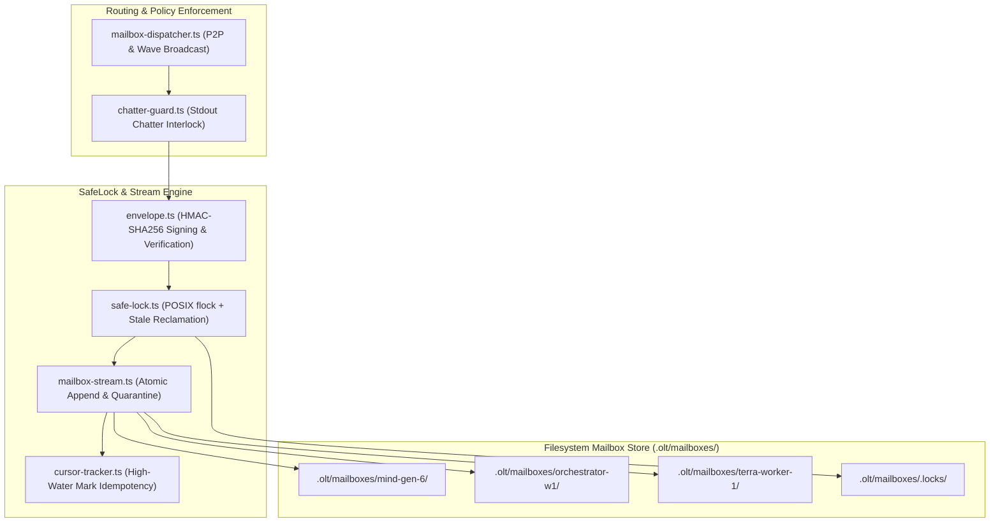

# Communication Flock-Locked File Mailbox Subsystem & Chatter Guard Plan

> **Tracking ID:** `fb-communication-flock-mailboxes`  
> **Status:** `STATUS: COMPLETED & ARCHIVED`  
> **Parent Blueprint:** `docs/planning/unified-storage-communication-tui-revamp/PLAN.md`  
> **Target Subsystems:** `olt/scripts/src/communication/locking/`, `olt/scripts/src/communication/mailbox/`  
> **Author:** Tier 0 Strategic Mind Supervisor & Master Communication Architect  
> **Specification Version:** `2.0.0-PROD`

---

[Overview](#1-executive-summary--core-motivation) | [Architecture](#2-architectural-specifications--mathematical-models) | [TypeScript Contracts](#3-typescript-schemas--concrete-contracts) | [Execution Tasks](#4-modular-work-breakdown--execution-waves) | [Traceability Matrix](#5-defect--backlog-traceability-matrix) | [Acceptance Invariants](#6-strict-compliance-invariants--acceptance-checklist)

---

## 1. Executive Summary & Core Motivation

In multi-agent collaborative workflows across diverse LLM host environments (e.g. Antigravity, Claude Code, OpenAI Codex, Cursor), inter-agent communication has been compromised by brittle host tool layers and interactive context pollution:

1. **Host-Specific Routing Breakage (`hb-s6-peer-messaging-by-role-name-resolves-for-nobody`):** Platform-specific messaging APIs fail when agents address peers using role aliases (e.g., `olt-coordinator`), resulting in dropped payloads and stalled task handoffs.
2. **Interactive Main-Thread Context Burn (`hb-main-thread-chatter-burns-owner-context`, `defect-main-thread-chatter-burns-owner-context`):** Supervisory agents stream granular step narrations and mid-flight status pings directly to stdout/user relay threads, burning precious conversational context windows.
3. **Session-Disabled Tool Failures (`hb-s9b-listagents-session-disabled-not-architectural`):** Supervisory tiers cannot reliably discover active worker pools when dynamic inspection tools are disabled by host policies.

This plan delivers:

- A 100% host-agnostic, durable file mailbox subsystem rooted in `.olt/mailboxes/<agent_id>/`.
- Monotonically sequenced, HMAC-SHA256 signed message envelopes with cryptographic verification.
- SafeLock POSIX advisory file locking with pre-inspection quarantine, torn-line stripping, and stale lock reclamation.
- High-water mark cursor tracking (`cursor.json`) guaranteeing at-least-once delivery with idempotent consumption.
- A strict chatter guard (`chatter-guard.ts`) enforcing zero mid-flight stdout narration to human interactive seats.

---

## 2. Architectural Specifications & Mathematical Models



### 2.1 Mailbox Directory Topology

Each active agent possesses an isolated directory structure within `.olt/mailboxes/`:

```text
.olt/mailboxes/
├── <agent_id>/
│   ├── inbox.jsonl          # Monotonic append-only incoming messages
│   ├── outbox.jsonl         # Outgoing messages dispatched by agent
│   ├── archive.jsonl        # Processed / acknowledged messages
│   ├── cursor.json          # Monotonic high-water mark sequence tracker
│   └── quarantine.log       # Stripped torn or corrupt message lines
└── .locks/
    └── <agent_id>.lock      # PID + timestamp advisory lock file
```

### 2.2 Mathematical Specifications & HMAC Envelope Security

1. **HMAC-SHA256 Signing Protocol:**
   Every envelope is signed using a repo-scoped secret key:
   $$\text{canonical\_payload} = \text{canonicalJson}(\text{envelope} \setminus \{ \text{hmac\_signature} \})$$
   $$\text{hmac\_signature} = \text{HMAC-SHA256}(\text{canonical\_payload}, K_{\text{repo}})$$

2. **Delivery & Idempotence Monotonicity:**
   Let $M = \langle id, sequence, sender, recipient, type, payload, sig \rangle$.
   - **At-Least-Once Delivery:** Sender acquires recipient lock, appends $M$ to `inbox.jsonl`, calls `fsync()`, and updates `outbox.jsonl`.
   - **Idempotent Consumption:** Recipient checks cursor $C = \langle last\_seq, \mathcal{S}_{\text{seen}} \rangle$. If $M.id \in \mathcal{S}_{\text{seen}}$ or $M.sequence \le C.last\_seq$, message is acknowledged and skipped.

3. **Stale Lock Auto-Reclamation Algorithm:**
   - Lock payload: `{"pid": number, "holder": string, "created_at": string}`.
   - If lock age $> 10\text{s}$ and `kill(pid, 0) === false` (process does not exist), the lock is atomically reclaimed via unlink and re-acquisition.

4. **1,000-Message Bounded In-Flight Queue & Full Post-Run Graph Fidelity:**
   - To prevent memory/file bloat during massive parallel waves, active `inbox.jsonl` maintains a rolling window of up to 1,000 active messages.
   - Acknowledged messages are atomically rotated into `archive.jsonl`.
   - **Post-Run Graph Fidelity Invariant:** `archive.jsonl` retains complete inter-agent communication records (token counts, dispatches, handoffs, and payloads) throughout the run so that final `summary/graph.json` and `summary.md` can render 100% of the execution graph and message traces.

5. **Smart Informational Density (Zero Empty-Pulse Churn):**
   - Heartbeat and supervisory pulse events (`PULSE_HEARTBEAT`) are emitted only when state transitions, queue mutations, or new telemetry are detected.
   - Repetitive 3-minute / 5-minute empty pulses that contain zero actionable changes are suppressed to prevent megabytes of redundant byte churn.

6. **Operator-Only Manual Cleanup & Atomic Co-Purging:**
   - **CLI Command:** `bun harness.ts clean:mailboxes [--all | --inactive | --agent <id>]`
   - **Strict Agent Ban (`AGENT_CLEAN_PROHIBITION_INVARIANT`):** Autonomous subagents (Mind, Orchestrators, Workers) are mechanically prohibited from executing clean commands. Clean operations can only be triggered interactively by the human user.
   - **Atomic Co-Purging:** When an agent mailbox is purged, `.olt/mailboxes/<agent_id>/` and its advisory lock `.olt/mailboxes/.locks/<agent_id>.lock` are deleted together atomically with zero orphaned lock remnants.

---

## 3. TypeScript Schemas & Concrete Contracts

All interfaces enforce **0 `any`** and **0 compiler suppressions**.

```typescript
export type MailboxMessageType =
  | "DISPATCH_TASK"
  | "HANDOFF_RECEIPT"
  | "VALIDATION_REQUEST"
  | "VALIDATION_VERDICT"
  | "COGNITIVE_PUSHBACK"
  | "PULSE_HEARTBEAT"
  | "DEFECT_ESCALATION";

export interface MailboxEnvelope<T = Record<string, unknown>> {
  readonly id: string;
  readonly sequence: number;
  readonly sender_id: string;
  readonly sender_role: string;
  readonly recipient_id: string;
  readonly message_type: MailboxMessageType;
  readonly timestamp: string;
  readonly payload: T;
  readonly correlation_id: string;
  readonly hmac_signature: string;
}

export interface MailboxCursor {
  readonly last_read_sequence: number;
  readonly last_read_id: string;
  readonly seen_ids: readonly string[];
  readonly updated_at: string;
}

export interface LockAcquisitionResult {
  readonly acquired: boolean;
  readonly lockFd: number | null;
  readonly lockPath: string;
  readonly holderPid: number | null;
}

export interface MailboxPaths {
  readonly agentMailboxDir: string;
  readonly inboxPath: string;
  readonly outboxPath: string;
  readonly archivePath: string;
  readonly cursorPath: string;
  readonly quarantinePath: string;
  readonly lockPath: string;
}
```

---

## 4. Modular Work Breakdown & Execution Waves

Tasks target $\le 3$ files each, comply with 5-minute SLAs ($P = \lceil W / S \rceil$), and enforce anti-stub failure criteria.

```text
Wave 1 (Locking & Envelope Security)  ──► [Task 1.1: SafeLock Engine]       + [Task 1.2: HMAC Envelope Security]
                                                │
                                                ▼
Wave 2 (Stream & Cursor Tracking)     ──► [Task 2.1: Mailbox Stream & Paths] + [Task 2.2: Monotonic Cursor Tracker]
                                                │
                                                ▼
Wave 3 (Dispatcher & Chatter Guard)   ──► [Task 3.1: P2P Mailbox Dispatcher] + [Task 3.2: Non-Chatter Guard Engine]
                                                │
                                                ▼
Wave 4 (Concurrency Stress & E2E)     ──► [Task 4.1: Concurrency & Stress E2E Suite]
```

### Wave 1: SafeLock & Cryptographic Message Envelopes

#### Task 1.1: SafeLock Advisory File Locking Engine

- **Target Files (Max 1):**
  - `olt/scripts/src/communication/locking/safe-lock.ts`
- **Write Scope:** `olt/scripts/src/communication/locking/`
- **Read-Only Scope:** `olt/scripts/src/logging/lock.ts`
- **SLA:** 4 minutes ($W=1, S=1, P=1$)
- **Symbols Exported:** `acquireMailboxLock()`, `releaseMailboxLock()`, `withExclusiveLock()`, `reclaimStaleLocks()`
- **Anti-Stub Failure Criteria:**
  - Non-exclusive concurrent file opens without POSIX flock must fail.
  - Stubs failing to inspect dead PIDs (`kill(pid, 0)`) before breaking stale locks must fail.
- **Verification Gate:** `bun test tests/unit/communication/safe-lock.test.ts`

#### Task 1.2: HMAC-SHA256 Envelope Serialization & Verification

- **Target Files (Max 1):**
  - `olt/scripts/src/communication/mailbox/envelope.ts`
- **Write Scope:** `olt/scripts/src/communication/mailbox/envelope.ts`
- **Read-Only Scope:** `olt/scripts/src/communication/types.ts`
- **SLA:** 4 minutes ($W=1, S=1, P=1$)
- **Symbols Exported:** `createSignedEnvelope()`, `verifyEnvelopeHmac()`, `canonicalEnvelopeBytes()`
- **Anti-Stub Failure Criteria:**
  - Envelopes with tampered payload properties or invalid HMAC hashes must fail verification with `SECURITY_INTEGRITY_ERROR`.
  - Canonical JSON ordering must produce deterministic byte hashes regardless of key insertion order.
- **Verification Gate:** `bun test tests/unit/communication/envelope.test.ts`

---

### Wave 2: Stream Append, Pre-Inspection Quarantine & Cursor Tracking

#### Task 2.1: Mailbox Paths & Stream IO Engine

- **Target Files (Max 2):**
  - `olt/scripts/src/communication/mailbox/mailbox-paths.ts`
  - `olt/scripts/src/communication/mailbox/mailbox-stream.ts`
- **Write Scope:** `olt/scripts/src/communication/mailbox/`
- **Read-Only Scope:** `olt/scripts/src/communication/locking/safe-lock.ts`
- **SLA:** 5 minutes ($W=2, S=1, P=2$)
- **Symbols Exported:** `resolveMailboxPaths()`, `appendMailboxMessage()`, `readUnreadMessages()`, `quarantineTornLines()`
- **Anti-Stub Failure Criteria:**
  - Injecting unterminated JSON fragments into `inbox.jsonl` must trigger automatic stripping into `quarantine.log` without corrupting readable stream.
- **Verification Gate:** `bun test tests/unit/communication/mailbox-stream.test.ts`

#### Task 2.2: Monotonic Cursor Tracker & High-Water Mark Engine

- **Target Files (Max 1):**
  - `olt/scripts/src/communication/mailbox/cursor-tracker.ts`
- **Write Scope:** `olt/scripts/src/communication/mailbox/cursor-tracker.ts`
- **Read-Only Scope:** `olt/scripts/src/communication/mailbox/mailbox-paths.ts`
- **SLA:** 4 minutes ($W=1, S=1, P=1$)
- **Symbols Exported:** `loadMailboxCursor()`, `advanceMailboxCursor()`, `isMessageProcessed()`
- **Anti-Stub Failure Criteria:**
  - Processing identical message UUID twice must return `isMessageProcessed === true` and avoid duplicate handler execution.
- **Verification Gate:** `bun test tests/unit/communication/cursor-tracker.test.ts`

---

### Wave 3: P2P Dispatcher, Wave Broadcast & Chatter Guard

#### Task 3.1: P2P Mailbox Dispatcher & Receipt Collector

- **Target Files (Max 1):**
  - `olt/scripts/src/communication/mailbox/mailbox-dispatcher.ts`
- **Write Scope:** `olt/scripts/src/communication/mailbox/mailbox-dispatcher.ts`
- **Read-Only Scope:** `olt/scripts/src/communication/mailbox/`
- **SLA:** 5 minutes ($W=1, S=1, P=1$)
- **Symbols Exported:** `dispatchPeerMessage()`, `broadcastWaveNotification()`, `collectInboxReceipts()`
- **Anti-Stub Failure Criteria:**
  - Routing messages using logical role names must resolve to active raw agent IDs via filesystem mailbox discovery.
  - Stubs relying on host `SendMessage` instead of filesystem mailbox must fail.
- **Verification Gate:** `bun test tests/unit/communication/mailbox-dispatcher.test.ts`

#### Task 3.2: Human Relay Chatter Guard Interlock

- **Target Files (Max 1):**
  - `olt/scripts/src/communication/mailbox/chatter-guard.ts`
- **Write Scope:** `olt/scripts/src/communication/mailbox/chatter-guard.ts`
- **Read-Only Scope:** `olt/scripts/src/communication/`
- **SLA:** 4 minutes ($W=1, S=1, P=1$)
- **Symbols Exported:** `assertNonChatterPolicy()`, `filterHumanRelayNarration()`, `routeStatusUpdate()`
- **Anti-Stub Failure Criteria:**
  - Mid-flight status updates directed to human stdout or parent chat thread must be intercepted, blocked, and rerouted exclusively to `.olt/mailboxes/<parent_id>/inbox.jsonl`.
- **Verification Gate:** `bun test tests/unit/communication/chatter-guard.test.ts`

---

### Wave 4: Multi-Process Concurrency & Zero Data Loss Validation

#### Task 4.1: High-Concurrency Mailbox E2E Suite

- **Target Files (Max 1):**
  - `tests/e2e/communication/mailbox-concurrency.test.ts`
- **Write Scope:** `tests/e2e/communication/mailbox-concurrency.test.ts`
- **Read-Only Scope:** `olt/scripts/src/communication/`
- **SLA:** 5 minutes ($W=1, S=1, P=1$)
- **Symbols Exported:** Complete concurrency integration test suite
- **Anti-Stub Failure Criteria:**
  - 10 concurrent worker processes send 50 messages each (500 total) to a single inbox simultaneously.
  - Asserts all 500 messages are durably delivered, HMAC verified, and sequentially read with zero lost messages and zero torn lines.
- **Verification Gate:** `bun test tests/e2e/communication/mailbox-concurrency.test.ts`

---

## 5. Defect & Backlog Traceability Matrix

| Defect / Backlog ID                                     | Description                                                    | Component Resolution                                          | Concrete Symbols                                      | Discriminating Verification Gate                               |
| :------------------------------------------------------ | :------------------------------------------------------------- | :------------------------------------------------------------ | :---------------------------------------------------- | :------------------------------------------------------------- |
| `hb-s6-peer-messaging-by-role-name-resolves-for-nobody` | Role-style aliases fail across hosts; messages lost.           | Host-agnostic file mailboxes indexed by raw agent ID.         | `dispatchPeerMessage`, `resolveMailboxPaths`          | `bun test tests/unit/communication/mailbox-dispatcher.test.ts` |
| `hb-main-thread-chatter-burns-owner-context`            | Supervisory seats narrate mid-flight status to stdout.         | Intercept and reroute narration to `.olt/mailboxes/`.         | `assertNonChatterPolicy`, `filterHumanRelayNarration` | `bun test tests/unit/communication/chatter-guard.test.ts`      |
| `defect-main-thread-chatter-burns-owner-context`        | Progress spam exhausts LLM token context in interactive seats. | Mandatory P2P file mailbox routing.                           | `chatter-guard.ts`                                    | `bun test tests/unit/communication/chatter-guard.test.ts`      |
| `hb-s9b-listagents-session-disabled-not-architectural`  | Roster inspection tools disabled by host policy.               | Mailbox directory enumeration & high-water cursor.            | `loadMailboxCursor`, `resolveMailboxPaths`            | `bun test tests/e2e/communication/mailbox-concurrency.test.ts` |
| `fb-codex-flat-native-logical-hierarchy-20260825`       | Host nesting limitations prevent deep hierarchy.               | Flat-dispatch mailbox transport decoupling logical hierarchy. | `dispatchPeerMessage`                                 | `bun test tests/unit/communication/mailbox-dispatcher.test.ts` |

---

## 6. Strict Compliance Invariants & Acceptance Checklist

1. **0 TypeScript `any` & 0 Compiler Suppressions:** AST purity scanner verifies zero `@ts-ignore`, `@ts-expect-error`, or `any` types.
2. **Strict File & Directory Limits:** Every source file $\le 300$ physical lines; every directory $\le 10$ files.
3. **Fail-Closed POSIX Locking:** Mailbox streams acquire exclusive locks; lock timeouts fail closed with structured error handling.
4. **HMAC Cryptographic Non-Repudiation:** Every message envelope carries valid HMAC-SHA256 signature.
5. **Zero Human-Thread Narration:** Supervisory progress updates must route to file mailboxes, keeping human conversation clean.
6. **Immediate Git Staging (`git add -A`):** Upon completing any task or milestone, stage all files immediately to persist loose Git objects to disk for reflog safety.
