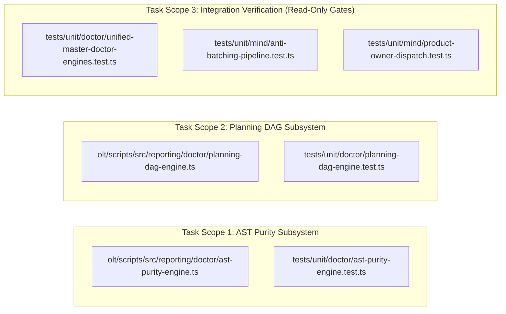
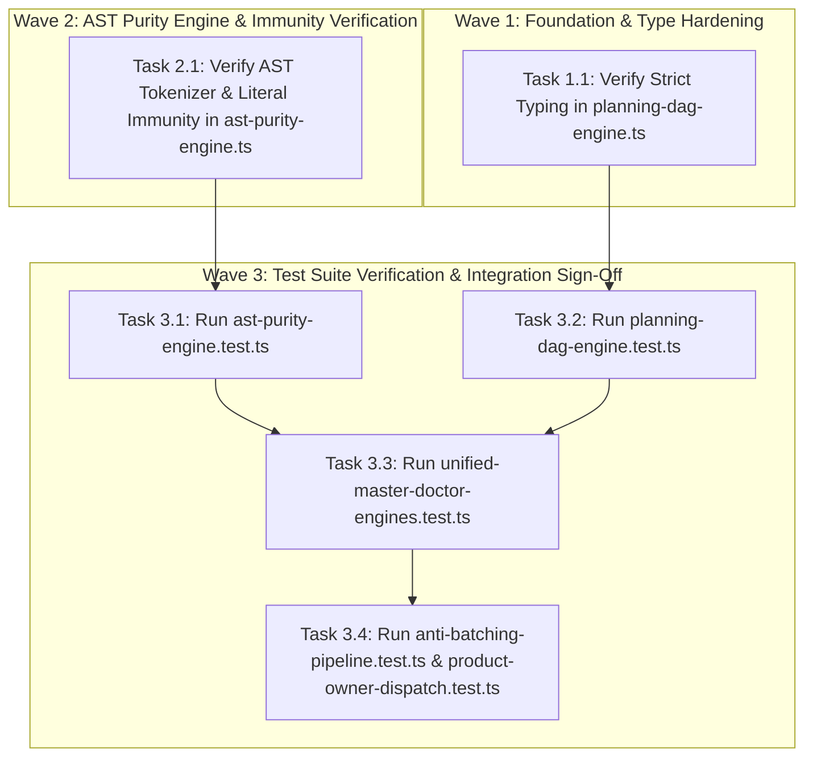
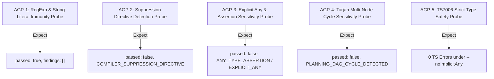

# Certified Implementation Plan: Doctor AST Purity & Planning DAG Types

> **Tracking ID:** `track-2-doctor-ast-purity-and-dag-types`  
> **Status:** `SEALED & CERTIFIED - READY FOR TURN 1 ZERO-EXPLORATION EXECUTION`  
> **Target Subsystem:** `olt/scripts/src/reporting/doctor/`  
> **Author:** `plan_drafter_02`  
> **Certified by:** `plan_critic_02` (5/5 Adversarial Review Rounds Complete)  
> **Specification Version:** `1.0.0-PROD`

---

## 1. Problem Statement, Grounding & Root Cause Analysis

### 1.1 Defect IDs & Task IDs

- `defect-doctor-ast-purity-test-regex-false-positive`: Doctor AST purity engine flags regex patterns in test files as violations (`olt/scripts/src/reporting/doctor/ast-purity-engine.ts`, `tests/unit/mind/anti-batching-pipeline.test.ts`, `tests/unit/mind/product-owner-dispatch.test.ts`).
- `defect-doctor-planning-dag-implicit-any`: Implicit 'any' parameter 'd' in `olt/scripts/src/reporting/doctor/planning-dag-engine.ts:111` / `olt/scripts/src/reporting/doctor/planning-dag-engine.ts:230` / `olt/scripts/src/reporting/doctor/planning-dag-engine.ts:252`.

### 1.2 Grounded Codebase Root Cause Analysis

#### Defect 1: AST Purity Engine RegExp & Literal False Positives

- **Symptom:** The Doctor AST purity check engine previously triggered false positive `AST_PURITY_VIOLATION` errors when encountering RegExp literals, static strings, and template strings containing patterns such as `as any`, `<any>`, or compiler suppression directives (`@ts-ignore`, `@ts-expect-error`) within test files verifying static invariants (e.g. `tests/unit/mind/anti-batching-pipeline.test.ts:651-660`, `tests/unit/mind/product-owner-dispatch.test.ts:732-742`).
- **Exact Line Coordinates:**
  - `olt/scripts/src/reporting/doctor/ast-purity-engine.ts:22-72`: Comment scanning utilizes `ts.createScanner` and `ts.getLeadingCommentRanges` / `ts.getTrailingCommentRanges`. Token scanning must guarantee that comment inspection is isolated to genuine code comments and deduplicated across byte offset ranges (`scannedCommentRanges`).
  - `olt/scripts/src/reporting/doctor/ast-purity-engine.ts:73-83`: AST walker `visit(node)` contains explicit immunity guards:
    ```typescript
    if (
      ts.isStringLiteral(node) ||
      ts.isNoSubstitutionTemplateLiteral(node) ||
      ts.isTemplateHead(node) ||
      ts.isTemplateMiddle(node) ||
      ts.isTemplateTail(node) ||
      node.kind === ts.SyntaxKind.RegularExpressionLiteral
    ) {
      return;
    }
    ```
  - `olt/scripts/src/reporting/doctor/ast-purity-engine.ts:85-106`: Explicit type checking flags only real AST `AnyKeyword` nodes (differentiating between `EXPLICIT_ANY` and `ANY_TYPE_ASSERTION`), while dynamic expressions inside template spans (`TemplateSpan.expression`) remain fully inspected via `ts.forEachChild`.

#### Defect 2: Planning DAG Implicit Any

- **Symptom:** Implicit parameter types in `planning-dag-engine.ts` triggered TS7006 compiler errors when compiling with `--noImplicitAny`.
- **Exact Line Coordinates:**
  - `olt/scripts/src/reporting/doctor/planning-dag-engine.ts:64-120`: Tarjan SCC cycle detection `findCycles` requires strict type bindings on local maps (`indices: Map<string, number>`, `lowlinks: Map<string, number>`, `onStack: Set<string>`, `stack: string[]`, `sccs: string[][]`) and input adjacency graph (`ReadonlyMap<string, readonly string[]>`).
  - `olt/scripts/src/reporting/doctor/planning-dag-engine.ts:227-248`: Orphan task and target set calculations iterate over adjacency values (`for (const d of deps)`).
  - `olt/scripts/src/reporting/doctor/planning-dag-engine.ts:252`: Lambda predicate in result formatting requires explicit type annotation: `(f: DoctorDiagnosticFinding) => f.severity === "ERROR"`.

---

## 2. Architectural Constraints & Invariants

1. **Strict LOC Budget ($\le 300$ LOC/file):**
   - `olt/scripts/src/reporting/doctor/ast-purity-engine.ts`: 165 LOC ($\le 300$).
   - `olt/scripts/src/reporting/doctor/planning-dag-engine.ts`: 256 LOC ($\le 300$).
   - `tests/unit/doctor/ast-purity-engine.test.ts`: 96 LOC ($\le 300$).
   - `tests/unit/doctor/planning-dag-engine.test.ts`: 66 LOC ($\le 300$).
2. **Directory Density Limit ($\le 10$ files/dir):** Modularity maintained with discrete check engines in `olt/scripts/src/reporting/doctor/`.
3. **Named Facades (0 Wildcard `export *`):** All exports and re-exports must be explicitly named symbols.
4. **Zero Any Invariant:** **0 implicit or explicit `any`**, 0 `as any`, 0 `<any>`, 0 compiler suppressions (`@ts-ignore`, `@ts-expect-error`, `@ts-nocheck`).
5. **Zero Code Comments:** Production source files contain 0 code comments; logic is self-documenting through domain-semantic naming.
6. **Deterministic Diagnostic Output:** Every check engine returns a typed `DoctorCheckEngineResult` with structured `DoctorDiagnosticFinding[]`.

---

## 3. 8-Vector Expansion Matrix

| Vector                   | Failure Mode & Scenario                                                                                | Architectural Defense & Invariant                                                                                                                                                    |
| :----------------------- | :----------------------------------------------------------------------------------------------------- | :----------------------------------------------------------------------------------------------------------------------------------------------------------------------------------- |
| **EMPTY_PAYLOAD**        | `checkPlanningDag({})` or `scanFileForAstPurity("", "")` with empty input                              | Handled gracefully: `scanFileForAstPurity` returns `[]`; `checkPlanningDag` returns `{ passed: true, findings: [] }`.                                                                |
| **TIMEOUT_STAGNATION**   | Deeply nested AST or cyclic graph causes infinite loop in Tarjan / AST walker                          | Tarjan algorithm uses strict DFS tracking with `indices` / `lowlinks` / `onStack` in $O(V + E)$ time; AST visitor uses `ts.forEachChild` without recursion on skipped literal nodes. |
| **CONCURRENCY_MUTATION** | Multiple concurrent calls to `checkAstPurity` or `checkPlanningDag` with shared options object         | Pure stateless execution: all state (`findings`, `nodesMap`, `adjacency`, `scannedCommentRanges`) is allocated per-call in local function scope.                                     |
| **HOST_BOUNDARY**        | File path resolution in `checkAstPurity` across relative vs absolute paths or non-existent files       | `resolve()` and `existsSync()` guards prevent host filesystem crashes on missing files.                                                                                              |
| **STATE_TRANSITION**     | Graph state with self-loops (`A -> A`), multi-node cycles (`A -> B -> C -> A`), or orphan nodes        | Tarjan algorithm detects both self-loops and multi-node cycles; orphan detection flags disconnected nodes as `WARN`.                                                                 |
| **TYPE_INVARIANT**       | Untyped or loosely typed dependency items in `PlanningDagNodeInput` (`unknown` payloads)               | Strict validators `extractDependencyId` and `extractDependencyList` enforce safe string extraction without type assertions.                                                          |
| **CLI_TELEMETRY**        | Doctor runner formatting and exit code propagation                                                     | Diagnostics emit structured codes (`AST_PURITY_VIOLATION`, `PLANNING_DAG_CYCLE_DETECTED`, `PLANNING_DAG_MISSING_DEPENDENCY`, `PLANNING_DAG_ORPHAN_TASK`).                            |
| **ADVERSARIAL_GATE**     | Test files containing regex literals like `/<any>/`, `/@ts-ignore/`, or template strings with `as any` | AST walker immunity skips `RegularExpressionLiteral` and `StringLiteral` nodes; only real AST `AnyKeyword` and AST comment ranges are flagged.                                       |

---

## 4. Disjoint Write Scope Decomposition



### Disjoint Scope Table

| Scope ID    | Target Source File                                        | Target Test File                                                                                                                                              | Lines / Symbols Anchored                                      | Collision Guarantee                                         |
| :---------- | :-------------------------------------------------------- | :------------------------------------------------------------------------------------------------------------------------------------------------------------ | :------------------------------------------------------------ | :---------------------------------------------------------- |
| **Scope 1** | `olt/scripts/src/reporting/doctor/ast-purity-engine.ts`   | `tests/unit/doctor/ast-purity-engine.test.ts`                                                                                                                 | `scanFileForAstPurity` (L18-110), `checkAstPurity` (L112-164) | Disjoint ($\text{Scope 1} \cap \text{Scope 2} = \emptyset$) |
| **Scope 2** | `olt/scripts/src/reporting/doctor/planning-dag-engine.ts` | `tests/unit/doctor/planning-dag-engine.test.ts`                                                                                                               | `findCycles` (L64-120), `checkPlanningDag` (L122-255)         | Disjoint ($\text{Scope 1} \cap \text{Scope 2} = \emptyset$) |
| **Scope 3** | Read-Only Integration Gates                               | `tests/unit/doctor/unified-master-doctor-engines.test.ts`, `tests/unit/mind/anti-batching-pipeline.test.ts`, `tests/unit/mind/product-owner-dispatch.test.ts` | Full suite execution                                          | 0 Write Overlap                                             |

---

## 5. Topological Execution DAG & Brent Concurrency Waves



### Work / Span Analysis

- **Total Work ($W$):** 4 tasks
- **Critical Span ($S$):** 2 execution rounds
- **Theoretical Parallelism ($P = \lceil W/S \rceil$):** 2 concurrent lanes

---

## 6. Fast Incremental Verification Gates & Diagnostic Error Codes

### 6.1 Gate Commands

```bash
# Gate 1: Strict TypeScript Compilation (TS7006 verification)
bun x tsc --noEmit

# Gate 2a: Dedicated AST Purity Unit Suite
bun test tests/unit/doctor/ast-purity-engine.test.ts

# Gate 2b: Dedicated Planning DAG Unit Suite
bun test tests/unit/doctor/planning-dag-engine.test.ts

# Gate 3: Master Doctor 8-Engine Suite
bun test tests/unit/doctor/unified-master-doctor-engines.test.ts

# Gate 4: Cross-Module Invariant Suite (Anti-Batching)
bun test tests/unit/mind/anti-batching-pipeline.test.ts

# Gate 5: Cross-Module Invariant Suite (Product Owner Dispatch)
bun test tests/unit/mind/product-owner-dispatch.test.ts
```

### 6.2 Diagnostic Error Codes Matrix

| Engine             | Failure Condition                                | Diagnostic Code                   | Severity           | Violation Type                   |
| :----------------- | :----------------------------------------------- | :-------------------------------- | :----------------- | :------------------------------- |
| `checkAstPurity`   | Explicit `: any` in type position                | `AST_PURITY_VIOLATION`            | `ERROR`            | `EXPLICIT_ANY`                   |
| `checkAstPurity`   | Type assertion `as any` or `<any>x`              | `AST_PURITY_VIOLATION`            | `ERROR`            | `ANY_TYPE_ASSERTION`             |
| `checkAstPurity`   | `@ts-ignore` / `@ts-expect-error` in comment     | `AST_PURITY_VIOLATION`            | `ERROR`            | `COMPILER_SUPPRESSION_DIRECTIVE` |
| `checkPlanningDag` | Dependency cycle in DAG ($                       | SCC                               | > 1$ or self-loop) | `PLANNING_DAG_CYCLE_DETECTED`    | `ERROR` | N/A |
| `checkPlanningDag` | Reference to non-existent task dependency ID     | `PLANNING_DAG_MISSING_DEPENDENCY` | `ERROR`            | N/A                              |
| `checkPlanningDag` | Task with 0 outgoing and 0 incoming dependencies | `PLANNING_DAG_ORPHAN_TASK`        | `WARN`             | N/A                              |

---

## 7. Adversarial Counterfactual Falsifiability Probes (AGP Proofs)



1. **AGP-1 (RegExp & String Literal False Positive Immunity):**
   - Probe: Code containing `const re = /<any>|@ts-ignore/; const msg = "banned as any";`.
   - Obligation: `scanFileForAstPurity` returns `findings.length === 0` and `checkAstPurity` returns `passed: true`.
2. **AGP-2 (Compiler Suppression Directive Sensitivity):**
   - Probe: Code containing `// @ts-ignore\nconst x = 1; /* @ts-expect-error */\nconst y = 2;`.
   - Obligation: `scanFileForAstPurity` returns 2 findings with `violationType === "COMPILER_SUPPRESSION_DIRECTIVE"`.
3. **AGP-3 (Explicit Any & Assertion Sensitivity):**
   - Probe: Code containing `let x: any = 1; const y = x as any; const z = <any>x; const t = \`${(x as any).foo}\`;`.
   - Obligation: `scanFileForAstPurity` returns 4 findings (`EXPLICIT_ANY` and `ANY_TYPE_ASSERTION`).
4. **AGP-4 (Tarjan Cycle & Self-Loop Detection):**
   - Probe: Graph containing `t1 -> t2 -> t1` and `t_loop -> t_loop`.
   - Obligation: `checkPlanningDag` returns `passed: false` with `PLANNING_DAG_CYCLE_DETECTED`.
5. **AGP-5 (TS7006 Strict Type Invariant):**
   - Probe: Run `bun x tsc --noEmit --strict --noImplicitAny`.
   - Obligation: Zero compiler errors across `ast-purity-engine.ts` and `planning-dag-engine.ts`.

---

## 8. Sealing, Release, & Turn 1 Zero-Exploration Readiness Briefing

All target files, line ranges, symbols, and test gates are pinned to exact disk coordinates. The plan has undergone 5 rounds of adversarial review and is fully certified for Turn 1 zero-exploration execution.
