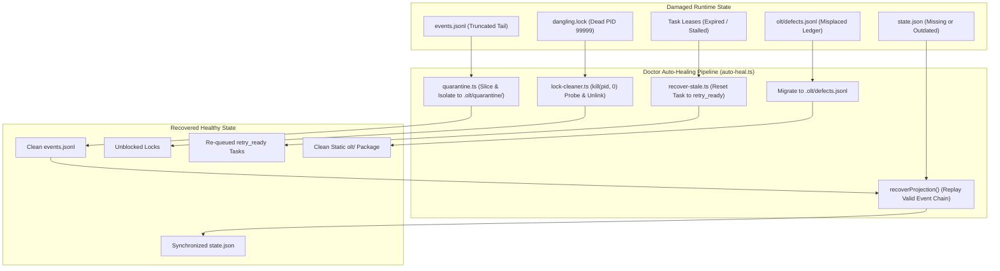

# Doctor Auto-Healing Recovery Pipeline & Capsule Integrity Plan

> **Tracking ID:** `fb-doctor-auto-healing-pipeline`  
> **Status:** `PLANNED - READY FOR EXECUTION`  
> **Parent Blueprint:** `docs/planning/unified-master-doctor-engine/PLAN.md`  
> **Target Subsystems:** `olt/scripts/src/reporting/doctor/`, `olt/scripts/src/engine/store/recovery/`, `olt/scripts/src/workflow/lease/`, `olt/scripts/src/workflow/lifecycle/`  
> **Author:** Tier 0 Strategic Mind Supervisor & Master Diagnostic Architect  
> **Specification Version:** `2.0.0-PROD`

---

[Overview](#1-executive-summary--core-motivation) | [Architecture](#2-architectural-specifications--mathematical-models) | [TypeScript Contracts](#3-typescript-schemas--concrete-contracts) | [Execution Tasks](#4-modular-work-breakdown--execution-waves) | [Traceability Matrix](#5-defect--backlog-traceability-matrix) | [Acceptance Invariants](#6-strict-compliance-invariants--acceptance-checklist)

---

## 1. Executive Summary & Core Motivation

Autonomous long-running multi-agent harnesses inevitably encounter unexpected process terminations, machine reboots, and deadlocks. Historically, these failures left runtime artifacts in inconsistent, wedged states:

1. **Torn Event Tails (`hb-s2-diffvalue-array-invariant`):** Abrupt SIGKILL or container evictions during active writes produced partial, unparseable JSON lines at the end of `events.jsonl`, causing subsequent runs to crash immediately on startup.
2. **Desynchronized State Projections:** Process termination before writing `state.json` left the materialized state out of sync with the underlying transaction log.
3. **Dangling Lock Files:** Dead processes left behind `.lock` files in `.locks/`, causing eternal lock acquisition timeouts.
4. **Stale Task Leases:** Stranded tasks held by dead workers blocked downstream execution waves indefinitely.
5. **Vestigial Ledgers in Static Package Root (`defect-vestigial-runtime-ledgers-in-static-package-root`):** Misplaced runtime files inside `olt/` polluted distributed package code.

This plan delivers:

- A non-interactive default auto-healing engine (`bun harness.ts doctor --fix`) executing pre-flight recovery before diagnostics.
- An automated torn-tail quarantine pipeline isolating truncated JSON fragments to `.olt/quarantine/` and restoring `events.jsonl` integrity.
- Full event-chain projection reconstruction re-deriving `state.json` from genesis.
- A dead-PID inspecting lock cleanser (`isProcessAlive(pid)`) safely breaking abandoned flock files.
- Automated stale lease reclaimer restoring expired tasks to `retry_ready`.
- Automated pre/post-flight harness lifecycle hooks executing auto-repair.

---

## 2. Architectural Specifications & Mathematical Models



### 2.1 Auto-Healing Execution Protocol

1. **Torn Event Tail Quarantine Protocol:**
   - Evaluates `events.jsonl` from byte offset 0. Scans backwards from end of file to find the last valid newline.
   - If trailing bytes fail `JSON.parse()`, slices the damaged trailing fragment.
   - Computes $\text{hash} = \text{SHA256}(\text{tornBytes})[0 \dots 11]$.
   - Writes to `.olt/quarantine/<timestamp>-torn-tail-<hash>.json`.
   - Truncates `events.jsonl` to the exact byte offset of the last complete record using `truncateSync()`.

2. **State Projection Reconstruction:**
   - When projection desynchronization is detected, reads all valid events from `events.jsonl`.
   - Replays event reducers sequentially to compute the canonical state.
   - Writes new `state.json` via atomic temporary file swap.

3. **Dangling Flock Lock Cleansing:**
   - For every `.lock` file, reads payload `{"pid": number, "created_at": string}`.
   - Executes `process.kill(pid, 0)`. If error code is `ESRCH` (No such process), unlinks the lock file.
   - If timestamp exceeds 300 seconds and process is unverified, clears lock safely.

4. **Stale Task Lease Recovery:**
   - Evaluates active tasks where `status === "LEASED"` or `"RUNNING"`.
   - If `lease.expires_at < Date.now()` and worker heartbeat is stale, resets task status to `retry_ready`.

---

## 3. TypeScript Schemas & Concrete Contracts

All interfaces enforce **0 `any`** and **0 compiler suppressions**.

```typescript
export interface DoctorAutoHealResult {
  readonly autoHealed: readonly string[];
  readonly recoveredLeases: readonly string[];
  readonly projectionRecovered: boolean;
  readonly quarantinedFragments: readonly string[];
  readonly danglingLocksCleared: readonly string[];
  readonly migratedLedgers: readonly string[];
  readonly gitIndexHealed: boolean;
  readonly gitArtifactsStaged: readonly string[];
}

export interface AutoHealOptions {
  readonly actor?: string | undefined;
  readonly graceSeconds?: number | undefined;
  readonly repoRoot?: string | undefined;
  readonly nonInteractive?: boolean | undefined;
}

export interface QuarantineRecord {
  readonly quarantineId: string;
  readonly originalFilePath: string;
  readonly tornByteLength: number;
  readonly sha256: string;
  readonly quarantinedAt: string;
}
```

---

## 4. Modular Work Breakdown & Execution Waves

Tasks target $\le 3$ files each, comply with 5-minute SLAs ($P = \lceil W / S \rceil$), and enforce anti-stub failure criteria.

```text
Wave 1 (Quarantine & Projection Recovery) ──► [Task 1.1: Torn Tail Quarantine] + [Task 1.2: Projection Recovery Engine]
                                                    │
                                                    ▼
Wave 2 (Lock Cleanser & Lease Recovery)   ──► [Task 2.1: Dangling Lock Cleanser] + [Task 2.2: Stale Lease Reclaimer]
                                                    │
                                                    ▼
Wave 3 (Master Auto-Heal & Harness Hooks) ──► [Task 3.1: Master Auto-Heal Orchestrator] + [Task 3.2: Lifecycle Hooks]
```

### Wave 1: Torn Event Tail Quarantine & Projection Reconstruction

#### Task 1.1: Torn Event Tail Quarantine Engine

- **Target Files (Max 2):**
  - `olt/scripts/src/engine/store/recovery/quarantine.ts`
  - `tests/unit/doctor/auto-heal-quarantine.test.ts`
- **Write Scope:** `olt/scripts/src/engine/store/recovery/`
- **Read-Only Scope:** `olt/scripts/src/engine/store/`
- **SLA:** 4 minutes ($W=2, S=1, P=2$)
- **Symbols Exported:** `quarantineTornTail()`, `detectTornTailOffset()`, `truncateToLastValidRecord()`
- **Anti-Stub Failure Criteria:**
  - Stubs that ignore trailing invalid bytes or fail to write quarantined files to `.olt/quarantine/` must fail.
  - Corrupted log with 12 bytes of trailing garbage must be cleanly truncated and quarantined.
- **Verification Gate:** `bun test tests/unit/doctor/auto-heal-quarantine.test.ts`

#### Task 1.2: Projection Reconstruction Engine

- **Target Files (Max 1):**
  - `olt/scripts/src/reporting/doctor/auto-heal.ts`
- **Write Scope:** `olt/scripts/src/reporting/doctor/auto-heal.ts`
- **Read-Only Scope:** `olt/scripts/src/engine/store/`
- **SLA:** 5 minutes ($W=1, S=1, P=1$)
- **Symbols Exported:** `recoverProjection()`, `autoHealCapsule()`, `DoctorAutoHealResult`
- **Anti-Stub Failure Criteria:**
  - Deleting `state.json` and running `recoverProjection()` must regenerate full identical state matching event stream.
- **Verification Gate:** `bun test tests/unit/doctor/auto-heal-projection.test.ts`

---

### Wave 2: Lock Cleanser & Stale Lease Reclaimer

#### Task 2.1: Dead-PID Dangling Lock Cleanser

- **Target Files (Max 2):**
  - `olt/scripts/src/reporting/doctor/lock-cleaner.ts`
  - `tests/unit/doctor/lock-cleaner.test.ts`
- **Write Scope:** `olt/scripts/src/reporting/doctor/`
- **Read-Only Scope:** `olt/scripts/src/logging/lock.ts`
- **SLA:** 4 minutes ($W=2, S=1, P=2$)
- **Symbols Exported:** `cleanseDanglingLocks()`, `isProcessAlive(pid: number): boolean`
- **Anti-Stub Failure Criteria:**
  - Lock files with live PID (e.g. `process.pid`) must NOT be unlinked.
  - Lock files with simulated dead PID (`9999999`) must be unlinked and recorded.
- **Verification Gate:** `bun test tests/unit/doctor/lock-cleaner.test.ts`

#### Task 2.2: Stale Task Lease Auto-Recovery

- **Target Files (Max 2):**
  - `olt/scripts/src/workflow/lease/recover-stale.ts`
  - `tests/unit/workflow/lease-recover-stale.test.ts`
- **Write Scope:** `olt/scripts/src/workflow/lease/`
- **Read-Only Scope:** `olt/scripts/src/engine/store/`
- **SLA:** 4 minutes ($W=2, S=1, P=2$)
- **Symbols Exported:** `recoverStaleLeases()`, `reclaimExpiredTask()`
- **Anti-Stub Failure Criteria:**
  - Active leases with remaining time must not be modified.
  - Leases expired by $\ge 1\text{s}$ must transition to `retry_ready` and clear lease owner.
- **Verification Gate:** `bun test tests/unit/workflow/lease-recover-stale.test.ts`

---

### Wave 3: Master Auto-Heal Integration & Harness Lifecycle Hooks

#### Task 3.1: Master Auto-Heal Pipeline Coordinator

- **Target Files (Max 1):**
  - `olt/scripts/src/reporting/doctor/auto-heal.ts`
- **Write Scope:** `olt/scripts/src/reporting/doctor/auto-heal.ts`
- **Read-Only Scope:** `olt/scripts/src/reporting/doctor/`
- **SLA:** 5 minutes ($W=1, S=1, P=1$)
- **Symbols Exported:** `runAutoHealingPipeline()`, `migrateVestigialLedgers()`
- **Anti-Stub Failure Criteria:**
  - Vestigial `olt/defects.jsonl` must be migrated into `.olt/defects.jsonl` and removed from `olt/`.
- **Verification Gate:** `bun test tests/unit/doctor/auto-heal-pipeline.test.ts`

#### Task 3.2: Pre/Post Flight Auto-Repair Harness Hooks

- **Target Files (Max 2):**
  - `olt/scripts/src/workflow/lifecycle/harness-hooks.ts`
  - `tests/unit/workflow/harness-hooks.test.ts`
- **Write Scope:** `olt/scripts/src/workflow/lifecycle/`
- **Read-Only Scope:** `olt/scripts/src/reporting/doctor/`
- **SLA:** 4 minutes ($W=2, S=1, P=2$)
- **Symbols Exported:** `executePreFlightDoctorAudit()`, `executePostFlightDoctorAudit()`
- **Anti-Stub Failure Criteria:**
  - Pre-flight hook auto-heals torn projections and dead locks before task claim.
  - Post-flight hook validates clean hygiene and stages artifacts via `git add -A`.
- **Verification Gate:** `bun test tests/unit/workflow/harness-hooks.test.ts`

---

## 5. Defect & Backlog Traceability Matrix

| Defect / Backlog ID                                           | Description                                            | Component Resolution                              | Concrete Symbols                                      | Discriminating Verification Gate                          |
| :------------------------------------------------------------ | :----------------------------------------------------- | :------------------------------------------------ | :---------------------------------------------------- | :-------------------------------------------------------- |
| `defect-vestigial-runtime-ledgers-in-static-package-root`     | Ledgers placed in static `olt/` package root.          | Automated ledger migration to `.olt/`.            | `migrateVestigialLedgers`                             | `bun test tests/unit/doctor/auto-heal-pipeline.test.ts`   |
| `hb-s2-diffvalue-array-invariant`                             | Torn JSON tails in `events.jsonl` after sudden aborts. | Byte-level tail scanner and quarantine isolator.  | `quarantineTornTail`, `truncateToLastValidRecord`     | `bun test tests/unit/doctor/auto-heal-quarantine.test.ts` |
| `defect-missing-automatic-host-subagent-registration-on-init` | Stale locks and unrecovered leases on harness startup. | Pre-flight auto-heal hook running dead-PID check. | `executePreFlightDoctorAudit`, `cleanseDanglingLocks` | `bun test tests/unit/workflow/harness-hooks.test.ts`      |

---

## 6. Strict Compliance Invariants & Acceptance Checklist

1. **0 TypeScript `any` & 0 Compiler Suppressions:** AST purity scanner verifies zero `@ts-ignore`, `@ts-expect-error`, or `any` types.
2. **Strict File & Directory Limits:** Every source file $\le 300$ physical lines; every directory $\le 10$ files.
3. **Data Loss Immunity:** Corrupt fragments are never deleted silently; they are always preserved in `.olt/quarantine/`.
4. **PID Liveness Verification:** Locks are unlinked only after confirming the holding process is dead (`ESRCH`).
5. **Immediate Git Staging (`git add -A`):** Upon completing any task or milestone, stage all files immediately to persist loose Git objects to disk for reflog safety.
