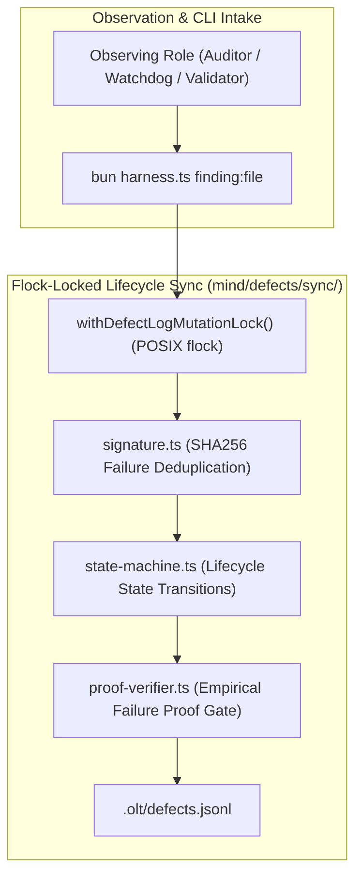

# Doctor Flock-Locked Defect Lifecycle Sync & CLI Findings Plan

> **Tracking ID:** `fb-doctor-defect-lifecycle-sync`  
> **Status:** `PLANNED - READY FOR EXECUTION`  
> **Parent Blueprint:** `docs/planning/unified-master-doctor-engine/PLAN.md`  
> **Target Subsystems:** `olt/scripts/src/mind/defects/sync/`, `olt/scripts/src/cli/commands/`, `olt/scripts/src/cli/registry/`  
> **Author:** Tier 0 Strategic Mind Supervisor & Master Defect Lifecycle Architect  
> **Specification Version:** `2.0.0-PROD`

---

[Overview](#1-executive-summary--core-motivation) | [Architecture](#2-architectural-specifications--mathematical-models) | [TypeScript Contracts](#3-typescript-schemas--concrete-contracts) | [Execution Tasks](#4-modular-work-breakdown--execution-waves) | [Traceability Matrix](#5-defect--backlog-traceability-matrix) | [Acceptance Invariants](#6-strict-compliance-invariants--acceptance-checklist)

---

## 1. Executive Summary & Core Motivation

Tracking defects across multi-agent workflows requires absolute synchronization, concurrency protection, and rigorous proof gates. Historically, defect tracking suffered from critical flaws:

1. **Flock-Free Write Contention & Lost Rows:** Concurrent agents writing to `.olt/defects.jsonl` without process-level locking produced race conditions, torn lines, and duplicate entries.
2. **Silent Defect Regressions & Status Churn:** When a previously `completed` defect recurred, agents either flipped it silently or churned on transient blips without intermediate verification.
3. **Missing Empirical Failure Proofs:** Defects were reopened without documenting reproducible evidence (`commit_sha`, failing `test_assertion`, owning `task_id`).
4. **Role Isolation in Finding Reporting (`hb-main-thread-chatter-burns-owner-context`):** Observing companion roles lacked a standardized, non-privileged CLI command to record diagnostic findings without violating RBAC boundaries.

This plan delivers:

- A flock-locked Defect Lifecycle Sync Engine (`lifecycle-sync.ts`) using advisory locks and atomic file swaps.
- Deterministic normalized SHA-256 failure signature deduplication (`signature.ts`).
- A robust defect state machine with an intermediate `deliberating` stage and empirical failure proof verification (`proof-verifier.ts`).
- A universal, non-privileged `finding:file` CLI subcommand (`finding-ops.ts`) usable by all observing roles.

---

## 2. Architectural Specifications & Mathematical Models



### 2.1 Normalized SHA-256 Failure Signature

To ensure idempotent deduplication across test runs:
$$\text{signature} = \text{SHA256}(\text{category} \parallel \text{code} \parallel \text{normalizePath}(\text{file}) \parallel \text{normalizeMessage}(\text{message}))$$

### 2.2 Defect State Machine & Empirical Proof Protocol

```text
       ┌──────────────┐
       │     OPEN     │◄─────────────────────────────────────────┐
       └──────┬───────┘                                          │
              │                                                  │
              │ [Admit & Assign to Task]                         │
              ▼                                                  │
       ┌──────────────┐                                          │
       │IN_REMEDIATION│                                          │
       └──────┬───────┘                                          │
              │                                                  │
              │ [Pass All Validation Gates]                      │
              ▼                                                  │
       ┌──────────────┐                                          │
       │  COMPLETED   │                                          │
       └──────┬───────┘                                          │
              │                                                  │
              │ [Recurrence Observed]                            │
              ▼                                                  │
       ┌──────────────┐                                          │
       │ DELIBERATING │ (Intermediate Verification Stage)        │
       └──────┬───────┘                                          │
              │                                                  │
              │ [Empirical Failure Proof Validated:              │
              │  commit_sha + test_assertion + task_id]          │
              └──────────────────────────────────────────────────┘
```

1. **Intermediate `deliberating` State:**
   Recurrences on `completed` defects enter `deliberating` to buffer transient test runner flakiness.
2. **Empirical Failure Proof Validation:**
   Transition from `deliberating` back to `open` requires:
   - `commit_sha`: Non-empty git commit SHA.
   - `test_assertion`: Exact failing test command or compiler diagnostic.
   - `task_id`: Identifier of the running task.

---

## 3. TypeScript Schemas & Concrete Contracts

All interfaces enforce **0 `any`** and **0 compiler suppressions**.

```typescript
export interface EmpiricalFailureProof {
  readonly commit_sha: string;
  readonly test_assertion: string;
  readonly task_id: string;
  readonly run_id?: string | undefined;
  readonly error_code?: string | undefined;
  readonly message?: string | undefined;
  readonly timestamp: string;
}

export type DefectLifecycleStatus =
  "open" | "deliberating" | "in_remediation" | "resolved" | "completed" | "closed";

export interface DefectRecord {
  readonly id: string;
  readonly type: string;
  readonly category: string;
  readonly severity: "critical" | "high" | "warning" | "low";
  readonly status: DefectLifecycleStatus;
  readonly observation: string;
  readonly remediation: string;
  readonly timestamp: string;
  readonly first_seen_at: string;
  readonly last_seen_at: string;
  readonly count: number;
  readonly dedup_key: string;
  readonly context?: Record<string, unknown> | undefined;
  readonly failure_proof?: EmpiricalFailureProof | undefined;
  readonly reopened_at?: string | undefined;
}
```

---

## 4. Modular Work Breakdown & Execution Waves

Tasks target $\le 3$ files each, comply with 5-minute SLAs ($P = \lceil W / S \rceil$), and enforce anti-stub failure criteria.

```text
Wave 1 (Flock Store & Deduplication)   ──► [Task 1.1: Flock Defect Sync Engine] + [Task 1.2: SHA-256 Deduplication]
                                                │
                                                ▼
Wave 2 (State Machine & Proof Gate)    ──► [Task 2.1: State Machine Transitions] + [Task 2.2: Proof Verifier Gate]
                                                │
                                                ▼
Wave 3 (CLI Finding Operations & E2E)  ──► [Task 3.1: Universal CLI finding:file] + [Task 3.2: Defect Lifecycle E2E Suite]
```

### Wave 1: Flock-Locked Defect Store & SHA-256 Deduplication

#### Task 1.1: Flock-Locked Defect Mutation Engine

- **Target Files (Max 2):**
  - `olt/scripts/src/mind/defects/sync/lifecycle-sync.ts`
  - `tests/unit/mind/defect-lifecycle-sync.test.ts`
- **Write Scope:** `olt/scripts/src/mind/defects/sync/`
- **Read-Only Scope:** `olt/scripts/src/logging/lock.ts`
- **SLA:** 4 minutes ($W=2, S=1, P=2$)
- **Symbols Exported:** `syncDoctorFindingsToDefects()`, `withDefectLogMutationLock()`, `loadDefectRecords()`
- **Anti-Stub Failure Criteria:**
  - 50 concurrent writes from multiple processes must result in 0 corrupted lines and 0 lost records.
- **Verification Gate:** `bun test tests/unit/mind/defect-lifecycle-sync.test.ts`

#### Task 1.2: Normalized SHA-256 Signature Deduplication

- **Target Files (Max 2):**
  - `olt/scripts/src/mind/defects/sync/signature.ts`
  - `tests/unit/mind/defect-signature.test.ts`
- **Write Scope:** `olt/scripts/src/mind/defects/sync/`
- **Read-Only Scope:** `olt/scripts/src/mind/defects/types.ts`
- **SLA:** 4 minutes ($W=2, S=1, P=2$)
- **Symbols Exported:** `computeNormalizedFailureSignature()`, `normalizeFindingToDefect()`
- **Anti-Stub Failure Criteria:**
  - Identical errors with different whitespace or relative vs absolute paths must compute identical SHA-256 keys.
- **Verification Gate:** `bun test tests/unit/mind/defect-signature.test.ts`

---

### Wave 2: State Machine & Empirical Proof Verification

#### Task 2.1: Defect Lifecycle State Machine

- **Target Files (Max 2):**
  - `olt/scripts/src/mind/defects/sync/state-machine.ts`
  - `tests/unit/mind/defect-state-machine.test.ts`
- **Write Scope:** `olt/scripts/src/mind/defects/sync/`
- **Read-Only Scope:** `olt/scripts/src/mind/defects/types.ts`
- **SLA:** 4 minutes ($W=2, S=1, P=2$)
- **Symbols Exported:** `validateStateTransition()`, `transitionDefectStatus()`
- **Anti-Stub Failure Criteria:**
  - Illegal transitions (e.g. `closed` -> `in_remediation` without reopening) must throw `INVALID_STATE_TRANSITION`.
- **Verification Gate:** `bun test tests/unit/mind/defect-state-machine.test.ts`

#### Task 2.2: Empirical Failure Proof Gate

- **Target Files (Max 2):**
  - `olt/scripts/src/mind/defects/sync/proof-verifier.ts`
  - `tests/unit/mind/defect-proof-verification.test.ts`
- **Write Scope:** `olt/scripts/src/mind/defects/sync/`
- **Read-Only Scope:** `olt/scripts/src/mind/defects/sync/state-machine.ts`
- **SLA:** 4 minutes ($W=2, S=1, P=2$)
- **Symbols Exported:** `verifyFailureProof()`, `reopenDefectWithProof()`
- **Anti-Stub Failure Criteria:**
  - Reopening a `completed` defect without a non-empty `commit_sha`, failing assertion, and `task_id` must fail.
- **Verification Gate:** `bun test tests/unit/mind/defect-proof-verification.test.ts`

---

### Wave 3: Universal CLI Finding Operations & E2E Validation

#### Task 3.1: Universal `finding:file` CLI Subcommand

- **Target Files (Max 2):**
  - `olt/scripts/src/cli/commands/finding-ops.ts`
  - `olt/scripts/src/cli/registry/diagnostics.ts`
- **Write Scope:** `olt/scripts/src/cli/`
- **Read-Only Scope:** `olt/scripts/src/mind/defects/sync/`
- **SLA:** 4 minutes ($W=2, S=1, P=2$)
- **Symbols Exported:** `executeFindingFileCommand()`, `registerFindingCommands()`
- **Anti-Stub Failure Criteria:**
  - Running `bun harness.ts finding:file` writes valid entry to `.olt/defects.jsonl` under flock.
  - Usable by observing companion roles without privilege errors.
- **Verification Gate:** `bun test tests/unit/cli/finding-ops.test.ts`

#### Task 3.2: Defect Lifecycle Concurrency & Regression E2E Suite

- **Target Files (Max 1):**
  - `tests/e2e/mind/defect-lifecycle-sync.test.ts`
- **Write Scope:** `tests/e2e/mind/defect-lifecycle-sync.test.ts`
- **Read-Only Scope:** Full harness
- **SLA:** 5 minutes ($W=1, S=1, P=1$)
- **Symbols Exported:** Complete E2E integration test suite
- **Anti-Stub Failure Criteria:**
  - Simulates multi-process defect logging, deduplication, state transitions, regression proofs, and CLI dispatches.
- **Verification Gate:** `bun test tests/e2e/mind/defect-lifecycle-sync.test.ts`

---

## 5. Defect & Backlog Traceability Matrix

| Defect / Backlog ID                                         | Description                                      | Component Resolution                               | Concrete Symbols            | Discriminating Verification Gate                             |
| :---------------------------------------------------------- | :----------------------------------------------- | :------------------------------------------------- | :-------------------------- | :----------------------------------------------------------- |
| `hb-main-thread-chatter-burns-owner-context`                | Unstructured defect chatter in stdout.           | Structured `finding:file` CLI recording to ledger. | `executeFindingFileCommand` | `bun test tests/unit/cli/finding-ops.test.ts`                |
| `hb-authority-unregistered-actor-bypasses-role-enforcement` | Unregistered roles bypass enforcement.           | Fail-closed role registration in CLI commands.     | `registerFindingCommands`   | `bun test tests/unit/cli/finding-ops.test.ts`                |
| `fb-defect-empirical-failure-proofs`                        | Completed defects reopened without verification. | Empirical proof gate requiring commit + assertion. | `verifyFailureProof`        | `bun test tests/unit/mind/defect-proof-verification.test.ts` |

---

## 6. Strict Compliance Invariants & Acceptance Checklist

1. **0 TypeScript `any` & 0 Compiler Suppressions:** AST purity scanner verifies zero `@ts-ignore`, `@ts-expect-error`, or `any` types.
2. **Strict File & Directory Limits:** Every source file $\le 300$ physical lines; every directory $\le 10$ files.
3. **Flock-Protected Concurrency:** All mutations to `.olt/defects.jsonl` acquire exclusive POSIX file locks.
4. **Empirical Proof Mandate:** Reopening defects strictly requires non-empty `commit_sha`, failing assertion, and `task_id`.
5. **Immediate Git Staging (`git add -A`):** Upon completing any task or milestone, stage all files immediately to persist loose Git objects to disk for reflog safety.
