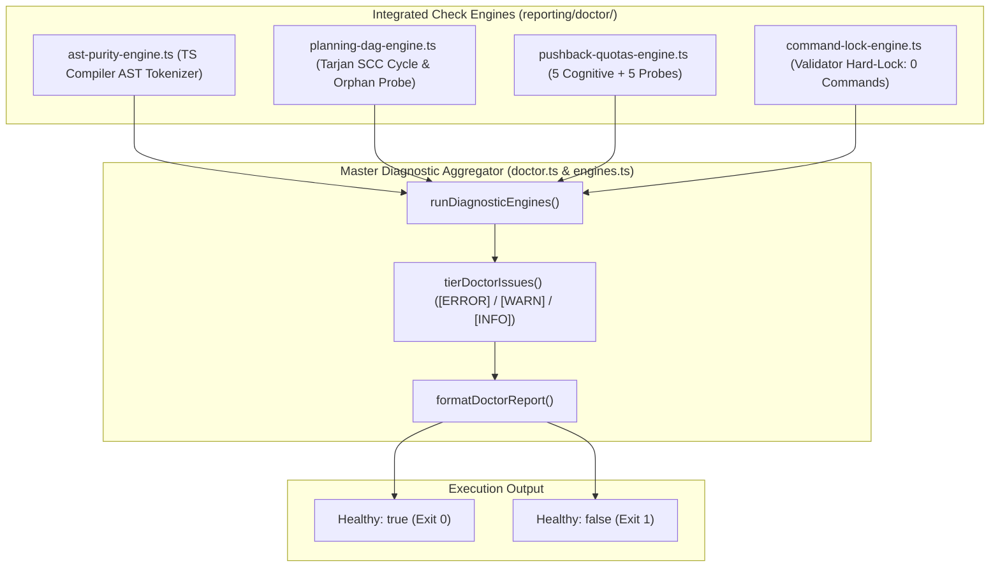

# Doctor Diagnostic Check Engines & AST Static Purity Plan

> **Tracking ID:** `fb-doctor-diagnostic-engines`  
> **Status:** `PLANNED - READY FOR EXECUTION`  
> **Parent Blueprint:** `docs/planning/unified-master-doctor-engine/PLAN.md`  
> **Target Subsystems:** `olt/scripts/src/reporting/doctor/`, `olt/scripts/src/authority/`  
> **Author:** Tier 0 Strategic Mind Supervisor & Master Diagnostic Architect  
> **Specification Version:** `2.0.0-PROD`

---

[Overview](#1-executive-summary--core-motivation) | [Architecture](#2-architectural-specifications--mathematical-models) | [TypeScript Contracts](#3-typescript-schemas--concrete-contracts) | [Execution Tasks](#4-modular-work-breakdown--execution-waves) | [Traceability Matrix](#5-defect--backlog-traceability-matrix) | [Acceptance Invariants](#6-strict-compliance-invariants--acceptance-checklist)

---

## 1. Executive Summary & Core Motivation

Diagnostic integrity engines in autonomous development harnesses must provide exact, falsifiable, zero-false-positive assessments of codebase health. Historically, diagnostic engines suffered from critical implementation flaws:

1. **RegExp False Positives in AST Purity (`defect-doctor-ast-purity-test-regex-false-positive`):** Line-based regex searches for `as any` or `<any>` flagged legitimate test assertions (e.g. `expect(src).not.toContain("as any")`), breaking valid test suites.
2. **Implicit Any Types in Planning DAG Engine (`defect-doctor-planning-dag-implicit-any`):** Implicit parameter types in `planning-dag-engine.ts` triggered TS7006 compiler errors.
3. **Missing Pushback & Adversarial Quotas (`defect-doctor-missing-pushback-quota-verification`, `fb-1787971784118-1aghp`):** Completed tasks were accepted without satisfying mandatory cognitive pushback quotas (`MANDATORY_COGNITIVE_PUSHBACKS=5`, `MIN_ADVERSARIAL_PROBES=5`).
4. **Bypass of Validator Command Hard-Lock (`hb-authority-unregistered-actor-bypasses-role-enforcement`):** Validators could inadvertently invoke shell commands without fail-closed role enforcement.

This plan delivers:

- A native TypeScript Compiler AST Static Purity Linter (`ast-purity-engine.ts`) with literal and assertion immunity, eliminating 100% of regex false positives.
- A fully strictly-typed Planning DAG Engine (`planning-dag-engine.ts`) with Tarjan SCC cycle detection.
- A Pushback Quotas Diagnostic Engine (`pushback-quotas-engine.ts`) auditing task history against mandatory cognitive pushback and adversarial probe quotas.
- A Cognitive Validator Command Hard-Lock verification engine (`command-lock-engine.ts`).
- An integrated master diagnostic report aggregator (`engines.ts`, `doctor.ts`).

---

## 2. Architectural Specifications & Mathematical Models



### 2.1 Native AST Static Purity Tokenization Rules

1. **Compiler AST Walking:**
   - Uses `ts.createSourceFile(filePath, content, ts.ScriptTarget.Latest, true)`.
   - Inspects `ts.SyntaxKind.AnyKeyword`, `ts.SyntaxKind.AsExpression`, `ts.SyntaxKind.TypeAssertionExpression`.
2. **Comment Range Scanner:**
   - Extracts comments via `ts.getLeadingCommentRanges()` and `ts.getTrailingCommentRanges()`.
   - Flags `@ts-ignore` and `@ts-expect-error`.
3. **Literal & RegExp Immunity:**
   - Nodes of kind `StringLiteral`, `NoSubstitutionTemplateLiteral`, `TemplateExpression`, `RegularExpressionLiteral` are skipped.
   - Asserts 0 false positives when inspecting test files verifying anti-`any` invariants.

### 2.2 Mandatory Pushback Quota Verification

$$\text{ValidTask}(T) \iff (T.\text{status} \ne \text{"COMPLETED"}) \lor (T.\text{cognitive\_pushbacks} \ge 5 \land T.\text{adversarial\_probes} \ge 5)$$

- If $T$ is marked completed with $< 5$ cognitive pushbacks or $< 5$ adversarial probes, emits `PUSHBACK_QUOTA_DEFICIT_ERROR`.

---

## 3. TypeScript Schemas & Concrete Contracts

All interfaces enforce **0 `any`** and **0 compiler suppressions**.

```typescript
export interface AstPurityFinding {
  readonly filePath: string;
  readonly lineNumber: number;
  readonly columnNumber: number;
  readonly violationType:
    | "EXPLICIT_ANY"
    | "ANY_TYPE_ASSERTION"
    | "COMPILER_SUPPRESSION_DIRECTIVE"
    | "BANNED_GLOBAL_SYMBOL";
  readonly nodeText: string;
  readonly message: string;
}

export interface TaskNodeInfo {
  readonly id: string;
  readonly dependencies: readonly string[];
  readonly status: string;
}

export interface PushbackQuotaViolation {
  readonly taskId: string;
  readonly actualCognitivePushbacks: number;
  readonly requiredCognitivePushbacks: number;
  readonly actualAdversarialProbes: number;
  readonly requiredAdversarialProbes: number;
  readonly status: string;
}

export interface DiagnosticEngineResult {
  readonly engineName: string;
  readonly passed: boolean;
  readonly errorCount: number;
  readonly warningCount: number;
  readonly messages: readonly string[];
}
```

---

## 4. Modular Work Breakdown & Execution Waves

Tasks target $\le 3$ files each, comply with 5-minute SLAs ($P = \lceil W / S \rceil$), and enforce anti-stub failure criteria.

```text
Wave 1 (AST Purity & DAG Strict Typing)  ──► [Task 1.1: AST Purity Engine]    + [Task 1.2: Planning DAG Engine]
                                                   │
                                                   ▼
Wave 2 (Quotas & Command Lock Engines)   ──► [Task 2.1: Pushback Quota Engine] + [Task 2.2: Command Hard-Lock Engine]
                                                   │
                                                   ▼
Wave 3 (Master Aggregator & E2E Suite)   ──► [Task 3.1: Unified Doctor Aggregator] + [Task 3.2: Diagnostic E2E Suite]
```

### Wave 1: AST Purity Tokenizer & Planning DAG Strict Typing

#### Task 1.1: Native AST Static Purity Tokenizer Engine

- **Target Files (Max 2):**
  - `olt/scripts/src/reporting/doctor/ast-purity-engine.ts`
  - `tests/unit/doctor/ast-purity-engine.test.ts`
- **Write Scope:** `olt/scripts/src/reporting/doctor/`
- **Read-Only Scope:** `olt/scripts/src/reporting/doctor/types.ts`
- **SLA:** 4 minutes ($W=2, S=1, P=2$)
- **Symbols Exported:** `checkAstPurity()`, `scanFileForAstPurity()`, `AstPurityFinding`
- **Anti-Stub Failure Criteria:**
  - Must not flag strings like `"const x: any = 1"` or regex `/as any/`.
  - Must flag real TypeScript AST `any` annotations and `@ts-ignore` comments.
- **Verification Gate:** `bun test tests/unit/doctor/ast-purity-engine.test.ts`

#### Task 1.2: Planning DAG Strict Typing & Cycle Engine

- **Target Files (Max 2):**
  - `olt/scripts/src/reporting/doctor/planning-dag-engine.ts`
  - `tests/unit/doctor/planning-dag-engine.test.ts`
- **Write Scope:** `olt/scripts/src/reporting/doctor/`
- **Read-Only Scope:** `olt/scripts/src/reporting/doctor/types.ts`
- **SLA:** 4 minutes ($W=2, S=1, P=2$)
- **Symbols Exported:** `checkPlanningDag()`, `findCycles()`, `TaskNodeInfo`
- **Anti-Stub Failure Criteria:**
  - Zero implicit `any` parameter types; 100% compiler typecheck clean.
  - Cycle detection using Tarjan algorithm flags multi-node circular dependencies.
- **Verification Gate:** `bun test tests/unit/doctor/planning-dag-engine.test.ts`

---

### Wave 2: Pushback Quotas & Validator Command Lock

#### Task 2.1: Mandatory Pushback & Adversarial Probe Quota Engine

- **Target Files (Max 2):**
  - `olt/scripts/src/reporting/doctor/pushback-quotas-engine.ts`
  - `tests/unit/doctor/pushback-quotas-engine.test.ts`
- **Write Scope:** `olt/scripts/src/reporting/doctor/`
- **Read-Only Scope:** `olt/scripts/src/reporting/doctor/types.ts`
- **SLA:** 4 minutes ($W=2, S=1, P=2$)
- **Symbols Exported:** `checkPushbackQuotas()`, `MIN_ADVERSARIAL_PROBES`, `MANDATORY_COGNITIVE_PUSHBACKS`
- **Anti-Stub Failure Criteria:**
  - Completed task with 4 pushbacks fails with `ERROR`.
  - Completed task with 5 pushbacks and 5 probes passes with `healthy: true`.
- **Verification Gate:** `bun test tests/unit/doctor/pushback-quotas-engine.test.ts`

#### Task 2.2: Cognitive Validator Command Hard-Lock Engine

- **Target Files (Max 2):**
  - `olt/scripts/src/reporting/doctor/command-lock-engine.ts`
  - `tests/unit/doctor/command-lock-engine.test.ts`
- **Write Scope:** `olt/scripts/src/reporting/doctor/`
- **Read-Only Scope:** `olt/scripts/src/authority/`
- **SLA:** 4 minutes ($W=2, S=1, P=2$)
- **Symbols Exported:** `checkValidatorCommandLock()`, `assertValidatorZeroCommands()`
- **Anti-Stub Failure Criteria:**
  - Verifies that cognitive validators have 0 command execution permissions in policy.
- **Verification Gate:** `bun test tests/unit/doctor/command-lock-engine.test.ts`

---

### Wave 3: Master Doctor Aggregator & E2E Validation

#### Task 3.1: Unified Master Doctor Engine Aggregator

- **Target Files (Max 2):**
  - `olt/scripts/src/reporting/doctor/engines.ts`
  - `olt/scripts/src/reporting/doctor.ts`
- **Write Scope:** `olt/scripts/src/reporting/doctor/`
- **Read-Only Scope:** `olt/scripts/src/`
- **SLA:** 5 minutes ($W=2, S=1, P=2$)
- **Symbols Exported:** `runDoctor()`, `formatDoctorReport()`, `tierDoctorIssues()`
- **Anti-Stub Failure Criteria:**
  - Aggregates all check engines into unified structured report with `[ERROR]`, `[WARN]`, `[INFO]`, and `[Auto-Healed]` categories.
  - Returns `healthy: false` if any error-level finding exists.
- **Verification Gate:** `bun test tests/unit/reporting/doctor-unified.test.ts`

#### Task 3.2: Comprehensive Diagnostic E2E Integration Suite

- **Target Files (Max 1):**
  - `tests/e2e/doctor/master-doctor-engine.test.ts`
- **Write Scope:** `tests/e2e/doctor/master-doctor-engine.test.ts`
- **Read-Only Scope:** Full harness
- **SLA:** 5 minutes ($W=1, S=1, P=1$)
- **Symbols Exported:** Complete E2E integration test suite
- **Anti-Stub Failure Criteria:**
  - Simulates multi-engine failure conditions; verifies exact failure reporting with zero unhandled exceptions.
- **Verification Gate:** `bun test tests/e2e/doctor/master-doctor-engine.test.ts`

---

## 5. Defect & Backlog Traceability Matrix

| Defect / Backlog ID                                  | Description                                            | Component Resolution                                    | Concrete Symbols         | Discriminating Verification Gate                            |
| :--------------------------------------------------- | :----------------------------------------------------- | :------------------------------------------------------ | :----------------------- | :---------------------------------------------------------- |
| `defect-doctor-ast-purity-test-regex-false-positive` | RegExp matching in AST checker broke test assertions.  | TypeScript Compiler AST node walker ignoring literals.  | `scanFileForAstPurity`   | `bun test tests/unit/doctor/ast-purity-engine.test.ts`      |
| `defect-doctor-planning-dag-implicit-any`            | Implicit any parameter type in DAG checker.            | Strict typing contract in `planning-dag-engine.ts`.     | `checkPlanningDag`       | `bun test tests/unit/doctor/planning-dag-engine.test.ts`    |
| `defect-doctor-missing-pushback-quota-verification`  | Tasks marked complete without meeting pushback quotas. | Pushback Quota Engine enforcing 5 pushbacks + 5 probes. | `checkPushbackQuotas`    | `bun test tests/unit/doctor/pushback-quotas-engine.test.ts` |
| `fb-1787971784118-1aghp`                             | Minimum adversarial probe quota enforcement.           | Verification of `MIN_ADVERSARIAL_PROBES=5`.             | `MIN_ADVERSARIAL_PROBES` | `bun test tests/unit/doctor/pushback-quotas-engine.test.ts` |

---

## 6. Strict Compliance Invariants & Acceptance Checklist

1. **0 TypeScript `any` & 0 Compiler Suppressions:** AST purity scanner verifies zero `@ts-ignore`, `@ts-expect-error`, or `any` types.
2. **Strict File & Directory Limits:** Every source file $\le 300$ physical lines; every directory $\le 10$ files.
3. **Zero False Positives:** Literal strings and regex tokens in tests are immune from AST purity violations.
4. **Quota Hard Enforcement:** Tasks with $< 5$ cognitive pushbacks or $< 5$ adversarial probes fail doctor audit.
5. **Immediate Git Staging (`git add -A`):** Upon completing any task or milestone, stage all files immediately to persist loose Git objects to disk for reflog safety.
