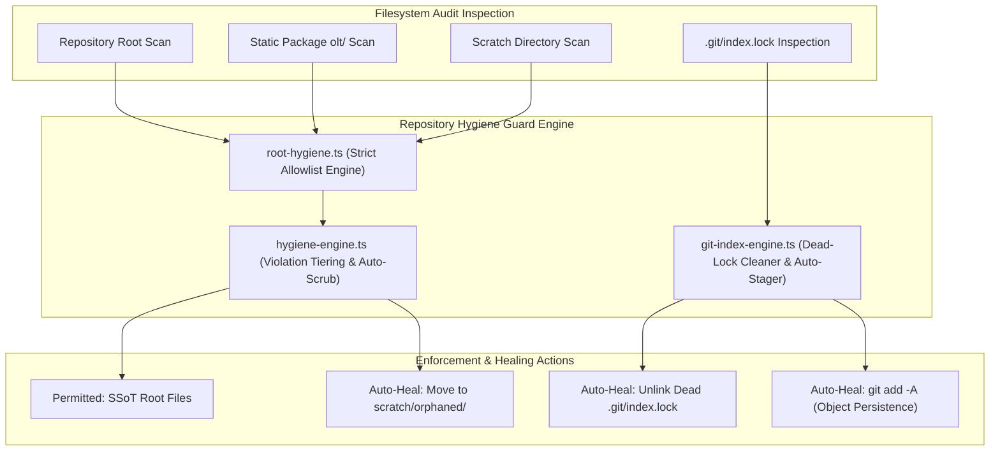

# Doctor Repository Hygiene Guard & Git Index Integrity Plan

> **Tracking ID:** `fb-doctor-repository-hygiene-guard`  
> **Status:** `PLANNED - READY FOR EXECUTION`  
> **Parent Blueprint:** `docs/planning/unified-master-doctor-engine/PLAN.md`  
> **Target Subsystems:** `olt/scripts/src/authority/guards/`, `olt/scripts/src/reporting/doctor/`  
> **Author:** Tier 0 Strategic Mind Supervisor & Master Hygiene Guard Architect  
> **Specification Version:** `2.0.0-PROD`

---

[Overview](#1-executive-summary--core-motivation) | [Architecture](#2-architectural-specifications--mathematical-models) | [TypeScript Contracts](#3-typescript-schemas--concrete-contracts) | [Execution Tasks](#4-modular-work-breakdown--execution-waves) | [Traceability Matrix](#5-defect--backlog-traceability-matrix) | [Acceptance Invariants](#6-strict-compliance-invariants--acceptance-checklist)

---

## 1. Executive Summary & Core Motivation

Autonomous agents modifying complex software repositories frequently generate transient scratch files, ad-hoc debug scripts, or misplaced runtime artifacts. In uncontrolled environments, this creates severe architectural degradation:

1. **Root Directory Clutter (`defect-widespread-root-and-package-scratch-pollution`, `defect-root-hygiene-loose-files-detected`):** Implementers deposit temporary scripts (`fix-*.ts`, `test-*.py`, `temp.json`) in the repository root instead of designated scratch paths, violating **Invariant 30 (Strict Scratch Confinement & Zero Root Clutter)**.
2. **Static Package Code Contamination:** Runtime ledger dumps (`defects.jsonl`) and test coverage directories placed inside `olt/` pollute the distributed package codebase.
3. **Dangling Git Index Locks (`fb-doctor-git-index-integrity-auto-healing`):** Interrupted Git operations leave `.git/index.lock` behind, blocking all future git commands.
4. **Crash Risk for Unstaged Workspace Files (`inv-subdomain-git-staging-reflog-safety`):** Uncommitted file modifications are vulnerable to machine reboots or container evictions unless staged immediately to generate loose Git disk objects in `.git/objects/`.

This plan delivers:

- An authoritative Repository Hygiene Guard (`root-hygiene.ts`, `hygiene-engine.ts`) enforcing strict root whitelists and zero runtime pollution.
- Automated scratch script migration moving loose files to `scratch/orphaned/`.
- Git Index Integrity & Auto-Healing Engine (`git-index-engine.ts`) clearing orphaned `.git/index.lock` files and checking stash integrity.
- Immediate sub-domain completion git staging invariant (`git add -A`) guaranteeing disk blob persistence and reflog recovery.

---

## 2. Architectural Specifications & Mathematical Models



### 2.1 Strict Allowlist Specifications (Invariant 30)

1. **Permitted Root Files (Strict Allowlist):**
   `package.json`, `tsconfig.json`, `AGENTS.md`, `README.md`, `GEMINI.md`, `lefthook.yml`, `.gitignore`, `bun.lock`, `bun.lockb`, `.editorconfig`, `.oxfmtrc.json`, `eslint.config.js`, `.prettierrc`, `LICENSE`, `bunfig.toml`, `.capture.yaml`.
   _Any other file in the repository root is an immediate hard ERROR._

2. **Permitted Root Directories:**
   `olt`, `.olt`, `tests`, `docs`, `scratch`, `.scratch`, `coverage`, `.coverage`, `node_modules`, `.git`, `.github`, `.tmp`, `.locks`, `scripts`.

3. **Static Package Purity (`olt/`):**
   The package directory `olt/` must contain 0 `.jsonl` files, 0 runtime logs, and 0 test artifacts. All runtime state is strictly confined to `.olt/`.

4. **Scratch Confinement:**
   Scratch scripts (`fix-*.ts`, `test-*.ts`, `*.py`) are strictly confined to `scratch/` or `.olt/scratch/`.

5. **Zero-Copy In-Place Execution Invariant (Ban on Runtime Skill Cloning):**
   The harness strictly forbids cloning or duplicating the skill package or its subdirectories into `.olt/` at runtime during execution or tests. Tests and subagents run directly against the checked-out repository source root with zero redundant file copies.

### 2.2 Git Index Integrity & Reflog Crash Safety

1. **Dangling Index Lock Protocol:**
   - Detects `.git/index.lock`.
   - Inspects lock file PID or inode timestamp. If holding PID is dead (`kill(pid, 0) === false`), unlinks the lock file.
2. **Sub-Domain Completion Staging Invariant (`git add -A`):**
   - The moment any sub-task or milestone completes, executes `git add -A`.
   - Git creates loose object blobs in `.git/objects/`.
   - Verifies disk persistence: even on power failure before a formal commit, all modifications remain fully recoverable via `git fsck --lost-found` and the reflog.

---

## 3. TypeScript Schemas & Concrete Contracts

All interfaces enforce **0 `any`** and **0 compiler suppressions**.

```typescript
export interface RepositoryHygieneFinding {
  readonly path: string;
  readonly violationType:
    | "UNAPPROVED_ROOT_FILE"
    | "UNAPPROVED_ROOT_DIR"
    | "STATIC_PACKAGE_RUNTIME_POLLUTION"
    | "UNCONFINED_SCRATCH_SCRIPT";
  readonly severity: "ERROR" | "WARN";
  readonly message: string;
}

export interface RepositoryHygieneResult {
  readonly passed: boolean;
  readonly violations: readonly RepositoryHygieneFinding[];
  readonly scrubbedFiles: readonly string[];
}

export interface GitIndexIntegrityReport {
  readonly indexValid: boolean;
  readonly uncommittedChanges: readonly string[];
  readonly stagedArtifacts: readonly string[];
  readonly stashedStates: readonly string[];
  readonly autoHealedLocks: readonly string[];
}
```

---

## 4. Modular Work Breakdown & Execution Waves

Tasks target $\le 3$ files each, comply with 5-minute SLAs ($P = \lceil W / S \rceil$), and enforce anti-stub failure criteria.

```text
Wave 1 (Root Hygiene Guard & Allowlist) ──► [Task 1.1: Root Hygiene Guard] + [Task 1.2: Hygiene Diagnostic Engine]
                                                  │
                                                  ▼
Wave 2 (Git Index Integrity & Stash)     ──► [Task 2.1: Git Index Engine]  + [Task 2.2: Staging Invariant Hook]
                                                  │
                                                  ▼
Wave 3 (E2E Hygiene & Crash Resilience)  ──► [Task 3.1: Hygiene & Reflog E2E Suite]
```

### Wave 1: Root Hygiene Guard & Allowlist Verification

#### Task 1.1: Authoritative Root Hygiene Guard

- **Target Files (Max 2):**
  - `olt/scripts/src/authority/guards/root-hygiene.ts`
  - `tests/unit/authority/root-hygiene.test.ts`
- **Write Scope:** `olt/scripts/src/authority/guards/`
- **Read-Only Scope:** `olt/scripts/src/authority/`
- **SLA:** 4 minutes ($W=2, S=1, P=2$)
- **Symbols Exported:** `RootDirectoryHygieneGuard`, `assertAllowedWritePath()`, `isWhitelistedRootPath()`
- **Anti-Stub Failure Criteria:**
  - Writing `fix-bug.ts` or `temp.json` to repo root must throw `ROOT_HYGIENE_VIOLATION`.
  - Writing inside `scratch/` or `.olt/scratch/` must pass without error.
- **Verification Gate:** `bun test tests/unit/authority/root-hygiene.test.ts`

#### Task 1.2: Hygiene Diagnostic & Auto-Scrubbing Engine

- **Target Files (Max 1):**
  - `olt/scripts/src/reporting/doctor/hygiene-engine.ts`
- **Write Scope:** `olt/scripts/src/reporting/doctor/hygiene-engine.ts`
- **Read-Only Scope:** `olt/scripts/src/authority/guards/root-hygiene.ts`
- **SLA:** 4 minutes ($W=1, S=1, P=1$)
- **Symbols Exported:** `checkRepositoryHygiene()`, `purgeOrphanedScratch()`
- **Anti-Stub Failure Criteria:**
  - Running `checkRepositoryHygiene()` on a dirty workspace with loose root files returns `passed: false`.
  - With auto-scrub enabled, loose scratch scripts are relocated to `scratch/orphaned/`.
- **Verification Gate:** `bun test tests/unit/doctor/hygiene-engine.test.ts`

---

### Wave 2: Git Index Integrity & Staging Invariant

#### Task 2.1: Git Index Lock Cleaner & Stash Recovery Engine

- **Target Files (Max 2):**
  - `olt/scripts/src/reporting/doctor/git-index-engine.ts`
  - `tests/unit/doctor/git-index-engine.test.ts`
- **Write Scope:** `olt/scripts/src/reporting/doctor/`
- **Read-Only Scope:** `olt/scripts/src/reporting/doctor/types.ts`
- **SLA:** 5 minutes ($W=2, S=1, P=2$)
- **Symbols Exported:** `checkGitIndexIntegrity()`, `autoHealGitState()`, `GitIndexIntegrityReport`
- **Anti-Stub Failure Criteria:**
  - Creates simulated dead `.git/index.lock`, verifies Doctor unlinks lock and recovers index.
  - Stubs failing to detect unstaged files left by completed tasks must fail.
- **Verification Gate:** `bun test tests/unit/doctor/git-index-engine.test.ts`

#### Task 2.2: Reflog Safety Staging Invariant Hook

- **Target Files (Max 1):**
  - `olt/scripts/src/authority/guards/git-staging-guard.ts`
- **Write Scope:** `olt/scripts/src/authority/guards/git-staging-guard.ts`
- **Read-Only Scope:** `olt/scripts/src/authority/`
- **SLA:** 3 minutes ($W=1, S=1, P=1$)
- **Symbols Exported:** `assertGitStagingComplete()`, `verifyGitObjectPersistence()`
- **Anti-Stub Failure Criteria:**
  - Verifies that Git object hashes exist in `.git/objects/` for all modified workspace files.
- **Verification Gate:** `bun test tests/unit/authority/git-staging-guard.test.ts`

---

### Wave 3: End-to-End Hygiene & Crash Resilience Validation

#### Task 3.1: Repository Hygiene & Git Integrity E2E Test Suite

- **Target Files (Max 1):**
  - `tests/e2e/doctor/hygiene-git-integrity.test.ts`
- **Write Scope:** `tests/e2e/doctor/hygiene-git-integrity.test.ts`
- **Read-Only Scope:** `olt/scripts/src/`
- **SLA:** 5 minutes ($W=1, S=1, P=1$)
- **Symbols Exported:** Complete E2E integration test suite
- **Anti-Stub Failure Criteria:**
  - Simulates loose root scripts, polluted `olt/` runtime logs, dangling `.git/index.lock`, and uncommitted changes.
  - Asserts 100% detection, clean auto-healing, and zero residual hygiene violations.
- **Verification Gate:** `bun test tests/e2e/doctor/hygiene-git-integrity.test.ts`

---

## 5. Defect & Backlog Traceability Matrix

| Defect / Backlog ID                                    | Description                                      | Component Resolution                                 | Concrete Symbols                                    | Discriminating Verification Gate                          |
| :----------------------------------------------------- | :----------------------------------------------- | :--------------------------------------------------- | :-------------------------------------------------- | :-------------------------------------------------------- |
| `defect-widespread-root-and-package-scratch-pollution` | Loose scripts deposited in repo root and `olt/`. | Strict root allowlist guard & auto-scrubber.         | `RootDirectoryHygieneGuard`, `purgeOrphanedScratch` | `bun test tests/unit/authority/root-hygiene.test.ts`      |
| `defect-root-hygiene-loose-files-detected`             | Invariant 30 violated by loose runtime files.    | Confinement strictly to `scratch/` and `.olt/`.      | `assertAllowedWritePath`                            | `bun test tests/unit/doctor/hygiene-engine.test.ts`       |
| `inv-subdomain-git-staging-reflog-safety`              | Work loss risk on machine reboots.               | Immediate `git add -A` persisting loose Git objects. | `assertGitStagingComplete`                          | `bun test tests/unit/authority/git-staging-guard.test.ts` |
| `fb-doctor-git-index-integrity-auto-healing`           | Dangling `.git/index.lock` blocking executions.  | Dead-PID verifying lock cleaner and stash auditor.   | `checkGitIndexIntegrity`, `autoHealGitState`        | `bun test tests/unit/doctor/git-index-engine.test.ts`     |

---

## 6. Strict Compliance Invariants & Acceptance Checklist

1. **0 TypeScript `any` & 0 Compiler Suppressions:** AST purity scanner verifies zero `@ts-ignore`, `@ts-expect-error`, or `any` types.
2. **Strict File & Directory Limits:** Every source file $\le 300$ physical lines; every directory $\le 10$ files.
3. **Zero Root Pollution:** Exactly 0 non-whitelisted files in repository root.
4. **Static Package Purity:** Exactly 0 runtime `.jsonl` or log files inside `olt/`.
5. **Immediate Git Staging (`git add -A`):** Upon completing any task or milestone, stage all files immediately to persist loose Git objects to disk for reflog safety.
