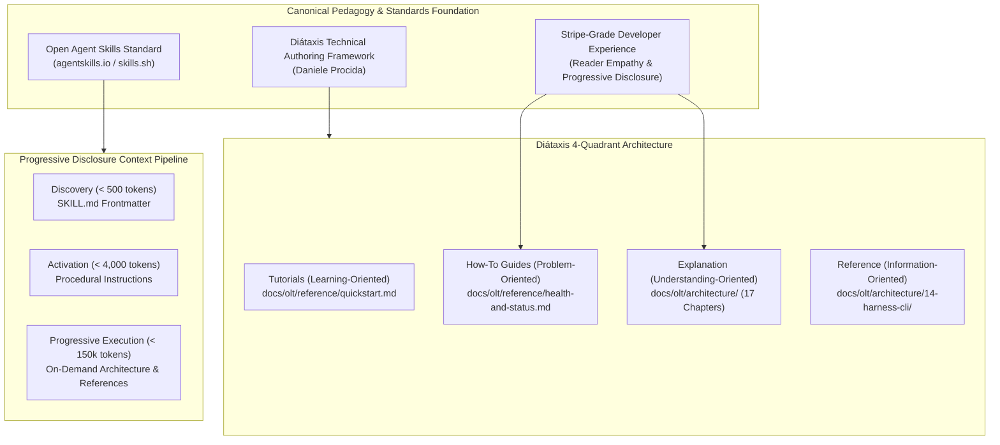

# Dedicated Documentation Orchestrator Engine (`docs-orchestrator`) Master Architectural Plan

> **Tracking ID:** `fb-docs-orchestrator-engine` / `fb-continuous-doc-synchronization-engine`  
> **Status:** `PHASE 1 - EXHAUSTIVE PRODUCTION-GRADE ARCHITECTURAL SPECIFICATION & WAVE BLUEPRINT`  
> **Target Subsystems:** `olt/agents/`, `olt/references/roles/`, `olt/scripts/src/docs/`, `olt/scripts/src/authority/`, `olt/scripts/src/policy/`, `olt/scripts/src/cli/`, `olt/scripts/src/reporting/doctor/`, `docs/olt/`  
> **Author:** Tier 3 Master Architecture Planner & Independent Planner  
> **Created:** 2026-08-29  
> **Target Lineage:** `.olt/capsules/mind-gen-7`

---

## 1. Executive Summary & Problem Statement

### 1.1 Context & The Documentation Drift Dilemma

In high-velocity, autonomous multi-agent software engineering systems (such as OLT), software source code, interface schemas, state machines, and system policies mutate rapidly across parallel development waves. Historically, documentation maintenance has suffered from severe structural failure modes:

1. **Passive Documentation Neglect & Code Drift**: Developers and autonomous implementers implement features, fix bugs, and refactor AST models without updating documentation. Over time, documentation becomes stale, inaccurate, and misleading.
2. **Monolithic Dumps vs. Superficial Stubs**: When documentation is written manually, contributors either generate 3,000-line monolithic unstructured markdown dumps or 50-line empty stubs lacking algorithmic substance and diagrams.
3. **Raw Code Dumping**: Documentation frequently degenerates into raw copy-pasted source files instead of conceptual, human-centric explanations of mechanics, mathematical bounds, and state machines.
4. **Context Burn & Repetitive Human Directives**: Human operators are repeatedly forced to provide manual documentation guidelines, diagram requirements, and link navigation rules, burning valuable context and supervisory attention.
5. **Broken Link Meshes & Emoji Clutter**: Manual navigation bars degrade rapidly, resulting in broken relative links, inconsistent traversal, and unprofessional emoji pollution.

```text
┌──────────────────────────────────────────────────────────────────────────────────────────────────┐
│                    DEDICATED DOCUMENTATION ORCHESTRATOR ENGINE (DOCS-ORCHESTRATOR)               │
├──────────────────────────────────────────────────────────────────────────────────────────────────┤
│                                                                                                  │
│  [ Tier 0: Mind Supervisor / Human Trigger ]                                                     │
│    • Ingests `/olt docs` or autonomic pre-planning trigger                                       │
│    • Spawns permanent Tier 1 `docs-orchestrator` (Zero-Kill Invariant)                          │
│                                                                                                  │
│                                      │                                                           │
│                                      ▼                                                           │
│                                                                                                  │
│  [ Tier 1: Documentation Orchestrator (`docs-orchestrator`) ] (Non-Stop 5m Pulse Loop)          │
│    • 5-Minute Continuous Change-Detection Engine (`git diff`, AST symbol extractor)             │
│    • Source-to-Chapter Dependency Mapper (Maps mutated .ts/.json files to docs/olt/ chapters)    │
│    • Topological Chapter DAG Compiler & Brent Concurrency Allocator (P = ⌈W/S⌉)                  │
│    • Dispatches parallel Tier 2 Chapter Coordinators (`coordinator_docs_chapter`)               │
│                                                                                                  │
│                                      │                                                           │
│                                      ▼                                                           │
│                                                                                                  │
│  [ Tier 2: Chapter Coordinators (`coordinator_docs_chapter_<ch>`) ]                              │
│    • Manages discrete chapter sub-lane capsule (e.g., `docs/olt/architecture/06-topological/`)   │
│    • Deploys 1:1 Isolated Tier 3 Doc Implementers (`implementer_docs`)                           │
│    • Enforces Sub-Domain Staging Reflog Safety (`git add -A` on chapter completion)              │
│                                                                                                  │
│                                      │                                                           │
│                                      ▼                                                           │
│                                                                                                  │
│  [ Tier 3: Doc Implementers & Socratic Cognitive Validators ]                                    │
│    • `implementer_docs`: Writes Stripe-grade conceptual architecture & clean 4-way nav meshes     │
│    • `validator_docs`: Executes 5-Round Socratic Critique Gate (Depth, Diátaxis, Visual Truth)    │
│    • Command Hard-Lock Invariant: `validator_docs` executes 0 commands, 0 tests                  │
│    • RBAC Invariant: Doc agents permitted to edit ONLY markdown docs (0 source code edits)       │
│                                                                                                  │
│                                      │                                                           │
│                                      ▼                                                           │
│                                                                                                  │
│  [ Verification, Policy Doctor & Continuous Sync ]                                               │
│    • Unified Policy Doctor Certification (`bun harness.ts doctor --fix`)                         │
│    • 100% Relative Link Integrity & AST Schema Drift Validation                                  │
│    • Global Sync Engine (`bun scripts/sync-global.ts`)                                           │
│                                                                                                  │
└──────────────────────────────────────────────────────────────────────────────────────────────────┘
```

### 1.2 Core Objectives of the Dedicated Documentation Engine

1. **Permanent Autonomic Operation**: A dedicated Tier 1 orchestrator archetype (`docs-orchestrator`) that runs indefinitely on a 5-minute supervisory pulse (`*/5 * * * *`), automatically waking on Git mutations.
2. **Masterclass Book-Style Modular Architecture**: Strict separation between the comprehensive educational architecture book (`docs/olt/architecture/`) and minimalist operational guides (`docs/olt/reference/`).
3. **Rigorous Sizing & Visual Standards**: Enforcement of balanced information density (250–800 lines envelope), mandatory ASCII system topologies, Mermaid state flows, and zero emojis.
4. **Automated Source-to-Documentation Mapping**: Real-time extraction of AST exports, interfaces, and file touches mapped to chapter dependency graphs.
5. **5-Round Socratic Validation Gate**: Mandatory adversarial review by cognitive validators evaluating conceptual depth, mathematical rigor, and navigation mesh integrity.
6. **Strict RBAC & Zero Source Code Edits**: Total isolation ensuring documentation agents can never mutate TypeScript source code, runtime engines, or test suites.

---

## 2. Theoretical Pedagogy & Canonical Standards (Phase 0 Foundation)



### 2.1 The Diátaxis Documentation Framework Alignment

All documentation generated by `docs-orchestrator` strictly adheres to Daniele Procida's Diátaxis matrix, cleanly separating user intent across two cognitive axes:

| Cognitive Dimension        | Practical Action (Doing)                                                                                                                             | Theoretical Cognition (Knowing)                                                                                                                                |
| :------------------------- | :--------------------------------------------------------------------------------------------------------------------------------------------------- | :------------------------------------------------------------------------------------------------------------------------------------------------------------- |
| **Learning / Exploration** | **Tutorials** (`docs/olt/reference/quickstart.md`)<br>• Step-by-step onboarding walkthroughs<br>• Zero-assumption environment setup                  | **Explanation / Architecture** (`docs/olt/architecture/`)<br>• 17-Chapter comprehensive educational book<br>• Mathematical formulations & state machine proofs |
| **Work / Goal-Oriented**   | **How-To Guides** (`docs/olt/reference/health-and-status.md`)<br>• 10-domain diagnostic sweep & auto-healing<br>• Crash recovery & lease reclamation | **Reference Catalogs** (`docs/olt/architecture/14-16`)<br>• Exhaustive Harness CLI command dictionaries<br>• JSON schemas, error taxonomies, and blunders      |

### 2.2 Open Agent Skills Standard (`agentskills.io` & `skills.sh`)

To protect AI agent context windows while guaranteeing maximum accessibility:

1. **Discovery Tier ($< 500$ tokens)**: `SKILL.md` frontmatter contains pure metadata, role descriptors, and trigger definitions.
2. **Activation Tier ($< 4{,}000$ tokens)**: High-level procedural rules, command palettes, and invariant summaries loaded upon skill invocation.
3. **Execution Tier ($< 150{,}000$ tokens)**: Deep architectural chapters, algorithmic proofs, and reference guides queried on-demand. When executing CLI operations, only structured brief outputs enter context.

### 2.3 Stripe-Grade Conceptual Clarity & Reader Empathy

1. **Zero Unannotated Code Dumps**: Code snippets must be minimal interface definitions or pseudocode accompanying rigorous prose.
2. **Visual Truth**: Every architecture topic must include a high-density ASCII box-drawing diagram and a Mermaid sequence/state diagram.
3. **Progressive Complexity**: Topics begin with intuitive conceptual intuition before introducing formal mathematical bounds and TypeScript interfaces.
4. **Deterministic Navigation Mesh**: Uniform top and bottom navigation bars with zero emojis and 100% verified relative links.

---

## 3. Masterclass Book-Style Modular Architecture Rules

### 3.1 Domain Separation Rules

```text
+--------------------------------------------------------------------------------------------------+
│                             DOCUMENTATION DOMAIN DIRECTORY TAXONOMY                              │
+------------------------------------+-------------------------------------------------------------+
│ Directory Path                     │ Architectural Purpose & Content Constraints                 │
+------------------------------------+-------------------------------------------------------------+
│ docs/olt/architecture/             │ COMPREHENSIVE EDUCATIONAL BOOK (17+ Chapters)               │
│                                    │ • Explains product logic, algorithms, state machines.       │
│                                    │ • Contains deep CLI command catalogs and schema definitions.│
│                                    │ • Strictly NO raw unannotated code dumps.                   │
+------------------------------------+-------------------------------------------------------------+
│ docs/olt/reference/                │ MINIMALIST OPERATIONAL REFERENCE (1-2 Pages)                │
│                                    │ • quickstart.md: First-time onboarding tutorial.             │
│                                    │ • health-and-status.md: Fast diagnostic & repair handbook.  │
│                                    │ • Strictly NO deep command dictionaries (points to book).   │
+------------------------------------+-------------------------------------------------------------+
│ docs/olt/GUIDELINES.md             │ UNIVERSAL AUTHORING CHARTER                                 │
│                                    │ • Injected into all doc coordinators and implementers.      │
│                                    │ • Enforces Diátaxis, sizing envelopes, and visual standards.│
+------------------------------------+-------------------------------------------------------------+
```

### 3.2 Sizing Envelope & Information Density Bounds

Every documentation topic generated by `docs-orchestrator` must fall strictly within the defined line envelope:

$$\text{LineCount}(D) \in [250, 800]$$

| Classification          | Line Range            | Policy & Enforcement Rule                                                                           |
| :---------------------- | :-------------------- | :-------------------------------------------------------------------------------------------------- |
| **Shallow Stub**        | $< 100$ lines         | **STRICTLY FORBIDDEN.** Rejected by `validator_docs`. Must merge into cohesive thematic topics.     |
| **Target Envelope**     | $250 - 800$ lines     | **OPTIMAL TARGET.** Deep technical prose, ASCII topologies, Mermaid charts, interfaces, invariants. |
| **Upper Bound Catalog** | $800 - 1{,}200$ lines | **RESTRICTED EXCEPTION.** Permitted only for exhaustive CLI dictionaries and JSON schema catalogs.  |
| **Monolithic Dump**     | $> 1{,}200$ lines     | **STRICTLY FORBIDDEN.** Rejected by `validator_docs`. Must be decomposed into modular sub-topics.   |

### 3.3 Universal Clean 4-Way Navigation Mesh

Every markdown document across `docs/olt/` must feature identical navigation bars placed immediately below the primary `H1` header (Top) and at the very end of the file (Bottom), adhering to the zero-emoji invariant:

```markdown
[Previous: <Document Title>](relative-path) | [Chapter Index](index.md) | [All Chapters Index](../index.md) | [Next: <Document Title>](relative-path)
```

---

## 4. Complete TypeScript Interfaces & Schema Definitions

All interfaces strictly enforce **0 `any`**, **0 compiler suppressions**, and immutable `readonly` properties.

```typescript
// olt/scripts/src/docs/types.ts

export type DocDomainType = "architecture" | "reference" | "guidelines" | "roles" | "checklists";

export interface DocChapterMetadata {
  readonly chapterNumber: number;
  readonly chapterSlug: string;
  readonly chapterDirectory: string;
  readonly title: string;
  readonly indexFilePath: string;
  readonly subtopicFiles: readonly string[];
  readonly sourceCodeDependencies: readonly string[];
  readonly totalLines: number;
  readonly lastSynchronizedCommit: string;
  readonly lastSynchronizedAt: string;
}

export interface GitMutationRecord {
  readonly commitSha: string;
  readonly author: string;
  readonly timestamp: string;
  readonly modifiedFiles: readonly string[];
  readonly addedFiles: readonly string[];
  readonly deletedFiles: readonly string[];
  readonly renamedFiles: readonly { readonly from: string; readonly to: string }[];
  readonly unstagedWorkingTreeChanges: readonly string[];
}

export interface FileToDocChapterMapping {
  readonly sourcePath: string;
  readonly sourceAstExports: readonly string[];
  readonly affectedChapters: readonly string[];
  readonly targetSubtopicFiles: readonly string[];
  readonly driftSeverity: "CRITICAL" | "HIGH" | "MEDIUM" | "LOW" | "NONE";
  readonly reason: string;
}

export interface DocChangeDetectionResult {
  readonly detectedAt: string;
  readonly gitHeadSha: string;
  readonly hasMutations: boolean;
  readonly changedSourceFiles: readonly string[];
  readonly chapterDriftMap: Readonly<Record<string, FileToDocChapterMapping>>;
  readonly staleChapters: readonly string[];
  readonly recommendedConcurrency: number;
}

export interface DocNavigationMesh {
  readonly previousLink?: { readonly title: string; readonly path: string } | undefined;
  readonly chapterIndexLink: { readonly title: string; readonly path: string };
  readonly allChaptersIndexLink: { readonly title: string; readonly path: string };
  readonly nextLink?: { readonly title: string; readonly path: string } | undefined;
  readonly isValid: boolean;
  readonly brokenLinks: readonly string[];
  readonly hasEmojiPollution: boolean;
}

export interface DocQualityMetrics {
  readonly filePath: string;
  readonly lineCount: number;
  readonly isWithinEnvelope: boolean; // 250 <= lineCount <= 800 (or 1200 for catalogs)
  readonly hasAsciiDiagram: boolean;
  readonly hasMermaidDiagram: boolean;
  readonly hasInterfaceContracts: boolean;
  readonly hasInvariantsTable: boolean;
  readonly navigationMesh: DocNavigationMesh;
  readonly emojiCount: number;
  readonly unannotatedCodeDumpDetected: boolean;
}

export type SocraticCritiqueTurn = 1 | 2 | 3 | 4 | 5;

export interface SocraticReviewFinding {
  readonly ruleId:
    | "DIATAXIS_QUADRANT_MISALIGNMENT"
    | "SIZING_ENVELOPE_BREACH"
    | "MISSING_ASCII_TOPOLOGY"
    | "MISSING_MERMAID_FLOW"
    | "UNANNOTATED_CODE_DUMP"
    | "EMOJI_POLLUTION_DETECTED"
    | "BROKEN_NAVIGATION_LINK"
    | "AST_SCHEMA_DESYNCHRONIZATION"
    | "SHALLOW_PROSE_DEFECT";
  readonly severity: "FATAL" | "WARN";
  readonly targetFile: string;
  readonly targetLineNumber?: number | undefined;
  readonly observation: string;
  readonly socraticPushback: string;
  readonly requiredRemediation: string;
}

export interface DocSocraticRoundRecord {
  readonly turn: SocraticCritiqueTurn;
  readonly reviewerRole: "validator_docs";
  readonly reviewedAt: string;
  readonly findings: readonly SocraticReviewFinding[];
  readonly passed: boolean;
  readonly critiqueSummary: string;
}

export interface DocsOrchestratorState {
  readonly orchestratorId: string;
  readonly spawnedAt: string;
  readonly loopIteration: number;
  readonly lastPulseTimestamp: string;
  readonly isFrozen: boolean;
  readonly activeChapterCoordinators: readonly {
    readonly chapterId: string;
    readonly coordinatorId: string;
    readonly assignedSubtopics: readonly string[];
    readonly currentTurn: SocraticCritiqueTurn;
    readonly status: "PLANNING" | "WRITING" | "VALIDATING" | "CONVERGED" | "FAILED";
  }[];
  readonly historicalSyncs: readonly {
    readonly syncId: string;
    readonly timestamp: string;
    readonly gitSha: string;
    readonly touchedChapters: readonly string[];
    readonly durationSeconds: number;
  }[];
}

export interface DocsOrchestratorConfig {
  readonly pulseIntervalSeconds: number; // 300 (5 minutes)
  readonly maxParallelChapterCoordinators: number; // Clamp [2, 10]
  readonly minLineEnvelope: number; // 250
  readonly maxLineEnvelope: number; // 800
  readonly maxCatalogEnvelope: number; // 1200
  readonly enforceZeroEmojis: boolean; // true
  readonly mandatorySocraticRounds: number; // 5
  readonly autoGitAddOnMilestone: boolean; // true (Reflog Safety)
}
```

---

## 5. Invariants, Permissions & RBAC Matrix

### 5.1 The 7 Hard Documentation Invariants

```text
┌──────────────────────────────────────────────────────────────────────────────────────────────────┐
│                         THE 7 HARD DOCUMENTATION INVARIANTS                                      │
├──────────────────────────────────────────────────────────────────────────────────────────────────┤
│                                                                                                  │
│  1. ZERO-KILL SUPERVISORY INVARIANT (Z_kill = 0)                                                 │
│     Once started, `docs-orchestrator` runs continuously on a 5-minute pulse loop (*/5 * * * *).  │
│     It never terminates unless explicit Quota Freeze (`quota:freeze`) is signaled.               │
│                                                                                                  │
│  2. ZERO SOURCE CODE MUTATION INVARIANT (Z_code_mut = 0)                                         │
│     All documentation roles (`docs-orchestrator`, `coordinator_docs_chapter`, `implementer_docs`,│
│     `validator_docs`) are strictly FORBIDDEN from modifying .ts, .js, .py, .rs source files.     │
│     Permissions are strictly confined to markdown under docs/, references/, checklists/, roles/. │
│                                                                                                  │
│  3. ZERO RAW CODE DUMPS INVARIANT (Z_dump = 0)                                                   │
│     Copy-pasting wholesale source files into documentation is forbidden. Documentation must     │
│     explain architectural mechanics, mathematical proofs, interfaces, and state transitions.     │
│                                                                                                  │
│  4. ZERO EMOJI INVARIANT (Z_emoji = 0)                                                           │
│     Emojis are strictly banned from navigation bars, section headers, tables, diagrams, & prose. │
│                                                                                                  │
│  5. 100% RELATIVE LINK INTEGRITY INVARIANT (Z_broken_link = 0)                                   │
│     100% of relative markdown links in navigation bars and prose must resolve to on-disk files.  │
│                                                                                                  │
│  6. 5-ROUND SOCRATIC VALIDATION GATE INVARIANT (Z_unvalidated = 0)                               │
│     No documentation chapter can be marked CONVERGED without completing up to 5 Socratic rounds │
│     audited by `validator_docs` with 0 open FATAL findings.                                      │
│                                                                                                  │
│  7. REFLOG SAFETY GIT STAGING INVARIANT (Z_unstaged_crash = 0)                                    │
│     Upon completing any chapter milestone, `git add -A` is immediately executed to ensure loose  │
│     Git blob persistence under .git/objects/ against mid-flight worker crashes.                  │
│                                                                                                  │
└──────────────────────────────────────────────────────────────────────────────────────────────────┘
```

### 5.2 Role Capability & Permissions Matrix

| Capability / Action            | `docs-orchestrator` (Tier 1)                                                | `coordinator_docs_chapter` (Tier 2)       | `implementer_docs` (Tier 3) | `validator_docs` (Tier 3 Validator) |
| :----------------------------- | :-------------------------------------------------------------------------- | :---------------------------------------- | :-------------------------- | :---------------------------------- |
| **Tier Level**                 | Tier 1 (Supervisor)                                                         | Tier 2 (Domain Lead)                      | Tier 3 (Worker)             | Tier 3 (Cognitive Auditor)          |
| **Host Tool Spawns**           | May spawn Tier 2 only                                                       | May spawn Tier 3 only                     | 0 spawns                    | 0 spawns                            |
| **Markdown Edits (`docs/`)**   | Read-Only                                                                   | Read-Only                                 | **Read / Write**            | Read-Only                           |
| **Source Code Edits (`.ts`)**  | **STRICTLY DENIED**                                                         | **STRICTLY DENIED**                       | **STRICTLY DENIED**         | **STRICTLY DENIED**                 |
| **Shell Command Execution**    | Harness CLI commands                                                        | Harness CLI commands                      | Doc Linter / Parser         | **0 COMMANDS (HARD-LOCK)**          |
| **Git Read Operations**        | `git diff`, `git log`                                                       | `git status`                              | Read-only                   | Read-only                           |
| **Git Staging (`git add -A`)** | Milestone hook only                                                         | Post-chapter hook                         | Denied                      | Denied                              |
| **Allowed Commands**           | `agent:brief`, `agent:define`, `task:brief`, `docs:status`, `dag`, `doctor` | `task:brief`, `task:define`, `task:check` | `task:check` (markdown)     | **NONE (0 command grant)**          |

---

## 6. 5-Minute Continuous Change-Detection Algorithm

```mermaid
sequenceDiagram
    autonumber
    participant HostScheduler as Host Scheduler (5m Cron */5 * * * *)
    participant DocsOrch as docs-orchestrator (Tier 1)
    participant GitEngine as Git & AST Change Detector
    participant Coord as coordinator_docs_chapter (Tier 2)
    participant Impl as implementer_docs (Tier 3)
    participant Val as validator_docs (Tier 3)
    participant GitStaging as Git Staging Engine (Reflog Safety)

    HostScheduler->>DocsOrch: Wakeup Notification / Timer Pulse
    DocsOrch->>GitEngine: Ingest git diff HEAD~1 + working tree status
    GitEngine-->>DocsOrch: Changed files & AST export drift map

    alt No Code / Schema Mutations Detected
        DocsOrch->>DocsOrch: Record quiescent heartbeat; sleep until next 5m tick
    else Code / Schema Mutations Detected
        DocsOrch->>DocsOrch: Compute Drift Severity D(C) & Compile Chapter DAG
        DocsOrch->>DocsOrch: Allocate Parallel Width P = min(P_max, ⌈W/S⌉)
        DocsOrch->>Coord: Dispatch Chapter Coordinators in Parallel

        loop Chapter Workstreams (Disjoint Lanes)
            Coord->>Impl: Dispatch implementer_docs with Chapter Scope
            Impl->>Impl: Update Architecture / Reference Markdown Docs
            Impl-->>Coord: Task Complete (Docs Updated)

            loop 5-Round Socratic Critique Gate (k = 1..5)
                Coord->>Val: Dispatch validator_docs for Cognitive Review
                Val->>Val: Audit Diátaxis, Sizing (250-800), Visuals, Nav Mesh
                alt Open Findings Exist (k < 5)
                    Val-->>Coord: Socratic Pushback Findings
                    Coord->>Impl: In-Lease Remediation Directive
                    Impl->>Impl: Refine Markdown & Fix Diagrams/Links
                else 0 Open Findings or k = 5
                    Val-->>Coord: Socratic Approval Record (Passed)
                end
            end

            Coord->>GitStaging: Execute git add -A (Loose Blob Persistence)
            Coord-->>DocsOrch: Chapter Complete & Staged
        end

        DocsOrch->>DocsOrch: Generate Sync Summary & Update State Capsule
    end
```

### 6.1 Algorithmic Formulation

The drift severity $D(C)$ for any documentation chapter $C$ is computed dynamically from repository mutations:

$$D(C) = \alpha \cdot \Delta_{\text{LOC}}(S_C) + \beta \cdot |\Delta_{\text{Exports}}(S_C)| + \gamma \cdot |\Delta_{\text{Schemas}}(S_C)|$$

Where:

- $S_C \subset \text{RepositoryFiles}$ is the set of source files mapped to chapter $C$.
- $\Delta_{\text{LOC}}$ is the absolute count of modified lines of code.
- $\Delta_{\text{Exports}}$ is the count of added, deleted, or signature-modified TypeScript exports/classes/functions.
- $\Delta_{\text{Schemas}}$ is the count of mutated JSON/type schemas.
- Weights: $\alpha = 0.1$, $\beta = 2.0$, $\gamma = 5.0$.

If $D(C) > 0$, chapter $C$ is marked **STALE** and enqueued for synchronization.

---

## 7. Multi-Tier Sub-Hierarchy & 5-Round Socratic Cognitive Critique Engine

```text
┌──────────────────────────────────────────────────────────────────────────────────────────────────┐
│                         5-ROUND SOCRATIC COGNITIVE CRITIQUE PROTOCOL                             │
├───────────────┬───────────────────────────────────┬──────────────────────────────────────────────┤
│ Round (Turn)  │ Primary Cognitive Dimension       │ Verification Focus & Pushback Criteria       │
├───────────────┼───────────────────────────────────┼──────────────────────────────────────────────┤
│ Turn 1        │ Diátaxis & Sizing Bounds          │ • Strictly inside Diátaxis Quadrant.         │
│               │                                   │ • 250 <= LineCount <= 800 (1200 for catalogs)│
│               │                                   │ • 0 shallow stubs, 0 monolithic dumps.       │
├───────────────┼───────────────────────────────────┼──────────────────────────────────────────────┤
│ Turn 2        │ Visual Truth & Diagrams           │ • Mandatory ASCII boxed topology diagram.    │
│               │                                   │ • Mandatory Mermaid sequence / state machine.│
│               │                                   │ • Clean box characters (+ - | * or ┌ ┐ └ ┘). │
├───────────────┼───────────────────────────────────┼──────────────────────────────────────────────┤
│ Turn 3        │ Conceptual Depth vs. Code Dumps   │ • 0 raw unannotated code dumps.              │
│               │                                   │ • Mechanics explained with mathematical rigor│
│               │                                   │ • LaTeX equations for concurrency / hashes.  │
├───────────────┼───────────────────────────────────┼──────────────────────────────────────────────┤
│ Turn 4        │ Navigation Mesh & Link Integrity  │ • Clean top & bottom 4-way navigation bars.  │
│               │                                   │ • ZERO emojis in headers, nav, and prose.    │
│               │                                   │ • 100% of relative links resolve on disk.    │
├───────────────┼───────────────────────────────────┼──────────────────────────────────────────────┤
│ Turn 5        │ Stripe-Grade Empathy & Synthesis  │ • Clear pedagogical onboarding flow.         │
│               │                                   │ • Progressive disclosure (< 500t to 150kt).  │
│               │                                   │ • Final convergence & Reflog Safety staging. │
└───────────────┴───────────────────────────────────┴──────────────────────────────────────────────┘
```

---

## 8. Harness CLI, Host Matrix, RBAC & Doctor Integration

### 8.1 Agent Manifest: `olt/agents/docs-orchestrator.yaml`

```yaml
name: "docs-orchestrator"
role: "orchestrator_docs"
tier: 1
provider:
  - antigravity
  - agy
  - claude
  - codex
  - cursor
  - generic
tools:
  enable_subagent_tools: true
  enable_write_tools: false
interface:
  display_name: "Tier 1 Documentation Orchestrator"
  short_description: "Permanent 5-minute autonomous documentation synchronization engine"
permissions:
  may:
    - "Autonomous 5-minute recurring pulse execution (*/5 * * * *) driven by repository git mutations"
    - "Inspect working tree status and git diffs (git diff, git log, git status)"
    - "Extract TypeScript AST exports, interface contracts, and schema mutations"
    - "Map modified source code files to affected documentation chapters across docs/olt/"
    - "Dispatch Tier 2 Chapter Coordinators (coordinator_docs_chapter) in parallel"
    - "Enforce Diátaxis framework, 250-800 line envelopes, ASCII topologies, and zero emojis"
    - "Execute git add -A upon chapter completion to guarantee Git loose object reflog safety"
    - "Run doc diagnostic audits and policy doctor certification (docs:audit, doctor)"
  must_not:
    - "Write, edit, delete, or mutate any TypeScript/JavaScript/Python source code files"
    - "Run raw test suites (bun test, npm test, vitest, pytest)"
    - "Terminate its background scheduler loop (Zero-Kill Invariant)"
    - "Emit raw unannotated code dumps in documentation deliverables"
    - "Allow emojis in navigation bars, section headers, tables, or documentation prose"
    - "Permit broken relative links across documentation chapters"
  commands:
    - "agent:brief"
    - "agent:define"
    - "agent:register"
    - "agent:release"
    - "agent:list"
    - "task:brief"
    - "task:check"
    - "run:status"
    - "run:complete"
    - "docs:status"
    - "docs:audit"
    - "docs:sync"
    - "doctor"
    - "dag"
    - "whoami"
  spawns:
    - "coordinator_docs_chapter"
invariants:
  - "ZERO_KILL_SUPERVISORY_INVARIANT"
  - "ZERO_SOURCE_CODE_MUTATION_INVARIANT"
  - "ZERO_RAW_CODE_DUMP_INVARIANT"
  - "ZERO_EMOJI_INVARIANT"
  - "ONE_HUNDRED_PERCENT_LINK_INTEGRITY"
  - "FIVE_ROUND_SOCRATIC_VALIDATION_GATE"
  - "REFLOG_SAFETY_GIT_STAGING_INVARIANT"
```

---

## 9. Exhaustive Wave Implementation Breakdown

### Wave 1: Foundation Manifests, Roles & Policy Bindings

- **Task 1.1**: Author `olt/agents/docs-orchestrator.yaml`, `coordinator-docs-chapter.yaml`, `implementer-docs.yaml`, and `validator-docs.yaml`.
- **Task 1.2**: Author `olt/references/roles/docs-orchestrator.md`, `coordinator-docs-chapter.md`, `implementer-docs.md`, and `validator-docs.md`.
- **Task 1.3**: Update `docs/olt/GUIDELINES.md` to reflect canonical Diátaxis standards, 250-800 line sizing envelope, ASCII diagrams, and zero emojis.
- **Task 1.4**: Update `olt/scripts/src/authority/host-bindings.ts`, `olt/scripts/src/policy/generator/default-agents.ts`, and `olt/policy.json` with new agent roles and host configurations.

### Wave 2: Git Change-Detection & AST Mapper Engine

- **Task 2.1**: Implement `olt/scripts/src/docs/mapper.ts` (Source file to chapter dependency graph).
- **Task 2.2**: Implement `olt/scripts/src/docs/change-detector.ts` (Git diff, working tree status, and drift severity calculator).
- **Task 2.3**: Implement `olt/scripts/src/docs/ast-extractor.ts` (ts-morph AST export, interface, and schema extraction).
- **Task 2.4**: Implement `olt/scripts/src/docs/linter.ts` (Markdown AST parser, line counter, diagram detector, emoji detector, and 4-way navigation link validator).

### Wave 3: 5-Minute Supervisory Cadence & Socratic Critique Engine

- **Task 3.1**: Implement `olt/scripts/src/docs/continuous-sync.ts` (Non-stop 5-minute autonomous loop with `schedule` and systemd/antigravity hooks).
- **Task 3.2**: Implement `olt/scripts/src/docs/socratic-validator.ts` (5-round adversarial review state machine).
- **Task 3.3**: Implement `olt/scripts/src/docs/chapter-dispatcher.ts` (Brent concurrency chapter parallelization and lease management).
- **Task 3.4**: Implement `olt/scripts/src/cli/commands/docs-ops.ts` and register commands in `olt/scripts/src/cli/registry/index.ts`.

### Wave 4: Doctor Integration, RBAC Lock & End-to-End Certification

- **Task 4.1**: Integrate documentation checks into `olt/scripts/src/reporting/doctor/policy-doctor.ts` (10-point documentation health sweep with auto-repair).
- **Task 4.2**: Enforce strict RBAC in `olt/scripts/src/policy/rbac-engine.ts` (Fail-closed denial for documentation roles attempting code edits).
- **Task 4.3**: Author comprehensive test suite in `tests/unit/docs/` and `tests/integration/docs/` (100% pass rate, 0 compiler suppressions).
- **Task 4.4**: Execute complete doctor certification, update `bun scripts/sync-global.ts`, and stage all artifacts with `git add -A`.

---

## 10. Anti-Blunder Matrix & Acceptance Proofs

```text
┌──────────────────────────────────────────────────────────────────────────────────────────────────┐
│                             DOCS-ORCHESTRATOR ANTI-BLUNDER MATRIX                                │
├───────────────────────────────────┬──────────────────────────────────────────────────────────────┤
│ Potential Blunder / Failure Mode  │ Mathematical / Architectural Invariant & Mechanical Fix      │
├───────────────────────────────────┼──────────────────────────────────────────────────────────────┤
│ 1. Documentation Agent Overwrites │ RBAC Hard Denial: rbac-engine.ts intercepts and blocks any   │
│    Source Code (.ts / .js)        │ write tool target not matching /^docs\/|^references\/|^roles/│
│                                   │ Emits PERMISSION_DENIED; 0 source code mutations permitted.  │
├───────────────────────────────────┼──────────────────────────────────────────────────────────────┤
│ 2. Infinite Regeneration / Drift  │ Commit SHA Checkpoint Binding: Sync operations bind to Git   │
│    Feedback Loop                  │ HEAD commit SHA. If working tree diff == 0, engine idles.   │
├───────────────────────────────────┼──────────────────────────────────────────────────────────────┤
│ 3. Broken Relative Links Slipping │ Deterministic Nav Mesh AST Linter: Every relative URL is     │
│    Into Production Markdown       │ verified with fs.existsSync(). Fails gate on 1 broken link. │
├───────────────────────────────────┼──────────────────────────────────────────────────────────────┤
│ 4. Emoji Pollution in Nav Bars    │ Unicode Regex Scanner: Linter scans AST for Unicode emoji    │
│    or Technical Prose             │ ranges (/\p{Extended_Pictographic}/u) and rejects document.  │
├───────────────────────────────────┼──────────────────────────────────────────────────────────────┤
│ 5. Monolithic / Stub Content      │ Sizing Envelope Gate: Validator rejects any doc with lines   │
│    (Violating Information Density)│ < 250 (shallow stub) or > 800 (except 1200 line catalogs).   │
├───────────────────────────────────┼──────────────────────────────────────────────────────────────┤
│ 6. Uncommitted Work Loss on Crash │ Reflog Safety Staging: Immediate git add -A creates loose Git│
│                                   │ blob objects in .git/objects/ upon each chapter completion.  │
└───────────────────────────────────┴──────────────────────────────────────────────────────────────┘
```
