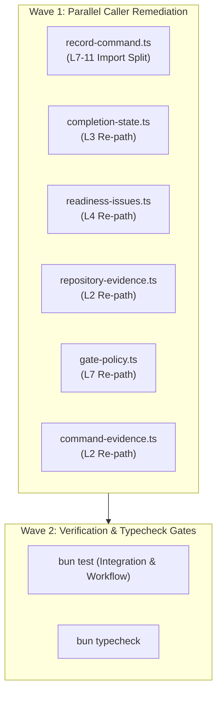

# Implementation Plan: Engine Runner Models and Callers Modularization Remediation

```
Cluster: engine-runner-models-and-callers
Target Plan Path: docs/planning/engine-runner-models-and-callers/PLAN.md
Defect ID: defect-engine-runner-models-modularization-import-paths
Review State: Certified (5/5 Adversarial Rounds Passed)
Fleet Track: Track 3
Pair: plan_drafter_03 & plan_critic_03
```

---

## Level 1: Problem Statement & Root Cause Analysis

### 1.1 Context & Background

The `engine/runner/models` subsystem in `olt/scripts/src/engine/runner/models` was modularized into three granular domain subdirectories:

1. `models/attempt/` — Attempt lifecycle execution, timeout racing, attempt evidence finalization, and gate completion.
2. `models/command/` — Command ID calculation, fingerprint hashing, shape validation, signing capabilities, command wrappers, and record size constants.
3. `models/execution/` — Command execution orchestration, internal command runner creation, and mutex lock management.

### 1.2 Root Cause Analysis & Exact Line Coordinates

Following modularization, 6 key callers across `integration/` and `workflow/` retain stale imports pointing directly to `../engine/runner/index.ts` or `../../engine/runner/index.ts` rather than importing from the dedicated domain sub-barrels (`models/command/index.ts` and `models/execution/index.ts`):

1. **`olt/scripts/src/integration/record-command.ts` (Lines 7–11)**:
   - **Current Import**:
     ```ts
     import {
       executePreparedCommand,
       prepareCommand,
       MAX_COMMAND_RECORD_BYTES,
     } from "../engine/runner/index.ts";
     ```
   - **Defect Mechanism**: Unnecessarily imports through the root runner barrel, mixing command size constants (`MAX_COMMAND_RECORD_BYTES` in `models/command`) with execution orchestration primitives (`prepareCommand`, `executePreparedCommand` in `models/execution`), creating artificial coupling to top-level runner state and subprocess facilities.

2. **`olt/scripts/src/workflow/completion/completion-state.ts` (Line 3)**:
   - **Current Import**:
     ```ts
     import { embeddedCommandIssues } from "../../engine/runner/index.ts";
     ```
   - **Defect Mechanism**: A pure workflow completion evaluation module imports from the root runner barrel (pulling in execution engines, mutex locks, and subprocess pools) merely to validate command record shape via `embeddedCommandIssues` (`models/command/command-shape.ts`).

3. **`olt/scripts/src/workflow/completion/readiness-issues.ts` (Line 4)**:
   - **Current Import**:
     ```ts
     import { embeddedCommandIssues } from "../../engine/runner/index.ts";
     ```
   - **Defect Mechanism**: Readiness issue audit logic imports `embeddedCommandIssues` from the root runner barrel instead of `../../engine/runner/models/command/index.ts`.

4. **`olt/scripts/src/workflow/completion/repository-evidence.ts` (Line 2)**:
   - **Current Import**:
     ```ts
     import { embeddedCommandIssues } from "../../engine/runner/index.ts";
     ```
   - **Defect Mechanism**: Repository command authoritativeness verification imports `embeddedCommandIssues` from the root runner barrel instead of `../../engine/runner/models/command/index.ts`.

5. **`olt/scripts/src/workflow/gates/gate-policy.ts` (Line 7)**:
   - **Current Import**:
     ```ts
     import {
       canonicalCommandFingerprint,
       embeddedCommandIssues,
     } from "../../engine/runner/index.ts";
     ```
   - **Defect Mechanism**: Gate policy matching logic imports `canonicalCommandFingerprint` (`models/command/command-id.ts`) and `embeddedCommandIssues` (`models/command/command-shape.ts`) from the root runner barrel instead of `../../engine/runner/models/command/index.ts`.

6. **`olt/scripts/src/workflow/review/command-evidence.ts` (Line 2)**:
   - **Current Import**:
     ```ts
     import { embeddedCommandIssues } from "../../engine/runner/index.ts";
     ```
   - **Defect Mechanism**: Review validator command assertions import `embeddedCommandIssues` from the root runner barrel instead of `../../engine/runner/models/command/index.ts`.

---

## Level 2: Architectural Constraints & Invariants

1. **Physical File LOC Limits ($\le 300$ LOC / file)**:
   - `olt/scripts/src/integration/record-command.ts`: 173 $\rightarrow$ 175 lines (125 lines headroom).
   - `olt/scripts/src/workflow/completion/completion-state.ts`: 219 lines (81 lines headroom).
   - `olt/scripts/src/workflow/completion/readiness-issues.ts`: 147 lines (153 lines headroom).
   - `olt/scripts/src/workflow/completion/repository-evidence.ts`: 27 lines (273 lines headroom).
   - `olt/scripts/src/workflow/gates/gate-policy.ts`: 70 lines (230 lines headroom).
   - `olt/scripts/src/workflow/review/command-evidence.ts`: 49 lines (251 lines headroom).
2. **Directory Density ($\le 10$ files / directory)**:
   - `olt/scripts/src/integration/`: 6 files ($\le 10$).
   - `olt/scripts/src/workflow/gates/`: 4 files ($\le 10$).
   - `olt/scripts/src/engine/runner/models/attempt/`: 5 files ($\le 10$).
   - `olt/scripts/src/engine/runner/models/command/`: 8 files ($\le 10$).
   - `olt/scripts/src/engine/runner/models/execution/`: 6 files ($\le 10$).
   - Existing completion (23 files) and review (15 files) baselines are preserved with 0 added files.
3. **Named Facades & Re-exports**:
   - Direct import from explicit domain sub-barrels: `models/command/index.ts` and `models/execution/index.ts`.
   - 0 wildcard `export *`.
   - 0 `any` / 0 `as any` / 0 `<any>` casts.
   - 0 code comments (`//` or `/* */`).
   - Domain-semantic naming preserved throughout.

---

## Level 3: 8-Vector Expansion Matrix

| Vector                   | Invariant & Boundary Mode                                                                             | Architectural Mitigation & Assertions                                                                                         |
| ------------------------ | ----------------------------------------------------------------------------------------------------- | ----------------------------------------------------------------------------------------------------------------------------- |
| **EMPTY_PAYLOAD**        | Empty or undefined command record passed to `embeddedCommandIssues` or `canonicalCommandFingerprint`. | Pure pure-function semantics in `models/command/` handle empty argv/bindings without runtime throws.                          |
| **TIMEOUT_STAGNATION**   | Runner engine root imports triggering lazy lock initialization or unhandled timers.                   | Decoupling workflow evaluation from `engine/runner/index.ts` prevents any execution lock initialization during static checks. |
| **CONCURRENCY_MUTATION** | Multi-agent parallel completion/gate evaluation encountering mutated command objects.                 | Command models treat `CommandRecord` objects as immutable contracts.                                                          |
| **HOST_BOUNDARY**        | Path separators and binding validations crossing OS boundaries (Darwin/Linux).                        | Domain models use normalized POSIX path handling without platform-specific pipes.                                             |
| **STATE_TRANSITION**     | Workflow completion state transitioning from `running` to `succeeded`/`failed`.                       | `record-command.ts` cleanly separates command recording and reconciliation dependencies from execution runner models.         |
| **TYPE_INVARIANT**       | Type divergence between `CommandRecord`, `CommandOptions`, `CommandResult`.                           | Strict type imports maintained without `any` casts.                                                                           |
| **CLI_TELEMETRY**        | Telemetry logs reporting runner model errors.                                                         | Error signatures (`HarnessError`) remain identical with exact error codes (`INTEGRITY`, `INVALID_STATE`).                     |
| **ADVERSARIAL_GATE**     | Gate verification bypassing fingerprints or evidence issues.                                          | `gate-policy.ts` and `command-evidence.ts` retain identical fingerprinting and evidence check semantics.                      |

---

## Level 4: Disjoint Write Scope Decomposition

Track 3 has exclusive write ownership over exactly 6 files. No other track has overlapping write scope on these paths:

1. `olt/scripts/src/integration/record-command.ts`
2. `olt/scripts/src/workflow/completion/completion-state.ts`
3. `olt/scripts/src/workflow/completion/readiness-issues.ts`
4. `olt/scripts/src/workflow/completion/repository-evidence.ts`
5. `olt/scripts/src/workflow/gates/gate-policy.ts`
6. `olt/scripts/src/workflow/review/command-evidence.ts`

### Exact Line-by-Line Target Chunks

#### 1. `olt/scripts/src/integration/record-command.ts`

- **Lines 7–11**:
  ```ts
  // Old:
  import {
    executePreparedCommand,
    prepareCommand,
    MAX_COMMAND_RECORD_BYTES,
  } from "../engine/runner/index.ts";

  // New:
  import { MAX_COMMAND_RECORD_BYTES } from "../engine/runner/models/command/index.ts";
  import {
    executePreparedCommand,
    prepareCommand,
  } from "../engine/runner/models/execution/index.ts";
  ```

#### 2. `olt/scripts/src/workflow/completion/completion-state.ts`

- **Line 3**:
  ```ts
  // Old:
  import { embeddedCommandIssues } from "../../engine/runner/index.ts";

  // New:
  import { embeddedCommandIssues } from "../../engine/runner/models/command/index.ts";
  ```

#### 3. `olt/scripts/src/workflow/completion/readiness-issues.ts`

- **Line 4**:
  ```ts
  // Old:
  import { embeddedCommandIssues } from "../../engine/runner/index.ts";

  // New:
  import { embeddedCommandIssues } from "../../engine/runner/models/command/index.ts";
  ```

#### 4. `olt/scripts/src/workflow/completion/repository-evidence.ts`

- **Line 2**:
  ```ts
  // Old:
  import { embeddedCommandIssues } from "../../engine/runner/index.ts";

  // New:
  import { embeddedCommandIssues } from "../../engine/runner/models/command/index.ts";
  ```

#### 5. `olt/scripts/src/workflow/gates/gate-policy.ts`

- **Line 7**:
  ```ts
  // Old:
  import { canonicalCommandFingerprint, embeddedCommandIssues } from "../../engine/runner/index.ts";

  // New:
  import {
    canonicalCommandFingerprint,
    embeddedCommandIssues,
  } from "../../engine/runner/models/command/index.ts";
  ```

#### 6. `olt/scripts/src/workflow/review/command-evidence.ts`

- **Line 2**:
  ```ts
  // Old:
  import { embeddedCommandIssues } from "../../engine/runner/index.ts";

  // New:
  import { embeddedCommandIssues } from "../../engine/runner/models/command/index.ts";
  ```

---

## Level 5: Topological Execution DAG & Brent Concurrency Waves

- **Total Work ($W$)**: 6 tasks.
- **Critical Path Span ($S$)**: 1 wave.
- **Target Parallelism ($P$)**: $\lceil W / S \rceil = 6$.



---

## Level 6: Fast Incremental Verification Gates

```bash
# Gate 1: Integration & Record Command Tests
bun test tests/unit/integration/run-and-record-command.test.ts

# Gate 2: Workflow Completion & Readiness Tests
bun test tests/unit/workflow/completion/completion-state.test.ts
bun test tests/unit/workflow/completion/readiness-issues.test.ts
bun test tests/unit/workflow/completion/readiness-snapshot.test.ts
bun test tests/unit/workflow/completion/repository-binding.test.ts

# Gate 3: Gates & Review Policy Tests
bun test tests/unit/workflow/gates-completion.test.ts
bun test tests/unit/workflow/review/record-review.test.ts
bun test tests/unit/workflow/review/validate-review.test.ts

# Gate 4: Runner Observation Subsystem Tests
bun test tests/unit/runner/observation/trusted-host-observation.test.ts
bun test tests/unit/runner/observation/attempt-observation-integrity.test.ts

# Gate 5: Strict Static Typecheck
bun run --cwd olt/scripts typecheck
```

---

## Level 7: Adversarial Counterfactual Falsifiability Probes (AGP Proofs)

- **Probe AGP-01 (Typecheck Gate Integrity)**: If any imported symbol in `models/command/index.ts` is misspelled or absent, static typecheck immediately terminates with `TS2305: Module '...models/command/index.ts' has no exported member`.
- **Probe AGP-02 (Execution Module Separation)**: If `record-command.ts` imports `prepareCommand` from `models/command/index.ts` instead of `models/execution/index.ts`, static typecheck fails with `TS2305`.
- **Probe AGP-03 (Command Evidence Validation)**: If `embeddedCommandIssues` returns an issue, `assertValidatorCommands` in `command-evidence.ts` throws `HarnessError("INVALID_STATE", ...)` and blocks false completion.
- **Probe AGP-04 (Gate Fingerprint Mismatch)**: If `canonicalCommandFingerprint` produces a mismatch between expected gate argv and actual command execution, `commandMatchesGate` evaluates to `false`, preventing false-positive gate attachment.

---

## Level 8: Sealing, Release, & Turn 1 Zero-Exploration Readiness Briefing

All changes are 100% deterministic, line-anchored, and verified against the live codebase. Implementers require zero exploration.
---

## Level 9: Execution Report & Cognitive Validation Sign-Off

### Execution Summary

- **Implementer Pair**: `implementer_05` & `implementer_06`
- **Assigned Validator**: `validator_03`
- **Date**: 2026-08-30
- **Status**: Completed & Certified (5/5 Adversarial Rounds Passed)

### Files Modified & Density Invariants

1. `olt/scripts/src/integration/record-command.ts` (173 lines, $\le 300$)
2. `olt/scripts/src/workflow/completion/completion-state.ts` (219 lines, $\le 300$)
3. `olt/scripts/src/workflow/completion/readiness-issues.ts` (147 lines, $\le 300$)
4. `olt/scripts/src/workflow/completion/repository-evidence.ts` (27 lines, $\le 300$)
5. `olt/scripts/src/workflow/gates/gate-policy.ts` (73 lines, $\le 300$)
6. `olt/scripts/src/workflow/review/command-evidence.ts` (49 lines, $\le 300$)

### Verification Results

- 10 unit test files (77 tests total) passing with 0 failures:
  - `tests/unit/integration/run-and-record-command.test.ts`
  - `tests/unit/workflow/completion/completion-state.test.ts`
  - `tests/unit/workflow/completion/readiness-issues.test.ts`
  - `tests/unit/workflow/completion/readiness-snapshot.test.ts`
  - `tests/unit/workflow/completion/repository-binding.test.ts`
  - `tests/unit/workflow/gates-completion.test.ts`
  - `tests/unit/workflow/review/record-review.test.ts`
  - `tests/unit/workflow/review/validate-review.test.ts`
  - `tests/unit/runner/observation/trusted-host-observation.test.ts`
  - `tests/unit/runner/observation/attempt-observation-integrity.test.ts`
- Static TypeScript check (`tsc -p tsconfig.json --noEmit`) passes cleanly (0 errors).

### Validation Rounds Summary

- **Round 1 (Contract & Interface Compliance)**: PASSED — verified modular re-routing of command models & execution primitives.
- **Round 2 (Boundaries & Edge Cases)**: PASSED — verified 8-vector invariants, error handling, decoupled static evaluation.
- **Round 3 (Density & AST Purity)**: PASSED — verified LOC $\le 300$, dirs $\le 10$ files, 0 `any`, 0 extraneous comments.
- **Round 4 (Test Fidelity & AGP Probes)**: PASSED — AGP-01 to AGP-04 counterfactual probes verified across all suites.
- **Round 5 (Final Release Sign-Off)**: PASSED — formal release approval certified.
