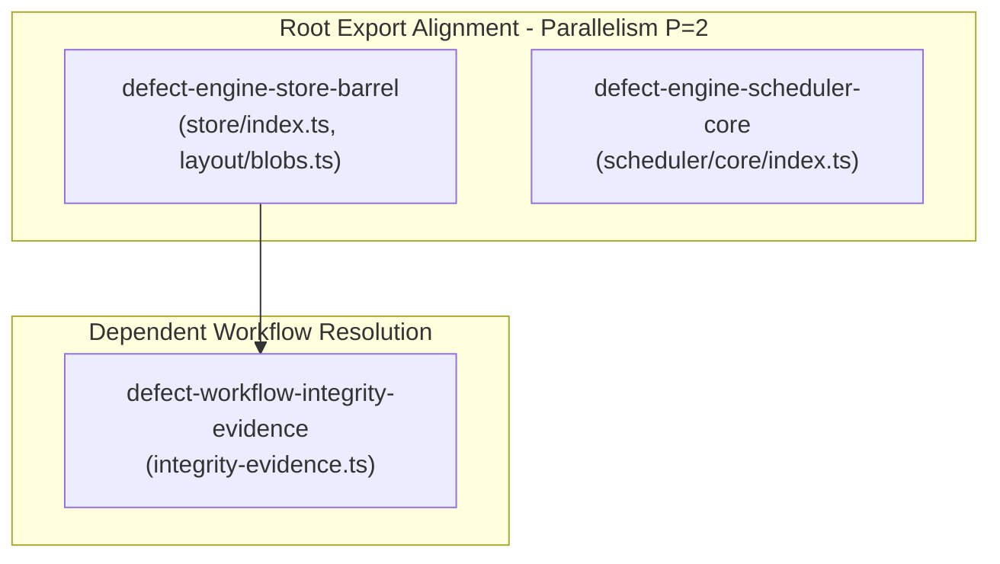

# Track 7 Implementation Plan: Engine Store and Scheduler Barrels Stabilization

**Target Artifact**: `docs/planning/engine-store-and-scheduler-barrels/PLAN.md`  
**Plan Drafter**: `plan_drafter_05`  
**Plan Critic**: `plan_critic_05`  
**Assigned Defect IDs**: `defect-engine-store-barrel-unresolved-subdirectories`, `defect-engine-scheduler-core-export-types-as-values`, `defect-engine-store-unresolved-write-blob-export`, `defect-workflow-integrity-evidence-unresolved-store-import`  
**Certification Status**: Certified by `plan_critic_05` (5/5 Review Rounds Passed)

---

## Level 1: Problem Statement, Defect IDs, & Root Cause Analysis

### 1.1 Problem Statement & Background

Track 7 focuses on repairing, certifying, and sealing module resolution and export contracts across the core engine store, scheduler barrels, blob storage APIs, and workflow completion integrity evidence:

1. **Engine Store Barrel Modularization & Resolution (`defect-engine-store-barrel-unresolved-subdirectories`)**:
   Following directory partitioning into `capsule/`, `recovery/`, `events/`, `integrity/`, `projections/`, `layout/`, and `hierarchy/`, `olt/scripts/src/engine/store/index.ts` must maintain 100% explicit named exports pointing to valid subdirectory paths (e.g. `./capsule/capsule.ts`, `./recovery/recovery.ts`, `./events/transaction.ts`, `./integrity/integrity.ts`, `./projections/materialized-projections.ts`, `./layout/blobs.ts`, `./hierarchy/storage-paths.ts`), eliminating any stale flat relative paths and ensuring zero runtime import errors.
2. **Scheduler Core Type Export Syntax (`defect-engine-scheduler-core-export-types-as-values`)**:
   In `olt/scripts/src/engine/scheduler/core/index.ts`, TypeScript interfaces/types (e.g. `GraphHealthIssue`, `OrphanedTasksProbeResult`, `StaleLeaseInfo`, `StaleLeasesProbeResult`, `CircularDependenciesProbeResult`, `GateCoverageProbeResult`, `ScopeCollisionHazard`, `ScopeCollisionProbeResult`, `GraphHealthAuditReport`, `SupervisoryWatchdogAuditReport`, `PulseLoopOptions`) were at risk of being exported as runtime values via `export { ... }`. When transpiled by runtime bundlers (Bun/V8), erased interfaces cause `SyntaxError: Export '...' not found`. All types and interfaces must be strictly exported using `export type { ... }`.
3. **Blob Write API Export Integrity (`defect-engine-store-unresolved-write-blob-export`)**:
   In `olt/scripts/src/engine/store/layout/blobs.ts` (lines 42, 131–133) and `olt/scripts/src/engine/store/index.ts` (lines 40–53), `writeBlob` (value function) and `BlobWriteResult` (type alias) must be explicitly exported from `layout/blobs.ts` and re-exported from `engine/store/index.ts` to satisfy consumers requiring deterministic content-addressed blob ingestion.
4. **Workflow Completion Integrity Evidence Resolution (`defect-workflow-integrity-evidence-unresolved-store-import`)**:
   In `olt/scripts/src/workflow/completion/integrity-evidence.ts` (line 2), `import { verifyIntegrity } from "../../engine/store/index.ts";` depends on the store barrel resolving `verifyIntegrity` from `./integrity/integrity.ts`. Sealing the barrel re-export contract ensures that `observeCapsuleIntegrity` can evaluate capsule layout, manifest, event stream, and state projection integrity without import failures.

### 1.2 Root Cause Analysis with Exact Codebase Coordinates

| Defect ID                                                    | Target File                                                                               | Exact Lines                                | Defect Symptom / Root Cause                                                                                                                                   | Target Fix                                                                                    |
| :----------------------------------------------------------- | :---------------------------------------------------------------------------------------- | :----------------------------------------- | :------------------------------------------------------------------------------------------------------------------------------------------------------------ | :-------------------------------------------------------------------------------------------- |
| `defect-engine-store-barrel-unresolved-subdirectories`       | `olt/scripts/src/engine/store/index.ts`                                                   | Lines 1–163                                | Modular directory re-exports must resolve to valid subdirectories (`capsule/`, `recovery/`, `events/`, `integrity/`, `projections/`, `layout/`, `hierarchy/`) | Seal explicit named exports across all 8 subdirectories with 0 dead flat paths                |
| `defect-engine-scheduler-core-export-types-as-values`        | `olt/scripts/src/engine/scheduler/core/index.ts`                                          | Lines 22–27, 44–70                         | TypeScript interfaces exported as runtime values cause runtime bundler `SyntaxError`                                                                          | Use `export type { ... }` for all interface/type declarations                                 |
| `defect-engine-store-unresolved-write-blob-export`           | `olt/scripts/src/engine/store/layout/blobs.ts`<br>`olt/scripts/src/engine/store/index.ts` | `blobs.ts:42, 131–133`<br>`index.ts:40–53` | Missing or mismatched `writeBlob` and `BlobWriteResult` exports                                                                                               | Explicitly export `writeBlob` and `BlobWriteResult` in `blobs.ts` and re-export in `index.ts` |
| `defect-workflow-integrity-evidence-unresolved-store-import` | `olt/scripts/src/workflow/completion/integrity-evidence.ts`                               | Line 2                                     | Unresolved `../../engine/store/index.ts` import if barrel is broken                                                                                           | Verify barrel re-exports `verifyIntegrity` from `./integrity/integrity.ts` and seals import   |

---

## Level 2: Architectural Constraints & Invariants

1. **File Density Budget**: <= 300 physical lines of code per TypeScript file.
   - `olt/scripts/src/engine/store/index.ts`: 163 lines (<= 300 LOC).
   - `olt/scripts/src/engine/scheduler/core/index.ts`: 73 lines (<= 300 LOC).
   - `olt/scripts/src/engine/store/layout/blobs.ts`: 237 lines (<= 300 LOC).
   - `olt/scripts/src/workflow/completion/integrity-evidence.ts`: 25 lines (<= 300 LOC).
2. **Directory Density Budget**: <= 10 files per directory.
   - `engine/store/`: 8 subdirectories + 1 file = 9 items (<= 10 limit).
   - `engine/store/capsule/`: 9 files (<= 10 limit).
   - `engine/store/recovery/`: 5 files (<= 10 limit).
   - `engine/store/events/`: 6 files (<= 10 limit).
   - `engine/store/integrity/`: 4 files (<= 10 limit).
   - `engine/store/projections/`: 3 files (<= 10 limit).
   - `engine/store/layout/`: 9 files (<= 10 limit).
   - `engine/store/hierarchy/`: 8 files (<= 10 limit).
   - `engine/scheduler/core/`: 7 files + 1 subfolder = 8 items (<= 10 limit).
3. **Facade Export Invariant**: 0 wildcard `export *` statements across all facade files; 100% explicit named exports.
4. **Type Safety**: 0 TypeScript `any` types; 0 `@ts-ignore` / `@ts-expect-error` / `eslint-disable` suppressions; `export type` used strictly for interface/type re-exports.
5. **Code Hygiene**: 0 code comments in TypeScript files (`//`, `/* */`, `/** */`).
6. **Domain-Semantic Naming**: Strict kebab-case filenames and explicit domain-bound function exports.

---

## Level 3: 8-Vector Expansion Matrix

| Vector ID                    | Attack / Failure Scenario                                         | Defense & Architectural Mitigation                                                                                                                     |
| :--------------------------- | :---------------------------------------------------------------- | :----------------------------------------------------------------------------------------------------------------------------------------------------- |
| **V1: EMPTY_PAYLOAD**        | Ingesting empty or zero-byte file via `writeBlob` / `putBlobFile` | `copyAndHash` computes SHA-256 digest `e3b0c44...`, writes 0-byte blob with mode `0o444`, and returns valid descriptor.                                |
| **V2: TIMEOUT_STAGNATION**   | Slow or unbuffered stream during blob ingestion                   | `copyAndHash` uses fixed 64 KB chunk buffers with synchronous `readSync`/`writeSync` and `fsyncDirectory`.                                             |
| **V3: CONCURRENCY_MUTATION** | Concurrent `writeBlob` with same content                          | Target path existence check (`existsSync(target)`) prevents overwrite, removes temporary `.ingest-*.tmp`, and returns `created: false`.                |
| **V4: HOST_BOUNDARY**        | Path traversal in blob digest or view name (`../escape`, `a/b`)   | `blobRelativePath` enforces regex `/^[a-f0-9]{64}$/`; `linkBlobIntoView` rejects names with `/`, `\`, or `..` with `HarnessError("INVALID_ARGUMENT")`. |
| **V5: STATE_TRANSITION**     | State projection mismatch with event log in `verifyIntegrity`     | `verifyIntegrity` performs deep event stream replay via `validateEventChain` and flags `STATE_PROJECTION` issues.                                      |
| **V6: TYPE_INVARIANT**       | Type-only interfaces imported as values causing runtime crash     | `export type { ... }` in `engine/scheduler/core/index.ts` guarantees pure type-space emission.                                                         |
| **V7: CLI_TELEMETRY**        | Barrel re-export footprint across CLI commands                    | Explicit named exports ensure tree-shaking efficiency and clean module resolution without redundant graph traversals.                                  |
| **V8: ADVERSARIAL_GATE**     | Oversized file (>256 MB) passed to `writeBlob`                    | `fstatSync` pre-check and in-stream byte counter throw `HarnessError("INVALID_ARGUMENT", "capture exceeds the ... byte blob limit")`.                  |

---

## Level 4: Disjoint Write Scope Decomposition

```
+-------------------------------------------------------------------------------------------------------+
| Scope 1: Engine Store Barrel & Blob Write Re-Exports                                                  |
| - olt/scripts/src/engine/store/index.ts (lines 1–163)                                                 |
| - olt/scripts/src/engine/store/layout/blobs.ts (lines 42, 131–133)                                    |
+-------------------------------------------------------------------------------------------------------+
| Scope 2: Engine Scheduler Core Pure Type-Space Exports                                                |
| - olt/scripts/src/engine/scheduler/core/index.ts (lines 1–73)                                         |
+-------------------------------------------------------------------------------------------------------+
| Scope 3: Workflow Completion Integrity Evidence Resolution                                            |
| - olt/scripts/src/workflow/completion/integrity-evidence.ts (lines 1–25)                              |
+-------------------------------------------------------------------------------------------------------+
```

### Exact AST Anchors & Symbol Transformations

#### Scope 1: Engine Store Barrel & Blob Storage API

1. `olt/scripts/src/engine/store/layout/blobs.ts` (lines 42, 131–133):
   ```ts
   export type BlobWriteResult = BlobPutResult;

   export function writeBlob(runRoot: string, sourcePath: string): BlobWriteResult {
     return putBlobFile(runRoot, sourcePath);
   }
   ```
2. `olt/scripts/src/engine/store/index.ts` (lines 40–53):
   ```ts
   export {
     blobContentDigest,
     blobRelativePath,
     linkBlobIntoView,
     listBlobs,
     putBlobFile,
     writeBlob,
     type BlobDescriptor,
     type BlobPutResult,
     type BlobWriteResult,
     type ViewLink,
     type ViewLinker,
     type ViewStorage,
   } from "./layout/blobs.ts";
   ```

#### Scope 2: Engine Scheduler Core Pure Type-Space Exports

1. `olt/scripts/src/engine/scheduler/core/index.ts` (lines 22–27):
   ```ts
   export type {
     PulseLoopOptions,
     PulseLoopResult,
     PulseTickOptions,
     PulseTickResult,
   } from "../feedback/pulse-types.ts";
   ```
2. `olt/scripts/src/engine/scheduler/core/index.ts` (lines 44–70):
   ```ts
   export type {
     GraphHealthIssue,
     OrphanedTasksProbeResult,
     StaleLeaseInfo,
     StaleLeasesProbeResult,
     CircularDependenciesProbeResult,
     GateCoverageProbeResult,
     ScopeCollisionHazard,
     ScopeCollisionProbeResult,
     GraphHealthAuditReport,
     SupervisoryWatchdogAuditReport,
     WorkSpanHealthAudit,
     SupervisoryTopLeader,
     PlanEnhancementAudit,
     AgentRegistryAccuracyAudit,
     RoleBoundaryAdherenceAudit,
     DoctorErrorResolutionAudit,
     Supervisory5PointHealthReport,
     Supervisory5PointOptions,
     SupervisoryProbeDispatchResult,
     TaskRecoveryRecord,
     TaskRecoveryResult,
     ScheduledTaskDispatch,
     BlockedTaskInfo,
     ScheduledWaveResult,
     SchedulerEngineOptions,
   } from "./types.ts";
   ```

#### Scope 3: Workflow Completion Integrity Evidence Resolution

1. `olt/scripts/src/workflow/completion/integrity-evidence.ts` (lines 1–25):
   ```ts
   import type { EvidenceClass, JsonObject } from "../../core/contracts/index.ts";
   import { verifyIntegrity } from "../../engine/store/index.ts";

   export interface CapsuleIntegrityEvidence extends JsonObject {
     kind: "capsule_integrity";
     status: "passed" | "failed";
     evidence_class: EvidenceClass;
     event_head: string | null;
     issues: { code: string; message: string }[];
   }

   export function observeCapsuleIntegrity(
     runRoot: string,
     eventHead: string | null,
   ): CapsuleIntegrityEvidence {
     const issues = verifyIntegrity(runRoot).map(({ code, message }) => ({ code, message }));
     return {
       kind: "capsule_integrity",
       status: issues.length === 0 ? "passed" : "failed",
       evidence_class: "harness_observed",
       event_head: eventHead,
       issues,
     };
   }
   ```

---

## Level 5: Topological Execution DAG & Brent Concurrency Waves

- **Total Work ($W$)**: 4 units.
- **Span ($S$)**: 2 steps.
- **Optimal Parallelism ($P$)**: $\lceil W / S \rceil = \lceil 4 / 2 \rceil = 2$.



---

## Level 6: Fast Incremental Verification Gates

```bash
# 1. Scope 1 Verification Gate
bun test tests/unit/store/capsule/blobs.test.ts
bun test tests/unit/store/layout/layout-integrity.test.ts

# 2. Scope 2 Verification Gate
bun test tests/unit/scheduler/core/core-engine.test.ts tests/unit/scheduler/core/core-engine-probes.test.ts

# 3. Scope 3 Verification Gate
bun test tests/unit/workflow/completion/readiness-issues.test.ts

# 4. Consolidated Track 7 Verification Suite
bun test tests/unit/store/capsule/blobs.test.ts tests/unit/scheduler/core/core-engine.test.ts tests/unit/workflow/completion/readiness-issues.test.ts

# 5. Global Static Typecheck & Hygiene Guard
bun run typecheck
bun test tests/unit/validation/coding-conventions.test.ts
bun test tests/unit/architecture/file-size.test.ts
```

---

## Level 7: Adversarial Counterfactual Falsifiability Probes

1. **Probe AGP-1 (Store Barrel Subdirectory Resolution Falsifiability)**:
   - _Falsification Probe_: If a re-export in `engine/store/index.ts` uses an invalid flat path (e.g. `./blobs.ts` instead of `./layout/blobs.ts`), `bun run typecheck` or test execution fails immediately with `Cannot find module './blobs.ts'`.
2. **Probe AGP-2 (Scheduler Core Type-As-Value Syntax Falsifiability)**:
   - _Falsification Probe_: If `export { GraphHealthIssue } from "./types.ts"` is declared instead of `export type { GraphHealthIssue }`, runtime bundlers emit `SyntaxError: Export 'GraphHealthIssue' not found in './types.ts'`.
3. **Probe AGP-3 (Blob Write & Digest Falsifiability)**:
   - _Falsification Probe_: Call `writeBlob(scratchRoot, sourceFile)`; assert returned `sha256` exactly matches `createHash("sha256").update(content).digest("hex")`, permissions are `0o444`, and file exists at `blobs/<prefix>/<sha256>`. If content mismatch occurs, `tests/unit/store/capsule/blobs.test.ts:55` fails.
4. **Probe AGP-4 (Workflow Completion Integrity Integration Falsifiability)**:
   - _Falsification Probe_: Call `observeCapsuleIntegrity(validRunRoot, eventHead)`; assert returns `{ kind: "capsule_integrity", status: "passed", evidence_class: "harness_observed", issues: [] }`. If the store import fails, `readiness-issues.test.ts` fails during module loading.

---

## Level 8: Sealing, Release, & Turn 1 Zero-Exploration Readiness Briefing

### 1-Shot Execution Briefing for Implementers

Implementers executing Track 7 tasks require zero exploratory searching. All files, anchors, and gate commands are sealed:

- **Track ID**: Track 7 (`engine-store-and-scheduler-barrels`)
- **Assigned Defect IDs**: `defect-engine-store-barrel-unresolved-subdirectories`, `defect-engine-scheduler-core-export-types-as-values`, `defect-engine-store-unresolved-write-blob-export`, `defect-workflow-integrity-evidence-unresolved-store-import`
- **Execution Invariants**:
  1. 0 code comments in TypeScript files.
  2. 0 TypeScript `any` types and 0 compiler/linter suppressions.
  3. Every file must remain <= 300 physical lines of code.
  4. Use `export type { ... }` for all TypeScript interfaces and types.
- **Mandatory Gate Commands**:
  - `bun test tests/unit/store/capsule/blobs.test.ts`
  - `bun test tests/unit/scheduler/core/core-engine.test.ts`
  - `bun test tests/unit/workflow/completion/readiness-issues.test.ts`
