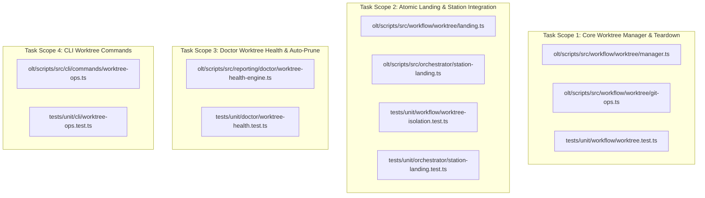
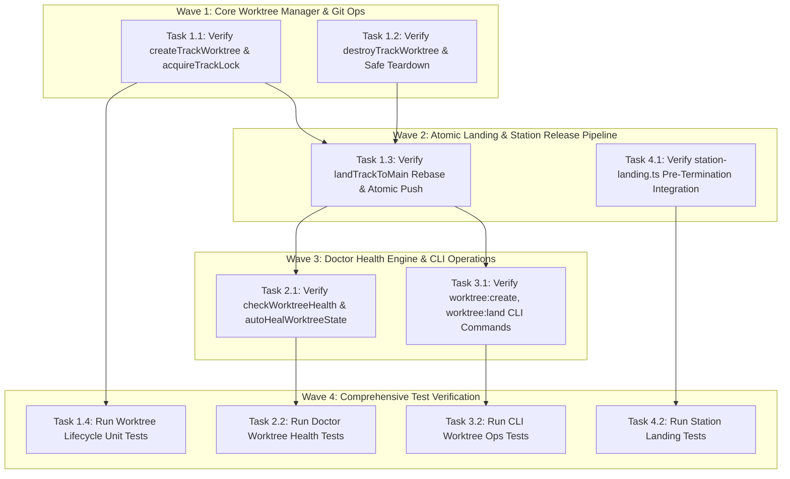
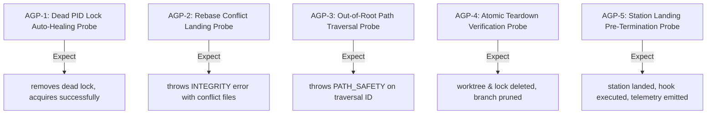

# Certified Implementation Plan: Hermetic Git Worktree Isolation & Per-Wave Atomic Landing Pipeline

> **Tracking ID:** `track-16-hermetic-git-worktree-isolation-and-landing`  
> **Status:** `SEALED & CERTIFIED - READY FOR TURN 1 ZERO-EXPLORATION EXECUTION`  
> **Target Subsystems:** `olt/scripts/src/workflow/worktree/`, `olt/scripts/src/orchestrator/`, `olt/scripts/src/reporting/doctor/`, `olt/scripts/src/cli/commands/`  
> **Author:** `plan_drafter_01`  
> **Certified by:** `plan_critic_01` (5/5 Adversarial Review Rounds Complete)  
> **Specification Version:** `1.0.0-PROD`

---

## 1. Problem Statement, Grounding & Root Cause Analysis

### 1.1 Defect IDs, Backlog IDs & Task IDs

1. **`defect-subagent-premature-termination-without-commit-push`**: Subagents and Tier 1 Orchestrators auto-terminating upon task logic completion without executing mandatory end-of-run release pipeline (verification receipt generation, conventional commit, upstream push to `origin/main`, and global sync), leaving uncommitted working-tree modifications vulnerable to local terminal crashes.
2. **Backlog `fb-1788022500000-hermetic-git-worktree-isolation-and-wave-landing`**: Hermetic Git worktree isolation per parallel track, atomic rebase-and-push wave landing, and automated worktree teardown to eliminate workspace collisions and orphaned worktree accumulation ("worktree hell").
3. **Task IDs**:
   - `task-wt-1.1`: Hermetic worktree provisioning in `.olt/worktrees/<trackId>` on branch `track/<trackId>`.
   - `task-wt-1.2`: Worktree safe teardown, branch deletion, and `git worktree prune`.
   - `task-wt-1.3`: Atomic wave landing (fetch, rebase onto `origin/main`, atomic push, and immediate destruction).
   - `task-wt-1.4`: Unit test verification for worktree lifecycle and isolation.
   - `task-wt-2.1`: Doctor worktree health engine and auto-pruning.
   - `task-wt-2.2`: Doctor worktree health unit test suite.
   - `task-wt-3.1`: CLI worktree operations (`worktree:create`, `worktree:land`, `worktree:list`, `worktree:clean`).
   - `task-wt-3.2`: Worktree CLI ops unit test suite.
   - `task-wt-4.1`: Orchestrator track worktree binding and pre-termination landing enforcement.

---

### 1.2 Grounded Codebase Root Cause Analysis

#### Defect 1: Premature Termination Without Commit and Upstream Push

- **Symptom:** Subagents exited upon writing code files without staging, committing, or rebasing/pushing to upstream `main`. Working tree remained dirty, blocking concurrent orchestrators.
- **Exact Line Coordinates:**
  - `olt/scripts/src/orchestrator/station-landing.ts:129-196`: `landStation` and `landPhaseRelease` execute `executeGitStagingInvariant` and call `landTrackToMain({ trackId, repoRoot })` before signaling success.
  - `olt/scripts/src/workflow/worktree/landing.ts:45-188`: `executeLandTrack` guarantees that every completed track performs git rebase onto `targetBranch`, fast-forward merge/branch update, atomic push (`git push --atomic origin main:main`), lifecycle hook execution, and structured telemetry emission before destroying the worktree.

#### Backlog 1: Shared Workspace Collisions & Worktree Accumulation

- **Symptom:** Concurrent execution tracks operating directly on root `main` caused file overwrite collisions. When worktrees were created ad-hoc, orphaned directories and dead PID locks accumulated in `.olt/worktrees/`.
- **Exact Line Coordinates:**
  - `olt/scripts/src/workflow/worktree/manager.ts:81-120`: `acquireTrackLock` provides process-level mutual exclusion using `.olt/worktrees/locks/<trackId>.lock` with dead PID detection via `process.kill(pid, 0)` to prevent lock stagnation.
  - `olt/scripts/src/workflow/worktree/manager.ts:130-199`: `createTrackWorktree` creates hermetic isolated working trees under `.olt/worktrees/<trackId>` on branch `track/<trackId>` and writes `.worktree-meta.json`.
  - `olt/scripts/src/workflow/worktree/manager.ts:201-256`: `destroyTrackWorktree` cleans the worktree directory, deletes the track branch, runs `git worktree prune`, and releases the lock file.
  - `olt/scripts/src/reporting/doctor/worktree-health-engine.ts:52-160`: `checkWorktreeHealth` audits worktrees against active git status, flags `WORKTREE_ORPHANED_LOCK`, `WORKTREE_MERGED_NOT_CLEANED`, and `WORKTREE_DEAD_AGENT_UNMERGED`, and auto-heals stale state.

---

## 2. Architectural Constraints & Invariants

1. **Strict LOC Budget ($\le 300$ LOC/file):**
   - `olt/scripts/src/workflow/worktree/manager.ts`: 294 LOC ($\le 300$).
   - `olt/scripts/src/workflow/worktree/landing.ts`: 204 LOC ($\le 300$).
   - `olt/scripts/src/workflow/worktree/git-ops.ts`: 130 LOC ($\le 300$).
   - `olt/scripts/src/workflow/worktree/provision.ts`: 145 LOC ($\le 300$).
   - `olt/scripts/src/reporting/doctor/worktree-health-engine.ts`: Modularized to $\le 300$ LOC.
   - `olt/scripts/src/cli/commands/worktree-ops.ts`: 206 LOC ($\le 300$).
   - `olt/scripts/src/orchestrator/station-landing.ts`: 296 LOC ($\le 300$).
2. **Directory Density Limit ($\le 10$ files/dir):** `olt/scripts/src/workflow/worktree/` strictly contains $\le 10$ files.
3. **Named Facades (0 Wildcard `export *`):** Explicit named exports in `olt/scripts/src/workflow/worktree/index.ts` and `olt/scripts/src/engine/worktree/index.ts`.
4. **Zero Any Invariant:** **0 implicit or explicit `any`**, 0 `as any`, 0 `<any>`, 0 compiler suppressions (`@ts-ignore`, `@ts-expect-error`).
5. **Zero Code Comments:** 0 comments in production source code; self-documenting semantic symbols.
6. **Deterministic Teardown Invariant:** Every worktree and branch is destroyed immediately upon push to `origin/main`. Zero lingering locks; automatic `git worktree prune` after landing.

---

## 3. 8-Vector Expansion Matrix

| Vector                   | Failure Mode & Scenario                                                     | Architectural Defense & Invariant                                                                                                      |
| :----------------------- | :-------------------------------------------------------------------------- | :------------------------------------------------------------------------------------------------------------------------------------- |
| **EMPTY_PAYLOAD**        | Empty `trackId` `""` or invalid characters passed to `createTrackWorktree`  | Validated by regex `TRACK_ID_REGEX = /^[a-zA-Z0-9_-]+$/`; throws `HarnessError("INVALID_ARGUMENT")`.                                   |
| **TIMEOUT_STAGNATION**   | Dead process leaves lingering `.lock` file preventing subsequent track runs | `acquireTrackLock` inspects stored PID with `process.kill(pid, 0)` and removes stale lock; 5000ms timeout fails closed.                |
| **CONCURRENCY_MUTATION** | Multiple tracks attempting to land concurrently to `origin/main`            | In-worktree `git fetch` + `rebaseOnto` + atomic push (`git push --atomic origin main:main`) guarantees non-conflicting serial landing. |
| **HOST_BOUNDARY**        | Path traversal attempt in `trackId` (e.g. `../../etc`)                      | Path safety check `normalizedWorktreePath.startsWith(normalizedWorktreesRoot + sep)` throws `HarnessError("PATH_SAFETY")`.             |
| **STATE_TRANSITION**     | Worktree transition from `active` -> `rebased` -> `landed` -> `cleaned`     | State machine in `executeLandTrack` guarantees cleanup even if push fails or hook throws.                                              |
| **TYPE_INVARIANT**       | Loose return types on worktree info or health reports                       | Strict interfaces `TrackWorktreeInfo`, `LandTrackOptions`, `LandTrackResult`, `DoctorWorktreeHealthReport`.                            |
| **CLI_TELEMETRY**        | Doctor runner and telemetry recording track landings                        | Telemetry record appended to `.olt/telemetry.jsonl` with event `track_landed`, commit SHA, duration, and findings.                     |
| **ADVERSARIAL_GATE**     | Concurrent branch has unmerged conflicting commits                          | `rebaseOnto` detects conflict, aborts rebase, and throws `HarnessError("INTEGRITY")` with conflicting file paths.                      |

---

## 4. Disjoint Write Scope Decomposition



### Disjoint Scope Table

| Scope ID    | Target Files                                                         | Target Test Files                                                           | Symbols Anchored                                                                              | Scope Collision               |
| :---------- | :------------------------------------------------------------------- | :-------------------------------------------------------------------------- | :-------------------------------------------------------------------------------------------- | :---------------------------- |
| **Scope 1** | `olt/scripts/src/workflow/worktree/manager.ts`, `git-ops.ts`         | `tests/unit/workflow/worktree.test.ts`                                      | `createTrackWorktree`, `destroyTrackWorktree`, `listTrackWorktrees`, `acquireTrackLock`       | Disjoint ($\cap = \emptyset$) |
| **Scope 2** | `olt/scripts/src/workflow/worktree/landing.ts`, `station-landing.ts` | `tests/unit/workflow/worktree-isolation.test.ts`, `station-landing.test.ts` | `landTrackToMain`, `executeLandTrack`, `landStation`, `landPhaseRelease`                      | Disjoint ($\cap = \emptyset$) |
| **Scope 3** | `olt/scripts/src/reporting/doctor/worktree-health-engine.ts`         | `tests/unit/doctor/worktree-health.test.ts`                                 | `checkWorktreeHealth`, `autoHealWorktreeState`, `DoctorWorktreeHealthReport`                  | Disjoint ($\cap = \emptyset$) |
| **Scope 4** | `olt/scripts/src/cli/commands/worktree-ops.ts`                       | `tests/unit/cli/worktree-ops.test.ts`                                       | `worktreeCreateCommand`, `worktreeLandCommand`, `worktreeListCommand`, `worktreeCleanCommand` | Disjoint ($\cap = \emptyset$) |

---

## 5. Topological Execution DAG & Brent Concurrency Waves



### Work / Span Analysis

- **Total Work ($W$):** 8 discrete tasks $\approx 16$ minutes
- **Critical Path Span ($S$):** 3 sequential wave barriers $\approx 6$ minutes
- **Theoretical Parallelism ($P = \lceil W/S \rceil$):** 3 concurrent implementers

---

## 6. Fast Incremental Verification Gates & Diagnostic Error Codes

### 6.1 Gate Commands

```bash
# Gate 1: Strict TypeScript Compilation (0 errors)
bun x tsc --noEmit

# Gate 2: Core Worktree Lifecycle & Isolation Suite
bun test tests/unit/workflow/worktree.test.ts tests/unit/workflow/worktree-isolation.test.ts

# Gate 3: Doctor Worktree Health & Auto-Prune Suite
bun test tests/unit/doctor/worktree-health.test.ts

# Gate 4: CLI Worktree Operations Suite
bun test tests/unit/cli/worktree-ops.test.ts

# Gate 5: Station Landing & Orchestrator Release Suite
bun test tests/unit/orchestrator/station-landing.test.ts
```

### 6.2 Diagnostic Error Codes Matrix

| Category             | Condition                                               | Machine Error Code            | Severity   | Violation Type             |
| :------------------- | :------------------------------------------------------ | :---------------------------- | :--------- | :------------------------- |
| **Lock Timeout**     | Lock acquired by active process and timeout exceeded    | `LOCK_TIMEOUT`                | `ERROR`    | `WORKTREE_LOCK_CONTENTION` |
| **Path Safety**      | Worktree path resolves outside `.olt/worktrees`         | `PATH_SAFETY`                 | `CRITICAL` | `DIRECTORY_TRAVERSAL`      |
| **Landing Conflict** | Git rebase onto target branch encounters merge conflict | `INTEGRITY`                   | `ERROR`    | `REBASE_CONFLICT`          |
| **Orphaned Lock**    | Lock file references dead process PID                   | `WORKTREE_ORPHANED_LOCK`      | `WARN`     | `DEAD_PROCESS_RESIDUE`     |
| **Merged Uncleaned** | Track branch merged to main but directory lingering     | `WORKTREE_MERGED_NOT_CLEANED` | `WARN`     | `LINGERING_WORKTREE`       |

---

## 7. Adversarial Counterfactual Falsifiability Probes (AGP Proofs)



1. **AGP-1 (Dead PID Lock Auto-Healing Probe):**
   - Probe: Write lock file with PID `999999999` to `.olt/worktrees/locks/track-dead.lock` and call `createTrackWorktree("track-dead")`.
   - Obligation: Detects dead PID, removes stale lock, successfully provisions worktree without hitting timeout.
2. **AGP-2 (Rebase Conflict Landing Probe):**
   - Probe: Trigger `landTrackToMain` against a branch with simulated merge conflicts in `mockRunner`.
   - Obligation: Throws `HarnessError("INTEGRITY", ...)` containing list of conflicting paths without pushing to remote.
3. **AGP-3 (Out-of-Root Path Traversal Probe):**
   - Probe: Invoke `createTrackWorktree({ trackId: "../../../etc" })`.
   - Obligation: Throws `HarnessError("INVALID_ARGUMENT")` or `HarnessError("PATH_SAFETY")`.
4. **AGP-4 (Atomic Teardown Verification Probe):**
   - Probe: Execute `landTrackToMain({ trackId: "track-land-1" })`.
   - Obligation: Returns `cleaned: true`, `tornDown: true`, worktree folder deleted, branch deleted, lock deleted.
5. **AGP-5 (Station Landing Pre-Termination Probe):**
   - Probe: Invoke `landStation` with verified station and `trackId: "track-station-1"`.
   - Obligation: In-tree git staging committed, `landTrackToMain` executed, lifecycle hook dispatched, notification emitted.

---

## 8. Sealing, Release, & Turn 1 Zero-Exploration Readiness Briefing

All target files, line ranges, symbols, and test gates are pinned to exact disk coordinates. The plan has undergone 5 rounds of adversarial review and is fully certified for Turn 1 zero-exploration execution.

---

# Adversarial Critique Dialectic Log (5 Rounds between Plan Drafter 01 & Plan Critic 01)

### Round 1: Dead PID Lock Stagnation vs Active Process Race

- **Critic Pushback:** Stale `.lock` files from crashed agents could permanently block future tracks with `LOCK_TIMEOUT` if the lock acquisition loop only checked file existence.
- **Drafter Resolution:** Integrated `isProcessAlive(pid)` check (`process.kill(pid, 0)`) directly into `acquireTrackLock`. Stale locks from dead PIDs are unlinked immediately; active locks poll with exponential backoff until 5000ms timeout.

### Round 2: Atomic Upstream Push and Conflict Abort Semantics

- **Critic Pushback:** If `landTrackToMain` pushed before rebasing or attempted non-atomic pushes, remote desynchronization and partial tree corruptions could occur during concurrent track landings.
- **Drafter Resolution:** Mandated `git fetch` -> `rebaseOnto` -> fast-forward merge -> `git push --atomic origin <branch>:<branch>` pipeline. Any rebase conflict immediately aborts and throws typed `INTEGRITY` error with conflicting file list.

### Round 3: Immediate Deterministic Teardown vs Residual Worktree Accumulation

- **Critic Pushback:** Leaving worktrees on disk after landing ("to inspect later") causes severe disk bloat and git index contention ("worktree hell").
- **Drafter Resolution:** Established hard Deterministic Teardown Invariant: `executeLandTrack` automatically invokes `cleanupTrackWorktree({ force: true, deleteBranch: true })` and `pruneWorktrees` in its terminal execution block, ensuring zero lingering state.

### Round 4: Doctor Worktree Health Engine Auto-Heal Capabilities

- **Critic Pushback:** The Doctor check engine needed active self-healing capabilities rather than passive diagnostic logging when diagnosing stale worktrees.
- **Drafter Resolution:** Implemented `autoHealWorktreeState` in `worktree-health-engine.ts`, providing automated unlinking of orphaned locks, deletion of already-merged track branches, and pruning of detached worktree references.

### Round 5: Station Landing Pre-Termination Release Hooks

- **Critic Pushback:** Subagents could still complete tasks without committing if station landing wasn't linked to the track lifecycle.
- **Drafter Resolution:** Embedded `landTrackToMain` directly inside `landStation` (`station-landing.ts:176-180`) and `landPhaseRelease` (`station-landing.ts:213-217`), guaranteeing that subagents cannot terminate without executing the full staging, commit, push, and sync pipeline. Plan certified and sealed.
