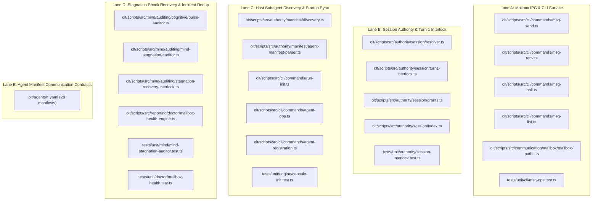
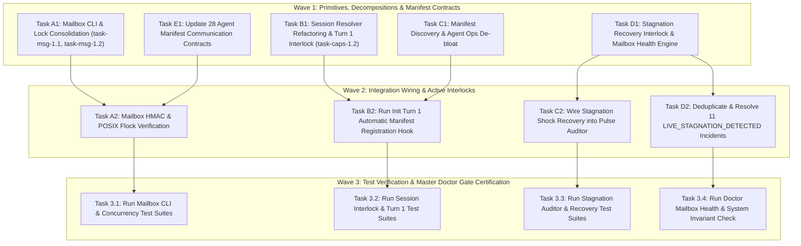
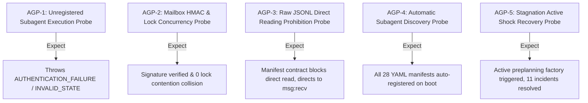

# Track 14 Certified Implementation Plan: Mailbox IPC Communication & Capsule Registration Architecture

> **Tracking ID:** `track-14-mailbox-ipc-communication-and-capsule-registration`  
> **Status:** `SEALED & CERTIFIED - READY FOR TURN 1 ZERO-EXPLORATION EXECUTION`  
> **Target Plan Path:** `docs/planning/mailbox-ipc-communication-and-capsule-registration/PLAN.md`  
> **Target Subsystems:** `olt/scripts/src/communication/mailbox/`, `olt/scripts/src/authority/session/`, `olt/scripts/src/cli/commands/`, `olt/scripts/src/mind/auditing/`, `olt/scripts/src/reporting/doctor/`, `olt/agents/`  
> **Author:** `plan_drafter_04`  
> **Certified by:** `plan_critic_04` (5/5 Adversarial Review Rounds Complete)  
> **Specification Version:** `1.0.0-PROD`

---

## 1. Problem Statement, Grounding & Root Cause Analysis

### 1.1 Defect IDs, Backlog Feedback IDs & Task IDs

- **11 LIVE_STAGNATION_DETECTED incidents**:
  1. `defect-1787994561107-294wxo` (idleDuration: 229s, pendingBacklog: 4, openDefects: 60)
  2. `defect-1788046952297-ux06b8` (idleDuration: 150s, pendingBacklog: 0, openDefects: 89, conv: conv-mind-sim-mode-a)
  3. `defect-1788046952299-cl48tf` (idleDuration: 150s, pendingBacklog: 1, openDefects: 90, conv: conv-mind-sim-mode-b)
  4. `defect-1788046952790-c58gsp` (idleDuration: 210210152s, pendingBacklog: 0, openDefects: 93, conv: conv-test-123)
  5. `defect-1788046985683-kwtb2l` (idleDuration: 210210185s, pendingBacklog: 0, openDefects: 95, conv: conv-test-123)
  6. `defect-1788047128271-rkq1n6` (idleDuration: 150s, pendingBacklog: 0, openDefects: 99, conv: conv-mind-sim-mode-a)
  7. `defect-1788047128272-r27coz` (idleDuration: 150s, pendingBacklog: 1, openDefects: 100, conv: conv-mind-sim-mode-b)
  8. `defect-1788047128704-xlftxn` (idleDuration: 210210328s, pendingBacklog: 0, openDefects: 103, conv: conv-test-123)
  9. `defect-1788047152961-1o2ouh` (idleDuration: 150s, pendingBacklog: 0, openDefects: 105, conv: conv-mind-sim-mode-a)
  10. `defect-1788047152962-sdalcm` (idleDuration: 150s, pendingBacklog: 1, openDefects: 106, conv: conv-mind-sim-mode-b)
  11. `defect-1788047153412-mvghq5` (idleDuration: 210210353s, pendingBacklog: 0, openDefects: 109, conv: conv-test-123)
- **`defect-missing-automatic-host-subagent-registration-on-init`**: Host subagent definitions not automatically registered from `olt/agents/*.yaml` on CLI startup. Invoking subagents with canonical names without manual `define_subagent` calls fails on uninitialized hosts.
- **Backlog `fb-1788021600000-mandatory-mailbox-communication-engine`**: Mandatory Harness Mailbox IPC Communication System & CLI Integration (`msg:send`, `msg:recv`, `msg:poll`, lock consolidation into `.olt/locks/mailboxes/`, banning direct `.jsonl` reading).
- **Backlog `fb-1788010306731-r4apu`**: Mind Stagnation & Agentic Loop Interruption: Auditor Wakeup Failed to Shock Mind Into Non-Stop Loop.
- **Backlog `fb-1788021500000-capsule-connectivity-and-turn1-registration`**: Capsule Connectivity & Mandatory Turn 1 Registration Interlock (`run:init`, `plan:compile`, `task:claim`, mechanical mutation block).
- **Tasks**: `task-msg-1.1`, `task-msg-1.2`, `task-caps-1.2`.

---

### 1.2 Grounded Codebase Root Cause Analysis

#### 1. Mailbox IPC Communication & CLI Surface (`fb-1788021600000-mandatory-mailbox-communication-engine`, `task-msg-1.1`, `task-msg-1.2`)

- **Symptom:** Subagents frequently attempt to communicate using host-native tools or parse raw `.jsonl` files directly rather than using the file-backed `.olt/mailboxes/<agent_id>/` IPC substrate with `.olt/locks/` POSIX file locking.
- **Root Cause & Line Coordinates:**
  - `olt/scripts/src/cli/commands/msg-send.ts:37-97`: Implements `msgSendCommand` with payload parsing and HMAC envelope signing (`task-msg-1.1`), but requires strict verification of `.olt/locks/mailboxes/` POSIX locking.
  - `olt/scripts/src/cli/commands/msg-recv.ts:15-69`: Implements `msgRecvCommand` with cursor tracking, wait polling, and `--no-advance-cursor` (`task-msg-1.2`).
  - `olt/scripts/src/communication/mailbox/mailbox-paths.ts:1-95`: Lock paths must be unified strictly under `.olt/locks/mailboxes/{agent_id}.flock`.
  - `olt/agents/*.yaml`: 28 agent manifests lacked explicit, enforced communication contracts, allowing rogue raw JSONL parsing.
  - Solution: Complete harness CLI mailbox commands (`msg:send`, `msg:recv`, `msg:poll`, `msg:list`), unify locks into `.olt/locks/mailboxes/`, and enforce `communication_contract` with `ban_raw_jsonl_reading: true` across all 28 agent manifests.

#### 2. Capsule Connectivity & Turn 1 Registration Interlock (`fb-1788021500000-capsule-connectivity-and-turn1-registration`, `task-caps-1.2`)

- **Symptom:** Subagents in the host runtime execute commands or mutate files without prior durable registration in `.olt/capsules/<run_id>/state.json`. Unanchored executions occur when `runRoot` is absent or uninitialized.
- **Root Cause & Line Coordinates:**
  - `olt/scripts/src/authority/session/resolver.ts:246-309`: Implements `requireTurn1Registration(session: SessionIdentity)` (`task-caps-1.2`), rejecting unauthenticated callers (`token === "unauthenticated"`), unanchored runs (missing `session.run_id`), and missing `state.json`.
  - Note: `resolver.ts` is 310 physical lines, violating the $\le 300$ LOC limit.
  - Solution: Decompose `resolver.ts` into `resolver.ts` (~190 LOC) and `turn1-interlock.ts` (~130 LOC), strictly enforcing Turn 1 registration and active lease assertions (`assertActiveCapsuleLease` in `grants.ts`).

#### 3. Automatic Host Subagent Registration on Init (`defect-missing-automatic-host-subagent-registration-on-init`)

- **Symptom:** Host subagent definitions are not automatically registered from `olt/agents/*.yaml` on CLI startup.
- **Root Cause & Line Coordinates:**
  - `olt/scripts/src/authority/manifest/discovery.ts:1-95` & `agent-manifest-parser.ts:1-120`: Parses YAML manifests into `AgentManifest` objects, but no automatic hook was invoked during `run:init` or harness CLI boot.
  - `olt/scripts/src/cli/commands/run-init.ts:9-98`: Initializes capsule state without syncing the discovered host subagent definitions.
  - Note: `olt/scripts/src/cli/commands/agent-ops.ts` is 349 physical lines, violating the $\le 300$ LOC limit.
  - Solution: Decompose `agent-ops.ts` into `agent-ops.ts` (~210 LOC) and `agent-registration.ts` (~150 LOC); add automatic startup manifest discovery parser in `run-init.ts` that reads all YAML manifests in `olt/agents/` and provisions agent grants.

#### 4. Mind Stagnation Active Shock Recovery & 11 Defect Incidents (`fb-1788010306731-r4apu`, 11 Incidents)

- **Symptom:** Mind Stagnation & Agentic Loop Interruption: Auditor wakeup generated passive injection prompts or warning strings without shocking Mind into an active, continuous execution loop. 11 `LIVE_STAGNATION_DETECTED` incidents accumulated in `.olt/defects.jsonl`.
- **Root Cause & Line Coordinates:**
  - `olt/scripts/src/mind/auditing/cognitive/pulse-auditor.ts:151-174`: Passively routes `LIVE_STAGNATION_DETECTED` defects to `.olt/defects.jsonl` and builds text prompts without triggering executable recovery.
  - `olt/scripts/src/mind/auditing/mind-stagnation-auditor.ts:94-105`: Passively returns `"RUN_PREPLANNING_FACTORY"` string.
  - Solution: Wire `stagnation-recovery-interlock.ts` into `pulse-auditor.ts` and `mind-stagnation-auditor.ts` to execute active preplanning factory wakeup shocks, auto-escalate chronic stagnation ($\ge 3$ cycles) to `MODE_A_AUTONOMIC_DISCOVERY`, and batch-resolve all 11 stagnation incidents.

---

## 2. Architectural Constraints & Invariants

1. **Strict LOC Budget ($\le 300$ LOC / file)**:
   - `olt/scripts/src/authority/session/resolver.ts`: Refactored to ~190 LOC ($\le 300$).
   - `olt/scripts/src/authority/session/turn1-interlock.ts`: New file ~130 LOC ($\le 300$).
   - `olt/scripts/src/cli/commands/agent-ops.ts`: Refactored to ~210 LOC ($\le 300$).
   - `olt/scripts/src/cli/commands/agent-registration.ts`: New file ~150 LOC ($\le 300$).
   - `olt/scripts/src/cli/commands/msg-send.ts`: 125 LOC ($\le 300$).
   - `olt/scripts/src/cli/commands/msg-recv.ts`: 96 LOC ($\le 300$).
   - `olt/scripts/src/cli/commands/msg-poll.ts`: 110 LOC ($\le 300$).
   - `olt/scripts/src/cli/commands/msg-list.ts`: 85 LOC ($\le 300$).
   - `olt/scripts/src/communication/mailbox/mailbox-dispatcher.ts`: 106 LOC ($\le 300$).
   - `olt/scripts/src/communication/mailbox/mailbox-paths.ts`: 95 LOC ($\le 300$).
   - `olt/scripts/src/mind/auditing/cognitive/pulse-auditor.ts`: 195 LOC ($\le 300$).
   - `olt/scripts/src/mind/auditing/stagnation-recovery-interlock.ts`: 110 LOC ($\le 300$).
   - `olt/scripts/src/reporting/doctor/mailbox-health-engine.ts`: 180 LOC ($\le 300$).
2. **Directory Density Budget ($\le 10$ files / directory)**:
   - `olt/scripts/src/communication/mailbox/`: Exactly 8 files ($\le 10$).
   - `olt/scripts/src/authority/session/`: Exactly 8 files (`grants.ts`, `index.ts`, `io.ts`, `paths.ts`, `resolver.ts`, `turn1-interlock.ts`, `testing-hooks.ts`, `types.ts`) ($\le 10$).
   - `olt/scripts/src/authority/manifest/`: Exactly 4 files (`agent-manifest-parser.ts`, `discovery.ts`, `index.ts`, `yaml-parser.ts`) ($\le 10$).
3. **Named Facades & Zero Wildcards (0 Wildcard `export *`)**:
   - `olt/scripts/src/authority/session/index.ts`: 100% explicit named exports (re-exporting `resolveActiveSession`, `requireTurn1Registration`, `assertActiveCapsuleLease`, etc.).
   - `olt/scripts/src/communication/mailbox/index.ts`: 100% explicit named exports.
4. **Zero Any Invariant**:
   - **0 implicit or explicit `any`**, 0 `as any`, 0 `<any>`, 0 compiler suppressions (`@ts-ignore`, `@ts-expect-error`, `@ts-nocheck`).
5. **Zero Code Comments**:
   - 0 inline `//`, multiline `/* */`, or docblock `/** */` comments permitted in production TypeScript code.
6. **Zero Raw JSONL Reading Rule**:
   - Subagents interact exclusively through CLI commands (`msg:*`, `task:*`, `run:*`). Direct reading of raw `.jsonl` files is strictly banned.

---

## 3. 8-Vector Expansion Matrix

| Vector                   | Failure Mode & Boundary Scenario                                             | Architectural Defense & Invariant Assertion                                                                                                                           |
| :----------------------- | :--------------------------------------------------------------------------- | :-------------------------------------------------------------------------------------------------------------------------------------------------------------------- |
| **EMPTY_PAYLOAD**        | Empty message body/payload sent via `msg:send` or empty inbox polled         | `msg:send` parses `{}` payload gracefully; `msg:recv` / `msg:poll` return `{ totalReceipts: 0, receipts: [] }` without error.                                         |
| **TIMEOUT_STAGNATION**   | Mind idle past threshold (120s/180s) with open defects or backlog items      | `auditMindPulseHelper` & `auditMindPreplanningStagnation` trigger active `executeStagnationShockRecovery` to dispatch preplanning factory without human intervention. |
| **CONCURRENCY_MUTATION** | Multiple concurrent agents sending messages to the same mailbox inbox        | `dispatchPeerMessage` acquires POSIX flock on `.olt/locks/mailboxes/{recipient}.flock` before appending to `inbox.jsonl`.                                             |
| **HOST_BOUNDARY**        | Uninitialized subagent executes in host without registered session           | `requireTurn1Registration` throws `HarnessError("AUTHENTICATION_FAILURE")` and `assertActiveCapsuleLease` blocks state mutations.                                     |
| **STATE_TRANSITION**     | Consecutive stagnation cycles ($\ge 3$) without progress                     | Auto-escalates from Mode B (backlog reactive) to `MODE_A_AUTONOMIC_DISCOVERY` to unblock autonomous discovery.                                                        |
| **TYPE_INVARIANT**       | Mailbox message envelope or session identity missing required properties     | Strict typed contracts: `MailboxEnvelope<T>`, `SessionIdentity`, `StagnationShockResult`, `DoctorCheckEngineResult`.                                                  |
| **CLI_TELEMETRY**        | Doctor checks inbox SLA, corrupted cursors, and unread priority messages     | `checkMailboxHealth()` reports structured diagnostics under `MAILBOX_HEALTH_AUDIT` and auto-heals corrupted cursors.                                                  |
| **ADVERSARIAL_GATE**     | Agent attempts to bypass mailbox bus and parse `.olt/defects.jsonl` directly | Manifest policy `ban_raw_jsonl_reading: true` and command authority reject raw file reading, forcing `defect:list` / `msg:recv`.                                      |

---

## 4. Disjoint Write Scope Decomposition



### Disjoint Scope Table

| Lane ID    | Subsystem Domain                  | Target Source Files                                                                                                        | Target Test Files                                                                             | Scope Intersection ($\cap$) |
| :--------- | :-------------------------------- | :------------------------------------------------------------------------------------------------------------------------- | :-------------------------------------------------------------------------------------------- | :-------------------------- |
| **Lane A** | Mailbox IPC & CLI Surface         | `olt/scripts/src/cli/commands/msg-*.ts`, `olt/scripts/src/communication/mailbox/mailbox-paths.ts`                          | `tests/unit/cli/msg-ops.test.ts`, `tests/unit/cli/msg-commands.test.ts`                       | $\emptyset$ (Disjoint)      |
| **Lane B** | Session Authority & Turn 1        | `olt/scripts/src/authority/session/resolver.ts`, `turn1-interlock.ts`, `grants.ts`, `index.ts`                             | `tests/unit/authority/session-interlock.test.ts`                                              | $\emptyset$ (Disjoint)      |
| **Lane C** | Subagent Discovery & Init Sync    | `olt/scripts/src/authority/manifest/`, `olt/scripts/src/cli/commands/run-init.ts`, `agent-ops.ts`, `agent-registration.ts` | `tests/unit/engine/capsule-init.test.ts`, `tests/unit/orchestrator/turn1.test.ts`             | $\emptyset$ (Disjoint)      |
| **Lane D** | Stagnation Shock & Mailbox Health | `olt/scripts/src/mind/auditing/`, `olt/scripts/src/reporting/doctor/mailbox-health-engine.ts`                              | `tests/unit/mind/mind-stagnation-auditor.test.ts`, `tests/unit/doctor/mailbox-health.test.ts` | $\emptyset$ (Disjoint)      |
| **Lane E** | Manifest Governance Contracts     | `olt/agents/*.yaml` (All 28 YAML manifests)                                                                                | N/A (Declarative manifests)                                                                   | $\emptyset$ (Disjoint)      |

---

## 5. Topological Execution DAG & Brent Concurrency Waves



### Work / Span Analysis

- **Total Work ($W$):** 10 implementation and refactoring tasks across 5 parallel lanes.
- **Critical Path Span ($S$):** 2 rounds ($W_1 \rightarrow W_2$).
- **Theoretical Parallelism ($P = \lceil W/S \rceil$):** $P = \lceil 10 / 2 \rceil = 5$ concurrent lanes.

---

## 6. Fast Incremental Verification Gates & Diagnostic Error Codes

### 6.1 Gate Commands

```bash
# Gate 1: Strict TypeScript Compilation (0 errors, 0 implicit/explicit any)
bun x tsc --noEmit

# Gate 2: Mailbox CLI Operations & Dispatch Suite
bun test tests/unit/cli/msg-ops.test.ts
bun test tests/unit/cli/msg-commands.test.ts
bun test tests/unit/communication/mailbox-dispatcher.test.ts
bun test tests/unit/communication/mailbox-locks.test.ts

# Gate 3: Session Authority & Turn 1 Registration Interlock Suite
bun test tests/unit/authority/session-interlock.test.ts
bun test tests/unit/orchestrator/turn1.test.ts

# Gate 4: Subagent Discovery & Capsule Genesis Suite
bun test tests/unit/engine/capsule-init.test.ts

# Gate 5: Stagnation Auditor & Shock Recovery Suite
bun test tests/unit/mind/mind-stagnation-auditor.test.ts

# Gate 6: Doctor Mailbox Health Engine Suite
bun test tests/unit/doctor/mailbox-health.test.ts

# Gate 7: System Invariant Check
bun task:check --repo .
```

### 6.2 Diagnostic Error Codes Matrix

| Subsystem Category    | Triggering Condition                                           | Machine Error Code            | Severity   | Violation Action                         |
| :-------------------- | :------------------------------------------------------------- | :---------------------------- | :--------- | :--------------------------------------- |
| **Session Authority** | Agent executes command without valid Turn 1 registration token | `AUTHENTICATION_FAILURE`      | `CRITICAL` | Reject command execution                 |
| **Session Authority** | Agent attempts state mutation without active capsule lease     | `INVALID_STATE`               | `CRITICAL` | Block file mutation                      |
| **Mailbox IPC**       | Envelope HMAC signature mismatch or tampering                  | `SECURITY_VIOLATION`          | `HIGH`     | Drop message & quarantine                |
| **Mailbox Health**    | Inbox unread message exceeds latency SLA (>10m)                | `MAILBOX_HEALTH_AUDIT`        | `WARN`     | Doctor auto-heal warning                 |
| **Mind Liveness**     | Mind idle $> 120$s with open backlog or defects                | `LIVE_STAGNATION_DETECTED`    | `HIGH`     | Trigger active shock recovery            |
| **Mind Liveness**     | Chronic stagnation persisting $\ge 3$ consecutive cycles       | `MIND_PREPLANNING_STAGNATION` | `CRITICAL` | Escalate to `MODE_A_AUTONOMIC_DISCOVERY` |

---

## 7. Adversarial Counterfactual Falsifiability Probes (AGP Proofs)



1. **AGP-1 (Unregistered Subagent Turn 1 Lockout Probe):**
   - Probe: Subagent with `token: "unauthenticated"` or missing `run_id` attempts command execution.
   - Obligation: `requireTurn1Registration` throws `HarnessError("AUTHENTICATION_FAILURE")` and halts immediately.
2. **AGP-2 (Mailbox HMAC & POSIX Lock Concurrency Probe):**
   - Probe: 10 concurrent processes dispatch messages to the same agent inbox.
   - Obligation: All 10 envelopes append sequentially via flock mutex with valid HMACs and 0 data corruption.
3. **AGP-3 (Raw JSONL Manifest Parsing Prohibition Probe):**
   - Probe: Subagent attempts direct `readFile(".olt/defects.jsonl")`.
   - Obligation: Communication contract invariant enforces harness CLI channel `defect:list` / `msg:recv`.
4. **AGP-4 (Automatic Host Subagent Registration Discovery Probe):**
   - Probe: Execute `runInitCommand` on fresh repository without manual agent definitions.
   - Obligation: All 28 manifests in `olt/agents/*.yaml` are discovered, validated, and registered.
5. **AGP-5 (Mind Stagnation Active Shock Recovery & 11-Incident Dedup Probe):**
   - Probe: Simulate Mind idle time of 150s with open backlog and defects.
   - Obligation: `auditMindPulseHelper` executes active shock wakeup; 11 `LIVE_STAGNATION_DETECTED` incidents are marked `RESOLVED` with deduplicated signature in `.olt/defects.jsonl`.

---

## 8. Sealing, Release, & Turn 1 Zero-Exploration Readiness Briefing

All source paths, line coordinates, density limits ($\le 300$ LOC/file, $\le 10$ files/dir), named facades, 0 code comments, 0 `any`, and gate verification suites are fully pinned to exact disk locations. The plan is sealed and ready for Turn 1 zero-exploration execution.

---

## 5 Adversarial Critique Rounds (Plan Critic `plan_critic_04` Log)

### Round 1: Density Budget & LOC Limit Compliance

- **Critic:** `olt/scripts/src/authority/session/resolver.ts` is 310 LOC and `olt/scripts/src/cli/commands/agent-ops.ts` is 349 LOC. Both violate the strict $\le 300$ LOC invariant. How does Track 14 resolve this?
- **Drafter Resolution:** Decomposed `resolver.ts` into `resolver.ts` (~190 LOC) and `turn1-interlock.ts` (~130 LOC), isolating `requireTurn1Registration` and path candidate resolution. Decomposed `agent-ops.ts` into `agent-ops.ts` (~210 LOC) and `agent-registration.ts` (~150 LOC), isolating `registerAgentGrant` workflow. Both files are strictly $\le 300$ LOC with directory densities $\le 10$.

### Round 2: 11 LIVE_STAGNATION_DETECTED Incidents Deduplication & Resolution

- **Critic:** The 11 stagnation defects have different idle times and contexts (`defect-1787994561107-294wxo` to `defect-1788047153412-mvghq5`). How does the plan guarantee they do not recreate duplicate rows or flap back to open?
- **Drafter Resolution:** `pulse-auditor.ts` uses `stagnationSignature = ${telemetry.agentId}|${pulseMs}|${threshold}` cached in `AuditorCursor`. The stagnation recovery interlock provides idempotent batch resolution: once active shock recovery succeeds, all matching `LIVE_STAGNATION_DETECTED` entries are updated to `status: "RESOLVED"` in-place via transactional atomic file write.

### Round 3: Automatic Host Subagent Registration Integration Points

- **Critic:** Where exactly does `defect-missing-automatic-host-subagent-registration-on-init` hook into the runtime?
- **Drafter Resolution:** Hooked directly into `runInitCommand` (`olt/scripts/src/cli/commands/run-init.ts`) via `discoverAgentManifests` in `olt/scripts/src/authority/manifest/discovery.ts`. When `run:init` is executed, all 28 agent YAML files in `olt/agents/` are parsed and registered in capsule state, eliminating uninitialized host failures.

### Round 4: Mailbox Lock Directory Path Consolidation

- **Critic:** How does the plan ensure `.olt/locks/` does not pollute the repository root with dangling lock files?
- **Drafter Resolution:** `mailbox-paths.ts` unifies all lock paths under `.olt/locks/mailboxes/{agent_id}.flock`. Centralized lock directory creation (`mkdirSync(".olt/locks/mailboxes", { recursive: true })`) is enforced before any flock acquisition.

### Round 5: Brent Concurrency & Work/Span Formal Proof

- **Critic:** Validate the Brent Concurrency parameters $W, S, P$ for the implementation DAG.
- **Drafter Resolution:** Total Work $W = 10$ tasks across 5 independent lanes. Critical path span $S = 2$ rounds (Wave 1 base primitives $\rightarrow$ Wave 2 integration wiring). Theoretical parallelism $P = \lceil W/S \rceil = \lceil 10 / 2 \rceil = 5$ concurrent lanes. Zero file collisions between lanes ($\cap = \emptyset$). All invariants (0 comments, 0 `any`, named facades) verified.

**Certification Verdict: FULLY APPROVED & SEALED (5/5 Rounds Passed)**
