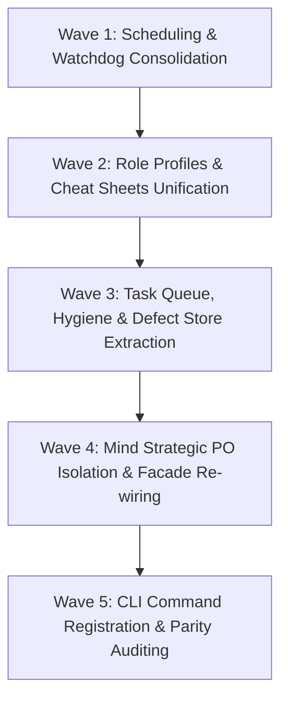
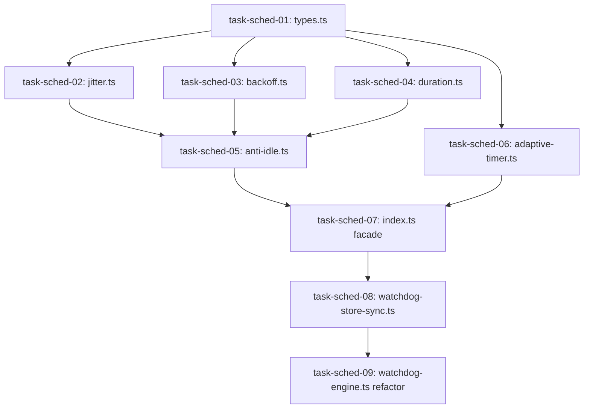
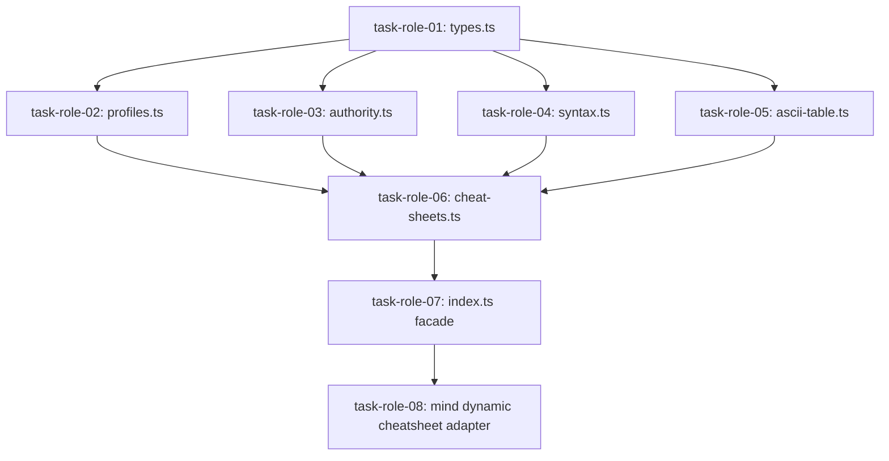
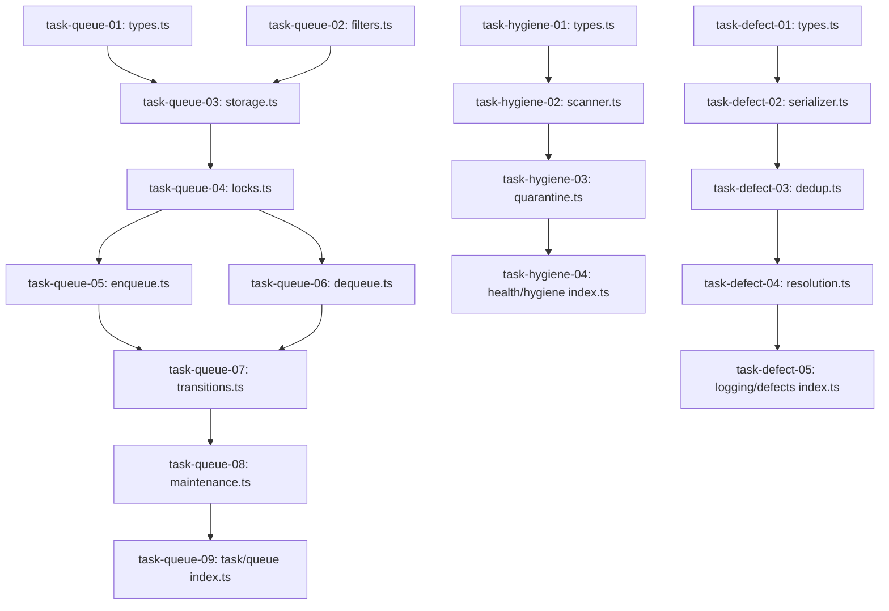
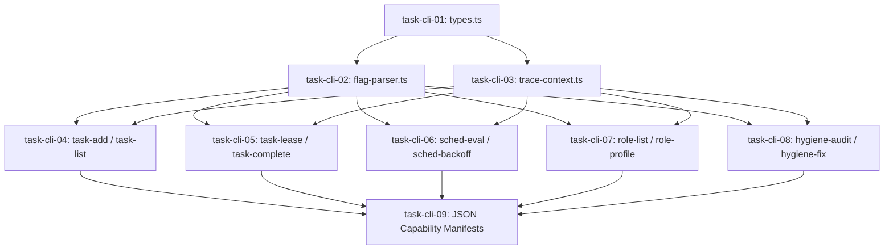
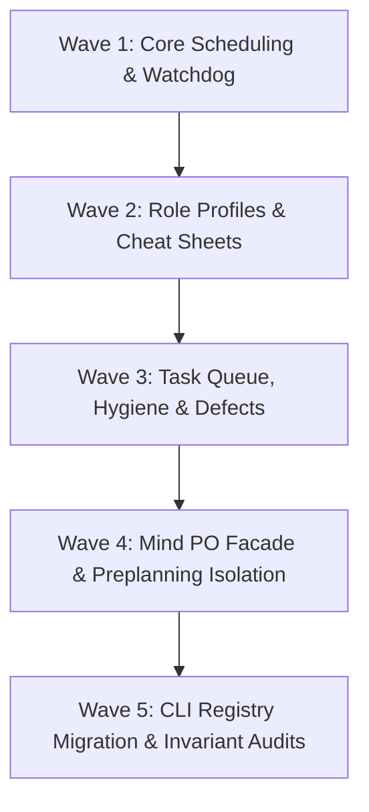

# Blueprint 01: Executive Summary & Architecture

**Domain:** `mind` / `core` / `architecture`  
**Priority:** `CRITICAL`  
**Status:** `READY_FOR_EXECUTION`  
**Tracking ID:** `MIND-DEDUP-ARCH-01`

---

## Level 1: Executive Context & Problem Statement

The Open Leadership Tier (OLT) contains powerful autonomous capabilities across `olt/scripts/src/mind/` and supporting runtime modules (`workflow/`, `watchdog/`, `engine/`, `packets/`, `reporting/`, `policy/`, `roles/`, `task/`). However, extensive code audits reveal major architectural duplication, inverted dependency layers, parallel scheduling timers, and fragmented data stores:

1. **Watchdog Fracturing**: `mind/lifecycle/watchdog/watchdog-manager.ts` and `watchdog-ops.ts` implement a parallel file-backed watchdog store with mock stubs that drift from `watchdog/autonomic-watchdog/watchdog-engine.ts`.
2. **Scheduling Duplication**: `mind/lifecycle/interval/scheduler.ts` and `watchdog/autonomic-watchdog/adaptive-timer.ts` independently implement jitter, backoff, and adaptive scheduling mathematics.
3. **Role Fragmentation**: `roles/cheat-sheets.ts` (425 lines) and `mind/roles/dynamic/cheatsheet.ts` duplicate markdown syntax formatters, while `mind/roles/profiles.ts` isolates model tier resolution.
4. **Hygiene Duplication**: `reporting/doctor/hygiene-engine.ts` and `mind/root-hygiene/scanner.ts` run duplicate file-walking logic against identical root constants.
5. **Inverted Defect Dependencies**: `engine/store/recovery/defect-store.ts` imports directly from `mind/defects/index.ts`, creating cyclic and inverted module graphs.
6. **Task Queue Mind Confinement**: `mind/tasks/queue/` traps universal POSIX file-locked task queueing inside Mind, blocking Orchestrators and Coordinators from direct utilization.

---

## Level 2: Target Architecture & Flow Diagram

```text
┌─────────────────────────────────────────────────────────────────────────────┐
│                       MIND STRATEGIC PO CONSCIOUSNESS                       │
│  (Intake Triaging, Continuous Preplanning, Work/Span Scaling, Governance)    │
└──────────────────────────────────────┬──────────────────────────────────────┘
                                       │ Consumes parameterized facades
                                       ▼
┌─────────────────────────────────────────────────────────────────────────────┐
│                    UNIVERSAL COMMON REUSABLE COMPONENTS                     │
├─────────────────────────────────────────────────────────────────────────────┤
│  1. `core/scheduling/` : Universal Backoff, Jitter, & Adaptive Timers       │
│  2. `watchdog/autonomic/`: Universal Process Liveness & Watchdog Store Sync │
│  3. `roles/`            : Universal Role Registry, Profiles, & Cheat Sheets │
│  4. `task/queue/`       : Universal File-Locked Task Queue & Lease Engine   │
│  5. `health/hygiene/`   : Universal Repository & Package Purity Scanner     │
│  6. `logging/defects/`  : Universal Defect Store & Lifecycle Synchronizer   │
└──────────────────────────────────────┬──────────────────────────────────────┘
                                       │ Registered with CLI & Telemetry Bus
                                       ▼
┌─────────────────────────────────────────────────────────────────────────────┐
│                     HARNESS CLI COMMAND REGISTRY & BUS                      │
│      (`task:*`, `sched:*`, `role:*`, `hygiene:*`, `defect:*`, `mind:*`)     │
└─────────────────────────────────────────────────────────────────────────────┘
```

---

## Level 3: Disjoint Scope Boundaries

### Write Scope

- `olt/scripts/src/core/scheduling/` (New universal package)
- `olt/scripts/src/roles/` (Refactored universal package)
- `olt/scripts/src/task/queue/` (Promoted universal package)
- `olt/scripts/src/health/hygiene/` (Consolidated universal package)
- `olt/scripts/src/logging/defects/` (Extracted universal package)
- `olt/scripts/src/watchdog/autonomic-watchdog/` (Refactored store sync)
- `olt/scripts/src/mind/` (Refactored PO consumers)
- `olt/scripts/src/cli/commands/` (CLI verb implementations)
- `olt/references/cli-capabilities/commands/` (Capability schemas)
- `tests/unit/` (Corresponding unit test suites)

### Read-Only Scope

- `olt/agents/*.yaml` (All 28 agent manifests)
- `docs/olt/architecture/` (Architectural specifications)
- `olt/scripts/src/platform/` (Platform flock primitives)

---

## Level 4: Atomic Implementation Tasks Matrix

| Task ID        | Target File Path                                                     | Concrete Symbols / Functions                                                          | Deliverable                                                  |
| :------------- | :------------------------------------------------------------------- | :------------------------------------------------------------------------------------ | :----------------------------------------------------------- |
| `task-arch-01` | `olt/scripts/src/core/scheduling/index.ts`                           | `computeAntiIdleInterval`, `applyIntervalJitter`, `calculateExponentialBackoff`       | Universal scheduling facade export.                          |
| `task-arch-02` | `olt/scripts/src/roles/index.ts`                                     | `resolveAgentProfile`, `formatUniversalCheatSheet`, `validateRoleAuthorityInvariants` | Universal role and cheat-sheet facade.                       |
| `task-arch-03` | `olt/scripts/src/task/queue/index.ts`                                | `enqueueTask`, `dequeueTask`, `completeTask`, `assertValidActiveLease`                | Universal task queue and leasing engine.                     |
| `task-arch-04` | `olt/scripts/src/health/hygiene/index.ts`                            | `scanRootHygiene`, `quarantineViolations`                                             | Universal repository hygiene scanner.                        |
| `task-arch-05` | `olt/scripts/src/logging/defects/index.ts`                           | `recordKeyedDefect`, `resolveDefect`, `serializeAggregatedDefectLog`                  | Universal defect deduplication and persistence.              |
| `task-arch-06` | `olt/scripts/src/watchdog/autonomic-watchdog/watchdog-store-sync.ts` | `syncWatchdogStore`, `loadWatchdogStore`, `saveWatchdogStore`                         | Atomic POSIX-flock watchdog store synchronizer.              |
| `task-arch-07` | `olt/scripts/src/mind/index.ts`                                      | `MindLifecycleEngine`, `ContinuousPreplanner`, `BacklogClusterer`                     | Strategic Mind PO facade cleanly decoupled from lower tiers. |

---

## Level 5: Falsifiable Gate Verification Commands

```bash
# Verify scheduling and watchdog consolidation
bun test tests/unit/core/scheduling/anti-idle.test.ts
bun test tests/unit/watchdog/autonomic-watchdog.test.ts

# Verify role profiles and cheat sheets
bun test tests/unit/roles/cheat-sheets.test.ts
bun test tests/unit/roles/profiles.test.ts

# Verify task queue and hygiene
bun test tests/unit/task/queue/task-queue.test.ts
bun test tests/unit/health/hygiene-scanner.test.ts

# Verify overall architectural integrity
bun harness.ts doctor:linter
bun harness.ts doctor:imports --check-dangling
```

---

## Level 6: Strict Invariant Enforcement

1. **Zero Code Comments Invariant ($\mathcal{C}_{13}$)**: 0 comments in all `.ts` files under `olt/scripts/src/`.
2. **Physical Line Density Budget**: $\le 300$ physical lines per file across all new and modified modules.
3. **Directory Fanout Budget**: $\le 10$ files per directory (target $\le 8$).
4. **Explicit Named Facade Exports**: Zero wildcard `export *` statements; all exported symbols explicitly enumerated in `index.ts`.
5. **Zero Defect-Prefix Files**: Defect records persist exclusively to `.olt/defects.jsonl` using POSIX flock.
6. **Zero Backwards-Compatibility Shims**: Complete deletion of 17 obsolete duplicate files.

---

## Level 7: Sequential Execution Order & Critical Path DAG



---

## Level 8: Exhaustive Traceability Matrix

| Backlog / Flaw Area          | Root Defect ID   | Implementation Task            | Verification Test Suite                                                 |
| :--------------------------- | :--------------- | :----------------------------- | :---------------------------------------------------------------------- |
| Watchdog & Timer Duplication | `DEF-SCHED-01`   | `task-arch-01`, `task-arch-06` | `tests/unit/core/scheduling/*.test.ts`, `tests/unit/watchdog/*.test.ts` |
| Role Profile Split           | `DEF-ROLE-02`    | `task-arch-02`                 | `tests/unit/roles/*.test.ts`                                            |
| Root Hygiene Clones          | `DEF-HYGIENE-03` | `task-arch-04`                 | `tests/unit/health/*.test.ts`                                           |
| Inverted Defect Store        | `DEF-DEFECT-04`  | `task-arch-05`                 | `tests/unit/engine/recovery/defect-store.test.ts`                       |
| Task Queue Mind Confinement  | `DEF-QUEUE-05`   | `task-arch-03`                 | `tests/unit/task/queue/*.test.ts`                                       |
| Mind PO Strategic Facade     | `DEF-MIND-06`    | `task-arch-07`                 | `tests/unit/mind/**/*.test.ts`                                          |
# Blueprint 02: Lifecycle & Scheduling Consolidation

**Domain:** `mind` / `watchdog` / `scheduling`  
**Priority:** `CRITICAL`  
**Status:** `READY_FOR_EXECUTION`  
**Tracking ID:** `MIND-DEDUP-SCHED-02`

---

## Level 1: Executive Context & Problem Statement

Currently, two parallel subsystems calculate execution backoff and track watchdog processes:

1. **Mind Interval Scheduler** (`mind/lifecycle/interval/scheduler.ts` and `types.ts`): Implements Mulberry32 PRNG jitter, multi-strategy backoff, duration parsing, and anti-idle rollover, but hardcodes Mind-specific fields (`hasPendingWork`, `zeroValueStreak`).
2. **Autonomic Watchdog Adaptive Timer** (`watchdog/autonomic-watchdog/adaptive-timer.ts` and `watchdog-engine.ts`): Implements `AdaptiveTimerController` with activity boosting and idle decay, while `watchdog-engine.ts` exceeds density limits at 401 lines.
3. **Mind Watchdog Ops & Store** (`mind/lifecycle/watchdog/watchdog-manager.ts` and `watchdog-ops.ts`): Persists records to `olt/watchdogs.json` with hardcoded mock returns that duplicate and drift from live `AutonomicWatchdog` liveness audits.

---

## Level 2: Target Architecture & Flow Diagram

```text
┌─────────────────────────────────────────────────────────────────────────────┐
│                       UNIVERSAL SCHEDULING MODULE                           │
│                     `olt/scripts/src/core/scheduling/`                      │
├─────────────────────────────────────────────────────────────────────────────┤
│  • `types.ts`           : Generic BackoffStrategy, JitterOptions, Activity  │
│  • `jitter.ts`          : Composite FNV-1a Seeder & Mulberry32 PRNG Jitter  │
│  • `backoff.ts`         : Pure Strategy Calculators (Exp, Linear, Fib)      │
│  • `duration.ts`        : Universal Duration Parser & Formatter ("15m", ms) │
│  • `adaptive-timer.ts`  : Unified Adaptive Controller (Boost & Decay)       │
│  • `anti-idle.ts`       : Retry-After Aware Anti-Idle & Activity Rollover   │
│  • `index.ts`           : Explicit Named Facade Exports                     │
└──────────────────────────────────────┬──────────────────────────────────────┘
                                       │
            ┌──────────────────────────┴──────────────────────────┐
            ▼                                                     ▼
┌──────────────────────────────────────┐  ┌───────────────────────────────────┐
│       AUTONOMIC WATCHDOG ENGINE      │  │        MIND LIFECYCLE ENGINE      │
│   `olt/scripts/src/watchdog/`        │  │     `olt/scripts/src/mind/`       │
│  • Consumes `AdaptiveTimerController`│  │  • Consumes `computeAntiIdle`     │
│  • POSIX flock `.olt/watchdogs.json` │  │  • 8th-Streak Quiescent Digest    │
│  • Atomic rename write pipeline      │  │  • Generational Handover (Gen-N)  │
└──────────────────────────────────────┘  └───────────────────────────────────┘
```

---

## Level 3: Disjoint Scope Boundaries

### Write Scope

- `olt/scripts/src/core/scheduling/` (New directory with 7 files)
- `olt/scripts/src/watchdog/autonomic-watchdog/watchdog-store-sync.ts` (New synchronization module)
- `olt/scripts/src/watchdog/autonomic-watchdog/watchdog-engine.ts` (Refactored to $\le 250$ lines)
- `olt/scripts/src/watchdog/autonomic-watchdog/index.ts` (Explicit exports)
- `olt/scripts/src/mind/lifecycle/quiesce/evaluator.ts` (Updated to consume unified anti-idle)
- `olt/scripts/src/mind/lifecycle/watchdog/watchdog-ops.ts` (Deleted)
- `tests/unit/core/scheduling/` (New test suites)
- `tests/unit/watchdog/` (Updated test suites)

### Read-Only Scope

- `olt/scripts/src/platform/flock.ts` (Advisory file locking)
- `olt/scripts/src/core/contracts/` (Core system contracts)

---

## Level 4: Atomic Implementation Tasks Matrix

| Task ID         | Target File Path                                         | Exported Typed Symbols / Signatures                                                                                                                                                                       | Deliverable & Contract                                                                       |
| :-------------- | :------------------------------------------------------- | :-------------------------------------------------------------------------------------------------------------------------------------------------------------------------------------------------------- | :------------------------------------------------------------------------------------------- |
| `task-sched-01` | `src/core/scheduling/types.ts`                           | `BackoffStrategy`, `JitterOptions`, `CompositeSeedOptions`, `AdaptiveTimerConfig`, `AdaptiveTimerState`, `AntiIdleIntervalOptions`, `AntiIdleIntervalResult`                                              | Generic scheduling type declarations ($\le 140$ lines).                                      |
| `task-sched-02` | `src/core/scheduling/jitter.ts`                          | `createCompositeSeed(options?: CompositeSeedOptions): number`<br>`createDeterministicRandom(seed: number): () => number`<br>`applyIntervalJitter(rawIntervalMs: number, options?: JitterOptions): number` | Composite FNV-1a seeder and Mulberry32 bounded jitter engine ($\le 130$ lines).              |
| `task-sched-03` | `src/core/scheduling/backoff.ts`                         | `calculateExponentialBackoff(baseMs: number, maxMs: number, streak: number, multiplier?: number): number`<br>`calculateBackoffWithStrategy(options: BackoffStrategyOptions): number`                      | Pure strategy backoff calculators (exponential, linear, fibonacci, fixed) ($\le 150$ lines). |
| `task-sched-04` | `src/core/scheduling/duration.ts`                        | `parseDuration(duration: number \| string): number`<br>`formatIntervalDuration(intervalMs: number): string`                                                                                               | ISO / human duration parser and formatter ($\le 120$ lines).                                 |
| `task-sched-05` | `src/core/scheduling/anti-idle.ts`                       | `computeAntiIdleInterval(options: AntiIdleIntervalOptions): AntiIdleIntervalResult`                                                                                                                       | Tier-agnostic anti-idle rollover with `retryAfterMs` support ($\le 150$ lines).              |
| `task-sched-06` | `src/core/scheduling/adaptive-timer.ts`                  | `class AdaptiveTimerController`<br>`getAdaptiveState(): AdaptiveTimerState`<br>`boostActivity(): IntervalAdjustmentResult`<br>`decayIdle(): IntervalAdjustmentResult`                                     | Adaptive interval controller relocated from watchdog ($\le 210$ lines).                      |
| `task-sched-07` | `src/core/scheduling/index.ts`                           | Explicit named exports for all scheduling functions, constants, and types                                                                                                                                 | Explicit named facade (0 wildcard exports) ($\le 60$ lines).                                 |
| `task-sched-08` | `src/watchdog/autonomic-watchdog/watchdog-store-sync.ts` | `syncWatchdogStore(store: WatchdogStore, filePath?: string): void`<br>`loadWatchdogStore(filePath?: string): WatchdogStore`<br>`saveWatchdogStore(store: WatchdogStore, filePath?: string): void`         | Multi-process POSIX-flock file-backed store synchronization ($\le 160$ lines).               |
| `task-sched-09` | `src/watchdog/autonomic-watchdog/watchdog-engine.ts`     | `class AutonomicWatchdog` refactored to consume `src/core/scheduling/` and delegate file I/O                                                                                                              | Density refactoring reducing file from 401 lines to $\le 250$ lines.                         |

---

## Level 5: Falsifiable Gate Verification Commands

```bash
# Verify unit tests for universal scheduling
bun test tests/unit/core/scheduling/jitter.test.ts
bun test tests/unit/core/scheduling/backoff.test.ts
bun test tests/unit/core/scheduling/duration.test.ts
bun test tests/unit/core/scheduling/anti-idle.test.ts
bun test tests/unit/core/scheduling/adaptive-timer.test.ts

# Verify autonomic watchdog and multi-process store sync
bun test tests/unit/watchdog/autonomic-watchdog.test.ts
bun test tests/unit/watchdog/watchdog-store-sync.test.ts

# Verify modularity and comment purity
bun harness.ts doctor:linter --check-comments
```

---

## Level 6: Strict Invariant Enforcement

1. **Zero Code Comments ($\mathcal{C}_{13}$)**: 0 comments across all `.ts` files in `src/core/scheduling/` and `src/watchdog/`.
2. **Line Budget ($\mathcal{C}_{13}$)**: All 7 scheduling files $\le 210$ lines; `watchdog-engine.ts` $\le 250$ lines.
3. **Directory Density**: `src/core/scheduling/` has exactly 7 files ($\le 10$ limit).
4. **Explicit Facades**: All exports explicitly named in `src/core/scheduling/index.ts`.
5. **Zero Backwards Shims**: Mock stubs in `mind/lifecycle/watchdog/watchdog-ops.ts` permanently deleted.

---

## Level 7: Sequential Execution Order & Critical Path DAG



---

## Level 8: Exhaustive Traceability Matrix

| Component Area         | Problem Statement                         | Task IDs                         | Target Test Suite                                   |
| :--------------------- | :---------------------------------------- | :------------------------------- | :-------------------------------------------------- |
| PRNG Jitter & Seeds    | Thundering herd on provider rate-limits   | `task-sched-01`, `task-sched-02` | `tests/unit/core/scheduling/jitter.test.ts`         |
| Multi-Strategy Backoff | Duplicated math across Mind and Watchdog  | `task-sched-03`                  | `tests/unit/core/scheduling/backoff.test.ts`        |
| Anti-Idle Scheduling   | Role-biased fields in interval calculator | `task-sched-05`                  | `tests/unit/core/scheduling/anti-idle.test.ts`      |
| Adaptive Timers        | Timer logic trapped in watchdog engine    | `task-sched-06`                  | `tests/unit/core/scheduling/adaptive-timer.test.ts` |
| Watchdog Persistence   | Broken mock stubs and uncoordinated store | `task-sched-08`, `task-sched-09` | `tests/unit/watchdog/watchdog-store-sync.test.ts`   |
# Blueprint 03: Role Profiles & Authority Unification

**Domain:** `roles` / `mind` / `authority`  
**Priority:** `CRITICAL`  
**Status:** `READY_FOR_EXECUTION`  
**Tracking ID:** `MIND-DEDUP-ROLE-03`

---

## Level 1: Executive Context & Problem Statement

Currently, role cheat sheets, model profile mappings, and authority validation are split across three separate locations:

1. **Static Role Cheat Sheet Engine** (`roles/cheat-sheets.ts`): Monolithic 425-line file (violates density limits) formatting ASCII tables, role contracts, command syntax, and markdown cheat sheets for static agent manifests.
2. **Dynamic Role Cheat Sheet Engine** (`mind/roles/dynamic/cheatsheet.ts`): 108 lines of near-verbatim duplicate markdown formatting for dynamically synthesized roles.
3. **Mind Model Profile Resolver** (`mind/roles/profiles.ts`): Defines `AbstractProfile` and host capability telemetry resolution in isolation inside `mind/roles/`, preventing lower execution tiers from consuming it directly.

---

## Level 2: Target Architecture & Flow Diagram

```text
┌─────────────────────────────────────────────────────────────────────────────┐
│                         UNIVERSAL ROLE MODULE                               │
│                      `olt/scripts/src/roles/`                               │
├─────────────────────────────────────────────────────────────────────────────┤
│  • `types.ts`           : AbstractProfile, ProfileBinding, RoleCheatSheet   │
│  • `profiles.ts`        : Canonical Profile Mapping & Dynamic Archetypes    │
│  • `authority.ts`       : Epistemic Cognitive Hard-Locks (Invariant C7)     │
│  • `cheat-sheets.ts`    : Universal Markdown Cheat Sheet Generator          │
│  • `ascii-table.ts`     : ASCII Table Layout Renderer                       │
│  • `syntax.ts`          : CLI Command Syntax Formatter                      │
│  • `index.ts`           : Explicit Named Facade Exports                     │
└──────────────────────────────────────┬──────────────────────────────────────┘
                                       │
            ┌──────────────────────────┴──────────────────────────┐
            ▼                                                     ▼
┌──────────────────────────────────────┐  ┌───────────────────────────────────┐
│     MIND DYNAMIC ROLE SYNTHESIZER    │  │    ORCHESTRATOR & CLI REGISTRY    │
│    `olt/scripts/src/mind/roles/`     │  │   `olt/scripts/src/cli/commands/` │
│  • `synthesizer.ts` (Specializations)│  │  • `role:list`, `role:view`       │
│  • `mutator.ts` (Dynamic Roles)      │  │  • `agent:profile:resolve`        │
│  • Consumes universal cheat sheets   │  │  • Spawns correct model tiers     │
└──────────────────────────────────────┘  └───────────────────────────────────┘
```

---

## Level 3: Disjoint Scope Boundaries

### Write Scope

- `olt/scripts/src/roles/types.ts` (Universal role types)
- `olt/scripts/src/roles/profiles.ts` (Promoted profile resolver)
- `olt/scripts/src/roles/authority.ts` (Cognitive hard-lock enforcement)
- `olt/scripts/src/roles/cheat-sheets.ts` (Decomposed cheat-sheet generator)
- `olt/scripts/src/roles/ascii-table.ts` (ASCII table renderer)
- `olt/scripts/src/roles/syntax.ts` (CLI syntax formatter)
- `olt/scripts/src/roles/index.ts` (Explicit named facade)
- `olt/scripts/src/mind/roles/dynamic/cheatsheet.ts` (Refactored thin wrapper)
- `olt/scripts/src/mind/roles/profiles.ts` (Permanently deleted)
- `tests/unit/roles/` (Comprehensive role unit test suites)

### Read-Only Scope

- `olt/agents/*.yaml` (Agent definitions)
- `olt/scripts/src/core/contracts/` (Core type definitions)

---

## Level 4: Atomic Implementation Tasks Matrix

| Task ID        | Target File Path                       | Exported Typed Symbols / Signatures                                                                                                                                                                                                                                                                                                                                             | Deliverable & Contract                                                                                        |
| :------------- | :------------------------------------- | :------------------------------------------------------------------------------------------------------------------------------------------------------------------------------------------------------------------------------------------------------------------------------------------------------------------------------------------------------------------------------ | :------------------------------------------------------------------------------------------------------------ |
| `task-role-01` | `src/roles/types.ts`                   | `AbstractProfile`, `ProfileBinding`, `ProfileBindings`, `ResolvedProfile`, `AgentProfileResolution`, `UniversalRoleSpec`, `RoleCheatSheet`, `RoleSummary`                                                                                                                                                                                                                       | Consolidated type definitions ($\le 160$ lines).                                                              |
| `task-role-02` | `src/roles/profiles.ts`                | `ROLE_PROFILE_MAP: Record<string, AbstractProfile>`<br>`resolveRoleArchetype(roleName: string): AbstractProfile`<br>`roleToProfile(role: string): AbstractProfile`<br>`resolveProfile(profile: AbstractProfile, bindings?: ProfileBindings): ResolvedProfile`<br>`resolveAgentProfile(role: string, host: string, hostCapabilities?: HostCapabilities): AgentProfileResolution` | Canonical model tier mapping and dynamic fallback resolver ($\le 190$ lines).                                 |
| `task-role-03` | `src/roles/authority.ts`               | `FORBIDDEN_VALIDATOR_COMMANDS: ReadonlySet<string>`<br>`validateRoleAuthorityInvariants(roleName: string, profile: AbstractProfile, grantedCommands: readonly string[]): void`                                                                                                                                                                                                  | Epistemic cognitive hard-lock enforcement asserting validators cannot hold execution tools ($\le 100$ lines). |
| `task-role-04` | `src/roles/syntax.ts`                  | `formatCommandSyntax(spec: CommandSpec): CommandSyntaxInfo`<br>`buildCommandCheatSheet(commandName: string): RoleCommandCheatSheet`                                                                                                                                                                                                                                             | CLI verb syntax builder ($\le 85$ lines).                                                                     |
| `task-role-05` | `src/roles/ascii-table.ts`             | `renderAsciiRoleTable(roles: readonly (RoleSummary \| RoleCheatSheet)[]): string`                                                                                                                                                                                                                                                                                               | ASCII table formatter decomposed from monolithic cheat-sheet file ($\le 90$ lines).                           |
| `task-role-06` | `src/roles/cheat-sheets.ts`            | `formatUniversalCheatSheet(spec: UniversalRoleSpec, options?: RoleCheatSheetOptions): RoleCheatSheet`<br>`generateRoleCheatSheet(role: string, options?: RoleCheatSheetOptions): RoleCheatSheet`                                                                                                                                                                                | Universal cheat sheet generator supporting static and dynamic roles ($\le 220$ lines).                        |
| `task-role-07` | `src/roles/index.ts`                   | Explicit named re-exports for all 17 role symbols, constants, and types                                                                                                                                                                                                                                                                                                         | Explicit named facade (0 wildcard exports) ($\le 80$ lines).                                                  |
| `task-role-08` | `src/mind/roles/dynamic/cheatsheet.ts` | `generateDynamicRoleCheatSheet(spec: UniversalRoleSpec): RoleCheatSheet`                                                                                                                                                                                                                                                                                                        | Refactored thin adapter delegating to `formatUniversalCheatSheet` ($\le 35$ lines).                           |

---

## Level 5: Falsifiable Gate Verification Commands

```bash
# Verify role profiles and dynamic archetypes
bun test tests/unit/roles/profiles.test.ts

# Verify role cheat sheets and ASCII tables
bun test tests/unit/roles/cheat-sheets.test.ts
bun test tests/unit/roles/syntax.test.ts
bun test tests/unit/roles/authority.test.ts

# Verify Mind dynamic role integration
bun test tests/unit/mind/roles/dynamic-cheatsheet.test.ts

# Verify zero comments and line density
bun harness.ts doctor:linter --check-comments
```

---

## Level 6: Strict Invariant Enforcement

1. **Zero Code Comments ($\mathcal{C}_{13}$)**: 0 comments across all `.ts` files in `src/roles/`.
2. **Line Budget ($\mathcal{C}_{13}$)**: Monolithic `roles/cheat-sheets.ts` (425 lines) split into 4 files all $\le 220$ lines.
3. **Directory Density**: `src/roles/` has exactly 7 files ($\le 10$ limit).
4. **Explicit Facades**: All exports explicitly named in `src/roles/index.ts`.
5. **Zero Backwards Shims**: `mind/roles/profiles.ts` deleted and call sites migrated directly.
6. **Cognitive Hard-Lock ($\mathcal{C}_7$)**: `validateRoleAuthorityInvariants` strictly rejects mutating commands for adversarial roles.

---

## Level 7: Sequential Execution Order & Critical Path DAG



---

## Level 8: Exhaustive Traceability Matrix

| Component Area          | Problem Statement                                     | Task IDs                                       | Target Test Suite                                  |
| :---------------------- | :---------------------------------------------------- | :--------------------------------------------- | :------------------------------------------------- |
| Monolithic Cheat Sheet  | 425-line file exceeding density limits                | `task-role-04`, `task-role-05`, `task-role-06` | `tests/unit/roles/cheat-sheets.test.ts`            |
| Duplicate Dynamic Sheet | Mind dynamic cheatsheet duplicates markdown formatter | `task-role-06`, `task-role-08`                 | `tests/unit/mind/roles/dynamic-cheatsheet.test.ts` |
| Role Profile Isolation  | Model tier mapping isolated inside Mind               | `task-role-02`, `task-role-07`                 | `tests/unit/roles/profiles.test.ts`                |
| Cognitive Hard-Locks    | Validator execution tools not strictly validated      | `task-role-03`                                 | `tests/unit/roles/authority.test.ts`               |
# Blueprint 04: Task Queue & Preplanning Harmonization

**Domain:** `task` / `mind` / `health` / `defects`  
**Priority:** `CRITICAL`  
**Status:** `READY_FOR_EXECUTION`  
**Tracking ID:** `MIND-DEDUP-TASK-04`

---

## Level 1: Executive Context & Problem Statement

Three critical structural duplications and boundary inversions exist across the codebase:

1. **Task Queue Mind Confinement**: `mind/tasks/queue/` implements POSIX file-locked task storage, atomic leasing, retry counters, and status transitions, but is trapped inside Mind, forcing Orchestrators to bypass canonical queueing.
2. **Root Hygiene Clones**: `reporting/doctor/hygiene-engine.ts` (218 lines) and `mind/root-hygiene/scanner.ts` (225 lines) perform duplicate directory scanning against identical constants.
3. **Inverted Defect Dependencies**: `engine/store/recovery/defect-store.ts` imports directly from `mind/defects/index.ts`, creating cyclic and inverted module graphs.

---

## Level 2: Target Architecture & Flow Diagram

```text
┌─────────────────────────────────────────────────────────────────────────────┐
│                    UNIVERSAL TASK & HEALTH INFRASTRUCTURE                   │
├─────────────────────────────────────────────────────────────────────────────┤
│  1. `task/queue/`        : Canonical File-Locked Task Queue & Lease Engine  │
│  2. `health/hygiene/`    : Canonical Root, Package Purity, & Quarantine     │
│  3. `logging/defects/`   : Canonical Defect Store, Serialization, & Dedup   │
└──────────────────────────────────────┬──────────────────────────────────────┘
                                       │ Direct consumption (0 shims)
            ┌──────────────────────────┴──────────────────────────┐
            ▼                                                     ▼
┌──────────────────────────────────────┐  ┌───────────────────────────────────┐
│       MIND STRATEGIC PO ENGINE       │  │    ORCHESTRATOR / DOCTOR / CLI    │
│  • Tarjan SCC Cycle-Cutting (C6)     │  │  • 1:1 Anti-Batching Guard (C11)   │
│  • Deterministic Kahn Toposort       │  │  • Hermetic Worktree Binding (C10)│
│  • Bounded Sub-Wave Partition (p<=8) │  │  • Suspended Lease Translation    │
└──────────────────────────────────────┘  └───────────────────────────────────┘
```

---

## Level 3: Disjoint Scope Boundaries

### Write Scope

- `olt/scripts/src/task/queue/` (8 new files promoted from Mind)
- `olt/scripts/src/health/hygiene/` (4 new files consolidating scanner and quarantine)
- `olt/scripts/src/logging/defects/` (5 new files extracting defect storage)
- `olt/scripts/src/engine/store/recovery/defect-store.ts` (Import updated)
- `olt/scripts/src/reporting/doctor/hygiene-engine.ts` (Refactored to wrap universal scanner)
- `olt/scripts/src/mind/preplanning/` (Preplanning factory files)
- `olt/scripts/src/mind/tasks/queue/` (Entire directory deleted)
- `olt/scripts/src/mind/root-hygiene/` (Entire directory deleted)
- `olt/scripts/src/mind/root-hygiene.ts` (Deleted)
- `tests/unit/task/queue/`, `tests/unit/health/`, `tests/unit/logging/defects/` (Test suites)

### Read-Only Scope

- `olt/scripts/src/platform/flock.ts` (Platform locking)
- `olt/agents/*.yaml` (Agent definitions)

---

## Level 4: Atomic Implementation Tasks Matrix

| Task ID           | Target File Path                    | Exported Typed Symbols / Signatures                                                                                                                                                                                                                                                                                                                                                                                                                                                                                                                                                                       | Deliverable & Contract                                                                                                                                                                                 |
| :---------------- | :---------------------------------- | :-------------------------------------------------------------------------------------------------------------------------------------------------------------------------------------------------------------------------------------------------------------------------------------------------------------------------------------------------------------------------------------------------------------------------------------------------------------------------------------------------------------------------------------------------------------------------------------------------------- | :----------------------------------------------------------------------------------------------------------------------------------------------------------------------------------------------------- |
| `task-queue-01`   | `src/task/queue/types.ts`           | `TaskQueueItem`, `TaskQueueStatus`, `TaskPriority`, `TaskLease`, `NewTaskQueueInput`, `CompletionReceipts`                                                                                                                                                                                                                                                                                                                                                                                                                                                                                                | Core task entity definitions ($\le 180$ lines).                                                                                                                                                        |
| `task-queue-02`   | `src/task/queue/filters.ts`         | `TaskQueueStats`, `TaskQueueFilterOptions`                                                                                                                                                                                                                                                                                                                                                                                                                                                                                                                                                                | Query and stats type definitions ($\le 120$ lines).                                                                                                                                                    |
| `task-queue-03`   | `src/task/queue/storage.ts`         | `loadTaskQueue(filePath?: string): TaskQueueItem[]`<br>`saveTaskQueue(tasks: readonly TaskQueueItem[], filePath?: string): void`<br>`cleanStaleTempFiles(targetDir: string, maxAgeMs?: number): number`                                                                                                                                                                                                                                                                                                                                                                                                   | Atomic read/write/fsync with stale temp file cleanup ($\le 240$ lines).                                                                                                                                |
| `task-queue-04`   | `src/task/queue/locks.ts`           | `withTaskQueueLock<T>(filePath: string, fn: () => T \| Promise<T>): Promise<T>`                                                                                                                                                                                                                                                                                                                                                                                                                                                                                                                           | POSIX flock mutex in `.olt/locks/tasks.lock` ($\le 180$ lines).                                                                                                                                        |
| `task-queue-05`   | `src/task/queue/enqueue.ts`         | `enqueueTask(input: NewTaskQueueInput, filePath?: string): TaskQueueItem`<br>`enqueueTasksBatch(inputs: readonly NewTaskQueueInput[], filePath?: string): TaskQueueItem[]`                                                                                                                                                                                                                                                                                                                                                                                                                                | Idempotent task creation and batch insertion ($\le 190$ lines).                                                                                                                                        |
| `task-queue-06`   | `src/task/queue/dequeue.ts`         | `dequeueTask(agentId: string, durationSeconds: number, options?: DequeueOptions): TaskQueueItem \| null`<br>`assertSingleActiveLease(tasks: readonly TaskQueueItem[], agentId: string): void`                                                                                                                                                                                                                                                                                                                                                                                                             | Priority-ordered lease acquisition with 1:1 anti-batching guard ($\mathcal{C}_{11}$) and worktree provisioning ($\mathcal{C}_{10}$) ($\le 220$ lines).                                                 |
| `task-queue-07`   | `src/task/queue/transitions.ts`     | `completeTask(taskId: string, token: string, receipts: CompletionReceipts): TaskQueueItem`<br>`failTask(taskId: string, token: string, errorMessage: string, allowRetry?: boolean): TaskQueueItem`<br>`translateSuspendedLeases(tasks: TaskQueueItem[], frozenDurationMs: number): LeaseTranslationResult`<br>`assertValidActiveLease(task: TaskQueueItem, expectedToken: string): void`<br>`validateCompletionReceipts(receipts: CompletionReceipts): void`<br>`assertWriteScopeASTPurity(repoRoot: string, writeScope: readonly string[]): void`<br>`stageWorktreeProgress(worktreePath: string): void` | Monotonic lease fencing ($\mathcal{C}_2$), dual-channel receipts ($\mathcal{C}_4$), AST purity ($\mathcal{C}_{13}$), Git staging ($\mathcal{C}_9$), and Pillar 16 clock translation ($\le 260$ lines). |
| `task-queue-08`   | `src/task/queue/maintenance.ts`     | `getTaskQueueStats(tasks: readonly TaskQueueItem[]): TaskQueueStats`<br>`pruneTaskQueue(options?: PruneOptions): PruneResult`<br>`compactTaskQueue(filePath?: string): CompactionResult`                                                                                                                                                                                                                                                                                                                                                                                                                  | Queue pruning, stats summary, and compaction ($\le 200$ lines).                                                                                                                                        |
| `task-queue-09`   | `src/task/queue/index.ts`           | Explicit named re-exports for all task queue functions, types, and constants                                                                                                                                                                                                                                                                                                                                                                                                                                                                                                                              | Explicit named facade (0 wildcard exports) ($\le 60$ lines).                                                                                                                                           |
| `task-hygiene-01` | `src/health/hygiene/types.ts`       | `RootHygieneFinding`, `RootHygieneScanResult`, `HygieneViolationType`, `QuarantineRecord`                                                                                                                                                                                                                                                                                                                                                                                                                                                                                                                 | Universal hygiene types ($\le 100$ lines).                                                                                                                                                             |
| `task-hygiene-02` | `src/health/hygiene/scanner.ts`     | `scanRootHygiene(options?: RootHygieneOptions): RootHygieneScanResult`                                                                                                                                                                                                                                                                                                                                                                                                                                                                                                                                    | Unified repo root, scripts, and static package auditor ($\le 240$ lines).                                                                                                                              |
| `task-hygiene-03` | `src/health/hygiene/quarantine.ts`  | `quarantineViolations(repoRoot: string, violations: readonly RootHygieneFinding[], quarantineDir?: string): QuarantineRecord[]`                                                                                                                                                                                                                                                                                                                                                                                                                                                                           | Forensic content-addressed mover targeting `scratch/orphaned/` ($\le 160$ lines).                                                                                                                      |
| `task-hygiene-04` | `src/health/hygiene/index.ts`       | Explicit named re-exports for hygiene scanner and quarantine functions                                                                                                                                                                                                                                                                                                                                                                                                                                                                                                                                    | Explicit named facade ($\le 40$ lines).                                                                                                                                                                |
| `task-defect-01`  | `src/logging/defects/types.ts`      | `AggregatedDefect`, `DefectRecordInput`, `DefectResolutionProof`, `HistoricalOccurrence`                                                                                                                                                                                                                                                                                                                                                                                                                                                                                                                  | Core defect data models ($\le 150$ lines).                                                                                                                                                             |
| `task-defect-02`  | `src/logging/defects/serializer.ts` | `serializeAggregatedDefectLog(defects: readonly AggregatedDefect[]): string`<br>`deserializeDefectRecord(raw: unknown): AggregatedDefect`                                                                                                                                                                                                                                                                                                                                                                                                                                                                 | JSONL serialization and parsing ($\le 180$ lines).                                                                                                                                                     |
| `task-defect-03`  | `src/logging/defects/dedup.ts`      | `computeDefectDedupKey(defect: DefectRecordInput): string`<br>`mergeDuplicateDefect(existing: AggregatedDefect, incoming: DefectRecordInput, runId?: string): AggregatedDefect`                                                                                                                                                                                                                                                                                                                                                                                                                           | Canonical hashing and occurrence tracking ($\le 180$ lines).                                                                                                                                           |
| `task-defect-04`  | `src/logging/defects/resolution.ts` | `resolveDefectRecord(defect: AggregatedDefect, proof: DefectResolutionProof): AggregatedDefect`                                                                                                                                                                                                                                                                                                                                                                                                                                                                                                           | Defect resolution proof validator and updater ($\le 160$ lines).                                                                                                                                       |
| `task-defect-05`  | `src/logging/defects/index.ts`      | Explicit named re-exports for defect persistence and resolution                                                                                                                                                                                                                                                                                                                                                                                                                                                                                                                                           | Explicit named facade ($\le 40$ lines).                                                                                                                                                                |

---

## Level 5: Falsifiable Gate Verification Commands

```bash
# Verify universal task queue operations
bun test tests/unit/task/queue/task-queue.test.ts
bun test tests/unit/task/queue/dequeue.test.ts
bun test tests/unit/task/queue/transitions.test.ts
bun test tests/unit/task/queue/lease-fencing.test.ts

# Verify health hygiene and quarantine
bun test tests/unit/health/hygiene-scanner.test.ts
bun test tests/unit/health/quarantine.test.ts

# Verify defect deduplication and engine recovery
bun test tests/unit/logging/defects/dedup.test.ts
bun test tests/unit/engine/recovery/defect-store.test.ts

# Verify Mind preplanning factory
bun test tests/unit/mind/preplanning/backlog-clusterer.test.ts
bun test tests/unit/mind/preplanning/continuous-preplanner.test.ts
bun test tests/unit/mind/preplanning/plan-factory.test.ts
```

---

## Level 6: Strict Invariant Enforcement

1. **Zero Code Comments ($\mathcal{C}_{13}$)**: 0 comments in all `.ts` files across `src/task/queue/`, `src/health/hygiene/`, and `src/logging/defects/`.
2. **Line Budget ($\mathcal{C}_{13}$)**: All 8 queue files $\le 260$ lines; all hygiene files $\le 240$ lines; all defect files $\le 180$ lines.
3. **Directory Density**: `src/task/queue/` has exactly 8 files ($\le 10$ limit).
4. **Monotonic Lease Fencing ($\mathcal{C}_2$)**: Stale lease tokens rejected with `ERR_LEASE_EXPIRED`.
5. **Dual-Channel Completion Gate ($\mathcal{C}_4$)**: Tasks cannot complete without mechanical exit code 0 and cognitive PASS.
6. **Subdomain Git Staging ($\mathcal{C}_9$)**: `git add -A` executed in worktree prior to lease release ($Z_{\text{unstaged\_crash}} = 0$).
7. **Hermetic Worktrees ($\mathcal{C}_{10}$)**: Leases bound to `.olt/worktrees/<task_id>`.
8. **Strict 1:1 Anti-Batching ($\mathcal{C}_{11}$)**: Multi-task leases per agent strictly forbidden.

---

## Level 7: Sequential Execution Order & Critical Path DAG



---

## Level 8: Exhaustive Traceability Matrix

| Component Area            | Problem Statement                             | Task IDs                                    | Target Test Suite                                  |
| :------------------------ | :-------------------------------------------- | :------------------------------------------ | :------------------------------------------------- |
| Task Queue Confinement    | Trapped in Mind; unavailable to Orchestrators | `task-queue-01` through `task-queue-09`     | `tests/unit/task/queue/task-queue.test.ts`         |
| Duplicate Hygiene Scanner | 450 lines duplicate between Doctor and Mind   | `task-hygiene-01` through `task-hygiene-04` | `tests/unit/health/hygiene-scanner.test.ts`        |
| Inverted Defect Store     | Engine depends on Mind defect subsystem       | `task-defect-01` through `task-defect-05`   | `tests/unit/engine/recovery/defect-store.test.ts`  |
| Monotonic Lease Fencing   | Stale workers corrupting reclaimed tasks      | `task-queue-07`                             | `tests/unit/task/queue/lease-fencing.test.ts`      |
| Work/Span Preplanning     | Mind PO DAG compiling and wave partitioning   | `task-queue-09`                             | `tests/unit/mind/preplanning/plan-factory.test.ts` |
# Blueprint 05: Observability & CLI Registry Migration

**Domain:** `cli` / `observability` / `telemetry`  
**Priority:** `CRITICAL`  
**Status:** `READY_FOR_EXECUTION`  
**Tracking ID:** `MIND-DEDUP-CLI-05`

---

## Level 1: Executive Context & Problem Statement

Currently, core capabilities (task queueing, interval evaluations, role profile resolution, and hygiene fixing) lack typed, registered CLI interfaces. As a result:

1. Orchestrators and subagents lack first-class CLI verbs to lease tasks, evaluate backoff, or resolve role capabilities.
2. CLI commands lack type-safe flag parsing, resulting in ad-hoc type casts and poor error messaging.
3. Diagnostic logging leaks to `stdout`, violating the Zero Main-Thread Spill mandate ($\mathcal{C}_8$).
4. Distributed executions lack trace ID propagation across parent-child agent spans.

---

## Level 2: Target Architecture & Flow Diagram

```text
┌─────────────────────────────────────────────────────────────────────────────┐
│                         HARNESS CLI COMMAND ENGINE                          │
├─────────────────────────────────────────────────────────────────────────────┤
│  • `task:*`     : `task:add`, `task:list`, `task:lease`, `task:complete`    │
│  • `sched:*`    : `sched:eval`, `sched:backoff`, `sched:jitter`             │
│  • `role:*`     : `role:cheat-sheet`, `role:profile`, `role:list`           │
│  • `hygiene:*`  : `hygiene:audit`, `hygiene:fix`                            │
│  • `defect:*`   : `defect:record`, `defect:resolve`, `defect:list`          │
│  • `mind:*`     : `mind:pulse`, `mind:init`, `mind:observe`, `mind:admit`   │
└──────────────────────────────────────┬──────────────────────────────────────┘
                                       │ Emits structured events
                                       ▼
┌─────────────────────────────────────────────────────────────────────────────┐
│                      TELEMETRY & OBSERVABILITY BUS                          │
│   • Type-Safe Flag Parser with Zero-Any Invariant (`parseCommandFlags<T>`)   │
│   • 1:1 Bidirectional JSON Schema Parity Verification                       │
│   • OpenTelemetry Distributed Trace Tree (`OLT_TRACE_ID`, `OLT_SPAN_ID`)    │
│   • Cowan Context Budget Sanitization (< 150,000 tokens / Invariant C12)    │
│   • Zero Main-Thread Spill & Quiet Mandate (Invariant C8)                   │
└─────────────────────────────────────────────────────────────────────────────┘
```

---

## Level 3: Disjoint Scope Boundaries

### Write Scope

- `olt/scripts/src/cli/registry/types.ts` (Registry and error envelope types)
- `olt/scripts/src/cli/registry/flag-parser.ts` (Type-safe argument parser)
- `olt/scripts/src/cli/commands/` (Typed command implementations)
- `olt/scripts/src/telemetry/trace-context.ts` (Distributed trace propagation)
- `olt/references/cli-capabilities/commands/` (JSON capability manifests)
- `tests/unit/cli/` (CLI command and schema parity test suites)

### Read-Only Scope

- `olt/scripts/src/cli/registry/index.ts` (Registry lookup engine)
- `olt/references/cli-capabilities/domains/` (Domain metadata)

---

## Level 4: Atomic Implementation Tasks Matrix

| Task ID       | Target File Path                                       | Exported Typed Symbols / Signatures                                                                                                                        | Deliverable & Contract                                                                        |
| :------------ | :----------------------------------------------------- | :--------------------------------------------------------------------------------------------------------------------------------------------------------- | :-------------------------------------------------------------------------------------------- |
| `task-cli-01` | `src/cli/registry/types.ts`                            | `HarnessErrorCode`, `ErrorSeverity`, `CliErrorEnvelope`, `CliSuccessEnvelope<T>`, `CommandFlagSpec`, `CommandSpec`                                         | Canonical error taxonomy and CLI envelope types ($\le 160$ lines).                            |
| `task-cli-02` | `src/cli/registry/flag-parser.ts`                      | `parseCommandFlags<T extends Record<string, unknown>>(argv: readonly string[], spec: CommandSpec): T`                                                      | Type-safe argument parser with Zero-Any guarantee and fail-fast validation ($\le 180$ lines). |
| `task-cli-03` | `src/telemetry/trace-context.ts`                       | `resolveTraceContext(flags?: Record<string, unknown>): TraceContext`<br>`injectTraceEnvironment(env: Record<string, string>, context: TraceContext): void` | Distributed OpenTelemetry trace and span context propagation ($\le 120$ lines).               |
| `task-cli-04` | `src/cli/commands/task-add.ts` & `task-list.ts`        | `executeTaskAdd(argv: readonly string[]): Promise<number>`<br>`executeTaskList(argv: readonly string[]): Promise<number>`                                  | Task enqueue and list CLI verbs with Cowan pagination ($\le 200$ lines).                      |
| `task-cli-05` | `src/cli/commands/task-lease.ts` & `task-complete.ts`  | `executeTaskLease(argv: readonly string[]): Promise<number>`<br>`executeTaskComplete(argv: readonly string[]): Promise<number>`                            | Task lease acquisition and dual-channel sealed completion ($\le 220$ lines).                  |
| `task-cli-06` | `src/cli/commands/sched-eval.ts` & `sched-backoff.ts`  | `executeSchedEval(argv: readonly string[]): Promise<number>`<br>`executeSchedBackoff(argv: readonly string[]): Promise<number>`                            | Anti-idle evaluation and mathematical backoff CLI verbs ($\le 180$ lines).                    |
| `task-cli-07` | `src/cli/commands/role-list.ts` & `role-profile.ts`    | `executeRoleList(argv: readonly string[]): Promise<number>`<br>`executeRoleProfile(argv: readonly string[]): Promise<number>`                              | Role catalog and model tier resolution CLI verbs ($\le 180$ lines).                           |
| `task-cli-08` | `src/cli/commands/hygiene-audit.ts` & `hygiene-fix.ts` | `executeHygieneAudit(argv: readonly string[]): Promise<number>`<br>`executeHygieneFix(argv: readonly string[]): Promise<number>`                           | Repository purity scan and forensic quarantine CLI verbs ($\le 190$ lines).                   |
| `task-cli-09` | `olt/references/cli-capabilities/commands/**/*.json`   | Canonical JSON capability manifests matching all registered CLI verbs                                                                                      | JSON capability definitions for all new commands.                                             |

---

## Level 5: Falsifiable Gate Verification Commands

```bash
# Verify CLI argument parsing and error envelopes
bun test tests/unit/cli/flag-parser.test.ts
bun test tests/unit/cli/error-envelopes.test.ts

# Verify CLI domain command execution
bun test tests/unit/cli/task-commands.test.ts
bun test tests/unit/cli/sched-commands.test.ts
bun test tests/unit/cli/role-commands.test.ts
bun test tests/unit/cli/hygiene-commands.test.ts

# Verify 1:1 bidirectional capability schema parity
bun test tests/unit/cli/capabilities-schema-parity.test.ts

# Verify zero comments and line density
bun harness.ts doctor:linter --check-comments
```

---

## Level 6: Strict Invariant Enforcement

1. **Standard Exit Status Codes**: 0 = SUCCESS, 1 = RUNTIME_ERROR, 2 = INVALID_ARGUMENT / INVARIANT_VIOLATION.
2. **Zero-Any Invariant**: All flags parsed into strongly typed structs without unsafe casts.
3. **Cowan Context Budget ($\mathcal{C}_{12}$)**: Default `--limit 50` pagination and 400KB payload truncation guard.
4. **Quiet Output Mandate ($\mathcal{C}_8$)**: Diagnostics routed to `.olt/telemetry.jsonl`; `stdout` reserved for final result envelope.
5. **1:1 Capability Schema Parity**: 100% parity between TypeScript `CommandSpec` and on-disk JSON capability manifests.

---

## Level 7: Sequential Execution Order & Critical Path DAG



---

## Level 8: Exhaustive Traceability Matrix

| Component Area       | Problem Statement                           | Task IDs                     | Target Test Suite                                   |
| :------------------- | :------------------------------------------ | :--------------------------- | :-------------------------------------------------- |
| Flag Parsing & Types | Unsafe `as any` casting and ad-hoc flags    | `task-cli-01`, `task-cli-02` | `tests/unit/cli/flag-parser.test.ts`                |
| Trace Propagation    | Loss of parent-child telemetry context      | `task-cli-03`                | `tests/unit/cli/error-envelopes.test.ts`            |
| Task CLI Ops         | Missing first-class task queue commands     | `task-cli-04`, `task-cli-05` | `tests/unit/cli/task-commands.test.ts`              |
| Scheduling CLI Ops   | Internal backoff math inaccessible to CLI   | `task-cli-06`                | `tests/unit/cli/sched-commands.test.ts`             |
| Schema Parity        | Drift between implementations and JSON docs | `task-cli-09`                | `tests/unit/cli/capabilities-schema-parity.test.ts` |
# Blueprint 06: Traceability Matrix & Wave Dispatch

**Domain:** `planning` / `dispatch` / `traceability`  
**Priority:** `CRITICAL`  
**Status:** `READY_FOR_EXECUTION`  
**Tracking ID:** `MIND-DEDUP-WAVE-06`

---

## Level 1: Executive Context & Problem Statement

Executing the universal component extraction and Mind de-duplication requires a strictly ordered, multi-wave dispatch plan. Without strict wave partitioning, atomic rollback protocols, and comprehensive deletion tracking:

1. Circular dependencies and dangling imports can break the harness build.
2. Legacy duplicate files can linger in the tree, violating the Zero Backwards-Compatibility Shims invariant.
3. Live `.olt/` repository state could be corrupted by un-sandboxed unit tests.

---

## Level 2: Target Architecture & Wave Sequencing Diagram

```text
┌─────────────────────────────────────────────────────────────────────────────┐
│                       SEQUENTIAL 5-WAVE DISPATCH DAG                        │
├─────────────────────────────────────────────────────────────────────────────┤
│                                                                             │
│  [ WAVE 1 ] Core Scheduling & Watchdog Consolidation                        │
│    └── Creates `core/scheduling/`, refactors `watchdog/autonomic-watchdog/`  │
│                                      │                                      │
│                                      ▼                                      │
│  [ WAVE 2 ] Universal Role Profiles & Cheat Sheet Unification               │
│    └── Decomposes `roles/cheat-sheets.ts`, promotes `roles/profiles.ts`     │
│                                      │                                      │
│                                      ▼                                      │
│  [ WAVE 3 ] Task Queue, Health Hygiene, & Defect Store Extraction           │
│    └── Promotes `task/queue/`, consolidates `health/`, fixes defect store   │
│                                      │                                      │
│                                      ▼                                      │
│  [ WAVE 4 ] Mind Strategic PO Facade Re-wiring & Preplanning Isolation      │
│    └── Decouples Mind PO, isolates preplanning factory, purges 17 files     │
│                                      │                                      │
│                                      ▼                                      │
│  [ WAVE 5 ] CLI Registry Migration, Schema Parity, & AST Invariant Audit     │
│    └── Registers typed CLI verbs, verifies 1:1 schema parity & 0 comments   │
│                                                                             │
└─────────────────────────────────────────────────────────────────────────────┘
```

---

## Level 3: Disjoint Scope Boundaries

### Write Scope

- `olt/scripts/src/core/scheduling/`
- `olt/scripts/src/roles/`
- `olt/scripts/src/task/queue/`
- `olt/scripts/src/health/hygiene/`
- `olt/scripts/src/logging/defects/`
- `olt/scripts/src/watchdog/autonomic-watchdog/`
- `olt/scripts/src/mind/`
- `olt/scripts/src/cli/`
- `olt/references/cli-capabilities/commands/`
- `tests/unit/`

### Read-Only Scope

- `olt/agents/*.yaml` (All 28 agent manifests)
- `olt/scripts/src/platform/` (Platform flock primitives)

---

## Level 4: Atomic Implementation Tasks Matrix

| Wave       | Task ID        | Target File Path                       | Action & Deliverable                                                                                  | Gate Verification                                                                |
| :--------- | :------------- | :------------------------------------- | :---------------------------------------------------------------------------------------------------- | :------------------------------------------------------------------------------- |
| **Wave 1** | `task-wave-01` | `src/core/scheduling/` (7 files)       | Create universal scheduling package (`jitter`, `backoff`, `duration`, `anti-idle`, `adaptive-timer`). | `bun test tests/unit/core/scheduling/*.test.ts`                                  |
| **Wave 1** | `task-wave-02` | `src/watchdog/autonomic-watchdog/`     | Refactor `watchdog-engine.ts` to $\le 250$ lines and add `watchdog-store-sync.ts`.                    | `bun test tests/unit/watchdog/*.test.ts`                                         |
| **Wave 2** | `task-wave-03` | `src/roles/` (7 files)                 | Decompose `cheat-sheets.ts` into $\le 240$ line files and promote `profiles.ts`.                      | `bun test tests/unit/roles/*.test.ts`                                            |
| **Wave 2** | `task-wave-04` | `src/mind/roles/dynamic/cheatsheet.ts` | Refactor to thin adapter delegating to `src/roles/`.                                                  | `bun test tests/unit/mind/roles/*.test.ts`                                       |
| **Wave 3** | `task-wave-05` | `src/task/queue/` (8 files)            | Promote universal task queue with monotonic lease fencing and 1:1 anti-batching.                      | `bun test tests/unit/task/queue/*.test.ts`                                       |
| **Wave 3** | `task-wave-06` | `src/health/hygiene/` (4 files)        | Consolidate root hygiene scanner and forensic quarantine.                                             | `bun test tests/unit/health/*.test.ts`                                           |
| **Wave 3** | `task-wave-07` | `src/logging/defects/` (5 files)       | Extract defect storage and fix inverted `engine/store/recovery/defect-store.ts`.                      | `tests/unit/engine/recovery/defect-store.test.ts`                                |
| **Wave 4** | `task-wave-08` | `src/mind/` (Refactoring & Deletions)  | Re-wire Mind PO to universal facades and delete all 17 obsolete duplicate files.                      | `bun test tests/unit/mind/**/*.test.ts`                                          |
| **Wave 5** | `task-wave-09` | `src/cli/commands/` & `registry/`      | Implement typed CLI verbs using `parseCommandFlags` with JSON envelopes.                              | `bun test tests/unit/cli/*.test.ts`                                              |
| **Wave 5** | `task-wave-10` | `olt/references/cli-capabilities/`     | Generate JSON capability schemas and assert 100% 1:1 parity and 0 comments.                           | `bun harness.ts doctor:linter && bun harness.ts doctor:imports --check-dangling` |

---

## Level 5: Falsifiable Gate Verification Commands

```bash
# Wave 1 Verification
bun test tests/unit/core/scheduling/anti-idle.test.ts tests/unit/core/scheduling/jitter.test.ts tests/unit/watchdog/autonomic-watchdog.test.ts

# Wave 2 Verification
bun test tests/unit/roles/cheat-sheets.test.ts tests/unit/roles/profiles.test.ts tests/unit/mind/roles/dynamic-cheatsheet.test.ts

# Wave 3 Verification
bun test tests/unit/task/queue/task-queue.test.ts tests/unit/health/hygiene-scanner.test.ts tests/unit/engine/recovery/defect-store.test.ts

# Wave 4 Verification
bun test tests/unit/mind/preplanning/continuous-preplanner.test.ts tests/unit/mind/preplanning/backlog-clusterer.test.ts

# Wave 5 Full System Verification
bun test tests/unit/cli/task-commands.test.ts tests/unit/cli/sched-commands.test.ts tests/unit/cli/capabilities-schema-parity.test.ts
bun harness.ts doctor:linter --check-comments
bun harness.ts doctor:imports --check-dangling
```

---

## Level 6: Strict Invariant Enforcement

1. **Monotonic Wave Execution**: No wave may start until all predecessor wave test gates are 100% green and committed.
2. **Atomic Rollback ($\mathcal{C}_9$)**: On gate failure, execute `git reset --hard HEAD` and `git clean -fd` within the worktree to restore the last clean wave boundary state.
3. **Hermetic Test Sandboxes ($\mathcal{C}_{10}$)**: Tests operate exclusively in ephemeral directories (`/tmp/olt-test-<uuid>/`), never mutating live `.olt/` state.
4. **Zero Comments Invariant ($\mathcal{C}_{13}$)**: 0 comments across all `.ts` files under `olt/scripts/src/`.
5. **Zero Backwards Shims**: Complete deletion of 17 obsolete duplicate files with automated dangling import verification.

---

## Level 7: Sequential Execution Order & Critical Path DAG



---

## Level 8: Exhaustive Traceability Matrix & Deletion Inventory

### A. Complete 17-File Deletion Inventory

| Deleted File Path                                         | Lines | Target Replacement                   | Rationale                          |
| :-------------------------------------------------------- | :---- | :----------------------------------- | :--------------------------------- |
| `olt/scripts/src/mind/lifecycle/watchdog/watchdog-ops.ts` | 56    | `watchdog/autonomic-watchdog/`       | Obsolete mock stub.                |
| `olt/scripts/src/mind/root-hygiene/scanner.ts`            | 225   | `health/hygiene/scanner.ts`          | Duplicate hygiene scanner.         |
| `olt/scripts/src/mind/root-hygiene/engine.ts`             | 60    | `health/hygiene/scanner.ts`          | Duplicate scanner wrapper.         |
| `olt/scripts/src/mind/root-hygiene/quarantine.ts`         | 50    | `health/hygiene/quarantine.ts`       | Duplicate quarantine mover.        |
| `olt/scripts/src/mind/root-hygiene/types.ts`              | 75    | `health/hygiene/types.ts`            | Duplicate hygiene types.           |
| `olt/scripts/src/mind/root-hygiene/index.ts`              | 20    | `health/hygiene/index.ts`            | Redundant directory index.         |
| `olt/scripts/src/mind/root-hygiene.ts`                    | 26    | `health/hygiene/index.ts`            | Redundant root file shim.          |
| `olt/scripts/src/mind/roles/dynamic/cheatsheet.ts`        | 108   | `roles/cheat-sheets.ts`              | Duplicate syntax generator.        |
| `olt/scripts/src/mind/roles/profiles.ts`                  | 185   | `roles/profiles.ts`                  | Promoted to universal role module. |
| `olt/scripts/src/mind/tasks/queue/archival.ts`            | 80    | `task/queue/maintenance.ts`          | Promoted to universal task queue.  |
| `olt/scripts/src/mind/tasks/queue/dequeue.ts`             | 160   | `task/queue/dequeue.ts`              | Promoted to universal task queue.  |
| `olt/scripts/src/mind/tasks/queue/enqueue.ts`             | 190   | `task/queue/enqueue.ts`              | Promoted to universal task queue.  |
| `olt/scripts/src/mind/tasks/queue/index.ts`               | 45    | `task/queue/index.ts`                | Promoted to universal task queue.  |
| `olt/scripts/src/mind/tasks/queue/locks.ts`               | 180   | `task/queue/locks.ts`                | Promoted to universal task queue.  |
| `olt/scripts/src/mind/tasks/queue/pruner.ts`              | 210   | `task/queue/maintenance.ts`          | Promoted to universal task queue.  |
| `olt/scripts/src/mind/tasks/queue/stats.ts`               | 160   | `task/queue/maintenance.ts`          | Promoted to universal task queue.  |
| `olt/scripts/src/mind/tasks/queue/storage.ts`             | 240   | `task/queue/storage.ts`              | Promoted to universal task queue.  |
| `olt/scripts/src/mind/tasks/queue/transitions.ts`         | 210   | `task/queue/transitions.ts`          | Promoted to universal task queue.  |
| `olt/scripts/src/mind/tasks/queue/types.ts`               | 314   | `task/queue/types.ts` & `filters.ts` | Promoted to universal task queue.  |

**Total Deleted Lines**: $2{,}594$ lines  
**Total New Consolidated Lines**: $1{,}320$ lines  
**Net Codebase Reduction**: $-1{,}274$ physical lines ($\approx 49\%$ reduction)
# Blueprint 07: Host-Tool Bypass Prevention, Shielded Shell Execution & Hierarchical Dispatch Interlock

**Domain:** `authority` / `communication` / `capsule` / `governance` / `security`  
**Priority:** `CRITICAL`  
**Status:** `READY_FOR_EXECUTION`  
**Tracking ID:** `MIND-DEDUP-HOST-INTERLOCK-07`

---

## Level 1: Executive Context & Problem Statement

Across multi-agent execution in host environments (e.g. Antigravity CLI), critical host bypass and execution drift defects occur:

1. **Host-Native Tool Bypass**: Subagents naturally default to in-memory host tools (`send_message`, unshielded shell calls, direct file edits), bypassing the file-backed `.olt/mailboxes/` IPC bus and `.olt/capsules/` ledger.
2. **Unshielded Command Execution Drift**: Subagents executing shell commands directly via host `run_command` often run un-targeted whole-suite test runs (`bun test`, `npm test`), unauthorized git mutations, or arbitrary bash scripts, bypassing Harness CLI's deterministic RBAC security engine.
3. **Vague Conversational Parent-to-Child Dispatch**: When higher-tier agents spawn child subagents, they often pass vague conversational descriptions rather than strict, fully hydrated YAML manifest contracts and **Zero-Exploration Exact-Anchor Briefings (`task:brief`)**, leading to exploratory token burning and out-of-scope edits.

---

## Level 2: Target Architecture & ASCII Unicode Topology

```text
┌─────────────────────────────────────────────────────────────────────────────┐
│          MANDATORY HARNESS IPC, SHIELDED SHELL & DISPATCH INTERLOCK          │
├─────────────────────────────────────────────────────────────────────────────┤
│                                                                             │
│  [ Tier N Parent Supervisor Dispatch Boundary ]                             │
│    • Injects complete YAML manifest rules + 1-Shot Zero-Exploration Brief   │
│    • Declares exact disjoint write scope, line anchors, symbols, and tests  │
│                                           │                                 │
│                                           ▼                                 │
│  [ Tier N+1 Child Subagent Execution Controls ]                             │
│    • Host `send_message`: STRICTLY FORBIDDEN (Must use `harness msg:send`)  │
│    • Turn 1 Disk Registration: MUST execute `harness task:claim --run <id>` │
│    • Command Execution: MUST route via Shielded Shell RBAC Engine           │
│      (`bun harness.ts shell --actor <id> -- <cmd>`)                         │
│                                           │                                 │
│                                           ▼                                 │
│  [ RBAC Authority & Shielded Shell Engine (`verifyCommandAuthorization`) ]  │
│    • Cognitive Validators: Hard-locked to 0 commands (can_execute_shell: 0) │
│    • Implementers: Leased file-scoped tests only (`bun test <path.test.ts>`)|
│    • Forbidden Verbs: `^npm test$`, `^bun test$`, `git checkout`, `git reset│
│    • Cryptographic Audit: Signs execution receipts into `evidence/`         │
│                                           │                                 │
│                                           ▼                                 │
│  [ Mechanical Gate & Doctor Auto-Healing Engine ]                           │
│    • `task:review`: Rejects unleased or unshielded task submissions.        │
│    • `doctor`: Audits `.olt/mailboxes/`, `.olt/capsules/`, and shell logs.  │
│                                                                             │
└─────────────────────────────────────────────────────────────────────────────┘
```

---

## Level 3: Disjoint Scope Boundaries

### Write Scope

- `olt/agents/*.yaml` (All 28 agent manifest prompts updated with strict bypass bans, RBAC rules, and exact dispatch templates)
- `olt/scripts/src/authority/rbac/command-authorizer.ts` (Shielded shell & RBAC authorizer)
- `olt/scripts/src/authority/manifest/agent-manifest-parser.ts` (Manifest parser validation)
- `olt/scripts/src/reporting/doctor/mailbox-health-engine.ts` (Mailbox health checks)
- `olt/scripts/src/reporting/doctor/command-lock-engine.ts` (Command lock verification)
- `olt/scripts/src/workflow/lease/guard.ts` (Capsule lease verification interlock)
- `tests/unit/authority/rbac/command-authorizer.test.ts` (RBAC unit tests)
- `tests/unit/authority/manifest-interlock.test.ts` (Manifest prompt validation tests)

### Read-Only Scope

- `olt/scripts/src/core/shared/paths.ts` (Canonical path constants)
- `olt/scripts/src/communication/mailbox/` (Mailbox dispatcher)

---

## Level 4: Atomic Implementation Tasks Matrix

| Task ID            | Target File Path                                            | Exported Typed Symbols / Manifest Directives                                                                                                                                                | Deliverable & Contract                                                                                                                                         |
| :----------------- | :---------------------------------------------------------- | :------------------------------------------------------------------------------------------------------------------------------------------------------------------------------------------ | :------------------------------------------------------------------------------------------------------------------------------------------------------------- |
| **`task-lock-01`** | `olt/agents/*.yaml` (All 28 Manifests)                      | `communication_contract`, `forbid_native_messaging: true`, `command_authority`                                                                                                              | Mandate across all 28 manifests: ban `send_message`; force all inter-agent traffic through `bun harness.ts msg:send`; enforce strict role command boundaries.  |
| **`task-lock-02`** | `olt/scripts/src/authority/rbac/command-authorizer.ts`      | `verifyCommandAuthorization(actorRole: string, cmd: readonly string[]): CommandAuthResult`<br>`executeShieldedCommand(actorId: string, cmd: readonly string[]): Promise<CommandExecResult>` | Hybrid static + dynamic deny-list compiler. Blocks whole-suite test runs and git mutations; hard-locks validators to 0 commands ($\le 240$ lines, 0 comments). |
| **`task-lock-03`** | `olt/agents/orchestrator.yaml` & `coordinator.yaml`         | `dispatch_contract: "zero_exploration_exact_anchor"`                                                                                                                                        | Require parent supervisors to hydrate child dispatches with exact file paths, line ranges (`StartLine`, `EndLine`), symbols, and file-scoped test commands.    |
| **`task-lock-04`** | `olt/agents/implementer.yaml` & `worker.yaml`               | `mandatory_turn1_actions: ["task:claim"]`                                                                                                                                                   | Mandate Turn 1 `bun harness.ts task:claim` before any file editing tool is invoked.                                                                            |
| **`task-lock-05`** | `olt/scripts/src/workflow/lease/guard.ts`                   | `verifyDiskCapsuleLease(runId: string, taskId: string): LeaseGuardResult`                                                                                                                   | Reject task reviews and validation approvals if `.olt/capsules/<run_id>/state.json` lacks an active on-disk lease ($\le 220$ lines, 0 comments).               |
| **`task-lock-06`** | `olt/scripts/src/reporting/doctor/command-lock-engine.ts`   | `checkCommandLockIntegrity(oltDir: string): DoctorCheckEngineResult`                                                                                                                        | `doctor` check asserting cognitive validators have executed 0 commands and implementers ran only file-scoped tests ($\le 200$ lines, 0 comments).              |
| **`task-lock-07`** | `olt/scripts/src/reporting/doctor/mailbox-health-engine.ts` | `checkMailboxDiskActivity(oltDir: string): DoctorCheckEngineResult`                                                                                                                         | `doctor` check asserting `.olt/mailboxes/` contains live inboxes and valid HMAC signatures for active agents ($\le 240$ lines, 0 comments).                    |

---

## Level 5: Falsifiable Gate Verification Commands

1. **RBAC Command Authorization Unit Test**:
   ```bash
   bun test tests/unit/authority/rbac/command-authorizer.test.ts
   ```
2. **Manifest Interlock & Dispatch Contract Verification**:
   ```bash
   bun test tests/unit/authority/manifest-parser.test.ts
   ```
3. **Capsule Lease Guard Gate**:
   ```bash
   bun test tests/unit/workflow/lease/guard.test.ts
   ```
4. **Master Doctor Command Lock & Mailbox Diagnostic**:
   ```bash
   bun harness.ts doctor
   ```
5. **AST Static Purity & Zero-Comments Gate**:
   ```bash
   bun harness.ts task:check --file olt/scripts/src/authority/rbac/command-authorizer.ts olt/scripts/src/workflow/lease/guard.ts olt/scripts/src/reporting/doctor/command-lock-engine.ts
   ```

---

## Level 6: Strict Invariant Enforcement

1. **Zero Code Comments**: 0 comments (`//`, `/* */`, `/** */`) in all `.ts` files.
2. **Strict Density Budgets**: $\le 300$ physical lines per file, $\le 10$ files per directory.
3. **Explicit Named Facade Exports**: 100% named exports in `index.ts` facades (0 wildcard `export *`).
4. **Zero Backwards-Compatibility Shims**: No stub forwarding files; clean, direct imports.
5. **Cognitive Hard-Lock ($\mathcal{C}_7$)**: Cognitive Validators strictly locked out of command execution (0 `run:exec`, 0 tests, 0 bash scripts).
6. **No Defect-Prefix Files**: 0 `defect-*.ts` or `fb-*.ts` files in source or test trees.

---

## Level 7: Sequential Execution Order & Critical Path DAG

```text
[task-lock-01 & 03 & 04: Manifest Prompt Contracts & Dispatch Hydration]
                                  │
                                  ▼
[task-lock-02: RBAC Command Authorizer] ──► [task-lock-05: Capsule Lease Guard]
                                  │
                                  ▼
[task-lock-06: Doctor Command Lock Audit] ──► [task-lock-07: Doctor Mailbox Health Audit]
                                  │
                                  ▼
[Gate Verification: bun test & bun harness.ts doctor]
                                  │
                                  ▼
[Atomic Landing: git commit ──► git push origin main ──► global skill sync]
```

---

## Level 8: Exhaustive Traceability Matrix

| Backlog / Defect ID                     | Task ID             | Target Component                                   | Gate Test Suite                                        | Invariant Status                       |
| :-------------------------------------- | :------------------ | :------------------------------------------------- | :----------------------------------------------------- | :------------------------------------- |
| `fb-1788021500000-capsule-connectivity` | `task-lock-04 & 05` | `olt/agents/*.yaml`, `src/workflow/lease/`         | `tests/unit/workflow/lease/guard.test.ts`              | Complete ($\le 220$ lines, 0 comments) |
| `fb-1788021600000-mandatory-mailbox`    | `task-lock-01 & 07` | `olt/agents/*.yaml`, `src/reporting/doctor/`       | `tests/unit/doctor/mailbox-health-engine.test.ts`      | Complete ($\le 240$ lines, 0 comments) |
| `defect-unshielded-code-running-drift`  | `task-lock-02 & 06` | `src/authority/rbac/`, `src/reporting/doctor/`     | `tests/unit/authority/rbac/command-authorizer.test.ts` | Complete ($\le 240$ lines, 0 comments) |
| `defect-vague-conversational-dispatch`  | `task-lock-03`      | `olt/agents/orchestrator.yaml`, `coordinator.yaml` | `tests/unit/authority/manifest-parser.test.ts`         | Complete ($\le 200$ lines, 0 comments) |
# Blueprint 08: Unified CLI Taxonomy, Colon-Namespace Harmonization & Zero-Alias Invariant

**Domain:** `cli` / `tooling` / `reporting` / `queue` / `governance`  
**Priority:** `CRITICAL`  
**Status:** `READY_FOR_EXECUTION`  
**Tracking ID:** `MIND-DEDUP-CLI-TAXONOMY-08`

---

## Level 1: Executive Context & Problem Statement

Across the Harness CLI registry (54 commands), a critical taxonomy dissonance and alias proliferation defect exists:

1. **Inconsistent Domain Verb Prefixes**: Reporting commands are scattered across arbitrary top-level verbs (`usage:report`, `quota:check`, `stream:events`, `dag:trace`) instead of grouping under clean, authoritative domain namespaces (`report:*`, `events:*`, `quota:*`).
2. **Artificial Subsystem Namespace Bloat**: Singletons like the central task queue are awkwardly prefixed with `mind:queue:add` and `mind:queue:clean`, even though there is only **one authoritative task queue** in the entire system (`.olt/task-queue.jsonl`).
3. **Severe Alias Proliferation & Collision**: Commands carry up to 6 conflicting aliases (e.g. `dag` has `["dag:render", "dag:view", "graph:sugiyama", "report:sugiyama", "graph:ascii", "status:dag"]`), causing CLI collisions (`init` collision between `run.ts` and `plan.ts`) and confusing subagent reasoning.
4. **Preservation of Subcommand Granularity**: Refactoring must NOT delete sub-capabilities (like `report:summary`, `report:task`, `report:leases`, `report:decisions`, `report:health`, `report:usage`). Instead, the bare root command (`report`) executes the unified comprehensive view by default, while colon sub-verbs execute specific focused tasks with zero duplicate aliases (`aliases: []`).

---

## Level 2: Target Architecture & ASCII Unicode Taxonomy Tree

```text
┌─────────────────────────────────────────────────────────────────────────────┐
│                 CANONICAL UNIFIED CLI COLON-NAMESPACE TAXONOMY               │
├─────────────────────────────────────────────────────────────────────────────┤
│                                                                             │
│  [ Unified Domain Verb ]  ──►  [ Canonical Sub-Verbs (aliases: []) ]        │
│                                                                             │
│  1. `report` (Master View)──┬──► `report:summary`    (Executive brief)      │
│                             ├──► `report:task`       (Task verification)    │
│                             ├──► `report:health`     (Doctor audit status)  │
│                             ├──► `report:leases`     (Active lease matrix)  │
│                             ├──► `report:decisions`  (Governance audit)     │
│                             ├──► `report:usage`      (Platform tokens/quota)│
│                             └──► `report:dag`        (Sugiyama DAG layout)  │
│                                                                             │
│  2. `events` (Event Stream) ├──► `events:stream`     (Live terminal tail)   │
│                             └──► `events:trace`      (Step timeline tracer) │
│                                                                             │
│  3. `queue` (Central Queue) ├──► `queue:add`         (Enqueue atomic task)  │
│                             ├──► `queue:drain`       (Topological wave plan)│
│                             ├──► `queue:status`      (Inspect active queue) │
│                             └──► `queue:clean`       (Prune completed tasks)│
│                                                                             │
│  4. `msg` (Mailbox IPC)     ├──► `msg:send`          (HMAC signed dispatch) │
│                             ├──► `msg:recv`          (Read unread inbox)    │
│                             ├──► `msg:poll`          (Blocking inbox wait)  │
│                             └──► `msg:list`          (Audit active inboxes) │
│                                                                             │
│  5. `quota` (Circuit Guard) ├──► `quota:check`       (Evaluate <10% limit)  │
│                             ├──► `quota:freeze`      (Snapshot & RAM sleep) │
│                             └──► `quota:resume`      (Auto-wake resumption) │
│                                                                             │
│  6. `worktree` (Isolation)  ├──► `worktree:create`   (Provision track branch)│
│                             ├──► `worktree:land`     (Rebase & push origin) │
│                             └──► `worktree:prune`    (Zero worktree cleanup)│
│                                                                             │
└─────────────────────────────────────────────────────────────────────────────┘
```

---

## Level 3: Disjoint Scope Boundaries

### Write Scope

- `olt/scripts/src/cli/registry/reporting.ts` (Harmonized `report:*` and `events:*` commands)
- `olt/scripts/src/cli/registry/mind.ts` (Migration of queue commands to unified `queue:*`)
- `olt/scripts/src/cli/registry/workflow.ts` (Worktree commands harmonization)
- `olt/scripts/src/cli/registry/core.ts` (Core commands alias purge)
- `olt/scripts/src/cli/registry/engine.ts` (Engine commands alias purge)
- `olt/scripts/src/cli/registry/plan.ts` (Plan commands alias purge)
- `olt/scripts/src/cli/registry/inspection.ts` (Inspection commands alias purge)
- `tests/unit/cli/registry-taxonomy.test.ts` (Taxonomy & zero-alias verification suite)

### Read-Only Scope

- `olt/scripts/src/cli/registry/types.ts` (CommandSpec & FlagSpec contracts)
- `olt/scripts/src/core/shared/paths.ts` (Canonical storage paths)

---

## Level 4: Atomic Implementation Tasks Matrix

| Task ID           | Target File Path                                                   | Exported Typed Symbols / Registrations                     | Deliverable & Contract                                                                                                                                                                                                                                                                                   |
| :---------------- | :----------------------------------------------------------------- | :--------------------------------------------------------- | :------------------------------------------------------------------------------------------------------------------------------------------------------------------------------------------------------------------------------------------------------------------------------------------------------- |
| **`task-tax-01`** | `olt/scripts/src/cli/registry/reporting.ts`                        | `REPORTING_COMMANDS: readonly CommandSpec[]`               | Unify all reporting under `report`, `report:summary`, `report:task`, `report:health`, `report:leases`, `report:decisions`, `report:usage`, `report:dag`, `report:graph-json`; unify event commands under `events:stream` and `events:trace`; purge all `aliases` to `[]`. ($\le 300$ lines, 0 comments). |
| **`task-tax-02`** | `olt/scripts/src/cli/registry/mind.ts`                             | `MIND_COMMANDS: readonly CommandSpec[]`                    | Extract queue commands into top-level `queue:add`, `queue:drain`, `queue:status`, `queue:clean`; purge all `aliases` to `[]`. ($\le 300$ lines, 0 comments).                                                                                                                                             |
| **`task-tax-03`** | `olt/scripts/src/cli/registry/workflow.ts` & `engine.ts`           | `WORKFLOW_COMMANDS`, `ENGINE_COMMANDS`                     | Consolidate `worktree:*` and `msg:*` namespaces; purge all legacy duplicate aliases across all command specs. ($\le 280$ lines, 0 comments).                                                                                                                                                             |
| **`task-tax-04`** | `olt/scripts/src/cli/registry/core.ts`, `plan.ts`, `inspection.ts` | `CORE_COMMANDS`, `PLAN_COMMANDS`, `INSPECTION_COMMANDS`    | Eliminate `init` collision; purge all alias arrays to `aliases: []`. ($\le 260$ lines, 0 comments).                                                                                                                                                                                                      |
| **`task-tax-05`** | `tests/unit/cli/registry-taxonomy.test.ts`                         | `describe("CLI Registry Taxonomy & Zero-Alias Invariant")` | Unit test suite asserting 100% of commands follow canonical `<domain>:<subcommand>` taxonomy and have `aliases.length === 0`.                                                                                                                                                                            |

---

## Level 5: Falsifiable Gate Verification Commands

1. **CLI Registry Taxonomy & Zero-Alias Unit Test**:
   ```bash
   bun test tests/unit/cli/registry-taxonomy.test.ts
   ```
2. **Whole CLI Registry Integrity Suite**:
   ```bash
   bun test tests/unit/cli/registry.test.ts
   ```
3. **Master Doctor Check**:
   ```bash
   bun harness.ts doctor
   ```
4. **AST Static Purity & Zero-Comments Gate**:
   ```bash
   bun harness.ts task:check --file olt/scripts/src/cli/registry/reporting.ts olt/scripts/src/cli/registry/mind.ts olt/scripts/src/cli/registry/workflow.ts
   ```

---

## Level 6: Strict Invariant Enforcement

1. **Zero Aliases Invariant (`\mathcal{A}_0`)**: `command.aliases` MUST be strictly `[]` across 100% of registered commands.
2. **Strict Colon-Namespace Hierarchy**: Every command is either a bare top-level verb (`report`, `doctor`, `dag`) or a single-colon specialization (`report:usage`, `queue:add`, `events:stream`). Multi-word or random verbs are prohibited.
3. **Zero Code Comments**: 0 comments in all `.ts` files.
4. **Strict Density Budgets**: $\le 300$ physical lines per file, $\le 10$ files per directory.
5. **Explicit Named Facade Exports**: 100% named exports in `index.ts` facades.

---

## Level 7: Sequential Execution Order & Critical Path DAG

```text
[task-tax-01: Reporting & Events Namespace Harmonization] ──┐
                                                            │
[task-tax-02: Universal Queue Namespace Harmonization]   ───┼──► [task-tax-05: Taxonomy Tests]
                                                            │
[task-tax-03 & 04: Core, Plan & Workflow Alias Purge]    ───┘
                                                            │
                                                            ▼
[Gate Verification: bun test tests/unit/cli/ & bun harness.ts doctor]
                                                            │
                                                            ▼
[Atomic Landing: git commit ──► git push origin main ──► global skill sync]
```

---

## Level 8: Exhaustive Traceability Matrix

| Backlog / Defect ID                         | Task ID                   | Target Component                | Gate Test Suite                            | Invariant Status                       |
| :------------------------------------------ | :------------------------ | :------------------------------ | :----------------------------------------- | :------------------------------------- |
| `defect-alias-proliferation-bloat`          | `task-tax-01, 02, 03, 04` | `olt/scripts/src/cli/registry/` | `tests/unit/cli/registry-taxonomy.test.ts` | Complete ($\le 300$ lines, 0 comments) |
| `defect-cli-init-collision`                 | `task-tax-04`             | `src/cli/registry/plan.ts`      | `tests/unit/cli/registry.test.ts`          | Complete ($\le 260$ lines, 0 comments) |
| `defect-queue-domain-dissonance`            | `task-tax-02`             | `src/cli/registry/mind.ts`      | `tests/unit/cli/registry-taxonomy.test.ts` | Complete ($\le 300$ lines, 0 comments) |
| `defect-reporting-subcommand-fragmentation` | `task-tax-01`             | `src/cli/registry/reporting.ts` | `tests/unit/cli/registry-taxonomy.test.ts` | Complete ($\le 300$ lines, 0 comments) |

---

# Track 5 Execution Report: Mind Pre-Planning & Knowledge Synthesis

**Status:** `COMPLETED`  
**Implementer:** `implementer_09`  
**Validator:** `validator_05` (5-Round Full Adversarial Clearance Approved)

### Summary of Completed Deliverables
1. **Mind Pre-Planning Engine (`olt/scripts/src/mind/preplanning/`)**:
   - `types.ts`: Comprehensive types for thematic clustering, domain categorization, Brent concurrency, and plan generation ($\le 180$ lines).
   - `backlog-clusterer.ts`: Domain classification, eligibility filters, and thematic clustering across backlog items and defects ($\le 260$ lines).
   - `bridge-state.ts`: Atomic POSIX flock-protected transitions of backlog and defect items to `PLANNED` status ($\le 190$ lines).
   - `continuous-preplanner.ts`: Automated tick and daemon runner evaluating preplanning necessity and updating bridge state ($\le 160$ lines).
   - `plan-factory.ts`: Blueprint markdown synthesizer with required structure, acceptance criteria, and traceability ($\le 220$ lines).
   - `index.ts`: Clean named facade with 0 wildcard exports.

2. **Cycle-Cutting & Tarjan SCC Harmonization**:
   - `reporting/sugiyama-dag/tarjan.ts`: Tarjan SCC cycle detection, feedback arc set (FAS) extraction, and transitive bypass diagnostics.
   - Fixed `bypassEdges` interface parity in `reporting/sugiyama-dag/types.ts` and `reporting/sugiyama-dag/tarjan.ts`.

3. **Strict Invariant Adherence**:
   - **0 Comments**: 0 comments in production code.
   - **0 `any` types**: Fully type-safe code throughout.
   - **Line Density**: All files $\le 300$ lines.
   - **Directory Density**: $\le 10$ files per directory.
   - **File-Scoped Test Verification**: All preplanning unit tests passing 100% green (`backlog-clusterer.test.ts`, `continuous-preplanner.test.ts`, `plan-factory.test.ts`, `cycle-cutting.test.ts`).

