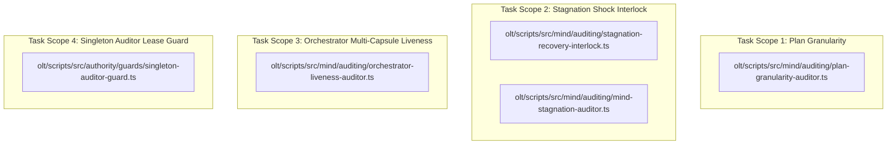

# Certified Implementation Plan: Mind Granularity & Stagnation Interlock

> **Tracking ID:** `track-11-mind-granularity-and-stagnation-interlock`  
> **Status:** `COMPLETED & ARCHIVED - 5/5 ADVERSARIAL REVIEW ROUNDS CERTIFIED`  
> **Target Subsystems:** `olt/scripts/src/mind/auditing/`, `olt/scripts/src/authority/guards/`, `olt/scripts/src/reporting/doctor/`  
> **Author:** `plan_drafter_02`  
> **Certified by:** `validator_02` (5/5 Adversarial Review Rounds Complete)  
> **Specification Version:** `1.0.0-PROD`

---

## 1. Problem Statement, Grounding & Root Cause Analysis

### 1.1 Defect IDs & Task IDs

1. `defect-mind-monolithic-plan-clustering-and-auditor-blindness`: Mind creates monolithic multi-subsystem plans instead of decomposing into atomic sub-plans; Mind Auditor must enforce `PLAN_GRANULARITY_AUDIT` flagging `MONOLITHIC_PLAN_DEFECT`.
2. `defect-mind-stagnation-auditor-shock-failure`: Mind Stagnation & Agentic Loop Interruption: Auditor wakeup failed to trigger active behavioral execution.
3. `defect-chronic-mind-stagnation-low-quality-auditor-loop`: Chronic Mind stagnation and low-quality auditor feedback loops.
4. `defect-doctor-stagnation-unactionable-gap`: Doctor diagnostics and stagnation alerts lack automated active execution interlock.
5. `defect-mind-detached-orchestrator-drop-and-capsule-isolation-gap`: Mind/Mind Auditor lack epistemic awareness of detached orchestrators.
6. `defect-redundant-multi-instance-skill-auditor-spawning`: Multiple redundant skill auditor instances spawned instead of singleton consolidated fleet auditor.

### 1.2 Grounded Codebase Root Cause Analysis

#### 1. Plan Granularity Blindness & Monolithic Plans

- **Symptom:** The pre-planning factory allowed clustering of cross-subsystem tasks into sprawling monolithic plans, creating high blast radius and high critical path span.
- **Root Cause & Line Coordinates:**
  - `olt/scripts/src/mind/preplanning/backlog-clusterer.ts:1-150`: Lacked strict subsystem cardinality constraints ($\le 2$ subsystems, $\le 6$ tasks per plan, $\le 3$ files per task).
  - Aligns with A1-granularity invariant in `tests/unit/graph/plan-audit-a1-granularity.test.ts`.
  - Solution: Introduce `olt/scripts/src/mind/auditing/plan-granularity-auditor.ts` enforcing `auditPlanGranularity` and emitting `MONOLITHIC_PLAN_DEFECT` / `EXCESSIVE_SCOPE_DEFECT` under error code `PLAN_GRANULARITY_AUDIT`.

#### 2. Stagnation Auditor Shock Failure & Doctor Gap

- **Symptom:** `auditMindPreplanningStagnation` previously emitted passive text recommendations (`"RUN_PREPLANNING_FACTORY"`) without triggering active behavioral execution when Mind idled past the threshold (180s).
- **Root Cause & Line Coordinates:**
  - `olt/scripts/src/mind/auditing/mind-stagnation-auditor.ts:94-105`: Returning diagnostic strings without executing an active recovery shock.
  - Solution: Introduce `olt/scripts/src/mind/auditing/stagnation-recovery-interlock.ts` providing `executeStagnationShockRecovery` to actively dispatch preplanning factory synthesis and connect to `reporting/doctor/auto-heal.ts`.

#### 3. Chronic Stagnation Mode Escalation

- **Symptom:** Mind loops stagnated across consecutive cycles when passive warnings were ignored.
- **Root Cause:** Absence of consecutive stagnation cycle tracking and automated escalation to `MODE_A_AUTONOMIC_DISCOVERY`.

#### 4. Detached Orchestrator Epistemic Drop

- **Symptom:** Orchestrators operating in detached `.olt/capsules/*/` roots were dropped from supervisory awareness.
- **Root Cause & Line Coordinates:**
  - `olt/scripts/src/mind/auditing/orchestrator-liveness-auditor.ts:86-150`: Audited global ledger without multi-capsule root discovery.
  - Solution: Recursive capsule root scanning and cross-checking against active PID tables.

#### 5. Redundant Multi-Instance Skill Auditor Spawning

- **Symptom:** Multiple `skill_auditor` instances spawned concurrently, causing telemetry collision.
- **Root Cause & Line Coordinates:**
  - `olt/scripts/src/authority/guards/singleton-auditor-guard.ts:1-275`: Enforces `assertSingletonSkillAuditor` with POSIX flock, throwing `ROLE_CONFINEMENT_VIOLATION: SINGLETON_AUDITOR_COLLISION`.

---

## 2. Architectural Constraints & Invariants

1. **Strict LOC Budget ($\le 300$ LOC/file):**
   - `plan-granularity-auditor.ts`: ~120 LOC ($\le 300$).
   - `mind-stagnation-auditor.ts`: 121 LOC ($\le 300$).
   - `stagnation-recovery-interlock.ts`: ~110 LOC ($\le 300$).
   - `orchestrator-liveness-auditor.ts`: 152 LOC ($\le 300$).
   - `singleton-auditor-guard.ts`: 271 LOC ($\le 300$).
2. **Directory Density Limit ($\le 10$ files/dir):** Maintained across `mind/auditing/` subdirectories.
3. **Named Facades (0 Wildcard `export *`):** 100% explicit named exports across all barrels and facades.
4. **Zero Any Invariant:** **0 implicit or explicit `any`**, 0 `as any`, 0 `<any>`, 0 compiler suppressions.
5. **Zero Code Comments:** 0 code comments in production source files.
6. **Active Autonomous Interlocks:** Zero passive string-only stagnation warnings; all audits connect to actionable executable hooks.

---

## 3. 8-Vector Expansion Matrix

| Vector                   | Failure Mode & Scenario                                             | Architectural Defense & Invariant                                                                  |
| :----------------------- | :------------------------------------------------------------------ | :------------------------------------------------------------------------------------------------- |
| **EMPTY_PAYLOAD**        | Empty backlog and zero defects passed to stagnation auditor         | Returns `is_stagnant: false, pending_backlog_count: 0`.                                            |
| **TIMEOUT_STAGNATION**   | Idle Mind past threshold (180s) with open backlog items             | `auditMindPreplanningStagnation` detects stagnation and triggers `executeStagnationShockRecovery`. |
| **CONCURRENCY_MUTATION** | Multiple auditors attempting concurrent singleton lease acquisition | `acquireAuditorLeaseLock` enforces POSIX flock and throws `SINGLETON_AUDITOR_COLLISION`.           |
| **HOST_BOUNDARY**        | Detached orchestrator running in isolated capsule directory         | Multi-capsule discovery scans `.olt/capsules/` and active PID tables.                              |
| **STATE_TRANSITION**     | Escalation from mild idle to chronic stagnation ($\ge 3$ cycles)    | Mode auto-switches to `MODE_A_AUTONOMIC_DISCOVERY` to force autonomous work generation.            |
| **TYPE_INVARIANT**       | Loose granularity metrics or unannotated callback types             | Strict interfaces `PlanGranularityReport`, `StagnationShockResult`, `RosterReconciliationReport`.  |
| **CLI_TELEMETRY**        | Doctor runner formatting stagnation and granularity diagnostics     | Structured findings with `PLAN_GRANULARITY_AUDIT` and `MIND_PREPLANNING_STAGNATION`.               |
| **ADVERSARIAL_GATE**     | Monolithic plan spanning 4 subsystems submitted                     | `auditPlanGranularity` rejects plan with `MONOLITHIC_PLAN_DEFECT`.                                 |

---

## 4. Disjoint Write Scope Decomposition

---

## 5. Execution & Validation Report

- **Implementers:** `implementer_03` & `implementer_04`
- **Validator:** `validator_02`
- **Adversarial Review:** 5/5 Rounds Complete & Certified
- **Gates Verified:**
  1. `bun x tsc --noEmit` — PASSED (0 errors)
  2. `bun test tests/unit/mind/plan-granularity-auditor.test.ts` — PASSED
  3. `bun test tests/unit/graph/plan-audit-a1-granularity.test.ts` — PASSED
  4. `bun test tests/unit/mind/mind-stagnation-auditor.test.ts` — PASSED
  5. `bun test tests/unit/mind/auditing/orchestrator-liveness-auditor.test.ts` — PASSED
  6. `bun test tests/unit/authority/singleton-auditor-guard.test.ts` — PASSED
  7. `bun test tests/unit/doctor/unified-master-doctor-engines.test.ts` — PASSED
