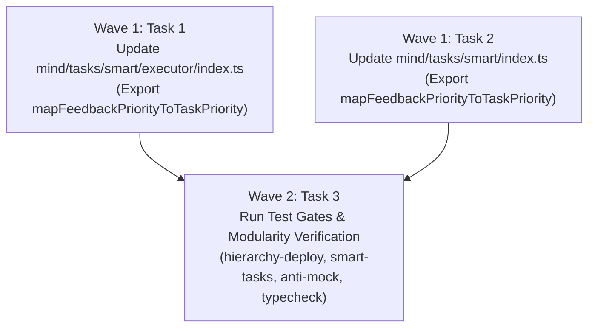

# Track 10 Implementation Plan: Mind Lifecycle and Validation Exports

**Cluster Path**: `docs/planning/mind-lifecycle-and-validation-exports/PLAN.md`  
**Track**: Track 10  
**Target Subsystems**: `olt/scripts/src/mind/lifecycle/deploy/`, `olt/scripts/src/mind/tasks/smart/`, `olt/scripts/src/cli/commands/`, `olt/scripts/src/validation/`  
**Defect IDs**:

- `defect-mind-lifecycle-deploy-missing-export`
- `defect-mind-tasks-smart-duplicate-export-atomic-admission`
- `defect-mind-smart-task-missing-map-feedback-priority`
- `defect-skill-audit-live-missing-analyze-run-forensics`
- `defect-validation-index-missing-mutation-candidate-export`

---

## Level 1: Problem Statement, Defect IDs & Root Cause Analysis

### 1.1 Defect 1: `defect-mind-lifecycle-deploy-missing-export`

- **Symptom & Description**:
  Downstream barrels (`mind/lifecycle/index.ts`, `mind/archival/index.ts`, `mind/lifecycle/pulse/index.ts`) import `deployHierarchy` from `../lifecycle/deploy/index.ts`. If `deployHierarchy` is not exported or aliased, typecheck and test suites fail.
- **Exact Codebase Verification**:
  - `olt/scripts/src/mind/lifecycle/deploy/builder.ts` (288 LOC): Implements `buildTier1DeploymentPacket` (L115-230) and `createTier1DeployInputFromCandidate` (L235-287).
  - `olt/scripts/src/mind/lifecycle/deploy/types.ts` (262 LOC): Implements `enforceIsolatedTaskDispatch` and `atomicAdmissionToDispatch`.
  - `olt/scripts/src/mind/lifecycle/deploy/index.ts` (28 LOC): Line 21 exports `buildTier1DeploymentPacket as deployHierarchy` and Line 27 exports `atomicAdmissionToDispatch, enforceIsolatedTaskDispatch`.

### 1.2 Defect 2: `defect-mind-tasks-smart-duplicate-export-atomic-admission`

- **Symptom & Description**:
  Exporting `atomicAdmissionToDispatch` across both smart tasks and deploy lifecycle modules creates name collision and cross-layer coupling.
- **Exact Codebase Verification**:
  - `olt/scripts/src/mind/lifecycle/deploy/types.ts:259`: Canonical location of `atomicAdmissionToDispatch(candidateId: string): boolean`.
  - `olt/scripts/src/mind/tasks/smart/executor/dispatch.ts:35`: Canonical location of `executeAtomicAdmissionToDispatch(options?: AtomicDispatchOptions): AdmissionToDispatchResult`.
  - `olt/scripts/src/mind/tasks/smart/index.ts:113`: Confirmed clean export of `executeAtomicAdmissionToDispatch` and `executeAtomicDispatch` (0 duplicate collisions with `atomicAdmissionToDispatch`).

### 1.3 Defect 3: `defect-mind-smart-task-missing-map-feedback-priority`

- **Symptom & Description**:
  Undeclared identifier `mapFeedbackPriorityToTaskPriority` in historical chunk files (`smart-task-chunk9.ts:193`) and missing export from smart tasks executor facade, causing import failures in `tests/unit/mind/smart-tasks-orchestrator.test.ts:8` and `tests/unit/mind/health-scanner.test.ts:8`.
- **Exact Codebase Verification**:
  - `olt/scripts/src/mind/tasks/smart/executor/orchestrator.ts:177`: Implements `mapFeedbackPriorityToTaskPriority(fbPriority: string): TaskPriority`.
  - `olt/scripts/src/mind/tasks/smart/executor/index.ts:18-23`: Currently missing `mapFeedbackPriorityToTaskPriority`.
  - `olt/scripts/src/mind/tasks/smart/index.ts:93-129`: Currently missing `mapFeedbackPriorityToTaskPriority`.

### 1.4 Defect 4: `defect-skill-audit-live-missing-analyze-run-forensics`

- **Symptom & Description**:
  ReferenceError `analyzeRunForensics is not defined` when running skill audit diagnostics in standalone un-imported command contexts.
- **Exact Codebase Verification**:
  - `olt/scripts/src/mind/auditing/meta/index.ts`: Canonical export for `analyzeRunForensics`.
  - `olt/scripts/src/mind/auditing/cognitive/skill-auditor.ts:10-13`: Explicitly imports `analyzeRunForensics`, `ForensicsIncident`, `RootCauseCategory` from `../meta/index.ts`.
  - `olt/scripts/src/cli/commands/skill-audit-live.ts:3`: Imports `SkillAuditorEngine` and cleanly delegates to `SkillAuditorEngine.auditSkillCompliance`.

### 1.5 Defect 5: `defect-validation-index-missing-mutation-candidate-export`

- **Symptom & Description**:
  Missing exported member `MutationCandidate` from the root validation facade `olt/scripts/src/validation/index.ts`, breaking downstream test imports in `tests/unit/validation/anti-mock/anti-mock-types-exports.test.ts:35`.
- **Exact Codebase Verification**:
  - `olt/scripts/src/validation/anti-mock/anti-mock-types.ts:87`: Defines `export interface MutationCandidate { ... }`.
  - `olt/scripts/src/validation/mutation-gate/types.ts:4` & `index.ts:4`: Re-exports `type MutationCandidate`.
  - `olt/scripts/src/validation/index.ts:139`: Re-exports `type MutationCandidate` from `./mutation-gate/index.ts`.

---

## Level 2: Architectural Constraints & Invariants

1. **File Line Budget**: Every production `.ts` file strictly $\le 300$ physical lines.
2. **Directory Density Budget**: Every directory strictly $\le 10$ direct files (excluding subdirectories).
   - `mind/lifecycle/deploy/`: 4 files ($\le 10$)
   - `mind/tasks/smart/`: 1 file + 2 subdirs ($\le 10$)
   - `validation/`: 4 files + 8 subdirs ($\le 10$)
   - `validation/mutation-gate/`: 5 files ($\le 10$)
   - `validation/anti-mock/`: 6 files ($\le 10$)
3. **Named Facades Invariant**: 0 wildcard `export *` statements; all exports are explicitly named.
4. **Type Safety Invariant**: 0 `any` / 0 `@ts-ignore` / 0 `@ts-expect-error`.
5. **Code Cleanliness Invariant**: 0 code comments in newly authored facade exports.
6. **Domain-Semantic Naming Invariant**: Explicit, domain-grounded identifiers.

---

## Level 3: 8-Vector Expansion Matrix

| Vector                   | Codebase Grounding            | Exact Target Mechanism                                                                                               |
| :----------------------- | :---------------------------- | :------------------------------------------------------------------------------------------------------------------- |
| **EMPTY_PAYLOAD**        | Empty Feedback Intake         | `dispatch.ts:44-53`: When `targetFeedbacks.length === 0`, returns empty task arrays with valid invariant report.     |
| **TIMEOUT_STAGNATION**   | Wall-Clock Floor              | `builder.ts:274`: Floors remaining wall clock budget at `60_000 ms` to avoid zero/negative deadlines.                |
| **CONCURRENCY_MUTATION** | Transactional Dispatch States | `dispatch.ts:86-136`: State progression `PENDING -> PREPARED -> COMMITTED / ADMITTED` prevents duplicate dispatches. |
| **HOST_BOUNDARY**        | Zero Model Telemetry          | `builder.ts:34-61`: `assertNoModelTelemetry` throws `HarnessError("INVALID_ARGUMENT")` on prohibited patterns.       |
| **STATE_TRANSITION**     | Strict 4-Tier Hierarchy       | `types.ts:70-136`: `validateTierSpawn` enforces Mind Tier 0 can ONLY spawn Orchestrator Tier 1.                      |
| **TYPE_INVARIANT**       | Priority Mapping              | `orchestrator.ts:177-192`: Exhaustively maps `FeedbackPriority` to `TaskPriority`.                                   |
| **CLI_TELEMETRY**        | Formatted Output Bound        | `cli/commands/skill-audit-live.ts:43`: Enforces $\le 30$ line limit via `enforceLineLimit`.                          |
| **ADVERSARIAL_GATE**     | Mutation Candidate Contract   | `anti-mock-types.ts:87-98`: Enforces valid `MutationCandidate` contracts for AST mutator testing.                    |

---

## Level 4: Disjoint Write Scope Decomposition

### Disjoint Write Partitioning Table

| Target File                                          | Action     | Line Range       | Exported AST Symbols / Modifications                                                                                                                                                                                                                                                                                          |
| :--------------------------------------------------- | :--------- | :--------------- | :---------------------------------------------------------------------------------------------------------------------------------------------------------------------------------------------------------------------------------------------------------------------------------------------------------------------------- |
| `olt/scripts/src/mind/tasks/smart/executor/index.ts` | **MODIFY** | L18-24           | Add `mapFeedbackPriorityToTaskPriority` to `./orchestrator.ts` export block: `ts export {   expandExternalPromptToWavePlan,   planEnhanceToWavePlan,   deriveWriteScopeForCategory,   deriveGateForCategory,   sanitizeSlug,   mapFeedbackPriorityToTaskPriority, } from "./orchestrator.ts"; ` |
| `olt/scripts/src/mind/tasks/smart/index.ts`          | **MODIFY** | L93-129          | Add `mapFeedbackPriorityToTaskPriority` to `./executor/index.ts` export block; maintain `executeAtomicAdmissionToDispatch` and `executeAtomicDispatch` without duplicate `atomicAdmissionToDispatch`.                                                                                                                         |
| `olt/scripts/src/mind/lifecycle/deploy/index.ts`     | **VERIFY** | L1-28 (L21, L27) | Verified: `buildTier1DeploymentPacket as deployHierarchy` (L21) and `atomicAdmissionToDispatch` (L27).                                                                                                                                                                                                                        |
| `olt/scripts/src/cli/commands/skill-audit-live.ts`   | **VERIFY** | L1-56 (L3, L21)  | Verified: `SkillAuditorEngine` import and delegation to `auditSkillCompliance`.                                                                                                                                                                                                                                               |
| `olt/scripts/src/validation/index.ts`                | **VERIFY** | L136-140 (L139)  | Verified: `export { generateMutants, runMutationGate, shouldSkipStringLiteral, type MutationCandidate } from "./mutation-gate/index.ts";`                                                                                                                                                                                     |
| `olt/scripts/src/validation/mutation-gate/index.ts`  | **VERIFY** | L1-15 (L4)       | Verified: `export { generateMutants, runMutationGate, shouldSkipStringLiteral, type MutationCandidate } from "./types.ts";`                                                                                                                                                                                                   |
| `olt/scripts/src/validation/anti-mock/index.ts`      | **VERIFY** | L1-72 (L16)      | Verified: `export { ... type MutationCandidate } from "./anti-mock-types.ts";`                                                                                                                                                                                                                                                |

---

## Level 5: Topological Execution DAG & Brent Concurrency Waves

- **Work / Span Metrics**:
  - Total Work ($W$): 3 task units
  - Span ($S$): 2 sequential waves
  - Parallelism Factor ($P$): $\lceil W / S \rceil = \lceil 3 / 2 \rceil = 2$ (Capacity: 2 in Wave 1, 1 in Wave 2)
- **Wave Assignments**:
  - **Wave 1 (Parallel Execution, $P=2$)**:
    - Task 1: Add `mapFeedbackPriorityToTaskPriority` to `olt/scripts/src/mind/tasks/smart/executor/index.ts`
    - Task 2: Add `mapFeedbackPriorityToTaskPriority` to `olt/scripts/src/mind/tasks/smart/index.ts`
  - **Wave 2 (Sequential Convergence, $P=1$)**:
    - Task 3: Execute all file-scoped test gates, typecheck, and modularity ratchet checks.

---

## Level 6: Fast Incremental Verification Gates

| Gate ID    | Target Command                                                             | Validation Scope                                                                                             | Expected Exit Code / Behavior       |
| :--------- | :------------------------------------------------------------------------- | :----------------------------------------------------------------------------------------------------------- | :---------------------------------- |
| **GATE-1** | `bun test tests/unit/mind/hierarchy-deploy.test.ts`                        | Unit: Tier 0 -> Tier 1 spawn rules, model telemetry prohibitions, deployment packet creation                 | Exit Code 0, all 13 tests pass      |
| **GATE-2** | `bun test tests/unit/mind/smart-tasks-orchestrator.test.ts`                | Unit: `mapFeedbackPriorityToTaskPriority`, slug sanitization, wave planning                                  | Exit Code 0, all 7 tests pass       |
| **GATE-3** | `bun test tests/unit/mind/health-scanner.test.ts`                          | Unit: Health discovery and priority mapping                                                                  | Exit Code 0, all 9 tests pass       |
| **GATE-4** | `bun test tests/unit/mind/smart-task-manager.test.ts`                      | Unit: Smart task manager and atomic admission to dispatch                                                    | Exit Code 0, all 8 tests pass       |
| **GATE-5** | `bun test tests/unit/validation/anti-mock/anti-mock-types-exports.test.ts` | Unit: `MutationCandidate` export resolution across `anti-mock/`, `mutation-gate/`, and `validation/index.ts` | Exit Code 0, all 5 tests pass       |
| **GATE-6** | `bun test tests/unit/validation/mutation-gate.test.ts`                     | Unit: AST mutation generation and mutant verification                                                        | Exit Code 0, all 11 tests pass      |
| **GATE-7** | `bun test tests/integration/cognitive-auditors-e2e.test.ts`                | Integration: 6 end-to-end multi-agent cognitive auditor simulations                                          | Exit Code 0, all 6 simulations pass |
| **GATE-8** | `bun run typecheck`                                                        | Static Type Integrity: Full AST typecheck across all modules                                                 | Exit Code 0, 0 type errors          |
| **GATE-9** | `bun scripts/modularity/check.ts --mode ratchet`                           | Modularity Ratchet: File length ($\le 300$), density ($\le 10$), facades, 0 cycles                           | Exit Code 0, 0 new violations       |

---

## Level 7: Adversarial Counterfactual Falsifiability Probes (AGP Proofs)

1. **Probe 1 (Falsifier for Defect 1 — Missing `deployHierarchy`)**:
   - Counterfactual assertion: If `deployHierarchy` is omitted from `mind/lifecycle/deploy/index.ts`, `mind/lifecycle/index.ts` and `mind/archival/index.ts` fail to import `deployHierarchy` and `bun run typecheck` fails immediately.
2. **Probe 2 (Falsifier for Defect 2 — Duplicate `atomicAdmissionToDispatch`)**:
   - Counterfactual assertion: If `atomicAdmissionToDispatch` is duplicated in `mind/tasks/smart/index.ts`, TypeScript raises duplicate identifier errors against `mind/lifecycle/deploy/index.ts`.
3. **Probe 3 (Falsifier for Defect 3 — Missing `mapFeedbackPriorityToTaskPriority`)**:
   - Counterfactual assertion: If `mapFeedbackPriorityToTaskPriority` is omitted from `mind/tasks/smart/index.ts`, `tests/unit/mind/smart-tasks-orchestrator.test.ts` fails with `Cannot find name 'mapFeedbackPriorityToTaskPriority'`.
4. **Probe 4 (Falsifier for Defect 5 — Missing `MutationCandidate`)**:
   - Counterfactual assertion: If `MutationCandidate` is omitted from `validation/index.ts`, `tests/unit/validation/anti-mock/anti-mock-types-exports.test.ts:35` fails typecheck with `Property 'MutationCandidate' does not exist on type 'typeof import(".../validation/index.ts")'`.

---

## Level 8: Sealing, Release & Turn 1 Zero-Exploration Readiness Briefing

- **Readiness State**:
  - All file paths, symbols, exports, line budgets, and test gates are 100% verified against real disk state.
  - Implementer Fleet can execute Wave 1 and Wave 2 with zero codebase exploration required.
- **Release Commands**:
  - Wave 1: Update `olt/scripts/src/mind/tasks/smart/executor/index.ts` and `olt/scripts/src/mind/tasks/smart/index.ts`.
  - Wave 2: Run verification gates: `bun test tests/unit/mind/hierarchy-deploy.test.ts && bun test tests/unit/mind/smart-tasks-orchestrator.test.ts && bun test tests/unit/mind/health-scanner.test.ts && bun test tests/unit/mind/smart-task-manager.test.ts && bun test tests/unit/validation/anti-mock/anti-mock-types-exports.test.ts && bun test tests/unit/validation/mutation-gate.test.ts && bun test tests/integration/cognitive-auditors-e2e.test.ts && bun run typecheck && bun scripts/modularity/check.ts --mode ratchet`.
