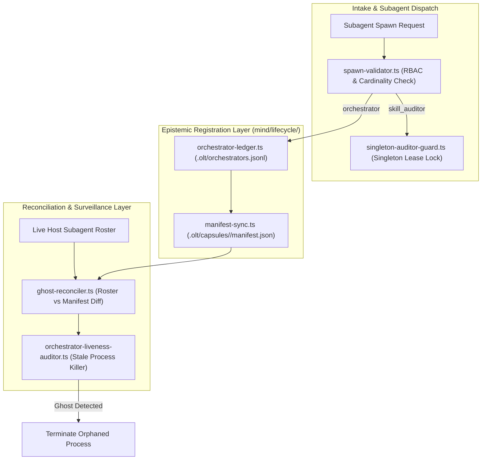

# Mind Orchestrator Lifecycle Ledger, Ghost Process Reconciliation & Singleton Auditor Plan

> **Tracking ID:** `fb-mind-orchestrator-lifecycle-reconciliation`  
> **Status:** `COMPLETED - ARCHIVED`  
> **Parent Blueprint:** `docs/planning/mind-continuous-preplanning-factory-engine/PLAN.md`  
> **Target Subsystems:** `olt/scripts/src/mind/lifecycle/`, `olt/scripts/src/authority/guards/`, `olt/scripts/src/mind/auditing/`  
> **Author:** Tier 0 Strategic Mind Supervisor & Master Concurrency Architect  
> **Specification Version:** `2.0.0-PROD`

---

[Overview](#1-executive-summary--core-motivation) | [Architecture](#2-architectural-specifications--mathematical-models) | [TypeScript Contracts](#3-typescript-schemas--concrete-contracts) | [Execution Tasks](#4-modular-work-breakdown--execution-waves) | [Traceability Matrix](#5-defect--backlog-traceability-matrix) | [Acceptance Invariants](#6-strict-compliance-invariants--acceptance-checklist)

---

## 1. Executive Summary & Core Motivation

In distributed multi-agent execution environments, coordinating Tier 1 Orchestrator processes and system-wide watchdog auditors requires rigorous epistemic tracking and strict cardinality controls:

1. **Untracked & Detached Orchestrators (Ghost Processes):** When supervisory seats launch Tier 1 Orchestrators without registering cryptographic bindings in both the run capsule (`.olt/capsules/<run_id>/manifest.json`) and the Mind lifecycle ledger (`.olt/orchestrators.jsonl`), orphaned subagents can continue executing in isolation after parent timeouts or restarts.
2. **Audit State Desynchronization:** Without bidirectional reconciliation between the active host process roster and capsule ledgers, the Mind Auditor cannot reliably detect dead, hung, or detached orchestrators.
3. **Auditor Fleet Duplication & Resource Waste:** Spawning multiple concurrent `skill_auditor` instances generates duplicate surveillance ticks, race conditions on defect ledgers, and unnecessary token burn. The harness mandates a strict **Singleton Skill Auditor Fleet Constraint** ($\text{count}(\text{skill\_auditor}) \equiv 1$).

This plan delivers:

- An **Epistemic Orchestrator Lifecycle Ledger (`orchestrator-ledger.ts`, `manifest-sync.ts`)** recording process ID, conversation ID, capsule run ID, genesis timestamp, and parent correlation keys under POSIX flock.
- A **Ghost & Detached Orchestrator Reconciliation Engine (`ghost-reconciler.ts`, `orchestrator-liveness-auditor.ts`)** matching active subagents against capsule manifests and terminating orphaned processes.
- A **Singleton Skill Auditor Fleet Guard (`singleton-auditor-guard.ts`, `spawn-validator.ts`)** using flock-locked atomic lease tokens to reject redundant or duplicate auditor spawns across all hosts.

---

## 2. Architectural Specifications & Mathematical Models



### 2.1 Epistemic Lifecycle Registration Protocol

For any Tier 1 Orchestrator $\mathcal{O}$:
$$\mathcal{O}_{\text{record}} = \langle \text{orchestrator\_id}, \text{run\_id}, \text{conversation\_id}, \text{pid}, \text{host\_type}, \text{spawned\_at}, \text{status}, \text{sha256\_manifest\_pin} \rangle$$

1. **Atomic Write Protocol:**
   - Acquires exclusive POSIX lock on `.olt/orchestrators.lock`.
   - Appends $\mathcal{O}_{\text{record}}$ to `.olt/orchestrators.jsonl`.
   - Synchronizes record into `.olt/capsules/<run_id>/manifest.json`.
   - Computes Merkle genesis binding $\text{SHA256}(\mathcal{O}_{\text{record}} \parallel \text{manifest\_bytes})$.

### 2.2 Ghost Process Detection & Reconciliation Mathematics

Let $\mathcal{R}_{\text{live}}$ be the set of live subagents discovered on the host and $\mathcal{L}_{\text{registered}}$ be the set of active orchestrators in the ledger.
$$\text{Ghosts} = \{ a \in \mathcal{R}_{\text{live}} \mid a.\text{role} = \text{"orchestrator"} \land a.\text{id} \notin \mathcal{L}_{\text{registered}} \}$$
$$\text{Zombies} = \{ o \in \mathcal{L}_{\text{registered}} \mid o.\text{status} = \text{"ACTIVE"} \land o.\text{id} \notin \mathcal{R}_{\text{live}} \land (\text{now}() - o.\text{last\_heartbeat} > 300\text{s}) \}$$

1. **Ghost Reconciliation Action:**
   - For every $g \in \text{Ghosts}$: Log `GHOST_ORCHESTRATOR_DETECTED_DEFECT`, send termination signal (`SIGTERM`), and record quarantine entry.
2. **Zombie Reconciliation Action:**
   - For every $z \in \text{Zombies}$: Transition status in ledger to `ZOMBIE_RECLAIMED` and release all associated task leases back to `retry_ready`.

### 2.3 Singleton Skill Auditor Fleet Constraint

$$\text{ActiveAuditors} = \{ a \in \mathcal{R}_{\text{live}} \mid a.\text{role} = \text{"skill_auditor"} \land a.\text{status} = \text{"ACTIVE"} \}$$
$$\text{Invariant: } |\text{ActiveAuditors}| \le 1$$

- Spawning a second `skill_auditor` attempts to acquire `.olt/locks/skill_auditor.lock`.
- If held by an active live process, `spawn-validator.ts` immediately rejects the spawn with `DUPLICATE_SINGLETON_AUDITOR_ERROR`.

### 2.4 Zero Empty-Pulse Churn & Informational Telemetry Density

- Supervisory cadences (Mind pulses, Orchestrator round pulses, Coordinator wave heartbeats) suppress disk writes on empty iterations where 0 state mutations, 0 queue transitions, and 0 defect promotions occur.
- Only actionable delta updates, milestone completions, and error escalations emit persistent events, preventing log file bloat across long idle or wait intervals.

### 2.5 Zero-Copy In-Place Skill Execution

- Mind and Orchestrator lifecycle operations execute directly against the checked-out repository source root, strictly forbidding runtime copying or cloning of skill assets into `.olt/`.

---

## 3. TypeScript Schemas & Concrete Contracts

All interfaces enforce **0 `any`** and **0 compiler suppressions**.

```typescript
export type OrchestratorLifecycleStatus =
  "INITIALIZING" | "ACTIVE" | "COMPLETED" | "FAILED" | "ZOMBIE_RECLAIMED" | "GHOST_TERMINATED";

export interface OrchestratorRegistrationRecord {
  readonly orchestrator_id: string;
  readonly run_id: string;
  readonly conversation_id: string;
  readonly pid: number;
  readonly host_type: "antigravity" | "claude_code" | "codex" | "cursor";
  readonly spawned_at: string;
  readonly status: OrchestratorLifecycleStatus;
  readonly manifest_sha256: string;
  readonly last_heartbeat_at: string;
}

export interface GhostOrchestratorFinding {
  readonly process_id: number;
  readonly subagent_id: string;
  readonly conversation_id?: string | undefined;
  readonly detected_at: string;
  readonly reason: "UNREGISTERED_IN_LEDGER" | "DESYNCHRONIZED_MANIFEST" | "DETACHED_ORPHAN";
  readonly action_taken: "TERMINATED" | "QUARANTINED" | "ALERTED";
}

export interface AuditorLeaseLock {
  readonly auditor_id: string;
  readonly pid: number;
  readonly host_type: string;
  readonly acquired_at: string;
  readonly lease_expires_at: string;
  readonly lock_token: string;
}

export interface RosterReconciliationReport {
  readonly total_active_orchestrators: number;
  readonly ghost_processes_found: readonly GhostOrchestratorFinding[];
  readonly zombies_reclaimed: readonly string[];
  readonly singleton_auditor_compliant: boolean;
  readonly timestamp: string;
}
```

---

## 4. Modular Work Breakdown & Execution Waves

Tasks target $\le 3$ files each, comply with 5-minute SLAs ($P = \lceil W / S \rceil$), and enforce anti-stub failure criteria.

```text
Wave 1 (Epistemic Ledger & Manifest Sync) ──► [Task 1.1: Orchestrator Ledger] + [Task 1.2: Manifest Sync Engine]
                                                   │
                                                   ▼
Wave 2 (Ghost Reconciler & Liveness)      ──► [Task 2.1: Ghost Process Engine] + [Task 2.2: Liveness Auditor]
                                                   │
                                                   ▼
Wave 3 (Singleton Auditor Fleet Guard)    ──► [Task 3.1: Singleton Lease Lock] + [Task 3.2: Spawn Request Validator]
                                                   │
                                                   ▼
Wave 4 (Integration Verification & E2E)   ──► [Task 4.1: Lifecycle Reconciliation E2E Suite]
```

### Wave 1: Epistemic Registration Ledger & Capsule Sync

#### Task 1.1: Orchestrator Epistemic Lifecycle Ledger

- **Target Files (Max 2):**
  - `olt/scripts/src/mind/lifecycle/orchestrator-ledger.ts`
  - `tests/unit/mind/lifecycle/orchestrator-ledger.test.ts`
- **Write Scope:** `olt/scripts/src/mind/lifecycle/`
- **Read-Only Scope:** `olt/scripts/src/engine/store/`
- **SLA:** 4 minutes ($W=2, S=1, P=2$)
- **Symbols Exported:** `registerOrchestratorSpawn()`, `deregisterOrchestrator()`, `loadOrchestratorLedger()`, `updateOrchestratorHeartbeat()`
- **Anti-Stub Failure Criteria:**
  - Registrations without valid non-empty PID, conversationId, and run_id must throw `INVALID_REGISTRATION_RECORD`.
  - Concurrent process writes must serialize under POSIX flock with 0 lost rows.
- **Verification Gate:** `bun test tests/unit/mind/lifecycle/orchestrator-ledger.test.ts`

#### Task 1.2: Capsule Manifest Binding & Sync Engine

- **Target Files (Max 2):**
  - `olt/scripts/src/mind/lifecycle/manifest-sync.ts`
  - `tests/unit/mind/lifecycle/manifest-sync.test.ts`
- **Write Scope:** `olt/scripts/src/mind/lifecycle/`
- **Read-Only Scope:** `olt/scripts/src/engine/store/hierarchy/`
- **SLA:** 4 minutes ($W=2, S=1, P=2$)
- **Symbols Exported:** `syncOrchestratorToManifest()`, `validateCapsuleManifestBinding()`, `computeManifestSha256Pin()`
- **Anti-Stub Failure Criteria:**
  - Desynchronized manifest (where manifest orchestrator ID does not match ledger) must fail verification with `MANIFEST_DESYNC_ERROR`.
- **Verification Gate:** `bun test tests/unit/mind/lifecycle/manifest-sync.test.ts`

---

### Wave 2: Ghost & Detached Orchestrator Reconciliation

#### Task 2.1: Ghost Process Detection & Termination Engine

- **Target Files (Max 2):**
  - `olt/scripts/src/mind/lifecycle/ghost-reconciler.ts`
  - `tests/unit/mind/lifecycle/ghost-reconciler.test.ts`
- **Write Scope:** `olt/scripts/src/mind/lifecycle/`
- **Read-Only Scope:** `olt/scripts/src/mind/lifecycle/orchestrator-ledger.ts`
- **SLA:** 5 minutes ($W=2, S=1, P=2$)
- **Symbols Exported:** `reconcileOrchestratorRoster()`, `detectGhostOrchestrators()`, `terminateDetachedOrchestrator()`
- **Anti-Stub Failure Criteria:**
  - Simulating an untracked orchestrator subagent PID must flag `GhostOrchestratorFinding` and issue termination call.
  - Tracked, valid orchestrators must never be terminated.
- **Verification Gate:** `bun test tests/unit/mind/lifecycle/ghost-reconciler.test.ts`

#### Task 2.2: Orchestrator Liveness & Zombie Auditor

- **Target Files (Max 2):**
  - `olt/scripts/src/mind/auditing/orchestrator-liveness-auditor.ts`
  - `tests/unit/mind/auditing/orchestrator-liveness-auditor.test.ts`
- **Write Scope:** `olt/scripts/src/mind/auditing/`
- **Read-Only Scope:** `olt/scripts/src/mind/lifecycle/`
- **SLA:** 4 minutes ($W=2, S=1, P=2$)
- **Symbols Exported:** `auditOrchestratorLiveness()`, `reclaimZombieOrchestrator()`, `RosterReconciliationReport`
- **Anti-Stub Failure Criteria:**
  - Orchestrators with dead PID or heartbeats older than 300s must be transitioned to `ZOMBIE_RECLAIMED` and leases freed.
- **Verification Gate:** `bun test tests/unit/mind/auditing/orchestrator-liveness-auditor.test.ts`

---

### Wave 3: Singleton Skill Auditor Fleet Guard

#### Task 3.1: Singleton Skill Auditor Lease Lock

- **Target Files (Max 2):**
  - `olt/scripts/src/authority/guards/singleton-auditor-guard.ts`
  - `tests/unit/authority/singleton-auditor-guard.test.ts`
- **Write Scope:** `olt/scripts/src/authority/guards/`
- **Read-Only Scope:** `olt/scripts/src/logging/lock.ts`
- **SLA:** 4 minutes ($W=2, S=1, P=2$)
- **Symbols Exported:** `assertSingletonSkillAuditor()`, `acquireAuditorLeaseLock()`, `releaseAuditorLeaseLock()`, `AuditorLeaseLock`
- **Anti-Stub Failure Criteria:**
  - Attempting to acquire lease while an active `skill_auditor` process is running must fail with `SINGLETON_AUDITOR_COLLISION`.
  - If holding PID is dead (`kill(pid, 0) === false`), auto-cleans stale lock and grants lease.
- **Verification Gate:** `bun test tests/unit/authority/singleton-auditor-guard.test.ts`

#### Task 3.2: Subagent Spawn Request Cardinality Validator

- **Target Files (Max 2):**
  - `olt/scripts/src/authority/guards/spawn-validator.ts`
  - `tests/unit/authority/spawn-validator.test.ts`
- **Write Scope:** `olt/scripts/src/authority/guards/`
- **Read-Only Scope:** `olt/scripts/src/authority/guards/singleton-auditor-guard.ts`
- **SLA:** 4 minutes ($W=2, S=1, P=2$)
- **Symbols Exported:** `validateSubagentSpawnRequest()`, `rejectDuplicateAuditorSpawn()`
- **Anti-Stub Failure Criteria:**
  - Spawning a second `skill_auditor` is rejected at the authority layer before tool execution.
- **Verification Gate:** `bun test tests/unit/authority/spawn-validator.test.ts`

---

### Wave 4: Integration Verification & Concurrency Suite

#### Task 4.1: Orchestrator Lifecycle & Singleton Auditor E2E Suite

- **Target Files (Max 1):**
  - `tests/e2e/mind/orchestrator-lifecycle-reconciliation.test.ts`
- **Write Scope:** `tests/e2e/mind/orchestrator-lifecycle-reconciliation.test.ts`
- **Read-Only Scope:** Full harness codebase
- **SLA:** 5 minutes ($W=1, S=1, P=1$)
- **Symbols Exported:** Complete E2E integration test suite
- **Anti-Stub Failure Criteria:**
  - Simulates 3 concurrent orchestrators, 2 ghost processes, 1 zombie timeout, and duplicate `skill_auditor` spawn attempts.
  - Proves 100% detection, zero orphan leaks, exact singleton enforcement, and clean state recovery.
- **Verification Gate:** `bun test tests/e2e/mind/orchestrator-lifecycle-reconciliation.test.ts`

---

## 5. Defect & Backlog Traceability Matrix

| Defect / Backlog ID                     | Description                                             | Component Resolution                                           | Concrete Symbols                                              | Discriminating Verification Gate                                 |
| :-------------------------------------- | :------------------------------------------------------ | :------------------------------------------------------------- | :------------------------------------------------------------ | :--------------------------------------------------------------- |
| `fb-orchestrator-epistemic-ledger`      | Untracked orchestrator spawns cause ghost processes.    | Epistemic ledger & capsule manifest synchronization.           | `registerOrchestratorSpawn`, `syncOrchestratorToManifest`     | `bun test tests/unit/mind/lifecycle/orchestrator-ledger.test.ts` |
| `fb-ghost-orchestrator-reconciliation`  | Detached subagents continue running after parent loss.  | Active roster diffing & automated ghost termination.           | `detectGhostOrchestrators`, `terminateDetachedOrchestrator`   | `bun test tests/unit/mind/lifecycle/ghost-reconciler.test.ts`    |
| `fb-singleton-skill-auditor-constraint` | Duplicate `skill_auditor` instances cause ledger churn. | Flock-locked singleton lease guard rejecting duplicate spawns. | `assertSingletonSkillAuditor`, `validateSubagentSpawnRequest` | `bun test tests/unit/authority/singleton-auditor-guard.test.ts`  |

---

## 6. Strict Compliance Invariants & Acceptance Checklist

1. **0 TypeScript `any` & 0 Compiler Suppressions:** AST purity scanner verifies zero `@ts-ignore`, `@ts-expect-error`, or `any` types.
2. **Strict File & Directory Limits:** Every source file $\le 300$ physical lines; every directory $\le 10$ files.
3. **Flock-Protected Ledgers:** All lifecycle mutations to `.olt/orchestrators.jsonl` acquire POSIX locks.
4. **Strict Cardinality Constraint:** Exactly 1 `skill_auditor` instance active fleet-wide ($\le 1$).
5. **Immediate Git Staging (`git add -A`):** Upon completing any task or milestone, stage all files immediately to persist loose Git objects to disk for reflog safety.
