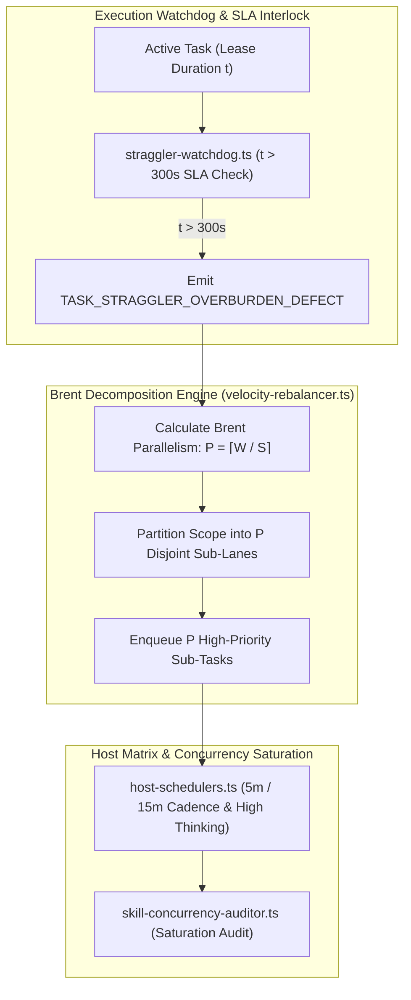

# Mind 5-Minute Straggler SLA & Brent Concurrency Engine Plan

> **Tracking ID:** `fb-mind-straggler-concurrency-engine`  
> **Status:** `PLANNED - READY FOR EXECUTION`  
> **Parent Blueprint:** `docs/planning/mind-continuous-preplanning-factory-engine/PLAN.md`  
> **Target Subsystems:** `olt/scripts/src/watchdog/`, `olt/scripts/src/orchestrator/`, `olt/scripts/src/mind/auditing/`  
> **Author:** Tier 0 Strategic Mind Supervisor & Master Concurrency Architect  
> **Specification Version:** `2.0.0-PROD`

---

[Overview](#1-executive-summary--core-motivation) | [Architecture](#2-architectural-specifications--mathematical-models) | [TypeScript Contracts](#3-typescript-schemas--concrete-contracts) | [Execution Tasks](#4-modular-work-breakdown--execution-waves) | [Traceability Matrix](#5-defect--backlog-traceability-matrix) | [Acceptance Invariants](#6-strict-compliance-invariants--acceptance-checklist)

---

## 1. Executive Summary & Core Motivation

In distributed multi-agent systems, overall wave velocity is bounded by the slowest executing subagent. Uncontrolled worker stragglers introduce critical system-level drag:

1. **Single-Worker Straggler Bottlenecks:** A single subagent tasked with a wide scope (e.g. modifying 10 files) stalls the entire downstream dependency DAG.
2. **False Zombie Diagnoses (`hb-s7-coordinator-diagnosed-live-agent-as-dead`):** Naive watchdog timers killed active, working agents rather than dynamically decomposing their overburdened scopes.
3. **Under-Parallelization & Idle Slots (`defect-mind-smart-task-duplicate-identifier-rebalance-tasks`):** Orchestrators assigned single workers to monolithic tasks instead of saturating available worker slots.
4. **Host Cadence Mismatch (`fb-host-schedulers-matrix-cadence-thinking`):** Heterogeneous LLM hosts ran with inconsistent cadence settings and missing thinking parameters.

This plan delivers:

- The **5-Minute Straggler SLA Interlock (`straggler-watchdog.ts`)**: Automatically flags `TASK_STRAGGLER_OVERBURDEN_DEFECT` whenever a task runs $> 300\text{s}$ without progress receipt.
- The **Brent Concurrency Decomposition Engine (`velocity-rebalancer.ts`)**: Evaluates remaining work $W$ and span $S$, computes optimal parallelism $P = \lceil W / S \rceil$ (clamped $[5, 15]$), and partitions the task into disjoint 2-4 minute sub-lane scopes.
- The **Host Schedulers Matrix & Thinking Engine (`host-schedulers.ts`)**: Enforces exact host cadences (5m for Antigravity/Cursor, 15m for Claude/Codex) and high thinking across all tiers.
- The **Skill Auditor Concurrency Saturation Engine (`skill-concurrency-auditor.ts`)**: Audits worker pool utilization and flags under-parallelized waves.

---

## 2. Architectural Specifications & Mathematical Models



### 2.1 5-Minute Straggler SLA & Brent Decomposition Mathematics

1. **5-Minute SLA Rule:**
   $$\text{IsStraggler}(T) \iff (T.\text{status} \in \{ \text{"LEASED"}, \text{"RUNNING"} \}) \land (\text{now}() - T.\text{claimed\_at} > 300\text{s}) \land (\text{now}() - T.\text{last\_progress} > 120\text{s})$$

2. **Brent's Work-Span Concurrency Theorem:**
   Let $W$ be remaining work units (e.g. remaining unverified files) and $S$ be estimated span length (critical path depth).
   $$P_{\text{optimal}} = \text{clamp}\left( \left\lceil \frac{W}{S} \right\rceil, \min=5, \max=15 \right)$$
   - Each resulting sub-partition $p_i$ targets execution duration:
     $$T_{\text{target}}(p_i) \in [120\text{s}, 240\text{s}] \quad (2\text{ to } 4\text{ minutes})$$
   - Write scopes are strictly disjoint: $\text{Scope}(p_i) \cap \text{Scope}(p_j) = \emptyset$ for $i \ne j$.

### 2.2 Host Schedulers Matrix & Thinking Invariants

| Host Scheduler | Default Cadence       | Tier 0–2 Model & Thinking           | Tier 3 Model & Thinking             | SLA Timeout         |
| :------------- | :-------------------- | :---------------------------------- | :---------------------------------- | :------------------ |
| `antigravity`  | **5 minutes** (300s)  | `gemini-3.7-flash` (High Thinking)  | `gemini-3.7-flash` (High Thinking)  | 300s                |
| `claude_code`  | **15 minutes** (900s) | `claude-5-opus` (High Thinking)     | `claude-5-sonnet` (High Thinking)   | 900s (sub-5m timer) |
| `codex`        | **15 minutes** (900s) | `gpt-5.6-sol` (High Thinking)       | `gpt-5.6-terra` (High Thinking)     | 900s (sub-5m timer) |
| `cursor`       | **5 minutes** (300s)  | Cursor Latest Model (High Thinking) | Cursor Latest Model (High Thinking) | 300s                |

---

## 3. TypeScript Schemas & Concrete Contracts

All interfaces enforce **0 `any`** and **0 compiler suppressions**.

```typescript
export interface StragglerAssessment {
  readonly task_id: string;
  readonly agent_id: string;
  readonly elapsed_seconds: number;
  readonly is_straggler: boolean;
  readonly recommended_action: "DECOMPOSE_PARALLEL" | "RECLAIM_LEASE" | "CONTINUE";
  readonly decomposition_plan?: BrentConcurrencyPlan | undefined;
}

export interface BrentConcurrencyPlan {
  readonly active_workers: number;
  readonly remaining_work_units: number;
  readonly span_length: number;
  readonly optimal_parallelism: number;
  readonly estimated_subagent_duration_seconds: number;
  readonly sub_partitions: readonly {
    readonly subtask_id: string;
    readonly assigned_scope: readonly string[];
    readonly target_duration_seconds: number;
  }[];
}

export interface HostSchedulerConfig {
  readonly host_id: "antigravity" | "claude_code" | "codex" | "cursor";
  readonly default_cadence_seconds: number;
  readonly tier_0_2_model: string;
  readonly tier_0_2_thinking: "high" | "medium" | "low" | "none";
  readonly tier_3_model: string;
  readonly tier_3_thinking: "high" | "medium" | "low" | "none";
  readonly max_single_task_seconds: number;
}

export interface ConcurrencySaturationReport {
  readonly totalSlots: number;
  readonly activeSlots: number;
  readonly saturationRatio: number;
  readonly underParallelizedTasks: readonly string[];
  readonly isSaturated: boolean;
}
```

---

## 4. Modular Work Breakdown & Execution Waves

Tasks target $\le 3$ files each, comply with 5-minute SLAs ($P = \lceil W / S \rceil$), and enforce anti-stub failure criteria.

```text
Wave 1 (Straggler Watchdog & SLA)      ──► [Task 1.1: 5-Minute Straggler Watchdog]
                                                │
                                                ▼
Wave 2 (Brent Decomposition Engine)    ──► [Task 2.1: Brent Parallel Decomposition Engine]
                                                │
                                                ▼
Wave 3 (Host Matrix & Saturation)      ──► [Task 3.1: Host Schedulers Engine] + [Task 3.2: Skill Saturation Auditor]
                                                │
                                                ▼
Wave 4 (Concurrency E2E Suite)         ──► [Task 4.1: Straggler Decomposition E2E Suite]
```

### Wave 1: 5-Minute Task Straggler Watchdog

#### Task 1.1: Autonomic 5-Minute Straggler Watchdog

- **Target Files (Max 2):**
  - `olt/scripts/src/watchdog/straggler-watchdog.ts`
  - `tests/unit/watchdog/straggler-watchdog.test.ts`
- **Write Scope:** `olt/scripts/src/watchdog/`
- **Read-Only Scope:** `olt/scripts/src/engine/store/`
- **SLA:** 4 minutes ($W=2, S=1, P=2$)
- **Symbols Exported:** `assessTaskStragglerStatus()`, `checkActiveTaskStragglers()`, `StragglerAssessment`
- **Anti-Stub Failure Criteria:**
  - Tasks running $> 300\text{s}$ without progress must emit `TASK_STRAGGLER_OVERBURDEN_DEFECT`.
  - Active tasks with recent progress within 120s must return `is_straggler: false`.
- **Verification Gate:** `bun test tests/unit/watchdog/straggler-watchdog.test.ts`

---

### Wave 2: Brent Concurrency & Dynamic Decomposition

#### Task 2.1: Brent Work-Span Decomposition Engine

- **Target Files (Max 2):**
  - `olt/scripts/src/orchestrator/velocity-rebalancer.ts`
  - `tests/unit/orchestrator/velocity-rebalancer.test.ts`
- **Write Scope:** `olt/scripts/src/orchestrator/`
- **Read-Only Scope:** `olt/scripts/src/watchdog/`
- **SLA:** 5 minutes ($W=2, S=1, P=2$)
- **Symbols Exported:** `calculateBrentDecomposition()`, `decomposeStragglingTask()`, `BrentConcurrencyPlan`
- **Anti-Stub Failure Criteria:**
  - Input of 12 work units with span 1 must produce $P = 12$ sub-partitions.
  - Parallel sub-partitions must have 100% disjoint file write scopes.
- **Verification Gate:** `bun test tests/unit/orchestrator/velocity-rebalancer.test.ts`

---

### Wave 3: Host Schedulers Matrix & Concurrency Saturation

#### Task 3.1: Host Schedulers Matrix & Thinking Configurator

- **Target Files (Max 2):**
  - `olt/scripts/src/orchestrator/host-schedulers.ts`
  - `tests/unit/orchestrator/host-schedulers.test.ts`
- **Write Scope:** `olt/scripts/src/orchestrator/`
- **Read-Only Scope:** `olt/scripts/src/policy/`
- **SLA:** 4 minutes ($W=2, S=1, P=2$)
- **Symbols Exported:** `getHostSchedulerConfig()`, `assertHostThinkingPolicy()`, `HostSchedulerConfig`
- **Anti-Stub Failure Criteria:**
  - All host profiles must enforce `thinking_effort: "high"`.
  - Validates 300s timeout for Antigravity/Cursor and 900s for Claude/Codex.
- **Verification Gate:** `bun test tests/unit/orchestrator/host-schedulers.test.ts`

#### Task 3.2: Skill Auditor Concurrency Saturation Engine

- **Target Files (Max 2):**
  - `olt/scripts/src/mind/auditing/skill-concurrency-auditor.ts`
  - `tests/unit/mind/skill-concurrency-auditor.test.ts`
- **Write Scope:** `olt/scripts/src/mind/auditing/`
- **Read-Only Scope:** `olt/scripts/src/orchestrator/`
- **SLA:** 4 minutes ($W=2, S=1, P=2$)
- **Symbols Exported:** `auditConcurrencySaturation()`, `ConcurrencySaturationReport`
- **Anti-Stub Failure Criteria:**
  - Emits warning if $> 5$ tasks are queued while $< 2$ worker slots are occupied.
- **Verification Gate:** `bun test tests/unit/mind/skill-concurrency-auditor.test.ts`

---

### Wave 4: Concurrency Rebalancing E2E Suite

#### Task 4.1: Straggler Decomposition & Rebalancing E2E Suite

- **Target Files (Max 1):**
  - `tests/e2e/orchestrator/straggler-concurrency.test.ts`
- **Write Scope:** `tests/e2e/orchestrator/straggler-concurrency.test.ts`
- **Read-Only Scope:** Full harness
- **SLA:** 5 minutes ($W=1, S=1, P=1$)
- **Symbols Exported:** Complete E2E integration test suite
- **Anti-Stub Failure Criteria:**
  - Simulates an overburdened worker stall at $t=305\text{s}$, verifies straggler detection, Brent decomposition into 8 subagents, and rapid 180s convergence.
- **Verification Gate:** `bun test tests/e2e/orchestrator/straggler-concurrency.test.ts`

---

## 5. Defect & Backlog Traceability Matrix

| Defect / Backlog ID                                           | Description                                              | Component Resolution                                  | Concrete Symbols              | Discriminating Verification Gate                               |
| :------------------------------------------------------------ | :------------------------------------------------------- | :---------------------------------------------------- | :---------------------------- | :------------------------------------------------------------- |
| `hb-s7-coordinator-diagnosed-live-agent-as-dead`              | Live working agents killed instead of decomposed.        | Progress-aware straggler assessment & decomposition.  | `assessTaskStragglerStatus`   | `bun test tests/unit/watchdog/straggler-watchdog.test.ts`      |
| `defect-mind-smart-task-duplicate-identifier-rebalance-tasks` | Duplicate identifiers generated during task rebalancing. | Deterministic sub-partition hashing in Brent engine.  | `calculateBrentDecomposition` | `bun test tests/unit/orchestrator/velocity-rebalancer.test.ts` |
| `fb-host-schedulers-matrix-cadence-thinking`                  | Missing thinking configs and cadence divergence.         | Host Schedulers Engine standardizing high thinking.   | `getHostSchedulerConfig`      | `bun test tests/unit/orchestrator/host-schedulers.test.ts`     |
| `fb-codex-watchdog-child-cadence-liveness`                    | Child worker cadence liveness checks.                    | Watchdog heartbeat scanner with 120s progress window. | `checkActiveTaskStragglers`   | `bun test tests/unit/watchdog/straggler-watchdog.test.ts`      |

---

## 6. Strict Compliance Invariants & Acceptance Checklist

1. **0 TypeScript `any` & 0 Compiler Suppressions:** AST purity scanner verifies zero `@ts-ignore`, `@ts-expect-error`, or `any` types.
2. **Strict File & Directory Limits:** Every source file $\le 300$ physical lines; every directory $\le 10$ files.
3. **5-Minute SLA Hard Enforcement:** Any task exceeding 300s without progress triggers decomposition.
4. **Disjoint Partitioning:** All sub-partitions generated by Brent decomposition possess mutually exclusive write scopes.
5. **Immediate Git Staging (`git add -A`):** Upon completing any task or milestone, stage all files immediately to persist loose Git objects to disk for reflog safety.
