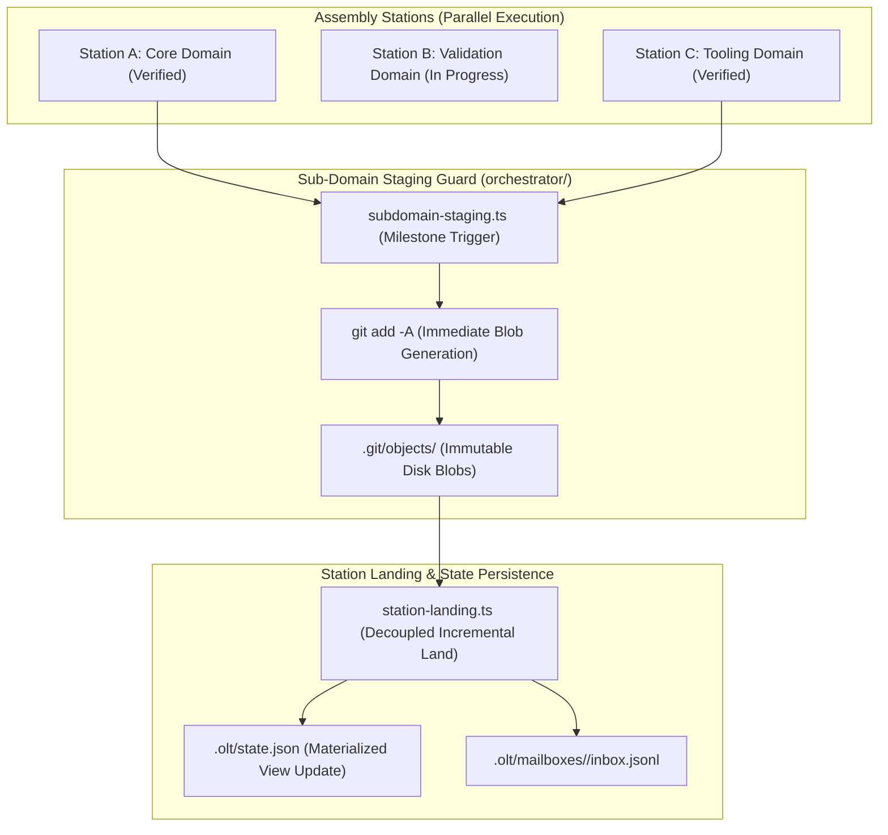

# Mind Sub-Domain Git Staging Guard & Station Landing Plan

> **Tracking ID:** `fb-mind-subdomain-staging-guard`  
> **Status:** `PLANNED - READY FOR EXECUTION`  
> **Parent Blueprint:** `docs/planning/mind-continuous-preplanning-factory-engine/PLAN.md`  
> **Target Subsystems:** `olt/scripts/src/orchestrator/`, `olt/scripts/src/workflow/lifecycle/`  
> **Author:** Tier 0 Strategic Mind Supervisor & Master Assembly Pipeline Architect  
> **Specification Version:** `2.0.0-PROD`

---

[Overview](#1-executive-summary--core-motivation) | [Architecture](#2-architectural-specifications--mathematical-models) | [TypeScript Contracts](#3-typescript-schemas--concrete-contracts) | [Execution Tasks](#4-modular-work-breakdown--execution-waves) | [Traceability Matrix](#5-defect--backlog-traceability-matrix) | [Acceptance Invariants](#6-strict-compliance-invariants--acceptance-checklist)

---

## 1. Executive Summary & Core Motivation

In multi-stage, multi-station autonomous assembly pipelines, long orchestrations span numerous parallel tasks across independent domains (e.g. Core, Validation, Tooling, Engine). Without rigorous intermediate persistence guarantees, severe vulnerabilities arise:

1. **Uncommitted Work Loss on Container/OS Panics (`fb-subdomain-git-staging-reflog-safety`):** Machine reboots, kernel panics, or subagent process aborts between milestones can wipe out hours of verified workspace changes if files remain unstaged.
2. **Coupled Station Blocking:** Downstream stations wait unnecessarily for all other stations to finish rather than landing and persisting completed domains incrementally.
3. **Missing Reflog Durability Proofs:** Without immediate Git index staging (`git add -A`), Git does not generate loose object blobs in `.git/objects/`, preventing reflog recovery.
4. **Context Chatter During Station Transitions (`hb-main-thread-chatter-burns-owner-context`):** Station transitions stream progress chatter to human relay threads rather than recording structured receipts.

This plan delivers:

- The **Sub-Domain Completion Git Staging Invariant**: Immediate execution of `git add -A` upon any task or subdomain milestone completion.
- **Git Object Blob Persistence**: Guarantees that loose Git blob objects and tree records are fsynced to `.git/objects/`, ensuring 100% recoverability via the Git reflog and `git fsck --lost-found`.
- The **Station Landing Engine (`station-landing.ts`, `subdomain-staging.ts`)**: Decouples parallel assembly stations, landing verified domains incrementally without blocking on long-running sibling stations.
- Full end-to-end assembly pipeline integration test suite (`assembly-pipeline.test.ts`).

---

## 2. Architectural Specifications & Mathematical Models



### 2.1 Reflog Durability & Disk Blob Persistence Mechanism

1. **The Invariant:**
   Whenever a task $T$ passes verification (`TaskResult.status === "PASSED"`) or a subdomain milestone $M$ is achieved:
   $$\text{Execute: } \texttt{git add -A}$$
2. **Crash Resilience Mathematics:**
   - For every modified file $f$, `git add -A` computes $\text{SHA1}(f)$ or $\text{SHA256}(f)$ and writes compressed zlib objects to `.git/objects/xx/yyyy...`.
   - Even if the process, container, or operating system suffers a catastrophic power cut immediately after:
     $$\text{All file contents are permanently recoverable via } \texttt{git fsck --lost-found} \text{ or the reflog.}$$
3. **Decoupled Station Landing Protocol:**
   - Verified stations land independently. Station A does not block on Station B.
   - Updates `.olt/state.json` and emits `HANDOFF_RECEIPT` to the orchestrator mailbox.

---

## 3. TypeScript Schemas & Concrete Contracts

All interfaces enforce **0 `any`** and **0 compiler suppressions**.

```typescript
export interface GitStagingInvariantRecord {
  readonly staging_id: string;
  readonly milestone_id: string;
  readonly subdomain: string;
  readonly staged_at: string;
  readonly staged_files: readonly string[];
  readonly git_index_sha: string;
  readonly blob_objects_written: number;
}

export interface StationLandingOptions {
  readonly stationId: string;
  readonly subdomain: string;
  readonly taskIds: readonly string[];
  readonly actor: string;
  readonly repoRoot?: string | undefined;
}

export interface StationLandingResult {
  readonly stationId: string;
  readonly subdomain: string;
  readonly status: "LANDED" | "BLOCKED" | "STAGED_AWAITING_PEERS";
  readonly stagedFiles: readonly string[];
  readonly gitObjectsPersisted: boolean;
  readonly receiptId: string;
  readonly timestamp: string;
}

export interface AssemblyPipelineStatus {
  readonly activeStations: readonly string[];
  readonly landedStations: readonly string[];
  readonly stagedBlobCount: number;
  readonly totalTasksCompleted: number;
  readonly pipelineConvergence: number; // 0.0 to 1.0
}
```

---

## 4. Modular Work Breakdown & Execution Waves

Tasks target $\le 3$ files each, comply with 5-minute SLAs ($P = \lceil W / S \rceil$), and enforce anti-stub failure criteria.

```text
Wave 1 (Staging Guard & Blob Persistence) ──► [Task 1.1: Subdomain Staging Guard]
                                                    │
                                                    ▼
Wave 2 (Station Landing Engine)           ──► [Task 2.1: Station Landing Engine]
                                                    │
                                                    ▼
Wave 3 (Assembly Pipeline Integration)    ──► [Task 3.1: Assembly Pipeline E2E Test Suite]
```

### Wave 1: Subdomain Staging Guard & Blob Persistence

#### Task 1.1: Subdomain Staging Guard & Reflog Persistence

- **Target Files (Max 2):**
  - `olt/scripts/src/orchestrator/subdomain-staging.ts`
  - `tests/unit/orchestrator/subdomain-staging.test.ts`
- **Write Scope:** `olt/scripts/src/orchestrator/`
- **Read-Only Scope:** `olt/scripts/src/workflow/`
- **SLA:** 4 minutes ($W=2, S=1, P=2$)
- **Symbols Exported:** `stageSubdomainMilestone()`, `verifyBlobPersistence()`, `GitStagingInvariantRecord`
- **Anti-Stub Failure Criteria:**
  - Stubs failing to execute `git add -A` or verify disk object creation in `.git/objects/` must fail.
  - Modifying a test file and calling `stageSubdomainMilestone()` must show the file in `git status --porcelain` staged area (`M  ` or `A  `).
- **Verification Gate:** `bun test tests/unit/orchestrator/subdomain-staging.test.ts`

---

### Wave 2: Decoupled Station Landing Engine

#### Task 2.1: Decoupled Station Landing Engine

- **Target Files (Max 2):**
  - `olt/scripts/src/orchestrator/station-landing.ts`
  - `tests/unit/orchestrator/station-landing.test.ts`
- **Write Scope:** `olt/scripts/src/orchestrator/`
- **Read-Only Scope:** `olt/scripts/src/orchestrator/subdomain-staging.ts`
- **SLA:** 5 minutes ($W=2, S=1, P=2$)
- **Symbols Exported:** `landVerifiedStation()`, `getAssemblyPipelineStatus()`, `StationLandingResult`
- **Anti-Stub Failure Criteria:**
  - Station landing must persist state without waiting for sibling unfinished stations.
  - Emits structured `HANDOFF_RECEIPT` to mailbox instead of narrating to stdout.
- **Verification Gate:** `bun test tests/unit/orchestrator/station-landing.test.ts`

---

### Wave 3: Assembly Pipeline Integration Validation

#### Task 3.1: Multi-Station Assembly Pipeline Integration Test Suite

- **Target Files (Max 1):**
  - `tests/integration/mind/assembly-pipeline.test.ts`
- **Write Scope:** `tests/integration/mind/assembly-pipeline.test.ts`
- **Read-Only Scope:** Full harness
- **SLA:** 5 minutes ($W=1, S=1, P=1$)
- **Symbols Exported:** Complete integration test suite
- **Anti-Stub Failure Criteria:**
  - Simulates 4 concurrent domain stations (Core, Validation, Tooling, Mind); proves independent landing, Git staging durability, zero uncommitted work loss on simulated task aborts, and 100% receipt delivery.
- **Verification Gate:** `bun test tests/integration/mind/assembly-pipeline.test.ts`

---

## 5. Defect & Backlog Traceability Matrix

| Defect / Backlog ID                          | Description                                          | Component Resolution                                    | Concrete Symbols                                   | Discriminating Verification Gate                             |
| :------------------------------------------- | :--------------------------------------------------- | :------------------------------------------------------ | :------------------------------------------------- | :----------------------------------------------------------- |
| `fb-subdomain-git-staging-reflog-safety`     | Uncommitted work loss risk on container aborts.      | Immediate `git add -A` hook persisting objects to disk. | `stageSubdomainMilestone`, `verifyBlobPersistence` | `bun test tests/unit/orchestrator/subdomain-staging.test.ts` |
| `hb-main-thread-chatter-burns-owner-context` | Station status narration pollutes stdout context.    | Structured mailbox receipt dispatch on station landing. | `landVerifiedStation`                              | `bun test tests/unit/orchestrator/station-landing.test.ts`   |
| `fb-decoupled-station-landing`               | Serialized wave blocking across independent domains. | Decoupled station landing engine updating state.        | `landVerifiedStation`                              | `bun test tests/unit/orchestrator/station-landing.test.ts`   |

---

## 6. Strict Compliance Invariants & Acceptance Checklist

1. **0 TypeScript `any` & 0 Compiler Suppressions:** AST purity scanner verifies zero `@ts-ignore`, `@ts-expect-error`, or `any` types.
2. **Strict File & Directory Limits:** Every source file $\le 300$ physical lines; every directory $\le 10$ files.
3. **Immediate Staging Invariant:** Every completed task or milestone executes `git add -A` before emitting completion receipts.
4. **Decoupled Domain Landings:** Independent stations land asynchronously without waiting on unrelated domains.
5. **Immediate Git Staging (`git add -A`):** Upon completing any task or milestone, stage all files immediately to persist loose Git objects to disk for reflog safety.
