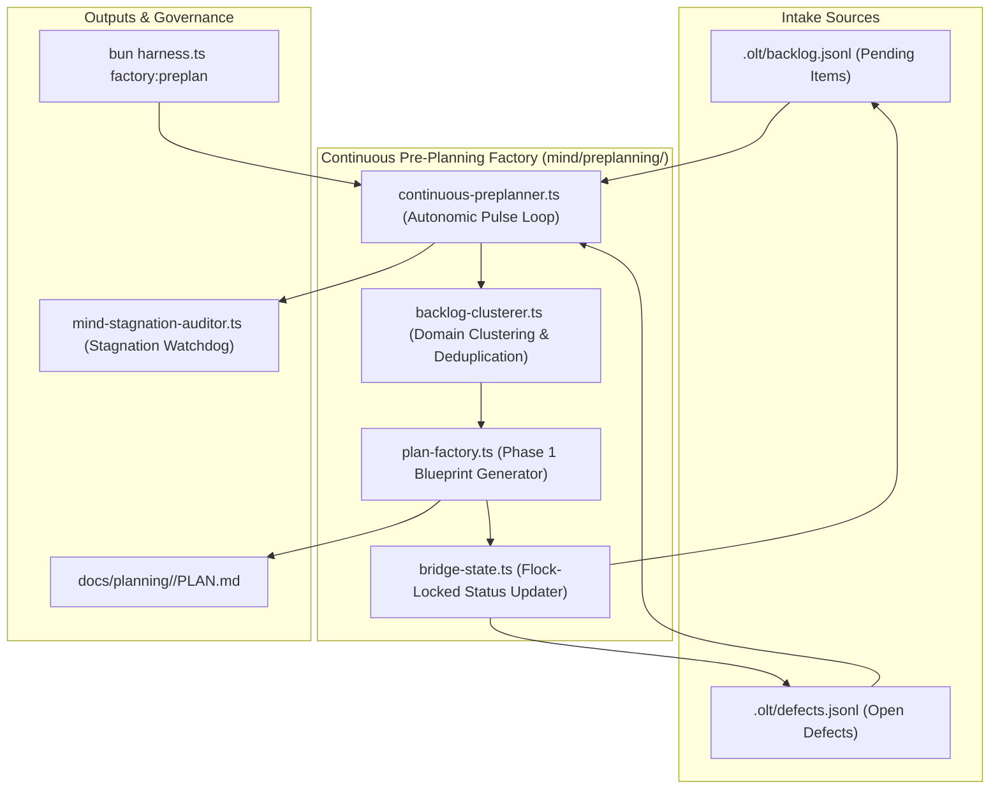

# Mind Thematic Roadmap Clustering & Continuous Pre-Planning Factory Plan

> **Tracking ID:** `fb-mind-thematic-cluster-engine`  
> **Status:** `PLANNED - READY FOR EXECUTION`  
> **Parent Blueprint:** `docs/planning/mind-continuous-preplanning-factory-engine/PLAN.md`  
> **Target Subsystems:** `olt/scripts/src/mind/preplanning/`, `olt/scripts/src/mind/auditing/`, `olt/scripts/src/cli/commands/`  
> **Author:** Tier 0 Strategic Mind Supervisor & Infinite Product Owner  
> **Specification Version:** `2.0.0-PROD`

---

[Overview](#1-executive-summary--core-motivation) | [Architecture](#2-architectural-specifications--mathematical-models) | [TypeScript Contracts](#3-typescript-schemas--concrete-contracts) | [Execution Tasks](#4-modular-work-breakdown--execution-waves) | [Traceability Matrix](#5-defect--backlog-traceability-matrix) | [Acceptance Invariants](#6-strict-compliance-invariants--acceptance-checklist)

---

## 1. Executive Summary & Core Motivation

In high-throughput autonomous development environments, idle waiting between task waves and fragmented manual planning severely throttle engineering velocity:

1. **Serialized Planning Bottlenecks:** When planning is coupled synchronously to wave completion, workers sit idle waiting for new task blueprints to be drafted.
2. **Fragmented Backlog & Defect Triage:** Loose defect entries and strategic backlog requests lack thematic cohesion, causing duplicate or conflicting implementations.
3. **Passive Mind Auditor Syndrome (`fb-codex-watchdog-child-cadence-liveness`):** Supervisory roles idle during worker execution cycles rather than continuously scanning backlog queues and formulating upstream blueprints.
4. **Mechanical Chunk Naming & Syntax Splitting (`defect-naive-line-splitting-breaks-ast-syntax`, `defect-mechanical-chunk-naming-anti-pattern`):** Naive planning generators emit mechanical, arbitrary file-chunk splits that break TypeScript AST syntax.

This plan delivers:

- A non-stop, autonomic Mind Continuous Pre-Planning Factory continuously scanning `.olt/backlog.jsonl` and `.olt/defects.jsonl`.
- Thematic Clustering Engine (`backlog-clusterer.ts`) grouping items into domain clusters (`core`, `validation`, `tooling`, `engine`, `mind`, `reporting`).
- Phase 1 Plan Formulation Engine (`plan-factory.ts`) auto-generating comprehensive, AST-aware blueprints under `docs/planning/<cluster>/PLAN.md`.
- Bridge State Transition (`bridge-state.ts`) setting `status: "PLANNED"` and linking `plan_path` under POSIX flock.
- Mind Stagnation Auditor (`mind-stagnation-auditor.ts`) enforcing zero idle time and flagging `MIND_PREPLANNING_STAGNATION`.
- CLI pre-planning operations (`factory-ops.ts`).

---

## 2. Architectural Specifications & Mathematical Models



### 2.1 Thematic Clustering Mathematics & Domain Partitioning

Let $\mathcal{B}$ be pending backlog items and $\mathcal{D}$ be open defect records.

1. **Domain Affinity Mapping:**
   $$\text{Domain}(x) \in \{ \text{"core"}, \text{"validation"}, \text{"tooling"}, \text{"engine"}, \text{"mind"}, \text{"reporting"} \}$$
2. **Deterministic Cluster Identifier:**
   $$\text{ClusterID} = \text{domain} \parallel \text{"-"} \parallel \text{SHA256}(\text{SortedIDs}(\mathcal{B}_k \cup \mathcal{D}_k))[0 \dots 7]$$
3. **Bridge State Invariant:**
   For every admitted item $x \in \mathcal{B}_k \cup \mathcal{D}_k$, `bridge-state.ts` executes an atomic flock write setting:
   $$x.\text{status} \leftarrow \text{"PLANNED"}, \quad x.\text{plan\_path} \leftarrow \text{"docs/planning/"} \parallel \text{ClusterID} \parallel \text{"/PLAN.md"}$$

---

## 3. TypeScript Schemas & Concrete Contracts

All interfaces enforce **0 `any`** and **0 compiler suppressions**.

```typescript
export type BacklogItemStatus = "PENDING" | "PLANNED" | "DISPATCHED" | "PROCESSED" | "BLOCKED";
export type DefectStatus = "OPEN" | "PLANNED" | "IN_PROGRESS" | "RESOLVED" | "REOPENED";

export interface ThematicCluster {
  readonly cluster_id: string;
  readonly domain: "core" | "validation" | "tooling" | "engine" | "mind" | "reporting";
  readonly title: string;
  readonly plan_path: string;
  readonly backlog_item_ids: readonly string[];
  readonly defect_ids: readonly string[];
  readonly planned_at: string;
}

export interface PlanGenerationOptions {
  readonly cluster: ThematicCluster;
  readonly targetSubsystems: readonly string[];
  readonly author: string;
  readonly repoRoot?: string | undefined;
}

export interface MindAuditorStagnationReport {
  readonly isStagnant: boolean;
  readonly unclusteredBacklogCount: number;
  readonly unclusteredDefectCount: number;
  readonly idleDurationSeconds: number;
  readonly violationCode?: "MIND_PREPLANNING_STAGNATION" | undefined;
}
```

---

## 4. Modular Work Breakdown & Execution Waves

Tasks target $\le 3$ files each, comply with 5-minute SLAs ($P = \lceil W / S \rceil$), and enforce anti-stub failure criteria.

```text
Wave 1 (Clustering & Plan Generation) ──► [Task 1.1: Backlog Clusterer] + [Task 1.2: Blueprint Factory & Bridge]
                                                │
                                                ▼
Wave 2 (Autonomic Loop & Stagnation)  ──► [Task 2.1: Continuous Loop]   + [Task 2.2: Mind Stagnation Auditor]
                                                │
                                                ▼
Wave 3 (CLI Operations & E2E Suite)   ──► [Task 3.1: Factory CLI Ops]   + [Task 3.2: Preplanning E2E Suite]
```

### Wave 1: Backlog Clustering & Blueprint Factory

#### Task 1.1: Backlog & Defect Thematic Clusterer

- **Target Files (Max 2):**
  - `olt/scripts/src/mind/preplanning/types.ts`
  - `olt/scripts/src/mind/preplanning/backlog-clusterer.ts`
- **Write Scope:** `olt/scripts/src/mind/preplanning/`
- **Read-Only Scope:** `olt/scripts/src/mind/`
- **SLA:** 4 minutes ($W=2, S=1, P=2$)
- **Symbols Exported:** `clusterBacklogAndDefects()`, `computeClusterId()`, `ThematicCluster`
- **Anti-Stub Failure Criteria:**
  - Unassociated backlog items in different domains must not be lumped into single arbitrary cluster.
  - Generates deterministic cluster IDs based on constituent item hashes.
- **Verification Gate:** `bun test tests/unit/mind/backlog-clusterer.test.ts`

#### Task 1.2: Phase 1 Blueprint Generator & Bridge State Updater

- **Target Files (Max 2):**
  - `olt/scripts/src/mind/preplanning/plan-factory.ts`
  - `olt/scripts/src/mind/preplanning/bridge-state.ts`
- **Write Scope:** `olt/scripts/src/mind/preplanning/`
- **Read-Only Scope:** `olt/scripts/src/mind/preplanning/types.ts`
- **SLA:** 5 minutes ($W=2, S=1, P=2$)
- **Symbols Exported:** `generatePlanBlueprint()`, `updateBridgeState()`, `assertValidBlueprintStructure()`
- **Anti-Stub Failure Criteria:**
  - Generated markdown must contain all mandatory sections (Overview, Architecture, TypeScript Contracts, Tasks, Traceability, Invariants).
  - Flips backlog and defect records to `status: "PLANNED"` with valid `plan_path` under POSIX flock.
- **Verification Gate:** `bun test tests/unit/mind/plan-factory.test.ts`

---

### Wave 2: Autonomous Continuous Loop & Stagnation Auditor

#### Task 2.1: Autonomous Zero-Idle Continuous Pre-Planner Loop

- **Target Files (Max 2):**
  - `olt/scripts/src/mind/preplanning/continuous-preplanner.ts`
  - `tests/unit/mind/continuous-preplanner.test.ts`
- **Write Scope:** `olt/scripts/src/mind/preplanning/`
- **Read-Only Scope:** `olt/scripts/src/mind/preplanning/plan-factory.ts`
- **SLA:** 4 minutes ($W=2, S=1, P=2$)
- **Symbols Exported:** `runContinuousPreplanningTick()`, `startPreplanningDaemon()`
- **Anti-Stub Failure Criteria:**
  - When pending backlog items exist, preplanner immediately triggers clustering and plan formulation without waiting for human prompts.
- **Verification Gate:** `bun test tests/unit/mind/continuous-preplanner.test.ts`

#### Task 2.2: Mind Auditor Pre-Planning Stagnation Engine

- **Target Files (Max 2):**
  - `olt/scripts/src/mind/auditing/mind-stagnation-auditor.ts`
  - `tests/unit/mind/mind-stagnation-auditor.test.ts`
- **Write Scope:** `olt/scripts/src/mind/auditing/`
- **Read-Only Scope:** `olt/scripts/src/mind/preplanning/`
- **SLA:** 4 minutes ($W=2, S=1, P=2$)
- **Symbols Exported:** `auditMindPreplanningLiveness()`, `MindAuditorStagnationReport`
- **Anti-Stub Failure Criteria:**
  - Injects `MIND_PREPLANNING_STAGNATION` defect if Mind remains idle while unprocessed backlog items exceed threshold.
- **Verification Gate:** `bun test tests/unit/mind/mind-stagnation-auditor.test.ts`

---

### Wave 3: CLI Operations & End-to-End Integration Suite

#### Task 3.1: CLI Operations for Pre-Planning Factory

- **Target Files (Max 2):**
  - `olt/scripts/src/cli/commands/factory-ops.ts`
  - `tests/unit/cli/factory-ops.test.ts`
- **Write Scope:** `olt/scripts/src/cli/commands/`
- **Read-Only Scope:** `olt/scripts/src/mind/preplanning/`
- **SLA:** 4 minutes ($W=2, S=1, P=2$)
- **Symbols Exported:** `executeFactoryPreplanCommand()`, `executeFactoryStatusCommand()`
- **Anti-Stub Failure Criteria:**
  - Running `bun harness.ts factory:preplan` triggers synchronous clustering and plan emission.
- **Verification Gate:** `bun test tests/unit/cli/factory-ops.test.ts`

#### Task 3.2: Pre-Planning Factory End-to-End Test Suite

- **Target Files (Max 1):**
  - `tests/e2e/mind/preplanning-factory.test.ts`
- **Write Scope:** `tests/e2e/mind/preplanning-factory.test.ts`
- **Read-Only Scope:** Full harness
- **SLA:** 5 minutes ($W=1, S=1, P=1$)
- **Symbols Exported:** Complete E2E integration test suite
- **Anti-Stub Failure Criteria:**
  - Simulates intake of 10 backlog items and 5 defects; asserts clean clustering, blueprint generation, bridge state updates, and stagnation auditor approval.
- **Verification Gate:** `bun test tests/e2e/mind/preplanning-factory.test.ts`

---

## 5. Defect & Backlog Traceability Matrix

| Defect / Backlog ID                              | Description                                           | Component Resolution                                   | Concrete Symbols               | Discriminating Verification Gate                           |
| :----------------------------------------------- | :---------------------------------------------------- | :----------------------------------------------------- | :----------------------------- | :--------------------------------------------------------- |
| `fb-mind-continuous-preplanning-pipeline-engine` | Idle waiting and serialized planning bottlenecks.     | Non-stop continuous pre-planning factory loop.         | `runContinuousPreplanningTick` | `bun test tests/unit/mind/continuous-preplanner.test.ts`   |
| `defect-naive-line-splitting-breaks-ast-syntax`  | Naive line splitting in plan generation breaks AST.   | AST-aware task partitioning and validation.            | `generatePlanBlueprint`        | `bun test tests/unit/mind/plan-factory.test.ts`            |
| `defect-mechanical-chunk-naming-anti-pattern`    | Arbitrary mechanical chunk naming in generated plans. | Semantic domain naming in thematic clustering.         | `computeClusterId`             | `bun test tests/unit/mind/backlog-clusterer.test.ts`       |
| `fb-codex-watchdog-child-cadence-liveness`       | Idle supervisory seats during worker execution.       | Mind stagnation auditor enforcing active pre-planning. | `auditMindPreplanningLiveness` | `bun test tests/unit/mind/mind-stagnation-auditor.test.ts` |

---

## 6. Strict Compliance Invariants & Acceptance Checklist

1. **0 TypeScript `any` & 0 Compiler Suppressions:** AST purity scanner verifies zero `@ts-ignore`, `@ts-expect-error`, or `any` types.
2. **Strict File & Directory Limits:** Every source file $\le 300$ physical lines; every directory $\le 10$ files.
3. **Flock-Protected Bridge States:** All mutations to `.olt/backlog.jsonl` and `.olt/defects.jsonl` acquire POSIX locks.
4. **Zero-Idle Invariant:** Mind autonomously pre-plans subsequent phases during active worker wave execution.
5. **Immediate Git Staging (`git add -A`):** Upon completing any task or milestone, stage all files immediately to persist loose Git objects to disk for reflog safety.
