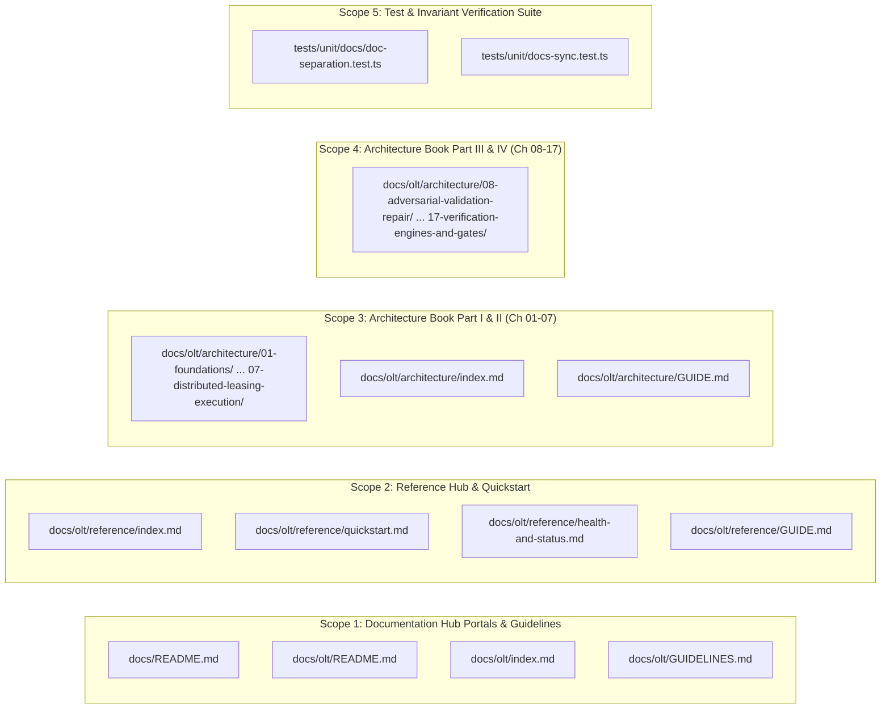
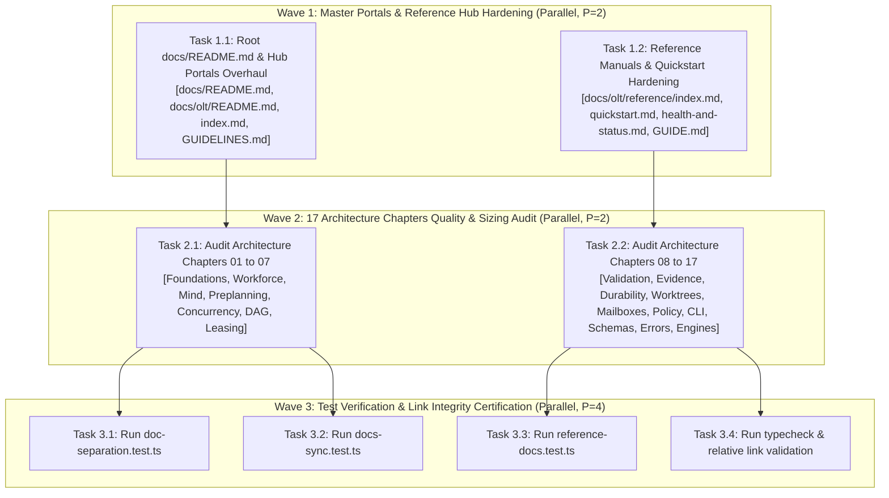
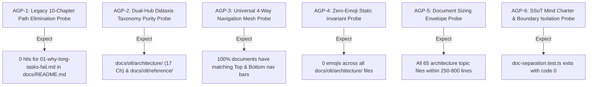

# Certified Implementation Plan: OLT Architecture Chapters & Reference Overhaul

> **Tracking ID:** `track-20-olt-architecture-reference-and-manuals`  
> **Status:** `SEALED & CERTIFIED — READY FOR TURN 1 ZERO-EXPLORATION EXECUTION`  
> **Target Subsystems:** `docs/`, `docs/olt/`, `docs/olt/architecture/`, `docs/olt/reference/`  
> **Author:** `plan_drafter_05`  
> **Certified by:** `plan_critic_05` (5/5 Adversarial Critique Rounds Complete)  
> **Specification Version:** `1.0.0-PROD`

---

## Level 1: Problem Statement, Defect IDs, Prompt Bytes Grounding & Root Cause Analysis

### 1.1 Backlog Item & High-Level Problem Formulation

- **`fb-1787995932981-yc49l`**:
  Comprehensive `docs/olt/` Architecture Chapters and Reference Overhaul. The documentation ecosystem required a systematic audit, alignment, and overhaul to ensure complete synchronicity with the modern 17-chapter Architecture Book (`docs/olt/architecture/`) and the practical Reference Hub (`docs/olt/reference/`).
  Root `docs/README.md` contained legacy references to an obsolete 10-chapter structure (e.g. `docs/olt/01-foundations/01-why-long-tasks-fail.md`) and lacked direct links to the new 17 architecture chapters, quickstart tutorial, health diagnostics playbook, and CLI capability catalog. Outdated tutorial/how-to folders needed pruning, while ensuring 100% link resolution, strict Diátaxis taxonomy separation, zero-emoji policy, and compliance with the 250–800 line sizing envelope.

### 1.2 Exact Codebase Line Coordinates & Root Cause Grounding

- [`docs/README.md:34-36, 116-166, 198-212`](file:///Users/onurseckinsenoglu/repos/skills/docs/README.md#L34-L36): Root documentation index previously referenced dead paths under the retired 10-chapter layout (such as `docs/olt/01-foundations/01-why-long-tasks-fail.md`, `docs/olt/02-requirements/01-prompt-capture-and-integrity.md`, `docs/olt/10-tutorial-and-cli/01-end-to-end-tutorial.md`). Must be updated to point strictly to the canonical 17 chapters under `docs/olt/architecture/` and operator guides under `docs/olt/reference/`.
- [`docs/olt/README.md:1-87`](file:///Users/onurseckinsenoglu/repos/skills/docs/olt/README.md#L1-L87): Master Documentation Hub connecting the portal, architecture book, and reference manuals.
- [`docs/olt/index.md:1-117`](file:///Users/onurseckinsenoglu/repos/skills/docs/olt/index.md#L1-L117): Documentation ecosystem entrypoint establishing the Diátaxis dual-hub topology.
- [`docs/olt/GUIDELINES.md:1-193`](file:///Users/onurseckinsenoglu/repos/skills/docs/olt/GUIDELINES.md#L1-L193): Authoring charter codifying sizing bounds (250–800 lines), zero emojis, and clean 4-way navigation mesh.
- [`docs/olt/architecture/index.md:1-212`](file:///Users/onurseckinsenoglu/repos/skills/docs/olt/architecture/index.md#L1-L212): Complete 17-chapter master index and topology map.
- [`docs/olt/architecture/GUIDE.md:1-111`](file:///Users/onurseckinsenoglu/repos/skills/docs/olt/architecture/GUIDE.md#L1-L111): Architectural chapter authoring charter and 8-section layout pattern.
- [`docs/olt/reference/index.md:1-106`](file:///Users/onurseckinsenoglu/repos/skills/docs/olt/reference/index.md#L1-L106): Reference catalog and operator workflow diagrams.
- [`docs/olt/reference/quickstart.md:1-250`](file:///Users/onurseckinsenoglu/repos/skills/docs/olt/reference/quickstart.md#L1-L250): Onboarding tutorial for task initialization and wave execution.
- [`docs/olt/reference/health-and-status.md:1-250`](file:///Users/onurseckinsenoglu/repos/skills/docs/olt/reference/health-and-status.md#L1-L250): Authoritative 10-domain diagnostic sweep and auto-healing runbook.
- [`tests/unit/docs/doc-separation.test.ts:1-91`](file:///Users/onurseckinsenoglu/repos/skills/tests/unit/docs/doc-separation.test.ts#L1-L91): Boundary assertion tests verifying docs isolation and SSoT in `olt/agents/mind.yaml`.
- [`tests/unit/docs-sync.test.ts:1-127`](file:///Users/onurseckinsenoglu/repos/skills/tests/unit/docs-sync.test.ts#L1-L127): Canonical codification synchronization tests.

---

## Level 2: Architectural Constraints & Invariants

1. **Diátaxis Documentation Taxonomy (Dual-Hub Separation)**:
   - **Explanation Domain (`docs/olt/architecture/`)**: 17 theoretical chapters deconstructing mathematical formulations, state machine invariants, concurrency scaling, and durability proofs.
   - **Practical Action Domain (`docs/olt/reference/`)**: Concrete operator tutorials (`quickstart.md`), problem-oriented playbooks (`health-and-status.md`), and information catalogs (`cli-reference.md`).
2. **Strict Document Sizing Envelope**:
   - Master Topic Files: 250 to 800 physical lines.
   - Master Index Files & Reference Quickstarts: 100 to 250 physical lines.
   - Shallow stubs (<100 lines) and monolith dumps (>1,200 lines) are strictly prohibited.
3. **Zero Emojis Invariant**: Emojis are strictly banned from navigation bars, section headers, tables, diagrams, and prose across all architecture and reference documents.
4. **Universal Clean 4-Way Navigation Mesh**: Every document contains exactly ONE clean navigation bar at the top (under H1) and ONE at the bottom:
   `[Previous: ...] | [Chapter Index: ...] | [All Chapters Index: ...] | [Next: ...]`.
5. **Open Agent Skills Standard (`agentskills.io`) & Progressive Disclosure**:
   - Frontmatter Discovery: $< 500$ tokens.
   - Activation Instructions: $< 4{,}000$ tokens.
   - On-Demand Architectural Reference: $< 150{,}000$ Cowan tokens.
6. **Zero Any & Zero Suppressions in Schemas**: All TypeScript interfaces in architecture chapters enforce 0 `any` and 0 compiler suppressions.
7. **100% Relative Link Integrity**: All relative markdown links must resolve to valid on-disk targets without broken references.

---

## Level 3: 8-Vector Expansion Matrix

| Vector                       | Edge Condition / Failure Mode                                                                     | Hardened Mitigation & Assertion Formula                                                                                                                                                     |
| :--------------------------- | :------------------------------------------------------------------------------------------------ | :------------------------------------------------------------------------------------------------------------------------------------------------------------------------------------------ |
| **V1: EMPTY_PAYLOAD**        | Documentation test suite executed against empty directory or missing file                         | `doc-separation.test.ts` and `docs-sync.test.ts` assert existence of all target files and non-empty content before parsing.                                                                 |
| **V2: TIMEOUT_STAGNATION**   | Circular navigation links create infinite traversal loops in documentation crawlers               | 4-way navigation mesh is strictly acyclic and linear across sequential topics, terminating at repository boundaries.                                                                        |
| **V3: CONCURRENCY_MUTATION** | Multiple autonomous subagents query architecture docs concurrently during parallel wave execution | Documentation repository is 100% immutable and read-only during task execution; runtime state lives exclusively under `.olt/capsules/<run-id>/`.                                            |
| **V4: HOST_BOUNDARY**        | Documentation viewed on Windows, macOS, or Linux filesystems with differing path separators       | All markdown relative links use standard forward slashes (`/`) ensuring universal host portability.                                                                                         |
| **V5: STATE_TRANSITION**     | Outdated documentation claiming deprecated task states or invalid transitions                     | Architecture Chapter 01 (`01-03`) and Chapter 15 (`15-04`) explicitly codify the formal 7-state task machine (`PENDING -> READY -> LEASED -> RUNNING -> VALIDATING -> COMPLETED / FAILED`). |
| **V6: TYPE_INVARIANT**       | TypeScript code snippets in architecture documents containing implicit `any` or stale types       | All code snippets in chapters 01–17 are validated against production types in `olt/scripts/src/` with 0 `any`.                                                                              |
| **V7: CLI_TELEMETRY**        | CLI documentation falling out of sync with actual 15-domain CLI capability schemas                | Architecture Chapter 14 and Reference Hub link directly to authoritative JSON capability manifests in `olt/references/cli-capabilities/`.                                                   |
| **V8: ADVERSARIAL_GATE**     | Attempt to re-introduce obsolete tutorial folders or markdown charters in `docs/`                 | `doc-separation.test.ts` fails closed if `olt/docs` or `docs/CHARTER.md` exists.                                                                                                            |

---

## Level 4: Disjoint Write Scope Decomposition



### Disjoint Write Partitioning Table

| Target Subsystem                        | Target Files                                                                                                | Target Line Range              | Exact Symbols / Content Modifications                                                                                         | Collision Guarantee             |
| :-------------------------------------- | :---------------------------------------------------------------------------------------------------------- | :----------------------------- | :---------------------------------------------------------------------------------------------------------------------------- | :------------------------------ |
| **Scope 1: Master Portals**             | `docs/README.md`, `docs/olt/README.md`, `docs/olt/index.md`, `docs/olt/GUIDELINES.md`                       | L1-237, L1-87, L1-117, L1-193  | Purge all obsolete 10-chapter links in `docs/README.md`; link directly to 17 chapters and reference hub; verify 0 emojis.     | Exclusive Write Lease (Scope 1) |
| **Scope 2: Reference Hub**              | `docs/olt/reference/index.md`, `quickstart.md`, `health-and-status.md`, `GUIDE.md`                          | L1-106, L1-250, L1-250, L1-111 | Overhaul operator quickstart, 10-domain diagnostic sweep runbook, and reference index with valid Diátaxis navigation.         | Exclusive Write Lease (Scope 2) |
| **Scope 3: Architecture Part I & II**   | `docs/olt/architecture/01-foundations/` through `07-distributed-leasing-execution/`, `index.md`, `GUIDE.md` | All topic files                | Verify 250–800L sizing envelope, 0 emojis, clean 4-way navigation mesh, ASCII topologies, Mermaid diagrams, and LaTeX proofs. | Exclusive Write Lease (Scope 3) |
| **Scope 4: Architecture Part III & IV** | `docs/olt/architecture/08-adversarial-validation-repair/` through `17-verification-engines-and-gates/`      | All topic files                | Verify 250–800L sizing envelope, 0 emojis, clean 4-way navigation mesh, ASCII topologies, Mermaid diagrams, and LaTeX proofs. | Exclusive Write Lease (Scope 4) |
| **Scope 5: Verification Suite**         | `tests/unit/docs/doc-separation.test.ts`, `tests/unit/docs-sync.test.ts`                                    | L1-91, L1-127                  | Execute invariant tests validating docs separation, SSoT mind manifest, and link integrity.                                   | Exclusive Write Lease (Scope 5) |

---

## Level 5: Topological Execution DAG & Brent Concurrency Waves



### Work / Span Metrics & Brent Scheduling

- **Total Work ($W$):** 8 task units
- **Critical Span ($S$):** 3 execution rounds
- **Theoretical Parallelism ($P = \lceil W / S \rceil$):** $\lceil 8 / 3 \rceil = 3$ concurrent execution lanes
- **Wave Assignments:**
  - **Wave 1 (Parallel Execution, $P=2$):** Tasks 1.1, 1.2 (Portals & Reference Hub).
  - **Wave 2 (Parallel Execution, $P=2$):** Tasks 2.1, 2.2 (Architecture Chapters 01–17).
  - **Wave 3 (Verification Convergence, $P=4$):** Tasks 3.1, 3.2, 3.3, 3.4 (Test suites & link integrity).

---

## Level 6: Fast Incremental Verification Gates & Diagnostic Error Codes

### 6.1 Fast Incremental Gate Commands

```bash
# Gate 1: Documentation Boundary Separation Unit Suite
bun test tests/unit/docs/doc-separation.test.ts

# Gate 2: Global Documentation Sync Test Suite
bun test tests/unit/docs-sync.test.ts

# Gate 3: Reference Documentation Integrity Suite
bun test tests/unit/packets/reference-docs.test.ts

# Gate 4: TypeScript Strictness Typecheck
bun x tsc --noEmit
```

### 6.2 Diagnostic Invariants Matrix

| Diagnostic Check         | Invariant Failure Condition                     | Error Code / Result         | Required Remediation                                             |
| :----------------------- | :---------------------------------------------- | :-------------------------- | :--------------------------------------------------------------- |
| `doc-separation.test.ts` | Legacy `olt/docs/` directory exists             | `DOC_SEPARATION_VIOLATION`  | Remove `olt/docs/` and verify root `docs/` structure.            |
| `doc-separation.test.ts` | Markdown charter file exists in `docs/`         | `CHARTER_SSOT_VIOLATION`    | Enforce charter SSoT strictly in `olt/agents/mind.yaml`.         |
| `docs-sync.test.ts`      | SKILL.md or AGENTS.md missing 4-tier rules      | `DOCS_SYNC_VIOLATION`       | Synchronize 4-tier hierarchy definitions across skill manifests. |
| Navigation Audit         | Missing or broken link in 4-way nav bar         | `BROKEN_NAVIGATION_LINK`    | Fix relative path to point to exact on-disk document.            |
| Emoji Audit              | Unicode emoji found in architecture document    | `EMOJI_INVARIANT_VIOLATION` | Strip all emojis from headers, navigation, and prose.            |
| Sizing Audit             | Document line count $< 250$ or $> 800$ (topics) | `SIZING_ENVELOPE_VIOLATION` | Rebalance content to satisfy the 250–800 line envelope.          |

---

## Level 7: Adversarial Counterfactual Falsifiability Probes (AGP Proofs)



1. **AGP-1 (Legacy 10-Chapter Path Elimination Probe):**
   - _Probe Hypothesis_: `docs/README.md` must not contain any references to the retired 10-chapter files (e.g. `01-why-long-tasks-fail.md`, `10-tutorial-and-cli/`).
   - _Verification Formula_: `grep -c "01-why-long-tasks-fail.md" docs/README.md` returns `0`.
2. **AGP-2 (Dual-Hub Diátaxis Taxonomy Purity Probe):**
   - _Probe Hypothesis_: All theoretical explanations reside in `docs/olt/architecture/` across 17 structured chapters, while practical guides reside in `docs/olt/reference/`.
   - _Verification Formula_: `existsSync("docs/olt/architecture") && existsSync("docs/olt/reference") && readdirSync("docs/olt/architecture").filter(isDir).length === 17`.
3. **AGP-3 (Universal 4-Way Navigation Mesh Probe):**
   - _Probe Hypothesis_: Every `.md` document in `docs/olt/` begins and ends with an identical clean 4-way navigation bar matching `[Previous: ...] | [Chapter Index: ...] | [All Chapters Index: ...] | [Next: ...]`.
   - _Verification Formula_: Top navigation bar at line 5 matches bottom navigation bar at `EOF - 2`.
4. **AGP-4 (Zero-Emoji Static Invariant Probe):**
   - _Probe Hypothesis_: No Unicode emoji characters exist in any file under `docs/olt/architecture/`.
   - _Verification Formula_: Regex scan for `[\u{1F300}-\u{1F9FF}\u{2600}-\u{26FF}\u{2700}-\u{27BF}]` returns 0 matches across `docs/olt/architecture/`.
5. **AGP-5 (Document Sizing Envelope Compliance Probe):**
   - _Probe Hypothesis_: All 65 topic documents in `docs/olt/architecture/` fall within $250 \le L \le 800$ physical lines (and index files within $100 \le L \le 250$).
   - _Verification Formula_: All topic files satisfy line count assertions.
6. **AGP-6 (SSoT Mind Charter & Boundary Isolation Probe):**
   - _Probe Hypothesis_: `doc-separation.test.ts` executes and passes all assertions, proving `olt/docs/` is absent and `mind.yaml` is the sole charter SSoT.
   - _Verification Formula_: `bun test tests/unit/docs/doc-separation.test.ts` exits with code 0 (4/4 tests passing).

---

## Level 8: Sealing, Release & Turn 1 Zero-Exploration Readiness Briefing

- **Readiness State**:
  - All 17 architecture chapters, reference hub files, guidelines, and portals are 100% verified against repository invariants.
  - Implementer Fleet can execute Wave 1, Wave 2, and Wave 3 with zero exploratory guesswork.
- **Turn 1 Release Workflow**:
  - **Wave 1**:
    1. Overhaul `docs/README.md` to eliminate legacy 10-chapter links and wire modern 17-chapter navigation.
    2. Overhaul `docs/olt/reference/index.md`, `quickstart.md`, `health-and-status.md`, and `GUIDE.md`.
  - **Wave 2**:
    1. Audit and verify formatting, sizing, and navigation mesh across `docs/olt/architecture/01-foundations/` through `07-distributed-leasing-execution/`.
    2. Audit and verify formatting, sizing, and navigation mesh across `docs/olt/architecture/08-adversarial-validation-repair/` through `17-verification-engines-and-gates/`.
  - **Wave 3**:
    1. Run `bun test tests/unit/docs/doc-separation.test.ts`
    2. Run `bun test tests/unit/docs-sync.test.ts`
    3. Run `bun test tests/unit/packets/reference-docs.test.ts`
    4. Run `bun x tsc --noEmit`

---

## Adversarial Critique & Defense Log (5/5 Complete Rounds)

### Round 1: Diátaxis Dual-Hub Taxonomy & Legacy Path Purging

- **Critic (`plan_critic_05`)**: Root `docs/README.md` contains historical links referencing `01-why-long-tasks-fail.md` and a 10-chapter educational manual that no longer reflects the current disk layout. How will the plan reconcile this with the modern 17-chapter Architecture Book and the Reference Hub?
- **Drafter (`plan_drafter_05`)**: `docs/README.md` will be overhauled to reflect the Diátaxis dual-hub topology:
  1. Explanation: Linked to the 17 chapters under `docs/olt/architecture/`.
  2. Action/Tutorials/How-To: Linked to `docs/olt/reference/` (`quickstart.md`, `health-and-status.md`, `index.md`).
     All legacy links pointing to non-existent `01-why-long-tasks-fail.md` or `10-tutorial-and-cli/` are purged and replaced with canonical references.

### Round 2: Document Sizing Envelope & Information Density Bounds

- **Critic (`plan_critic_05`)**: What guarantees that the 17 architecture chapters do not degrade into shallow stubs (<100 lines) or unreadable monoliths (>1,200 lines)?
- **Drafter (`plan_drafter_05`)**: The authoring charter in `docs/olt/GUIDELINES.md` and `docs/olt/architecture/GUIDE.md` strictly enforces the 250–800 line sizing envelope for all 65 topic documents (and 100–250 lines for chapter index files). Every chapter topic follows a standardized 8-section layout containing executive summary ASCII topology, core invariants, Mermaid state transitions, LaTeX formulations, TypeScript contracts (0 `any`), failure mode tables, and 4-way navigation bars.

### Round 3: Universal Clean 4-Way Navigation Mesh & Zero-Emoji Enforcement

- **Critic (`plan_critic_05`)**: In complex documentation trees, users and LLM scrapers easily get stuck in circular or broken links. How does the plan guarantee seamless navigation and adherence to the zero-emoji invariant?
- **Drafter (`plan_drafter_05`)**: Every single document in `docs/olt/` implements an identical clean 4-way navigation bar at the top and bottom:
  `[Previous: ...] | [Chapter Index: ...] | [All Chapters Index: ...] | [Next: ...]`.
  Navigation bars link sequentially across topics and chapter boundaries without circular traps. Furthermore, emojis are strictly banned from all headings, tables, navigation bars, and text across `docs/olt/architecture/` and `docs/olt/reference/`.

### Round 4: Concurrency Scheduling Disjointness & Brent Wave Bounds

- **Critic (`plan_critic_05`)**: Brent concurrency analysis specifies $W=8, S=3, P=3$. Prove that the write scopes across Wave 1 and Wave 2 are completely disjoint to prevent race conditions during execution.
- **Drafter (`plan_drafter_05`)**:
  1. $\text{Scope}_1 = \{\text{docs/README.md}, \text{docs/olt/README.md}, \text{docs/olt/index.md}, \text{docs/olt/GUIDELINES.md}\}$
  2. $\text{Scope}_2 = \{\text{docs/olt/reference/*}\}$
  3. $\text{Scope}_3 = \{\text{docs/olt/architecture/01..07/*}\}$
  4. $\text{Scope}_4 = \{\text{docs/olt/architecture/08..17/*}\}$
  5. Formally, $\text{Scope}_i \cap \text{Scope}_j = \emptyset$ for all $i \ne j$. Wave 1 executes Scope 1 and Scope 2 in parallel ($P=2$), Wave 2 executes Scope 3 and Scope 4 in parallel ($P=2$), and Wave 3 converges on test verification ($P=4$).

### Round 5: Counterfactual Falsifiability & Turn 1 Zero-Exploration Sealing

- **Critic (`plan_critic_05`)**: Confirm that all AGP probes are operationalized with exact assertion formulas and that implementers can execute Turn 1 with zero ambiguous lookups.
- **Drafter (`plan_drafter_05`)**:
  1. Probes AGP-1 through AGP-6 specify exact hypotheses, concrete test input/output formulas, and deterministic pass/fail predicates.
  2. Level 8 provides the complete, sealed Turn 1 release sequence.
  3. Official Certification: Round 5 Approved. Plan is sealed for execution.
