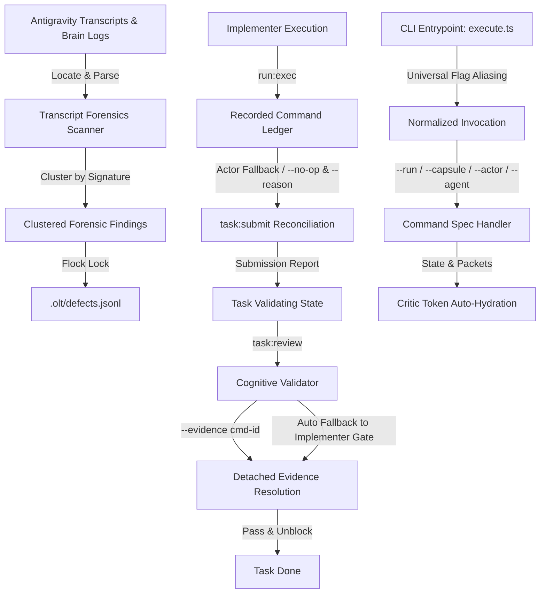

# OLT System Hardening and Autonomous Forensics Architecture

This document specifies the architectural hardening contracts, forensic engines, and ergonomics improvements introduced into the Orchestrated Long Task (OLT) runtime.

## 1. Executive Summary & Forensic Discoveries

During multi-agent execution cycles across the Antigravity host platform, autonomous transcripts revealed six recurrent operational bottlenecks and failure modes:

1. **Cognitive Validator Lockout**: Cognitive reviewers attempted direct execution of task gates (`run:exec`), violating the zero-command hard-lock (`can_execute_shell: false`).
2. **Critic Authentication Invalidation**: Completeness critics lost ephemeral authentication tokens across session boundaries.
3. **Actor Variance Failures**: Implementers running commands under host runners or subagent aliases failed check resolution during `task:submit`.
4. **Gate-Free Task Rejection**: Tasks without verification gates (documentation, planning) threw `cannot determine checks`.
5. **CLI Flag Aliasing Mismatches**: Agents invoking `--capsule` instead of `--run` or `--agent` instead of `--actor` triggered argument rejections.
6. **Internal Source Reverse-Engineering**: Agents facing CLI errors attempted reading internal script implementations (`skills/olt/scripts/src/`) instead of relying on published contracts.

The OLT hardening cycle addresses each failure mode with deterministic mechanical counter-measures.

## 2. Architecture Overview

## 3. Core Hardening Subsystems

### 3.1 Autonomous Transcript Forensics Scanner (`reporting/transcript-forensics/`)

- **Location**: [`olt/scripts/src/reporting/transcript-forensics/`](file:///Users/onurseckinsenoglu/repos/skills/olt/scripts/src/reporting/transcript-forensics/index.ts)
- **Engine**: Discovers `transcript.jsonl` files in `~/.gemini/antigravity-cli/brain/` and `.olt/capsules/`.
- **Classification**: Analyzes steps for 6 heuristic categories: `cognitive_validator_lockout`, `critic_authentication_failure`, `command_ownership_failure`, `unknown_cli_option`, `source_reverse_engineering`, and `harness_error`.
- **Deduplication**: Groups findings by root cause signature into clustered defects with timestamps, occurrences, and offending commands.
- **Persistence**: Persists clustered defects directly to `.olt/defects.jsonl` using flock file locking.

### 3.2 Cognitive Validator Detached Evidence Resolution

- **Rule**: Cognitive Validators maintain strict zero-command privileges (`can_execute_shell: false`).
- **Resolution**: `task:review` resolves gate proofs through detached evidence (`--evidence <command-id>`).
- **Auto-Fallback**: If `--evidence` is omitted, the harness automatically discovers implementer commands matching `task_id`, `status: "succeeded"`, `exit_code: 0`, and gate definition in capsule state.

### 3.3 Submission Checks Reconciliation Engine

- **Actor Variance Fallback**: `resolveChecks` prioritizes exact `(task_id, actor)` command matches, but falls back to any successful command (`task_id` match, `exit_code: 0`) sorted deterministically.
- **Gate-Free Support**: Empty gate definitions (null, empty strings, whitespace, empty array/object) cleanly resolve to empty check lists with `agent_reported` evidence class.
- **No-Op Submissions**: Explicit `--no-op` and `--reason` flags allow immediate check and change resolution for tasks requiring no write-scope modifications.

### 3.4 Universal CLI Flag Aliasing

- Normalizes `--run`, `--run-id`, and `--capsule` universally across commands.
- Normalizes `--actor`, `--agent`, and `--agent-id` universally across identity-expecting commands.
- Extends `task:list` with `--run <capsule>` and `--capsule <path>`, enabling direct task querying from active capsules.
- Automatically derives `queue-path` from active capsule when `--run` is supplied to queue commands.

### 3.5 Critic Token Auto-Hydration & Cryptographic Packet Binding

- Completeness critic commands (`critic:review`, `critic:reject`) hydrate tokens directly from `state.completion_critic` and published role packets in `state.packets`.
- Binds run-level repository gate evidence commands automatically, preventing unauthenticated review rejections.

### 3.6 Non-Blocking Flock-Locked Defect Logging

- CLI execution errors and diagnostic findings append directly to `.olt/defects.jsonl` under cross-process `flock` locks without blocking command termination.
