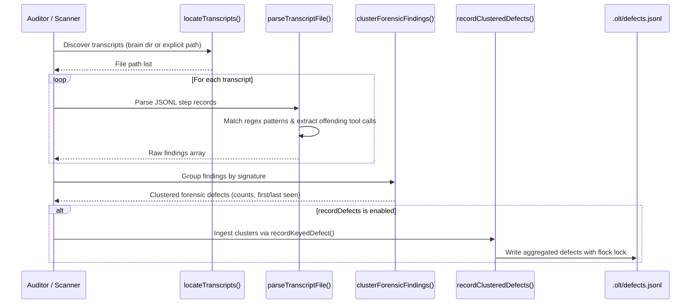

# Autonomous Transcript Forensics Scanner

The Transcript Forensics Scanner (`reporting/transcript-forensics/`) autonomously audits Antigravity CLI and OLT agent session transcripts to discover, categorize, cluster, and record behavioural defects and contract violations.

## 1. Motivation & Context

Autonomous agent swarms executing multi-hour tasks can suffer subtle deviations—such as attempting commands forbidden by their RBAC tier or misinterpreting CLI arguments. Because individual subagent sessions are ephemeral, errors are easily lost once a conversation ends.

The Transcript Forensics Scanner inspects the underlying conversation logs (`transcript.jsonl`), extracts failure patterns, and persists deduplicated defect records into `.olt/defects.jsonl` under cross-process `flock` locks.

## 2. Heuristic Categories

The scanner evaluates transcript content and tool calls against six primary heuristic signatures:

| Category                        | Regex / Pattern                                     | Description                                                                   | Defect Category         | Severity |
| :------------------------------ | :-------------------------------------------------- | :---------------------------------------------------------------------------- | :---------------------- | :------- |
| `cognitive_validator_lockout`   | `/role\s+(\w+\s+)?validator\s+may\s+not\s+invoke/i` | Validator attempted executing terminal commands (`can_execute_shell: false`). | `boundary_violation`    | High     |
| `critic_authentication_failure` | `/completeness critic authentication is invalid/i`  | Completeness critic failed token digest verification.                         | `security_risk`         | High     |
| `command_ownership_failure`     | `/cannot determine checks for\s*([^\s:\n]+)?/i`     | Task submission failed because no matching command was found.                 | `model_reasoning_error` | Medium   |
| `unknown_cli_option`            | `/unknown option:\s*([^\s\n\r]+)/i`                 | Subagent invoked non-existent or un-aliased CLI flags.                        | `model_reasoning_error` | Medium   |
| `source_reverse_engineering`    | `skills/olt/scripts/src`                            | Agent attempted reading or modifying internal harness code.                   | `boundary_violation`    | High     |
| `harness_error`                 | `/Error\s*\((INVALID_STATE\|...)\)/i`               | Unhandled harness contract exception.                                         | `code_defect`           | Medium   |

## 3. Execution Pipeline

## 4. Key Functions & Contracts

### `locateTranscripts(options?: ForensicScanOptions): string[]`

Discovers all `transcript.jsonl` files located either in:

- A direct file or directory path passed via `options.transcriptPath`.
- The Antigravity CLI brain root: `~/.gemini/antigravity-cli/brain/<conv-id>/.system_generated/logs/transcript.jsonl`.
- Optional `limit` parameter to cap discovery count.

### `scanTranscriptSteps(steps, conversationId, transcriptPath?): ForensicRawFinding[]`

Evaluates an array of transcript step records. Correlates error messages with the preceding or contemporary `run_command` tool call to identify the `offendingCommand`.

### `clusterForensicFindings(findings): ClusteredForensicDefect[]`

Clusters raw findings by unique `signature`. Aggregates:

- `count`: Total occurrences.
- `occurrences`: List of occurrence records with conversation ID, step index, error snippet, and offending command.
- `firstSeen` & `lastSeen`: Deterministic ISO timestamps.
- `conversationIds`: Sorted unique set of impacted conversations.

### `recordClusteredDefects(clusters, options?): number`

Converts clustered defects into `DefectRecordInput` structures and commits them to `.olt/defects.jsonl` using `recordKeyedDefect` under `flock` mutation protection.
