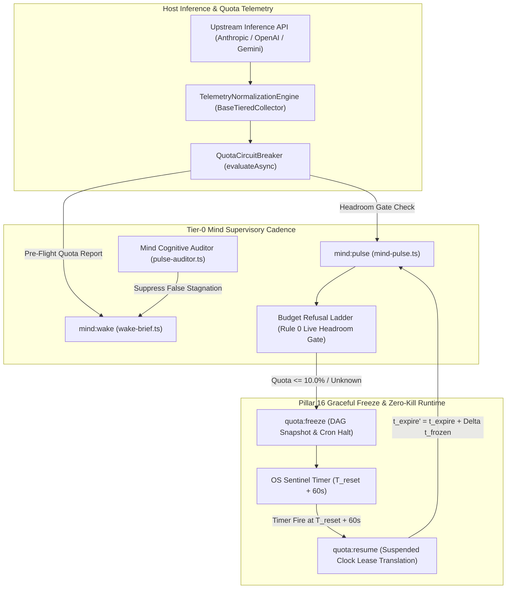

# Quota Circuit Breaker Runtime Wiring, Budget Gate & Graceful Freeze Plan

> **Tracking ID:** `fb-quota-circuit-breaker-runtime-wiring`  
> **Status:** `PLANNED - READY FOR EXECUTION`  
> **Parent Blueprint:** `docs/olt/architecture/03-mind-product-owner/03-01-infinite-autonomous-cadence.md`  
> **Target Subsystems:** `olt/scripts/src/mind/`, `olt/scripts/src/telemetry/`, `olt/scripts/src/cli/commands/`  
> **Author:** Tier 0 Strategic Mind Supervisor & Quota Resilience Architect  
> **Specification Version:** `2.0.0-PROD`

---

[Overview](#1-executive-summary--core-motivation) | [Architecture](#2-architectural-specifications--mathematical-models) | [TypeScript Contracts](#3-typescript-schemas--concrete-contracts) | [Execution Waves](#4-modular-work-breakdown--execution-waves) | [Traceability Matrix](#5-defect--backlog-traceability-matrix) | [Acceptance Invariants](#6-strict-compliance-invariants--acceptance-checklist)

---

## 1. Executive Summary & Core Motivation

In autonomous multi-agent operating systems, interaction with external Large Language Model (LLM) inference providers is constrained by sliding-window token quotas and requests-per-minute rate limits (`HTTP 429: Too Many Requests`).

Forensic system investigation revealed a critical vulnerability in runtime telemetry wiring:

1. **Isolated Telemetry Engines:** The `TelemetryNormalizationEngine` and `QuotaCircuitBreaker` components were developed and unit-tested in isolation (`olt/scripts/src/telemetry/`), but remained disconnected from the core runtime execution loops.
2. **Blind Execution at Low Capacity:** `mind:wake`, `mind:pulse`, and `wake-brief.ts` exclusively evaluated local synchronous JSON state (`state.budget`), remaining blind to live host capacity. At <=10.0% quota (e.g. 5% remaining), the Mind Engine continued opening pulses and dispatching task waves until hitting unhandled HTTP 429 exceptions.
3. **False Stagnation & Rate-Limit Thrashing:** The cognitive `MindAuditor` (`pulse-auditor.ts`) audited pulse freshness without inspecting host quota state. When the Mind paused to conserve tokens, the auditor falsely diagnosed `LIVE_STAGNATION_DETECTED` and synthesized wakeup prompts, creating destructive retry stampedes.
4. **Pillar 16 Compliance Gap:** Pillar 16 of the OLT Architecture mandates **Quota Freeze & Zero-Kill Resilience**: subagent processes must remain intact in RAM (`SIGKILL` forbidden), external crons must be suspended, dynamic sentinel wake timers must be scheduled for $T_{\text{reset}} + 60\text{s}$, and task lease deadlines must translate monotonically by the frozen duration $\Delta t_{\text{frozen}}$.

This engineering plan delivers production-grade wiring across four execution waves:

- **Wave 1: Pre-Flight Telemetry Hook in Mind Wake & Pulse (`mind-wake.ts`, `mind-pulse.ts`, `wake-brief.ts`).**
- **Wave 2: Budget Refusal Ladder Rule 0 & Live Headroom Gate (`calculator.ts`, `types.ts`).**
- **Wave 3: Mind Auditor Host Quota Auditing & Defect Emission (`pulse-auditor.ts`, `engine.ts`).**
- **Wave 4: Cron Suspension, Sentinel Auto-Wake Scheduling & Zero-Kill Resume (`quota-freeze.ts`, `quota-resume.ts`, `circuit-breaker.ts`).**

---

## 2. Architectural Specifications & Mathematical Models



### 2.1 Suspended Dual-Time Monotonic Clock Model

Let worker lease $L_i$ granted at timestamp $t_{\text{start}}$ have an authorized time-to-live $\text{TTL}_0$. Under nominal execution, remaining lease duration is:
$$\tau_{\text{remain}}(t) = \text{TTL}_0 - (t - t_{\text{start}})$$

When a quota freeze occurs at wall-clock timestamp $t_{\text{freeze}}$, the lease clock state transitions to suspended:
$$\text{ClockState}(t) = \begin{cases} \texttt{ACTIVE}, & t < t_{\text{freeze}} \\ \texttt{SUSPENDED}, & t_{\text{freeze}} \le t < t_{\text{resume}} \\ \texttt{ACTIVE}, & t \ge t_{\text{resume}} \end{cases}$$

The total frozen duration is:
$$\Delta t_{\text{frozen}} = t_{\text{resume}} - t_{\text{freeze}}$$

Upon auto-wake at $t_{\text{resume}}$, every active lease expiration timestamp $t_{\text{expire}}'$ is translated forward:
$$t_{\text{expire}}' = t_{\text{expire}} + \Delta t_{\text{frozen}}$$
$$\tau_{\text{remain}}(t_{\text{resume}}) \equiv \tau_{\text{remain}}(t_{\text{freeze}})$$

**Zero-Kill Invariant:** Subagent operating system processes are never sent `SIGKILL` or terminated. In-memory abstract syntax trees (ASTs), scratchpad memory, and staged git buffers remain 100% preserved.

### 2.2 Budget Refusal Ladder: Rule 0 Live Host Headroom Gate

The Budget Refusal Ladder enforces deterministic, ordered safety gates before admitting new tasks or opening pulses:

$$\text{RefusalDecision}(\mathcal{S}, \mathcal{T}) = \min_{r \in \text{Rules}} \{ r(\mathcal{S}, \mathcal{T}) \mid r(\mathcal{S}, \mathcal{T}).\text{ok} = \text{false} \}$$

```text
┌──────────────────────────────────────────────────────────────────────────────────────────────────┐
│                                   BUDGET REFUSAL LADDER ORDERING                                 │
├───────┬──────────────────────────────────┬────────────────────────┬──────────────────────────────┤
│ Rule  │ Safety Gate Name                 │ Evaluation Trigger     │ Refusal Outcome / Action     │
├───────┼──────────────────────────────────┼────────────────────────┼──────────────────────────────┤
│ 0     │ Live Host Headroom Gate          │ Quota <= 10% / Unknown │ outcome: 'paused'            │
│       │ (Rule 0 - Highest Priority)      │                        │ repairArgv: 'quota:freeze'   │
├───────┼──────────────────────────────────┼────────────────────────┼──────────────────────────────┤
│ 1     │ Quiet Hours                      │ UTC window match       │ outcome: 'deferred'          │
├───────┼──────────────────────────────────┼────────────────────────┼──────────────────────────────┤
│ 2     │ Daily Pulse Limit                │ pulses_today >= limit  │ outcome: 'deferred'          │
├───────┼──────────────────────────────────┼────────────────────────┼──────────────────────────────┤
│ 3     │ Daily Wall Clock Limit           │ wall_today >= limit    │ outcome: 'deferred'          │
├───────┼──────────────────────────────────┼────────────────────────┼──────────────────────────────┤
│ 4     │ Max Agents / Dynamic Concurrency │ active_agents >= P     │ outcome: 'deferred'          │
├───────┼──────────────────────────────────┼────────────────────────┼──────────────────────────────┤
│ 5     │ Round Budget                     │ round_idx > max_rounds │ outcome: 'paused'            │
├───────┼──────────────────────────────────┼────────────────────────┼──────────────────────────────┤
│ 6     │ Max Open Proposals               │ open_props >= ceiling  │ outcome: 'paused'            │
└───────┴──────────────────────────────────┴────────────────────────┴──────────────────────────────┘
```

### 2.3 Dynamic Auto-Wake Sentinel Alarm Formula

Let $\mathcal{M}_{\text{constrained}}$ be the set of models whose remaining quota $\le \text{Threshold}$ ($10.0\%$).
Let $t_{\text{reset}}^{(m)}$ be the parsed ISO reset timestamp for model $m \in \mathcal{M}_{\text{constrained}}$.

$$\mathcal{T}_{\text{valid\_resets}} = \{ t_{\text{reset}}^{(m)} \mid m \in \mathcal{M}_{\text{constrained}} \land \text{isValidDate}(t_{\text{reset}}^{(m)}) \}$$

The dynamic auto-wake target timestamp $T_{\text{wakeup}}$ is computed as:
$$T_{\text{wakeup}} = \begin{cases} \min(\mathcal{T}_{\text{valid\_resets}}) + 60\text{s}, & |\mathcal{T}_{\text{valid\_resets}}| > 0 \\ t_{\text{now}} + 18{,}000\text{s} + 60\text{s}, & |\mathcal{T}_{\text{valid\_resets}}| = 0 \text{ (5h Safe Window)} \end{cases}$$

The one-shot schedule payload duration is:
$$D_{\text{seconds}} = \max\left(60, \, \left\lceil \frac{T_{\text{wakeup}} - t_{\text{now}}}{1000} \right\rceil\right)$$

---

## 3. TypeScript Schemas & Concrete Contracts

All code contracts enforce **0 `any`** and **0 compiler suppressions**.

```typescript
export type QuotaRefusalOutcome = "paused" | "deferred" | "halted";

export type QuotaRefusalKey = "quota_headroom_exhausted" | "quota_headroom_unknown";

export type ExtendedBudgetRefusalKey =
  | "quiet_hours"
  | "daily_pulse_limit"
  | "daily_wall_clock_limit_ms"
  | "max_agents_in_flight"
  | "round_budget"
  | "max_open_proposals"
  | QuotaRefusalKey;

export interface LiveQuotaHeadroomStatus {
  readonly lowestRemainingQuota: number | null;
  readonly thresholdPercentage: number;
  readonly isTriggered: boolean;
  readonly isExhausted: boolean;
  readonly isUnknown: boolean;
  readonly constrainedModelCount: number;
  readonly earliestResetIso?: string | undefined;
  readonly autoWakeDurationSeconds?: number | undefined;
}

export interface QuotaGateEvaluationResult {
  readonly ok: boolean;
  readonly key?: ExtendedBudgetRefusalKey | undefined;
  readonly reason?: string | undefined;
  readonly outcome?: QuotaRefusalOutcome | undefined;
  readonly repairArgv?: string | undefined;
  readonly current?: number | string | null | undefined;
  readonly limit?: number | string | null | undefined;
  readonly headroom?: LiveQuotaHeadroomStatus | undefined;
}

export interface QuotaFreezeDirective {
  readonly action: "freeze" | "idle";
  readonly targetWakeupIso: string;
  readonly autoWakeDurationSeconds: number;
  readonly suspendCrons: true;
  readonly zeroKillSubagents: true;
  readonly snapshotCoordinatesPath: string;
}

export interface SuspendedLeaseTranslationResult {
  readonly runRoot: string;
  readonly frozenAtIso: string;
  readonly resumedAtIso: string;
  readonly deltaFrozenMs: number;
  readonly translatedLeasesCount: number;
  readonly activeAgentCountRetained: number;
}
```

---

## 4. Modular Work Breakdown & Execution Waves

Execution waves target $\le 3$ files per task and guarantee the 5-minute execution SLA ($P = \lceil W / S \rceil$).

```text
Wave 1 (Pre-Flight Telemetry Hook in Mind Wake & Pulse)
├── Task 1.1: Wake Brief & Builder Live Quota Telemetry Line
├── Task 1.2: Mind Pulse Pre-Flight Headroom Gate & Refusal Transition
└── Task 1.3: Mind Pulse & Wake Quota Unit Test Suite
          │
          ▼
Wave 2 (Budget Refusal Ladder Rule 0 & Live Headroom Gate)
├── Task 2.1: Budget Types & Extended Refusal Key Expansion
├── Task 2.2: Budget Calculator Rule 0 Gate Implementation
└── Task 2.3: Budget Refusal Ladder Quota Test Suite
          │
          ▼
Wave 3 (Mind Auditor Host Quota Auditing & Defect Emission)
├── Task 3.1: Cognitive Auditor Quota Awareness & Stagnation Suppression
└── Task 3.2: Mind Auditor Quota Test Suite
          │
          ▼
Wave 4 (Cron Suspension, Sentinel Auto-Wake Scheduling & Zero-Kill Resume)
├── Task 4.1: Dynamic Auto-Wake Sentinel Calculation & Cron Suspension
├── Task 4.2: Suspended Dual-Time Lease Translation & Resume Command
└── Task 4.3: End-to-End Quota Lifecycle & Zero-Kill Test Suite
```

---

### Wave 1: Pre-Flight Telemetry Hook in Mind Wake & Pulse

#### Task 1.1: Wake Brief & Builder Live Quota Telemetry Line

- **Target Files (Max 3):**
  - `olt/scripts/src/mind/proposals/brief/wake-brief.ts`
  - `olt/scripts/src/mind/proposals/brief/builder.ts`
  - `olt/scripts/src/mind/proposals/brief/formatters.ts`
- **Write Scope:** `olt/scripts/src/mind/proposals/brief/`
- **Read-Only Scope:** `olt/scripts/src/telemetry/`
- **SLA:** 4 minutes ($W=3, S=1, P=3$)
- **Symbols Exported:** `renderQuotaLine()`, `computeFullWakeBrief()` (extended with `quotaSummary`), `buildWakeBrief()`
- **Anti-Stub Failure Criteria:**
  - When quota $\le 10.0\%$, the brief MUST render `QUOTA     CRITICAL (<10.0%) · 4.2% remaining · resets in 2h 19m`.
  - When quota is unmeasured, the brief MUST render `QUOTA     UNKNOWN (fail closed) · safe window 5h`.
  - When quota is healthy ($>10\%$), the brief MUST render `QUOTA     OK · 85.0% remaining`.
- **Verification Gate:** `bun test tests/unit/mind/mind-pulse-quota.test.ts`

#### Task 1.2: Mind Pulse Pre-Flight Headroom Gate & Refusal Transition

- **Target Files (Max 2):**
  - `olt/scripts/src/cli/commands/mind-pulse.ts`
  - `olt/scripts/src/cli/commands/mind-wake.ts`
- **Write Scope:** `olt/scripts/src/cli/commands/`
- **Read-Only Scope:** `olt/scripts/src/telemetry/circuit-breaker.ts`
- **SLA:** 5 minutes ($W=2, S=1, P=2$)
- **Symbols Exported:** `mindPulseCommand()`, `mindWakeCommand()`
- **Anti-Stub Failure Criteria:**
  - Invoking `mind:pulse` when quota $\le 10.0\%$ without `--force` MUST throw a `HarnessError("INVALID_STATE", ...)` or return a paused outcome specifying `Next: quota:freeze`.
  - Subagents MUST NEVER be killed during quota refusal; `active_agents` array in state must remain unmodified.
- **Verification Gate:** `bun test tests/unit/mind/mind-pulse-quota.test.ts`

#### Task 1.3: Mind Pulse & Wake Quota Unit Test Suite

- **Target Files (Max 1):**
  - `tests/unit/mind/mind-pulse-quota.test.ts`
- **Write Scope:** `tests/unit/mind/mind-pulse-quota.test.ts`
- **Read-Only Scope:** `olt/scripts/src/cli/commands/mind-pulse.ts`, `wake-brief.ts`
- **SLA:** 4 minutes ($W=1, S=1, P=1$)
- **Symbols Exported:** Comprehensive unit test suite for wake and pulse quota hooks.
- **Anti-Stub Failure Criteria:**
  - Tests verify exact behavior at 10.1% (nominal), 9.9% (refusal), 0.0% (exhaustion), and unmeasured (unknown).
- **Verification Gate:** `bun test tests/unit/mind/mind-pulse-quota.test.ts`

---

### Wave 2: Budget Refusal Ladder Rule 0 & Live Headroom Gate

#### Task 2.1: Budget Types & Extended Refusal Key Expansion

- **Target Files (Max 1):**
  - `olt/scripts/src/mind/lifecycle/budget/types.ts`
- **Write Scope:** `olt/scripts/src/mind/lifecycle/budget/types.ts`
- **Read-Only Scope:** `olt/scripts/src/telemetry/types.ts`
- **SLA:** 3 minutes ($W=1, S=1, P=1$)
- **Symbols Exported:** `BudgetRefusalKey` (extended), `BudgetLadderOptions` (extended with `quotaEvaluation`, `liveHeadroom`), `checkQuotaHeadroomBudget()`
- **Anti-Stub Failure Criteria:**
  - Type definitions must strictly reject any undefined refusal key strings while preserving existing keys.
- **Verification Gate:** `bun test tests/unit/mind/budget-quota.test.ts`

#### Task 2.2: Budget Calculator Rule 0 Gate Implementation

- **Target Files (Max 1):**
  - `olt/scripts/src/mind/lifecycle/budget/calculator.ts`
- **Write Scope:** `olt/scripts/src/mind/lifecycle/budget/calculator.ts`
- **Read-Only Scope:** `olt/scripts/src/mind/lifecycle/budget/types.ts`
- **SLA:** 4 minutes ($W=1, S=1, P=1$)
- **Symbols Exported:** `checkQuotaHeadroomBudget()`, `evaluateBudgetRefusalLadder()` (Rule 0 pre-check)
- **Anti-Stub Failure Criteria:**
  - Rule 0 MUST be evaluated before Rule 1 (Quiet Hours). If quota is $\le 10\%$, refusal key `"quota_headroom_exhausted"` must be returned even if inside quiet hours.
- **Verification Gate:** `bun test tests/unit/mind/budget-quota.test.ts`

#### Task 2.3: Budget Refusal Ladder Quota Test Suite

- **Target Files (Max 1):**
  - `tests/unit/mind/budget-quota.test.ts`
- **Write Scope:** `tests/unit/mind/budget-quota.test.ts`
- **Read-Only Scope:** `olt/scripts/src/mind/lifecycle/budget/calculator.ts`
- **SLA:** 3 minutes ($W=1, S=1, P=1$)
- **Symbols Exported:** Budget ladder test suite covering Rule 0.
- **Anti-Stub Failure Criteria:**
  - Verifies exact refusal ladder precedence: Rule 0 > Rule 1 > Rule 2 > Rule 3 > Rule 4 > Rule 5 > Rule 6.
- **Verification Gate:** `bun test tests/unit/mind/budget-quota.test.ts`

---

### Wave 3: Mind Auditor Host Quota Auditing & Defect Emission

#### Task 3.1: Cognitive Auditor Quota Awareness & Stagnation Suppression

- **Target Files (Max 2):**
  - `olt/scripts/src/mind/auditing/cognitive/pulse-auditor.ts`
  - `olt/scripts/src/mind/auditing/cognitive/engine.ts`
- **Write Scope:** `olt/scripts/src/mind/auditing/cognitive/`
- **Read-Only Scope:** `olt/scripts/src/telemetry/circuit-breaker.ts`
- **SLA:** 4 minutes ($W=2, S=1, P=2$)
- **Symbols Exported:** `auditMindPulseHelper()`, `MindAuditorEngine.resolveHostQuotaState()`
- **Anti-Stub Failure Criteria:**
  - When the Mind is idle past threshold (e.g. 120s) because quota is frozen or exhausted, the auditor MUST suppress `LIVE_STAGNATION_DETECTED`.
  - The auditor MUST return remediation `"await_quota_reset"` or `"quota_freeze_required"` instead of `"wake_mind"`.
- **Verification Gate:** `bun test tests/unit/mind/pulse-auditor-quota.test.ts`

#### Task 3.2: Mind Auditor Quota Test Suite

- **Target Files (Max 1):**
  - `tests/unit/mind/pulse-auditor-quota.test.ts`
- **Write Scope:** `tests/unit/mind/pulse-auditor-quota.test.ts`
- **Read-Only Scope:** `olt/scripts/src/mind/auditing/cognitive/pulse-auditor.ts`
- **SLA:** 3 minutes ($W=1, S=1, P=1$)
- **Symbols Exported:** Unit tests validating false stagnation suppression during quota freezes.
- **Anti-Stub Failure Criteria:**
  - Confirms 0 false stagnation defects are emitted when quota is below 10.0%.
- **Verification Gate:** `bun test tests/unit/mind/pulse-auditor-quota.test.ts`

---

### Wave 4: Cron Suspension, Sentinel Auto-Wake Scheduling & Zero-Kill Resume

#### Task 4.1: Dynamic Auto-Wake Sentinel Calculation & Cron Suspension

- **Target Files (Max 2):**
  - `olt/scripts/src/cli/commands/quota-freeze.ts`
  - `olt/scripts/src/telemetry/dag-snapshot.ts`
- **Write Scope:** `olt/scripts/src/cli/commands/quota-freeze.ts`, `olt/scripts/src/telemetry/dag-snapshot.ts`
- **Read-Only Scope:** `olt/scripts/src/telemetry/circuit-breaker.ts`
- **SLA:** 4 minutes ($W=2, S=1, P=2$)
- **Symbols Exported:** `quotaFreezeCommand()`, `captureDagSnapshot()`, `AutoWakeSchedulePayload`
- **Anti-Stub Failure Criteria:**
  - Writes `.olt/locks/quota.frozen` marker to block cron pulse triggers.
  - Generates exact `AutoWakeSchedulePayload` targeting $T_{\text{reset}} + 60\text{s}$ (or $18{,}060\text{s}$ fallback).
- **Verification Gate:** `bun test tests/unit/telemetry/quota-lifecycle.test.ts`

#### Task 4.2: Suspended Dual-Time Lease Translation & Resume Command

- **Target Files (Max 2):**
  - `olt/scripts/src/cli/commands/quota-resume.ts`
  - `olt/scripts/src/telemetry/circuit-breaker.ts`
- **Write Scope:** `olt/scripts/src/cli/commands/quota-resume.ts`, `olt/scripts/src/telemetry/circuit-breaker.ts`
- **Read-Only Scope:** `olt/scripts/src/telemetry/dag-snapshot.ts`
- **SLA:** 4 minutes ($W=2, S=1, P=2$)
- **Symbols Exported:** `quotaResumeCommand()`, `translateSuspendedLeases()`
- **Anti-Stub Failure Criteria:**
  - Translates all active lease deadlines forward by $\Delta t_{\text{frozen}} = t_{\text{resumed}} - t_{\text{frozen}}$.
  - Removes `.olt/locks/quota.frozen` marker.
  - Zero active subagents are killed during resume.
- **Verification Gate:** `bun test tests/unit/telemetry/quota-lifecycle.test.ts`

#### Task 4.3: End-to-End Quota Lifecycle & Zero-Kill Test Suite

- **Target Files (Max 1):**
  - `tests/unit/telemetry/quota-lifecycle.test.ts`
- **Write Scope:** `tests/unit/telemetry/quota-lifecycle.test.ts`
- **Read-Only Scope:** Full harness telemetry and CLI commands
- **SLA:** 5 minutes ($W=1, S=1, P=1$)
- **Symbols Exported:** End-to-end integration test suite.
- **Anti-Stub Failure Criteria:**
  - Simulates a complete freeze -> sleep -> resume cycle with 3 active subagents and verified lease translation forward without context loss.
- **Verification Gate:** `bun test tests/unit/telemetry/quota-lifecycle.test.ts`

---

## 5. Defect & Backlog Traceability Matrix

| Defect / Requirement ID          | Description                                                          | Component Resolution                                                                                  | Concrete Symbols                                          | Discriminating Verification Gate                        |
| :------------------------------- | :------------------------------------------------------------------- | :---------------------------------------------------------------------------------------------------- | :-------------------------------------------------------- | :------------------------------------------------------ |
| `fb-quota-telemetry-isolation`   | Telemetry probe was never called during `mind:wake` or `mind:pulse`. | Wire `TelemetryNormalizationEngine` pre-flight hooks into brief builder and pulse command.            | `renderQuotaLine`, `mindPulseCommand`                     | `bun test tests/unit/mind/mind-pulse-quota.test.ts`     |
| `fb-budget-rule-0-headroom-gate` | Budget calculator admitted tasks blindly at 5% quota.                | Insert Rule 0 Live Host Headroom Gate at the head of the refusal ladder.                              | `checkQuotaHeadroomBudget`, `evaluateBudgetRefusalLadder` | `bun test tests/unit/mind/budget-quota.test.ts`         |
| `fb-auditor-false-stagnation`    | Auditor emitted false stagnation defects during valid quota freeze.  | Cognitive pulse auditor inspects quota state and suppresses false stagnation.                         | `auditMindPulseHelper`, `resolveHostQuotaState`           | `bun test tests/unit/mind/pulse-auditor-quota.test.ts`  |
| `fb-pillar-16-zero-kill-resume`  | Rate-limit handling risked killing subagents or expiring leases.     | Suspended Dual-Time Monotonic Clock translates lease deadlines forward by $\Delta t_{\text{frozen}}$. | `translateSuspendedLeases`, `quotaResumeCommand`          | `bun test tests/unit/telemetry/quota-lifecycle.test.ts` |

---

## 6. Strict Compliance Invariants & Acceptance Checklist

1. **0 TypeScript `any` & 0 Compiler Suppressions:** AST purity scanner verifies 0 `@ts-ignore`, 0 `@ts-expect-error`, and 0 `any` types.
2. **Strict File & Directory Limits:** Every source file $\le 300$ physical lines; every directory $\le 10$ files.
3. **Pillar 16 Zero-Kill Guarantee:** Subagents are transitioned to `IDLE` in RAM. `SIGKILL` and destructive `manage_subagents kill` are strictly forbidden.
4. **Suspended Monotonic Clock Correctness:** Active leases must translate forward exactly $\Delta t_{\text{frozen}} = t_{\text{resumed}} - t_{\text{frozen}}$.
5. **Immediate Git Staging (`git add -A`):** Upon completing any task or wave, stage all files immediately to persist loose Git objects to disk for reflog safety.

---

[Overview](#1-executive-summary--core-motivation) | [Architecture](#2-architectural-specifications--mathematical-models) | [TypeScript Contracts](#3-typescript-schemas--concrete-contracts) | [Execution Waves](#4-modular-work-breakdown--execution-waves) | [Traceability Matrix](#5-defect--backlog-traceability-matrix) | [Acceptance Invariants](#6-strict-compliance-invariants--acceptance-checklist)
