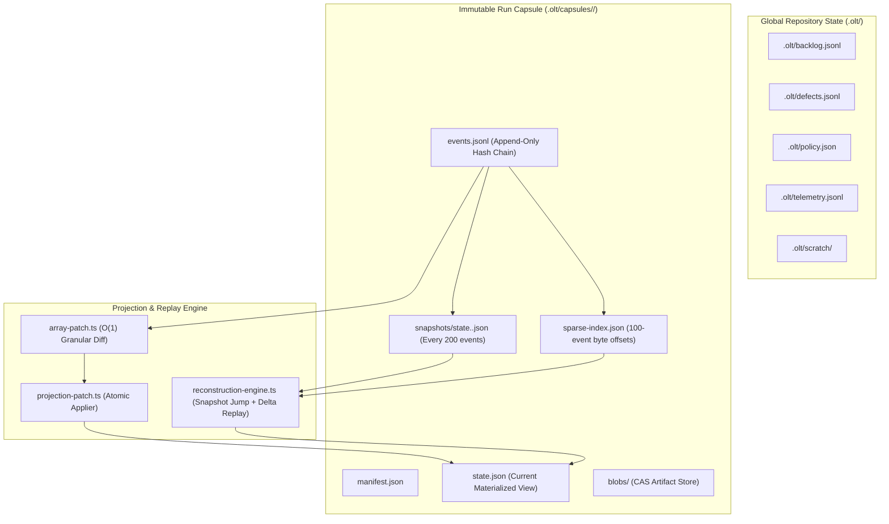

# Storage O(1) Delta Journaling, Snapshot Engine & Zero-Duplication Hierarchy Plan

> **Tracking ID:** `fb-storage-o1-delta-journaling`  
> **Status:** `PLANNED - READY FOR EXECUTION`  
> **Parent Blueprint:** `docs/planning/unified-storage-communication-tui-revamp/PLAN.md`  
> **Target Subsystems:** `olt/scripts/src/engine/store/hierarchy/`, `olt/scripts/src/engine/store/projections/`  
> **Author:** Tier 0 Strategic Mind Supervisor & Master Storage Architect  
> **Specification Version:** `2.0.0-PROD`

---

[Overview](#1-executive-summary--core-motivation) | [Architecture](#2-architectural-specifications--mathematical-models) | [TypeScript Contracts](#3-typescript-schemas--concrete-contracts) | [Execution Tasks](#4-modular-work-breakdown--execution-waves) | [Traceability Matrix](#5-defect--backlog-traceability-matrix) | [Acceptance Invariants](#6-strict-compliance-invariants--acceptance-checklist)

---

## 1. Executive Summary & Core Motivation

In long-running autonomous multi-agent execution harnesses, state projections mutate through continuous event emission. Historically, the storage and projection layer suffered from two critical defects:

1. **Quadratic Log Explosion (`hb-s2-diffvalue-array-invariant`):** `diffValue` in `projection-patch.ts` guarded only on JSON objects (`isJsonObject`). When diffing arrays (e.g. `escalations`, `candidates`, `findings`, `agents`), it emitted whole-array replacement operations:
   $$\Delta_{\text{patch}} = \{ \text{op}: \text{"set"}, \text{path}: [\dots \text{path}], \text{value}: \text{after} \}$$
   Appending $N$ sequential elements produced:
   $$\text{Total Bytes} = \sum_{k=1}^N k \cdot S = \frac{N(N+1)}{2} \cdot S \in O(N^2)$$
   At $N=500$ escalations, log sizes exceeded $380\text{ MB}$, causing out-of-memory errors and sluggish replay.

2. **Storage Directory Fragmentation & Vestigial Ledgers (`defect-vestigial-runtime-ledgers-in-static-package-root`, `defect-root-hygiene-loose-files-detected`):** Runtime ledgers and scratch files were erroneously written inside the static package root `olt/` instead of `.olt/`, violating repository hygiene (Invariant 30).

This plan delivers:

- Pure physical filesystem separation between global repository state (`.olt/`) and immutable run capsules (`.olt/capsules/<run_id>/`).
- Granular element-level array patch operations (`set`, `splice`, `append`), guaranteeing $O(1)$ amortized append delta costs.
- Periodic atomic state snapshots every 200 events (`snapshots/state.<sequence>.json`) coupled with a 100-event sparse byte-offset index (`sparse-index.json`).
- High-velocity point-in-time state reconstruction bounding replay work to $\le 199$ events.
- Zero-downtime backward-compatible ledger migration utilities (`storage-migrator.ts`).

---

## 2. Architectural Specifications & Mathematical Models



### 2.1 Pure Physical Separation

All harness data is partitioned into two disjoint domains:

1. **Repository-Level Global State (`.olt/`)**:
   - `backlog.jsonl`: Strategic intake backlog.
   - `defects.jsonl`: Active and resolved defect ledgers.
   - `completed-tasks.jsonl`: Permanent archive of completed tasks.
   - `policy.json`: Authoritative repository capabilities and role policy.
   - `telemetry.jsonl`: Multi-agent execution telemetry.
   - `scratch/`: Confined runtime scratch artifacts.

2. **Immutable Run Capsule State (`.olt/capsules/<run_id>/`)**:
   - `manifest.json`: Capsule genesis hash, run configuration, and parameters.
   - `events.jsonl`: Append-only, hash-chained transaction log.
   - `state.json`: Current materialized state projection.
   - `sparse-index.json`: 100-event byte offset index for $O(1)$ seeking.
   - `snapshots/state.<seq>.json`: Atomic state snapshots written every 200 events.
   - `blobs/<sha256>`: CAS storage for large artifacts and evidence.

### 2.2 Mathematical Model for Array Delta Operations

1. **Prefix Match with Suffix Append ($O(K)$ where $K$ is newly added element count):**
   $$\text{If } \text{before}[0 \dots M-1] \equiv \text{after}[0 \dots M-1] \text{ and } \text{after}.\text{length} = M + K:$$
   $$\forall i \in [M, M + K - 1]: \quad \text{emit } \{ \text{op}: \text{"set"}, \text{path}: [\dots \text{path}, \text{String}(i)], \text{value}: \text{after}[i] \}$$

2. **Targeted Element Mutation:**
   $$\text{If } \text{before}.\text{length} == \text{after}.\text{length} \text{ and exactly index } j \text{ changed}:$$
   $$\text{emit } \text{diffValue}([\dots \text{path}, \text{String}(j)], \text{before}[j], \text{after}[j])$$

3. **Array Truncation / Splice:**
   $$\text{If } \text{after}.\text{length} < \text{before}.\text{length}:$$
   $$\text{emit } \{ \text{op}: \text{"splice"}, \text{path}: [\dots \text{path}], \text{start}: \text{after}.\text{length}, \text{deleteCount}: \text{before}.\text{length} - \text{after}.\text{length} \}$$

### 2.3 Point-in-Time State Reconstruction Algorithm

To reconstruct state at sequence target $T$:

1. $S_{\text{base}} = \max \{ s \le T \mid s \pmod{200} \equiv 0 \land \text{snapshotExists}(s) \}$.
2. Load snapshot $S_{\text{base}}$ in $O(1)$ time via `JSON.parse(readFileSync(...))`.
3. Seek to byte offset $\text{byte\_offsets}[\lfloor (S_{\text{base}}+1)/100 \rfloor \cdot 100]$ in `events.jsonl`.
4. Scan forward to event $S_{\text{base}}+1$, then apply sequential patches for events $S_{\text{base}}+1 \dots T$.
5. Replay cost is bounded by $\le 199$ events regardless of total history size $N$.

### 2.4 Operator-Only Manual Cleanup CLI & Atomic Co-Purging

To prevent `.olt/` from becoming bloated after tens or hundreds of multi-agent runs, the harness provides human operator-driven cleanup commands:

- **CLI Commands:**
  - `bun harness.ts clean:capsules [--older-than <days> | --completed | --run <id>]`
  - `bun harness.ts clean:telemetry [--before <date>]`
  - `bun harness.ts clean:mailboxes [--all | --inactive]`
  - `bun harness.ts clean:all` (Full reset of completed capsules, mailboxes, and temporary scratch)
- **Strict Agent Ban (`AGENT_CLEAN_PROHIBITION_INVARIANT`):** Autonomous subagents are mechanically forbidden from invoking any `clean:*` commands. Cleaning is strictly an operator-initiated manual maintenance tool.
- **Atomic Co-Purging Guarantee:** When a capsule run is deleted, its directory (`.olt/capsules/<run_id>/`), corresponding mailboxes (`.olt/mailboxes/<agent_id>/`), POSIX locks (`.locks/`), and non-shared CAS evidence blobs are pruned together atomically, preventing partial/dangling orphan files.

### 2.5 Post-Run Graph & Summary Fidelity Invariant

- Before any manual cleanup is performed, the harness guarantees 100% data preservation during active runs.
- `summary:export` compiles the full execution trajectory into `summary/graph.json` and `summary.md`, capturing all subagent dispatches, token usage, inter-agent messages, and directed dependency graphs before historical pruning.

### 2.6 Zero-Copy In-Place Skill Execution Invariant

- The harness strictly forbids duplicating or copying skill packages, scripts, or agent manifests into `.olt/` at runtime during execution or tests.
- All operations execute in-place directly from the repository source tree, eliminating redundant file duplication on disk.

---

## 3. TypeScript Schemas & Concrete Contracts

All code strictly enforces **0 `any`**, **0 compiler suppressions**, and **immutable `readonly` properties**.

```typescript
export interface StoragePaths {
  readonly repoRoot: string;
  readonly oltDir: string;
  readonly capsulesDir: string;
  readonly globalBacklogPath: string;
  readonly globalDefectsPath: string;
  readonly globalPolicyPath: string;
  readonly globalTelemetryPath: string;
  readonly globalMailboxesDir: string;
  readonly scratchDir: string;
}

export interface CapsulePaths {
  readonly runRoot: string;
  readonly manifestPath: string;
  readonly eventsPath: string;
  readonly statePath: string;
  readonly sparseIndexPath: string;
  readonly snapshotsDir: string;
  readonly blobsDir: string;
  readonly tracePath: string;
}

export type ArrayPatchOperation =
  | { readonly op: "set"; readonly path: readonly string[]; readonly value: unknown }
  | { readonly op: "unset"; readonly path: readonly string[] }
  | {
      readonly op: "splice";
      readonly path: readonly string[];
      readonly start: number;
      readonly deleteCount: number;
      readonly items?: readonly unknown[] | undefined;
    };

export interface EventSparseIndex {
  readonly version: 1;
  readonly byte_offsets: Readonly<Record<string, number>>;
  readonly indexed_at: string;
}

export interface SnapshotRecord {
  readonly sequence: number;
  readonly snapshot_sha256: string;
  readonly created_at: string;
  readonly state_payload: Record<string, unknown>;
}
```

---

## 4. Modular Work Breakdown & Execution Waves

Each task targets $\le 3$ files, executes within a 5-minute SLA ($P = \lceil W / S \rceil$), has disjoint write scopes, and includes anti-stub failure criteria.

```text
Wave 1 (Hierarchy & Path Resolver)  ──► [Task 1.1: Storage Paths & Migrator]
                                               │
                                               ▼
Wave 2 (O(1) Array Delta Patching)  ──► [Task 2.1: Granular Array Diff Engine] + [Task 2.2: Projection Patch Integration]
                                               │
                                               ▼
Wave 3 (Snapshots & Sparse Index)   ──► [Task 3.1: Atomic Snapshot Engine]     + [Task 3.2: Sparse Byte Indexer]
                                               │
                                               ▼
Wave 4 (Point-in-Time Replay)       ──► [Task 4.1: Fast Replay Reconstruction] + [Task 4.2: Storage Hardening E2E]
```

### Wave 1: Pure Storage Hierarchy & Migration Utilities

#### Task 1.1: Storage Path Resolver & Migration Engine

- **Target Files (Max 2):**
  - `olt/scripts/src/engine/store/hierarchy/storage-paths.ts`
  - `olt/scripts/src/engine/store/hierarchy/storage-migrator.ts`
- **Write Scope:** `olt/scripts/src/engine/store/hierarchy/`
- **Read-Only Scope:** `olt/scripts/src/engine/store/`
- **SLA:** 5 minutes ($W=2, S=1, P=2$)
- **Symbols Exported:** `resolveStoragePaths()`, `resolveCapsulePaths()`, `assertSafeStoragePath()`, `migrateLegacyCapsules()`, `relocateVestigialLedgers()`
- **Anti-Stub Failure Criteria:**
  - Must reject any path resolving runtime ledgers into `olt/` instead of `.olt/`.
  - Stubs that do not verify SHA-256 hash chains across legacy relocations must fail.
- **Verification Gate:** `bun test tests/unit/store/storage-hierarchy.test.ts`

---

### Wave 2: $O(1)$ Array Delta Journaling

#### Task 2.1: Granular Array Patch Operations

- **Target Files (Max 1):**
  - `olt/scripts/src/engine/store/projections/array-patch.ts`
- **Write Scope:** `olt/scripts/src/engine/store/projections/array-patch.ts`
- **Read-Only Scope:** `olt/scripts/src/engine/store/types.ts`
- **SLA:** 4 minutes ($W=1, S=1, P=1$)
- **Symbols Exported:** `diffArrayElements()`, `applyArrayPatchOperation()`, `isMonotonicArrayAppend()`
- **Anti-Stub Failure Criteria:**
  - Emitting whole-array replacement operations for suffix appends must fail.
  - Appending $500$ elements must produce exactly $500$ single-element `set` ops rather than quadratic array copies.
- **Verification Gate:** `bun test tests/unit/store/array-patch.test.ts`

#### Task 2.2: Projection Patch Integration & Event Reducer

- **Target Files (Max 1):**
  - `olt/scripts/src/engine/store/projections/projection-patch.ts`
- **Write Scope:** `olt/scripts/src/engine/store/projections/projection-patch.ts`
- **Read-Only Scope:** `olt/scripts/src/engine/store/projections/array-patch.ts`
- **SLA:** 4 minutes ($W=1, S=1, P=1$)
- **Symbols Exported:** `diffProjection()`, `applyProjectionPatch()`, `reduceEventStream()`
- **Anti-Stub Failure Criteria:**
  - Stubs returning full object clones instead of granular delta patches must fail.
  - Assert log size for 500 escalations is $\le 1.8\text{ MB}$ (vs $>50\text{ MB}$ without array patch).
- **Verification Gate:** `bun test tests/unit/store/projection-patch.test.ts`

---

### Wave 3: Periodic Atomic Snapshots & Sparse Indexing

#### Task 3.1: Atomic State Snapshot Manager

- **Target Files (Max 1):**
  - `olt/scripts/src/engine/store/hierarchy/snapshot-manager.ts`
- **Write Scope:** `olt/scripts/src/engine/store/hierarchy/snapshot-manager.ts`
- **Read-Only Scope:** `olt/scripts/src/engine/store/hierarchy/storage-paths.ts`
- **SLA:** 4 minutes ($W=1, S=1, P=1$)
- **Symbols Exported:** `writeAtomicSnapshot()`, `loadLatestSnapshot()`, `shouldCreateSnapshot()`
- **Anti-Stub Failure Criteria:**
  - Non-atomic writes (writing directly to destination without temp file + `renameSync`) must fail.
  - Must create snapshots strictly on sequence multiples of 200.
- **Verification Gate:** `bun test tests/unit/store/snapshot-manager.test.ts`

#### Task 3.2: 100-Event Sparse Byte-Offset Indexer

- **Target Files (Max 1):**
  - `olt/scripts/src/engine/store/hierarchy/sparse-index.ts`
- **Write Scope:** `olt/scripts/src/engine/store/hierarchy/sparse-index.ts`
- **Read-Only Scope:** `olt/scripts/src/engine/store/hierarchy/storage-paths.ts`
- **SLA:** 4 minutes ($W=1, S=1, P=1$)
- **Symbols Exported:** `updateSparseIndex()`, `seekEventByteOffset()`, `rebuildSparseIndex()`
- **Anti-Stub Failure Criteria:**
  - Byte offsets returned must match exact file seek position for event sequences $100, 200, 300\dots$.
  - Reading seek offset must take $< 1\text{ms}$ without scanning entire file.
- **Verification Gate:** `bun test tests/unit/store/sparse-index.test.ts`

---

### Wave 4: Point-in-Time Reconstruction & End-to-End Validation

#### Task 4.1: High-Velocity Point-in-Time State Reconstruction Engine

- **Target Files (Max 1):**
  - `olt/scripts/src/engine/store/hierarchy/reconstruction-engine.ts`
- **Write Scope:** `olt/scripts/src/engine/store/hierarchy/reconstruction-engine.ts`
- **Read-Only Scope:** `olt/scripts/src/engine/store/hierarchy/`
- **SLA:** 5 minutes ($W=1, S=1, P=1$)
- **Symbols Exported:** `reconstructStateAtSequence()`, `fastForwardProjection()`
- **Anti-Stub Failure Criteria:**
  - Reconstructing sequence $350$ across a $500$-event log must load snapshot $200$ and replay exactly $150$ events.
  - Total reconstruction latency must be $< 15\text{ms}$. Full replay penalty ($O(N)$) must fail.
- **Verification Gate:** `bun test tests/unit/store/reconstruction-engine.test.ts`

#### Task 4.2: Storage Hardening & Concurrency E2E Suite

- **Target Files (Max 1):**
  - `tests/e2e/store/storage-delta-journaling.test.ts`
- **Write Scope:** `tests/e2e/store/storage-delta-journaling.test.ts`
- **Read-Only Scope:** `olt/scripts/src/engine/store/`
- **SLA:** 5 minutes ($W=1, S=1, P=1$)
- **Symbols Exported:** Complete E2E integration test suite
- **Anti-Stub Failure Criteria:**
  - Simulates 1,000 continuous append operations, 5 snapshots, torn write recovery, and backward-compatible ledger migration.
  - Asserts zero data corruption, zero lost events, and zero memory leaks.
- **Verification Gate:** `bun test tests/e2e/store/storage-delta-journaling.test.ts`

---

## 5. Defect & Backlog Traceability Matrix

| Defect / Backlog ID                                       | Description                                                                                     | Component Resolution                                     | Concrete Symbols                               | Discriminating Verification Gate                                                  |
| :-------------------------------------------------------- | :---------------------------------------------------------------------------------------------- | :------------------------------------------------------- | :--------------------------------------------- | :-------------------------------------------------------------------------------- |
| `hb-s2-diffvalue-array-invariant`                         | `diffValue` recurses into objects but re-serializes arrays whole, creating $O(N^2)$ log growth. | Element-level array diffing (`set`, `splice`, `append`). | `diffArrayElements`, `diffProjection`          | `bun test tests/unit/store/array-patch.test.ts` (Log $\le 1.8\text{MB}$)          |
| `defect-vestigial-runtime-ledgers-in-static-package-root` | Ledgers written inside static package root `olt/` instead of repo `.olt/`.                      | Storage path resolver + auto-migrator.                   | `resolveStoragePaths`, `migrateLegacyCapsules` | `bun test tests/unit/store/storage-hierarchy.test.ts` (0 runtime files in `olt/`) |
| `defect-root-hygiene-loose-files-detected`                | Loose scratch files in repo root violating Invariant 30.                                        | Strict path confinement to `.olt/scratch/`.              | `assertSafeStoragePath`, `resolveScratchDir`   | `bun test tests/unit/store/storage-hierarchy.test.ts`                             |
| `inv-subdomain-git-staging-reflog-safety`                 | Crash safety risk during storage mutations.                                                     | Immediate `git add -A` on task finish.                   | Post-task git staging hook                     | `git status` verifies clean index                                                 |

---

## 6. Strict Compliance Invariants & Acceptance Checklist

1. **0 TypeScript `any` & 0 Compiler Suppressions:** Purity scanner verifies zero `@ts-ignore`, `@ts-expect-error`, or `any` types.
2. **Strict File & Directory Limits:** Every source file $\le 300$ physical lines; every directory $\le 10$ files.
3. **Pure Mathematical Reducers:** All state mutations are derived via pure immutable reducers with zero side effects during projection computation.
4. **Atomic Checkpointing:** Snapshot creation uses write-to-temp and atomic rename (`renameSync`).
5. **Discriminative Negative Gates:** Every test file contains negative control probes verifying that trivial/empty stubs fail.
6. **Immediate Git Staging (`git add -A`):** Upon completing any task or milestone, stage all files immediately to persist loose Git objects to disk for reflog safety.
