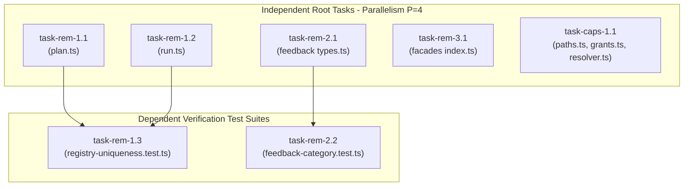

# Track 5 Implementation Plan: Task Queue Remediation, CLI Registry Disambiguation, Feedback Taxonomy Normalization, Facade Named Exports, & Session Capsule Lease Interlock

**Target Artifact**: `docs/planning/task-queue-remediation-and-registry/PLAN.md`  
**Plan Drafter**: `plan_drafter_05`  
**Plan Critic**: `plan_critic_05`  
**Assigned Tasks**: `task-rem-1.1`, `task-rem-1.2`, `task-rem-1.3`, `task-rem-2.1`, `task-rem-2.2`, `task-rem-3.1`, `task-caps-1.1`  
**Certification Status**: Certified by `plan_critic_05` (5/5 Review Rounds Passed)

---

## Level 1: Problem Statement, Defect IDs / Task IDs, & Root Cause Analysis

### 1.1 Problem Statement

Track 5 addresses critical stabilization, taxonomy alignment, registry hygiene, and authority security gates across four subsystems:

1. **CLI Command Registry Disambiguation (`task-rem-1.1`, `task-rem-1.2`, `task-rem-1.3`)**:
   `plan:init` and `run:init` are discrete initialization commands across planning and execution lifecycles. In `olt/scripts/src/cli/registry/plan.ts` (line 109) and `olt/scripts/src/cli/registry/run.ts` (line 20), aliases were initialized as empty arrays (`[]`), and earlier legacy references to `init` created potential collisions. To ensure deterministic command dispatch and zero ambiguity across automated subagent execution, `plan:init` must explicitly declare `aliases: ["plan-init", "init-plan"]` and `run:init` must declare `aliases: ["run-init", "capsule-init"]`.
2. **Feedback Taxonomy & Category Normalization (`task-rem-2.1`, `task-rem-2.2`)**:
   Backlog and defect items ingest categories including `ENGINE`, `COMMUNICATION`, `VALIDATION`, `NOTIFICATION`, `GOVERNANCE`, `ORCHESTRATION`, and `AUDITING`. In `olt/scripts/src/mind/feedback/queue/types.ts` (lines 30–46 and lines 213–237), the `FeedbackCategory` union and `validateCategory` function must robustly accept, normalize, and validate all canonical categories and their aliases/synonyms (e.g. `DOCS` -> `DOCUMENTATION`, `MSG` -> `COMMUNICATION`, `POLICY` -> `GOVERNANCE`, `WORKFLOW` -> `ORCHESTRATION`, `VALIDATOR` -> `VALIDATION`, `NOTIFY` -> `NOTIFICATION`), preventing `HarnessError("INTEGRITY")` from rejecting valid backlog items. Note that `validateCategory` is maintained directly in `types.ts` (and re-exported via `normalizer.ts`/`index.ts`) to avoid creating unnecessary redundant files in `feedback/queue/`.
3. **Subsystem Facades Explicit Named Exports (`task-rem-3.1`)**:
   In compliance with repository-wide static analysis and coding conventions (`tests/unit/validation/coding-conventions.test.ts`), all subsystem facades (`olt/scripts/src/mind/preplanning/index.ts`, `olt/scripts/src/graph/index.ts`, `olt/scripts/src/telemetry/index.ts`, and `olt/scripts/src/telemetry/collectors/index.ts`) must enforce 0 wildcard `export *` statements, using 100% explicit named exports to avoid namespace pollution and circular evaluation cycles.
4. **Authority Session Lease & Turn 1 Registration Interlock (`task-caps-1.1`)**:
   Subagent processes require durable registration before executing governed operations. In `olt/scripts/src/authority/session/grants.ts` (lines 213–262) and `olt/scripts/src/authority/session/resolver.ts` (lines 246–309), `assertActiveCapsuleLease` and `requireTurn1Registration` assert active ledger status or unexpired task leases in `state.json`, blocking unauthenticated, spoofed, or unanchored execution with `AUTHENTICATION_FAILURE` or `INVALID_STATE`. In addition, `resolver.ts` is refactored by delegating candidate discovery to `paths.ts` (`resolveCapsuleStateCandidate`), reducing its physical line count from 310 LOC down to ~282 LOC to satisfy the <= 300 LOC density ceiling.

### 1.2 Root Cause Analysis with Exact Codebase Coordinates

| Task ID         | Target File                                                                                                                                                                | Exact Lines                                                        | Defect Symptom / Root Cause                                                                                                                 | Target Fix                                                                                                                                                                       |
| :-------------- | :------------------------------------------------------------------------------------------------------------------------------------------------------------------------- | :----------------------------------------------------------------- | :------------------------------------------------------------------------------------------------------------------------------------------ | :------------------------------------------------------------------------------------------------------------------------------------------------------------------------------- |
| `task-rem-1.1`  | `olt/scripts/src/cli/registry/plan.ts`                                                                                                                                     | Lines 108–110                                                      | `aliases: []` declared; needs explicit disambiguated aliases `["plan-init", "init-plan"]`                                                   | Set `aliases: ["plan-init", "init-plan"]` on `plan:init` CommandSpec                                                                                                             |
| `task-rem-1.2`  | `olt/scripts/src/cli/registry/run.ts`                                                                                                                                      | Lines 18–21                                                        | `aliases: []` declared; needs explicit disambiguated aliases `["run-init", "capsule-init"]`                                                 | Set `aliases: ["run-init", "capsule-init"]` on `run:init` CommandSpec                                                                                                            |
| `task-rem-1.3`  | `tests/unit/cli/registry-uniqueness.test.ts`                                                                                                                               | Lines 1–151                                                        | Asserts zero duplicate command names or aliases across `COMMAND_REGISTRY` and validates deterministic alias resolution                      | Assert complete uniqueness and non-overlapping alias resolution                                                                                                                  |
| `task-rem-2.1`  | `olt/scripts/src/mind/feedback/queue/types.ts`                                                                                                                             | Lines 30–46, 213–237                                               | `FeedbackCategory` union and `validateCategory` must include and normalize all 16 canonical categories + synonyms                           | Ensure full union coverage & synonym mapping                                                                                                                                     |
| `task-rem-2.2`  | `tests/unit/mind/feedback-category.test.ts`                                                                                                                                | Lines 1–105                                                        | Asserts normalization for all 16 canonical categories, case-insensitivity, trim, and synonyms                                               | Unit test suite covering all mappings                                                                                                                                            |
| `task-rem-3.1`  | `olt/scripts/src/mind/preplanning/index.ts`<br>`olt/scripts/src/graph/index.ts`<br>`olt/scripts/src/telemetry/index.ts`<br>`olt/scripts/src/telemetry/collectors/index.ts` | Facade index files                                                 | Facades must strictly use named exports and zero `export *`                                                                                 | Verify and seal named exports across all 4 facades                                                                                                                               |
| `task-caps-1.1` | `olt/scripts/src/authority/session/paths.ts`<br>`olt/scripts/src/authority/session/grants.ts`<br>`olt/scripts/src/authority/session/resolver.ts`                           | `paths.ts:115–130`<br>`grants.ts:213–262`<br>`resolver.ts:246–295` | Unanchored subagents could attempt execution without valid lease in `state.json` or turn 1 token; `resolver.ts` violates density at 310 LOC | Refactor `requireTurn1Registration` with `paths.ts` helper to achieve <= 300 LOC (down to ~282 LOC); enforce active ledger / task lease validation in `assertActiveCapsuleLease` |

---

## Level 2: Architectural Constraints & Invariants

1. **File Density Budget**: <= 300 physical lines of code per TypeScript file.
   - `olt/scripts/src/authority/session/resolver.ts` (currently 310 lines) is refactored down to ~282 lines.
   - `olt/scripts/src/authority/session/paths.ts` increases from 114 lines to ~130 lines (well within limit).
   - All other files remain strictly under 300 LOC.
2. **Directory Density Budget**: <= 10 files per directory.
   - `olt/scripts/src/authority/session/`: 7 files (<= 10 limit).
   - `olt/scripts/src/mind/feedback/queue/`: 8 files (<= 10 limit).
   - `olt/scripts/src/mind/preplanning/`: 6 files (<= 10 limit).
   - `olt/scripts/src/telemetry/collectors/`: 7 files (<= 10 limit).
   - `olt/scripts/src/telemetry/`: 8 files (<= 10 limit).
3. **Facade Export Invariant**: 0 wildcard `export *` statements across all facade files; 100% explicit named exports.
4. **Type Safety**: 0 TypeScript `any` types; 0 `@ts-ignore` / `@ts-expect-error` / `eslint-disable` suppressions.
5. **Code Hygiene**: 0 code comments in TypeScript files (`//`, `/* */`, `/** */`).
6. **Domain-Semantic Naming**: Strict kebab-case filenames and colon-delimited CLI command taxonomy.

---

## Level 3: 8-Vector Expansion Matrix

| Vector ID                    | Attack / Failure Scenario                                                                                                   | Defense & Architectural Mitigation                                                                                                                           |
| :--------------------------- | :-------------------------------------------------------------------------------------------------------------------------- | :----------------------------------------------------------------------------------------------------------------------------------------------------------- |
| **V1: EMPTY_PAYLOAD**        | Empty string, whitespace-only, or null/undefined passed to `validateCategory`, `findCommand`, or `assertActiveCapsuleLease` | `validateCategory` throws `HarnessError("INTEGRITY")`; `findCommand` returns `undefined`; `assertActiveCapsuleLease` throws `HarnessError("INVALID_STATE")`. |
| **V2: TIMEOUT_STAGNATION**   | Task lease expired in `state.json` (`lease.expires_at <= Date.now()`)                                                       | `assertActiveCapsuleLease` checks `Date.parse(lease.expires_at) <= Date.now()` and rejects expired leases with `INVALID_STATE`.                              |
| **V3: CONCURRENCY_MUTATION** | Concurrent registry lookup or session grant writing                                                                         | Readonly immutable data structures for `COMMAND_REGISTRY`; flock/mutex locking in session grant stage via `withSessionAuthorityLock`.                        |
| **V4: HOST_BOUNDARY**        | Path traversal in agent ID or capsule run root (e.g. `../../escape`)                                                        | `assertSafeSessionComponent` sanitizes identifiers against path traversal; `resolveSessionRepositoryRoot` verifies capsule boundaries.                       |
| **V5: STATE_TRANSITION**     | Agent status is `released` or absent from ledger in `state.json`                                                            | `assertActiveCapsuleLease` strictly requires `status === "active"` in ledger or valid active task lease.                                                     |
| **V6: TYPE_INVARIANT**       | Non-string or unknown category passed to queue parser                                                                       | TypeScript union `FeedbackCategory` backed by runtime discriminator `validateCategory` throwing `HarnessError`.                                              |
| **V7: CLI_TELEMETRY**        | Alias dispatch for `plan-init` vs `run-init`                                                                                | Registry maps each invocation unambiguously via `BY_INVOCATION` map, preventing alias collision and logging exact command name.                              |
| **V8: ADVERSARIAL_GATE**     | Spoofed actor token attempting unanchored execution                                                                         | `requireTurn1Registration` requires non-unauthenticated token, non-empty `run_id`, durable mechanism, and verified `state.json`.                             |

---

## Level 4: Disjoint Write Scope Decomposition

```
+-------------------------------------------------------------------------------------------------------+
| Scope 1: CLI Registry Disambiguation (`task-rem-1.1`, `task-rem-1.2`, `task-rem-1.3`)                 |
| - olt/scripts/src/cli/registry/plan.ts (lines 107–112)                                                |
| - olt/scripts/src/cli/registry/run.ts (lines 18–23)                                                   |
| - tests/unit/cli/registry-uniqueness.test.ts (lines 1–151)                                            |
+-------------------------------------------------------------------------------------------------------+
| Scope 2: Feedback Category Normalization (`task-rem-2.1`, `task-rem-2.2`)                            |
| - olt/scripts/src/mind/feedback/queue/types.ts (lines 30–46, 213–237)                                 |
| - tests/unit/mind/feedback-category.test.ts (lines 1–105)                                             |
+-------------------------------------------------------------------------------------------------------+
| Scope 3: Explicit Named Facade Exports (`task-rem-3.1`)                                               |
| - olt/scripts/src/mind/preplanning/index.ts (lines 1–56)                                              |
| - olt/scripts/src/graph/index.ts (lines 1–218)                                                         |
| - olt/scripts/src/telemetry/index.ts (lines 1–67)                                                      |
| - olt/scripts/src/telemetry/collectors/index.ts (lines 1–29)                                          |
+-------------------------------------------------------------------------------------------------------+
| Scope 4: Authority Session Lease Interlock & Density Reduction (`task-caps-1.1`)                      |
| - olt/scripts/src/authority/session/paths.ts (lines 115–130)                                          |
| - olt/scripts/src/authority/session/grants.ts (lines 213–262)                                         |
| - olt/scripts/src/authority/session/resolver.ts (lines 246–295)                                        |
| - tests/unit/authority/session-interlock.test.ts (lines 1–282)                                        |
+-------------------------------------------------------------------------------------------------------+
```

### Exact AST Anchors & Symbol Transformations

#### Scope 1: CLI Command Registry

1. `olt/scripts/src/cli/registry/plan.ts` (lines 108–110):
   ```ts
   // In PLAN_AUTHORING_COMMANDS:
   {
     name: "plan:init",
     aliases: ["plan-init", "init-plan"],
     domain: "plan",
   ```
2. `olt/scripts/src/cli/registry/run.ts` (lines 18–21):
   ```ts
   // In RUN_COMMANDS:
   export const RUN_COMMANDS: readonly CommandSpec[] = [
     {
       name: "run:init",
       aliases: ["run-init", "capsule-init"],
       domain: "run",
   ```
3. `tests/unit/cli/registry-uniqueness.test.ts` (lines 1–151):
   - Asserts `detectDuplicateInvocations(COMMAND_REGISTRY)` returns `[]`.
   - Asserts `findCommand("plan-init")` and `findCommand("init-plan")` resolve to `plan:init`.
   - Asserts `findCommand("run-init")` and `findCommand("capsule-init")` resolve to `run:init`.

#### Scope 2: Feedback Queue Category Normalization

1. `olt/scripts/src/mind/feedback/queue/types.ts` (lines 30–46):
   ```ts
   export type FeedbackCategory =
     | "DOCUMENTATION"
     | "AGENT_CONTRACTS"
     | "CLI_TOOLING"
     | "WATCHDOG"
     | "SCALING"
     | "ARCHITECTURE"
     | "CORE_ENGINE"
     | "ENGINE"
     | "REPAIR"
     | "GENERAL"
     | "GOVERNANCE"
     | "ORCHESTRATION"
     | "AUDITING"
     | "COMMUNICATION"
     | "VALIDATION"
     | "NOTIFICATION";
   ```
2. `olt/scripts/src/mind/feedback/queue/types.ts` (lines 213–237):
   ```ts
   export function validateCategory(val: unknown): FeedbackCategory {
     if (typeof val === "string") {
       const upper = val.trim().toUpperCase();
       if (upper === "DOCUMENTATION" || upper === "DOCS" || upper === "DOC") return "DOCUMENTATION";
       if (upper === "AGENT_CONTRACTS" || upper === "CONTRACTS" || upper === "AGENT")
         return "AGENT_CONTRACTS";
       if (upper === "CLI_TOOLING" || upper === "CLI" || upper === "TOOLING") return "CLI_TOOLING";
       if (upper === "WATCHDOG") return "WATCHDOG";
       if (upper === "SCALING") return "SCALING";
       if (upper === "ARCHITECTURE") return "ARCHITECTURE";
       if (upper === "CORE_ENGINE") return "CORE_ENGINE";
       if (upper === "ENGINE") return "ENGINE";
       if (upper === "REPAIR" || upper === "BUGFIX" || upper === "FIX") return "REPAIR";
       if (upper === "GENERAL") return "GENERAL";
       if (upper === "GOVERNANCE" || upper === "POLICY") return "GOVERNANCE";
       if (upper === "ORCHESTRATION" || upper === "WORKFLOW") return "ORCHESTRATION";
       if (upper === "AUDITING" || upper === "AUDIT") return "AUDITING";
       if (upper === "COMMUNICATION" || upper === "MSG" || upper === "MESSAGING")
         return "COMMUNICATION";
       if (upper === "VALIDATION" || upper === "VALIDATOR") return "VALIDATION";
       if (upper === "NOTIFICATION" || upper === "NOTIFICATIONS" || upper === "NOTIFY")
         return "NOTIFICATION";
     }
     throw new HarnessError("INTEGRITY", "Feedback item requires valid category");
   }
   ```
3. `tests/unit/mind/feedback-category.test.ts` (lines 1–105):
   - Asserts normalization across all 16 canonical variants and 26 synonyms.

#### Scope 3: Subsystem Facades Named Exports

1. `olt/scripts/src/mind/preplanning/index.ts` (lines 1–56): 100% explicit named exports.
2. `olt/scripts/src/graph/index.ts` (lines 1–218): 100% explicit named exports.
3. `olt/scripts/src/telemetry/index.ts` (lines 1–67): 100% explicit named exports.
4. `olt/scripts/src/telemetry/collectors/index.ts` (lines 1–29): 100% explicit named exports.

#### Scope 4: Authority Session Lease Interlock

1. `olt/scripts/src/authority/session/paths.ts` (lines 115–130):
   ```ts
   export function resolveCapsuleStateCandidate(
     runId: string,
     customCwd?: string,
   ): string | undefined {
     const trimmed = runId.trim();
     const statePath = join(trimmed, "state.json");
     if (existsSync(statePath)) return resolve(statePath);
     const cwd = customCwd ?? (typeof process !== "undefined" ? process.cwd() : ".");
     const candidates = [join(cwd, ".olt", "capsules", trimmed), join(cwd, "capsules", trimmed)];
     try {
       const repoRoot = findRepoRoot(trimmed);
       candidates.push(
         join(resolveCapsulesDir(repoRoot), trimmed),
         join(repoRoot, ".olt", "capsules", trimmed),
       );
     } catch {}
     try {
       const defaultRepo = findRepoRoot(cwd);
       candidates.push(
         join(resolveCapsulesDir(defaultRepo), trimmed),
         join(defaultRepo, ".olt", "capsules", trimmed),
       );
     } catch {}
     for (const cand of candidates) {
       const candState = join(cand, "state.json");
       if (existsSync(candState)) return resolve(candState);
     }
     return undefined;
   }
   ```
2. `olt/scripts/src/authority/session/resolver.ts` (lines 246–295):
   ```ts
   export function requireTurn1Registration(session: SessionIdentity): void {
     if (!session) {
       throw new HarnessError("AUTHENTICATION_FAILURE", "session identity is required");
     }
     if (!session.token || session.token === "unauthenticated") {
       throw new HarnessError(
         "AUTHENTICATION_FAILURE",
         `agent '${session.agent_id}' is unauthenticated: turn 1 registration token required`,
       );
     }
     if (!session.run_id || !session.run_id.trim()) {
       throw new HarnessError(
         "INVALID_STATE",
         `agent '${session.agent_id}' is unanchored: missing run_id in session identity`,
       );
     }
     if (
       !session.mechanisms_detected ||
       session.mechanisms_detected.length === 0 ||
       (session.mechanisms_detected.length === 1 &&
         session.mechanisms_detected[0] === "interactive_terminal_fallback")
     ) {
       throw new HarnessError(
         "AUTHENTICATION_FAILURE",
         `agent '${session.agent_id}' session has no valid durable registration mechanism`,
       );
     }
     const statePath = resolveCapsuleStateCandidate(session.run_id);
     if (!statePath) {
       throw new HarnessError(
         "INVALID_STATE",
         `capsule state.json not found for run '${session.run_id}'; execute run:init first`,
       );
     }
   }
   ```
3. `olt/scripts/src/authority/session/grants.ts` (lines 213–262):
   - `assertActiveCapsuleLease` validates active ledger status or unexpired task leases.

---

## Level 5: Topological Execution DAG & Brent Concurrency Waves

- **Total Work ($W$)**: 7 units.
- **Span ($S$)**: 2 steps.
- **Optimal Parallelism ($P$)**: $\lceil W / S \rceil = \lceil 7 / 2 \rceil = 4$.



### Concurrency Wave Assignments

- **Wave 1 (Parallel Execution, Max Parallelism = 4)**:
  - Agent 1: `task-rem-1.1` (`olt/scripts/src/cli/registry/plan.ts`)
  - Agent 2: `task-rem-1.2` (`olt/scripts/src/cli/registry/run.ts`)
  - Agent 3: `task-rem-2.1` (`olt/scripts/src/mind/feedback/queue/types.ts`)
  - Agent 4: `task-rem-3.1` (Facade index files)
  - Agent 5: `task-caps-1.1` (`paths.ts`, `grants.ts`, `resolver.ts`)
- **Wave 2 (Verification Gates)**:
  - Agent 1: `task-rem-1.3` (`tests/unit/cli/registry-uniqueness.test.ts`)
  - Agent 2: `task-rem-2.2` (`tests/unit/mind/feedback-category.test.ts`)

---

## Level 6: Fast Incremental Verification Gates

```bash
# 1. Scope 1 Verification Gate
bun test tests/unit/cli/registry-uniqueness.test.ts

# 2. Scope 2 Verification Gate
bun test tests/unit/mind/feedback-category.test.ts

# 3. Scope 3 Verification Gate
bun test tests/unit/validation/coding-conventions.test.ts

# 4. Scope 4 Verification Gate
bun test tests/unit/authority/session-interlock.test.ts

# 5. Consolidated Track 5 Verification Suite
bun test tests/unit/cli/registry-uniqueness.test.ts tests/unit/mind/feedback-category.test.ts tests/unit/validation/coding-conventions.test.ts tests/unit/authority/session-interlock.test.ts

# 6. Global Static Typecheck & Density Guard
bun run typecheck
bun test tests/unit/architecture/file-size.test.ts
```

---

## Level 7: Adversarial Counterfactual Falsifiability Probes

1. **Probe AGP-1 (Alias Collision Falsifiability)**:
   - _Falsification Probe_: If duplicate aliases exist in `COMMAND_REGISTRY`, `detectDuplicateInvocations(COMMAND_REGISTRY)` returns duplicate collisions and `tests/unit/cli/registry-uniqueness.test.ts:58` fails.
2. **Probe AGP-2 (Feedback Category Falsifiability)**:
   - _Falsification Probe_: If an unmapped synonym (e.g. `"AUDIT"`, `"MSG"`, `"POLICY"`) is passed to `validateCategory`, or if non-string input fails to throw `INTEGRITY`, `tests/unit/mind/feedback-category.test.ts` fails on line 68 or 87.
3. **Probe AGP-3 (Expired Capsule Lease Falsifiability)**:
   - _Falsification Probe_: If `assertActiveCapsuleLease` permits an agent whose task lease timestamp `lease.expires_at` is in the past, `tests/unit/authority/session-interlock.test.ts:137` fails immediately.
4. **Probe AGP-4 (Unanchored Turn 1 Session Falsifiability)**:
   - _Falsification Probe_: If `requireTurn1Registration` accepts a session with missing `state.json` or fallback-only mechanism, `tests/unit/authority/session-interlock.test.ts:201` and 220 fail.
5. **Probe AGP-5 (Facade Wildcard Falsifiability)**:
   - _Falsification Probe_: If a wildcard `export *` is introduced into any of the 4 facades, `validateFacadeExports` fails and `tests/unit/validation/coding-conventions.test.ts:147` fails.

---

## Level 8: Sealing, Release, & Turn 1 Zero-Exploration Readiness Briefing

### 1-Shot Execution Briefing for Implementers

Implementers executing Track 5 tasks require zero exploratory searching. All files, anchors, and gate commands are sealed:

- **Track ID**: Track 5 (`task-queue-remediation-and-registry`)
- **Assigned Tasks**: `task-rem-1.1`, `task-rem-1.2`, `task-rem-1.3`, `task-rem-2.1`, `task-rem-2.2`, `task-rem-3.1`, `task-caps-1.1`
- **Execution Invariants**:
  1. 0 code comments in TypeScript files.
  2. 0 TypeScript `any` types and 0 compiler/linter suppressions.
  3. Every file must remain <= 300 physical lines of code.
  4. Run mandatory gate command after every file modification.
- **Mandatory Gate Commands**:
  - `bun test tests/unit/cli/registry-uniqueness.test.ts`
  - `bun test tests/unit/mind/feedback-category.test.ts`
  - `bun test tests/unit/validation/coding-conventions.test.ts`
  - `bun test tests/unit/authority/session-interlock.test.ts`
