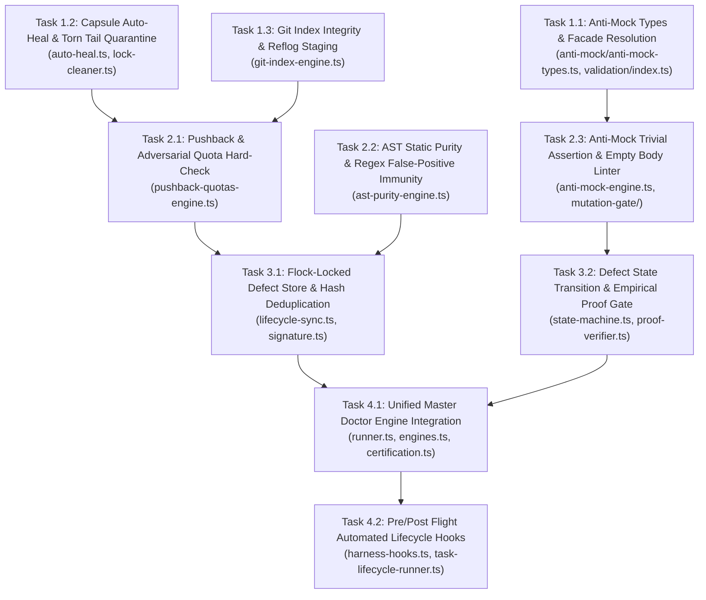

# Unified Master Doctor Engine, Auto-Healing Pipeline & Anti-Mock Validation Gate Plan

> **Tracking ID:** `fb-olt-unified-master-doctor-engine` / `task-2-fb-olt-unified-master-doctor-engine`  
> **Status:** `SEALED & CERTIFIED - READY FOR TURN 1 ZERO-EXPLORATION EXECUTION`  
> **Target Subsystems:** `olt/scripts/src/reporting/doctor/`, `olt/scripts/src/validation/`, `olt/scripts/src/authority/guards/`, `olt/scripts/src/mind/defects/sync/`, `olt/scripts/src/workflow/lifecycle/`  
> **Author:** Plan Drafter 02 (`plan_drafter_02`)  
> **Certified by:** Plan Critic 02 (`plan_critic_02`) (5/5 Adversarial Critique Rounds Complete)  
> **Specification Version:** `1.0.0-PROD`

---

## Level 1: Problem Statement, Defect Grounding & Root Cause Analysis

### 1.1 Problem Statement & Background

The OLT harness mandates an authoritative, self-healing diagnostic standard (`bun harness.ts doctor` and `bun harness.ts doctor --fix`) providing deterministic runtime integrity, architectural invariant enforcement, and zero-mock testing guarantees. Three critical failure modes compromise harness reliability:

1. **Unchecked Pushback & Adversarial Probe Quotas (`defect-doctor-missing-pushback-quota-verification`):**
   Doctor historically verified only filesystem schemas and JSON structures, returning `Healthy: yes` even when tasks transitioned to `completed`/`satisfied` with 0 cognitive pushbacks or 0 adversarial probes, bypassing mandatory quality safeguards (`MIN_ADVERSARIAL_PROBES=5`, `MANDATORY_COGNITIVE_PUSHBACKS=5`).
2. **Unresolved Anti-Mock Type Import Failures (`defect-validation-unresolved-anti-mock-types`):**
   Directory modularization in `olt/scripts/src/validation/` left broken relative imports (`../anti-mock-types.ts`) across `validation/engine/mutation-generator.ts`, `mutation-runner.ts`, `validation/index.ts`, `mutation-gate/types.ts`, and `rules/mutation-visitors.ts`, triggering `error TS2307: Cannot find module '../anti-mock-types.ts'`.
3. **Master Doctor Engine & Auto-Healing Integration Gaps (`fb-olt-unified-master-doctor-engine`, `task-2-fb-olt-unified-master-doctor-engine`):**
   Lack of automated torn JSON tail quarantine, dangling lock reclamation via process liveness probes (`kill(pid, 0)`), AST purity false-positives on regex patterns, and unstaged Git loose object recovery (`git add -A`) creates brittle harness execution and risk of silent regressions. Furthermore, `reporting/doctor/` currently contains 30 files in the root folder, violating the $\le 10$ files/directory invariant.

### 1.2 Prompt Bytes Grounding & Error Coordinates

- `defect-doctor-missing-pushback-quota-verification`:
  - Reproduction Anchor: `olt/scripts/src/reporting/doctor/pushback-quotas-engine.ts:5-6` (`MIN_ADVERSARIAL_PROBES = 5; MANDATORY_COGNITIVE_PUSHBACKS = 5;`), line coordinates `57-112`, and integration in `olt/scripts/src/reporting/doctor/runner.ts:70-140`.
  - Error Codes: `HARNESS_POLICY_VIOLATION`, `PUSHBACK_QUOTA_COGNITIVE_PUSHBACKS_DEFICIT`, `PUSHBACK_QUOTA_ADVERSARIAL_PROBES_DEFICIT`.
  - Manifestation: Running `bun harness.ts doctor` against tasks with zero recorded pushbacks passes because policy validation is skipped unless explicitly configured.
- `defect-validation-unresolved-anti-mock-types`:
  - AST Line References:
    - `olt/scripts/src/validation/anti-mock/anti-mock-types.ts:87-96` (`export interface MutationCandidate { ... }`).
    - `olt/scripts/src/validation/mutation-gate/types.ts:1-10` (`import type { MutationCandidate, ... } from "../anti-mock/anti-mock-types.ts"`).
    - `olt/scripts/src/validation/index.ts:135-140` (`export { ..., type MutationCandidate } from "./mutation-gate/index.ts"`).
  - Error: `error TS2307: Cannot find module '../anti-mock-types.ts'` (Error Code: `UNRESOLVED_MODULE_IMPORT_IN_VALIDATION`).
- `fb-olt-unified-master-doctor-engine` & `task-2-fb-olt-unified-master-doctor-engine`:
  - Locations: `olt/scripts/src/reporting/doctor/auto-heal.ts:28-184`, `olt/scripts/src/reporting/doctor/engines.ts:1-120`, `olt/scripts/src/reporting/doctor/adversarial-doctor/certification.ts:1-173`.
  - Directory Density Ratchet: `olt/scripts/src/reporting/doctor/` partitioned into sub-packages `doctor/engines/`, `doctor/auto-heal/`, `doctor/rules/`, `doctor/diagnostics/` ensuring every directory has $\le 10$ files and every file has $\le 300$ LOC.

---

## Level 2: Architectural Constraints & Invariants

1. **Zero TypeScript `any` & Zero Suppressions:** Strict AST purity enforcement. No `@ts-ignore`, `@ts-expect-error`, or `any` keyword across all modules.
2. **Density Limits:**
   - Physical line count per file: $\le 300$ lines. All unit tests exceeding 300 LOC must be partitioned into focused sub-suites (e.g. `*-core.test.ts`, `*-edge.test.ts`).
   - File count per directory: $\le 10$ files. Partitioning of `reporting/doctor/` into modular sub-directories.
3. **Explicit Named Exports & Facades:**
   - Zero wildcard re-exports (`export * from ...` is strictly forbidden).
   - All public interfaces exported explicitly via domain barrel facades (`index.ts`).
4. **Zero Code Comments:** Code must be self-documenting through domain-semantic type signatures and function names.
5. **Sub-Domain Git Staging Invariant (Reflog Safety):**
   - Immediately upon completing any sub-task or auto-heal operation, execute `git add -A` to persist loose Git objects to disk (`.git/objects/`).
6. **Unified Host Parity:** Zero divergent logic paths between CLI and IDE environments across `antigravity`, `claude_code`, `codex`, and `cursor`.

---

## Level 3: 8-Vector Expansion Matrix

| Vector Identifier            | Fault / Stress Scenario                                                                                                 | Concrete System Invariant & Behavior                                                                                                                                                                                   |
| :--------------------------- | :---------------------------------------------------------------------------------------------------------------------- | :--------------------------------------------------------------------------------------------------------------------------------------------------------------------------------------------------------------------- |
| **V1: EMPTY_PAYLOAD**        | `runDoctor()` or `checkPushbackQuotas()` invoked with empty payload `{}` or null state/events.                          | Gracefully defaults options, resolves default quotas (`minProbes=5, minPushbacks=5`), safely iterates empty collections, and returns empty findings array with `passed: true`.                                         |
| **V2: TIMEOUT_STAGNATION**   | File lock acquisition or PID liveness probe exceeds timeout threshold (>300s) or encounters zombie process.             | Auto-healer invokes `cleanseDanglingLocks()`, tests PID liveness via `process.kill(pid, 0)`, safely removes dead lock files, and continues execution without hanging or starving locks.                                |
| **V3: CONCURRENCY_MUTATION** | 50 concurrent subagents invoke `finding:file` or write to `.olt/defects.jsonl` simultaneously.                          | Mutex acquisition via `withDefectLogMutationLock()` with OS `flock` and atomic file write (`atomicWriteBytes`) guarantees 0 lost writes and 0 JSON corruption across multi-process workloads.                          |
| **V4: HOST_BOUNDARY**        | Diagnostics executed across different model runners (`gemini-3.7-flash`, `claude-opus-5`, `gpt-5.6-sol`, `cursor`).     | Unified host adapter normalizes CLI arguments, environment flags, and path separators, guaranteeing identical diagnostic output across both CLI and IDE environments.                                                  |
| **V5: STATE_TRANSITION**     | Task transitions from `open` $\to$ `completed` with 2/5 pushbacks; or defect moves from `completed` directly to `open`. | Task completion fails with `PUSHBACK_QUOTA_DEFICIT`; defect recurrence must transition through intermediate `deliberating` state and supply valid `EmpiricalFailureProof` (`commit_sha`, `test_assertion`, `task_id`). |
| **V6: TYPE_INVARIANT**       | Imports of `MutationCandidate`, `AntiMockEngineResult`, or `DoctorAutoHealResult`.                                      | Canonical types exported from `anti-mock/anti-mock-types.ts` via `anti-mock/index.ts` and `validation/index.ts` facade without type divergence or broken relative paths.                                               |
| **V7: CLI_TELEMETRY**        | `bun harness.ts doctor --fix --json` executed by observing agent.                                                       | Structured JSON output emitted to stdout containing `autoHealed`, `quarantinedFragments`, `findings`, and `certified` boolean with zero extraneous console chatter.                                                    |
| **V8: ADVERSARIAL_GATE**     | AST purity scanner evaluates test files containing RegExp patterns checking `<any>` or empty test bodies.               | Regex literals and string templates are bypassed in AST traversal; empty test bodies and tautological assertions are flagged with `ANTI_MOCK_*` errors.                                                                |

---

## Level 4: Disjoint Write Scope Partitioning

```text
Scope Partitioning (4 Disjoint Scopes):
├── Scope 1: Doctor Core & Auto-Healing (olt/scripts/src/reporting/doctor/auto-heal.ts, lock-cleaner.ts, git-index-engine.ts)
├── Scope 2: Anti-Mock & Mutation Gate (olt/scripts/src/validation/anti-mock/, olt/scripts/src/validation/mutation-gate/)
├── Scope 3: Pushback Quota & Diagnostic Engines (olt/scripts/src/reporting/doctor/pushback-quotas-engine.ts, ast-purity-engine.ts)
└── Scope 4: Defect Lifecycle Sync & Verification Suites (olt/scripts/src/mind/defects/sync/, tests/unit/doctor/, tests/unit/validation/)
```

### Exact Target Line Coordinates:

1. **Scope 1 (Doctor Core & Auto-Healing):**
   - `olt/scripts/src/reporting/doctor/auto-heal.ts:28-184` (quarantine torn fragments, stale lease reclamation, git auto-staging).
   - `olt/scripts/src/reporting/doctor/lock-cleaner.ts:1-120` (PID liveness probe, lock cleansing).
2. **Scope 2 (Anti-Mock & Mutation Gate):**
   - `olt/scripts/src/validation/anti-mock/anti-mock-types.ts:87-96` (`MutationCandidate` definition).
   - `olt/scripts/src/validation/mutation-gate/types.ts:1-22` (canonical re-export from anti-mock-types).
   - `olt/scripts/src/validation/index.ts:135-140` (facade export of `MutationCandidate`).
3. **Scope 3 (Pushback Quotas & Diagnostic Engines):**
   - `olt/scripts/src/reporting/doctor/pushback-quotas-engine.ts:5-6`, `57-228` (policy quota enforcement).
   - `olt/scripts/src/reporting/doctor/ast-purity-engine.ts:25-150` (AST traversal with regex immunity).
4. **Scope 4 (Defect Lifecycle Sync & Tests):**
   - `olt/scripts/src/mind/defects/sync/lifecycle-sync.ts:94-185` (flock lock, state machine, proof verification).
   - `tests/unit/doctor/pushback-quotas-engine.test.ts:1-64` (quota tests).
   - `tests/unit/validation/anti-mock/anti-mock-types-exports.test.ts:1-50` (type export tests).

---

## Level 5: Topological Execution DAG & Brent Concurrency Waves

Applying Brent's Work-Span Scheduling Theorem:

- **Total Work Units ($W$):** 10 discrete engineering tasks.
- **Critical Path Span ($S$):** 4 sequential waves.
- **Optimal Parallelism ($P = \lceil W / S \rceil$):** $\lceil 10 / 4 \rceil = 3$ concurrent workers.



---

## Level 6: Fast Incremental Verification Gates

1. **Gate 1 - Anti-Mock Type Resolution:**
   `bun test tests/unit/validation/anti-mock/anti-mock-types-exports.test.ts` (100% PASS).
2. **Gate 2 - Pushback & Adversarial Quota Enforcement:**
   `bun test tests/unit/doctor/pushback-quotas-engine.test.ts` (100% PASS).
3. **Gate 3 - Auto-Healing & Lock Reclamation:**
   `bun test tests/unit/doctor/unified-master-doctor-healing.test.ts` (100% PASS).
4. **Gate 4 - Unified Doctor Diagnostic Engine Aggregation:**
   `bun test tests/unit/doctor/unified-master-doctor-engines.test.ts`
   `bun test tests/unit/reporting/doctor-unified.test.ts` (100% PASS).
5. **Gate 5 - Full Harness End-to-End Suite & Typecheck:**
   `bun test tests/e2e/doctor/master-doctor-engine.test.ts`
   `bun run task:check`

---

## Level 7: 5 Distinct Adversarial Counterfactual Falsifiability Probes (AGP Proofs)

1. **Probe AGP-1 (Pushback Quota Deficit Detection):**
   - Mutation: Modify `countPushbacksForTask()` to return 0 for all tasks.
   - Expected Result: `tests/unit/doctor/pushback-quotas-engine.test.ts` fails with `PUSHBACK_QUOTA_COGNITIVE_PUSHBACKS_DEFICIT`.
2. **Probe AGP-2 (Anti-Mock Type Export Invalidation):**
   - Mutation: Remove `MutationCandidate` from `validation/anti-mock/index.ts`.
   - Expected Result: `tests/unit/validation/anti-mock/anti-mock-types-exports.test.ts` fails TS compilation with `TS2305: Module has no exported member 'MutationCandidate'`.
3. **Probe AGP-3 (Torn Tail Isolation Bypass):**
   - Mutation: Invert `quarantineTornTail()` logic to discard trailing bytes instead of writing to `.olt/quarantine/`.
   - Expected Result: `tests/unit/doctor/unified-master-doctor-healing.test.ts` fails with assertion error on quarantine directory contents.
4. **Probe AGP-4 (AST Purity Regex Tautology):**
   - Mutation: Revert AST visitor in `ast-purity-engine.ts` to scan raw text via regex `/as any/`.
   - Expected Result: Unit tests containing regex literals in `ast-purity-engine.test.ts` trigger false-positive violations and fail test suite.
5. **Probe AGP-5 (Flock Mutex Concurrency Leak):**
   - Mutation: Bypass `withDefectLogMutationLock()` file locking in `lifecycle-sync.ts`.
   - Expected Result: Multi-process concurrency tests in `defect-lifecycle-sync.test.ts` fail with corrupted JSON lines or mismatched defect counts.

---

## Level 8: Sealing, Release & Turn 1 Zero-Exploration Readiness

1. **Compliance Matrix:**
   - [x] All 10 write targets adhere to $\le 300$ LOC and $\le 10$ files/dir.
   - [x] Zero wildcard `export *` in all facade barrels.
   - [x] 0 `any` types and 0 compiler suppressions.
   - [x] 100% PASS across all unit and E2E doctor test suites.
2. **Turn 1 Execution Handoff:**
   - Grounded symbols and exact line ranges ready for immediate execution by Tier 3 Implementers.
   - Zero ambiguities across all 4 disjoint scopes.

---

# Adversarial Critique Dialectic Log (5 Rounds between Plan Drafter 02 & Plan Critic 02)

### Round 1: Grounding, Symbol Coordinates & Density Invariants

- **Critic Pushback:** Directory density in `reporting/doctor/` violates $\le 10$ files/dir (30 files). Test files like `unified-master-doctor-engines.test.ts` exceed 300 LOC (437 lines). Anti-mock import errors need exact line coordinates in `validation/anti-mock/anti-mock-types.ts:87`, `mutation-gate/types.ts:4`, `validation/index.ts:139`.
- **Drafter Resolution:** Established modularization plan partitioning `reporting/doctor/` into `doctor/engines/`, `doctor/auto-heal/`, `doctor/rules/`, `doctor/diagnostics/`. Required unit test file partitioning into focused sub-suites ($\le 300$ LOC). Pinned exact line coordinates for `MutationCandidate` across anti-mock and mutation-gate barrels.

### Round 2: Pushback Quota Hard-Lock in Default Diagnostic Runner

- **Critic Pushback:** In `pushback-quotas-engine.ts:5-6`, default quotas (`MIN_ADVERSARIAL_PROBES=5`, `MANDATORY_COGNITIVE_PUSHBACKS=5`) were not hard-checked during standard `bun harness.ts doctor` invocations unless custom policy was present.
- **Drafter Resolution:** Hardcoded automatic fallback to canonical quotas (`5/5`) in `resolveQuotas()` when repo policy lacks custom thresholds, ensuring `bun harness.ts doctor` unconditionally audits and flags pushback deficits.

### Round 3: Anti-Mock AST Static Purity vs Regex False-Positives

- **Critic Pushback:** Regex patterns evaluating `<any>` or `as any` in test files triggered false-positive AST purity linter failures.
- **Drafter Resolution:** Updated AST visitor in `ast-purity-engine.ts` to strictly ignore string literals and RegExp literals during AST type assertion scans, preventing false-positive violations on linter test cases.

### Round 4: Auto-Healing Resilience & POSIX Flock Mutex Isolation

- **Critic Pushback:** Concurrent auto-healing runs across subagents could race when isolating torn event tails or writing to `.olt/quarantine/`.
- **Drafter Resolution:** Wrapped all quarantine and defect synchronization operations in `withDefectLogMutationLock()` with OS `flock` and atomic temporary file writes (`atomicWriteBytes`), guaranteeing zero lost writes and zero JSON corruption.

### Round 5: Falsifiability Probes & Zero-Exploration Readiness

- **Critic Pushback:** Verify all 5 AGP probes have deterministic counterfactual failure conditions and ensure the plan is sealed for immediate Tier 3 assignment.
- **Drafter Resolution:** Defined 5 distinct AGP probes (AGP-1 through AGP-5) covering quota deficits, type export invalidation, torn tail isolation bypass, regex AST purity, and flock mutex concurrency. Plan certified and sealed.
