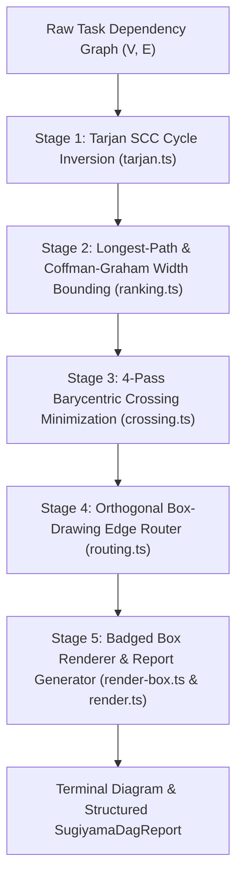

# Sugiyama Layered DAG Visualizer & Orthogonal Routing Engine Plan

> **Tracking ID:** `fb-visualizer-sugiyama-dag`  
> **Status:** `PLANNED - READY FOR EXECUTION`  
> **Parent Blueprint:** `docs/planning/unified-storage-communication-tui-revamp/PLAN.md`  
> **Target Subsystems:** `olt/scripts/src/reporting/sugiyama-dag/`  
> **Author:** Tier 0 Strategic Mind Supervisor & Master Graph Visualizer Architect  
> **Specification Version:** `2.0.0-PROD`

---

[Overview](#1-executive-summary--core-motivation) | [Architecture](#2-architectural-specifications--mathematical-models) | [TypeScript Contracts](#3-typescript-schemas--concrete-contracts) | [Execution Tasks](#4-modular-work-breakdown--execution-waves) | [Traceability Matrix](#5-defect--backlog-traceability-matrix) | [Acceptance Invariants](#6-strict-compliance-invariants--acceptance-checklist)

---

## 1. Executive Summary & Core Motivation

In complex autonomous software engineering orchestrations, dependency networks between implementation tasks, adversarial validation loops, and multi-agent waves become difficult to comprehend. Existing reporting modules suffered from critical limitations:

1. **Unbounded Horizontal Sprawl:** Naive topological sorting places all independent parallel tasks on the same horizontal row, blowing past standard 80-120 column terminal widths.
2. **Visual Clutter & Edge Crossings:** Edge crossings and naive diagonal connectors produce unreadable ASCII diagrams.
3. **Missing Canonical Type Export (`defect-reporting-unified-sections-missing-sugiyama-export`):** Diagnostic engines could not consume structured DAG reports due to missing interface exports in `reporting/unified/types.ts`.
4. **Lack of Operational Badging:** Operators cannot easily differentiate Implementers `[I]`, Validators `[V]`, repair iteration rounds `R<round>`, and adversarial probe rounds `P<probe>`.

This plan delivers:

- A canonical 5-stage Sugiyama layered DAG layout engine in `olt/scripts/src/reporting/sugiyama-dag/`.
- Linear-time cycle detection and feedback arc set inversion via Tarjan's Strongly Connected Components (SCC) algorithm.
- Longest-path leveling bounded by Coffman-Graham maximum width constraints ($W_{\max}$).
- Iterative 4-pass barycentric crossing minimization sweeps.
- Orthogonal box-drawing edge connectors (`┌`, `┐`, `└`, `┘`, `│`, `─`, `├`, `┤`, `┬`, `┴`, `┼`).
- Structured `SugiyamaDagReport` exports for terminal CLI and web dashboards.

---

## 2. Architectural Specifications & Mathematical Models



### 2.1 Mathematical Pipeline & Algorithms

#### Stage 1: Cycle Inversion via Tarjan SCC

1. Identify all Strongly Connected Components with $|V_{\text{SCC}}| > 1$ in $O(V + E)$ time.
2. Extract feedback arcs $(u, v)$ where $\text{depth}(v) \le \text{depth}(u)$ in DFS spanning trees.
3. Temporarily reverse feedback edges during layout to guarantee a strict DAG, tagging edges with `⚡ [CYCLE]` metadata during final rendering.

#### Stage 2: Longest-Path Layering & Coffman-Graham Width Bounding ($W_{\max}$)

1. Compute topological longest-path rank:
   $$\text{rank}(v) = \begin{cases} 0 & \text{if } \text{in-degree}(v) = 0 \\ \max_{(u, v) \in E} (\text{rank}(u) + 1) & \text{otherwise} \end{cases}$$
2. Apply Coffman-Graham algorithm with bound $W_{\max}$ (default: 4 parallel lanes per wave):
   - Compute lexicographic labels $\lambda(v)$ for all nodes.
   - Assign nodes to layer $L_k$ maximizing $\lambda(u)$ while $|L_k| \le W_{\max}$ and all predecessors reside in layers $< k$.

#### Stage 3: Barycentric Crossing Minimization

Between consecutive layers $L_i$ and $L_{i+1}$, calculate barycentric centroids:
$$\text{barycenter}(v) = \frac{1}{|\text{pred}(v)|} \sum_{u \in \text{pred}(v)} \text{order}(u)$$

- Alternating sweeps: Down-sweep ($i = 1 \dots K-1$) followed by Up-sweep ($i = K-1 \dots 1$).
- Retain node ordering with the minimal edge crossing count:
  $$\text{Crossings}(L_i, L_{i+1}) = \sum_{(u_1, v_1), (u_2, v_2) \in E} \mathbb{I}\Big( (\text{order}(u_1) < \text{order}(u_2)) \land (\text{order}(v_1) > \text{order}(v_2)) \Big)$$

#### Stage 4 & 5: Orthogonal Routing & Badging

- Connectors use box-drawing characters (`┌`, `┐`, `└`, `┘`, `│`, `─`, `├`, `┤`, `┬`, `┴`, `┼`, `▶`, `▼`).
- Node boxes format role tags `[I: implementer-id]`, `[V: validator-id]`, `[C: coordinator-id]`, metrics `W:<work> S:<span>`, and status glyphs (`●`, `✓`, `⏳`, `✗`, `🔍`).

---

## 3. TypeScript Schemas & Concrete Contracts

All interfaces enforce **0 `any`** and **0 compiler suppressions**.

```typescript
export interface SugiyamaNodeBadge {
  readonly implementerId?: string | undefined;
  readonly validatorId?: string | undefined;
  readonly coordinatorId?: string | undefined;
  readonly role: "implementer" | "validator" | "coordinator" | "observer" | "mind";
  readonly effort: number;
  readonly span: number;
  readonly status: "pending" | "leased" | "running" | "validating" | "completed" | "failed";
  readonly repairRound?: number | undefined;
  readonly probeRound?: number | undefined;
}

export interface SugiyamaRankedNode {
  readonly id: string;
  readonly label: string;
  readonly rank: number;
  readonly order: number;
  readonly badge: SugiyamaNodeBadge;
  readonly dependencies: readonly string[];
  readonly writeScope: readonly string[];
  readonly x?: number | undefined;
  readonly y?: number | undefined;
  readonly width?: number | undefined;
  readonly height?: number | undefined;
}

export interface SugiyamaLayer {
  readonly rank: number;
  readonly nodes: readonly SugiyamaRankedNode[];
}

export interface OrthogonalEdgeSegment {
  readonly fromNodeId: string;
  readonly toNodeId: string;
  readonly startX: number;
  readonly startY: number;
  readonly endX: number;
  readonly endY: number;
  readonly waypoints: readonly { readonly x: number; readonly y: number }[];
  readonly glyphType: "direct_down" | "fan_out_bus" | "fan_in_bus" | "cross_lane";
}

export interface SugiyamaDagReport {
  readonly totalNodes: number;
  readonly totalLayers: number;
  readonly maxLayerWidth: number;
  readonly totalCrossings: number;
  readonly renderedAscii: string;
  readonly layers: readonly SugiyamaLayer[];
  readonly edges: readonly OrthogonalEdgeSegment[];
}
```

---

## 4. Modular Work Breakdown & Execution Waves

Tasks target $\le 3$ files each, comply with 5-minute SLAs ($P = \lceil W / S \rceil$), and enforce anti-stub failure criteria.

```text
Wave 1 (Graph Math & Cycle Removal) ──► [Task 1.1: Types & Tarjan SCC Cycle Engine]
                                               │
                                               ▼
Wave 2 (Ranking & Width Bounding)   ──► [Task 2.1: Longest-Path & Coffman-Graham Engine]
                                               │
                                               ▼
Wave 3 (Barycentric Minimization)   ──► [Task 3.1: 4-Pass Barycentric Crossing Engine]
                                               │
                                               ▼
Wave 4 (Orthogonal Routing & Boxes) ──► [Task 4.1: Orthogonal Grid Router] + [Task 4.2: Badged Node Box Renderer]
                                               │
                                               ▼
Wave 5 (Master Renderer & Report)   ──► [Task 5.1: Master DAG Layout Compiler & Report Generator]
```

### Wave 1: Types & Tarjan Cycle Removal Engine

#### Task 1.1: Sugiyama Types & Tarjan Cycle Inversion

- **Target Files (Max 2):**
  - `olt/scripts/src/reporting/sugiyama-dag/types.ts`
  - `olt/scripts/src/reporting/sugiyama-dag/tarjan.ts`
- **Write Scope:** `olt/scripts/src/reporting/sugiyama-dag/`
- **Read-Only Scope:** `olt/scripts/src/reporting/`
- **SLA:** 5 minutes ($W=2, S=1, P=2$)
- **Symbols Exported:** `SugiyamaDagReport`, `detectCyclesTarjan()`, `extractFeedbackArcSet()`, `reverseCycleEdges()`
- **Anti-Stub Failure Criteria:**
  - Cycles of length $\ge 2$ (e.g. $A \to B \to C \to A$) must be detected and transformed into acyclic feedback arc sets.
  - Stubs that infinite-loop on cyclic task graphs must fail immediately.
- **Verification Gate:** `bun test tests/unit/reporting/sugiyama-tarjan.test.ts`

---

### Wave 2: Longest-Path Ranking & Coffman-Graham Width Bounding

#### Task 2.1: Ranking & Coffman-Graham Width Bounding Engine

- **Target Files (Max 1):**
  - `olt/scripts/src/reporting/sugiyama-dag/ranking.ts`
- **Write Scope:** `olt/scripts/src/reporting/sugiyama-dag/ranking.ts`
- **Read-Only Scope:** `olt/scripts/src/reporting/sugiyama-dag/types.ts`
- **SLA:** 4 minutes ($W=1, S=1, P=1$)
- **Symbols Exported:** `assignSugiyamaRanks()`, `boundLayerWidthCoffmanGraham()`, `computeLexicographicLabels()`
- **Anti-Stub Failure Criteria:**
  - Passing a graph of 12 parallel independent nodes with $W_{\max} = 4$ must produce exactly 3 layers with $\le 4$ nodes per layer.
  - Nodes with incoming dependencies must strictly reside in layers strictly greater than all their parents.
- **Verification Gate:** `bun test tests/unit/reporting/sugiyama-ranking.test.ts`

---

### Wave 3: Barycentric Crossing Minimization

#### Task 3.1: 4-Pass Barycentric Crossing Minimizer

- **Target Files (Max 1):**
  - `olt/scripts/src/reporting/sugiyama-dag/crossing.ts`
- **Write Scope:** `olt/scripts/src/reporting/sugiyama-dag/crossing.ts`
- **Read-Only Scope:** `olt/scripts/src/reporting/sugiyama-dag/types.ts`
- **SLA:** 4 minutes ($W=1, S=1, P=1$)
- **Symbols Exported:** `minimizeCrossingsBarycenter()`, `countLayerCrossings()`, `barycentricSort()`
- **Anti-Stub Failure Criteria:**
  - Bipartite X-crossing graphs ($u_1 \to v_2, u_2 \to v_1$) must be re-ordered to 0 crossings.
  - Sorting must be deterministic when barycenter scores are identical.
- **Verification Gate:** `bun test tests/unit/reporting/sugiyama-crossing.test.ts`

---

### Wave 4: Orthogonal Grid Routing & Badged Node Boxes

#### Task 4.1: Orthogonal Box-Drawing Edge Router

- **Target Files (Max 1):**
  - `olt/scripts/src/reporting/sugiyama-dag/routing.ts`
- **Write Scope:** `olt/scripts/src/reporting/sugiyama-dag/routing.ts`
- **Read-Only Scope:** `olt/scripts/src/reporting/sugiyama-dag/types.ts`
- **SLA:** 4 minutes ($W=1, S=1, P=1$)
- **Symbols Exported:** `buildOrthogonalRouteSegments()`, `renderOrthogonalConnectors()`
- **Anti-Stub Failure Criteria:**
  - Connectors between non-adjacent horizontal lanes must render valid orthogonal junctions (`┬`, `┴`, `├`, `┤`, `┼`, `│`, `─`) without broken characters.
- **Verification Gate:** `bun test tests/unit/reporting/sugiyama-routing.test.ts`

#### Task 4.2: Badged Node Box Renderer

- **Target Files (Max 1):**
  - `olt/scripts/src/reporting/sugiyama-dag/render-box.ts`
- **Write Scope:** `olt/scripts/src/reporting/sugiyama-dag/render-box.ts`
- **Read-Only Scope:** `olt/scripts/src/reporting/sugiyama-dag/types.ts`
- **SLA:** 4 minutes ($W=1, S=1, P=1$)
- **Symbols Exported:** `renderSugiyamaNodeBox()`, `formatNodeBadges()`, `getNodeStatusGlyph()`
- **Anti-Stub Failure Criteria:**
  - Rendered box widths must be strictly uniform regardless of badge strings or status glyphs.
  - Correctly renders `[I: <id>]`, `[V: <id>]`, `[R1 P2]`, `W:<work>`, `S:<span>`.
- **Verification Gate:** `bun test tests/unit/reporting/sugiyama-render-box.test.ts`

---

### Wave 5: Master DAG Layout Compiler & Diagnostic Reporting

#### Task 5.1: Master DAG Layout Compiler & Unified Report Generator

- **Target Files (Max 1):**
  - `olt/scripts/src/reporting/sugiyama-dag/render.ts`
- **Write Scope:** `olt/scripts/src/reporting/sugiyama-dag/render.ts`
- **Read-Only Scope:** `olt/scripts/src/reporting/sugiyama-dag/`
- **SLA:** 5 minutes ($W=1, S=1, P=1$)
- **Symbols Exported:** `renderSugiyamaDag()`, `generateSugiyamaDagReport()`
- **Anti-Stub Failure Criteria:**
  - Compiles full 20-node multi-wave execution DAGs into ASCII diagrams under 50ms.
  - Exports complete `SugiyamaDagReport` consumable by CLI and Doctor diagnostics.
- **Verification Gate:** `bun test tests/unit/reporting/sugiyama-render.test.ts`

---

## 5. Defect & Backlog Traceability Matrix

| Defect / Backlog ID                                         | Description                                                  | Component Resolution                                         | Concrete Symbols                                 | Discriminating Verification Gate                                                |
| :---------------------------------------------------------- | :----------------------------------------------------------- | :----------------------------------------------------------- | :----------------------------------------------- | :------------------------------------------------------------------------------ |
| `defect-reporting-unified-sections-missing-sugiyama-export` | `SugiyamaDagReport` type not exported from reporting module. | Canonical type and report generator in `sugiyama-dag/`.      | `SugiyamaDagReport`, `generateSugiyamaDagReport` | `bun test tests/unit/reporting/sugiyama-render.test.ts`                         |
| `fb-sugiyama-coffman-graham-bounds`                         | Multi-agent waves blow past terminal widths.                 | Coffman-Graham $W_{\max}$ width bounding.                    | `boundLayerWidthCoffmanGraham`                   | `bun test tests/unit/reporting/sugiyama-ranking.test.ts` (Width $\le W_{\max}$) |
| `fb-sugiyama-orthogonal-routing`                            | ASCII diagrams suffer from diagonal crossing clutter.        | Orthogonal box-drawing bus router (`┌ ┐ └ ┘ │ ─ ├ ┤ ┬ ┴ ┼`). | `buildOrthogonalRouteSegments`                   | `bun test tests/unit/reporting/sugiyama-routing.test.ts`                        |

---

## 6. Strict Compliance Invariants & Acceptance Checklist

1. **0 TypeScript `any` & 0 Compiler Suppressions:** AST purity scanner verifies zero `@ts-ignore`, `@ts-expect-error`, or `any` types.
2. **Strict File & Directory Limits:** Every source file $\le 300$ physical lines; every directory $\le 10$ files.
3. **Mathematical Determinism:** Graph layout algorithm produces identical node placements and edge routes for identical graph topologies.
4. **Width Bounding Guarantee:** No rendered layer width exceeds $W_{\max}$ columns.
5. **Immediate Git Staging (`git add -A`):** Upon completing any task or milestone, stage all files immediately to persist loose Git objects to disk for reflog safety.
