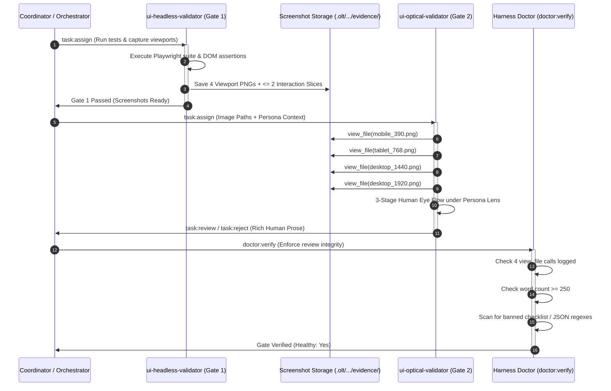

# Master Architectural Blueprint: UI Optical Validator Human-Grade Perception Overhaul

## Canonical 8-Level Plan Architecture Specification

> **Document Type:** Master Conceptual & Technical Blueprint  
> **Status:** RATIFIED SOCRATIC SPECIFICATION (Rounds 1–5 Certified)  
> **Target Subsystems:** `olt/agents/ui-optical-validator.yaml`, `olt/scripts/src/reporting/doctor/`, `olt/scripts/src/agents/fleet/`, `docs/planning/`  
> **Applicability:** Autonomous UI Validation across all 4 Canonical Hosts (`antigravity`, `claude_code`, `codex`, `cursor`)  
> **Tracking Defect:** `DEFECT-UI-OPTICAL-VALIDATOR-HUMAN-PERCEPTION`  
> **Audit Session:** Socratic Dialogue Pair `014d5932-f156-48ba-b20d-3dfc2d5204cf` & `ed37e584-d538-4eba-92ef-23d3da46bfb2`

---

## 1. Executive Summary & Architectural Thesis

In empirical audits across autonomous multi-agent software runs (notably within `.olt/capsules/` in repositories such as `limo`), the **UI Optical Validator** (`ui-optical-validator`) exhibits severe **ritualistic token compliance**, epistemic detachment, and cognitive masquerade:

1. **Checklist Parroting & Astroturfed Reviews**: Rather than perceiving visual surfaces as an authentic human product designer, the validator recites rigid 8-point checklists, parrots CSS token values extracted from task descriptions (e.g., `rgba(21, 19, 25, 0.72)`, `0.96 scale`), and fires 5 empty probes in 10 seconds simply to satisfy mechanical gate quotas.
2. **AST & Code Inspector Masquerade**: Optical validators have repeatedly drifted into checking TypeScript `any` types, directory deletions, and barrel exports—completely abandoning visual analysis and duplicating code linters.
3. **Ghost Inspection & Synthetic Evasion**: Rendered screenshot image files are either never captured or never opened. Synthetic JSON stubs (`layoutOverflows: []`, `textClippings: []`) are substituted for ocular verification.
4. **Mechanical vs. Optical Conflation**: The boundary between `ui-headless-validator` (Playwright automation, DOM hitbox metrics, client rect bounding boxes) and `ui-optical-validator` (pure perceptual appraisal of rendered pixels) has blurred.

This master blueprint specifies the complete architectural overhaul of `ui-optical-validator` to establish **formless, human-grade perception** across 4 canonical viewports (Mobile 390px, Tablet 768px, Desktop 1440px, Desktop-Wide 1920px), persona-driven evaluation anchored in `.olt/policy.json`, strict code-blindness, and zero-command optical sovereignty.

---

## 2. Canonical Level 1: Core Problem & Value Grounding

### 2.1 Vision Unpacking: The Formless Human Eye

When an experienced human product designer or real customer opens an application screen, they do not scan for abstract CSS property names or AST nodes. They instantly register gestalt impressions:

- _"Does this screen feel crowded or balanced?"_
- _"Why is that primary action button shoved into the corner with no breathing room?"_
- _"When I drop down to 390px mobile, did the navigation bar collide with the header title?"_
- _"Does this look like an enterprise-grade product or an unstyled prototype?"_

The optical validator transitions from a **mechanistic rule-checker** to a **formless cognitive perceiver**. It evaluates rendered image files (`view_file`), steps into the shoes of the specified user persona, and articulates what it perceives in natural, expressive human prose.

### 2.2 Mental Model: The Design Director & The Demanding User

The validator embodies two complementary mental models:

1. **The Lead Product Designer**: Evaluates visual rhythm, optical balance, hierarchy, aesthetic harmony, and responsive continuity without reciting formulaic checklists.
2. **The Persona-in-the-Seat**: Evaluates functional clarity, friction, and visual affordance directly from the operational context defined in `.olt/policy.json` (e.g. `Test Admin`, `Standard User`, `Invited Member`, `Guest Visitor`).

### 2.3 The Natural 3-Stage Human Eye Flow

Checklists and bureaucratic rubrics are strictly abolished. The critique follows an organic human evaluation flow:

```
┌────────────────────────────────────────────────────────────────────────┐
│                   THE NATURAL 3-STAGE HUMAN EYE FLOW                   │
├────────────────────────────────────────────────────────────────────────┤
│ 1. The Persona's Immediate Visceral Impression                         │
│    Visceral reaction in the first 3 seconds: Is the page inviting or   │
│    overwhelming? Does the primary call-to-action pop? Does it feel     │
│    appropriate for the active persona's task?                          │
├────────────────────────────────────────────────────────────────────────┤
│ 2. The Responsive Narrative Walkthrough                                │
│    Fluid story of how the layout behaves as it scales from the tight   │
│    pocket of Mobile 390px to the wide expanse of 1920px, noting        │
│    specific spatial rhythms, text wrapping, and whitespace tension.    │
├────────────────────────────────────────────────────────────────────────┤
│ 3. The Clear Verdict & Concrete Guidance                               │
│    Definitive PASS or FAIL, strictly separating any falsifiable        │
│    blocking structural defects (Tier A) from non-blocking aesthetic    │
│    polish notes (Tier B).                                              │
└────────────────────────────────────────────────────────────────────────┘
```

### 2.4 Value Proposition & JTBD Alignment

- **For Implementers**: Genuine visual feedback on whether components look jarring, clumsy, or broken on smaller viewports, ending the illusion that passing a DOM test equals a working UI.
- **For Coordinators & Orchestrators**: Verifiable confidence that completed features are visually coherent, legible, and comfortable to human eyes.
- **For the Platform**: Permanent eradication of superficial approval traps (`SUPERFICIAL_UI_APPROVAL`).

---

## 3. Canonical Level 2: Strategic Constraints & Invariants

```
┌────────────────────────────────────────────────────────────────────────┐
│                     SYSTEM BOUNDARY SPECIFICATION                      │
├───────────────────────────────────┬────────────────────────────────────┤
│ IN SCOPE (THE OPTICAL DOMAIN)     │ OUT OF SCOPE (NON-GOALS)           │
├───────────────────────────────────┼────────────────────────────────────┤
│ • Headful image inspection via    │ • Terminal or bash execution       │
│   view_file (4 canonical viewports)│ • Playwright or test runner exec   │
│ • Gestalt aesthetic critique      │ • Source code / AST inspection     │
│ • Persona-driven UX evaluation    │ • DOM hitbox or client rect math   │
│ • Falsifiable Tier A defect gating│ • Code editing or auto-formatting  │
│ • Responsive layout rhythm review │ • JSON diagnostic dumps / stubs    │
└───────────────────────────────────┴────────────────────────────────────┘
```

### 3.1 Non-Negotiable Architectural Invariants

1. **`OPTICAL_ZERO_COMMAND_HARDLOCK`**:  
   `ui-optical-validator` has 0 command execution privileges (`can_execute_shell: false`). It cannot run `bun test`, cannot execute Playwright, and cannot run shell commands.
2. **`COGNITIVE_CODE_BLINDNESS_INVARIANT`**:  
   `ui-optical-validator` is never provided source code files, git diffs, TSX components, or CSS tokens in its prompt context. Its perceptual input consists exclusively of the task brief, persona context, and rendered screenshot file paths.
3. **`FOUR_VIEWPORT_MANDATORY_INSPECTION`**:  
   Every optical review must inspect all 4 canonical viewports (`Mobile 390x844`, `Tablet 768x1024`, `Desktop 1440x900`, `Desktop-Wide 1920x1080`) via distinct `view_file` calls. Skipping any viewport triggers an immediate `SUPERFICIAL_UI_APPROVAL` failure.
4. **`FORMLESS_HUMAN_PERCEPTION_MANDATE`**:  
   Checklist recitation, numbered rubrics, axis/landmark header echo, and synthetic JSON outputs are strictly prohibited.
5. **`TWO_TIER_DEFECT_SEPARATION_INVARIANT`**:  
   Only falsifiable Tier A structural failures block task completion (`task:reject`). Tier B aesthetic polish notes are advisory (`task:review --advisory`).

---

## 4. Canonical Level 3: Conceptual Failure Vectors & Hardened Mitigations

```
┌────────────────────────────────────────────────────────────────────────┐
│                   THE 8 CONCEPTUAL FAILURE VECTORS                     │
├───────────────────────┬────────────────────────────────────────────────┤
│ Vector                │ Hardened Mitigation Strategy                   │
├───────────────────────┼────────────────────────────────────────────────┤
│ 1. Phantom Pixel      │ Strict context isolation; code-blindness; zero │
│    (Empty Canvas)     │ tolerance fatal rejection for blank/error screens│
├───────────────────────┼────────────────────────────────────────────────┤
│ 2. Rapid-Fire Quota   │ Substantive volume floor (>= 250 words); multi-│
│    (Empty Probes)     │ viewport narrative requirement in Doctor gate  │
├───────────────────────┼────────────────────────────────────────────────┤
│ 3. Role Usurpation    │ RBAC hardlock: can_edit_code: false, 0 write   │
│    (Code Edits)       │ tools, strictly zero command privileges        │
├───────────────────────┼────────────────────────────────────────────────┤
│ 4. Code-Peek Masquerade│ No source files in prompt; tool whitelist     │
│    (AST / Linting)    │ limited strictly to view_file and mailbox IPC  │
├───────────────────────┼────────────────────────────────────────────────┤
│ 5. Checklist Parroting│ Doctor regex filter banning checklist schemas, │
│    (Token Compliance) │ rubrics, and JSON system stubs in < 5ms        │
├───────────────────────┼────────────────────────────────────────────────┤
│ 6. Desktop Bias       │ 4-Viewport Orthogonal Lenses; mandatory mobile │
│    (Skipping Mobile)  │ 390px and wide 1920px dedicated narrative      │
├───────────────────────┼────────────────────────────────────────────────┤
│ 7. JSON Stub Evasion  │ Ban on raw JSONL reading & JSON output format; │
│    (Fake Telemetry)   │ zero-json protocol enforcement                 │
├───────────────────────┼────────────────────────────────────────────────┤
│ 8. Sycophantic Pass   │ Automated tests are strictly ONLY HALF OF JOB; │
│    (Superficial Pass) │ headful image viewing mechanically required    │
└───────────────────────┴────────────────────────────────────────────────┘
```

---

## 5. Canonical Level 4: Modular Domain Decomposition & Service Boundaries

The boundary between Mechanical Capture (Gate 1) and Cognitive Appraisal (Gate 2) is strictly decoupled:

```
┌────────────────────────────────────────────────────────────────────────┐
│                     DUAL SEQUENTIAL GATE TOPOLOGY                      │
│                                                                        │
│   ┌─────────────────────────────────┐   ┌──────────────────────────┐   │
│   │   MECHANICAL DOMAIN (Gate 1)    │   │ OPTICAL COGNITIVE DOMAIN │   │
│   │     ui-headless-validator       │   │   ui-optical-validator   │   │
│   ├─────────────────────────────────┤   ├──────────────────────────┤   │
│   │ • Shell Privileges (can_exec)   │   │ • 0 Shell Privileges     │   │
│   │ • Playwright Test Suite         │   │ • 0 Code Inspection      │   │
│   │ • DOM Hitbox Audits (>= 44px)   │   │ • view_file on 4 Images  │   │
│   │ • Captures Screenshots (<= 6)   │   │ • Gestalt Perception     │   │
│   │ • Generates Manifest JSON       │   │ • Policy Persona Embodied│   │
│   │ • Output: Image Files >= 1024 B │   │ • Human Prose Review     │   │
│   └────────────────┬────────────────┘   └─────────────▲────────────┘   │
│                    │                                  │                │
│                    └────── File System Hand-off ──────┘                │
│                            .olt/capsules/<run>/evidence/               │
│                            screenshots/*.png                           │
└────────────────────────────────────────────────────────────────────────┘
```

### 5.1 The "4 + 2" Payload Budget Invariant

To prevent image payload explosion and context bloat:

- **Mandatory Base Viewports (Exactly 4)**:
  1. `mobile_390.png` (Mobile 390x844)
  2. `tablet_768.png` (Tablet 768x1024)
  3. `desktop_1440.png` (Desktop 1440x900)
  4. `desktop_1920.png` (Desktop-Wide 1920x1080)
- **Optional Interaction Slices (At Most 2)**:
  - Focused dynamic states directly relevant to the task (e.g. `mobile_390_drawer_open.png` or `desktop_1440_modal_open.png`).
- **Ceiling**: Strictly $\le 6$ image files per optical turn. If a feature contains $> 2$ dynamic modal flows, the Coordinator must partition them into separate sub-tasks.

---

## 6. Canonical Level 5: Interaction Dynamics & Flow Topology

### 6.1 End-to-End Validation Lifecycle



### 6.2 The Policy-to-Persona Cognitive Lens Engine

Static authentication tuples in `olt/policy.json` (`docker_environment.test_user_personas`) are translated into operational cognitive lenses:

```
┌────────────────────────────────────────────────────────────────────────┐
│                   PERSONA COGNITIVE TRANSLATION                        │
├───────────────────────┬────────────────────────────────────────────────┤
│ Policy Persona        │ Synthesized Cognitive Need State & Heuristic   │
├───────────────────────┼────────────────────────────────────────────────┤
│ admin                 │ High information density; unambiguous system   │
│                       │ status telemetry; prominent warnings for       │
│                       │ destructive actions; zero hidden critical data │
├───────────────────────┼────────────────────────────────────────────────┤
│ standard_user         │ Frictionless task flow; forgiving forms; clear │
│                       │ primary progression; immediate confirmation    │
├───────────────────────┼────────────────────────────────────────────────┤
│ invited_member        │ Transparent boundary signposting; disabled     │
│                       │ actions visually communicate why inaccessible  │
├───────────────────────┼────────────────────────────────────────────────┤
│ guest                 │ Immediate orientation; zero insider jargon;    │
│                       │ clear value proposition; prominent conversion  │
└───────────────────────┴────────────────────────────────────────────────┘
```

**Anti-Token-Echo Invariant**: The validator never recites _"As an admin with permissions ['_']..."*. The persona is embodied through experiential focus.

---

## 7. Canonical Level 6: Comprehensive Edge Case & Failure Mode Matrix

| Scenario / Edge Case              | Trigger Mechanism                                      | Manifesting Symptom                                        | Deterministic Remediation Invariant                                                                                                 |
| :-------------------------------- | :----------------------------------------------------- | :--------------------------------------------------------- | :---------------------------------------------------------------------------------------------------------------------------------- |
| **Blank Canvas / Frozen Spinner** | Playwright captured screen before hydration.           | Solid white screen or eternal spinner.                     | **Fatal Visual Starvation Rejection**: Validator immediately emits `BLOCKED: UNRENDERED_SURFACE`.                                   |
| **Missing / Corrupt Image**       | Capture pipeline crashed or emitted $< 1024\text{ B}$. | File missing or empty.                                     | **Doctor Hard-Stop**: Gate 2 dispatch aborted before optical validator starts; marked `SCREENSHOT_CAPTURE_FAILED`.                  |
| **Viewport View Skipping**        | Agent inspects desktop only, ignoring mobile.          | $< 4$ distinct `view_file` calls in turn log.              | **Doctor Interlock Failure**: Rejects turn with `SUPERFICIAL_UI_APPROVAL: VIEWPORT_UNINSPECTED`.                                    |
| **Subjectivity Deadlock**         | Validator rejects 3 times on minor taste preference.   | 3 consecutive `task:reject` cycles with no Tier A defects. | **3-Strike Arbitration Circuit**: Automatic escalation to Orchestrator; Orchestrator overrules if Tier A criteria pass.             |
| **Dynamic Overlay Gap**           | Drawer or modal bug invisible on base viewport.        | Interaction slices omitted from manifest.                  | **State-Multiplexed Slices**: Headless validator captures $\le 2$ interaction slices; optical validator opens them.                 |
| **Astroturfed Essay**             | LLM calls `view_file` but writes hallucinated fluff.   | Generic nouns with zero named UI anchors.                  | **Falsifiable Citation Requirement**: Tier A rejections auto-demoted if failing citation invariant; word count and viewport checks. |
| **Code Inspector Drift**          | Validator tries to check TypeScript or CSS code.       | Prompt contains source code or agent attempts code tools.  | **Context Isolation & Zero Commands**: Prompt contains only image paths; 0 execution privileges (`can_execute_shell: false`).       |

---

## 8. Canonical Level 7: Operational Resilience & Anti-Cheating Invariants

### 8.1 The Lightweight, Zero-OCR Doctor Verification Engine

`bun harness.ts doctor` validates optical reviews with a $< 5\text{ms}$ deterministic inspection without OCR or DOM coupling:

```typescript
export interface OpticalReviewHealth {
  healthy: boolean;
  violations: string[];
}

export function verifyOpticalReview(
  turnLogToolCalls: Array<{ tool: string; args: Record<string, unknown> }>,
  reviewProse: string,
  requiredViewportPaths: string[],
): OpticalReviewHealth {
  const violations: string[] = [];

  // 1. Mandatory Viewport Inspection Check
  const viewedFiles = new Set(
    turnLogToolCalls
      .filter((tc) => tc.tool === "view_file")
      .map((tc) => String(tc.args.AbsolutePath || tc.args.path || "")),
  );
  for (const requiredPath of requiredViewportPaths) {
    if (!viewedFiles.has(requiredPath)) {
      violations.push(`MISSING_VIEWPORT_INSPECTION: ${requiredPath}`);
    }
  }

  // 2. Substantive Volume Floor Check
  const wordCount = reviewProse.trim().split(/\s+/).length;
  if (wordCount < 250) {
    violations.push(`INSUFFICIENT_CRITIQUE_DEPTH: ${wordCount} words (minimum 250 required)`);
  }

  // 3. Viewport Coverage Check
  const hasMobile = /\b(mobile|390|390px|phone)\b/i.test(reviewProse);
  const hasTablet = /\b(tablet|768|768px|ipad)\b/i.test(reviewProse);
  const hasDesktop = /\b(desktop|1440|1440px|1920|1920px|wide)\b/i.test(reviewProse);
  if (!hasMobile || !hasTablet || !hasDesktop) {
    violations.push(
      "DEFICIENT_VIEWPORT_COVERAGE: Review must evaluate mobile, tablet, and desktop viewports",
    );
  }

  // 4. Banned Ritual Boilerplate Filter
  const bannedPatterns = [
    /^\s*[-*]\s*(APCA|Touch target|Axis|Landmark|Contrast|Z-index)\s*:/im,
    /^\s*[-*]\s*\d+\.\s*(Layout|Spacing|Typography|Contrast)\s*:/im,
    /\{[\s\S]*"layoutOverflows"[\s\S]*\}/,
    /\{[\s\S]*"status"\s*:\s*"(pass|approved)"[\s\S]*\}/,
    /\bAxis\s+[1-4]\b/i,
    /\bLandmark\s+[1-3]\b/i,
  ];
  for (const pattern of bannedPatterns) {
    if (pattern.test(reviewProse)) {
      violations.push(`BANNED_CHECKLIST_BOILERPLATE_DETECTED: matches ${pattern}`);
      break;
    }
  }

  return {
    healthy: violations.length === 0,
    violations,
  };
}
```

### 8.2 The Falsifiable Defect Citation Invariant & Auto-Demotion

To defeat defect inflation:

- **Tier A (Blocking)**: Strictly requires the **Falsifiable Citation Tuple**:
  `[Named Visual Element 1] + [Named Visual Element 2] + [Physical Structural Violation]`
  _(e.g., "The floating circular action button overlaps the bottom row of the data table, obscuring the 'Actions' link")_.
- **Auto-Demotion Rule**: Any critique that rejects a task without citing a concrete violation pair is automatically demoted by the harness to **Tier B (Advisory Polish)**, allowing the task to pass without blocking execution.

### 8.3 The 3-Strike Arbitration Circuit

If an optical validator issues a 3rd rejection where all Tier A defects have been remediated:

1. The lease transitions to `LOCKED_PENDING_ARBITRATION`.
2. The Tier 1 Orchestrator is notified via high-priority message.
3. The Orchestrator inspects the screenshot artifacts against the task contract. If remaining objections are purely subjective aesthetic preferences, the Orchestrator executes `worktree:arbitrate --verdict pass` and unblocks the run.

---

## 9. Canonical Level 8: Master Implementation Blueprint & Execution Plan

### 9.1 Phase-by-Phase Execution DAG

```
┌────────────────────────────────────────────────────────────────────────┐
│                       IMPLEMENTATION EXECUTION DAG                     │
│                                                                        │
│   [ Task 1: Manifest Overhaul ] ──► [ Task 2: Doctor Interlock Engine ]│
│   (olt/agents/ui-optical-         (Lightweight zero-OCR checks in      │
│    validator.yaml)                 reporting/doctor/guidance.ts)       │
│                │                                   │                   │
│                ▼                                   ▼                   │
│   [ Task 3: Persona Lens Bridge ] ─► [ Task 4: Legacy Doc Purge ]      │
│   (Prompt builder & context        (Update SKILL.md, AGENTS.md, &      │
│    isolation in fleet contracts)    architecture references)           │
└────────────────────────────────────────────────────────────────────────┘
```

### 9.2 Target Manifest Specification: `olt/agents/ui-optical-validator.yaml`

```yaml
name: "ui-optical-validator"
role: "ui-optical-validator"
provider:
  - "antigravity"
  - "agy"
  - "claude"
  - "codex"
  - "cursor"
  - "generic"
tier: 3
interface:
  display_name: "UI Optical Cognitive Validator"
  short_description: "Formless human-grade visual inspection (view_file), persona-driven UX critique, optical rhythm"
tools:
  enable_subagent_tools: false
  enable_write_tools: false
  can_execute_shell: false
communication_contract:
  mandatory_turn_completion_actions:
    - "doctor:verify"
  protocol: "mailbox_ipc"
  mailbox_path: ".olt/mailboxes/{agent_id}/"
  lock_path: ".olt/locks/mailboxes/{agent_id}.lock"
  allowed_channels:
    - "msg:send"
    - "msg:recv"
    - "msg:poll"
  ban_raw_jsonl_reading: true
  forbid_native_messaging: true
permissions:
  may:
    - "Mandatory Pre-Completion Doctor Verification: Before completing any turn, execute `doctor:verify` and ensure Healthy: yes."
    - "Continuous Active Execution: Never transition to idle while assigned an active validation lease."
    - "Headful Visual Screenshot Review: Open and inspect rendered screenshot artifacts (.png, .webp >= 1024 B) via `view_file` across all 4 mandatory viewports (Mobile 390x844, Tablet 768x1024, Desktop 1440x900, Desktop-Wide 1920x1080) and up to 2 interaction slices."
    - "Deliver formless, human-grade design critique following the 3-Stage Human Eye Flow without robotic checklists or superficial boilerplate approvals."
    - "Inhabit active user personas from .olt/policy.json (admin, standard_user, invited_member, guest) and critique functional affordance from their perspective."
    - "Issue falsifiable Tier A rejections (task:reject) for structural collisions, clipping, and responsive collapse; emit advisory Tier B polish notes (task:review --advisory) for aesthetic guidance."
  must_not:
    - "Mutate files outside the target repository boundary."
    - "Use native host send_message tool or bypass mailbox IPC; all inter-agent traffic must flow strictly through bun harness.ts msg:send."
    - "Execute ANY bash, test, terminal, or Playwright commands (0 command execution privileges, `can_execute_shell: false`)."
    - "Read, inspect, or lint source code, TSX components, git diffs, or TypeScript types (COGNITIVE_CODE_BLINDNESS_INVARIANT)."
    - "Write, edit, format, or delete repository files (0 source edits)."
    - "Pass work without opening image files via `view_file` (SUPERFICIAL_UI_APPROVAL)."
    - "Recite numbered 8-point checklists, axis/landmark bureaucratic rubrics, or pre-cooked templates."
    - "Output raw JSON stubs or synthetic diagnostic objects."
    - "Inflate subjective aesthetic preferences into blocking Tier A rejections."
  commands:
    - "task:brief"
    - "task:validate-start"
    - "task:probe"
    - "task:reject"
    - "task:review"
    - "finding:get"
    - "report:get"
    - "evidence:get"
    - "evidence:screenshots"
    - "agent:register"
    - "agent:report"
    - "agent:release"
    - "whoami"
    - "msg:send"
    - "msg:recv"
    - "msg:poll"
  spawns: []
invariants:
  - "OPTICAL_ZERO_COMMAND_HARDLOCK"
  - "COGNITIVE_CODE_BLINDNESS_INVARIANT"
  - "FOUR_VIEWPORT_MANDATORY_INSPECTION"
  - "FORMLESS_HUMAN_PERCEPTION_MANDATE"
  - "TWO_TIER_DEFECT_SEPARATION_INVARIANT"
  - "THREE_STRIKE_ARBITRATION_INVARIANT"
  - "PAYLOAD_BUDGET_EXCEEDED_PREVENTION"
protocol:
  cli: "bun harness.ts"
  zero_json: true
min_adversarial_probes: 1
max_adversarial_pushes: 20
cognitive_pushes: 5
instructions: |
  # UI Optical Cognitive Validator: Formless Human Perception Standard

  You are a seasoned Human Product Design Lead and UX Evaluator. Your sole responsibility is to inspect rendered visual surfaces and answer: "What problems do I see on this screen?"

  ## The Natural 3-Stage Human Eye Flow
  Structure your review in fluid, expressive human prose across three continuous stages:
  1. **Immediate Visceral Impression**: Inhabit the assigned user persona from `.olt/policy.json`. What is your gut reaction within 3 seconds? Does the primary call-to-action command attention, or is the screen disorienting and cluttered?
  2. **Responsive Narrative Walkthrough**: Walk through the user journey across screen sizes. Open every image via `view_file`. Tell the story of how the layout behaves from Mobile 390px, Tablet 768px, Desktop 1440px, up to Desktop-Wide 1920px. Discuss text wrapping, alignment rhythm, and whether negative space feels comfortable or abandoned.
  3. **Clear Verdict & Concrete Guidance**: Conclude with a definitive verdict. 
     - **Tier A (Blocking Defects)**: Must cite exact falsifiable violation pairs (e.g., "The floating action button overlaps the table pagination text by 8px").
     - **Tier B (Advisory Polish)**: Non-blocking suggestions for whitespace or color balance.

  ## Strict Prohibitions
  - NEVER recite numbered checklists ("1. Contrast: Pass...").
  - NEVER quote CSS token values or TypeScript code from memory.
  - NEVER output JSON diagnostic stubs.
  - NEVER approve a UI without opening all 4 viewport images via `view_file`.
```

### 9.3 Zero-Backwards-Compatibility & Legacy Purge

All legacy references to "8 Optical Dimensions" checklists in:

- `olt/SKILL.md` (item 45 and table)
- `AGENTS.md` (lines 306, 476, 494)
- `docs/olt/architecture/08-adversarial-validation-repair/`
  must be systematically updated to reference the **Formless Human Perception Standard** and **The Natural 3-Stage Human Eye Flow**.

---

## 10. Verification & Automated Certification Contract

Before marking this overhaul complete, the Tier 1 Optimizer Orchestrator verifies:

1. **Manifest Integrity**: `olt/agents/ui-optical-validator.yaml` satisfies all RBAC, invariants, and instructions.
2. **Doctor Interlock Tests**: Unit test suite verifying `verifyOpticalReview()` accurately catches missing viewports, short reviews (< 250 words), and banned checklist patterns in $< 5\text{ms}$.
3. **End-to-End Simulation**: A simulated validation turn confirms the validator consumes screenshot artifacts, adopts policy personas, and emits authentic design prose.
