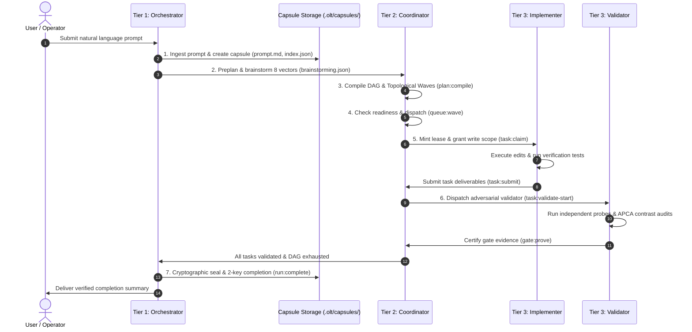

# Chapter 1: Quickstart & Getting Started

[← Previous: The OLT Book Overview](README.md) | [📖 Table of Contents](SUMMARY.md) | [Next: Chapter 2 — Core Philosophy & Brent Parallelism →](02-core-philosophy-and-brent-parallelism.md)

---

[](README.md#diátaxis-documentation-matrix)
[](README.md)
[](README.md)
[](../../bunfig.toml)

This tutorial walks you through installing OLT, verifying your local environment, and executing your very first end-to-end multi-agent orchestration run. By the end of this chapter, you will understand how OLT ingests task requirements, compiles dependency graphs, dispatches parallel subagent workers, enforces adversarial verification, and cryptographically certifies run completion.

---

## 1. 1-Shot Global Installation

OLT is distributed as a zero-runtime-dependency skill package designed to integrate seamlessly into any AI agent client (such as Antigravity, Claude Code, Cursor, Codex, or ChatGPT) as well as developer terminals.

### Installation Options

You can install OLT directly into your project repository or global agent skill collection using your preferred package manager:

```bash
# Option A: Install via npx (Node.js / npm ecosystem)
npx skills add onurseckin/skills --skill olt

# Option B: Install via bunx (Fastest, Bun native)
bunx skills add onurseckin/skills --skill olt

# Option C: Direct Git Clone / Submodule
git clone https://github.com/onurseckin/skills.git
cd skills
```

### Zero-Dependency Architectural Guarantee

Unlike heavy orchestration frameworks that require Python virtual environments, Docker daemons, or dozens of npm dependencies, OLT is **100% native TypeScript** executed directly on Bun:

- **0 external runtime dependencies** in `package.json`.
- **Sub-millisecond CLI startup** time.
- **Native POSIX file locking (`flock`)** and SHA-256 Merkle tree hashing built directly on Bun's fast native APIs.

---

## 2. CLI Harness Initialization & Doctor Validation

Once installed, verify that your host environment meets all runtime prerequisites using the built-in diagnostic suite:

```bash
# Display top-level harness capabilities
bun olt/scripts/harness.ts --help
```

### Running the Doctor Diagnostic Suite

The `doctor` command inspects your local repository, checks file system permissions, validates Bun/Node runtime compatibility, and probes host capabilities:

```bash
bun olt/scripts/harness.ts doctor
```

Sample output:

```text
================================================================================
                            OLT HARNESS DIAGNOSTIC REPORT
================================================================================
  Runtime Engine:       Bun v1.2.0 (Darwin arm64)
  Repository Root:      /Users/onurseckinsenoglu/repos/skills
  TypeScript Strict:    Verified (0 any annotations, tsconfig.json compliant)
  Runtime Dependencies: 0 (Pure native standard library)
  POSIX Flock Support:  Available (O_RDWR | O_CREAT | O_EXCL)
  Host Environment:     Antigravity Multi-Agent Runtime
  Telemetry Tracker:    Active (.olt/telemetry.jsonl)
  Policy Engine:        Configured (.olt/policy.json)
--------------------------------------------------------------------------------
  [PASS] All 8 diagnostic checks passed. System ready for orchestration.
================================================================================
```

### Initializing Repository Policy

Before running autonomous workflows, initialize the central repository policy:

```bash
bun olt/scripts/harness.ts policy:init
```

This discovers your workspace toolchains (linters, test runners, package managers) and generates `.olt/policy.json`.

---

## 3. End-to-End Task Lifecycle Walkthrough

Let us walk through a complete, real-world execution lifecycle. The diagram below shows the seven discrete phases that every long task undergoes:



---

### Step 1: Prompt Ingestion & Merkle Root Binding

Every orchestration run begins with an immutable prompt captured in a newly created capsule directory:

```bash
# Initialize a new run capsule
bun olt/scripts/harness.ts run:init --name "feature-authentication-overhaul" --prompt "Implement JWT authentication with refresh tokens and rate limiting"
```

The harness creates `.olt/capsules/<timestamp>-feature-authentication-overhaul/` containing:

- `prompt.md`: The verbatim, immutable user prompt.
- `index.json`: Run metadata and root Merkle SHA-256 hash.
- `events.jsonl`: Cryptographically linked audit ledger.

---

### Step 2: Preplanning & Failure Vector Brainstorming

Before generating a task list, the system performs structured preplanning, analyzing the prompt across **8 mandatory failure vectors**:

```bash
# Run multi-round failure vector brainstorming
bun olt/scripts/harness.ts plan:brainstorm --run .olt/capsules/<run-id> --rounds 3
```

The 8 failure vectors evaluated are:

1. `EMPTY_PAYLOAD`: Null checks, missing files, or syntactically malformed payloads.
2. `TIMEOUT_STAGNATION`: Process deadlocks, unbounded waits, and heartbeat timeouts.
3. `CONCURRENCY_MUTATION`: Race conditions, file collisions, and shared state mutations.
4. `HOST_BOUNDARY`: Protocol conformance and anti-hallucination guards.
5. `STATE_TRANSITION`: State machine crash recovery and rollback integrity.
6. `TYPE_INVARIANT`: Zero `any` types, zero `@ts-ignore`, and strict compiler guarantees.
7. `CLI_TELEMETRY`: Parseable stdout/stderr and deterministic exit codes.
8. `ADVERSARIAL_GATE`: Counterfactual negative test cases and anti-mock proofs.

---

### Step 3: DAG Compilation & Wave Partitioning

The planner decomposes requirements into discrete, atomic tasks and compiles them into a Directed Acyclic Graph (DAG):

```bash
# Compile requirements and generate topological waves
bun olt/scripts/harness.ts plan:compile --run .olt/capsules/<run-id>
```

The compilation process:

- Assigns each task a **strictly disjoint write scope** (e.g., `src/auth/jwt.ts`).
- Binds each task to a mandatory verification gate (e.g., `bun test tests/unit/auth/jwt.test.ts`).
- Executes Kahn's algorithm to partition independent tasks into **parallel execution waves**:

```text
Wave 1 (Parallel width: 3):
  ├── task-1: Auth Models & Token Schemas     [Write Scope: src/auth/types.ts]
  ├── task-2: Password Hashing Subsystem      [Write Scope: src/auth/hash.ts]
  └── task-3: Redis Token Store Client        [Write Scope: src/auth/store.ts]

Wave 2 (Parallel width: 1, depends on Wave 1):
  └── task-4: JWT Middleware & Rate Limiter   [Write Scope: src/auth/middleware.ts]

Wave 3 (Parallel width: 1, depends on Wave 2):
  └── task-5: End-to-End Integration Suite    [Write Scope: tests/integration/auth.test.ts]
```

---

### Step 4: Wave Dispatch & Workforce Registration

The Tier 2 Coordinator queries the queue to find all tasks ready for immediate execution:

```bash
# Query ready tasks in current wave
bun olt/scripts/harness.ts queue:next --run .olt/capsules/<run-id>
```

When dispatching subagents, the Coordinator registers each worker in the capsule's agent ledger:

```bash
# Register an implementer subagent
bun olt/scripts/harness.ts agent:register \
  --run .olt/capsules/<run-id> \
  --agent worker_jwt_models \
  --role implementer \
  --host antigravity \
  --parent-agent coordinator_1
```

---

### Step 5: Implementer Task Claim & Mutation

The dispatched Tier 3 Implementer claims its assigned task lease on Turn 1 before modifying any files:

```bash
# Claim task lease and obtain temporary write token
bun olt/scripts/harness.ts task:claim \
  --run .olt/capsules/<run-id> \
  --task task-1 \
  --agent worker_jwt_models \
  --role implementer
```

Sample output:

```text
### Task Leased: task-1
- Agent: worker_jwt_models
- Lease Token: tok_lease_9a8f7c6e5d4b3a210fedcba987654321
- Duration: 20 minutes (Deadline: 14:35:00 UTC)
- Assigned Write Scope: src/auth/types.ts
- Warning: Unleased file modifications will be rejected with LEASE_REQUIRED.
```

The implementer authors the code strictly within `src/auth/types.ts` and runs local typechecks. During long executions, the implementer sends heartbeats to maintain its lease:

```bash
# Extend active lease deadline
bun olt/scripts/harness.ts task:heartbeat \
  --run .olt/capsules/<run-id> \
  --task task-1 \
  --agent worker_jwt_models \
  --token tok_lease_9a8f7c6e5d4b3a210fedcba987654321
```

Once work is complete, the implementer submits its deliverables:

```bash
# Submit completed task for validation
bun olt/scripts/harness.ts task:submit \
  --run .olt/capsules/<run-id> \
  --task task-1 \
  --agent worker_jwt_models \
  --token tok_lease_9a8f7c6e5d4b3a210fedcba987654321 \
  --summary "Created JWT claims interface, token payload schemas, and zero-any type definitions." \
  --files-changed src/auth/types.ts
```

---

### Step 6: Adversarial Validation & Evidence Proving

OLT enforces the **Adversarial Validation Separation Invariant**: the implementer is barred from approving its own work. Instead, an independent Tier 3 Validator is spawned:

```bash
# Start independent validation session
bun olt/scripts/harness.ts task:validate-start \
  --run .olt/capsules/<run-id> \
  --task task-1 \
  --agent validator_jwt_models \
  --role validator
```

The validator executes the task gate, probes for mock usage or unhandled edge cases, and certifies the evidence:

```bash
# Prove gate completion with exit code 0 evidence
bun olt/scripts/harness.ts gate:prove \
  --run .olt/capsules/<run-id> \
  --task task-1 \
  --gate gate-1 \
  --evidence-class harness_observed \
  --command "bun test tests/unit/auth/types.test.ts"
```

If issues are found, the validator records structured findings (`finding:record`), triggering a monotonic repair loop.

---

### Step 7: Run Completion & Terminal Sealing

Once all waves are complete and every task gate has been certified by an independent validator, the Tier 1 Orchestrator executes the 2-Key completion ceremony:

```bash
# Cryptographically seal and finalize run
bun olt/scripts/harness.ts run:complete \
  --run .olt/capsules/<run-id> \
  --agent orchestrator_main
```

The capsule is marked `completed`, file write permissions are locked to read-only, and a final summary report is generated in `reports/completion-summary.md`.

---

## 4. Inspecting Capsules, Event Ledgers & Telemetry

Every OLT run maintains full observability and forensic traceability:

```text
.olt/capsules/<run-id>/
├── index.json             --> Run status, timestamps, and Merkle root
├── manifest.json          --> Host metadata and runtime environment
├── prompt.md              --> Verbatim user prompt (SHA-256 bound)
├── state.json             --> Real-time task graph, leases, and agent states
├── events.jsonl           --> Immutable, append-only SHA-256 event chain
├── trace.md               --> Human-readable living markdown timeline
├── defects.jsonl          --> Recorded defects and root-cause allocations
├── runtime/               --> Active PID locks and ephemeral session tokens
└── reports/               --> Formatted completion reports and evidence packs
```

### Viewing the Living Execution Trace

To observe the real-time event timeline of any active or completed run, inspect `trace.md`:

```bash
cat .olt/capsules/<run-id>/trace.md
```

Sample trace excerpt:

```markdown
| Seq | Timestamp (UTC)      | Actor         | Event Kind       | Target | Details                   |
| :-- | :------------------- | :------------ | :--------------- | :----- | :------------------------ |
| 1   | 2026-08-31T12:00:00Z | orchestrator  | `capsule-init`   | run    | Capsule created           |
| 2   | 2026-08-31T12:00:05Z | coordinator   | `plan-compiled`  | graph  | 5 tasks, 3 waves compiled |
| 3   | 2026-08-31T12:00:10Z | worker_jwt    | `task-claimed`   | task-1 | Leased to worker_jwt      |
| 4   | 2026-08-31T12:05:22Z | worker_jwt    | `task-submitted` | task-1 | Submitted for review      |
| 5   | 2026-08-31T12:06:01Z | validator_jwt | `gate-proven`    | task-1 | Gate 1 passed (exit 0)    |
```

---

## 5. Quick Reference Cheat Sheet

| Workflow Step       | Primary Command                             | Acting Agent | Primary Output / State Change              |
| :------------------ | :------------------------------------------ | :----------- | :----------------------------------------- |
| **System Sanity**   | `bun harness.ts doctor`                     | Operator     | Environment diagnostic report              |
| **Policy Init**     | `bun harness.ts policy:init`                | Operator     | `.olt/policy.json` generated               |
| **Capsule Init**    | `bun harness.ts run:init --prompt "..."`    | Orchestrator | New `.olt/capsules/<run-id>/` created      |
| **Preplanning**     | `bun harness.ts plan:brainstorm --rounds 3` | Coordinator  | `brainstorming.json` with 8 vectors        |
| **DAG Compilation** | `bun harness.ts plan:compile`               | Coordinator  | `state.json` topological waves             |
| **Task Claim**      | `bun harness.ts task:claim --task <id>`     | Implementer  | Active lease token & write scope lock      |
| **Task Heartbeat**  | `bun harness.ts task:heartbeat --task <id>` | Implementer  | Extends lease deadline                     |
| **Task Submit**     | `bun harness.ts task:submit --task <id>`    | Implementer  | Releases write scope; marks task submitted |
| **Gate Proving**    | `bun harness.ts gate:prove --task <id>`     | Validator    | Certifies gate evidence (exit 0)           |
| **Run Complete**    | `bun harness.ts run:complete`               | Orchestrator | Cryptographically seals capsule            |

---

[← Previous: The OLT Book Overview](README.md) | [📖 Table of Contents](SUMMARY.md) | [Next: Chapter 2 — Core Philosophy & Brent Parallelism →](02-core-philosophy-and-brent-parallelism.md)
