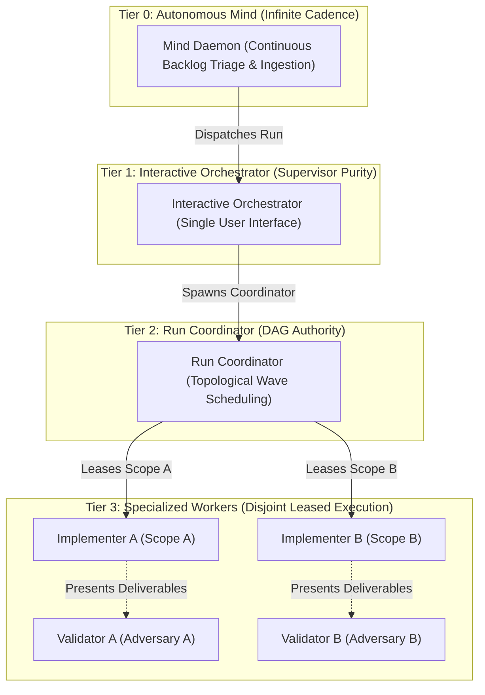

# Chapter 2: Core Philosophy & Brent Parallelism

[← Previous: Chapter 1 — Quickstart & Getting Started](01-quickstart-and-getting-started.md) | [📖 Table of Contents](SUMMARY.md) | [Next: Chapter 3 — Tier 0 Governance & Autonomous Mind →](03-tier-0-governance-and-autonomous-mind.md)

---

[](README.md#diátaxis-documentation-matrix)
[](README.md)
[](../../tsconfig.json)
[](../../olt/SKILL.md)

This chapter explores the theoretical foundations, mathematical invariants, and concurrency theorems that govern OLT. We examine the **Zero-Assumption Philosophy**, explain why **Supervisor Purity** is essential for scalable multi-agent systems, and derive **Brent's Theorem** for optimal task DAG parallelization.

---

## 1. The Zero-Assumption Philosophy & Hard Zeros

Most software engineering failures in autonomous agent systems stem from **ungrounded assumptions**—speculative guesses regarding repository structures, hallucinated CLI arguments, invisible test commands, or unverified side-effects.

OLT operates on the **Zero-Assumption Principle**: _An agent must never assume the existence, state, behavior, or correctness of any tool, file, or system component without direct, verifiable evidence._

```
+---------------------------------------------------------------------------------------------------------+
|                                      THE FIVE HARD ZEROS OF OLT                                         |
+---------------------------------------------------------------------------------------------------------+
|                                                                                                         |
|  [0] ZERO Ungrounded Assumptions: No guessing file paths, tool options, or repository states.           |
|  [0] ZERO 'any' Types: Full TypeScript strictness with 100% compile-time type coverage.                 |
|  [0] ZERO Compiler / Linter Suppressions: 0 @ts-ignore, 0 @ts-expect-error, 0 eslint-disable.            |
|  [0] ZERO Unleased Mutations: No file writes without an active, cryptographically minted lease token.   |
|  [0] ZERO Epistemic Self-Grading: Implementers are strictly prohibited from validating their own code.   |
|                                                                                                         |
+---------------------------------------------------------------------------------------------------------+
```

### The Invariant Spectrum

| Invariant Code | Name                         | Formal Definition                                                                                                               | Enforcement Mechanism                      |
| :------------- | :--------------------------- | :------------------------------------------------------------------------------------------------------------------------------ | :----------------------------------------- |
| **I1**         | **Disjoint Write Scope**     | $\forall T_i, T_j \in \text{Wave}_k, i \neq j \implies \text{Scope}(T_i) \cap \text{Scope}(T_j) = \emptyset$                    | Monotonic write locking in `task:claim`    |
| **I2**         | **Zero-Suppression Typing**  | $\text{Count}(\text{"any"} \cup \text{"@ts-ignore"} \cup \text{"eslint-disable"}) = 0$                                          | Fast AST parser in `task:check`            |
| **I3**         | **Supervisor Purity**        | $\text{Role} \in \{\text{Orchestrator}, \text{Coordinator}\} \implies \text{WriteScope} = \emptyset$                            | Role confinement throw in harness runtime  |
| **I4**         | **Adversarial Validation**   | $\text{Session}(\text{Implementer}(T_i)) \cap \text{Session}(\text{Validator}(T_i)) = \emptyset$                                | Subagent session isolation & token binding |
| **I5**         | **A4 False-Barrier Freedom** | $\text{Scope}(T_i) \cap \text{Scope}(T_j) = \emptyset \land \neg \text{CausalDep}(T_i, T_j) \implies \text{Parallel}(T_i, T_j)$ | Graph topological audit in `plan:compile`  |

---

## 2. Multi-Agent Hierarchy & Supervisor Purity

To prevent context saturation, instruction dilution, and catastrophic tool hallucinations, OLT enforces a strict **4-Tier Workforce Hierarchy**:



### Why Supervisor Purity Matters

When a supervisor agent (Tier 1 Orchestrator or Tier 2 Coordinator) attempts to write code directly:

1. **Context Window Contamination**: File contents, diffs, and lint errors pollute the supervisor's reasoning buffer, blinding it to high-level architectural milestones.
2. **Coordination Starvation**: While the supervisor is editing a file, parallel subagents are left unmonitored, leading to deadlocks, expired leases, and unhandled stragglers.
3. **Loss of Objective Oversight**: The supervisor develops epistemic bias towards its own code changes, degrading its ability to accurately evaluate progress.

Therefore, OLT strictly confines Tier 1 and Tier 2 agents from claiming file write leases. Any attempt by a supervisor to claim a write scope throws `ROLE_CONFINEMENT_VIOLATION`.

---

## 3. Concurrency Mathematics: Brent's Theorem

Multi-agent execution can be formalized as the scheduling of a Directed Acyclic Graph (DAG) $G = (V, E)$ over $p$ parallel execution units (subagents).

Let:

- $W$ (**Total Work**): The sum of execution times of all tasks in the DAG:
  $$W = \sum_{v \in V} t(v)$$
- $S$ (**Span / Critical Path**): The longest sequential dependency path from source to sink in the DAG:
  $$S = \max_{\pi \in \text{Paths}(G)} \sum_{v \in \pi} t(v)$$
- $T_p$ (**Execution Time on $p$ Processors**): The actual wall-clock duration of the run using $p$ parallel agents.

### Brent's Work-Span Scheduling Theorem

Brent's Theorem (1974) establishes the fundamental theoretical bound on parallel execution time:

$$T_p \le \frac{W - S}{p} + S$$

When tasks are uniformly sized ($t(v) \approx 1$ time unit), the optimal concurrency width $P$ required to execute the graph in minimum possible time is bounded by:

$$P = \left\lceil \frac{W}{S} \right\rceil$$

```text
+---------------------------------------------------------------------------------------------------------+
|                                      BRENT CONCURRENCY ILLUSTRATION                                     |
+---------------------------------------------------------------------------------------------------------+
|                                                                                                         |
|  Total Work W = 12 tasks                                                                                |
|  Critical Path Span S = 3 sequential levels                                                             |
|                                                                                                         |
|  Optimal Parallel Width P = ceil(W / S) = ceil(12 / 3) = 4 parallel workers                            |
|                                                                                                         |
|  Wave 1 (4 parallel tasks):   [Task 1]   [Task 2]   [Task 3]   [Task 4]                                 |
|                                  |          |          |          |                                     |
|  Wave 2 (4 parallel tasks):   [Task 5]   [Task 6]   [Task 7]   [Task 8]                                 |
|                                  |          |          |          |                                     |
|  Wave 3 (4 parallel tasks):   [Task 9]   [Task 10]  [Task 11]  [Task 12]                                |
|                                                                                                         |
|  Theoretical Wall-Clock Time: T_4 = 3 time units (compared to T_1 = 12 time units sequentially)         |
|  Theoretical Speedup: S_4 = T_1 / T_4 = 12 / 3 = 4.00x (Linear 100% parallel efficiency)               |
|                                                                                                         |
+---------------------------------------------------------------------------------------------------------+
```

### Amdahl's Law vs. Gustafson-Barsis Speedup

In agentic systems, not all operations can be parallelized (e.g., prompt capture, final cryptographic sealing, sequential integration tests).

Let $f$ be the parallelizable fraction of total work ($0 \le f \le 1$):

#### 1. Amdahl's Law (Fixed Workload Bound)

For a fixed-size software task, speedup is constrained by the strictly serial fraction $(1 - f)$:

$$S_{\text{Amdahl}} = \frac{1}{(1 - f) + \frac{f}{p}}$$

As $p \to \infty$, maximum theoretical speedup is capped at $\frac{1}{1 - f}$. If 10% of a task is inherently serial ($f = 0.90$), maximum speedup can never exceed $10\times$, regardless of how many subagents are spawned.

#### 2. Gustafson-Barsis Law (Scaled Problem Size)

In autonomous software development, larger engineering initiatives allow decomposing features into broader independent modules, expanding the parallel workload:

$$S_{\text{Gustafson}} = p - (1 - f)(p - 1)$$

OLT maximizes $f$ by decomposing software systems into strictly isolated, modular write scopes, allowing systems to approach linear Gustafson scaling during large-scale refactors.

---

## 4. Anti-Serialization Invariants & Disjoint Write Scopes

A common failure mode in naive multi-agent planners is **artificial serialization** (creating unnecessary sequential dependencies between independent tasks).

### The A4 False-Barrier Invariant

OLT enforces the **A4 Anti-Serialization Invariant** during DAG compilation:
_If Task A and Task B have disjoint write scopes and neither task consumes an artifact produced by the other, they MUST NOT be placed in sequential dependency._

```
+---------------------------------------------------------------------------------------------------------+
|                                    A4 FALSE-BARRIER VIOLATION VS FIX                                    |
+---------------------------------------------------------------------------------------------------------+
|                                                                                                         |
|  [BAD: Artificial Serialization]                                                                        |
|  Task 1 (docs/book/01-quickstart.md) ---> Task 2 (docs/book/02-philosophy.md) ---> Task 3 (docs/book/03-mind.md)|
|  Total Span S = 3 units | Parallel Width P = 1 | Total Time = 3 units                                   |
|                                                                                                         |
|  [GOOD: A4 Disjoint Parallelization]                                                                    |
|  +---> Task 1 (docs/book/01-quickstart.md) ---+                                                         |
|  |                                            |                                                         |
|  +---> Task 2 (docs/book/02-philosophy.md) ---+---> Task 4 (Verification Suite)                        |
|  |                                            |                                                         |
|  +---> Task 3 (docs/book/03-mind.md) ---------+                                                         |
|  Total Span S = 2 units | Parallel Width P = 3 | Total Time = 2 units (33% latency reduction)           |
|                                                                                                         |
+---------------------------------------------------------------------------------------------------------+
```

### Disjoint Write Scope Independence Proof

Let $\mathcal{F}$ be the set of all files in the repository. A task $T_i$ defines a write scope $W_i \subseteq \mathcal{F}$ and a read scope $R_i \subseteq \mathcal{F}$.

According to Bernstein's Conditions for deterministic parallel execution:

1. $W_i \cap W_j = \emptyset$ (No write-write race condition)
2. $W_i \cap R_j = \emptyset$ (No write-after-read hazard)
3. $R_i \cap W_j = \emptyset$ (No read-after-write hazard)

By enforcing strict write scope isolation ($W_i \cap W_j = \emptyset$) and freezing artifact dependencies prior to wave execution, OLT guarantees **race-free deterministic concurrency**.

---

## 5. Topological Wave Compilation Algorithms

OLT compiles task dependency graphs using two foundational graph algorithms: **Kahn's Algorithm** and **Tarjan's Strongly Connected Components (SCC) Algorithm**.

### Kahn's Algorithm for Wave Partitioning

Kahn's algorithm calculates the in-degree of all vertices in $G = (V, E)$ and iteratively peels off zero-in-degree nodes to form discrete execution waves:

```typescript
// Conceptual implementation of topological wave partitioning
function computeWaves(graph: TaskGraph, maxParallel: number): Wave[] {
  const inDegree = new Map<string, number>();
  const waves: Wave[] = [];

  for (const node of graph.nodes) {
    inDegree.set(node.id, graph.incomingEdges(node.id).length);
  }

  let currentWaveNodes = graph.nodes.filter((n) => inDegree.get(n.id) === 0);

  while (currentWaveNodes.length > 0) {
    // Partition current wave into chunks bounded by maxParallel
    const waveChunks = chunk(currentWaveNodes, maxParallel);
    for (const chunkNodes of waveChunks) {
      waves.push({ taskIds: chunkNodes.map((n) => n.id) });
    }

    // Decrement in-degree for dependents
    const nextWaveNodes: TaskNode[] = [];
    for (const node of currentWaveNodes) {
      for (const dependent of graph.outgoingEdges(node.id)) {
        const remaining = (inDegree.get(dependent.id) ?? 1) - 1;
        inDegree.set(dependent.id, remaining);
        if (remaining === 0) {
          nextWaveNodes.push(dependent);
        }
      }
    }
    currentWaveNodes = nextWaveNodes;
  }

  return waves;
}
```

### Tarjan's SCC Algorithm for Cycle Breaking

If circular dependencies exist ($T_A \to T_B \to T_C \to T_A$), standard topological sorting fails. OLT employs Tarjan's depth-first SCC algorithm ($\mathcal{O}(|V| + |E|)$) to detect cycles immediately during `plan:compile`.

When a cycle is detected:

1. The cycle vertices are grouped into an SCC cluster.
2. The planner identifies the weakest causal dependency link.
3. The cycle is broken by converting the feedback link into a soft verification gate or splitting the shared resource into sub-phases.

---

## 6. Span Minimization & Straggler SLA Management

Even an optimally compiled DAG can suffer from the **Straggler Problem**: a single slow or stalled subagent holding up an entire wave barrier.

```mermaid
gantt
    title Straggler Delay vs. 5-Minute Heartbeat SLA
    dateFormat  m
    axisFormat %M min

    section Without SLA
    Task 1 (Fast)       :done, t1, 0, 3m
    Task 2 (Normal)     :done, t2, 0, 5m
    Task 3 (Straggler)  :crit, active, t3, 0, 18m
    Wave 2 Barrier      :milestone, 18, 0m

    section With OLT SLA (5-min heartbeat timeout)
    Task 1 (Fast)       :done, s1, 0, 3m
    Task 2 (Normal)     :done, s2, 0, 5m
    Task 3 (Reclaimed)  :crit, active, s3, 0, 5m
    Task 3 (Repairer)   :done, s3r, 5, 8m
    Wave 2 Barrier      :milestone, 8, 0m
```



### The 5-Minute Lease & Straggler SLA Protocol

To prevent straggler bottlenecks:

1. **Monotonic Lease Deadlines**: Every task lease is issued with a strict 20-minute maximum duration and a mandatory **5-minute heartbeat interval**.
2. **Automated Heartbeat Extension**: Active workers must call `task:heartbeat` within every 5-minute window to confirm forward progress.
3. **Zombie Lease Reclaiming**: If an agent fails to send a heartbeat within 5 minutes, the Coordinator marks the lease `stale`, revokes write tokens, and reclaims the task for immediate reallocation to a fresh repairer agent.

---

[← Previous: Chapter 1 — Quickstart & Getting Started](01-quickstart-and-getting-started.md) | [📖 Table of Contents](SUMMARY.md) | [Next: Chapter 3 — Tier 0 Governance & Autonomous Mind →](03-tier-0-governance-and-autonomous-mind.md)
