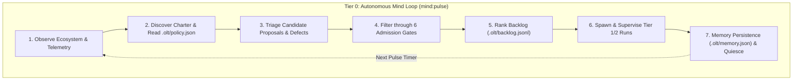
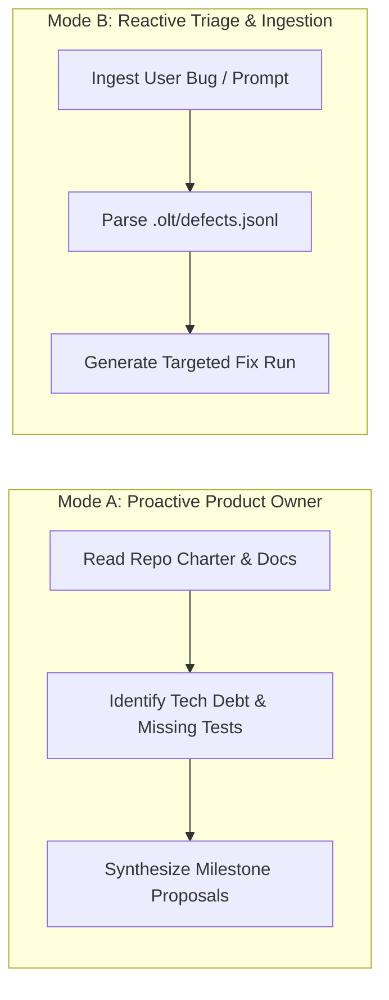

# Chapter 3: Tier 0 Governance & Autonomous Mind

[← Previous: Chapter 2 — Core Philosophy & Brent Parallelism](02-core-philosophy-and-brent-parallelism.md) | [📖 Table of Contents](SUMMARY.md) | [Next: Chapter 4 — Toolchain Discovery & Policy Engine →](04-toolchain-discovery-and-policy-engine.md)

---

[](README.md#diátaxis-documentation-matrix)
[](README.md)
[](../../olt/SKILL.md)
[](../../.olt/policy.json)

This chapter details the architecture and operational protocols of the **Tier 0 Autonomous Mind**, the top-level autonomous governing intelligence within OLT. We explore the **Infinite Pulse Loop**, distinguish **Mode A (Proactive Product Owner)** from **Mode B (Deterministic Triage)**, explain the **6 Backlog Admission Gates**, and demonstrate how long-term memory persists across generational agent rotations.

---

## 1. Tier 0 Autonomous Mind Architecture

While Tier 1 Orchestrators handle interactive human sessions and Tier 2/3 agents coordinate and implement specific code runs, the **Tier 0 Autonomous Mind** operates as the continuous background governance engine of the repository.



### The Autonomous Mind's Responsibilities

1. **Continuous Repository Observation**: Monitors codebase health, git commit history, defect logs, test coverage reports, and documentation freshness.
2. **Cold-Start Policy Awakening**: Automatically awakened alongside companion auditors (`mind-auditor`, `skill-auditor`) by the Tier 0 `policy-discovery` first responder once `.olt/policy.json` is calibrated.
3. **Idle-Trap Elimination & Human-Grade Cognitive Critique**: Never enters unmonitored idle states; replaces rigid robotic checklists with natural, human-level product, UX, and architectural critique.
4. **Autonomous Backlog Governance**: Dynamically curates, prioritizes, and prunes `.olt/backlog.jsonl`.
5. **Defect Attribution & RCA**: Automatically parses `.olt/defects.jsonl` to schedule regression tests and root-cause repair tasks.
6. **Policy Compliance**: Enforces organizational security constraints, toolchain limits, and token budgets defined in `.olt/policy.json`.
7. **Generational Memory Management**: Maintains cross-session institutional knowledge in `.olt/memory.json`.

---

## 2. The Infinite Pulse Loop Cadence

The Mind operates via a deterministic, multi-phase execution loop triggered by the `mind:pulse` command:

```bash
# Execute a single pulse cycle of the Tier 0 Autonomous Mind
bun olt/scripts/harness.ts mind:pulse
```

### Pulse Execution Protocol

```
+---------------------------------------------------------------------------------------------------------+
|                                        THE 7-STAGE MIND PULSE CADENCE                                   |
+---------------------------------------------------------------------------------------------------------+
|                                                                                                         |
|  Stage 1: Observation Sweep (mind:observe)                                                              |
|    - Scan git working tree, uncommitted diffs, recent commits, and active branch states.                |
|    - Ingest pending defect records from .olt/defects.jsonl.                                             |
|    - Probe host quota telemetry and rate limits.                                                        |
|                                                                                                         |
|  Stage 2: Policy & Charter Refresh (policy:check)                                                       |
|    - Load .olt/policy.json and verify repository autonomy level.                                        |
|    - Confirm write boundary constraints and allowed toolchains.                                         |
|                                                                                                         |
|  Stage 3: Candidate Ingestion & Synthesis (mind:candidate)                                             |
|    - Ingest external feature requests, bug reports, and todo comments.                                  |
|    - Synthesize proactive architectural improvements (Mode A) or defect fixes (Mode B).                 |
|                                                                                                         |
|  Stage 4: 6-Gate Admission Evaluation (mind:admit)                                                      |
|    - Pass candidate items through the 6 formal admission gates (Deduplication, Granularity, etc.).      |
|    - Reject non-compliant candidates with structured rejection reasons.                                 |
|                                                                                                         |
|  Stage 5: Backlog Ranking & Priority Sorting                                                            |
|    - Compute heuristic priority scores based on impact, effort, and dependency depth.                   |
|    - Persist ordered queue into .olt/backlog.jsonl.                                                     |
|                                                                                                         |
|  Stage 6: Autonomous Run Dispatch                                                                       |
|    - If quota permits and top backlog item is ready, initialize an execution capsule.                   |
|    - Dispatch Tier 1 Orchestrator or Tier 2 Coordinator to execute the run.                             |
|                                                                                                         |
|  Stage 7: Memory Consolidation & Quiescence (mind:quiesce)                                              |
|    - Update historical defect statistics and component stability indexes in .olt/memory.json.          |
|    - Release memory buffers and yield CPU until the next scheduled pulse interval.                      |
|                                                                                                         |
+---------------------------------------------------------------------------------------------------------+
```

---

## 3. Dual Operational Modes: Mode A vs. Mode B

The Autonomous Mind operates in two distinct operational modes depending on whether it is proactively driving architectural evolution or reacting to concrete tasks and defects:



### Mode A: Creative Product Owner & Expansion
In Mode A, the Mind acts as an autonomous technical product manager:
- **Proactive Tech Debt Elimination**: Scans for deprecated APIs, dead code, slow tests, or missing documentation.
- **Architectural Evolution**: Identifies opportunities for modularization, performance optimization, and concurrency improvements.
- **Test Suite Densification**: Proactively authors edge-case test suites for components with low mutation scores.

### Mode B: Direct Ingestion & Defect Triage
In Mode B, the Mind operates as a deterministic intake engine:
- **Direct Prompt Ingestion**: Deconstructs user feature requests into actionable engineering requirements.
- **Defect Forensics**: Ingests failure reports from companion auditors, isolates root causes, and schedules targeted repair tasks.
- **Regression Prevention**: Automatically pins reproduction test cases before executing code fixes.

---

## 4. Dynamic Repository Authority & Policy Discovery

The Mind derives all its execution boundaries and autonomy permissions from the central repository policy file: `.olt/policy.json`.

### Policy Configuration Schema

```json
{
  "$schema": "https://raw.githubusercontent.com/onurseckin/skills/main/olt/schemas/policy.schema.json",
  "version": 1,
  "autonomy_level": "supervised",
  "max_parallel_workers": 4,
  "budget": {
    "max_tokens_per_run": 500000,
    "max_cost_usd_per_day": 25.0,
    "freeze_at_quota_percent": 10.0
  },
  "write_boundaries": {
    "allowed_roots": [
      "src/",
      "docs/",
      "tests/"
    ],
    "strictly_forbidden": [
      ".git/",
      ".env",
      "credentials.json",
      "package-lock.json"
    ]
  },
  "toolchains": {
    "runtime": "bun",
    "package_manager": "bun",
    "test_runner": "bun test",
    "type_checker": "tsc --noEmit",
    "linter": "eslint"
  }
}
```

### Policy Discovery & Drift Protection

The Mind continuously checks that repository reality matches `.olt/policy.json`:

```bash
# Verify policy integrity and detect drift
bun olt/scripts/harness.ts policy:check
```

If drift is detected (such as new unapproved dependencies in `package.json` or unauthorized file edits outside `allowed_roots`), the Mind halts autonomous dispatch and logs a high-severity security alert.

---

## 5. The 6 Backlog Admission Gates

Before any candidate proposal or issue is admitted to `.olt/backlog.jsonl`, it must satisfy **all 6 Backlog Admission Gates**:

```text
+---------------------------------------------------------------------------------------------------------+
|                                        THE 6 ADMISSION GATES                                            |
+---------------------------------------------------------------------------------------------------------+
|                                                                                                         |
|  Gate 1: Deduplication Gate                                                                             |
|    * Computes semantic similarity (Jaccard token overlap & embedding distance) against active backlog  |
|      and completed capsules. Rejects duplicate proposals.                                               |
|                                                                                                         |
|  Gate 2: Granularity & Budget Gate                                                                      |
|    * Verifies that the task scope does not exceed 5 files or 4 hours of estimated work. Large tasks     |
|      are rejected with a mandate to decompose into atomic sub-tasks.                                    |
|                                                                                                         |
|  Gate 3: Falsifiability Gate                                                                            |
|    * Requires explicit, automated test commands (exit code 0 gates) and measurable acceptance criteria. |
|      Rejects vague prompts lacking verifiable proof mechanisms.                                         |
|                                                                                                         |
|  Gate 4: Scope Feasibility Gate                                                                         |
|    * Validates that all candidate target files fall strictly within policy-allowed write boundaries.    |
|      Rejects any task requiring edits to forbidden system roots.                                        |
|                                                                                                         |
|  Gate 5: Invariant Safety Gate                                                                          |
|    * Asserts compliance with the Hard Zeros (0 any types, 0 suppressions, strict typing).               |
|                                                                                                         |
|  Gate 6: Dependency Acyclicity Gate                                                                     |
|    * Validates that candidate dependencies do not create cycles with existing backlog items or runs.    |
|                                                                                                         |
+---------------------------------------------------------------------------------------------------------+
```

### Admission Evaluation CLI

Operators can manually evaluate a candidate task against the 6 gates:

```bash
bun olt/scripts/harness.ts mind:admit \
  --title "Refactor Auth Middleware" \
  --scope "src/auth/middleware.ts,tests/unit/auth/middleware.test.ts" \
  --gate "bun test tests/unit/auth/middleware.test.ts" \
  --effort 3
```

---

## 6. Long-Term Memory Persistence & Generational Rotation

To prevent context drift and memory leaks during multi-day operations, the Mind utilizes **Generational Rotation**: after a fixed number of pulse cycles (default: 50 pulses), the Mind consolidates state, flushes scratch buffers, and hands off execution to a fresh instance.

### The Memory Ledger: `.olt/memory.json`

Cross-session institutional knowledge is persisted in `.olt/memory.json`:

```json
{
  "version": 1,
  "generation": 14,
  "last_pulse_timestamp": "2026-08-31T12:00:00.000Z",
  "historical_stats": {
    "total_runs_completed": 142,
    "total_tasks_executed": 688,
    "first_pass_validation_rate": 0.942,
    "average_task_duration_seconds": 184
  },
  "component_stability_index": {
    "src/auth/": { "defect_count": 0, "stability_score": 1.0 },
    "src/engine/": { "defect_count": 1, "stability_score": 0.96 },
    "src/cli/": { "defect_count": 3, "stability_score": 0.88 }
  },
  "lessons_learned": [
    "Always run APCA perceptual contrast checks on dark mode color tokens.",
    "File lock timeouts occur if subagent heartbeats exceed 5 minutes under high I/O load."
  ]
}
```

### Graceful Quiescence & Sleep

When no backlog items require immediate dispatch, the Mind enters a low-overhead quiescence state:

```bash
# Gracefully quiesce the Mind daemon
bun olt/scripts/harness.ts mind:quiesce --duration-seconds 300
```

During quiescence, CPU consumption drops to zero, locks are released, and the system waits reactively for scheduled timers or external triggers.

---

[← Previous: Chapter 2 — Core Philosophy & Brent Parallelism](02-core-philosophy-and-brent-parallelism.md) | [📖 Table of Contents](SUMMARY.md) | [Next: Chapter 4 — Toolchain Discovery & Policy Engine →](04-toolchain-discovery-and-policy-engine.md)
