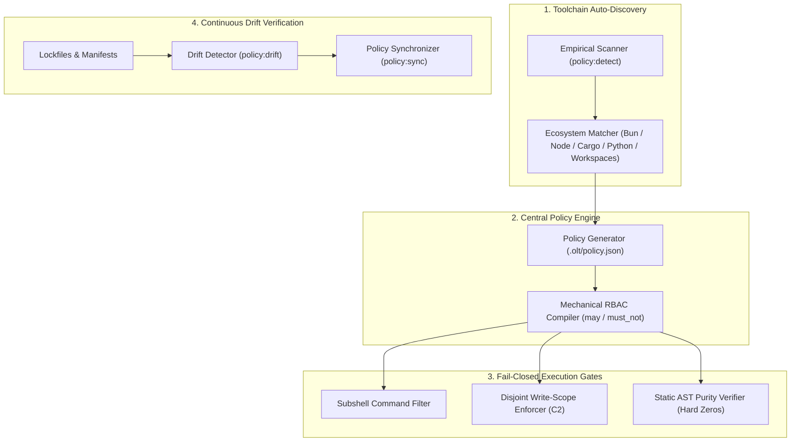

# Chapter 4: Toolchain Discovery & Policy Engine

[← Previous: Chapter 3 — Tier 0 Governance & Autonomous Mind](03-tier-0-governance-and-autonomous-mind.md) | [📖 Table of Contents](SUMMARY.md) | [Next: Chapter 5 — Mandatory Companion Auditors →](05-mandatory-companion-auditors.md)

---

[](#diátaxis-documentation-matrix)
[](SUMMARY.md)
[](../../.olt/policy.json)
[](../../tsconfig.json)

In an unconstrained multi-agent swarm, autonomous agents with unrestricted shell execution and uncontrolled file access inevitably destabilize repositories. They introduce arbitrary dependencies, execute hazardous shell commands, violate package boundaries, and silence compiler diagnostics with suppression directives (`@ts-ignore`, `eslint-disable`).

The **OLT Policy Engine & Toolchain Discovery Subsystem** establishes a deterministic, fail-closed security and execution perimeter. It dynamically discovers the host repository's toolchain, compiles an immutable repository policy (`.olt/policy.json`), enforces a mechanical Role-Based Access Control (RBAC) sandbox, verifies AST static lint purity, and continuously detects toolchain drift.



---

## 1. Zero-Config Toolchain Auto-Discovery & Cold-Start Bootstrapping

Modern enterprise repositories span polyglot ecosystems and monorepo architectures. Requiring developers to manually configure execution rules creates friction and configuration errors.

OLT resolves this through the **Tier 0 `policy-discovery` Agent**, which acts as the **cold-start first responder**. It empirically validates working commands, generates the authoritative `.olt/policy.json`, and triggers the awakening of the Tier 0 Autonomous Mind and its companion auditors (`mind-auditor`, `skill-auditor`).

### Empirical Detection Precedence

```text
1. Monorepo & Workspace Manifests: pnpm-workspace.yaml, bun.lock, turbo.json, Cargo.toml [workspace]
2. Package Manifests & Lockfiles:  bun.lock/b, pnpm-lock.yaml, yarn.lock, package-lock.json, Cargo.lock, uv.lock
3. Binary Verification:           Probe host PATH for exact binary versions (bun, cargo, tsc, pytest)
4. Script Target Introspection:   Extract canonical test_runner, typecheck_command, lint_command from scripts
5. Container & Compose Probes:    Inspect docker-compose.yml / Dockerfile for containerized test personas
```

### Toolchain CLI Commands

```bash
# Empirical toolchain inspection (outputs JSON report)
bun olt/scripts/harness.ts policy:detect

# Automated canonical policy initialization
bun olt/scripts/harness.ts policy:init --overwrite
```

---

## 2. Monorepo Multi-Package Boundaries & Nested Discovery

In monorepo environments (Bun workspaces, pnpm workspaces, Turborepo, Cargo workspaces), tasks operating on one package must not inadvertently alter or corrupt sibling packages.

```
+---------------------------------------------------------------------------------------------------------+
|                                  MONOREPO WORKSPACE BOUNDARY ISOLATION                                  |
+---------------------------------------------------------------------------------------------------------+
|                                                                                                         |
|  Root: /workspace/                                                                                      |
|  ├── packages/core/        <-- Task 1 Leased Scope (Allowed: packages/core/**, bun --filter core test) |
|  ├── packages/auth/        <-- Task 2 Leased Scope (Allowed: packages/auth/**, bun --filter auth test) |
|  └── apps/web/             <-- Task 3 Leased Scope (Allowed: apps/web/**,      bun --filter web test)  |
|                                                                                                         |
|  [C2 Invariant]: Task 1 write operations touching packages/auth/ are BLOCKED (SCOPE_VIOLATION).        |
|  [Test Scoping]: Implementers execute localized package scripts, NEVER full monorepo root test suites.  |
|                                                                                                         |
+---------------------------------------------------------------------------------------------------------+
```

### Monorepo Governance Protocols

1. **Workspace Manifest Mapping**: `policy:detect` parses workspace globs (`packages/*`, `apps/*`) and registers per-package root directories.
2. **Localized Script Routing**: Tasks assigned to `packages/core` execute targeted scripts (e.g. `bun --filter @scope/core test <path>`) rather than monorepo root sweeps.
3. **Cross-Package Invariant ($\mathcal{C}_2$)**: Write leases strictly confine file mutations to the claimed package subtree. Touching root lockfiles or sibling packages throws `SCOPE_VIOLATION`.

---

## 3. The Central Policy Engine: `.olt/policy.json`

The central policy file `.olt/policy.json` defines the definitive rulebook for every autonomous agent operating within the repository, validated against schema version `1`:

### Schema & Canonical Configuration

```json
{
  "schema_version": 1,
  "ecosystem": "bun",
  "package_manager": "bun",
  "skill_home_repo_root": "/Users/onurseckinsenoglu/repos/skills",
  "workspaces": ["packages/*", "apps/*"],
  "test_runner": {
    "default_command": "bun test",
    "targeted_pattern": "bun test <path>",
    "full_suite_command": "bun test",
    "timeout_ms": 30000
  },
  "typecheck_command": "bun run typecheck",
  "lint_command": "bun run lint",
  "allowed_commands": ["bun test", "bun run", "tsc", "git status", "git diff", "ls", "grep"],
  "forbidden_commands": ["git commit", "git push", "git reset", "rm -rf /"],
  "read_scope_neighborhood_depth": 2,
  "review_protocol": { "max_adversarial_pushes": 20, "cognitive_pushes": 5 },
  "planning": {
    "mandatory_brainstorming_rounds": 3,
    "min_tasks_per_complex_prompt": 6,
    "max_files_per_task": 2
  },
  "agents": {
    "orchestrator": {
      "tier": 1,
      "rbac": {
        "can_edit_code": false,
        "can_execute_shell": true,
        "forbidden_patterns": ["^bun\\s+test\\b", "^git\\s+(commit|push)"]
      }
    },
    "coordinator": {
      "tier": 2,
      "rbac": {
        "can_edit_code": false,
        "can_execute_shell": true,
        "forbidden_patterns": ["^bun\\s+test\\b"]
      }
    },
    "implementer": {
      "tier": 3,
      "rbac": {
        "can_edit_code": true,
        "can_execute_shell": true,
        "forbidden_patterns": ["^git\\s+push", "^bun\\s+test\\s*$"]
      }
    },
    "validator": {
      "tier": 3,
      "rbac": { "can_edit_code": false, "can_execute_shell": true }
    }
  }
}
```

---

## 4. Policy Drift Verification & Safety Sweeps

During long-horizon workflows, package manifests, linter configs, or dependencies may change. OLT provides continuous drift verification:

```bash
# Detect drift between live filesystem manifests and policy.json
bun olt/scripts/harness.ts policy:drift

# Synchronize policy with updated package manifests
bun olt/scripts/harness.ts policy:sync

# Validate policy integrity and RBAC schemas
bun olt/scripts/harness.ts policy:check
```

If unapproved dependencies or modified script patterns are detected, `policy:drift` exits with code `3` (`INVALID_STATE`), preventing agents from executing with stale assumptions.

---

## 5. Mechanical RBAC Matrix & Fail-Closed Gates

OLT intercepts every tool call and subprocess invocation before reaching the OS kernel:

| Role / Tier         | Code Edits?  | Shell Exec?  | Allowed Command Domain        | Forbidden Commands / Regex    |
| :------------------ | :----------- | :----------- | :---------------------------- | :---------------------------- |
| `orchestrator` (T1) | ❌ STRICT NO | ✅ Filtered  | `bun harness.ts *`, `git log` | `^bun test`, `^git (push      | reset)` |
| `coordinator` (T2)  | ❌ STRICT NO | ✅ Filtered  | `bun harness.ts *`, `git`     | `^bun test`, full test suites |
| `implementer` (T3)  | ✅ Leased    | ✅ Sandboxed | Targeted unit tests, linters  | `^git push`, root test suites |
| `validator_*` (T3)  | ❌ STRICT NO | ✅ Sandboxed | Monitored test gates, audits  | Any code write / patch tool   |

### The Three Fail-Closed Permission Invariants

1. **Supervisor Purity ($\mathcal{C}_1$)**: Tier 1 Orchestrators and Tier 2 Coordinators have **0 file edits**. Attempted code edits throw `ROLE_CONFINEMENT_VIOLATION`.
2. **Disjoint Write Scopes ($\mathcal{C}_2$)**: Leases enforce non-overlapping write sets ($\text{Scope}(T_i) \cap \text{Scope}(T_j) = \emptyset$). Any edit outside the leased paths triggers immediate submission rejection (`SCOPE_VIOLATION`).
3. **AST Static Lint Purity ($\mathcal{C}_{13}$)**: Code with `@ts-ignore`, `@ts-expect-error`, `eslint-disable`, or `: any` is rejected with `AST_PURITY_VIOLATION`.

---

## 6. How-To Guides & Practical Operations

### How-To: Initialize Policy for a Monorepo

```bash
# Step 1: Detect monorepo structure and workspaces
bun olt/scripts/harness.ts policy:detect

# Step 2: Generate .olt/policy.json with package boundaries
bun olt/scripts/harness.ts policy:init

# Step 3: Verify policy schema integrity
bun olt/scripts/harness.ts policy:check
```

### How-To: Whitelist a Custom Linter for Implementers

1. Open `.olt/policy.json`.
2. Append the permitted invocation to `agents.implementer.rbac.allowed_commands` (e.g., `"oxlint <target>"`).
3. Validate with `bun olt/scripts/harness.ts policy:check`.

---

[← Previous: Chapter 3 — Tier 0 Governance & Autonomous Mind](03-tier-0-governance-and-autonomous-mind.md) | [📖 Table of Contents](SUMMARY.md) | [Next: Chapter 5 — Mandatory Companion Auditors →](05-mandatory-companion-auditors.md)
