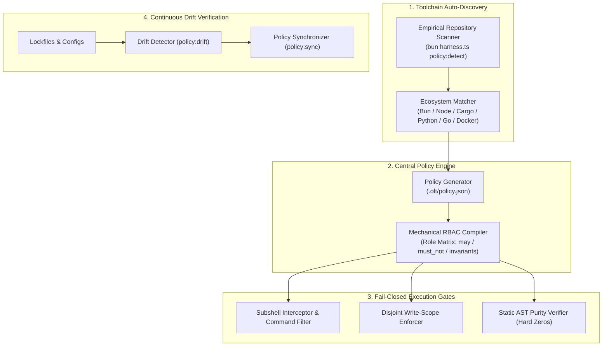
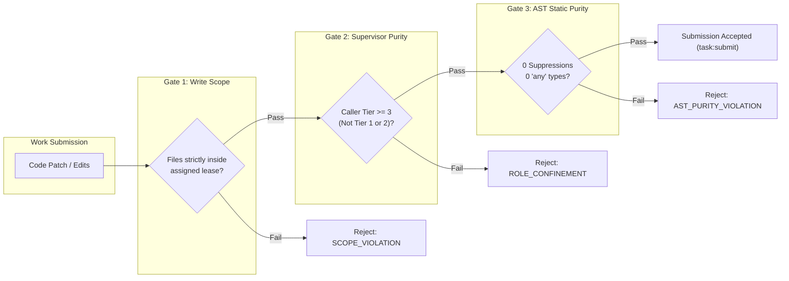

[← Previous: Chapter 3 — Tier 0 Governance & Autonomous Mind](03-tier-0-governance-and-autonomous-mind.md) | [📖 Table of Contents](SUMMARY.md) | [Next: Chapter 5 — Mandatory Companion Auditors →](05-mandatory-companion-auditors.md)

---

# Chapter 4: Toolchain Discovery & Policy Engine

[](#diátaxis-quadrant)
[](SUMMARY.md)
[](../../olt/policy.json)
[](../../tsconfig.json)

In an unconstrained multi-agent swarm, autonomous agents with unrestricted shell execution and uncontrolled file access inevitably destabilize repositories. They introduce arbitrary dependencies, execute hazardous shell commands (e.g., recursive directory wipes, uncoordinated git pushes), violate architectural boundaries, and silence compiler diagnostics with suppression directives (`@ts-ignore`, `eslint-disable`).

The **OLT Policy Engine & Toolchain Discovery Subsystem** establishes a deterministic, fail-closed security and execution perimeter. It dynamically discovers the host repository's toolchain, compiles an immutable repository policy (`.olt/policy.json`), enforces a mechanical Role-Based Access Control (RBAC) sandbox, verifies AST static lint purity, and continuously detects toolchain drift across long-horizon operations.



---

## 1. Zero-Config Toolchain Auto-Discovery & Cold-Start Bootstrapping

Modern enterprise codebases span diverse polyglot ecosystems—TypeScript with Bun or Node/pnpm, Rust with Cargo, Python with uv/poetry, Go modules, and containerized Docker development environments. Requiring human developers to manually craft complex policy configuration for every project creates operational friction and human configuration errors.

OLT resolves this through the **Tier 0 `policy-discovery` Agent**, which acts as the **cold-start first responder**. It empirically validates working commands, generates the authoritative `.olt/policy.json`, initializes governance directory structures, and triggers the awakening of the Tier 0 Autonomous Mind and its companion auditors (`mind-auditor`, `skill-auditor`).

### Empirical Inspection Heuristics

When initializing or verifying a repository, OLT executes empirical inspection using a deterministic precedence hierarchy:

```
+---------------------------------------------------------------------------------------------------+
|                                  TOOLCHAIN DETECTION PRECEDENCE                                   |
+---------------------------------------------------------------------------------------------------+
|                                                                                                   |
|  1. Root Manifest & Lockfile Inspection                                                           |
|     * bun.lockb / bun.lock         ==> Ecosystem: 'bun',    Package Manager: 'bun'                |
|     * pnpm-lock.yaml               ==> Ecosystem: 'node',   Package Manager: 'pnpm'               |
|     * yarn.lock                    ==> Ecosystem: 'node',   Package Manager: 'yarn'               |
|     * package-lock.json            ==> Ecosystem: 'node',   Package Manager: 'npm'                |
|     * Cargo.toml / Cargo.lock      ==> Ecosystem: 'cargo',  Package Manager: 'cargo'              |
|     * pyproject.toml / uv.lock     ==> Ecosystem: 'python', Package Manager: 'uv' / 'poetry'      |
|     * go.mod / go.sum              ==> Ecosystem: 'go',     Package Manager: 'go'                 |
|                                                                                                   |
|  2. Toolchain Binary Verification (Host PATH Probe)                                              |
|     * Validates that discovered executables (bun, cargo, tsc, pytest) exist and are runnable.   |
|     * Probes exact binary versions and runtime flags.                                            |
|                                                                                                   |
|  3. Script Target Introspection                                                                   |
|     * Parses `scripts` block in `package.json` or `Makefile` targets.                            |
|     * Automatically extracts canonical `test_runner`, `typecheck_command`, and `lint_command`.   |
|                                                                                                   |
|  4. Container & Docker Compose Discovery                                                         |
|     * Detects `docker-compose.yml`, `docker-compose.test.yml`, or `Dockerfile`.                  |
|     * Generates container service configurations, health check probes, and test personas.       |
|                                                                                                   |
+---------------------------------------------------------------------------------------------------+
```

### CLI Toolchain Commands

#### Empirical Toolchain Detection (`policy:detect`)

To inspect the ambient repository toolchain without writing configuration files:

```bash
bun harness.ts policy:detect
```

**Example JSON Output (`--format json`)**:
```json
{
  "detected": true,
  "ecosystem": "bun",
  "package_manager": "bun",
  "test_runner": {
    "default_command": "bun test",
    "targeted_pattern": "bun test <path>",
    "full_suite_command": "bun test",
    "timeout_ms": 30000
  },
  "typecheck_command": "bun run typecheck",
  "lint_command": "bun run lint",
  "docker_compose_detected": true,
  "compose_file": "docker-compose.test.yml",
  "confidence": "verified_exact"
}
```

#### Automated Policy Initialization (`policy:init`)

To generate or refresh the canonical `.olt/policy.json` specification:

```bash
bun harness.ts policy:init --overwrite
```

This compiles a hermetic, cryptographically validated policy file tailored specifically to the detected project structure.

---

## 2. The Central Policy Engine: `.olt/policy.json`

The central policy file `.olt/policy.json` defines the definitive rulebook for every autonomous agent operating within the repository. It is verified against a strict schema validator (`CURRENT_POLICY_SCHEMA_VERSION = 1`) on every harness command.

### Top-Level Schema Specification

| Top-Level Field | Type | Mandatory | Description |
| :--- | :--- | :--- | :--- |
| `schema_version` | `integer` | Yes | Schema version integer. Currently locked at `1`. |
| `ecosystem` | `string` | Yes | Primary repository runtime: `"bun"`, `"node"`, `"python"`, `"cargo"`, `"unknown"`. |
| `package_manager` | `string` | No | Active package manager: `"bun"`, `"npm"`, `"pnpm"`, `"yarn"`, `"poetry"`, `"pip"`, `"cargo"`. |
| `skill_home_repo_root` | `string` | No | Absolute canonical repository root path. |
| `test_runner` | `object` | Yes | Test runner configuration dictionary (default command, targeted pattern, full suite). |
| `typecheck_command` | `string` | No | Shell invocation for static type checking (e.g., `"bun run typecheck"`, `"tsc --noEmit"`). |
| `lint_command` | `string` | No | Shell invocation for linter execution (e.g., `"bun run lint"`, `"cargo clippy"`). |
| `allowed_commands` | `array<string>` | No | Global whitelist of safe shell commands permitted for workforce execution. |
| `forbidden_commands` | `array<string>` | No | Global blacklist of strictly forbidden shell commands (e.g., `git push`, `rm -rf /`). |
| `read_scope_neighborhood_depth`| `integer` | No | Permitted directory hop distance for context reading (default: `2`). |
| `review_protocol` | `object` | Yes | Adversarial review quotas (`max_adversarial_pushes`, `cognitive_pushes`). |
| `planning` | `object` | Yes | Architectural preplanning invariants and socratic expansion depth. |
| `agents` | `object` | Yes | Per-agent role definitions, RBAC sandboxes, quota budgets, and host bindings. |
| `docker_environment` | `object` | No | Containerized testing environment, test user personas, and cookie templates. |
| `hooks` | `object` | No | Universal lifecycle event dispatch hooks. |

### Complete Canonical `policy.json` Reference

```json
{
  "schema_version": 1,
  "ecosystem": "bun",
  "package_manager": "bun",
  "skill_home_repo_root": "/Users/onurseckinsenoglu/repos/skills",
  "test_runner": {
    "default_command": "bun test",
    "targeted_pattern": "bun test <path>",
    "full_suite_command": "bun test",
    "timeout_ms": 30000
  },
  "typecheck_command": "bun run typecheck",
  "lint_command": "bun run lint",
  "allowed_commands": [
    "bun test",
    "bun run",
    "tsc",
    "git status",
    "git diff",
    "git log",
    "ls",
    "find",
    "grep",
    "cat",
    "wc"
  ],
  "forbidden_commands": [
    "git commit",
    "git push",
    "git reset",
    "rm -rf /"
  ],
  "read_scope_neighborhood_depth": 2,
  "review_protocol": {
    "max_adversarial_pushes": 20,
    "cognitive_pushes": 5,
    "escalate_on_exhausted_adversarial": true
  },
  "planning": {
    "mandatory_brainstorming_rounds": 3,
    "socratic_expansion_depth": 8,
    "enforce_edge_case_matrix": true,
    "min_tasks_per_complex_prompt": 6,
    "max_files_per_task": 2,
    "reject_shallow_umbrella_compression": true
  },
  "agents": {
    "orchestrator": {
      "tier": 1,
      "rbac": {
        "can_execute_shell": true,
        "can_edit_code": false,
        "allowed_commands": ["bun harness.ts *", "git status", "git diff", "git log"],
        "forbidden_patterns": ["^bun\\s+test\\b", "^npm\\s+test\\b", "^git\\s+(commit|push|reset)"],
        "allowed_spawns": ["coordinator", "implementer", "validator_code_quality", "validator_ui_design"]
      },
      "hosts": {
        "antigravity": { "model": "gemini-3.7-flash", "model_tier": "high", "thinking_effort": "high", "max_tokens": 8192 },
        "claude_code": { "model": "claude-5-opus", "model_tier": "xhigh", "thinking_effort": "high", "max_tokens": 8192 },
        "codex": { "model": "gpt-5.6-sol", "model_tier": "xhigh", "thinking_effort": "high", "max_tokens": 8192 },
        "cursor": { "model": "cursor-latest", "model_tier": "high", "thinking_effort": "high", "max_tokens": 8192 }
      }
    },
    "coordinator": {
      "tier": 2,
      "rbac": {
        "can_execute_shell": true,
        "can_edit_code": false,
        "allowed_commands": ["bun harness.ts *", "git status", "git diff", "git commit", "git push", "git log"],
        "forbidden_patterns": ["^bun\\s+test\\b", "^npm\\s+test\\b"],
        "allowed_spawns": ["implementer", "validator_code_quality", "validator_ui_design", "completeness_critic"]
      },
      "hosts": {
        "antigravity": { "model": "gemini-3.7-flash", "model_tier": "high", "thinking_effort": "high", "max_tokens": 8192 },
        "claude_code": { "model": "claude-5-opus", "model_tier": "xhigh", "thinking_effort": "high", "max_tokens": 8192 },
        "codex": { "model": "gpt-5.6-sol", "model_tier": "xhigh", "thinking_effort": "high", "max_tokens": 8192 },
        "cursor": { "model": "cursor-latest", "model_tier": "high", "thinking_effort": "high", "max_tokens": 8192 }
      }
    },
    "implementer": {
      "tier": 3,
      "rbac": {
        "can_execute_shell": true,
        "can_edit_code": true,
        "allowed_commands": ["bun test <target>", "bun run typecheck", "bun run lint", "git status", "git diff", "ls", "grep"],
        "forbidden_patterns": ["^git\\s+(commit|push|reset|checkout\\s+-b)", "^bun\\s+test\\s*$", "^npm\\s+test\\s*$"]
      },
      "hosts": {
        "antigravity": { "model": "gemini-3.7-flash", "model_tier": "medium", "thinking_effort": "medium", "max_tokens": 8192 },
        "claude_code": { "model": "claude-5-sonnet", "model_tier": "medium", "thinking_effort": "medium", "max_tokens": 8192 },
        "codex": { "model": "gpt-5.6-terra", "model_tier": "medium", "thinking_effort": "medium", "max_tokens": 8192 },
        "cursor": { "model": "cursor-latest", "model_tier": "medium", "thinking_effort": "medium", "max_tokens": 8192 }
      }
    }
  }
}
```

---

## 3. Policy Drift Verification & Safety Sweeps

In long-running autonomous runs, dependencies, linter configurations, or toolchains may evolve. The Policy Engine provides continuous drift verification to guarantee that `.olt/policy.json` remains synchronized with the live repository state.

### Drift Detection Workflow

```bash
# Check for drift between policy.json and the filesystem
bun harness.ts policy:drift

# Synchronize policy with updated package manifests
bun harness.ts policy:sync

# Validate policy integrity and RBAC configuration
bun harness.ts policy:check
```

### Drift Vector Classification

1. **Manifest Drift**: A new package manager or dependency was added to `package.json` / `Cargo.toml` that requires updating `test_runner` or `typecheck_command`.
2. **Command Drift**: A new test runner script was introduced in `scripts` that is not currently whitelisted in `allowed_commands`.
3. **Environment Drift**: Docker test configuration or environment variables changed on the host.

When drift is detected, `policy:drift` returns exit code `3` (`INVALID_STATE`) with an actionable remediation payload, preventing agents from operating under stale security assumptions.

---

## 4. Sandboxed Execution & Tool Permission Grants

OLT enforces a **Mechanical Role-Based Access Control (RBAC)** model. Rather than relying on LLMs to self-police their tool invocations, the harness intercepts every command and file operation before it reaches the operating system kernel.

```
+--------------------------------------------------------------------------------------------------------------------+
|                                      MECHANICAL RBAC PERMISSION MATRIX                                             |
+----------------------+------+--------------+---------------+----------------------------+--------------------------+
| Role Contract        | Tier | Code Edits?  | Shell Exec?   | Allowed Command Domain     | Forbidden Command Regex  |
+----------------------+------+--------------+---------------+----------------------------+--------------------------+
| `mind_supervisor`    |  0   | ❌ STRICT NO | ✅ Filtered   | `bun harness.ts *`, `git`  | `^bun test`, `^git push` |
| `orchestrator`       |  1   | ❌ STRICT NO | ✅ Filtered   | `bun harness.ts *`, `git`  | `^bun test`, `^git push` |
| `coordinator`        |  2   | ❌ STRICT NO | ✅ Filtered   | `bun harness.ts *`, `git`  | `^bun test`, `^npm test` |
| `implementer`        |  3   | ✅ Leased    | ✅ Sandboxed  | Targeted tests, linters    | `^git push`, full-suites |
| `validator_*`        |  3   | ❌ STRICT NO | ✅ Sandboxed  | Full test suite, audits    | Any code write / patch   |
| `critic_*`           |  3   | ❌ STRICT NO | ✅ Sandboxed  | Read, diff, ast-inspect    | Any code write / patch   |
+----------------------+------+--------------+---------------+----------------------------+--------------------------+
```

### The 4 Permission Directives

Each role configuration within `agents.<role>.rbac` compiles down to four foundational directives:

1. **`can_edit_code` (`boolean`)**:
   - `false` (Supervisors, Validators, Critics): Any attempt to invoke `write_to_file`, `replace_file_content`, or modify files on disk results in immediate termination with error code `ROLE_CONFINEMENT_VIOLATION`.
   - `true` (Implementers, Repairers): Permitted to edit files, but strictly within their active **Disjoint Write Scope**.

2. **`can_execute_shell` (`boolean`)**:
   - Governs whether the agent may invoke subprocesses or execute terminal commands via `run_command`.

3. **`allowed_commands` (`array<string>`)**:
   - Whitelist of command patterns. Supports globs (e.g., `"bun harness.ts *"`, `"bun test <target>"`). Commands not matching an allowlist entry are blocked.

4. **`forbidden_patterns` (`array<string>`)**:
   - Regular expression blacklists evaluated against full argv strings. If a command matches any forbidden pattern (e.g., `"^bun\\s+test\\s*$"` to prevent implementers from burning full-suite cycles), it is rejected.

---

## 5. Fail-Closed Permission Gates & Invariants

OLT establishes three non-negotiable, mathematically guaranteed permission gates:



### 1. Supervisor Purity Invariant ($\mathcal{C}_1$)

> **Hard Zero Rule**: Tier 1 Orchestrators and Tier 2 Coordinators must maintain **0 file edits** throughout their lifetime.

Supervisors coordinate through the Harness CLI and IPC mailboxes. If an orchestrator or coordinator attempts to claim a write lease or mutate source files, the harness throws:

```
**Error (ROLE_CONFINEMENT_VIOLATION)**: Orchestrators are mechanically confined from claiming code execution tasks. Dispatch Tier 3 Implementers via invoke_subagent.
```

### 2. Disjoint Write-Scope Enforcement ($\mathcal{C}_2$)

When an implementer claims a task via `task:claim`, the harness records its assigned write scope in the Merkle state ledger:

$$\text{WriteScope}(T_i) \cap \text{WriteScope}(T_j) = \emptyset \quad \forall i \neq j \text{ in parallel wave}$$

Before accepting any `task:submit`, the harness computes an exact git status diff against the workspace. If any file outside the leased scope was created, modified, or deleted, the submission is rejected immediately with `PATH_SAFETY` or `INTEGRITY` violations. Symlink escapes and POSIX `..` traversal attacks are blocked via kernel-level `O_NOFOLLOW` and inode verification.

### 3. Static AST Lint Purity ($\mathcal{C}_{13}$)

Autonomous agents frequently hide underlying type errors by inserting compiler suppressions. OLT enforces **zero-tolerance AST static purity**:

| Forbidden Token / Pattern | Rationale | Rejection Code |
| :--- | :--- | :--- |
| `@ts-ignore` | Silences TypeScript compiler errors without fixing underlying defects | `AST_PURITY_VIOLATION` |
| `@ts-expect-error` | Masks fragile type signatures | `AST_PURITY_VIOLATION` |
| `eslint-disable` | Bypasses code quality and security lint rules | `AST_PURITY_VIOLATION` |
| `: any` / `as any` | Defeats static type safety and contract verification | `AST_PURITY_VIOLATION` |

---

## 6. How-To Guides & Practical Operations

### How-To: Initialize a Clean Repository Policy

```bash
# Step 1: Detect repository toolchain
bun harness.ts policy:detect

# Step 2: Initialize canonical .olt/policy.json
bun harness.ts policy:init

# Step 3: Verify policy health
bun harness.ts policy:check
```

### How-To: Add a Custom Allowed Tool for Implementers

To permit implementers to execute a new specialized CLI tool (e.g., `prettier` or `sqlfluff`):

1. Open `.olt/policy.json`.
2. Locate `agents.implementer.rbac.allowed_commands`.
3. Add the permitted invocation pattern:
   ```json
   "allowed_commands": [
     "bun test <target>",
     "bun run typecheck",
     "bun run lint",
     "prettier --check <target>"
   ]
   ```
4. Verify the policy schema with `bun harness.ts policy:check`.

---

[← Previous: Chapter 3 — Tier 0 Governance & Autonomous Mind](03-tier-0-governance-and-autonomous-mind.md) | [📖 Table of Contents](SUMMARY.md) | [Next: Chapter 5 — Mandatory Companion Auditors →](05-mandatory-companion-auditors.md)
