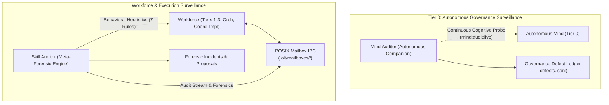

[← Previous: Chapter 4 — Toolchain Discovery & Policy Engine](04-toolchain-discovery-and-policy-engine.md) | [📖 Table of Contents](SUMMARY.md) | [Next: Chapter 6 — Lifecycle Hooks & Audio Engine →](06-lifecycle-hooks-and-audio-engine.md)

---

# Chapter 5: Mandatory Companion Auditors

[](#diátaxis-quadrant)
[](SUMMARY.md)
[](../../olt/mailboxes)
[](../../olt/scripts/src/mind/auditing/meta/heuristics.ts)

In complex multi-agent architectures, self-grading by executing agents is the primary cause of silent software failure. When an autonomous agent that authors code also evaluates its correctness, or when supervisory agents lack external verification, agents succumb to epistemic bias: they hallucinate passing verification gates, create empty stubs, modify files outside their assigned scope, fabricate cryptographic evidence, or leave dangling zombie leases.

To solve this fundamentally, OLT introduces **Mandatory Companion Auditors**: an independent, adversarial surveillance subsystem operating alongside the multi-agent hierarchy.



---

## 1. The Need for Continuous Forensic Surveillance

Self-policing in LLM swarms fails due to three systemic vulnerabilities:

1. **Epistemic Bias & Self-Grading Blindspots**: An agent that makes a flawed conceptual assumption will repeat the exact same misconception when verifying its own implementation.
2. **Superficial Completion Pressure**: When context windows fill up or reasoning budgets deplete, agents tend to generate stubbed methods, placeholder mocks, and hollow test suites that technically pass execution but deliver zero real functionality.
3. **Collusion in Subagent Chains**: When a parent supervisor dispatches a child worker, both share similar prompt contexts and prompt biases, leading the supervisor to uncritically approve substandard child output.

OLT resolves this by establishing **Separation of Powers** through two specialized companion auditors:
- **`mind-auditor`**: Audits the Tier 0 Autonomous Mind's pulse cadence, eliminates idle traps (>120s), validates backlog triage accuracy, and delivers natural human-grade cognitive critique without robotic checklist boilerplate.
- **`skill-auditor`**: Operates on a **1-minute high-frequency tracking cadence** to conduct meta-behavioral forensics across Tier 1–3 agent interactions, tool calls, leases, and mailbox messages.

---

## 2. The Mind Auditor: Governance & Triage Audits

The **Mind Auditor** is an autonomous companion daemon bound to the Tier 0 governance layer. It inspects the mind's internal decision records, state transitions, and pulse cycle without participating in execution. It actively eliminates idle traps (>120s stagnation) and ensures natural cognitive critique over superficial checklist validation.

```
+---------------------------------------------------------------------------------------------------+
|                                  MIND AUDITOR SURVEILLANCE MATRIX                                 |
+-----------------------------------+---------------------------------------------------------------+
| Audit Dimension                   | Verification Invariant & Heuristic                            |
+-----------------------------------+---------------------------------------------------------------+
| **Pulse Cadence & Liveness**      | Eliminates idle traps (>120s stagnation) and pulse stalls.    |
| **Backlog Triage Accuracy**       | Verifies that user requirements are not dropped or truncated. |
| **Admission Gate Strictness**     | Ensures all 6 backlog admission gates were formally evaluated.|
| **Counterfactual Simulation**     | Tests alternative task partitionings to detect bias.          |
| **Memory Rotation Integrity**     | Verifies generational summaries preserve key architectural SSoT.|
+-----------------------------------+---------------------------------------------------------------+
```

### Live Observation Commands

#### Real-Time Mind Audit (`mind:audit:live`)

To trigger an on-demand cognitive audit of the active Tier 0 Mind:

```bash
bun harness.ts mind:audit:live --run .olt/capsules/<run-id>
```

#### Behavioral Observation Stream (`mind:observe`)

To attach a non-invasive telemetry tap to live agent operations:

```bash
bun harness.ts mind:observe --run .olt/capsules/<run-id> --tail 50
```

---

## 3. The Skill Auditor: Agent Persona & Execution Audits

The **Skill Auditor** is OLT's deep behavioral forensics engine operating on a **1-minute tracking cadence**. It analyzes runtime tool execution streams, lease transitions, token burn rates, and inter-agent mailbox communications.

### Inter-Agent Mailbox IPC Protocol

OLT rejects centralized message brokers (RabbitMQ, Redis) and network socket daemons in favor of a hermetic, filesystem-backed **POSIX Mailbox Protocol**. Inter-agent messages are delivered via atomic filesystem operations and synchronized with kernel-level advisory locks (`flock`).

#### Mailbox Filesystem Anatomy

```
.olt/mailboxes/
├── coordinator_documentation/
│   ├── inbox/
│   │   ├── msg_20260831_124501_task_claim_ack.json
│   │   └── msg_20260831_124822_validation_report.json
│   ├── outbox/
│   ├── archive/
│   └── locks/
│       └── mailbox.lock
└── implementer_subsystems_4_6/
    ├── inbox/
    ├── outbox/
    ├── archive/
    └── locks/
        └── mailbox.lock
```

#### Atomic Message Envelope Schema

Every mailbox message is written as an immutable JSON document with strict cryptographic verification:

```json
{
  "schema": "olt.mailbox.message",
  "version": 1,
  "id": "msg_84f9a12c8e31409b",
  "sender_id": "implementer_subsystems_4_6",
  "sender_role": "implementer",
  "recipient_id": "coordinator_documentation",
  "recipient_role": "coordinator",
  "timestamp": "2026-08-31T12:49:15.102Z",
  "message_type": "task_completion_notice",
  "payload": {
    "task_id": "task-3-subsystems-ch4-6",
    "lease_token": "rLlnZsFYmeHt81cFtC-0XW0OA5BNSAJBVkslUDGY81Q",
    "files_changed": [
      "docs/book/04-toolchain-discovery-and-policy-engine.md",
      "docs/book/05-mandatory-companion-auditors.md",
      "docs/book/06-lifecycle-hooks-and-audio-engine.md"
    ],
    "verification_status": "passed_all_checks"
  },
  "digest_sha256": "3a7b8c9d0e1f2a3b4c5d6e7f8a9b0c1d2e3f4a5b6c7d8e9f0a1b2c3d4e5f6a7b"
}
```

---

## 4. The 7 Forensic Heuristic Detectors

The Skill Auditor runs **7 deep behavioral forensic heuristics** across every active run. Each heuristic targets a distinct autonomous agent failure mode.

```
+---------------------------------------------------------------------------------------------------+
|                                  THE 7 FORENSIC HEURISTIC DETECTORS                               |
+---+----------------------------+-------------------------------------+----------------------------+
| # | Forensic Heuristic Detector| Empirical Pattern Detected          | Severity & Action          |
+---+----------------------------+-------------------------------------+----------------------------+
| 1 | **Hallucinated Gates**     | Claiming gate pass without evidence | 🔴 CRITICAL: Revert & Halt |
| 2 | **Silent Mutations**       | Unleased or unrecorded file edits   | 🔴 CRITICAL: Abort Task    |
| 3 | **Scope Expansion**        | Touching files outside write scope  | 🔴 CRITICAL: Lock Reject   |
| 4 | **Superficial Stubs**      | Empty functions, TODOs, fake tests  | 🟠 HIGH: Force Redo        |
| 5 | **Zombie Leases**          | Unreleased leases after agent exit  | 🟠 HIGH: Force Reclaim     |
| 6 | **Fabricated Evidence**    | Forged hashes or mock receipts      | 🔴 CRITICAL: Blacklist     |
| 7 | **Circular Dependencies**  | Cycles in dynamically added tasks   | 🟠 HIGH: DAG Cycle Break   |
+---+----------------------------+-------------------------------------+----------------------------+
```

### Heuristic 1: Hallucinated Gates (`HALLUCINATED_GATE`)
- **Detection Logic**: An agent reports that a quality or test gate succeeded, but the capsule event log contains no corresponding test execution record or binary execution receipt.
- **Remediation**: Invalidate task submission, revoke lease, and dispatch an adversarial validator.

### Heuristic 2: Silent Mutations (`SILENT_MUTATION`)
- **Detection Logic**: Workspace file checksums change without an active, verified `task:claim` write lease recorded in `state.json`.
- **Remediation**: Roll back workspace to the last verified Merkle tree checkpoint.

### Heuristic 3: Scope Expansion (`SCOPE_EXPANSION`)
- **Detection Logic**: An implementer with lease $\mathcal{L}(T_k) = \{f_1, f_2\}$ attempts to read, write, or delete file $f_3 \notin \mathcal{L}(T_k)$.
- **Remediation**: Block file operation immediately with `PATH_SAFETY` / `SCOPE_VIOLATION`.

### Heuristic 4: Superficial Stubs (`SUPERFICIAL_STUB`)
- **Detection Logic**: Code changes contain stubbed keywords (`// TODO: implement`, `throw new NotImplementedException()`, `pass`, empty function bodies) in production files while claiming task completion.
- **Remediation**: Reject `task:submit` and demand complete, runnable implementation.

### Heuristic 5: Zombie Leases (`GHOST_LEASE` / `ZOMBIE_LEASE`)
- **Detection Logic**: A task remains in `leased` state whose owning agent process has exited, released its grant, or failed to heartbeat past the lease TTL ($T_{\text{now}} > T_{\text{lease_expires}}$).
- **Remediation**: Execute automated recovery with `bun harness.ts recover` and re-queue task.

### Heuristic 6: Fabricated Evidence (`FABRICATED_EVIDENCE`)
- **Detection Logic**: The SHA-256 digest submitted in a test receipt or verification packet does not match the computed hash of the actual execution artifact on disk.
- **Remediation**: Terminate offending agent grant, log security defect, and alert supervisor.

### Heuristic 7: Circular Dependencies (`CIRCULAR_DEPENDENCY`)
- **Detection Logic**: Dynamic task expansion or sub-task registration introduces a cycle in the dependency graph ($\exists v : v \to^+ v$).
- **Remediation**: Trigger Tarjan's Strongly Connected Components (SCC) algorithm, break the back-edge, and re-compile topological waves.

---

## 5. Defect Ledger Schema & Root Cause Analysis

All forensic findings are permanently recorded in the capsule's append-only defect ledger (`defects.jsonl`).


### `defects.jsonl` Record Specification

```json
{
  "id": "defect-ghost-lease-1725108500-worker-1-task-4",
  "type": "ghost_lease",
  "category": "lease_integrity",
  "severity": "HIGH",
  "actor": "worker-1",
  "role": "implementer",
  "task_id": "task-4",
  "timestamp": "2026-08-31T12:51:40.012Z",
  "details": "Task 'task-4' remained leased for 1200s with 0 heartbeat updates after worker-1 was released.",
  "remediation": "Reclaim task with bun harness.ts recover --task task-4 and dispatch fresh implementer."
}
```

### Forensic Efficiency Score Formulation

The companion auditor calculates the run's overall **Efficiency Score** ($\mathcal{E} \in [0, 100]$):

$$\mathcal{E} = 100 - \left( 25 \cdot N_{\text{critical}} + 10 \cdot N_{\text{high}} + 3 \cdot N_{\text{medium}} + 1 \cdot N_{\text{low}} + 5 \cdot \text{Ratio}_{\text{polling}} + 10 \cdot \text{Bottlenecks}_{\text{wave}} \right)$$

A run is certified as **CLEAN / OPTIMIZED** only when $\mathcal{E} \ge 90.0$ and $N_{\text{critical}} = 0$.

---

## 6. How-To Guides & Verification Workflows

### How-To: Run a Full Behavioral Forensics Audit

```bash
# Execute deep forensics audit on a capsule run
bun harness.ts mind:audit:live --run .olt/capsules/<run-id> --format markdown
```

### How-To: Inspect the Defect Ledger

```bash
# Display all recorded defects and forensic incidents
cat .olt/capsules/<run-id>/defects.jsonl | jq .
```

---

[← Previous: Chapter 4 — Toolchain Discovery & Policy Engine](04-toolchain-discovery-and-policy-engine.md) | [📖 Table of Contents](SUMMARY.md) | [Next: Chapter 6 — Lifecycle Hooks & Audio Engine →](06-lifecycle-hooks-and-audio-engine.md)
