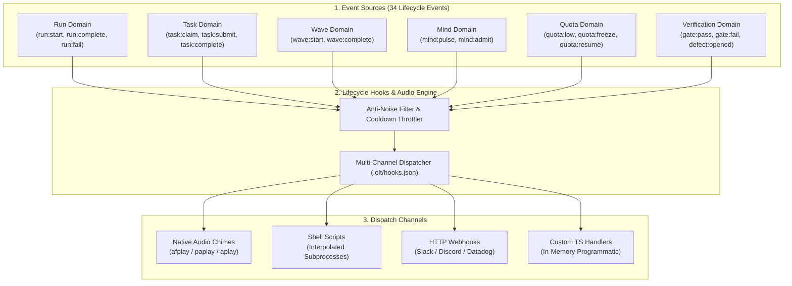

[← Previous: Chapter 5 — Mandatory Companion Auditors](05-mandatory-companion-auditors.md) | [📖 Table of Contents](SUMMARY.md) | [Next: Chapter 7 — Host-Aware Quota Engine & Graceful Freeze →](07-host-aware-quota-engine-and-graceful-freeze.md)

---

# Chapter 6: Lifecycle Hooks & Audio Engine

[](#diátaxis-quadrant)
[](SUMMARY.md)
[](../../olt/scripts/src/orchestrator/completion-audio.ts)
[](../../olt/scripts/src/hooks/types.ts)

Long-running autonomous swarms operate for hours without continuous human eyes on the screen. Developers need clear, multi-channel situational awareness—instant desktop audio chimes on completion, HTTP webhooks to incident monitoring channels (Slack, Discord, Datadog), and automated post-phase shell scripts—without being overwhelmed by thousands of noisy intermediate subagent events.

The **OLT Lifecycle Hooks & Audio Engine** provides a unified event-driven notification architecture. It catalogs **34 canonical lifecycle events** across 6 operational domains, executes multi-channel dispatches (Audio, Shell, Webhooks, TypeScript handlers), enforces intelligent anti-noise suppression filters, and guarantees non-blocking, fail-safe hook execution.



---

## 1. Universal Lifecycle Architecture: 34 Lifecycle Events

OLT standardizes every discrete state transition across the swarm into **34 canonical lifecycle events**, organized across 6 functional domains:

```
+-------------------------------------------------------------------------------------------------------------------+
|                                      THE 34 CANONICAL LIFECYCLE EVENTS CATALOG                                    |
+---+----------------------+-----------------------------+----------------------------------------------------------+
| # | Operational Domain   | Canonical Event Identifier  | Semantic State Transition Trigger                        |
+---+----------------------+-----------------------------+----------------------------------------------------------+
| 1 | **Run Domain**       | `run:start`                 | Capsule initialized, Merkle state genesis created        |
| 2 |                      | `run:complete`              | All waves verified, capsule sealed successfully          |
| 3 |                      | `run:fail`                  | Unrecoverable error, gate exhaustion, or abortion        |
| 4 |                      | `run:freeze`                | Swarm suspended due to quota depletion or rate limit     |
| 5 |                      | `run:unfreeze`              | Swarm resumed following quota reset window               |
| 6 |                      | `run:archive`               | Completed run compacted and moved to cold storage        |
+---+----------------------+-----------------------------+----------------------------------------------------------+
| 7 | **Task Domain**      | `task:start`                | Task scheduled and entered ready queue                   |
| 8 |                      | `task:claim`                | Implementer granted exclusive write lease                |
| 9 |                      | `task:heartbeat`            | Implementer extended active lease deadline               |
| 10|                      | `task:submit`               | Implementer completed changes and submitted for review   |
| 11|                      | `task:reclaim`              | Lease revoked due to timeout, crash, or defect           |
| 12|                      | `task:complete`             | Adversarial validation passed; changes committed         |
| 13|                      | `task:fail`                 | Verification rejected; task marked for monotonic repair  |
+---+----------------------+-----------------------------+----------------------------------------------------------+
| 14| **Wave Domain**      | `wave:start`                | Topological wave execution began in parallel             |
| 15|                      | `wave:complete`             | All tasks in current wave completed and verified         |
| 16|                      | `topology:compiled`         | Kahn DAG partitioning and wave schedules calculated      |
| 17|                      | `scheduler:dispatched`      | Worker slots assigned up to max_parallel bound           |
| 18|                      | `queue:drained`             | Ready task queue reached 0 pending items                 |
+---+----------------------+-----------------------------+----------------------------------------------------------+
| 19| **Mind Domain**      | `mind:pulse-open`           | Tier 0 pulse loop wake cycle triggered                   |
| 20|                      | `mind:pulse`                | Pulse loop evaluated, triage completed                   |
| 21|                      | `mind:admit`                | Backlog requirement cleared all 6 admission gates        |
| 22|                      | `mind:rotate`               | Generational context rotation performed                  |
| 23|                      | `mind:quiesce`              | Mind paused during active workforce convergence          |
+---+----------------------+-----------------------------+----------------------------------------------------------+
| 24| **Quota Domain**     | `quota:probed`              | Ambient host token metrics extracted                     |
| 25|                      | `quota:low`                 | Token capacity dipped below 20% warning threshold        |
| 26|                      | `quota:exhausted`           | Token capacity dipped below 10% critical floor           |
| 27|                      | `quota:freeze`              | Graceful freeze engaged to prevent mid-turn drop         |
| 28|                      | `quota:resumed`             | Host rate limit reset; swarm thawed                      |
+---+----------------------+-----------------------------+----------------------------------------------------------+
| 29| **Verification**     | `gate:start`                | Adversarial validation suite initiated                   |
| 30|                      | `gate:pass`                 | Validation suite passed with 100% assertions             |
| 31|                      | `gate:fail`                 | Validation suite encountered assertions/type errors      |
| 32|                      | `critic:start`              | Socratic completeness critic began review                |
| 33|                      | `critic:approve`            | Socratic review approved implementation                  |
| 34|                      | `defect:opened`             | Forensic defect appended to defects.jsonl                |
+---+----------------------+-----------------------------+----------------------------------------------------------+
```

### Event Payload Schema

Every lifecycle event emitted by the harness carries a standardized payload:

```json
{
  "event": "run:complete",
  "run_id": "2026-08-31-complete-documentation-and-book-system-overhaul",
  "timestamp": "2026-08-31T12:55:00.000Z",
  "actor": "coordinator_documentation",
  "role": "coordinator",
  "task_id": null,
  "payload": {
    "tasks_completed": 5,
    "waves_executed": 2,
    "total_duration_ms": 342000,
    "duration_formatted": "5m 42s",
    "efficiency_score": 98.5,
    "defects_count": 0,
    "final_commit_sha": "a1b2c3d4e5f6"
  }
}
```

---

## 2. Multi-Channel Hook Dispatch Engine

The Hook Dispatch Engine supports four independent execution channels configured declaratively in `.olt/hooks.json` or within `.olt/policy.json`.

```
+---------------------------------------------------------------------------------------------------+
|                                    MULTI-CHANNEL DISPATCH MATRIX                                  |
+-------------------+----------------------------+-----------------------+--------------------------+
| Channel           | Implementation Mechanism   | Supported Platforms   | Typical Use Case         |
+-------------------+----------------------------+-----------------------+--------------------------+
| **Audio**         | Native CLI player spawned  | macOS (`darwin`),     | Completion chimes,       |
|                   | (`afplay` / `paplay`)      | Linux (`linux`)       | freeze alerts            |
+-------------------+----------------------------+-----------------------+--------------------------+
| **Shell**         | Subprocess execution with  | POSIX, macOS,         | CI notifications, git    |
|                   | variable interpolation     | Linux, Windows        | auto-tags, build steps   |
+-------------------+----------------------------+-----------------------+--------------------------+
| **Webhook**       | HTTP POST/PUT JSON payload | Universal             | Slack, Discord, Datadog, |
|                   | to remote endpoint         |                       | web telemetry            |
+-------------------+----------------------------+-----------------------+--------------------------+
| **Custom TS**     | In-memory asynchronous TS  | Bun Runtime           | Programmatic integration |
|                   | function callback          |                       | in testing suites        |
+-------------------+----------------------------+-----------------------+--------------------------+
```

### Execution Models: Synchronous vs. Non-Blocking Async

Hooks default to **non-blocking asynchronous execution** (`detached: true`). The harness forks the hook process in the background and immediately continues swarm operations, preventing slow network webhooks or audio playback from adding latency to the critical path.

For hooks that must complete before the next phase begins (e.g., pre-commit linters or test suite setup), setting `"sync": true` executes the hook synchronously with a strict timeout guard (`timeout_ms: 10000`).

---

## 3. Procedural Audio Synthesis Engine

The Audio Engine provides crisp, non-intrusive auditory cues for long-horizon background tasks.

### Native Sound Architecture

OLT uses native OS binaries without pulling heavy third-party audio libraries or dependencies:

- **macOS (`darwin`)**: Spawns `/usr/bin/afplay` using macOS System Sound bundles.
- **Linux (`linux`)**: Probes `/usr/bin/paplay` (PulseAudio) $\to$ `/usr/bin/aplay` (ALSA) $\to$ `/usr/bin/canberra-gtk-play`.

#### Standard macOS System Chimes

| Sound Name  | Absolute File Path                      | Recommended Event Pairing                |
| :---------- | :-------------------------------------- | :--------------------------------------- |
| `Bottle`    | `/System/Library/Sounds/Bottle.aiff`    | `orchestrator:complete`, `run:complete`  |
| `Glass`     | `/System/Library/Sounds/Glass.aiff`     | `wave:complete`, `task:complete`         |
| `Submarine` | `/System/Library/Sounds/Submarine.aiff` | `quota:freeze`, `run:freeze`             |
| `Sosumi`    | `/System/Library/Sounds/Sosumi.aiff`    | `run:fail`, `gate:fail`, `defect:opened` |
| `Ping`      | `/System/Library/Sounds/Ping.aiff`      | `mind:pulse`, `quota:resumed`            |

### Anti-Noise Filter & Cooldown Throttling

In an active swarm executing 50 parallel tasks, emitting audio on every task heartbeat, claim, and tool call causes unbearable acoustic noise. OLT enforces two hard anti-noise interlocks:

1. **Role & Tier Whitelisting**:
   - **Allowed Tiers**: `orchestrator`, `coordinator`, `root`, `supervisor`.
   - **Suppressed Roles**: `implementer`, `validator`, `critic`, `worker`, `subagent`.
2. **Event Whitelisting & Suppression**:
   - **Allowed Events**: `orchestrator:complete`, `run:complete`, `run:fail`, `run:freeze`.
   - **Suppressed Events**: `task:heartbeat`, `task:claim`, `task:submit`, `probe:start`, `subagent:start`.
3. **Cooldown Timer (`DEFAULT_COMPLETION_AUDIO_COOLDOWN_MS = 3000`)**:
   - Multiple completion events within a 3-second window trigger exactly one audio chime.

---

## 4. Custom Hook Registration & Configuration Schema

Hooks are configured in `.olt/hooks.json` at the root of the repository or capsule.

### Configuration Schema (`.olt/hooks.json`)

```json
{
  "$schema": "https://olt.dev/schemas/v1/hooks.json",
  "version": 1,
  "enabled": true,
  "defaultAudioDarwin": "/System/Library/Sounds/Bottle.aiff",
  "hooks": [
    {
      "id": "desktop-completion-audio",
      "description": "Play native chime on orchestrator or run completion",
      "events": ["orchestrator:complete", "run:complete"],
      "action": "audio",
      "sound": "Bottle",
      "platforms": ["darwin"],
      "enabled": true
    },
    {
      "id": "slack-failure-alert",
      "description": "Send alert webhook to Slack on run or gate failure",
      "events": ["run:fail", "gate:fail", "quota:exhausted"],
      "action": "webhook",
      "url": "https://hooks.slack.com/services/T000/B000/XXXX",
      "method": "POST",
      "headers": {
        "Content-Type": "application/json"
      },
      "timeout_ms": 5000,
      "enabled": true
    },
    {
      "id": "phase-git-tag",
      "description": "Tag release commit upon phase completion",
      "events": ["wave:complete", "on_phase_completion"],
      "action": "shell",
      "command": "git tag -a 'phase-{phase_name}' -m 'Phase completed in {duration_formatted}'",
      "platforms": ["darwin", "linux"],
      "enabled": true
    }
  ]
}
```

### Variable Interpolation Reference

Shell commands and webhook URLs support rich template variable interpolation:

| Variable Token         | Resolved Value                          | Example Output                      |
| :--------------------- | :-------------------------------------- | :---------------------------------- |
| `{event}`              | Name of the triggering lifecycle event  | `run:complete`                      |
| `{run_id}`             | Unique capsule run identifier slug      | `2026-08-31-complete-documentation` |
| `{task_id}`            | ID of the active task (or `N/A`)        | `task-3-subsystems-ch4-6`           |
| `{actor}`              | Agent ID that emitted the event         | `coordinator_documentation`         |
| `{role}`               | Role of the acting agent                | `coordinator`                       |
| `{phase_name}`         | Name of the completed phase             | `Subsystems Deep Dive`              |
| `{commit_sha}`         | Head commit SHA of the repository       | `84e8cd79b679`                      |
| `{duration_formatted}` | Elapsed time formatted as human text    | `4m 12s`                            |
| `{tasks_count}`        | Total number of tasks completed in wave | `4`                                 |

---

## 5. How-To Guides & Practical Operations

### How-To: Test Audio Chimes on macOS

To test your desktop audio notification setup directly from the CLI:

```bash
# Play default completion chime
afplay /System/Library/Sounds/Bottle.aiff

# Trigger completion audio through the harness
bun harness.ts notify:audio --sound Bottle
```

### How-To: Set Up a Discord / Slack Webhook for Swarm Freezes

1. Create an Incoming Webhook in your Slack/Discord channel.
2. Edit `.olt/hooks.json` and add:
   ```json
   {
     "id": "discord-freeze-alert",
     "events": ["run:freeze", "quota:exhausted"],
     "action": "webhook",
     "url": "https://discord.com/api/webhooks/123456789/abcdef",
     "method": "POST",
     "headers": { "Content-Type": "application/json" }
   }
   ```
3. Test hook dispatch:
   ```bash
   bun harness.ts hook:test --event run:freeze
   ```

---

[← Previous: Chapter 5 — Mandatory Companion Auditors](05-mandatory-companion-auditors.md) | [📖 Table of Contents](SUMMARY.md) | [Next: Chapter 7 — Host-Aware Quota Engine & Graceful Freeze →](07-host-aware-quota-engine-and-graceful-freeze.md)
