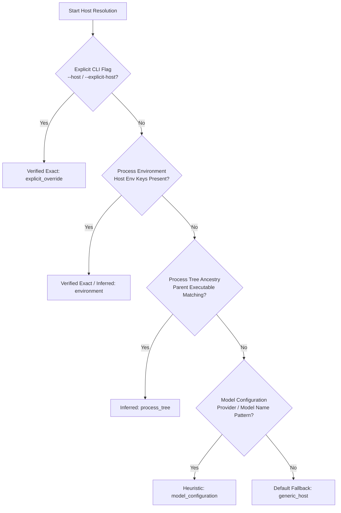
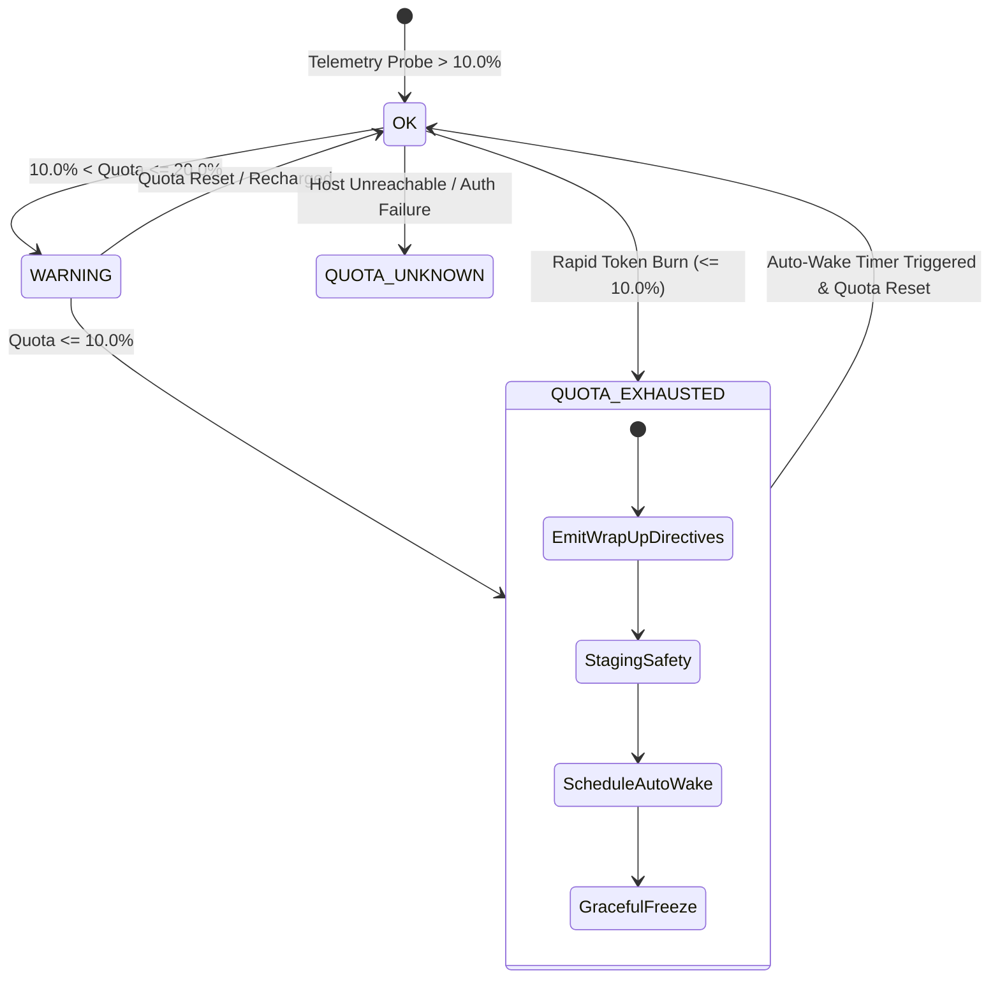

# Chapter 7: Host-Aware Quota Engine & Graceful Freeze

[← Previous: Chapter 6 — Lifecycle Hooks & Audio Engine](06-lifecycle-hooks-and-audio-engine.md) | [📖 Table of Contents](SUMMARY.md) | [Next: Chapter 8 — Verification & Socratic Gating →](08-verification-and-socratic-gating.md)

---

[](#diátaxis-documentation-matrix)
[](SUMMARY.md)
[](../../.olt/policy.json)
[](../../olt/scripts/src/telemetry/circuit-breaker-evaluator.ts)

The **Host-Aware Quota Engine** is OLT's autonomous resource-governance subsystem. Modern AI agent operations run across diverse execution environments—ranging from terminal CLI wrappers to IDE extensions and cloud orchestrators—each enforcing strict rate limits, context windows, and rolling quota ceilings. Without active host awareness, autonomous multi-agent swarms inevitably suffer from abrupt token exhaustion, torn state transitions, mid-task process termination, and uncommitted codebase corruption.

This chapter details the theoretical foundations, architectural mechanisms, multi-platform telemetry collectors, and fail-safe freeze protocols that enable OLT swarms to operate continuously with zero state corruption and zero task abandonment.

---

## 1. Multi-Platform Host Autodetection

Autonomous agents must be aware of their host environment without requiring manual user configuration. OLT standardizes runtime host detection across **four canonical platforms**:

| Canonical Host             | Platform Identifier | Runtime Environment Indicators                                                 | Typical Context & Rate Enforcements                                          |
| :------------------------- | :------------------ | :----------------------------------------------------------------------------- | :--------------------------------------------------------------------------- |
| **Google Antigravity**     | `antigravity`       | `ANTIGRAVITY_CLI`, `ANTIGRAVITY_AGENT_ID`, `GEMINI_CLI`, `ANTIGRAVITY_VERSION` | Sliding 2M token context, high-throughput tool calling, rolling model quota  |
| **Claude Code**            | `claude_code`       | `CLAUDE_CODE_VERSION`, `CLAUDE_IS_ACTIVE`, `ANTHROPIC_API_KEY`                 | 200k context window, strict per-minute input/output token ceilings (TPM/RPM) |
| **OpenAI Codex**           | `codex`             | `CODEX_VERSION`, `CODEX_CLI`, `OPENAI_API_KEY`                                 | Structured output token bounds, multi-tier TPM limits                        |
| **Cursor / Coding Agents** | `cursor`            | `CURSOR_VERSION`, `CURSOR_IS_ACTIVE`, `CURSOR_AGENT_ID`                        | Fast micro-agent invocations, editor IPC bounds, rolling monthly quota       |

### Detection Signal Hierarchy & Precedence

OLT evaluates host identity through a multi-tier fallback pipeline with strict confidence scoring:



1. **Explicit Override (`explicit_override`)**: Specified directly via `--host <name>` on the Harness CLI. Confidence: `verified_exact`.
2. **Environment Probing (`environment`)**: Inspection of ambient process environment variables (e.g., `process.env["ANTIGRAVITY_CLI"]`). Confidence: `verified_exact` or `inferred`.
3. **Process Tree Introspection (`process_tree`)**: Recursive inspection of PPID parent binaries up to PID 1. Confidence: `inferred`.
4. **Model Name Matching (`model_configuration`)**: Inference from active LLM identifier (e.g., `claude-3-7-sonnet` $\to$ `claude_code`, `gemini-2.5-pro` $\to$ `antigravity`). Confidence: `heuristic`.
5. **Interactive Fallback (`default_fallback`)**: Emits `[░░░░░░] Unmeasured (Generic Host)` when no ambient host signature matches.

---

## 2. Real-Time Token Telemetry & Cowan Budget Tracking

### Mathematical Model of Agent Cognitive Load (Cowan Budget)

Multi-agent coordination requires strict regulation of context window utilization to prevent attention degradation and lost-in-the-middle phenomena. OLT models agent working memory capacity using a generalized **Cowan Working Memory Budget Formulation**:

$$\Omega_{\text{effective}}(t) = \Omega_{\text{max}} - \left( \sum_{i=1}^{N} \tau_{\text{system}} + \tau_{\text{history}}(t) + \tau_{\text{tools}} + \tau_{\text{scratchpad}}(t) \right)$$

Where:

- $\Omega_{\text{max}}$ is the hard maximum context window (e.g., 200,000 tokens for Claude, 2,000,000 tokens for Antigravity/Gemini).
- $\tau_{\text{system}}$ is the invariant prompt and role specification overhead.
- $\tau_{\text{history}}(t)$ is the accumulated multi-turn message ledger at step $t$.
- $\tau_{\text{tools}}$ is the schema overhead of all exposed tool declarations.
- $\tau_{\text{scratchpad}}(t)$ is the active chain-of-thought and intermediate execution buffer.

The **Telemetry Normalization Engine** samples these dimensions at every command boundary (`task:claim`, `task:heartbeat`, `task:submit`, `run:exec`) and normalizes platform-specific responses into a unified telemetry report:

```typescript
export interface NormalizedQuotaMetric {
  readonly platformId: string;
  readonly modelName: string;
  readonly remainingPercentage: number;
  readonly usedTokens?: number;
  readonly totalTokens?: number;
  readonly resetTime?: string; // ISO 8601 Timestamp
  readonly sourceTier: "measured_exact" | "inferred" | "unmeasured";
}
```

---

## 3. The $\le 10.0\%$ Quota Circuit-Breaker Threshold

When autonomous agents consume resources rapidly, running out of quota mid-turn results in truncated file writes, broken syntax trees, and orphaned lock files. OLT enforces a hard **Circuit-Breaker Threshold**:

$$\text{Trigger Condition}: \min_{m \in M} \left( \text{Quota}_{\text{remaining}}(m) \right) \le 10.0\%$$

```
[████████████████████████░░░░░░] 80.0%  OK - Normal Execution
[████████████░░░░░░░░░░░░░░░░░░] 40.0%  OK - Telemetry Nominal
[████░░░░░░░░░░░░░░░░░░░░░░░░░░] 12.5%  WARNING - Low Quota Warning Emitted
[███░░░░░░░░░░░░░░░░░░░░░░░░░░░]  9.8%  CRITICAL CIRCUIT-BREAKER TRIPPED (<= 10.0%)
```

### Circuit Breaker State Transitions



When the circuit-breaker trips:

1. **Immediate Execution Freeze**: No new tasks may be claimed (`task:claim` is refused with `CIRCUIT_BREAKER_ACTIVE`).
2. **Wrap-Up Directive Dispatch**: All active child agents receive an urgent directive to wrap up their immediate atomic micro-step without launching new subprocesses.
3. **Forbid-Kill Invariant**: Active subagents are **never** abruptly killed with `SIGKILL` or `process.kill()`. Terminating mid-write corrupts JSON trees and working trees.

---

## 4. Zero-Kill Auto-Wake & Reflog Staging Safety

A primary vulnerability in autonomous swarms is the loss of in-flight work when quotas exhaust. OLT guarantees **Transactional Reflog Staging Safety**:

```text
Step 1: Quota Engine detects Quota <= 10.0%
Step 2: Harness notifies active Implementers: "Wrap up current micro-step immediately."
Step 3: Implementers complete atomic AST syntax validation.
Step 4: Harness executes safe transactional staging (git add -A && git commit -m "chore(freeze)...").
Step 5: Write capsule state snapshot to .olt/capsules/<run-id>/state.json and pause lease clocks.
Step 6: Arm non-blocking background auto-wake timer: schedule(DurationSeconds = T_wake - T_now).
Step 7: Enter quiescent idle loop (Zero CPU / Zero Token burn).
```

### Auto-Wake Scheduling & Double-Stall Backoff

To ensure the upstream provider has fully refreshed quota before awakening, OLT adds a safety buffer $\Delta t_{\text{buffer}} = 60\,\text{s}$:

$$t_{\text{wakeup}} = t_{\text{reset}} + \Delta t_{\text{buffer}}, \quad \Delta t_{\text{sleep}} = \max(t_{\text{wakeup}} - t_{\text{current}},\, 60)$$

#### Double-Stall Circuit-Breaker Re-Arming

If upon auto-wake awakening the probed quota remains $\le 10.0\%$ (e.g. rate limit window extended or concurrent tokens consumed), OLT prevents a **double-stall cascade** by incrementing the stall count $S \gets S + 1$ and applying exponential backoff:

$$\Delta t_{\text{backoff}}(S) = \min\left( \Delta t_{\text{base}} \cdot 2^{S-1} + \Delta t_{\text{jitter}},\, \Delta t_{\text{max}} \right)$$

Where $\Delta t_{\text{base}} = 300\,\text{s}$ (5 minutes), $\Delta t_{\text{jitter}} \in [0, 60]\,\text{s}$, and $\Delta t_{\text{max}} = 14{,}400\,\text{s}$ (4 hours). Lease clocks remain safely paused.

---

## 5. Graceful Freeze and Resumption Lifecycle

The table below contrasts naive agent termination against OLT's Graceful Freeze architecture:

| Failure Vector       | Naive Agent Architecture                                                           | OLT Host-Aware Quota Engine                                                             |
| :------------------- | :--------------------------------------------------------------------------------- | :-------------------------------------------------------------------------------------- |
| **Token Exhaustion** | Abrupt process termination (`SIGKILL`); half-written files left on disk.           | Orderly micro-step wrap-up, AST validation, and transactional git staging.              |
| **Task State**       | Task remains in `leased` state until lease expires; marked `failed` by supervisor. | Task state preserved in `state.json`; lease timer paused until resumption.              |
| **Process Hygiene**  | Orphaned background child processes continue consuming CPU and memory.             | Subprocess trees quiesced cleanly through standard POSIX signals (`SIGTERM`).           |
| **Resumption**       | Human must inspect git diffs, clean lock files, and manually re-dispatch tasks.    | Autonomous auto-wake timer triggers `run:status`, checks fresh quota, and resumes wave. |

### Code Inspection: Quota Evaluation Implementation

Below is the verified implementation pattern extracted from `olt/scripts/src/telemetry/circuit-breaker-evaluator.ts`:

```typescript
export function evaluateQuotaCircuitBreaker(
  report: UnifiedTelemetryReport,
  options: QuotaCircuitBreakerOptions = {},
): CircuitBreakerEvaluation {
  const threshold = options.thresholdPercentage ?? DEFAULT_QUOTA_THRESHOLD;
  const metrics = report.results.filter((r) => r.remainingPercentage !== null);

  if (metrics.length === 0) {
    return {
      status: "QUOTA_UNKNOWN_CIRCUIT_BROKEN",
      isTriggered: true,
      thresholdPercentage: threshold,
      lowestRemainingQuota: null,
      constrainedModels: [],
      wrapUpDirectives: [],
      autoWakeSchedule: null,
      summary: "Quota availability is unmeasured or unreachable.",
      evaluatedAt: new Date().toISOString(),
    };
  }

  const lowest = Math.min(...metrics.map((m) => m.remainingPercentage));
  const isTriggered = lowest <= threshold;

  if (!isTriggered) {
    return {
      status: "OK",
      isTriggered: false,
      thresholdPercentage: threshold,
      lowestRemainingQuota: lowest,
      constrainedModels: [],
      wrapUpDirectives: [],
      autoWakeSchedule: null,
      summary: `Nominal quota remaining: ${lowest.toFixed(1)}%`,
      evaluatedAt: new Date().toISOString(),
    };
  }

  const constrained = metrics
    .filter((m) => m.remainingPercentage <= threshold)
    .map((m) => ({
      platformId: m.platformId,
      modelName: m.modelName,
      remainingPercentage: m.remainingPercentage,
      resetTime: extractResetTime(m),
    }));

  const resetTime = constrained.find((c) => c.resetTime)?.resetTime;
  const targetWakeupIso = calculateTargetWakeup(resetTime, options.bufferSeconds ?? 60);

  return {
    status: "QUOTA_EXHAUSTED_CIRCUIT_BROKEN",
    isTriggered: true,
    thresholdPercentage: threshold,
    lowestRemainingQuota: lowest,
    constrainedModels: constrained,
    wrapUpDirectives: [
      {
        recipient: "all_active_agents",
        message: CRITICAL_WRAP_UP_MESSAGE,
        action: "idle",
        forbidKill: true,
        reason: `Quota (${lowest.toFixed(1)}%) dropped below threshold (${threshold}%).`,
      },
    ],
    autoWakeSchedule: {
      type: "one_shot_timer",
      durationSeconds: calculateDurationSeconds(targetWakeupIso),
      targetWakeupIso,
      prompt: AUTO_WAKE_PROMPT,
      timerCondition: "never",
      activeAgentsCount: options.activeAgentsCount ?? 0,
    },
    summary: `Critical quota circuit breaker triggered: ${lowest.toFixed(1)}% remaining.`,
    evaluatedAt: new Date().toISOString(),
  };
}
```

---

## 6. Practical Reference & Operational Commands

### Live Quota Telemetry Inspection

Check real-time host quota telemetry from the command line:

```bash
# Probe current host quota telemetry and circuit breaker status
bun olt/scripts/harness.ts doctor:verify --run .olt/capsules/<run-id>

# Check run status including quota telemetry badge
bun olt/scripts/harness.ts run:status --run .olt/capsules/<run-id>
```

### Quota Badge Glossary

- `[██████] 100.0%`: Full quota available.
- `[████░░] 66.7%`: Nominal quota level.
- `[██░░░░] 33.3%`: Moderate quota consumption.
- `[█░░░░░] 16.7%`: Warning zone; wrap up large tasks.
- `[░░░░░░] <=10.0%`: Circuit breaker tripped; swarm freezing.
- `[░░░░░░] Unmeasured`: Generic host without live rate limit headers.

---

[← Previous: Chapter 06: Lifecycle Hooks and Audio Engine](06-lifecycle-hooks-and-audio-engine.md) | [Table of Contents](SUMMARY.md) | [Next: Chapter 08: Verification and Socratic Gating →](08-verification-and-socratic-gating.md)
