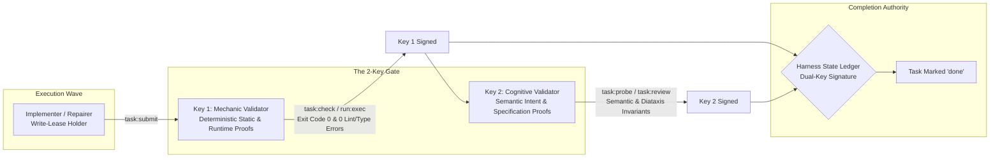
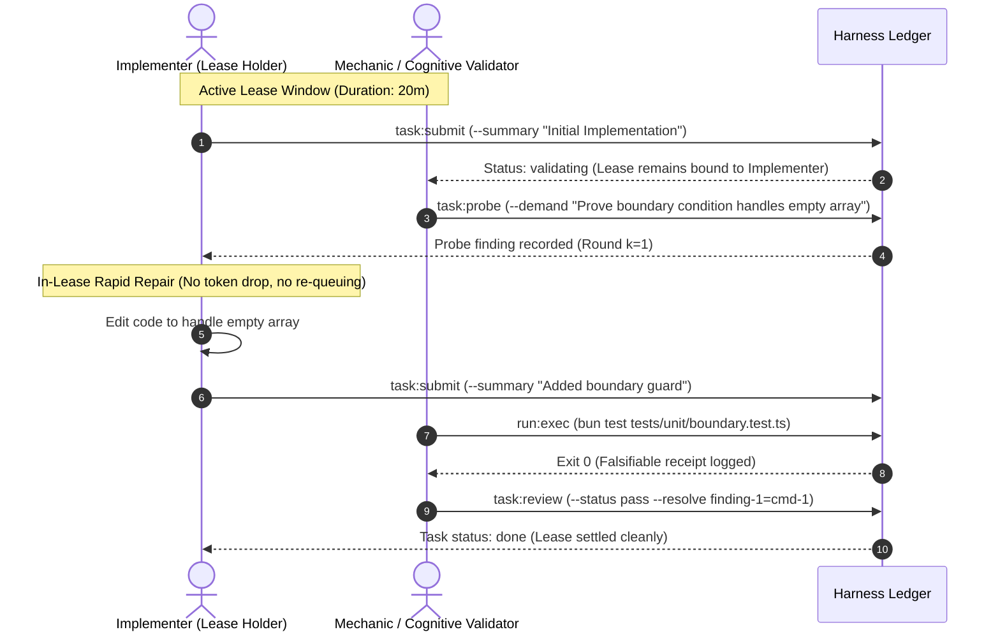
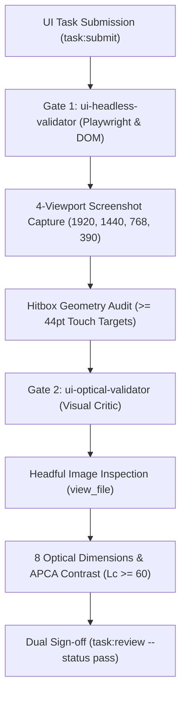

# Chapter 8: Verification & Socratic Gating

[← Previous: Chapter 7 — Host-Aware Quota Engine & Graceful Freeze](07-host-aware-quota-engine-and-graceful-freeze.md) | [📖 Table of Contents](SUMMARY.md) | [Next: Chapter 9 — Full CLI Command Reference →](09-full-cli-command-reference.md)

---

[](#diátaxis-documentation-matrix)
[](SUMMARY.md)
[](../../.olt/policy.json)
[](../../olt/scripts/src/validation/types.ts)

In autonomous software engineering, LLMs suffer from **self-grading bias** and **validation theatre**: an agent that writes code is cognitively anchored to its own implementation decisions and will consistently overlook its own edge-case omissions, unhandled errors, and specification drifts.

OLT eliminates self-grading through a mathematically grounded, dual-channel verification architecture termed **Socratic Gating**. This chapter details the operational mechanics of the **2-Key Validator Pairing**, the **1-Hop In-Lease Micro-Cycle**, the **Completeness Critic**, and **Read-Only Counterfactual Gate Probing**.

---

## 1. The 2-Key Pairings Architecture

Every task execution unit $T_i$ in OLT requires two distinct cryptographic keys for completion sign-off, held by independent agents with disjoint cognitive scopes:



### Channel Separation & Scope Boundaries

| Dimension              | Key 1: Independent Mechanic Validator                                                        | Key 2: Independent Cognitive Validator                                             |
| :--------------------- | :------------------------------------------------------------------------------------------- | :--------------------------------------------------------------------------------- |
| **Agent Role**         | `mechanic-validator`                                                                         | `validator` / `sub-validator`                                                      |
| **Evaluation Scope**   | Static types (`tsc --noEmit`), AST linting, test suite execution, file boundary confinement. | Semantic fidelity to user prompt, Diátaxis compliance, completeness of edge cases. |
| **Permitted Commands** | `task:validate-start`, `task:check`, `run:exec`, `doctor:verify`, `task:review`              | `task:brief`, `task:probe`, `task:reject`, `task:review`, `finding:get`            |
| **Write Permission**   | Strictly read-only; editing codebase files triggers immediate `ROLE_CONFINEMENT_VIOLATION`.  | Strictly read-only; modifying code files triggers immediate defect logging.        |
| **Evidence Standard**  | Monitored shell receipts (`exit_code: 0`, stdout hash, duration).                            | Falsifiable requirement-to-anchor mapping and structured finding records.          |

---

## 2. The 1-Hop In-Lease Micro-Cycle ($k \le 5$)

Traditional multi-agent systems suffer catastrophic latency overheads when an implementation fails validation: dropping the task lease, re-queuing the task in the global backlog, and waiting for an orchestrator to re-dispatch a new implementer.

OLT solves this through **1-Hop In-Lease Micro-Cycles**:



### In-Lease Micro-Cycle Invariants

1. **Lease Continuity**: When a validator issues a probe demand (`task:probe --demand "<condition>"`), the task remains in `validating` status under the **same** lease without releasing or dropping the token.
2. **Bounded Iteration Count ($k \le 5$)**: If an implementer fails within $k_{\text{max}} = 5$ rounds, the task escalates to `escalated` for re-assignment via `task:assign-repairer`.
3. **Anti-Ritual Probe Mandate**: The validator cannot issue generic prose rejections; every demand must be a structured record with `finding_id`, `requirement_id`, and a verifiable counterfactual check.

---

## 3. Dual UI Validator Separation

For all tasks modifying frontend UI components, layouts, or stylesheets, OLT enforces a hardwired **Dual UI Validator Separation Pipeline** where automated Playwright tests are strictly **ONLY HALF OF THE JOB** (`AUTOMATED_TESTS_ARE_HALF_THE_JOB`):



| Dimension               | Gate 1: `ui-headless-validator`                                  | Gate 2: `ui-optical-validator`                                        |
| :---------------------- | :--------------------------------------------------------------- | :-------------------------------------------------------------------- |
| **Command Privileges**  | Shell execution enabled (`run:exec`, `task:check`)               | Zero command execution (`can_execute_shell: false`, 0 commands)       |
| **Primary Mandate**     | Playwright runs, DOM element checks, multi-viewport screenshots  | Headful visual inspection of screenshot images, optical rhythm        |
| **Quantitative Floors** | Touch hitboxes $\ge 44\text{pt}$ ($\ge 48\text{pt}$ cockpit HUD) | APCA lightness contrast $\text{Lc} \ge 60$ (body), $\text{Lc} \ge 45$ |

---

## 4. The Completeness Critic & Requirement Mapping

While task validators focus on individual task write scopes, the **Completeness Critic** operates at the whole-repository boundary before run completion:

```bash
# Completeness critic reviews full run diff against all acceptance criteria
bun olt/scripts/harness.ts critic:review \
  --run .olt/capsules/<run-id> \
  --proofs-file .olt/capsules/<run-id>/proofs.json \
  --decision approve
```

If any requirement in `state.json` lacks an evidenced proof receipt or has unaddressed findings, approval is refused (`CRITIC_REQUIREMENT_UNPROVEN`).

---

## 5. Falsifiable Evidence Collection & Counterfactual Gate Proofs

Validation is valid **if and only if** backed by an immutable shell execution receipt captured by the harness via `run:exec`:

```bash
# Execute a test gate under monitored harness instrumentation
bun olt/scripts/harness.ts run:exec \
  --run .olt/capsules/<run-id> \
  --task task-1 \
  -- bun test tests/unit/auth.test.ts
```

### Read-Only Counterfactual Gate Probing Recipes

Read-only validators must verify that gates fail when expected without modifying codebase files:

1. **Negative Option Invocations**: Run commands with conflicting or invalid flags via `run:exec` to assert deterministic exit code 3 (`INVALID_ARGUMENT`):
   ```bash
   bun olt/scripts/harness.ts run:exec --run .olt/capsules/<run-id> --task task-1 -- bun harness.ts plan:compile --max-parallel -5
   ```
2. **Malformed Stdin Ingestion**: Pipe malformed payloads to verify parser rejection without disk mutation:
   ```bash
   bun olt/scripts/harness.ts run:exec --run .olt/capsules/<run-id> --task task-1 -- sh -c 'echo "{bad_json" | bun harness.ts smart-task:ingest --stdin'
   ```
3. **Subshell Environment Overrides**: Probe fallback behaviors by temporarily overriding environment variables in subshell invocations:
   ```bash
   bun olt/scripts/harness.ts run:exec --run .olt/capsules/<run-id> --task task-1 -- sh -c 'ANTIGRAVITY_AGENT_ID="" bun harness.ts doctor:verify'
   ```

---

## 6. How-To: Step-by-Step Validation Workflow

```bash
# Step 1: Start validation session
bun olt/scripts/harness.ts task:validate-start --run .olt/capsules/<run-id> --task <task-id> --validator <agent-id>

# Step 2: Execute fast static typechecks and AST linting
bun olt/scripts/harness.ts task:check --run .olt/capsules/<run-id> --task <task-id>

# Step 3: Run monitored test gate
bun olt/scripts/harness.ts run:exec --run .olt/capsules/<run-id> --task <task-id> -- bun test <target-test>

# Step 4: Issue probe demand (if clarification needed)
bun olt/scripts/harness.ts task:probe --run .olt/capsules/<run-id> --task <task-id> --agent <agent-id> --demand "..."

# Step 5: File final approval with evidence resolution
bun olt/scripts/harness.ts task:review --run .olt/capsules/<run-id> --task <task-id> --agent <agent-id> --token <lease-token> --status pass --resolve probe-finding-1=<cmd-receipt-id>
```

---

[← Previous: Chapter 7 — Host-Aware Quota Engine & Graceful Freeze](07-host-aware-quota-engine-and-graceful-freeze.md) | [📖 Table of Contents](SUMMARY.md) | [Next: Chapter 9 — Full CLI Command Reference →](09-full-cli-command-reference.md)
