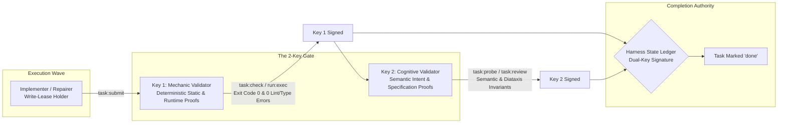
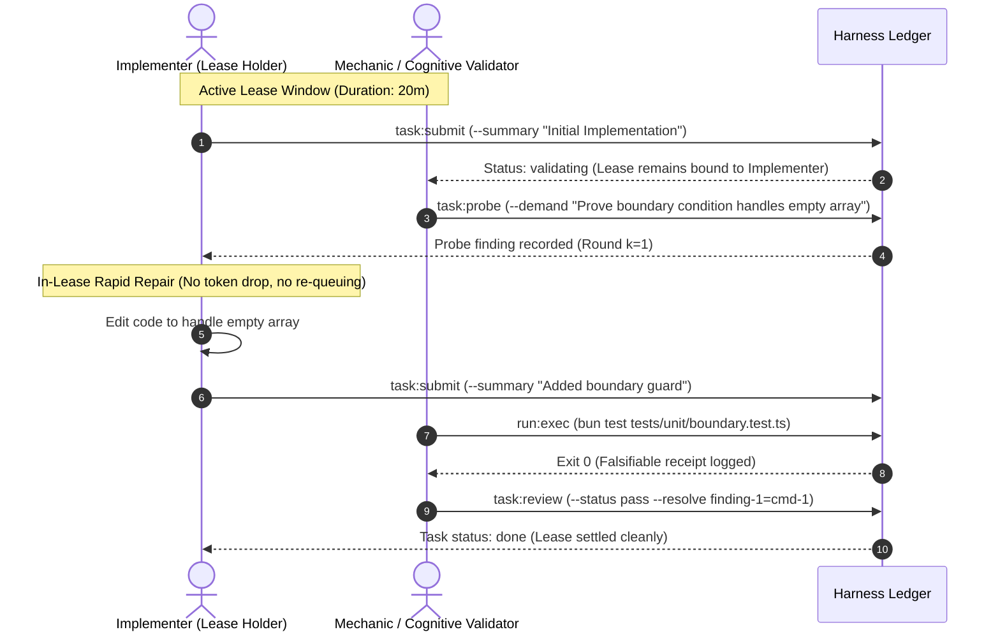
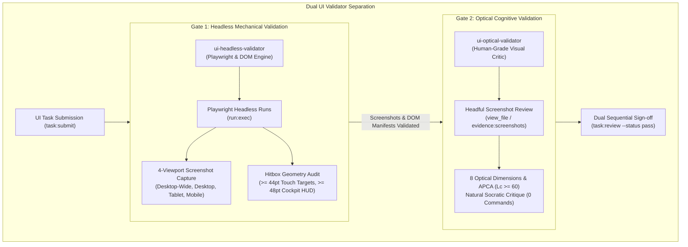

[← Previous: Chapter 07: Host-Aware Quota Engine and Graceful Freeze](07-host-aware-quota-engine-and-graceful-freeze.md) | [Table of Contents](SUMMARY.md) | [Next: Chapter 09: Full CLI Command Reference →](09-full-cli-command-reference.md)

---

# Chapter 08: Verification and Socratic Gating

In autonomous software engineering, LLMs suffer from **self-grading bias** and **validation theatre**: an agent that writes code is cognitively anchored to its own implementation decisions and will consistently overlook its own edge-case omissions, unhandled errors, and specification drifts.

OLT eliminates self-grading through a mathematically grounded, dual-channel verification architecture termed **Socratic Gating**. This chapter details the operational mechanics of the **2-Key Validator Pairing**, the **1-Hop In-Lease Micro-Cycle**, the **Completeness Critic**, and **Falsifiable Counterfactual Evidence Collection**.

---

## 1. The 2-Key Pairings Architecture

Every task execution unit $T_i$ in OLT requires two distinct cryptographic keys for completion sign-off, held by independent agents with disjoint cognitive scopes:



### Channel Separation & Scope Boundaries

| Dimension              | Key 1: Independent Mechanic Validator                                                        | Key 2: Independent Cognitive Validator                                             |
| :--------------------- | :------------------------------------------------------------------------------------------- | :--------------------------------------------------------------------------------- |
| **Agent Role**         | `mechanic-validator`                                                                         | `validator` / `sub-validator`                                                      |
| **Evaluation Scope**   | Static types (`tsc --noEmit`), AST linting, test suite execution, file boundary confinement. | Semantic fidelity to user prompt, Diátaxis compliance, completeness of edge cases. |
| **Permitted Commands** | `task:validate-start`, `task:check`, `run:exec`, `doctor:verify`, `task:review`              | `task:brief`, `task:probe`, `task:reject`, `task:review`, `finding:get`            |
| **Write Permission**   | Strictly read-only; editing codebase files triggers immediate `ROLE_CONFINEMENT_VIOLATION`.  | Strictly read-only; modifying code files triggers immediate defect logging.        |
| **Evidence Standard**  | Monitored shell receipts (`exit_code: 0`, stdout hash, duration).                            | Falsifiable requirement-to-anchor mapping and structured finding records.          |

---

## 2. The 1-Hop In-Lease Micro-Cycle ($k \le 5$)

Traditional multi-agent systems suffer catastrophic latency overheads when an implementation fails validation: dropping the task lease, re-queuing the task in the global backlog, and waiting for an orchestrator to re-dispatch a new implementer.

OLT solves this through **1-Hop In-Lease Micro-Cycles**:



### In-Lease Micro-Cycle Invariants

1. **Lease Continuity**: When a validator issues a probe demand (`task:probe --demand "<condition>"`), the task remains in `validating` status under the **same** lease without releasing or dropping the token.
2. **Bounded Iteration Count ($k \le 5$)**:

   $$\text{Round Count: } k \in [1, 5]$$

   If an implementer fails to satisfy validator demands within $k_{\text{max}} = 5$ rounds, the harness automatically escalates the task to `escalated` and invokes `task:reject`, transferring repair responsibility to an assigned repair specialist via `task:assign-repairer`.

3. **Anti-Ritual Probe Mandate**: The validator cannot issue generic prose rejections. Every demand must be a structured record containing `finding_id`, `requirement_id`, and a verifiable counterfactual check.

---

## 3. Dual UI Validator Separation (Headless Playwright & Optical Visual Review)

For all tasks modifying frontend UI components, layouts, or stylesheets, OLT enforces a hardwired **Dual UI Validator Separation Pipeline**:



### The Two Specialized UI Validator Roles

| Dimension               | Gate 1: `ui-headless-validator`                                                                           | Gate 2: `ui-optical-validator`                                                                           |
| :---------------------- | :-------------------------------------------------------------------------------------------------------- | :------------------------------------------------------------------------------------------------------- |
| **Validator Category**  | Mechanical UI Validator (Tier 3)                                                                          | Cognitive UI Validator (Tier 3)                                                                          |
| **Command Privileges**  | Shell execution enabled (`run:exec`, `task:check`)                                                        | Zero command execution (`can_execute_shell: false`, 0 commands)                                          |
| **Primary Mandate**     | Automated Playwright runs, DOM element tree verification, multi-viewport screenshot captures              | Headful visual inspection of screenshot images, human-grade Socratic critique, optical rhythm            |
| **Viewport Matrix**     | Desktop-Wide (1920x1080), Desktop (1440x900), Tablet (768x1024), Mobile (390x844)                         | All 4 viewports inspected visually via `view_file`                                                       |
| **Quantitative Floors** | Touch target hitboxes $\ge 44\text{pt}$ ($\ge 48\text{pt}$ for cockpit HUD), screenshot bytes $\ge 1024$  | APCA lightness contrast $\text{Lc} \ge 60$ (body), $\text{Lc} \ge 45$ (large titles), WCAG 4.5:1 floor   |
| **Strict Prohibition**  | Approving UI tasks without capturing full screenshot image artifacts (`AUTOMATED_TESTS_ARE_HALF_THE_JOB`) | Shell commands, source edits, approving without opening screenshot files (`SUPERFICIAL_UI_APPROVAL_BAN`) |

---

## 4. The Completeness Critic & Requirement Mapping

While task validators focus on individual task write scopes, the **Completeness Critic** operates at the whole-repository boundary before run completion.

```
+-----------------------------------------------------------------------------------+
|                        COMPLETENESS CRITIC RECONCILIATION                         |
+-----------------------------------------------------------------------------------+
| Requirement ID      | Assigned Artifact           | Falsifiable Evidence Receipt |
| :------------------ | :-------------------------- | :--------------------------- |
| req-1-auth-engine   | src/auth/engine.ts          | cmd-receipt-89f41 (Exit 0)   |
| req-2-quota-freeze  | src/telemetry/breaker.ts    | cmd-receipt-89f42 (Exit 0)   |
| req-3-cli-reference | docs/book/09-cli-ref.md     | cmd-receipt-89f43 (Exit 0)   |
+-----------------------------------------------------------------------------------+
```

### The Critic Review Protocol

Before `run:complete` can be executed, the Completeness Critic audits the complete repository diff against the original requirement ledger:

```bash
# Completeness critic reviews full run diff against all acceptance criteria
bun olt/scripts/harness.ts critic:review \
  --run .olt/capsules/<run-id> \
  --proofs-file .olt/capsules/<run-id>/proofs.json \
  --decision approve
```

If any requirement in `state.json` lacks an evidenced proof receipt or has unaddressed findings, the harness rejects approval:

```
Error (CRITIC_REQUIREMENT_UNPROVEN): Requirement 'req-4-subsystems-ch7-10' has no recorded proof receipt.
Approval refused. Run remains in active phase.
```

---

## 4. Falsifiable Evidence Collection (`run:exec`) & Counterfactual Gate Proofs

### The Principle of Monitored Execution

In OLT, agents are forbidden from validating code by asserting subjective confidence (e.g., _"I have verified the code and it works"_). Validation is valid **if and only if** it is backed by an immutable shell execution receipt captured by the harness via `run:exec`.

```bash
# Execute a test gate under monitored harness instrumentation
bun olt/scripts/harness.ts run:exec \
  --run .olt/capsules/<run-id> \
  --task task-4-subsystems-ch7-10 \
  -- bun test tests/unit/docs/book-system.test.ts
```

### The Monitored Receipt Schema

`run:exec` wraps the child process, measures standard streams, and records an unalterable receipt into `.olt/capsules/<run-id>/evidence/`:

```json
{
  "command_id": "cmd-89f42a1b",
  "task_id": "task-4-subsystems-ch7-10",
  "actor": "mechanic-validator-1",
  "argv": ["bun", "test", "tests/unit/docs/book-system.test.ts"],
  "exit_code": 0,
  "stdout_sha256": "4a7d1ed414474e4033ac29ccb8653d9b",
  "stderr_sha256": "e3b0c44298fc1c149afbf4c8996fb924",
  "duration_ms": 342,
  "timestamp": "2026-08-31T12:50:00.000Z",
  "evidence_class": "harness_observed"
}
```

### Counterfactual Gate Proofs (Adversarial Probing)

To prove that a test gate is not a **tautology** (a test that passes regardless of whether the code works), validators must execute **Counterfactual Probing**:

1. **Positive Assertion**: The gate passes when the implementation is present.
2. **Negative Counterfactual**: The gate fails when the required behavior is commented out or an invalid input is supplied.

If a gate command passes on both valid and invalid codebases, the mechanic validator marks the gate as **non-discriminating** (`DISCRIMINATION_FAILURE`) and rejects the submission.

---

## 5. How-To: Step-by-Step Validation Workflow

Follow this procedure when assigned as an independent validator on a task.

### Step 1: Start Validation & Inspect Submission

```bash
# Initialize validation session
bun olt/scripts/harness.ts task:validate-start \
  --run .olt/capsules/<run-id> \
  --task <task-id> \
  --validator <agent-id>
```

### Step 2: Execute Deterministic Static & Type Verification

```bash
# Execute fast typecheck and lint checks
bun olt/scripts/harness.ts task:check \
  --run .olt/capsules/<run-id> \
  --task <task-id>
```

### Step 3: Execute Monitored Test Gates

```bash
# Run unit tests through monitored harness execution
bun olt/scripts/harness.ts run:exec \
  --run .olt/capsules/<run-id> \
  --task <task-id> \
  -- bun test tests/unit/my-subsystem.test.ts
```

### Step 4: Issue a Probe Demand (If Clarification Needed)

```bash
# Demand proof of negative boundary handling without failing the task lease
bun olt/scripts/harness.ts task:probe \
  --run .olt/capsules/<run-id> \
  --task <task-id> \
  --agent <agent-id> \
  --demand "Demonstrate handling of malformed UTF-8 inputs with explicit test assertion"
```

### Step 5: File Final Approval with Evidence Resolution

```bash
# Record final approval linked to the execution command receipt
bun olt/scripts/harness.ts task:review \
  --run .olt/capsules/<run-id> \
  --task <task-id> \
  --agent <agent-id> \
  --token <lease-token> \
  --status pass \
  --resolve probe-finding-1=cmd-89f42a1b
```

---

[← Previous: Chapter 07: Host-Aware Quota Engine and Graceful Freeze](07-host-aware-quota-engine-and-graceful-freeze.md) | [Table of Contents](SUMMARY.md) | [Next: Chapter 09: Full CLI Command Reference →](09-full-cli-command-reference.md)
