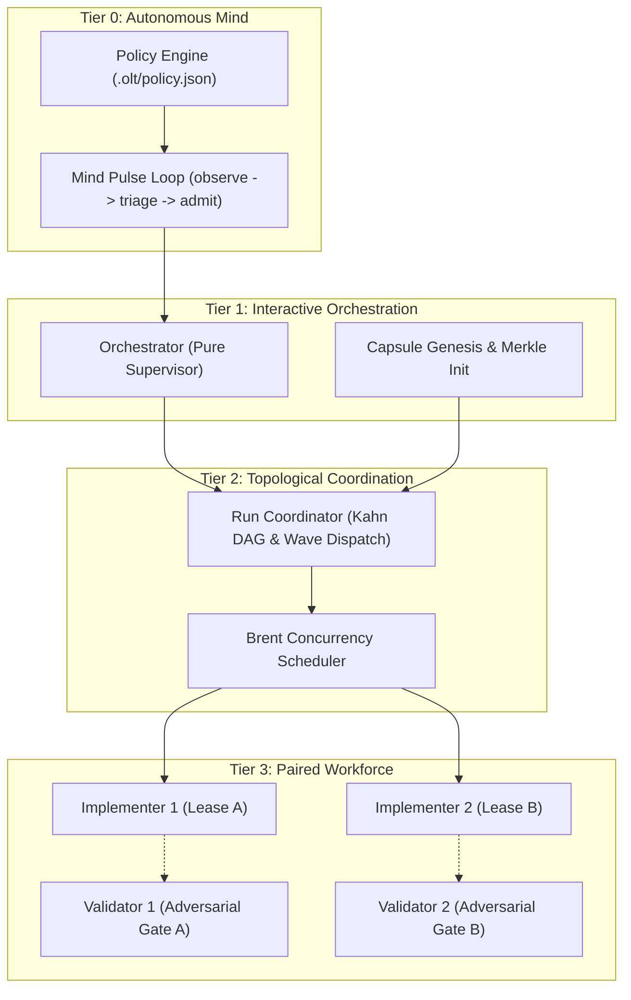
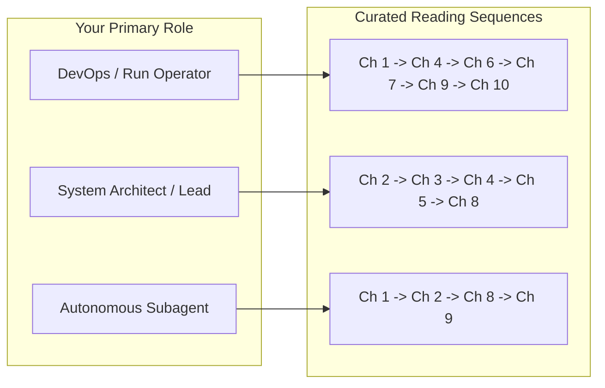

# The OLT Book: Orchestrating Long Tasks & Autonomous Systems

[← Previous: Repository Documentation Hub](../README.md) | [📖 Table of Contents](SUMMARY.md) | [Next: Chapter 1 — Quickstart & Getting Started →](01-quickstart-and-getting-started.md)

---

[](#diátaxis-documentation-matrix)
[](SUMMARY.md)
[](../../tsconfig.json)
[](../../package.json)
[](../../bunfig.toml)
[](../../AGENTS.md)

Welcome to **The OLT Book**, the authoritative engineering guide and educational reference for the **Orchestrating Long Tasks (OLT)** multi-agent system.

OLT is a production-grade, zero-dependency orchestration harness built natively on TypeScript and Bun. It coordinates autonomous multi-agent swarms across complex, long-running software engineering tasks with mathematical concurrency guarantees, cryptographic state capsules, strict supervisor purity, and adversarial verification.

---

## 1. The Core Problem: Why Orchestrating Long Tasks is Hard

Modern LLM-based autonomous agents excel at localized, single-turn code generation. However, when deployed on long-horizon, multi-hour engineering initiatives, standard agentic architectures suffer from catastrophic failure modes:

```
+---------------------------------------------------------------------------------------------------------+
|                                    LONG-TASK AGENT FAILURE MODES                                        |
+---------------------------------------------------------------------------------------------------------+
|                                                                                                         |
|  1. Context Decay & Hallucination                                                                       |
|     * Context windows saturate with tool outputs, error dumps, and speculative chit-chat.               |
|     * The agent forgets early architectural constraints and hallucinates nonexistent tools or APIs.     |
|                                                                                                         |
|  2. Serialization Bottlenecks                                                                           |
|     * Naive agents execute parallelizable tasks in sequential series, causing massive latency.           |
|     * Unbounded task execution times violate SLA budgets and exhaust host rate limits.                  |
|                                                                                                         |
|  3. Uncoordinated State Mutation & Race Conditions                                                      |
|     * Parallel subagents overwrite each other's files without boundary enforcement.                     |
|     * Merge conflicts, phantom edits, and broken builds corrupt the workspace repository.               |
|                                                                                                         |
|  4. Epistemic Bias & Self-Grading Blindspots                                                            |
|     * The same agent that authors code evaluates its own correctness, passing broken logic.             |
|     * Mocks, hollow test assertions, and suppressed linter errors mask underlying defects.              |
|                                                                                                         |
+---------------------------------------------------------------------------------------------------------+
```

OLT eliminates these systemic failure modes through a rigorous mathematical and architectural foundation:



---

## 2. Diátaxis Documentation Matrix

The OLT Book is organized according to the **Diátaxis Documentation Framework**, systematically categorizing knowledge into four distinct quadrants based on user orientation and cognitive intent:

| Quadrant | Focus & Orientation | Target User Intent | Chapters in This Book |
| :--- | :--- | :--- | :--- |
| **Tutorials** | Learning-oriented | *"Teach me how to use OLT from scratch with hands-on guided steps."* | [Chapter 1: Quickstart & Getting Started](01-quickstart-and-getting-started.md) |
| **Explanations** | Understanding-oriented | *"Help me understand why OLT works this way, its theory and mathematics."* | [Chapter 2: Core Philosophy & Brent Parallelism](02-core-philosophy-and-brent-parallelism.md)<br>[Chapter 3: Tier 0 Governance & Autonomous Mind](03-tier-0-governance-and-autonomous-mind.md)<br>[Chapter 4: Toolchain Discovery & Policy Engine](04-toolchain-discovery-and-policy-engine.md)<br>[Chapter 5: Mandatory Companion Auditors](05-mandatory-companion-auditors.md)<br>[Chapter 6: Lifecycle Hooks & Audio Engine](06-lifecycle-hooks-and-audio-engine.md)<br>[Chapter 7: Host-Aware Quota Engine & Graceful Freeze](07-host-aware-quota-engine-and-graceful-freeze.md) |
| **How-To Guides** | Task-oriented | *"Show me the exact steps to solve a specific problem or execute a workflow."* | [Chapter 1: Quickstart & Getting Started](01-quickstart-and-getting-started.md)<br>[Chapter 3: Tier 0 Governance & Autonomous Mind](03-tier-0-governance-and-autonomous-mind.md)<br>[Chapter 8: Verification & Socratic Gating](08-verification-and-socratic-gating.md)<br>[Chapter 10: Troubleshooting & Anti-Blunder Compendium](10-troubleshooting-and-anti-blunder-compendium.md) |
| **Reference** | Information-oriented | *"Give me complete, precise specifications, schemas, flags, and error codes."* | [Chapter 9: Full CLI Command Reference](09-full-cli-command-reference.md)<br>[Chapter 10: Troubleshooting & Anti-Blunder Compendium](10-troubleshooting-and-anti-blunder-compendium.md) |

---

## 3. The 10-Chapter Master Map

The table below outlines the full structure of the OLT Book. Each chapter is designed to be self-contained yet tightly integrated into the broader orchestration lifecycle:

```text
+---------------------------------------------------------------------------------------------------------+
|                                    10-CHAPTER MASTER CURRICULUM                                         |
+---------------------------------------------------------------------------------------------------------+
|                                                                                                         |
|  PART I: FOUNDATIONS & GETTING STARTED                                                                  |
|  ====================================                                                                   |
|  [01] Quickstart & Getting Started          --> 1-Shot install, harness doctor, first end-to-end run   |
|  [02] Core Philosophy & Brent Concurrency   --> Zero-assumption invariants, Brent's Theorem, DAG math   |
|  [03] Tier 0 Governance & Autonomous Mind   --> Infinite pulse loop, Mode A/B triage, 6 admission gates |
|                                                                                                         |
|  PART II: DEEP SUBSYSTEM ARCHITECTURE                                                                   |
|  ====================================                                                                   |
|  [04] Toolchain Discovery & Policy Engine   --> Zero-config tool auto-detection, policy drift checks    |
|  [05] Mandatory Companion Auditors          --> Mind Auditor & Skill Auditor continuous surveillance    |
|  [06] Lifecycle Hooks & Audio Engine        --> 34 lifecycle events, shell, webhook & sound feedback    |
|                                                                                                         |
|  PART III: OPERATIONAL RIGOR & REFERENCE                                                                |
|  =======================================                                                                |
|  [07] Host-Aware Quota Engine & Freeze      --> Live token tracking, <10% rate-limit graceful freeze    |
|  [08] Verification & Socratic Gating        --> Adversarial validation, APCA contrast, 2-key certification|
|  [09] Full CLI Command Reference            --> Complete documentation of all harness commands & flags  |
|  [10] Troubleshooting & Anti-Blunders       --> Diagnostic playbook, defect triage, root-cause repair   |
|                                                                                                         |
+---------------------------------------------------------------------------------------------------------+
```

### Detailed Chapter Directory

1. [**Chapter 1: Quickstart & Getting Started**](01-quickstart-and-getting-started.md) *(Tutorial / How-To)*
   - 1-Shot global installation (`npx skills add onurseckin/skills --skill olt` or `bunx skills add ...`).
   - Diagnostic validation with `bun harness.ts doctor` and CLI initialization.
   - Complete walkthrough of a task lifecycle: prompt ingestion, preplanning, DAG compilation, wave dispatch, paired execution, validation, and completion certification.
   - Inspecting runtime capsules, event ledgers (`events.jsonl`), and token telemetry.

2. [**Chapter 2: Core Philosophy & Brent Parallelism**](02-core-philosophy-and-brent-parallelism.md) *(Explanation)*
   - The Zero-Assumption philosophy and the Hard Zeros (0 ungrounded assumptions, 0 any types, 0 suppressions, 0 unleased edits).
   - Concurrency mathematics: Brent's Theorem ($P = \lceil W/S \rceil$), Amdahl's Law, and Gustafson-Barsis bounds.
   - Anti-serialization invariants (A4 false-barrier prevention) and disjoint write scope independence.
   - Topological sorting via Kahn's algorithm and Tarjan's Strongly Connected Components (SCC) cycle breaking.

3. [**Chapter 3: Tier 0 Governance & Autonomous Mind**](03-tier-0-governance-and-autonomous-mind.md) *(Explanation / How-To)*
   - Tier 0 Autonomous Mind daemon loop (`mind:pulse`).
   - Mode A (Creative Product Owner / Proactive Expansion) vs. Mode B (Direct Triage & Bug Ingestion).
   - Central repository authority (`.olt/policy.json`) and repository charter discovery.
   - The 6 Admission Gates: deduplication, granularity, falsifiability, scope feasibility, invariant safety, and acyclicity.
   - Memory persistence (`.olt/memory.json`) and generational rotation.

4. [**Chapter 4: Toolchain Discovery & Policy Engine**](04-toolchain-discovery-and-policy-engine.md) *(Explanation / How-To)*
   - Zero-config automatic toolchain detection across package managers, linters, formatters, and compilers.
   - Granular policy enforcement via `.olt/policy.json` (autonomy levels, tool permissions, budget ceilings).
   - Policy drift detection (`policy:check`), interactive initialization (`policy:init`), and security compartmentalization.

5. [**Chapter 5: Mandatory Companion Auditors**](05-mandatory-companion-auditors.md) *(Explanation / Reference)*
   - Dual continuous surveillance auditors: `mind-auditor` and `skill-auditor`.
   - 7 forensic heuristics for defect detection (stagnation, hallucinated tools, boundary leaks, phantom commits).
   - Defect logging and root cause allocation in `.olt/defects.jsonl`.

6. [**Chapter 6: Lifecycle Hooks & Audio Engine**](06-lifecycle-hooks-and-audio-engine.md) *(Explanation / How-To)*
   - Exhaustive architecture of all **34 discrete lifecycle events** (from `capsule-init` to `run-completed`).
   - Multi-channel dispatch: shell commands, HTTP webhooks, logging handlers, and custom integrations.
   - The Real-Time Audio Synthesis Engine: procedural sound design, frequency-modulated audio feedback, and accessibility cues.

7. [**Chapter 7: Host-Aware Quota Engine & Graceful Freeze**](07-host-aware-quota-engine-and-graceful-freeze.md) *(Explanation / How-To)*
   - Real-time token consumption tracking across Anthropic, OpenAI, and custom host platforms.
   - The `< 10% Rate-Limit Graceful Freeze` circuit breaker: state serialization, lock quiescence, and auto-resumption.
   - Cowan token density budgeting and context leak prevention.

8. [**Chapter 8: Verification & Socratic Gating**](08-verification-and-socratic-gating.md) *(How-To / Reference)*
   - Adversarial validation philosophy: separate sessions, independent scrutiny, and zero trust.
   - 4-way evidence classification (harness-observed, host-reported, derived, agent-reported).
   - Visual APCA perceptual contrast verification and PNG binary IHDR parsing.
   - Socratic gating, finding records (`finding:record`), and 2-key cryptographically signed run completion.

9. [**Chapter 9: Full CLI Command Reference**](09-full-cli-command-reference.md) *(Reference)*
   - Complete, authoritative reference for all harness CLI commands across domains: `task`, `plan`, `agent`, `mind`, `gate`, `finding`, `policy`, `queue`, `doctor`, and `run`.
   - Comprehensive table of argument flags, required inputs, JSON output schemas, and deterministic exit codes (0, 3, 4, 70).

10. [**Chapter 10: Troubleshooting & Anti-Blunder Compendium**](10-troubleshooting-and-anti-blunder-compendium.md) *(How-To / Reference)*
    - Comprehensive diagnosis and remediation playbook for common operational failures.
    - Resolving lock contention (`LOCK_TIMEOUT`), role confinement violations, lease expirations, and broken DAGs.
    - Anti-blunder compendium: real-world post-mortems and preventative invariants.

---

## 4. Tailored Reading Paths

Depending on your role and operational goals, we recommend the following curated reading paths through this book:



### 🛠️ Path A: The Run Operator
**Audience:** Platform engineers, DevOps specialists, and developers running multi-agent tasks on local or CI environments.
1. [Chapter 1: Quickstart & Getting Started](01-quickstart-and-getting-started.md) — Set up your harness and execute your first run.
2. [Chapter 4: Toolchain Discovery & Policy Engine](04-toolchain-discovery-and-policy-engine.md) — Configure repo boundaries and tool execution rules.
3. [Chapter 6: Lifecycle Hooks & Audio Engine](06-lifecycle-hooks-and-audio-engine.md) — Set up audio chimes, desktop alerts, and webhooks.
4. [Chapter 7: Host-Aware Quota Engine & Graceful Freeze](07-host-aware-quota-engine-and-graceful-freeze.md) — Manage token limits and monitor quota consumption.
5. [Chapter 9: Full CLI Command Reference](09-full-cli-command-reference.md) — Use the command line harness effectively.
6. [Chapter 10: Troubleshooting & Anti-Blunder Compendium](10-troubleshooting-and-anti-blunder-compendium.md) — Diagnose and resolve runtime issues.

### 📐 Path B: The System Architect
**Audience:** Software architects, AI safety researchers, and systems engineers designing multi-agent workflows and governance topologies.
1. [Chapter 2: Core Philosophy & Brent Parallelism](02-core-philosophy-and-brent-parallelism.md) — Concurrency mathematics, Kahn DAGs, and Tarjan SCC.
2. [Chapter 3: Tier 0 Governance & Autonomous Mind](03-tier-0-governance-and-autonomous-mind.md) — Continuous backlog management, Mode A/B, and 6 admission gates.
3. [Chapter 4: Toolchain Discovery & Policy Engine](04-toolchain-discovery-and-policy-engine.md) — Policy models, sandboxing, and drift protection.
4. [Chapter 5: Mandatory Companion Auditors](05-mandatory-companion-auditors.md) — Continuous forensic oversight and defect attribution.
5. [Chapter 8: Verification & Socratic Gating](08-verification-and-socratic-gating.md) — Adversarial validation, cryptographic gates, and evidence hierarchy.

### 🤖 Path C: The Autonomous Agent
**Audience:** LLM agent personas (Orchestrators, Coordinators, Implementers, Validators) operating within OLT.
1. [Chapter 1: Quickstart & Getting Started](01-quickstart-and-getting-started.md) — Harness execution protocols and task lifecycle.
2. [Chapter 2: Core Philosophy & Brent Parallelism](02-core-philosophy-and-brent-parallelism.md) — Disjoint write scopes, lease invariants, and zero-assumption execution.
3. [Chapter 8: Verification & Socratic Gating](08-verification-and-socratic-gating.md) — Submitting falsifiable evidence, adversarial review, and finding records.
4. [Chapter 9: Full CLI Command Reference](09-full-cli-command-reference.md) — Exact command syntax for `task:claim`, `task:heartbeat`, `task:submit`, and `finding:record`.

---

## 5. Architectural Invariants: The Seven Tenets

Every component, script, and documentation page within OLT adheres to seven foundational tenets:

1. **Zero-Assumption Exploration**: Never guess repository state, tool locations, or test commands. Query the harness directly.
2. **Supervisor Purity**: Superiors (Orchestrators and Coordinators) coordinate and delegate; they never write application code or edit implementation files directly.
3. **Disjoint Write Scope Isolation**: Every code modification must occur under an active, leased write scope. Parallel tasks must have strictly non-overlapping write sets.
4. **Brent Concurrency Optimization**: Concurrency width $P = \lceil W/S \rceil$ is maximized automatically while preventing false synchronization barriers (A4 invariant).
5. **Adversarial Validation Separation**: An agent may never validate its own implementation. Validators run in isolated subagent sessions with read-only scopes.
6. **Immutable Merkle Provenance**: Every state mutation, event, and finding is appended to a SHA-256 Merkle chain in `events.jsonl`.
7. **Host-Aware Quota Safety**: Rate limits and token consumption are continuously tracked, triggering automatic state persistence and graceful freezes before threshold breaches occur.

---

[← Previous: Repository Documentation Hub](../README.md) | [📖 Table of Contents](SUMMARY.md) | [Next: Chapter 1 — Quickstart & Getting Started →](01-quickstart-and-getting-started.md)
