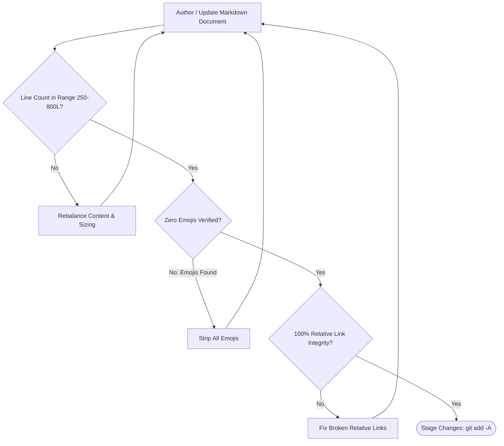

# OLT Documentation Engineering Charter & Authoring Standards

---

[Previous: Master Documentation Hub](README.md) | [Documentation Portal](index.md) | [All Chapters Index](architecture/index.md) | [Next: Quickstart Tutorial](reference/quickstart.md)

---

## 1. Executive Charter & Architectural Standards

Welcome to the authoritative documentation engineering charter for the **OLT (Orchestrating Long Tasks)** documentation ecosystem.

This charter synthesizes the **Open Agent Skills Standard (`agentskills.io`)**, the **Diátaxis Documentation Framework**, and **Stripe-Grade Developer Experience Principles** into a binding, extensible standard for authoring technical documentation across `docs/olt/`.

```text
+--------------------------------------------------------------------------------------------------+
│                             DOCUMENTATION ECOSYSTEM FOUNDATIONS                                  │
+--------------------------------------------------------------------------------------------------+
│                                                                                                  │
│   ┌───────────────────────────┐         ┌───────────────────────────┐                            │
│   │ Diátaxis Documentation    │  ───►   │ Dual-Hub Architecture     │                            │
│   │ Taxonomy (Procida)        │         │ Architecture vs Reference │                            │
│   └─────────────┬─────────────┘         └─────────────┬─────────────┘                            │
│                 │                                     │                                          │
│                 ▼                                     ▼                                          │
│   ┌───────────────────────────┐         ┌───────────────────────────┐                            │
│   │ Open Agent Skills Spec    │  ───►   │ 4 Hard Zeros & Sizing     │                            │
│   │ Progressive Disclosure    │         │ Sizing Envelope 250-800L  │                            │
│   └───────────────────────────┘         └───────────────────────────┘                            │
│                                                                                                  │
+--------------------------------------------------------------------------------------------------+
```

---

## 2. Theoretical Pedagogy & Standards Alignment

The OLT documentation ecosystem is grounded in two industry-standard technical frameworks:

### A. The Diátaxis Documentation Framework

Created by Daniele Procida, Diátaxis partitions technical documentation across two fundamental cognitive axes: Learning vs. Applying and Practical Action vs. Theoretical Cognition.

```text
+--------------------------------------------------------------------------------------------------+
│                            THE DIÁTAXIS DOCUMENTATION MATRIX IN OLT                              │
+----------------------------------------------+---------------------------------------------------+
│               PRACTICAL ACTION               │               THEORETICAL COGNITION               │
+----------------------------------------------+---------------------------------------------------+
│  LEARNING-ORIENTED:                          │  UNDERSTANDING-ORIENTED (EXPLANATION):            │
│  [ TUTORIALS & GETTING STARTED ]             │  [ ARCHITECTURE BOOK ]                            │
│  * Quickstart single-task walk-through       │  * Brent Work-Span Concurrency Math               │
│  * First Mind autonomous pulse run           │  * Tarjan SCC Cycle Breaking Proofs               │
│  * Step-by-step onboarding recipes           │  * SHA-256 Merkle Chaining & POSIX flock Locking  │
│                                              │  * APCA Perceptual Contrast & PNG Entropy Theory  │
│  Location: docs/olt/reference/quickstart     │  Location: docs/olt/architecture/                 │
+----------------------------------------------+---------------------------------------------------+
│  PROBLEM-ORIENTED:                           │  INFORMATION-ORIENTED:                            │
│  [ HOW-TO GUIDES & OPERATOR PLAYBOOKS ]      │  [ HARNESS REFERENCE & CATALOGS ]                 │
│  * Health diagnostics & preflight checks     │  * Complete 15-Domain Harness CLI Dictionary      │
│  * Crash recovery & torn-tail auto-healing   │  * Draft 2020-12 State & Capsule JSON Schemas     │
│  * Socratic review pushbacks & repair waves  │  * HarnessError Codes & Empirical Blunders        │
│                                              │                                                   │
│  Location: docs/olt/reference/health-*       │  Location: docs/olt/architecture/ & reference/    │
+----------------------------------------------+---------------------------------------------------+
```

### B. The Open Agent Skills Standard (`agentskills.io`) & Progressive Disclosure

OLT adheres strictly to the modular Agent Skills specification:

1. **Discovery (Metadata)**: At startup, agents inspect top-level `SKILL.md` frontmatter without paying the token cost of the full documentation repository ($< 500$ tokens).
2. **Activation (Procedural Instructions)**: When invoking the skill, agents read task-specific procedural rules into context ($< 4{,}000$ tokens).
3. **Progressive Execution (On-Demand References)**: Agents query deep architecture chapters (`docs/olt/architecture/`) and reference guides (`docs/olt/reference/`) on-demand. When executing CLI commands, only the stdout brief enters the LLM context—the underlying source code does not, preserving context budget ($< 150{,}000$ Cowan tokens).

```text
+-----------------------------------------------------------------------------------------+
│                           PROGRESSIVE DISCLOSURE CONTEXT PIPELINE                       │
+-----------------------------------------------------------------------------------------+
│  [Discovery: SKILL.md Frontmatter] ---> Minimal Startup Footprint (< 500 tokens)        │
│                 │                                                                       │
│                 v                                                                       │
│  [Activation: Procedural Instructions] ---> Loaded on User Trigger (< 4,000 tokens)     │
│                 │                                                                       │
│                 v                                                                       │
│  [Execution: On-Demand Architecture/Ref] ---> Queried Progressively (< 150,000 tokens)  │
+-----------------------------------------------------------------------------------------+
```

---

## 3. Information Weight & Document Sizing Invariants

To eliminate both superficial stubs and overwhelming monoliths:

```text
+--------------------------------------------------------------------------------------------------+
│                             DOCUMENTATION SIZING ENVELOPE BOUNDS                                 │
+-------------------+-------------------+----------------------------------------------------------+
| Classification    | Line Range        | Policy & Enforcement Rule                                |
+-------------------+-------------------+----------------------------------------------------------+
| Shallow Stub      | < 100 lines       | STRICTLY FORBIDDEN. Merge into cohesive thematic topics. |
| Optimal Range     | 250 - 800 lines   | TARGET ENVELOPE. Deep technical prose + rich diagrams.   |
| Upper Bound       | 800 - 1,200 lines | ACCEPTABLE for exhaustive CLI / schema catalogs.         |
| Monolith Dump     | > 1,200 lines     | STRICTLY FORBIDDEN. Decompose into modular subtopics.    |
+-------------------+-------------------+----------------------------------------------------------+
```

### Document Decomposition Criteria

When a document exceeds 800 lines, writers must evaluate whether it should be decomposed into modular subtopics:

- Group related algorithms, mathematical proofs, and data structures into dedicated subtopic files.
- Provide a clear chapter index (`index.md`) that introduces the domain, summarizes child topics, and provides bidirectional navigation links.
- Avoid splitting tightly coupled concepts into arbitrary, shallow files; every resulting document must meet the $> 250$ line depth requirement.

---

## 4. Conceptual Depth vs. Raw Code Dumps

Documentation must explain architecture, mechanics, algorithms, and invariants—not dump unannotated code.

- **STRICTLY PROHIBITED**:
  - Unannotated raw source file dumps.
  - Copy-pasting hundreds of lines of implementation code.
  - Vague conversational summaries ("This file handles planning").
  - Emoji usage across titles, headings, navigation bars, and prose.
- **MANDATORY**:
  - Conceptual pseudo-code illustrating algorithms (e.g. Kahn's sorting, Tarjan SCC cycle breaking, Sugiyama coordinate assignment).
  - Clean TypeScript interface and type contracts accompanied by extensive commentary.
  - Formal LaTeX mathematical formulations ($P = \lceil W/S \rceil$, $H(X) = -\sum P(x_i) \log_2 P(x_i)$, $L_c$).
  - Clickable code symbol links for direct source inspection.

---

## 5. Visual Architecture & Diagram Standards

Every technical document across `docs/olt/` must contain at least one visual diagram:

1. **High-Density ASCII Topologies**: Illustrate subsystem boundaries, memory layouts, or network pipelines using clean box-drawing characters (`+`, `-`, `|`, `*`).
2. **Mermaid State Machines & Flowcharts**: Visualize state transitions, lease acquisition lifecycles, and verification pipelines.
3. **Binary Layout Charts**: Depict byte offsets and headers (e.g. PNG 32-byte IHDR headers, Merkle event chaining).

---

## 6. Universal Clean 4-Way Navigation Mesh

Every markdown document must contain exactly ONE clean 4-way navigation bar at the Top (immediately beneath the main H1 header) and exactly ONE at the Bottom (Footer), with ZERO emojis.

Exemplar Navigation Mesh:

```markdown
[Previous: Master Documentation Hub](README.md) | [Chapter Index](architecture/index.md) | [All Chapters Index](architecture/index.md) | [Next: Quickstart](reference/quickstart.md)
```

### Specifications:

- **Previous**: Points to the previous sequential document in the book (crossing chapter boundaries seamlessly).
- **Chapter Index**: Direct relative link to the current chapter's `index.md`.
- **All Chapters Index**: Direct relative link to the master architecture index (`index.md` or `../index.md`).
- **Next**: Points to the next sequential document in the book.
- **Link Integrity**: 100% of relative links must resolve to existing on-disk targets.
- **Zero Emojis**: Emojis are strictly banned from navigation bars, headings, tables, and prose.

---

## 7. Multi-Round Cognitive Review & Reflog Safety

1. **Adversarial Validation**: Every document must be audited against the 4 Hard Zeros ($Z_{\text{hallucination}}=0$, $Z_{\text{mutation}}=0$, $Z_{\text{scope}}=0$, $Z_{\text{assumption}}=0$).
2. **Socratic Reflexive Probing**: Reviewers must verify that all architectural claims are supported by formal mechanics or empirical evidence.
3. **Up to 5 Review Rounds**: Writers address reviewer pushbacks through monotonic repair cycles ($k \le 5$).
4. **Reflog Safety Staging**: Immediately execute `git add -A` upon completing every documentation milestone.



---

[Previous: Master Documentation Hub](README.md) | [Documentation Portal](index.md) | [All Chapters Index](architecture/index.md) | [Next: Quickstart Tutorial](reference/quickstart.md)

---
