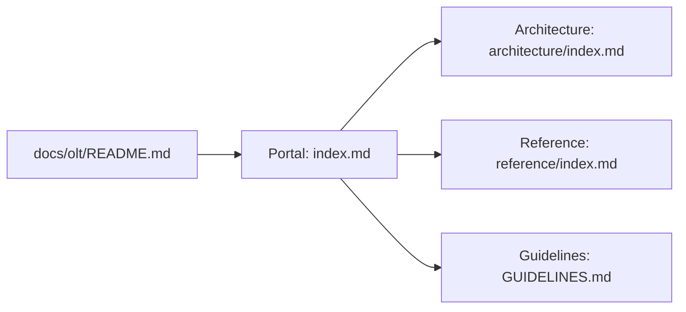

# Orchestrating Long Tasks (OLT) Master Documentation Hub

---

[Previous: Repository Root](../../README.md) | [Documentation Portal](index.md) | [All Chapters Index](architecture/index.md) | [Next: Documentation Guidelines](GUIDELINES.md)

---

## 1. Executive Summary

Welcome to the **Orchestrating Long Tasks (OLT)** Master Documentation Hub.

OLT is an autonomous multi-agent engineering framework engineered to coordinate long-running, complex software development tasks across specialized agent tiers with mathematical predictability, cryptographic durability, and zero human supervision drag.

```text
+--------------------------------------------------------------------------------------------------+
|                                 OLT DOCUMENTATION ECOSYSTEM TOPOLOGY                             |
+--------------------------------------------------------------------------------------------------+
|                                                                                                  |
|   +--------------------------------------------------------------------------------------+       |
|   |                              OLT DOCUMENTATION PORTAL                                |       |
|   |                                (docs/olt/index.md)                                   |       |
|   +------------------------------------------+-------------------------------------------+       |
|                                              |                                                   |
|                     +------------------------+------------------------+                          |
|                     v                                                 v                          |
|   +----------------------------------+              +----------------------------------+         |
|   | ARCHITECTURE BOOK                |              | REFERENCE MANUALS HUB            |         |
|   | (docs/olt/architecture/)         |              | (docs/olt/reference/)            |         |
|   | 17 Exhaustive Chapters:          |              | Practical Operator Guides:       |         |
|   | * 01. Foundations & Invariants   |              | * [Quickstart Tutorial](reference/quickstart.md)
|   | * 02. Four-Tier Workforce        |              | * [Health and Status](reference/health-and-status.md)
|   | * 03. Mind Product Owner         |              | * [Reference Index](reference/index.md)
|   | * 04. Preplanning Factory        |              | * [Authoring Guide](reference/GUIDE.md)
|   | * 05. Concurrency & SLA          |              +----------------------------------+         |
|   | * 06. Topological Scheduler      |                                                           |
|   | * 07. Distributed Leasing        |                                                           |
|   | * 08. Adversarial Validation     |                                                           |
|   | * 09. Falsifiable Evidence       |                                                           |
|   | * 10. Durability & Recovery      |                                                           |
|   | * 11. Worktree & Honesty         |                                                           |
|   | * 12. Flock Mailboxes & TUI      |                                                           |
|   | * 13. Policy & RBAC Engine       |                                                           |
|   | * 14. Harness CLI Engine         |                                                           |
|   | * 15. State Schemas & Ledgers    |                                                           |
|   | * 16. Error Catalog & Blunders   |                                                           |
|   | * 17. Verification Engines       |                                                           |
|   +----------------------------------+                                                           |
|                                                                                                  |
+--------------------------------------------------------------------------------------------------+
```

---

## 2. Dual-Hub Documentation Architecture

The OLT documentation ecosystem is structured into two complementary hubs adhering strictly to the **Diátaxis Documentation Framework**:

### A. The Architecture Book (`docs/olt/architecture/`)

The Architecture Book provides 17 exhaustive chapters delivering deep theoretical explanations, mathematical proofs, scheduling algorithms, and internal engine mechanics. It is designed for engineers seeking comprehensive understanding of autonomous orchestration:

- **Part I: Mental Models & Foundations (Chapters 01-03)**: Zero-assumption philosophy, 4-tier agent hierarchy, and autonomous product ownership.
- **Part II: Planning & Scheduling Algorithms (Chapters 04-07)**: Preplanning factory, Brent work-span concurrency math, topological DAG compilation, and distributed leasing.
- **Part III: Quality Assurance & State Durability (Chapters 08-13)**: Adversarial validation pairing, binary image inspection, Merkle hash chains, worktree isolation, and fail-closed RBAC.
- **Part IV: Command Engines & Catalogs (Chapters 14-17)**: CLI command architecture, state machine schemas, error catalogs, and AST verification provers.

### B. The Reference Manuals Hub (`docs/olt/reference/`)

The Reference Manuals Hub provides concise, action-oriented, copy-pasteable documentation for human operators and autonomous runtime agents:

- **[Operator Quickstart Tutorial](reference/quickstart.md)**: Hands-on walkthrough for initializing runs, compiling plans, claiming tasks, and executing parallel waves.
- **[Health Diagnostics & Status Runbook](reference/health-and-status.md)**: 10-domain diagnostic sweep, preflight validation checks, and automatic defect remediation.
- **[Reference Hub Master Index](reference/index.md)**: Central directory mapping all practical playbooks and CLI capability references.
- **[Reference Authoring Guide](reference/GUIDE.md)**: Structural rules for authoring high-density reference materials.

---

## 3. Documentation Standards & Invariants

All documentation files across `docs/olt/` enforce strict engineering invariants codified in [GUIDELINES.md](GUIDELINES.md):

1. **Diátaxis Pedagogy**: Strict separation between theoretical explanations and practical action manuals.
2. **Progressive Disclosure**: Three-tier context pipeline: Discovery ($< 500$ tokens), Activation ($< 4{,}000$ tokens), and On-Demand Reference ($< 150{,}000$ tokens).
3. **Document Sizing Boundaries**: Every document is maintained within 250-800 lines for architectural chapters, and 100-250 lines for indexes and guides.
4. **Universal Clean Navigation**: Clean 4-way navigation bars at the top and bottom of each file with zero emojis.
5. **Deterministic Link Resolution**: 100% of relative markdown links point to existing on-disk files.



---

## 4. Master Reading Paths & Entry Points

- **[Documentation Ecosystem Portal (index.md)](index.md)**: Comprehensive portal linking all components of the documentation ecosystem.
- **[Authoring Standards & Charter (GUIDELINES.md)](GUIDELINES.md)**: Engineering charter, Diátaxis framing, and sizing envelope rules.
- **[Architecture Book Master Index (architecture/index.md)](architecture/index.md)**: Complete 17-chapter theoretical and algorithmic reference.
- **[Reference Hub Master Index (reference/index.md)](reference/index.md)**: Practical operator guides, quickstarts, and diagnostic playbooks.
- **[Quickstart & Onboarding Tutorial (reference/quickstart.md)](reference/quickstart.md)**: Step-by-step tutorial for initializing tasks and executing waves.
- **[Health & Diagnostics Reference (reference/health-and-status.md)](reference/health-and-status.md)**: Diagnostic sweep and auto-healing procedures.

---

[Previous: Repository Root](../../README.md) | [Documentation Portal](index.md) | [All Chapters Index](architecture/index.md) | [Next: Documentation Guidelines](GUIDELINES.md)

---
