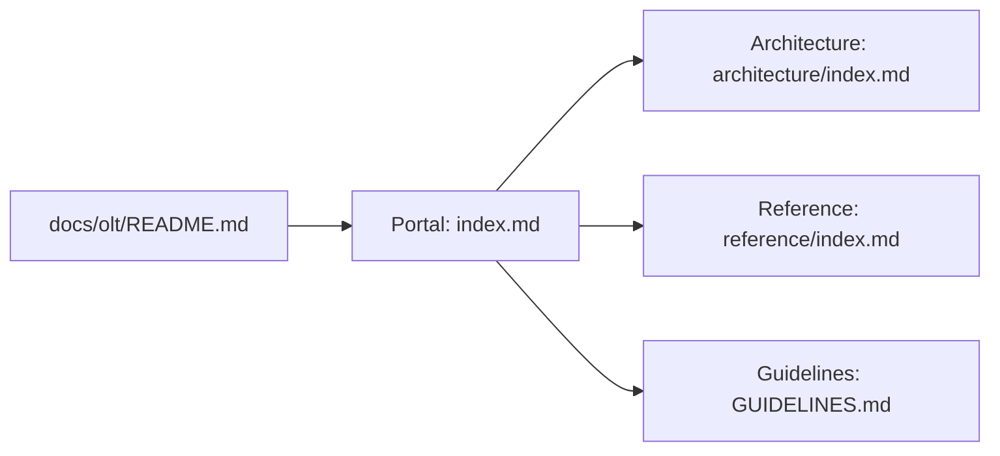

# Orchestrating Long Tasks (OLT) Master Documentation Hub

---

[Previous: Repository Root](../../README.md) | [Documentation Portal](index.md) | [All Chapters Index](architecture/index.md) | [Next: Documentation Guidelines](GUIDELINES.md)

---

## 1. Executive Summary

Welcome to the **Orchestrating Long Tasks (OLT)** Master Documentation Hub.

OLT is an autonomous multi-agent engineering framework engineered to coordinate long-running, complex software development tasks across specialized agent tiers with mathematical predictability, cryptographic durability, and zero human supervision drag.

```text
+--------------------------------------------------------------------------------------------------+
│                                 OLT DOCUMENTATION ECOSYSTEM TOPOLOGY                             │
+--------------------------------------------------------------------------------------------------+
│                                                                                                  │
│   ┌──────────────────────────────────────────────────────────────────────────────────────┐       │
│   │                              OLT DOCUMENTATION PORTAL                                │       │
│   │                                (docs/olt/index.md)                                   │       │
│   └──────────────────────────────────────────┬───────────────────────────────────────────┘       │
│                                              │                                                   │
│                     ┌────────────────────────┴────────────────────────┐                          │
│                     ▼                                                 ▼                          │
│   ┌──────────────────────────────────┐              ┌──────────────────────────────────┐         │
│   │ ARCHITECTURE BOOK                │              │ REFERENCE MANUALS HUB            │         │
│   │ (docs/olt/architecture/)         │              │ (docs/olt/reference/)            │         │
│   │ 17 Exhaustive Chapters:          │              │ Practical Operator Guides:       │         │
│   │ • 01. Foundations & Invariants   │              │ • [Quickstart Tutorial](reference/quickstart.md)
│   │ • 02. Four-Tier Workforce        │              │ • [Health and Status](reference/health-and-status.md)
│   │ • 03. Mind Product Owner         │              │ • [Reference Index](reference/index.md)
│   │ • 04. Preplanning Factory        │              │ • [Authoring Guide](reference/GUIDE.md)
│   │ • 05. Concurrency & SLA          │              └──────────────────────────────────┘         │
│   │ • 06. Topological Scheduler      │                                                           │
│   │ • 07. Distributed Leasing        │                                                           │
│   │ • 08. Adversarial Validation     │                                                           │
│   │ • 09. Falsifiable Evidence       │                                                           │
│   │ • 10. Durability & Recovery      │                                                           │
│   │ • 11. Worktree & Honesty         │                                                           │
│   │ • 12. Flock Mailboxes & TUI      │                                                           │
│   │ • 13. Policy & RBAC Engine       │                                                           │
│   │ • 14. Harness CLI Engine         │                                                           │
│   │ • 15. State Schemas & Ledgers    │                                                           │
│   │ • 16. Error Catalog & Blunders   │                                                           │
│   │ • 17. Verification Engines       │                                                           │
│   └──────────────────────────────────┘                                                           │
│                                                                                                  │
+--------------------------------------------------------------------------------------------------+
```

---

## 2. Documentation Structure & Standards

The OLT documentation repository strictly enforces the authoring standards codified in [GUIDELINES.md](GUIDELINES.md):

- **Diátaxis Pedagogy**: Strict separation between theoretical explanations ([Architecture Book](architecture/index.md)) and practical action manuals ([Reference Hub](reference/index.md)).
- **Progressive Disclosure**: Frontmatter discovery ($< 500$ tokens), activation instructions ($< 4{,}000$ tokens), and on-demand reference queries ($< 150{,}000$ tokens).
- **Document Sizing Boundaries**: Every document is maintained within the optimal 250–800 line sizing envelope for deep architecture chapters, and 100–250 lines for indexes and reference guides.
- **Universal Clean Navigation**: Clean 4-way navigation bars at the top and bottom of each file with zero emojis.



---

## 3. Quick Links & Reading Paths

- **[Authoring Standards & Charter (GUIDELINES.md)](GUIDELINES.md)**: Engineering charter, Diátaxis framing, and sizing envelope rules.
- **[Architecture Book Master Index (architecture/index.md)](architecture/index.md)**: Complete 17-chapter theoretical and algorithmic reference.
- **[Reference Hub Master Index (reference/index.md)](reference/index.md)**: Practical operator guides, quickstarts, and diagnostic playbooks.
- **[Quickstart & Onboarding Tutorial (reference/quickstart.md)](reference/quickstart.md)**: Step-by-step tutorial for initializing tasks and executing waves.
- **[Health & Diagnostics Reference (reference/health-and-status.md)](reference/health-and-status.md)**: Diagnostic sweep and auto-healing procedures.

---

[Previous: Repository Root](../../README.md) | [Documentation Portal](index.md) | [All Chapters Index](architecture/index.md) | [Next: Documentation Guidelines](GUIDELINES.md)

---
