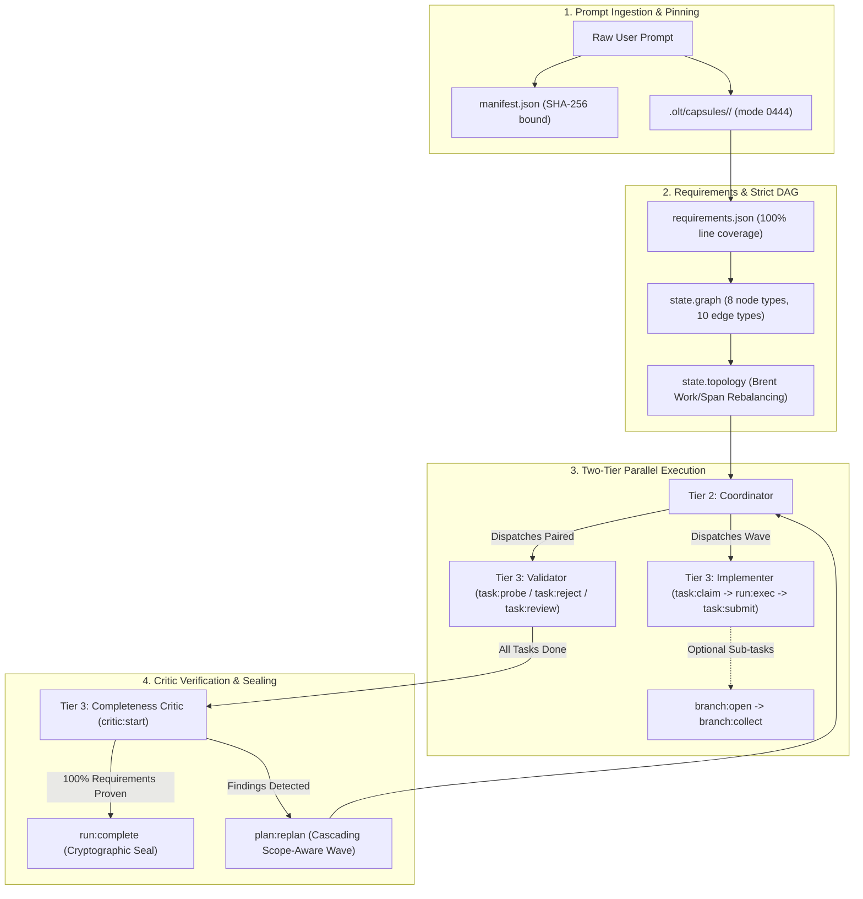

# Orchestrating Long Tasks — Master Documentation & Architectural Manual

Welcome to the definitive architectural manual and developer documentation for the **`olt`** autonomous agent skill.

This manual provides a rigorous, deeply technical foundation for deterministic multi-agent software engineering. It explains how autonomous AI systems can safely, deterministically, and reliably orchestrate long-running, multi-phase coding tasks using a **Zero-JSON Colon Command Architecture**, a **Two-Tier Workforce Hierarchy**, and a **Strict Dependency Graph Engine**.

---

## 🏛️ Diátaxis Architectural Framework Matrix

To ensure clarity and usability across different developer needs, this documentation suite is organized into the four distinct quadrants of the **Diátaxis Documentation Framework**:

```text
┌─────────────────────────────────────────────────────────────────────────────┐
│                    THE DIÁTAXIS DOCUMENTATION FRAMEWORK                     │
├──────────────────────────────────────────────┬──────────────────────────────┤
│               PRACTICAL GOALS                │      THEORETICAL CONCEPTS    │
├──────────────────────────────────────────────┼──────────────────────────────┤
│  LEARNING-ORIENTED:                          │  UNDERSTANDING-ORIENTED:     │
│  [ TUTORIALS ]                               │  [ ARCHITECTURE ]            │
│  • Getting Started with OLT                  │  • Mental Model & Foundations│
│  • End-to-End Hands-on Walkthrough           │  • Brent Work/Span Scaling   │
│  • Autonomous Workforce Operations           │  • POSIX flock Storage Model │
│  • Dynamic Sub-Branching                     │  • Adversarial Theory        │
│                                              │                              │
│  👉 Explore: docs/olt/tutorials/             │  👉 Explore: docs/olt/architecture/│
├──────────────────────────────────────────────┼──────────────────────────────┤
│  PROBLEM-ORIENTED:                           │  INFORMATION-ORIENTED:       │
│  [ HOW-TO GUIDES ]                           │  [ REFERENCE ]               │
│  • Dynamic Plan Revision & Replanning        │  • Harness CLI Dictionary    │
│  • Handling Adversarial Probe Demands        │  • Formal State Schemas      │
│  • Crash Forensics & Lease Recovery          │  • Error & Blunder Catalog   │
│  • Building Domain-Specific Validators       │  • 10 Role Contracts Matrix  │
│  • AST Linter & Rule Enforcement             │  • Deterministic Engines     │
│                                              │                              │
│  👉 Explore: docs/olt/how-to/                │  👉 Explore: docs/olt/reference/  │
└──────────────────────────────────────────────┴──────────────────────────────┘
```

---

## 🧭 Diátaxis Quadrants & Deep Documentation Map

### 1. 📚 [Reference Manuals (`docs/olt/reference/`)](./reference/)

The authoritative information specifications:

- **[Harness CLI Command Dictionary](./reference/harness-cli.md)**: Exhaustive flag tables, types, defaults, stdin handling, and exit statuses for every CLI command.
- **[State Schemas & Data Contracts](./reference/state-schemas.md)**: Formal JSON schemas and exemplars for `manifest.json`, `events.jsonl`, `state.json`, `requirements.json`, and command receipts.
- **[Error Codes & Blunder Catalog](./reference/error-codes.md)**: Complete catalog of exit statuses (0, 3, 4, 70), error classes, and empirical failure countermeasures.
- **[Role Contracts & Authority Matrix](./reference/role-contracts.md)**: Formal permissions, invariant prohibitions (`must_not`), command access, and packet limits for all 10 agent roles.
- **[Deterministic Verification Engines](./reference/verification-engines.md)**: Specifications for `task:check` typechecker, the 10 AST static lint rules, and `gate:prove` falsifiability engine.

### 2. 🎓 [Tutorials (`docs/olt/tutorials/`)](./tutorials/)

Step-by-step lessons for mastering autonomous agent orchestration:

- **[Getting Started with OLT](./tutorials/)**: Setup, capsule initialization, and environment verification.
- **[End-to-End Orchestration Tutorial](./10-tutorial-and-cli/01-end-to-end-tutorial.md)**: A complete walkthrough from prompt capture to terminal sealing.
- **[Autonomous Lifecycle Operations](./tutorials/)**: Multi-phase wave dispatching and continuous supervisor pulse loops.

### 3. 🛠️ [How-To Guides (`docs/olt/how-to/`)](./how-to/)

Targeted operational recipes for developers and system operators:

- **[How to Execute Dynamic Scope-Aware Replanning](./how-to/)**: Partitioning late-stage defects into clean repair waves.
- **[How to Answer Adversarial Probe Demands](./how-to/)**: Resolving validator demands with monitored command receipts.
- **[How to Recover From Crashes & Expired Leases](./how-to/)**: Stale lease reclamation and torn event log forensics.
- **[How to Create Custom Cognitive Validators](./how-to/)**: Authoring domain-specific checklists and validation probes.

### 4. 🧠 [Architecture & Explanations (`docs/olt/architecture/`)](./architecture/)

Deep conceptual and theoretical foundations:

- **[Mental Model & Why Long Tasks Fail](./01-foundations/01-why-long-tasks-fail.md)**: Root causes of context decay, hallucination, and state drift.
- **[Storage Model & Kernel flock Atomicity](./01-foundations/02-capsule-and-storage-model.md)**: Append-only hash chains, `events.jsonl`, projected `state.json`, and advisory locking.
- **[Dependency Graph Theory & Brent Scaling](./03-graph-scheduler/01-dependency-graph-theory.md)**: Topological sorting, Tarjan SCC cycle detection, and Brent work/span concurrency.
- **[Adversarial Validation Philosophy](./06-validation-repair/01-adversarial-validation-philosophy.md)**: Independent validator isolation, probe/defect split, and context sanitization.

---

## 🧭 Master Chapter Index (All 10 Chapters)

### [Chapter 01: Mental Model & Architectural Foundations](./01-foundations/01-why-long-tasks-fail.md)

1. **[01. Why Long Tasks Fail in Autonomous Agents](./01-foundations/01-why-long-tasks-fail.md)**  
   _Context decay, sycophancy, hallucinated progress, write collisions, and the core philosophy: "Prose is not state, memory is not proof."_
2. **[02. Capsule & Storage Model](./01-foundations/02-capsule-and-storage-model.md)**  
   _The `.olt/capsules/<run-id>/` directory layout, `prompt.md` immutability, `manifest.json`, `events.jsonl` cryptographic hash chain, `state.json` projection, and POSIX kernel `flock` atomicity._
3. **[03. The Lifecycle Walkthrough](./01-foundations/03-lifecycle-walkthrough.md)**  
   _The ten stages from prompt capture to mechanical completion, alongside the formal task state machine including `branched` and `retry_ready`._

### [Chapter 02: Prompt Compilation & Requirements Engine](./02-requirements/01-prompt-capture-and-integrity.md)

4. **[01. Prompt Capture & Byte-Exact Integrity](./02-requirements/01-prompt-capture-and-integrity.md)**  
   _Preserving prompt bytes via `plan:init`, capture assurance, SHA-256 binding, and why `plan:enhance` is derived and never displaces the source._
5. **[02. Line Disposition & Requirement Derivation](./02-requirements/02-line-disposition-algorithm.md)**  
   _The 100% line coverage rule, `--requirement-lines` binding, the positional fallback and its warnings, and the requirement the compiler mints per task._
6. **[03. Authority-Gated Obligations & Their Dispositions](./02-requirements/03-authority-decisions-and-dispositions.md)**  
   _The `needs_authority` vocabulary the harness enforces, what has no CLI path today, and how to handle a gated obligation honestly._

### [Chapter 03: Graph Scheduling & Write-Scope Isolation](./03-graph-scheduler/01-dependency-graph-theory.md)

7. **[01. Dependency Graph Theory & Schema](./03-graph-scheduler/01-dependency-graph-theory.md)**  
   _The plan graph's 8 node types and 10 edge types, Sugiyama Hierarchical DAG rendering (`graph:sugiyama`, `dag`), Tarjan cycle detection (`detectCyclesTarjan`), and orthogonal ASCII box layouts._
8. **[02. Topological Conflict-Free Batching & Concurrency Scaling](./03-graph-scheduler/02-topological-conflict-free-batching.md)**  
   _`proposeBatch` as the single scheduling authority, 6-factor ranking, glob-aware scope conflict (`detectScopeOverlap`), Brent Work/Span scaling ($W$, $S$, $P=\lceil W/S \rceil$), multi-coordinator partitioning, and anti-serialization interlocks (`FALSE_SERIALIZATION_BLUNDER`)._
9. **[03. Plan Revision, Replanning & Immutability](./03-graph-scheduler/03-plan-revision-and-freezing.md)**  
   _Three-tier plan stability, the structural freeze, independent plan-validator adversary, `gate:prove` falsifiability engine, Living Dynamic DAG Expansion (`dag:trace`), and `plan:replan` into a disjoint repair wave._

### [Chapter 04: Multi-Agent Deployment & Two-Tier Hierarchy](./04-multi-agent/01-host-agnostic-architecture.md)

10. **[01. Host-Agnostic Architecture & Adapters](./04-multi-agent/01-host-agnostic-architecture.md)**  
    _Tier 1 chat $\to$ Tier 2 coordinator $\to$ Tier 3 workers; Dual-Time Telemetry (monotonic sequence vs wall-clock ISO), host transcript probing, and `telemetry_conflicts` resolution._
11. **[02. Role Contracts & Task Execution Briefs](./04-multi-agent/02-immutable-role-packets.md)**  
    _The ten canonical roles, Lean Packets ($\le 4\text{KB}$ budgets), Validator Context Isolation (`isolateValidatorContext`, `excludeValidatorContamination`), and sycophancy mitigation._
12. **[03. Bearer Token Protocol & Dispatch Security](./04-multi-agent/03-bearer-token-security.md)**  
    _One-time stdout-delivered tokens, digest-only persistence including in reports, the three token families, and voluntary release._

### [Chapter 05: Task Lifecycle & Monitored Execution](./05-task-execution/01-leasing-and-heartbeats.md)

13. **[01. Leasing, Deadlines & Heartbeat Keepalive](./05-task-execution/01-leasing-and-heartbeats.md)**  
    _Time-bounded leases, `task:heartbeat`, lease suspension while branched, Watchdogs & Supervisory Monitoring (`watchdog:status`, `watchdog:cleanup`, `watchdog:verify`, `watchdog:probe`)._
14. **[02. Write Scopes & Directory Containment Invariants](./05-task-execution/02-atomic-filesystem-scopes.md)**  
    _Glob-aware containment, overlap vs containment, shared-file integration tasks, and scoping a task so it can branch._
15. **[03. Structured Submission & Monitored Command Evidence](./05-task-execution/03-submission-and-evidence-collection.md)**  
    _`task:submit --summary`, where each report field comes from, the on-disk command record, and byte-identical scope non-change detection._

### [Chapter 06: Adversarial Validation & Bounded Repair Loop](./06-validation-repair/01-adversarial-validation-philosophy.md)

16. **[01. Adversarial Validation: The Probe / Defect Split](./06-validation-repair/01-adversarial-validation-philosophy.md)**  
    _Why self-grading fails, the three independence rules, algorithmic context sanitization (`VALIDATOR_EXCLUSIONS`), and `task:probe` demands for proof._
17. **[02. Structured Finding Schema & Resolution](./06-validation-repair/02-structured-finding-schema.md)**  
    _`defect` vs `probe_demand`, the mandatory components, and closing a finding with `--resolve <finding-id>=<command-id>`._
18. **[03. Bounded Repair Routing & Escalation](./06-validation-repair/03-repair-routing-and-escalation.md)**  
    _The repair lease under `--role repairer`, the fresh-validator rule, the 6-round budget, and `plan:replan` into a parallel repair wave._

### [Chapter 07: Gates & Completeness Critic Verification](./07-gates-and-completion/01-mandatory-gate-systems.md)

19. **[01. Mandatory Gate Systems & Verification Contracts](./07-gates-and-completion/01-mandatory-gate-systems.md)**  
    _Task gates vs the mandatory `--completion-gate`, direct argv grammar, live repository bindings, and `run:exec` exit semantics._
20. **[02. Completeness Critic Verification Protocol](./07-gates-and-completion/02-completeness-critic-verification.md)**  
    _`critic:start`, the critic's own commands, mandatory requirement proofs, `unproven` as a blocker, and structured rejection._
21. **[03. Mechanical Completion Engine & The 9-Point Terminal Checklist](./07-gates-and-completion/03-mechanical-completion-engine.md)**  
    _Deterministic completion via `run:complete`, closing grants first, and reading the sealed run with `doctor` and `summary:view`._

### [Chapter 08: Durability & Crash Recovery](./08-durability-recovery/01-tamper-proof-hash-chains.md)

22. **[01. Event-Sourced Storage & Tamper-Proof Hash Chains](./08-durability-recovery/01-tamper-proof-hash-chains.md)**  
    _Append-only hash chains, `events.jsonl`, canonical JSON encoding, and tamper detection._
23. **[02. POSIX File Locking & Durable Writes](./08-durability-recovery/02-posix-flock-and-fdatasync.md)**  
    _Advisory file locking with `flock`, `fdatasync`, atomic temporary file replacement, and directory syncing._
24. **[03. Stale Worker, Crash Forensics & Torn Tail Quarantine](./08-durability-recovery/03-stale-worker-and-torn-tail-recovery.md)**  
    _Torn tail quarantine protocol, stale lease reclamation, Watchdog lifecycle monitoring (`watchdog:phase-cleanup`), and crash resilience._

### [Chapter 09: Branching, Grants & Evidence Honesty](./09-branching-and-honesty/01-execution-time-branching.md)

25. **[01. Execution-Time Branching & Collect](./09-branching-and-honesty/01-execution-time-branching.md)**  
    _`branch:open` … `branch:collect`, the four safety rules, lease suspension, dynamic Living Tracer replay, and why a branch never enters the plan DAG._
26. **[02. The Agent Grant Ledger & Lineage](./09-branching-and-honesty/02-agent-grant-ledger.md)**  
    _`agent:register` / `agent:report` / `agent:release` / `agent:list`, Host Telemetry Probe merging, and per-agent telemetry that is never inferred._
27. **[03. Evidence Classes & The Honesty Model](./09-branching-and-honesty/03-evidence-classes-and-honesty.md)**  
    _`harness_observed` / `agent_reported` / `host_reported` / `derived` / `unknown`, Dual-Time Telemetry pairing, and how the exported graph renders absence._

### [Chapter 10: Complete End-to-End Tutorial & CLI Manual](./10-tutorial-and-cli/01-end-to-end-tutorial.md)

28. **[01. Complete End-to-End Tutorial](./10-tutorial-and-cli/01-end-to-end-tutorial.md)**  
    _An executed walkthrough from prompt to sealed capsule — including `dag` Sugiyama visualization, `dag:trace` living dynamic step tracing, and `watchdog:verify` lifecycle auditing._
29. **[02. Comprehensive CLI Command Reference](./10-tutorial-and-cli/02-cli-command-reference.md)**  
    _The complete Zero-JSON colon CLI reference covering all 16 command domains, standard exit codes, and global flag conventions._
30. **[03. Troubleshooting, Blunder Dictionary & FAQ](./10-tutorial-and-cli/03-troubleshooting-and-faq.md)**  
    _The error code and blunder dictionary (`FALSE_SERIALIZATION_BLUNDER`, `WRITE_SCOPE_VIOLATION`), recovery workflows, and authoritative FAQ._

---

## 🎯 Master Architecture Diagram



---

## 🧭 Persona-Based Recommended Reading Paths

```text
┌─────────────────────────────────────────────────────────────────────────────┐
│                          RECOMMENDED READING PATHS                          │
├─────────────────────────────────────────────────────────────────────────────┤
│                                                                             │
│  1. JUNIOR DEVELOPER / FIRST-TIME USER:                                     │
│     Start with Chapter 01 §01 (Mental Model)                                │
│       ──► Chapter 01 §03 (Lifecycle Walkthrough)                            │
│       ──► Chapter 10 §01 (Complete End-to-End Tutorial)                     │
│       ──► docs/olt/reference/harness-cli.md (CLI Dictionary)                │
│                                                                             │
│  2. IMPLEMENTER AGENT (Tier 3 Worker):                                      │
│     Start with docs/olt/reference/role-contracts.md (Role Contracts)        │
│       ──► docs/olt/reference/harness-cli.md (CLI Dictionary)                │
│       ──► docs/olt/reference/verification-engines.md (Verification Engines) │
│       ──► Chapter 05 §02 (Write Scopes & Directory Invariants)              │
│       ──► Chapter 05 §03 (Structured Submissions)                           │
│                                                                             │
│  3. VALIDATOR & COMPLETENESS CRITIC (Adversarial Roles):                    │
│     Start with Chapter 06 §01 (Adversarial Philosophy)                      │
│       ──► docs/olt/reference/state-schemas.md (Finding Schema)              │
│       ──► docs/olt/reference/error-codes.md (Error & Blunder Catalog)       │
│       ──► Chapter 07 §01 (Mandatory Gate Systems)                           │
│       ──► Chapter 07 §02 (Completeness Critic Verification Protocol)        │
│                                                                             │
│  4. DISTRIBUTED SYSTEMS & AI ARCHITECT:                                     │
│     Start with Chapter 01 §02 (Storage Model & Kernel flock)                │
│       ──► Chapter 03 §01 (Graph Theory & Tarjan SCC Detection)              │
│       ──► Chapter 03 §02 (Topological Batching & Brent Work/Span)           │
│       ──► Chapter 08 §01 (Cryptographic Hash Chains & Tamper Detection)     │
│       ──► Chapter 08 §03 (Crash Recovery & Torn Tail Quarantine)            │
│                                                                             │
└─────────────────────────────────────────────────────────────────────────────┘
```
