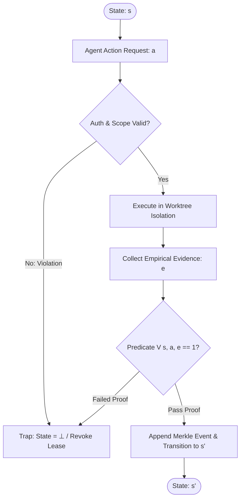

# Zero-Assumption Philosophy & Epistemic Verification

---

[Previous: Chapter 01 Index](index.md) | [Chapter Index](index.md) | [All Chapters Index](../index.md) | [Next: 01-02 The Hard Zeros & Invariants](01-02-the-hard-zeros-and-invariants.md)

---

## 1. Executive Summary & Epistemic Foundations

In large-scale distributed agentic workflows, stochastic drift, cumulative context degradation, and unverified assumptions represent existential failure modes. Standard multi-agent frameworks frequently fail when autonomous agents accept intermediate outputs without verification, assume environment configurations without observation, or hallucinate task completion based on statistical likelihood rather than empirical ground truth.

The OLT (Orchestrating Long Tasks) engine establishes an uncompromising **Zero-Assumption Philosophy**. Under this paradigm:

$$\forall \sigma \in \Sigma, \quad \text{State}(\sigma) \equiv \text{Observed}(\sigma) \land \text{Proven}(\sigma)$$

No agent, supervisor, or scheduler is permitted to infer the correctness of a state transition, file mutation, or dependency graph without an explicit, cryptographically verifiable, and falsifiable proof token.

```text
+--------------------------------------------------------------------------------------------------+
│                                 THE ZERO-ASSUMPTION PIPELINE                                     │
+--------------------------------------------------------------------------------------------------+
│                                                                                                  │
│    ┌──────────────────┐        ┌──────────────────┐        ┌──────────────────┐                  │
│    │  Agent Action /  │  --->  │   Falsifiable    │  --->  │ Cryptographic &  │                  │
│    │  Code Mutation   │        │     Evidence     │        │ Mechanical Gate  │                  │
│    └──────────────────┘        └──────────────────┘        └──────────────────┘                  │
│             │                           │                           │                            │
│             v                           v                           v                            │
│    [Zero Unchecked FS]         [Terminal Proofs &]         [State Transition  ]                  │
│    [Zero Implicit Env]         [AST Purity Verif.]         [Committed to Log  ]                  │
│                                                                                                  │
+--------------------------------------------------------------------------------------------------+
```

---

## 2. The Four Hard Zeros ($Z_4$)

The bedrock of the OLT operational model is codified through the Four Hard Zeros. These invariants form a non-negotiable verification envelope across all agent tiers:

$$Z_4 = \big\{ Z_{\text{hallucination}} = 0, \; Z_{\text{mutation}} = 0, \; Z_{\text{scope}} = 0, \; Z_{\text{assumption}} = 0 \big\}$$

```text
+-----------------------+------------------------------------------+-------------------------------+
| Invariant Metric      | Formal Description                       | Enforcement Mechanism         |
+-----------------------+------------------------------------------+-------------------------------+
| Z_hallucination = 0   | Zero fabricated outputs or phantom diffs | Anti-Mock Binary Inspections  |
+-----------------------+------------------------------------------+-------------------------------+
| Z_mutation = 0        | Zero ungranted mutations by supervisors  | Fail-Closed RBAC Interlock    |
+-----------------------+------------------------------------------+-------------------------------+
| Z_scope = 0           | Zero modifications outside assigned task | Worktree Filesystem Isolation |
+-----------------------+------------------------------------------+-------------------------------+
| Z_assumption = 0      | Zero unverified environmental assertions | Live Sensor & Diagnostic Probe|
+-----------------------+------------------------------------------+-------------------------------+
```

### A. $Z_{\text{hallucination}} = 0$: Zero Hallucination Invariant

Every claim of test passage, compilation success, or visual layout rendering must be accompanied by non-malleable, empirical artifacts. For example:

- Unit test claims require real-time execution receipts with non-zero byte payloads and exit code `0`.
- Visual UI artifacts require raw binary PNG chunk inspection (verifying 32-byte headers, IHDR chunks, and non-trivial Shannon entropy $H(X) > 3.0$).
- Synthetic mocks or fabricated pass strings emitted by LLMs trigger immediate lease revocation and quarantine.

### B. $Z_{\text{mutation}} = 0$: Zero Ungranted Supervisor Mutation

Supervisory tiers (Tier 0 Mind and Tier 1 Orchestrator) possess planning, coordination, and synthesis authorities, but are strictly prohibited from touching implementation code:

$$\text{Role}(A) \in \{\text{Mind}, \text{Orchestrator}\} \implies \text{WritePermission}(\text{TargetCode}) \equiv \emptyset$$

Any attempt by a supervisor to modify source files directly triggers an immediate `PERMISSION_DENIED` harness fault and halts the active execution frame.

### C. $Z_{\text{scope}} = 0$: Zero Scope Drift

An implementer agent assigned to a designated file scope $S_i \subset \mathcal{F}_{\text{repo}}$ is mechanically locked to $S_i$. Attempting to mutate files in $S_j \cap S_i = \emptyset$ without an explicitly granted `authority:decide` permission token results in atomic transaction rollback.

### D. $Z_{\text{assumption}} = 0$: Zero Assumption Invariant

No assumption is made regarding operating system state, tool availability, Node/Bun runtime compatibility, or lock availability. All dependencies must be probed dynamically via the Unified Diagnostics Engine prior to dispatch.

---

## 3. Mathematical Formulation of Falsifiable State Verification

Let $\mathcal{S}$ denote the state space of the OLT runtime capsule, $\mathcal{A}$ denote the set of permitted agent actions, and $\mathcal{E}$ denote the universe of empirical evidence tokens.

We define the state transition relation $\mathcal{T}: \mathcal{S} \times \mathcal{A} \times \mathcal{E} \rightarrow \mathcal{S} \cup \{\bot\}$ as:

$$\mathcal{T}(s, a, e) = \begin{cases} s' & \text{if } \mathcal{V}(s, a, e) = 1 \\ \bot & \text{if } \mathcal{V}(s, a, e) = 0 \end{cases}$$

Where $\mathcal{V}: \mathcal{S} \times \mathcal{A} \times \mathcal{E} \rightarrow \{0, 1\}$ is the Falsification Gate Predicate:

$$\mathcal{V}(s, a, e) = \mathbf{1}_{\text{Auth}}(a, s) \land \mathbf{1}_{\text{Scope}}(a, s) \land \mathbf{1}_{\text{Receipt}}(e, a) \land \mathbf{1}_{\text{AST}}(s')$$



---

## 4. Empirical Grounding & The Verification Triad

Under the Zero-Assumption model, verification is conducted through three orthogonal checks known as the **Verification Triad**:

1. **Static AST Analysis**: The AST linter parses all modified TypeScript/JavaScript files using the TypeScript Compiler API, asserting zero `any` types, zero `@ts-ignore` suppressions, strict line budgets ($L \le 300$), and explicit export facades.
2. **Deterministic Runtime Execution**: The test runner executes isolation suites via Bun, capturing stdout/stderr streams, exit codes, and timing profiles to ensure tests are genuine and non-empty.
3. **Cryptographic Capsule Ledgering**: Every successful state mutation is sealed with a SHA-256 Merkle hash chain in `events.jsonl`, creating an immutable forensic history.

```text
                     THE VERIFICATION TRIAD

                     +----------------------+
                     |   Static AST Guard   |
                     |  (Zero any / Budgets)|
                     +----------+-----------+
                                │
               +----------------+----------------+
               │                                 │
               v                                 v
     +------------------+              +------------------+
     | Dynamic Runtime  | <----------> |  Merkle Capsule  |
     | Execution Proofs |              |  Cryptographic   |
     |  (Exit Code 0)   |              |  Ledger Event    |
     +------------------+              +------------------+
```

---

## 5. Concrete Verification Engine Contracts

The verification contract interface is implemented in [`verification-contract.ts`](file:///Users/onurseckinsenoglu/repos/skills/olt/scripts/src/packets/role-contract.ts):

```typescript
export interface VerificationProofBundle {
  readonly taskId: string;
  readonly actorId: string;
  readonly scope: readonly string[];
  readonly astReceipt: {
    readonly parsedFiles: number;
    readonly anyTypeCount: number;
    readonly suppressionCount: number;
    readonly maxLineCount: number;
  };
  readonly runtimeReceipt: {
    readonly command: string;
    readonly exitCode: number;
    readonly stdoutBytes: number;
    readonly durationMs: number;
  };
  readonly sha256Digest: string;
}

export function evaluateVerificationPredicate(bundle: VerificationProofBundle): boolean {
  if (bundle.astReceipt.anyTypeCount > 0) return false;
  if (bundle.astReceipt.suppressionCount > 0) return false;
  if (bundle.astReceipt.maxLineCount > 300) return false;
  if (bundle.runtimeReceipt.exitCode !== 0) return false;
  if (bundle.runtimeReceipt.stdoutBytes === 0) return false;
  return true;
}
```

---

## 6. Failure Modes & Epistemic Countermeasures

```text
+------------------------------+------------------------------------+----------------------------------+
| Common Agentic Failure Mode  | Root Cognitive Cause               | Mechanical OLT Countermeasure    |
+------------------------------+------------------------------------+----------------------------------+
| Phantom Diff Hallucination   | LLM assumes changes were written   | Raw git diff HEAD byte checks    |
+------------------------------+------------------------------------+----------------------------------+
| False Positive Test Pass     | Empty test block or skipped suite  | Non-empty AST assertion checker  |
+------------------------------+------------------------------------+----------------------------------+
| Implicit Schema Assumption   | Assumed shape of external JSON     | Draft 2020-12 runtime validator  |
+------------------------------+------------------------------------+----------------------------------+
| Scope Pollution              | Unchecked global search/replace    | Worktree path confinement engine |
+------------------------------+------------------------------------+----------------------------------+
| Stale Cache Blindness        | Reusing outdated compiler output   | Hermetic ephemeral build folders |
+------------------------------+------------------------------------+----------------------------------+
```

---

## 7. Operational Invariants Summary

1. **Zero Silent Swallowing**: All exceptions and errors must be mapped to discrete, documented `HarnessError` codes with structured context.
2. **Zero Direct Global State**: Global variables and unstructured environment overrides are prohibited. All operational context is passed explicitly via immutable capsule configuration objects.
3. **Atomic Rollback on Violation**: Any failure of $\mathcal{V}(s, a, e)$ immediately resets the active lease, cleans the scratch directory, and logs an adversarial finding to the mailbox.
4. **Deterministic Reproducibility**: Given identical initial state $s_0$ and event stream $[e_1 \dots e_k]$, the reconstructed state $s_k$ is mathematically identical across all host environments.

---

[Previous: Chapter 01 Index](index.md) | [Chapter Index](index.md) | [All Chapters Index](../index.md) | [Next: 01-02 The Hard Zeros & Invariants](01-02-the-hard-zeros-and-invariants.md)

---
